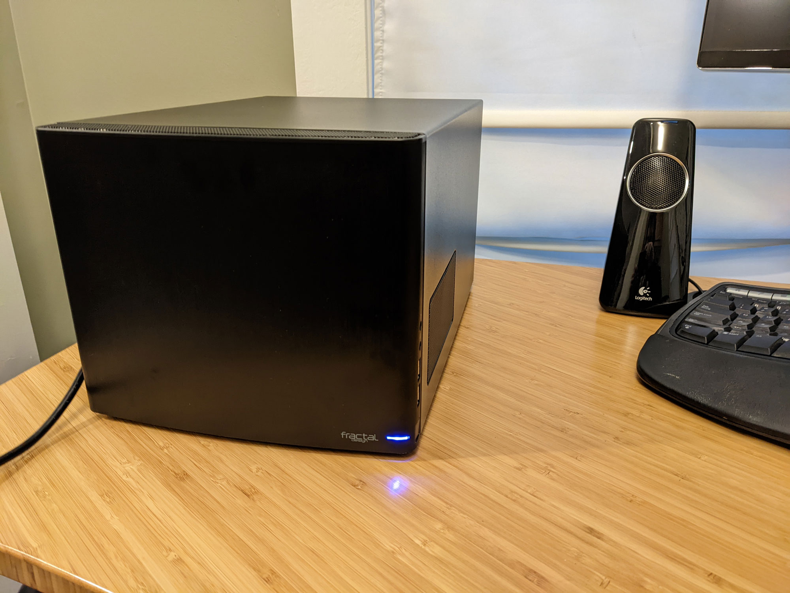
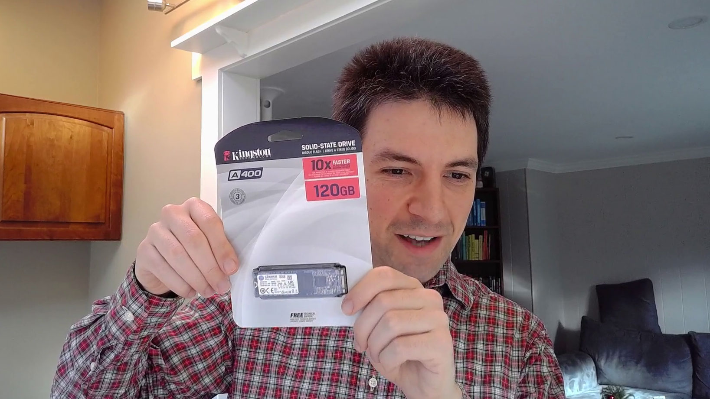

<!-- Disable linter complaints about duplicate headers -->
<!-- markdownlint-disable MD024 -->

This year, I decidded to build my first ever home storage server. It's a 32 TB system that stores all of my personal and business data with open-source software.

The server itself cost $531, and I bought four disks for $732, bringing the total cost to $1,263. It's similar in price to off-the shelf storage servers, but it offers significantly more power and customizability.

In this post, I'll walk through how I chose the parts, what mistakes I made, and my recommendations for anyone interested in building their own.

- [Background](#background)
- [Storage planning](#storage-planning)
- [How I chose parts](#how-i-chose-parts)
- [Build photos](#build-photos)
- [Benchmarking performance](#performance-benchmarks)
- [Final thoughts](#final-thoughts)


{{}}
{{}}


If you'd prefer a video explanation instead, I recorded one on YouTube.

## Background

### Why build a NAS server?

NAS stands for [network-attached storage](https://en.wikipedia.org/wiki/Network-attached_storage). A NAS server is just a server whose primary job is storing data and making it available to other computers on your network.

But every computer stores data. Why have a whole dedicated server for data?

I enjoy decoupling data storage from my computers. I upgrade my main workstation and laptop every two to three years, and migrating my data between computers was always a pain. A dedicated storage server eliminates most data migrations and facilitates sharing files between my systems.

I also have a _lot_ of data. I'm a [data hoarder](https://www.reddit.com/r/DataHoarder/), so I keep every digital photo I've ever taken, every email I've sent or received in the last 20 years, and source code for every personal project I've ever started. The total is currently 8.5 TB.

The biggest data source is my my DVD and Blu-Ray collection. I don't like relying on streaming services to keep my favorite content available, so I still buy physical copies of movies and TV shows. As soon as I get a new disc, I rip the raw image and make a streamable video file. Between the raw ISO copy and the streamable MP4s, a single disc can occupy 60 GB of disk space.

{{}}

### What's a homelab?

"Homelab" is a colloquial term that's grown in popularity in the last few years.

A homelab is a place in your home where you can experiment with IT hardware or software that you'd normally find in an office or data center. It can serve as a practice environment for new professional skills, or it can just be a place to play with interesting technology.

### Why build your own NAS?

If you're new to the homelab world, or you have no experience building PCs, I recommend that you **don't build your own NAS**.

There are off-the-shelf solutions that offer similar functionality with a gentler learning curve.

Before building my own homelab NAS, I used a 4-disk [Synology DS412+](https://www.newegg.com/synology-ds412/p/N82E16822108113) for seven years. Honestly, I loved my Synology. It was one of the best purchases I ever made. It was a gentle introduction to the world of NAS servers, and it's where I'd recommend you start if you're not sure about the whole NAS thing.

{{}}

A few months ago, my Synology failed to boot and started making a clicking noise. A chill ran up my spine as I realized how dependent I'd become on this single device. Synology servers are not user-repairable, so if a part breaks after warranty, you have to replace the whole server. And if you're dumb like me, and you've used a Synology-proprietary storage format, you can't access your data on your disks unless you buy another Synology sytem.

Fortunately, my old Synology recovered after I cleaned it out and re-seated the disks, but it was an important wake-up call. I decided to switch to something open source and using open standards for storage, so I decided on TrueNAS.

### TrueNAS and ZFS

[TrueNAS](https://truenas.com/) (formerly known as FreeNAS) is one of the most popular operating systems for storage servers. It's open-source, and it's been around for almost 20 years, so it seemed like a reliable choice.

TrueNAS uses [ZFS](https://docs.freebsd.org/en/books/handbook/zfs/), a filesystem designed specifically for storage servers. Traditional filesystems like NTFS or ext4 run on top of a data volume that manages low-level disk I/O. ZFS manages everything in the stack from the file-level logic down to disk I/O. ZFS' comprehensive control gives it more power and performance than other filesystems.

Some neat features of ZFS include:

- Aggregating multiple physical disks into a single filesystem
- Automatically repairing data corruption
- Creating point-in-time snapshots of data on disk (similar to OS X's Time Machine feature)
- Optionally encrypting or compressing data on disk

Before building this system, I had zero experience with ZFS, so I was excited to try it out.

## Storage planning

### Estimating my storage capacity needs

When I bought my Synology NAS, I initially installed three 4 TB drives and left the fourth slot empty. That gave me a total of 7 TB of usable space with Synology Hybrid Raid. Three years later, I was running out of space, so I added a fourth drive, bringing my total usable space to 10 TB.

I decided to apply the same strategy for my new build. I wanted to build a system that met my current needs with room to grow. My rough target was to start with 20 TB of usable storage and capacity for up to 30 TB if I add disks later.

ZFS doesn't let you add a new drive to an existing pool, but that feature is [under active development](https://github.com/openzfs/zfs/pull/12225). Hopefully, by the time I need to exand storage, the feature will be available in TrueNAS.

### Many small disks or fewer large disks?

ZFS is designed to survive disk failures, so it stores each block of data redundantly. This feature makes capacity planning a bit complicated because your total usable storage is no longer the sum of each disk's capacity.

ZFS creates filesystems out of "pools" of disks. The more disks in the pool, the more efficiently ZFS can use their storage capacity. For example, if you give ZFS two 10 TB drives, you [can only use half of your total disk capacity](https://wintelguy.com/zfs-calc.pl). If you instead use five 4 TB drives, ZFS gives you 14 TB of usable storage. Even though your total disk space is the same in either scenario, the five smaller drives give you 40% more usable space.

When you're building a NAS server, you need to decide whether to use a smaller quantity of large disks or a larger quantity of small disks. Smaller drives are usually cheaper in terms of $/TB, but they're more expensive to operate. Two 4 TB drives require twice the electricity of a single 8 TB drive.

I wanted to minimize my server's physical footprint, so I opted for fewer, larger drives.

### raidz 1, 2, or 3?

ZFS offers different options for redundancy: raidz1, raidz2, and raidz3. The main difference is in robustness. raidz1 can survive one disk failure without losing data. raidz2 can survive two simultaneous disk failures, and raidz3 can survive three.

What you gain in robustness, you pay for in usable storage. Given five 4 TB hard drives, here's how much usable storage you'd get from each ZFS mode:

| ZFS type | Usable storage | % of total capacity |
| -------- | -------------- | ------------------- |
| raidz1   | 15.4 TB        | 77.2%               |
| raidz2   | 11.4 TB        | 57.2%               |
| raidz3   | 7.7 TB         | 38.6%               |

I chose raidz1. With only a handful of disks, the odds of two drives failing simultaneously is fairly low.

Keep in mind that [ZFS is not a backup strategy](https://www.raidisnotabackup.com/). ZFS can protect you against disk failure, but there are many threats to your data that ZFS won't mitigate, such as accidental deletion, malware, or physical theft. I use [restic](https://restic.net) to replicate everything important to encrypted cloud backups.

The value of ZFS is that I don't have to resort to my cloud backups if one drive dies. With raidz1, I'll have to recover from backups if two drives fail. That would be a pain, but it's not worth giving up 20% of my server's usable storage for raidz2.

The more physical drives you have, the more defensive you should be about disk failure. If I had a pool of 20 disks, I'd probably use raidz2 or raidz3.

### Preventing concurrent disk failures

Naively, the probability of two disks failing at once seems vanishingly small. Based on [Backblaze's stats](https://www.backblaze.com/blog/backblaze-hard-drive-stats-for-2020/), high-quality disk drives fail at a rate of 0.5-4% per year. A 4% risk per year is 2% chance in any given week. Two simultaneous failure would happen once every 48 years.

The problem is that disks aren't statistically independent. If one disk fails, its neighbor has a substantially higher risk of dying. This is especially true if the disks are the same model, from the same manufacturing batch, and have the same operating age. Given this, I did what I could to reduce the risk of concurrent disk failures.

I chose two different models of disk from two different manufacturers. To reduce the chances of getting disks in the same manufacturing batch, I bought the disks from different vendors. I can't say how much this matters, but it didn't increase costs significantly, so why not?

{{}}

## How I chose parts

### Motherboard

The first decision was motherboard size. I've always appreciated my Synology DS412+'s nice and compact form factor. I've never built a computer with a mini-ITX motherboard before, and this seemed like a good opportunity.

I chose the [ASUS Prime A320I-K](https://www.asus.com/Motherboards-Components/Motherboards/PRIME/PRIME-A320I-K/) for a few reasons:

- It has four SATA ports, which would allow me to connect four disks directly to the motherboard.
- It supports Radeon graphics, which would spare me from buying a separate graphics card
- It's affordable, at only $98

{{}}



**Warning**: I regret this choice of motherboard. See more discussion [below](http://blog:1313/budget-nas/#motherboard-1).



I also looked at the [B450](https://www.newegg.com/asus-rog-strix-b450-i-gaming/p/N82E16813119143), which was very similar, but it was almost twice the price. The main advantage seemed to be better overclocking support, which I didn't need.

### CPU

From what I had read, ZFS is not very CPU-intensive. I ran a basic test by installing TrueNAS on a cheap Dell OptiPlex 7040 mini PC. It barely used the CPU, so it seemed safe to go with a low-powered CPU.

The important thing to me was to find a CPU that supported Radeon graphics so that I could use the A320 motherboard's onboard HDMI output.

{{}}

I settled on the AMD Athlon 3000G. At only $105 it's a good value, it supports Radeon graphics, and it has decent [CPU benchmarks](https://www.cpubenchmark.net/cpu.php?cpu=AMD+Athlon+3000G&id=3614).

### Case

When I built my last VM server, I [used a Fractal Design case](/building-a-vm-homelab/#case). It's my favorite computer case ever, so I returned to Fractal Design on this build.

I went with the [Fractal Design Node 304 Black](https://www.newegg.com/black-fractal-design-node-304-mini-itx-tower/p/N82E16811352027), a compact mini-ITX case. I liked the design because it's closer to a cube than a tower. It has six drive bays, which allows me to start with enough drives now with room to grow in the future.

{{}}

### Disk (Data)

With six drive bays available in the case, I decided to start with four 8 TB disks, which translates to 22.5 TB of usable storage under raidz1. When I need to expand in the future, a fifth disk will bring me to 30.9 TB, and a sixth would get me 37 TB.

In the 8 TB range, there aren't many drives below 7200 RPM, but you can go up to 10k RPM. For my NAS, speeds above 7200 RPM wouldn't make a difference because the bottleneck is the network. A 10k RPM drive would be louder and consume more power but offer no practical gain in performance.

I initially tried checking [Backblaze's hard drive stats](https://www.backblaze.com/blog/backblaze-drive-stats-for-2021/) to avoid failure-prone disks, but they use drives on the pricier side. At one point, I was considering $400 drives for their impressively low 0.5% failure rate, and then I realized it's irrational to spend twice as much money to reduce failure rate by a few percent.

The last pitfall to avoid is shingled magnetic recording (SMR) technology. ZFS [performs poorly on SMR drives](https://www.servethehome.com/wd-red-smr-vs-cmr-tested-avoid-red-smr/), so if you're building a NAS, avoid [known SMR drives](https://www.truenas.com/community/resources/list-of-known-smr-drives.141/). If the drive is labeled as CMR, that's conventional magnetic recording, which is fine for ZFS.

I chose the [Toshiba N300](https://www.newegg.com/toshiba-n300-hdwg480xzsta-8tb/p/N82E16822149793) and the [Seagate IronWolf](https://www.newegg.com/seagate-ironwolf-st8000vn004-8tb/p/N82E16822184796). I saw positive reviews of both on the TrueNAS forums and reddit. Both models sold for $180-190, which was a good value for the storage space.


{{}}
{{}}


### Disk (OS)

I need a dedicated disk to install the TrueNAS OS, but from what I'd read, TrueNAS doesn't demand much of its OS disk. The OS needs at least 2 GB of space, but TrueNAS doesn't read or write much to the OS disk.

{{}}

I went with the [Kingston A400](https://www.newegg.com/kingston-a400-120gb/p/N82E16820242474) because it was incredibly inexpensive &mdash; $32 for a 120 GB M.2 disk. I love M.2 disks! They don't require any cabling. They just tuck away into the motherboard, take up nearly zero space, and you never have to touch them again.

### Memory

In my research, I frequently found references to the "rule" that ZFS requires 1 GB of RAM for every TB of disk space in the system. According to ZFS developer Richard Yao, [that rule is incorrect](https://www.reddit.com/r/DataHoarder/comments/5u3385/linus_tech_tips_unboxes_1_pb_of_seagate/ddrngar/). There are some RAM-hungry ZFS features like data deduplication, but ZFS [runs fine with constrained memory](https://www.reddit.com/r/DataHoarder/comments/3s7vrd/so_you_think_zfs_needs_a_ton_of_ram_for_a_simple/).

I find memory extremely boring to shop for. I wish I had a more rigorous process for choosing RAM, but I couldn't find trustworthy bechmarks or user reports for RAM. My process was:

1. Review the list of RAM sticks [compatible with the ASUS A320I-K motherboard](https://www.asus.com/Motherboards-Components/Motherboards/CSM/PRIME-A320I-K-CSM/HelpDesk_QVL/)
1. Filter for 32 GB or 64 GB options that used only two sticks
1. Filter for brands I trust (Corsair, Crucial, G.SKILL, Kingston, Samsung, Patriot, Mushkin, HyperX)
1. Filter for options below $150

That process led me to the [CORSAIR Vengeance LPX 32GB CMK32GX4M2A2400C14 (2 x 16GB)](https://www.newegg.com/corsair-32gb-288-pin-ddr4-sdram/p/N82E16820233854) for $128.

{{}}

### Power supply unit (PSU)

When purchasing a PSU, my criteria are:

- cable modularity
- power capacity
- efficiency

Cable modularity refers to how much control you have over the PSU's cabling. Non-modular PSUs come with every cable you could possibly need permanantly attached. If you don't need some cables, you just have to tuck them away someplace in the case. Full modular PSUs are the opposite &mdash; each cable is removable, so you only need to install the cables you need. Semi-modular is the happy medium where you can attach and remove cables a la carte, but they're grouped together more than they are with a fully modular PSU.

I wanted a modular PSU to minimize cable clutter, especially since my NAS has so few components that require power. I only needed to power the motherboard, CPU, and disks. For me, the difference between a fully modular and semi-modular PSU is that fully modular would have provided me separate cables for motherboard and CPU. I preferred fewer distinct cables, so I went with semi-modular.

In terms of power capacity, basically any consumer PSU would have been sufficient. According to [PCPartPicker](https://pcpartpicker.com/), my system only requires 218 W. I would have picked a PSU in the 300-400 W range, but there weren't semi-modular options in that range. I went with the 500 W [EVGA 110-BQ-0500-K1](https://www.newegg.com/evga-500-bq-110-bq-0500-k1-500w/p/N82E16817438101).

{{}}

### 90-degree SATA cables

{{}}

One item I've never purchased before was a 90-degree SATA cable. I didn't realize I needed them until I saw that there wasn't enough space between my motherboard and PSU to plug in a standard SATA cable. These slim 90-degree cables solved the problem.

{{}}

## What's missing?

There are a few components that I intentionally excluded from my build due to price, complexity, or physical space.

### Graphics card (GPU)

With scarce physical space and motherboard ports, I didn't want a dedicated graphics card. I chose a motherboard and CPU combination that supported graphics rendering without an external card.

### Host bus adaptor (HBA)

Many NAS builds include a [host bus adaptor](https://www.truenas.com/community/threads/whats-all-the-noise-about-hbas-and-why-cant-i-use-a-raid-controller.81931/). An HBA is a chip that goes into the PCI slot of a motherboard and increases the number of disks the motherboard can support.

Using an HBA with ZFS requires [reflash the firmware](https://www.servethehome.com/ibm-serveraid-m1015-part-4/) in a process that sounds tedious and confusing. I decided to punt on the HBA until I need more storage. The ASUS A320I-K has four SATA ports, which is enough for my initial needs. I made sure to leave a PCI slot empty for a future HBA.

### ECC RAM

In researching different TrueNAS builds, I saw several posts claiming that ECC RAM (error correction code RAM) is a must-have to prevent data corruption. I ultimately decided against ECC RAM and just used standard, consumer-grade RAM.

While I obviously don't want my server to corrupt my data in RAM, I've also been using computers for the past 30 years without ECC RAM, and I've never noticed data corruption. If I was building a server for heavy load from multiple users all day, then I'd spring for a build with ECC RAM. For home needs, I think simple consumer-grade RAM should be fine.

### SLOG disk

Many ZFS builds include a separate, dedicated SSD called the [SLOG (separate intent log)](https://www.truenas.com/docs/references/slog/).

The idea is that writing to an SSD is orders of magnitude faster than writing to multiple spinning disks. When an application writes data, ZFS can quickly write it to the SSD, tell the application that the write succeeded, then asynchronously move the data from the SSD to the storage pool. The SLOG [improves write speeds](https://www.servethehome.com/exploring-best-zfs-zil-slog-ssd-intel-optane-nand/) significantly.

I decided against a SLOG disk because I'm limited by ports and drive bays. Adding a SLOG disk meant either forfeiting my only PCI slot or one of my six drive bays. I'd rather leave myself room to expand capacity later.

If I were building a rack-mounted server with 16 drive bays, I definitely would have reserved one for a SLOG disk, but it didn't seem worth it in my build. I expected that the network would be the limiting factor in my transfer speeds.

## Parts list

| Category                    | Component                                                                                                                            | I paid        |
| --------------------------- | ------------------------------------------------------------------------------------------------------------------------------------ | ------------- |
| CPU                         | [AMD Athlon 3000G](https://www.newegg.com/amd-athlon-3000g/p/274-000M-001B8)                                                         | $105.13       |
| Motherboard                 | [ASUS Prime A320I-K](https://www.asus.com/Motherboards-Components/Motherboards/PRIME/PRIME-A320I-K/)\*                               | $97.99        |
| Graphics                    | None needed &mdash; motherboard has native graphics support                                                                          | $0            |
| Disk (OS)                   | [Kingston A400 120GB](https://www.newegg.com/kingston-a400-120gb/p/N82E16820242474)                                                  | $31.90        |
| Memory                      | [CORSAIR Vengeance LPX 32GB CMK32GX4M2A2400C14 (2 x 16GB)](https://www.newegg.com/corsair-32gb-288-pin-ddr4-sdram/p/N82E16820233854) | $127.99       |
| Power                       | [EVGA 110-BQ-0500-K1 500W 80+ Bronze Semi-Modular](https://www.newegg.com/evga-500-bq-110-bq-0500-k1-500w/p/N82E16817438101)         | $44.99        |
| Case                        | [Fractal Design Node 304 Black](hhttps://www.newegg.com/black-fractal-design-node-304-mini-itx-tower/p/N82E16811352027)              | $99.99        |
| SATA cables                 | [Silverstone Tek Ultra Thin Lateral 90 Degree SATA Cables](https://www.newegg.com/p/N82E16812162042) (x2)                            | $22.30        |
| **_Total (without disks)_** |                                                                                                                                      | **_$530.29_** |
| Disk (Storage)              | [Toshiba N300 HDWG480XZSTA 8TB 7200 RPM](https://www.newegg.com/toshiba-n300-hdwg480xzsta-8tb/p/N82E16822149793) (x2)                | $372.79       |
| Disk (Storage)              | [Seagate IronWolf 8TB NAS Hard Drive 7200 RPM](https://www.newegg.com/seagate-ironwolf-st8000vn004-8tb/p/N82E16822184796) (x2)       | $359.98       |
| **Total**                   |                                                                                                                                      | **$1,263.06** |

\* Caveat: This motherboard may not work out of the box with the AMD Athlon 3000G CPU. See details [below](/budget-nas/#is-this-bios-version-incompatible-or-am-i-an-idiot).

## Compared to off-the-shelf products

For comparison, here are some off-the-shelf solutions at similar price points.

| Product       | 2022 Budget NAS                                                           | Synology DS920+                                                                          | QNAP TS-473A-8G-US                                                                 |
| ------------- | ------------------------------------------------------------------------- | ---------------------------------------------------------------------------------------- | ---------------------------------------------------------------------------------- |
| Disk bays     | 6                                                                         | 4                                                                                        | 4                                                                                  |
| RAM           | 32 GB                                                                     | 4 GB                                                                                     | 4 GB                                                                               |
| Max RAM       | 32 GB                                                                     | 8 GB                                                                                     | 8 GB                                                                               |
| CPU benchmark | [4479](https://www.cpubenchmark.net/cpu.php?cpu=AMD+Athlon+3000G&id=3614) | [3002](https://www.cpubenchmark.net/cpu.php?cpu=Intel+Celeron+J4125+%40+2.00GHz&id=3667) | [4588](https://www.cpubenchmark.net/cpu.php?cpu=AMD+Ryzen+Embedded+V1500B&id=4304) |
| Price         | $530.29                                                                   | $549.99                                                                                  | $549                                                                               |

The total cost of my build is similar to off-the-shelf solutions, but I get more value for my money. I have 8x as much RAM, and I'm not locked in to any closed-source, vendor-specific OS platform.

## Build photos

{{}}

{{}}

{{}}

{{}}


{{}}
{{}}


{{}}

{{}}

## Building the server with TinyPilot

Longtime readers of this blog may recall that I used the Raspberry Pi to create a tool specifically for building and managing servers. It's called [TinyPilot](/tinypilot/). This was the third server I've built with TinyPilot and the first I built with the new [TinyPilot Voyager 2](https://tinypilotkvm.com/product/tinypilot-voyager2?ref=mtlynch.io).

{{}}

I'm obviously biased, but building this server with the Voyager 2 was a lot of fun! I never had to connect a keyboard or monitor to the server. I could monitor video output, boot to BIOS, and mount the TrueNAS installer image all from my web browser.

{{}}

The one gap I ran into was in upgrading the BIOS. TinyPilot can mount disk images like `.img` and `.iso` files, but it doesn't yet know how to share raw files with the target computer. When I needed to load the `.CAP` file for the ASUS BIOS upgrade, I shamefully put them on a USB thumbdrive instead of keeping it a pure TinyPilot build. I hope to add support for that scenario soon so that TinyPilot can handle my next BIOS upgrade.

## Is this BIOS version incompatible? Or am I an idiot?

When I got all the components installed, the system powered on, but there was no video display.

Oh no! Did I misunderstand the motherboard's on-board video requirements? I did all the usual diagnostics: reseated the RAM, reseated the CPU, checked all the cables. Same result.

After some panicked Googling, I saw mentions that the ASUS Prime A320I-K requires a BIOS upgrade before it can work with the Athlon 3000G. I recalled seeing that warning when I was selecting parts and breezing right by it. "I've done BIOS updates," I thought. They're no big deal!

I didn't consider how I'd upgrade my BIOS _without a CPU_.

Luckily, the Ryzen 7 CPU from my [2017 homelab VM server](/building-a-vm-homelab-2017/) was [compatible](https://www.asus.com/us/Motherboards-Components/Motherboards/PRIME/PRIME-A320I-K/HelpDesk_CPU/) with the ASUS Prime A320. I borrowed the CPU and GPU from that server, and I got my new NAS server to boot!

{{}}

Strangely, even after I got the system to boot with borrowed parts, the motherboard reported that it was running BIOS version 2203, which ASUS claims _is_ compatible with the AMD Athlon 3000G CPU. But I updated to the latest BIOS, which was 5862.

{{}}

After upgrading to 5862, I _still_ couldn't get a boot. Then, I realized that I was plugging my HDMI cable into the server's DisplayPort output.

{{}}

Was this whole parts-borrowing rigamarole even necessary? There are two possibilities:

- I'm dumb and didn't notice my HDMI cable plugged into the motherboard's DisplayPort output until after I upgraded the BIOS.
- ASUS is dumb, and they incorrectly listed the Athlon 3000G as compatible with BIOS version 2203 when it isn't.

Normally, I'd accept the blame, but the ASUS BIOS was so flaky that the problem might have been on the ASUS side. In any case, I was relieved to finally boot the NAS without any borrowed parts.

{{}}

## Performance benchmarks

One of the surprises to me in writing this up is that I couldn't find any good benchmarking tools for measuring NAS performance. There are tools that run on the NAS itself to benchmark local disk I/O, but that doesn't reflect real-world usage. Most of my usage is over the network, so a local disk benchmark will completely miss bottlenecks in the networking stack.

I just made up my own rudimentary benchmark. I [generated two sets of random file data](https://github.com/mtlynch/dummy_file_generator) and then used [robocopy](https://docs.microsoft.com/en-us/windows-server/administration/windows-commands/robocopy) to measure read and write speeds between my main desktop and my NAS. This was by no means a rigorous test &mdash; I didn't do it on an isolated network, and I didn't shut down all other processes on my desktop while running the test. To put the results in perspective, I ran the same tests against my old Synology DS412+.

The first fileset was 20 GiB of 1 GiB files, and the other was 3 GiB of 1 MiB files. I took the average of three trials over both encrypted volumes and unencrypted volumes.

Performance topped out at 111 MiB/s (931 Mbps), which is suspiciously close to 1 Gbps. This suggests that the limiting factor is my networking hardware, as my switch, my desktop, and the NAS servers all have 1 Gbps Ethernet ports.

### Read performance

{{}}

For unencrypted volumes, I was surprised to see my rusty, 7-year-old Synology outperform my shiny, new TrueNAS build. Synology was 31% faster at reading small files and 10% faster on large files.

{{}}

Synology's glory was short-lived, as it completely choked on encryption. Synology's read speeds dropped by 67-75% on encrypted volumes, whereas encryption had no effect on TrueNAS. That allowed TrueNAS to outperform Synology by 2.3x for small files and 3x for large files on an encrypted volume. I keep most of my data on encrypted volumes, so this test more accurately represents my typical usage.

Read speeds were surprisingly inconsistent on the TrueNAS for small files. For every other test, performance was consistent to about 5% between trials. When I measured small file reads on TrueNAS, speeds ranged from 33 MiB/s to 67 MiB/s. I'm not sure where the inconsistency was coming from, as the same tests for 1 GiB files had much smaller variance.

### Write performance

{{}}

Although my old Synology managed to outshine TrueNAS on reads, this was not the case for writes. Even on an unencrypted volume, TrueNAS was 77% faster on small files, and the two systems performed similarly on 1 GiB files.

{{}}

Again, bringing encryption into the mix obliterates Synology's write performance. With encryption enabled, TrueNAS was 5.2x faster on small files and 3.2x faster on large files.

### Power consumption

I used a [Kill A Watt P4460 meter](http://www.p3international.com/products/p4460.html) to measure power consumption on both my old Synology and the new TrueNAS server:

|      | Synology DS412+ | 2022 NAS |
| ---- | --------------- | -------- |
| Idle | 38 W            | 60 W     |
| Load | 43 W            | 67 W     |

The new server uses 60% more power than my old Synology, which is a bit surprising. I pay about $0.17/kWh, so the server costs around $7.20/month to run.

I don't know much about what factors drive up the power draw, but one possibility is that Synology likely has a PSU that's perfectly sized to the hardware, whereas my 500 W PSU is likely inefficient at powering a system that requires only 15% of its capacity.

## Final thoughts

### Motherboard

My biggest complaint about the ASUS Prime A320I-K was its limited compatibility, but it's possible that I'm mistaken.

Beyond that, I wasn't crazy about the BIOS. Its upgrade utility was completely broken. It's supposed to be able to download and install the latest BIOS versions, but when I tried upgrading, it kept telling me that I had the latest BIOS when I didn't. I had to upgrade manually by downloading the files and loading them on a thumbdirve.


{{}}
{{}}


I also missed that the A320I-K supports a maximum of 32 GB of RAM. I'm not sure if I'll ever need to expand memory, but it would have been good to give myself some more breathing room.

If I were to do this build over, I'd go with the [Gigabyte B550I](https://www.newegg.com/gigabyte-b550i-aorus-pro-ax/p/N82E16813145222). It's $50 more, but it supports 64 GB of RAM, 2.5 Gbps Ethernet, and it has an extra M.2 slot.

### Case

I was disappointed in the Fractal Design Node 304. When I built my VM server with the Fractal Design Meshify C, the case [kept delighting me](/building-a-vm-homelab/#my-2020-server-build) with features I'd never seen on other cases. On this build, it was the opposite. I kept thinking, "Why is this a problem in this case when this has never been a problem for me before?"

It looks nice on the outside, but I found it awkward to work in. There was barely any documentation, and some of the case mechanisms weren't obvious.

It's my first mini-ITX build, and I know the case designers have to make sacrifices in the name of minimizing size, so maybe I'm judging too harshly.

### CPU

I'm happy with the Athlon 3000G, but it turned out to be massively overpowered for my needs. My TrueNAS dashboard reports that CPU load has been 99% idle for the past month of usage:

{{}}

The most important thing about the CPU was that it supported AMD's Radeon video technology, which meant that I didn't need a separate GPU, and it served that purposed. For $105, it was a great deal.

### Disk (Data)

It's a bit too early to judge disks, so check back in about five years to see how I'm liking them. So far, so good.

My biggest worry was that the disks would be too noisy, but I never hear them at all. The only time I've heard them was while running the performance benchmarks. Interestingly, they were noisiest not during reads or writes but when I was deleting files between tests.

### Power supply unit (PSU)

After seeing that the system idles at 60 W, I'm wondering if I should have put more effort into a lower-capacity power supply. 500 W is more than double capacity I need, so maybe I could have reduced my server's idle power draw with a PSU in the 300-400 W range.

### Disk (OS)

The Kingston A400 is working fine. TrueNAS puts such a minimal load on the OS disk that there isn't much for it to do. It has 90 GB free, so I could have used an even smaller drive.

There's almost zero disk activity in TrueNAS' reporting. There's a tiny I/O read every week as part of some scheduled task, but that's it.

{{}}

### TrueNAS

Coming into TrueNAS, I knew my Synology's web UI would be hard to beat. It's the most elegant and intuitive interface I've ever seen for a network appliance. They did a great job of building a clean UI that spares the end-user from technical details of the underlying filesystem.

TrueNAS has its hacker charm, but I find it a huge usability downgrade from Synology. The interface seems like it was designed by someone with a disdain for anything outside of the command-line.


{{}}
{{}}


On TrueNAS, it took me several tries to create a new volume and share it on my network. You have to jump between several disconnected menus, and there's no hints about what action you need to perform next. With Synology, there's a smooth UI flow that guides you through all the required settings.

I found third-party apps _much_ harder to install on TrueNAS. I use Plex Media Server to stream my movie and TV collection, and Plex is a pre-configured plugin on TrueNAS. It should be one of the easiest apps to install, but it took me an hour of fiddling and searching through documentation. By comparison, installing Plex on Synology takes about two minutes of clicking through a wizard.

I'm sticking with TrueNAS because I care more about platform lock-in than almost anything else, and I like supporting open-source software. If I were recommending a NAS to a friend who wasn't as ideologically driven, I'd suggest Synology.

### ZFS

ZFS is cool, but I haven't found a need for most of its features beyond RAID.

I see people talking about snapshotting, but I haven't found a need for it. I already have snapshots in my restic backup solution. They're not especially convenient, but I've been using restic for two years, and I only recall needing to recover data from a snapshot once.

One interesting feature is encrypted snapshots. You can take snapshots of a data volume without having to decrypt it. I have some data that I want to keep encrypted, but I don't need to access it very often, so being able to back it up regularly without decrypting it would be handy.

### Overall

Overall, I'm enjoying my new NAS, and I learned a lot from this build. If this had been my first experience with a NAS, I'd be miserable and confused, but starting with my Synology gave me a gentle introduction to the technologies involved. I feel like the training wheels are off, and I'm ready to tinker with the power features of ZFS and TrueNAS.

## Video

TODO: Link to YouTube video

---

_Thanks to the members of the [Blogging for Devs Community](https://bloggingfordevs.com) for providing feedback on this post._
