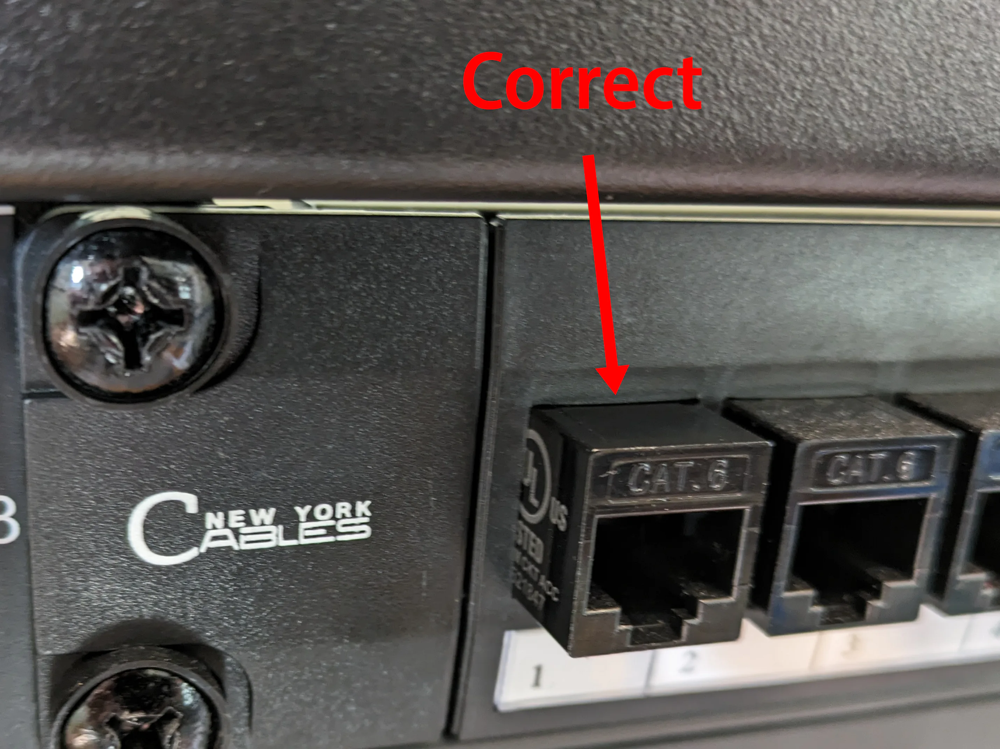
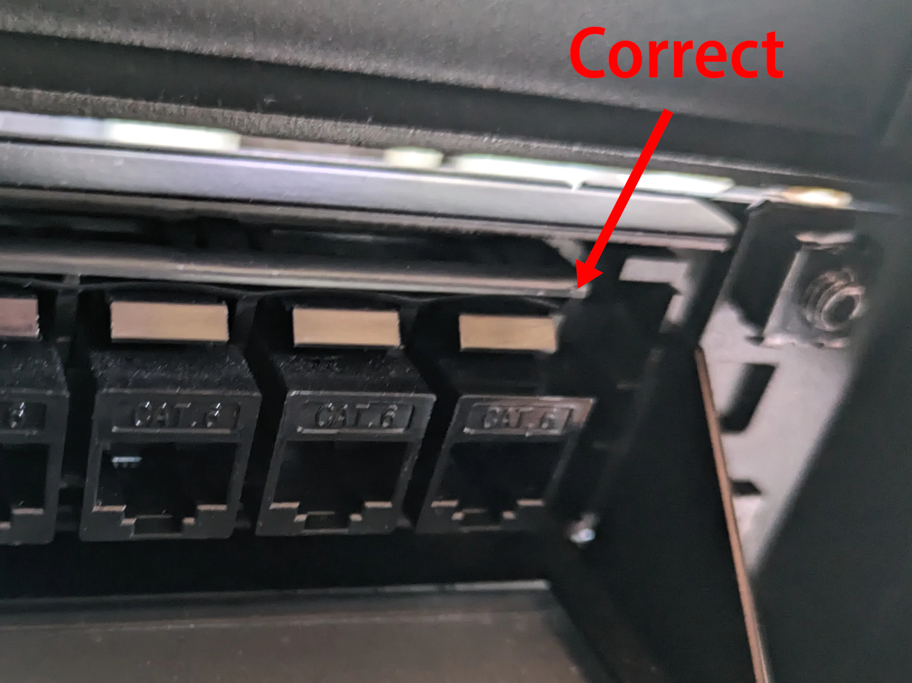

TODO: Table of contents

Six years ago, I built my [first home server](/building-a-vm-homelab-2017/). In a given week, I generally worked on four or five programming projects, and I was tired of restarting a bunch of services whenever I had to restart my main Windows desktop. I built a second PC running Linux, and I designated that as my home server. Whenever I wanted to do software development, I created a virtual machine on that server and accessed it remotely over SSH.

That first server served me well, so over the years, I've gotten more into the homelab scene and added custom NAS, firewall, and more advanced switches. And I work with Raspberry Pis so I had several Raspberry Pis everywhere.

My wife has expressed frustration at how I never clean certain parts of my office because of all the wires. I felt like, "It's not that many wires." And then I really looked and realized, it's kind of a lot of wires.

TODO: Photo of wires

## I don't want your life story &mdash; just show me the rack

If you want to skip the explanations and jump to my rack, click below.

## But I'm not a server rack guy

I had never considered buying a rack. I didn't think I was that seriously into homelab. I had some components, but there was just a VM server here, a data server there. A few switches scattered around.

People with server racks just felt way more intense than I was. They were building 50 TB backup servers, and I was just a mild homelab person.

But then I realized that if I bought a rack, it would consolidate a lot of the equipment I had around my office into one space. My wife was also happy about the idea of almost all the wires living in one self-contained unit.

## Why build a server rack at home?

### What's a homelab?

"Homelab" is a colloquial term that's grown in popularity in the last few years.

A homelab is a place in your home where you can experiment with IT hardware or software that you'd typically find in an office or data center. It can serve as a practice environment for new professional skills, or it can just be a place to play with interesting technology.

## Why this guide?

I'm a beginner, so I don't have the curse of knowledge.

This is not affiliate spam. Some are honest, but all of them are inherently biased. They have a vested interest in you purchasing more expensive gear because they make more money that way. They also have an interest in directing you to merchants

The first issue with a lot of guides to building any kind of home server equipment is that the author is almost always an affiliate partner. There's nothing inherently wrong with affiliates, but they have a bias. They make money when you buy through their links. That means that they have incentive to push you toward more expensive equipment. That's not to say that they're dishonest or that they only care about money, but they care

I'm writing this out of vanity. I do have financial interest in that I sell a product that's in the homelab space, but I've been writing homelab posts long before that.

They don't explain their thought process or why they rejected alternatives. They just say that they chose X component, and it's a great component, and you should buy it too.

## Choosing a rack

Obviously, if you're going to build a server rack, it seems like the first thing you'd choose is the rack itself.

It's not that simple.

Choosing a rack is an iterative process. You can't decide what type of rack to buy until you know what will go into your rack. But knowing what type of racks are available also informs what components make sense to buy.

I found it helpful to begin by browsing racks to get a sense of pricing, features, and size options. After that, I made a rough list of components I wanted, counted up how much space they'd take up, and then returned to my rack candidates to decide which rack fit my needs.

### How many rack units?

Racks have capacity measured in rack units (RUs). A rack unit is XX ". Most network switches are 1U, battery backups are usually 2U, servers are typically 2U.

You don't want to buy too short a rack and run out of room for your components, but you also don't want a rack that's too tall and takes up a lot of space for no reason.

As you pick components, add up how many rack units they'll take up, then add some buffer depending on how much you might want to expand your rack in the next few years.

### How deep does it need to be?

Server racks vary in depth. Most server racks are designed for enterprise-grade servers, which are up to XX" long.

I have a Dell XX servers at my office, and it's a huge hassle. It's XX" long and XX lbs. It was a pain to mount, and it will be a pain when I need to sell it. I decided that all the components in this rack would be small and require only front mounts.

I have a relatively small office, and I didn't want the rack server to dominate the space.

I looked at small rack-mountable chassis for servers, and the smallest ones were about XX" in depth, so I set that as my minimum.

### Does it need four posts or two?

Racks come in two different styles: two-post or four-post. On four-post racks, you can mount components to both the front and back.

If you plan to buy long, heavy servers, you definitely need to secure them from the front and back. If you want to minimize space, a two-post rack might be sufficient.

Still, four posts feels sturdier, so I figured why not.

### Does it need wheels?

Some server racks have wheels to allow you to move the entire structure around.

For me, wheels were a critical feature. I wanted to be able to clean behind the rack, so having wheels made it easy to move around for cleaning.

### Candidates

- **StarTech XX 18U rack**

I have a StarTech rack at my office. It's nothing exciting, but it does what it's supposed to do. It was striaghtforward to assemble, it feels sturdy, and the wheels make it easy to move around. StarTech also has a good reputation and a decent website, so I just chose between different StarTech racks.

### Review: StarTech XX 18U rack

I'm happy with the choice.

Assembling the rack was pretty straightforward. From start to finish, it took me about two and a half hours. One minor complaint is that none of the parts are labeled. The parts are distinctively shaped enough that you can match the part in the instructions to the part sitting in front of you.

The rack is depth-adjustable, and I chose the shallowest depth. But one design flaw is that when the rack is adjusted to that depth, the adjustable bridge between the back and front blocks some screw holes for the casters and other parts of the rack. The workaround was that I expanded the depth, finished screwing the casters and the base, then adjusted the depth back down. Not a huge deal, but it was an annoying design flaw.

The rack came with a grounding cable, but I can't figure out how to use it.

## Choosing a network switch

Choosing a networking switch ended up being the hardest decision of my whole rack.

Network switches get fairly pricey, so I didn't want to spend $300 on something only to have to supplement it with another component or replace it later on. And rack space is precious, so I don't want to buy a switch and then have to buy another one in a year or two and totally rearrange my rack.

### What speed do you need?

Unless you're buying something very exotic, the speeds available for a rack-mounted switch are:

- 1 Gbps
- 2.5 Gbps
- 10 Gbps

For as long as I can remember, I've had 1 Gbps Ethernet speed in my house, and that's been fine. I do most of my work online, so the bottleneck is almost always my ISP rather than my home network.

Lately, I've been finding that the bottleneck on my home storage server is my 1 Gbps network link, so I've been interested in a network upgrade.

The next steps up are either 2.5 Gbps or 10 Gbps. Given that I've been fairly satisfied with 1 Gbps, I thought 10 Gbps would probably be too big a jump, so I might as well take a smaller step to 2.5 Gbps.

But the more I read about 2.5 Gbps gear, the more complaints I saw that it's flaky and unreliable. The consensus seemed to be that it's about equally difficult to move to 2.5 Gbps or 10 Gbps, so you might as well go for 10 Gbps. So, I thought, fine! I'll do 10 Gbps.

I did run into headaches, but I'll cover that more below (TODO: link)



**Gotcha**: If you see a 10G switch, check how many of the ports support 10G. Often a 10G switch will only offer 10G speeds on a subset of ports, and the rest will be 1 Gbps.



### Managed or unmanaged network switch?

There are two kinds of network switches you can purchase: managed or unmanaged.

- **Unmanaged switches** offer no configuration. They're just dumb boxes that route network traffic. Any host connected to the switch can send network traffic to any other port on the switch.

- **Managed switches** allow you to add advanced configuration. The most common use for a managed port is to create virtual networks (VLANs)

Personally, I wanted a plain old unmanaged switch. I've never used a managed switch, and I didn't expect to have a use for it. I have an opnsense firewall with four Ethernet ports, and I could have been using that device at any point to create VLANs, and I never did. So why would I start now?

It turns out, none of the network switches that met my criteria were unmanaged, so I went with a managed switch.

I planned to accept all the default settings and not configure VLANs. Once I got my managed switch, I found that it's pretty fun to configure VLANs. Now I want to configure VLANs for everything!

### PoE or standard Ethernet?

Certain low-power devices can run entirely from power they draw from the Ethernet cable. For example, my home WiFi access point, the Ruckus RXX (TODO: link) supports PoE, so my access point conveniently needs only a single cable for both power and network connectivity. And I have PoE HATs for my Raspberry Pis, which enables them to run without a dedicated USB-C power cable.

For you to power a PoE-capable device over Ethernet, you need a switch that supports PoE. If you have PoE devices or you may purchase some in the future, you may want a PoE switch.

If you want a PoE swtich, the next question is how many PoE devices do you need to support? Most PoE switches only support PoE on a subset of their ports (TODO: is this true?), so make sure your switch has enough PoE ports for your devices now and in to the future.

The downside of PoE switches is that they consume more power and they're more expensive (TODO: check). If you buy a PoE switch but have no PoE devices, you're wasting money and power on features you can't use.

I've also seen reviews that claim PoE switches are noisier. I haven't experienced this, but it's something to look out for, as all my switches have been silent and fanless.

### How many ports do you need?

The next question in selecting a networking switch is how many Ethernet ports you need.

Obviously, you need at least as many ports as you have wired networking devices.

The harder question is figuring out how many extra ports to buy beyond your current needs. This is going to vary a lot depending on your needs and your plans for growing your homelab in the next few years.

You can buy additional switches later, but if you're buying an expensive switch, you'll want it to cover you for the next few years.

I set my minimum to be 2x my current networking hosts. I currently have eight wired networking devices, so I looked for switches with at least 16 ports.

### Candidates

| Brand       | Model                                                                                                                             | Ports  | Speed                        | Managed | Rackmount | PoE    | Price       | Notes                       |
| ----------- | --------------------------------------------------------------------------------------------------------------------------------- | ------ | ---------------------------- | ------- | --------- | ------ | ----------- | --------------------------- |
| **TP-Link** | [**TL-SG3428X**](https://www.newegg.com/tp-link-tl-sg3428x-24-x-rj45-4-x-sfp/p/0XP-0054-00091?Item=0XP-0054-00091&SoldByNewegg=1) | **24** | **4x10Gbps 24x1Gbps**        | **Yes** | **Yes**   | **No** | **$299.00** |                             |
| Netgear     | [GS108LP](https://www.amazon.com/gp/product/B07G5XBM3V/ref=ppx_yo_dt_b_asin_title_o06_s00?ie=UTF8&th=1)                           | 8      | 1 Gbps                       | No      | Yes       | Yes    | $91.72      |                             |
| Qnap        | [QSW-1105-5T-US](https://www.newegg.com/qnap-qsw-1105-5t-us-5-x-rj45/p/N82E16833831027)                                           | 5      | 2.5 Gbps                     | No      | Yes       | No     | $138.27     |                             |
| TP-Link     | [Unnamed Chinese Model](https://www.aliexpress.us/item/3256804686136282.html)                                                     | 18     | 2x10 Gbps SFP+ 16 x 2.5 Gbps | No      | Yes       | No     | $499.90     | Chinese, no warranty for US |
| Microtik    | [CRS305](https://www.amazon.com/MikroTik-CRS305-1G-4S-Gigabit-Ethernet-RouterOS/dp/B07LFKGP1L)                                    | 5      | 4x10 Gbps SFP+               | Yes     | No        | No     | $157.72     |                             |
| Microtik    | [CRS328-24P-4S+RM](https://mikrotik.com/product/crs328_24p_4s_rm#fndtn-gallery)                                                   | 28     | 4x10 Gbps SFP+ 24x1Gbps      | Yes     | Yes       | Yes    | $490.50     | Hate Microtik UI            |
| TP-Link     | [T1600G-28TS](https://www.amazon.com/TP-Link-Jetstream-24-Port-T1600G-28TS-TL-SG2424/dp/B016M1QTS2)                               | 24     | 4x10 Gbps SFP 24x1Gbps       | Yes     | Yes       | No     | $299.00     | Old?                        |
| TP-Link     | [T1600G-28PS](https://www.amazon.com/TP-Link-JetStream-T1600G-28PS-24-Port-Gigabit/dp/B0196RGV50)                                 | 24     | 4x10 Gbps SFP 24x1Gbps       | Yes     | Yes       | Yes    | $295.99     | Reviews say fans are loud   |
| TP-Link     | [T1700G-28TQ](https://www.amazon.com/TP-Link-JetStream-24-Port-Ethernet-T1700G-28TQ/dp/B01CHP5IAC)                                | 24     | 4x10 Gbps SFP 24x1Gbps       | Yes     | Yes       | No     | $958.40     |                             |

I've tried Microtik in the past, and I want to like them. They're open-source (TODO: check this), and they're a small, independent hardware company. And there are people who love their weird 90s style UI, but I found it confusing and difficult to navigate.

I've had great experience with unmanaged TP-Link switches, so I felt good about the brand. There was one in particular that had 10 2.5 Gbps ports, but it's only available in China. I could have imported it, but the device isn't tested to meet US regulations, so I didn't want the safety risk of running it in my home.

I considered the T1600G-28PS, which was like everything good about the TL-SG3428X, except it _also_ had PoE. But I read several reviews that said the fans are loud, and I didn't want a noisy switch. I went with the TL-SG3428X and figured I could get a cheaper, silent unmanaged PoE switch, as I didn't actually need 24 PoE ports.

### Review: TP-Link

Overall, I like the TP-Link XX switch pretty well. It's silent, which is a big plus. I haven't had any issues with reliability.

The TP-Link UI is not very user-friendly. I concede that some networking concepts are hard to represent in a web UI, but TP-Link has done a particularly bad job of it.
Took forever to [get VLANs right](/notes/debugging-vlans-tp-link/). I've seen how other brands like QNAP represent VLAN controls, and I think they did a much better job than TP-Link.

I regret not looking around more for a managed switch that supported PoE without a noise problem. My ideal would be to have a managed switch where at least eight of the ports have PoE without sacrificing fanless operation.

### Review: Netgear XX Unmanaged PoE Switch

I only have a handful of PoE devices, so I originally planned to power them with a small 5-port PoE switch I'd keep on a shelf. But then I ended up getting rid of the Netgear PoE switch at my office, and I adopted it into my home server rack.

It's a bit silly that I now have 2U of network switches and 2U of patch panels, and I'm only using 11 of the 44 ports, but I guess better to have too much available than too little.

## Choosing 10G NICs

If you choose a 10G switch, your work isn't over. In order to achieve 10 Gbps speeds, you need a 10G NIC for each device you want to enjoy the 10G speed. A regular 1 Gbps NIC will still work with a 10G switch, but it will be limited to 1 Gbps Ethernet speeds.

Michael Stapelberg is an excellent blogger, and he's my idol in terms of maximizing home networking speeds. He was the first homelab blogger I saw who explained how he upgraded his entire house to 10G, and now he's upgraded to 25G.

Michael Stapelberg uses Mellanox (TODO: link), so I figured that it would be good enough for me.

### Installing a XX NIC on my Windows Desktop

I bought a XX NIC from eBay and installed it in my Windows desktop, but it didn't work at all. The activity lights didn't flash at all, and Windows didn't recognize anything in the PCI slot at all.

In searching for solutions, I found someone mention that switching the Mellanox NIC to another PCI slot on their motherboard solved the problem. I was skeptical, but I tried it, and to my surprise, that fixed the issue. Windows immediately recognized the NIC and got a network connection.

The downside is that it now adds about five seconds to my boot because my BIOS hands control over to my Mellanox NIC as a boot device. I've tried tinkering with BIOS settings, but I can't find a way to skip it.

### Installing a 10G NIC on my TrueNAS server

I tried installing a XX NIC on my TrueNAS storage server, but it didn't work. TrueNAS could see the Mellanox NIC, but I couldn't get a network connection.

To see if my new NIC was a dud, I borrowed the working NIC from my Windows machine and tried it on TrueNAS, but I got the same results.

I tried swapping the NIC back to my Windows desktop. Windows recognized it, so I updated the firmware and swapped it back to my TrueNAS server, but it still couldn't get a network connection.

I bought another 10G NIC from eBay, the Chelsio 520. The Chelsio brand is one of the most common for TrueNAS servers, and Serve the Home's buyer's guide listed it as a recommended option, so I knew from the software side that TrueNAS should support it.

https://www.servethehome.com/buyers-guides/top-hardware-components-for-truenas-freenas-nas-servers/top-picks-freenas-nics-networking/

No dice, unfortunately. I couldn't find "Chelsio" in the dmesg output. I did notice it was incredibly hot to the touch, so I thought maybe I got a defective NIC that was overheating.

TODO: Link to TrueNAS forums

So, I bought yet another Chelsio NIC (the fourth 10G NIC I purchased, if you're keeping score). I got the same results, and it was similarly hot within a few seconds of my server booting.

My best guess is that the issue is motherboard incompatibility. My TrueNAS server uses a consumer-grade XX motherboard, so it may not support these Enterprise-oriented 10G NICs. I'm planning to build a new server in the next few months, so I'll try a fancier motherboard to see if that lets me use one of the three 10G NICs I have lying around.

## Choosing a UPS (battery backup)

When I lived in Manhattan, I'd experience around five power outages per year. They were all brief, but they were long enough to power cycle my computer.

To avoid surprise shutdowns, I bought a battery backup system, also known as an uninterruptible power supply (UPS). It was an APC XX, and I've used that same battery backup for XX years.

I've been happy with the APC. It's been a good investment. For short power outages, the battery keeps my systems online. For extended outages, the battery gives me enough time to gracefully shutdown my systems to avoid data loss.

The downside of the battery backup is that it's responsible for a lot of cable messiness in my office. My desktop, servers, and router were all in different corners of my office, so big, unsightly power cables had to run all around my office to connect those components to the UPS.

My battery backup was also one of the main sources of cables in my office. Before I got my rack, a single UPS was powering my desktop PC, two servers, a router, and a switch all in different corners of my office. I wanted a rack-mounted UPS so that all the power cabling could be limited to just the rack.

### Does it need to send alerts?

After I set up my rack, a co-worker mentioned that most modern UPS systems can send alerts to devices on the local network to tell them to shut down gracefully.

I actually never looked into that and didn't set that up.

TODO: Does my UPS support it?

In my experience over the past five years, extended power outages are rare. There have only been three that lasted longer a minute, and in all but one case, I was at home and able to just walk over to my desk and manually shut down my machines.

For me, automating shutdowns from my UPS isn't worth the trouble, but you might choose differently if your systems are more sensitive to hard power cuts or if you're in an area where power outages are more frequent.

### How much time do you need for a graceful shutdown?

For extended power outages, you'll need enough time to shut down your systems gracefully before they exhaust your UPS' battery. The amount of time you need depends on the size of your UPS' battery and the power draw of the systems attached to it.

I theoretically could have used my Kill-A-Watt to measure the wattage of each of my devices during normal operation and then used that to find a battery. I was too lazy for that level of rigor, so I estimated based on metrics from my previous UPS.

My APC UPS had a XX battery, and it reported 12 minutes of battery life while powering a desktop computer, a VM server, a storage server, a firewall, and a networking switch.

The UPS I ended up buying has a XX battery. It reports 30 minutes of battery life while powering a VM server, a storage server, a firewall, and a networking switch. The total power draw of all these systems in a typical workload is XX to XX. My old UPS now powers my desktop exclusively, so each UPS has a smaller load to support.

### Candidates

| Brand          | Model                                                                                                                               | Power   | Outlets | Price   |
| -------------- | ----------------------------------------------------------------------------------------------------------------------------------- | ------- | ------- | ------- |
| **CyberPower** | [**CP1500PFCRM2U**](https://www.bhphotovideo.com/c/product/1709939-REG/cyberpower_cp1500pfcrm2u_cp15_1500va_100w_2u_rackmount.html) | 1500 VA | 8       | $334.95 |
| Tripp Lite     | [SMART1500LCD](https://www.newegg.com/tripp-lite-smart1500lcd-5-15r/p/N82E16842111052)                                              | 1500 VA | 8       | $298.00 |
| CyberPower     | [CPS1500AVR](https://www.newegg.com/cyberpower-cps1500avr/p/N82E16842102006)                                                        | 1500 VA | 8       | $459.95 |
| CyberPower     | [OR700LCDRM1U](https://www.newegg.com/cyberpower-or700lcdrm1u/p/N82E16842102088)                                                    | 700 VA  | 4       | $299.00 |

### Review: Tripp Lite SMART1500LCD

- Grade: D

I originally purchased the Tripp Lite SMART1500LCD, but it was incredibly noisy.

I didn't even realize battery backups could _be_ noisy. My APC UPS was completely silent except when it loses power and fails over to battery backup.

The Tripp Lite UPS was instantly the loudest thing in my rack, maybe the loudest thing in my whole house. It was like a hair dryer running on low. The UPS fans were so loud that my wife could hear my server rack a floor away in our house.

Did I just get a defective unit? Surely, a UPS can't be designed to be this loud all the time, right?

I reached out to Tripp Lite customer support with a video of the UPS' noise level. They said that it was working as intended, and it's supposed to be that loud.

I tried to accept the noise for a few days, but it was so distracting that I gave up after day two.

To my surprise, I realized Newegg's return policy was "replacement only." I'd always had an easy return policy with Newegg so I didn't even think to check. Fortunately, I begged them, and they refunded me. Score once again for Newegg.

### Review: CyberPower CP1500PFCRM2U

- Grade: A

When I realized the Tripp Lite UPS was a no-go, I ordered the other UPS I considered: the CyberPower CP1500PFCRM2U.

The first thing I did was turn it on and listen for noise. Nothing! It was completely silent. It generates noise when there's a power cut as it fails over to battery, but that's tolerable.

The CyberPower UPS has performed great. I love that it's silent. The LCD is user-friendly and has useful metrics about power consumption. You can also turns the display off to have fewer flashing lights on your rack. It reports XX minutes of battery life when I cut power, which is plenty of time for me to shut my systems down.

## Choosing a power strip

Even though my rack has a UPS with many power outlets, I find it useful to have a simple power strip as well.

Some of the components in my rack are non-essential and don't need to stay online during a power outage.

For example, I keep a little IoT device in my rack that [monitors performance of my solar panels](/notes/debugging-vlans-tp-link/#mistake-2-forgetting-to-add-my-router-to-the-vlan). That device is totally extraneous, so I'm fine if it goes offline during a power failure. In fact, I prefer it to go offline because I don't want to squander my limited battery life in an outage on a solar monitor.

### Candidates

Power strips are, frankly, not so exciting, so I didn't shop around very much. I just looked at two.

| Brand          | Model                                                                                                                  | Outlets | Price      |
| -------------- | ---------------------------------------------------------------------------------------------------------------------- | ------- | ---------- |
| **Tripp Lite** | [**RS-1215-RA**](https://www.newegg.com/black-tripp-lite-12-outlets-power-strip/p/N82E16812120265?Item=9SIAFVF75F0869) | **12**  | **$78.11** |
| CyberPower     | [CPS1215RMS](https://www.newegg.com/cyberpower-cps1215rms-12-outlets-nema-5-15r/p/N82E16842102076)                     | 12      | $59.84     |

### Review: CyberPower CPS1215RMS

- Grade: C

I bought this power strip a few years ago for the TinyPilot office (TODO: link). My main issue is that the outlets are too close together. A lot of the things I plug in at the office are bricks, so they cover two outlets.

### Review: Tripp Lite RS-1215-RA

- Grade: B+

This power strip has worked well. The rear outlets are spaced apart so that brick-style power plugs still only take up one outlet.

The front outlets are all unused, but I find them useful occasionally if I have a device I want to test for a few hours, and I don't want to route it to the UPS or rear of the rack.

## Choosing rack shelves

Some of my existing office infrastructure has no rack mounting option, so I needed a shelf:

- My OPNsense firewall server (running on a XX mini PC)
- My TinyPilot
- Dell XX mini PC (I use it for testing)

It's about two 2U shelves of stuff, though I could theoretically cram it into one shelf if I really wanted.

### Candidates

### Review: Star-Tech shelves

- Grade: D

I originally purchased the Star-Tech shelves because Star-Tech has such a good reputation in the server world.

When I installed them into my rack, I thought I must be misunderstanding how they work. They have a bottom lip that bends downward into the next rack slot.

This downward lip forces you to either allocate 3U to each of your 2U shelves or you have to shift everything down by 0.5U.

I couldn't even figure out a purpose for the lip. It would make sense if it curved up because that would protect items on the shelf from slipping off, but why bend down? It didn't look like it provided any structural support to the shelf either.

I scoured reviews of this shelf to see if anyone else was talking about this bizarre design choice. When other reviewers mentioned it, they didn't seem to mind that much. They were just like, "Oh, yeah, it extends past the bottom a bit." Huh? Why would anyone accept that?

I'm still wondering if I'm crazy or there's something I'm missing about why Star-Tech's downward-facing lips are a good idea, but I promptly returned mine and found alternative rack shelves on Amazon.

### Review: XX shelves

- Grade: A

I found these no-name shelves on Amazon, and they worked great.

These shelves have a lip, but it bends upward, which is actually useful. Bending upward means that the lip acts as a guard to prevent components from sliding off the rack.

Other than that, they were easy to install, they're low in price, and they keep themselves within the 2U space they promise.

## Choosing a patch panel

### What the heck is a patch panel?

From reading a lot of homelab blog posts, I noticed a lot of other homelabbers integrating a patch panel into their racks.

When it came time to finally build my server rack, I finally had to ask the question, "What the heck is a patch panel?"

Shopping around for patch panels made me even more confused. It's just a row of empty spaces? Huh? What's the point of that?

The point of a patch panel didn't truly click for me until I built the rack. In short, the patch panel keeps the clutter of your networking cables in the rear of your rack rather than in

For example, without a patch panel, connecting my managed switch to my PoE switch would look like this:

TODO: Photo

Instead, the patch panel lets me route networking cables into the rear of my rack.

TODO: Photo


**Tip**: I recommend having a patch panel immediately adjacent to every switch in your rack.


### Candidates

###

| Patch Panel | [https://www.amazon.com/dp/B08LLDCRCV/ref=cm_sw_r_apan_glt_i_2AEKK799CAJQ591DCSWS?\_encoding=UTF8&th=1](https://www.amazon.com/dp/B08LLDCRCV/ref=cm_sw_r_apan_glt_i_2AEKK799CAJQ591DCSWS?_encoding=UTF8&th=1) |
| ----------- | ------------------------------------------------------------------------------------------------------------------------------------------------------------------------------------------------------------- |

### Review: New York Patch Panel

- Grade: B

It's fine. One of the reasons I chose it was that I saw in reviews it has a rear bar that helps support Ethernet cables. In my rack, the rear bar doesn't do anything. It's too close to the Ethernet ports to provide support, and they don't seem to need it anyway.

My complaint is with the labels. It's slips of paper under plastic, like a landline phone would have for speed dial in the 90s. That's too permanent. What if I change

### Review: 16-port patch panel

- Grade: B

I like that the labels are little whiteboard panels. I had whiteboard markers on hand, but they were too big to write in such tiny spaces. I bought ultra fine tip whiteboard markers (TODO: link), and those worked well.

## Choosing a Raspberry Pi rack mount

I do a lot of professional and hobby projects with the Raspberry Pi, a small, inexpensive single-board computer.

I'd seen rack mounts for the Raspberry Pi, so I thought it would be fun to add one to my rack.

### Review: UCTRONICS Ultimate Rack with PoE Functionality

[UCTRONICS Ultimate Rack with PoE Functionality](https://www.uctronics.com/raspberry-pi/1u-rack-mount/raspberry-pi-4b-rack-mount-19-inch-1u-with-poe-and-oled-screen.html) - $189.99

- Grade: C+

The rack mount is okay not great. It's a decent value for the price. PoE HATs for a Raspberry Pi 4 are generally around $XX, so that alone is like XX% of the price.

The craftsmanship on the rack mount itself is mediocre. The pieces don't fit together that well. There are substantial gaps around the HDMI ports.

The HDMI ports are also secured poorly to the mount. When I plug in an HDMI cable, the connector bends and strains. I worry they're going to snap off one day.

PoE tends to generate a lot of heat, so it's good that these come with an integrated fan, but the fan is loud. It's too loud for me, and I've disabled them on each of my Pis. That works fine as long as I don't do anything CPU-intensive on the Pi.

Lastly, the instructions are terrible. Step one is to screw in the OLED. Okay, that's fine. Step two is to screw in the power button. Sure, easy peasy. Step three is: okay, put together five other things simultaneously!

TODO: Photo

## Choosing cage nuts

Rack-monted components attach to your rack with a standard screw and nut. Most rack-mountable components come with their own cage nuts, but you'll need some extras for the ones that don't.

I read recommendations to buy a special tool for inserting and removing cage nuts. It might make sense if you work in a data center and are working with cage nuts all the time. For occasional work, a small flathead screwdriver is fine.

### Review: XX Cage nuts

- Grade: D

These were the only cage nuts I tried, but I don't recommend them. They were worse quality than the cage nuts that came free with other components.

Other cage nuts I've tried are shaped so that you can screw them in most of the way just using your fingers. These ones, you couldn't. I also found that the screw heads were made of a weak metal, so tightening the screws quickly began stripping the heads.

The washers are too wide, so they take up a lot of unnecessary space. In my rack, the washers were so wide that they'd collide with washers in adjacent rack slots, making it hard to screw in components next to each other.

## Choosing Ethernet cables

If you're converting an existing setup to a server rack, you'll likely need new Ethernet cables. If you're including a patch panel, remember to buy short (6-12") cables (sometimes called "patch cables") to connect the patch panel to your switch.

You'll need a mix of different cable lengths. For example, on my rack, port 16 on my switch is just XX" from port 16 on my patchpanel, but port 1 on my switch is XX" from its corresponding patch panel port.

I bought 6", 12", and 3' Ethernet cables at a ratio of about 5:2:1.

Some people are creative and buy different colors to represent different functionality. I'm boring and just stuck with blue and black Ethernet cables because they look standard and proper to me.

## Choosing fiber cables

### Ethernet, DAC, or fiber?

If you're just getting 1 Gbps speeds, you don't have to choose anything.

Once you go above that, you have to choose between Ethernet or fiber cables.

With Ethernet, it's pretty simple. Your Ethernet adapter has an Ethernet port, so you plug in an Ethernet cable. Easy peasy!

With fiber, it gets more complicated. You have an SFP or SFP+ port, and you have to decide what adapter you want to convert it to something else. You can convert it to DAC or fiber. But then there's a few types of fiber.

In my case, my network switch's 10G ports were SFP+, so I knew the connection had to end in SFP+. And my 10G NICs had SFP+ ports, so the connection had to start with SFP+ as well.

So my connection would look like:

1. SFP+ port on my network swtich
1. SFP+ to _something_ Transceiver
1. _something_ cable
1. SFP+ to _something_ Transceiver
1. SFP+ port on my 10G NIC

I'd need to convert SFP+ to something else to connect the two ends. The options were:

1. RJ45 (Ethernet)
1. LC (Fiber)
1. DAC (Copper)

The problem was that the connection had to run through my patch panel. I was able to find patch keys for Ethernet and fiber, but nothing for DAC. I still don't understand why DAC fiber keys don't exist or if I just am not seeing how to connect DAC through a patch panel.

That reduced my options to just to just RJ45 or LC.

### Ethernet vs. fiber

I couldn't find many practical differences between RJ45 and LC. LC is thinner, so I find it a bit more visually appealing. But it means a different type of cable than all my other components, which are Ethernet. The price of all the components together was surprising as well. Either route I chose, I needed:

- Three transceivers (for my switch, desktop, and storage server)
- One 16' cable (desktop to switch)
- One 3' cable (storage server to switch)
- Two XX" patch cables
- Four patch keys

The other surprise with fiber is how expensive the cabling is. SFP+ to fiber adapters cost $XX, and you need them at either end of the connection. I bought a box of XX" fiber patch cables not really paying attention to the price, and then I realized I spent $XX. On little cables!

| Component                                                       | Ethernet price | Fiber price |
| --------------------------------------------------------------- | -------------- | ----------- |
| Three transceivers (for my switch, desktop, and storage server) | $150           | $60         |
| One XX' cable (desktop to switch)                               | $XX            | $15         |
| One XX' cable (storage server to switch)                        | $XX            | $10         |
| Two XX" patch cables                                            | $0\*           | $30         |
| Four patch keys                                                 | $0\*           | $15         |
| Total                                                           | **$XX**        | **$XX**     |

\* These effectively would cost no extra money because I had to buy these anyway for the rest of the ports in my switch.



**Gotcha**: If you use fiber, make sure that all your SFP+ cables match in "mode." You can't mix single-mode fiber with multimode fiber.



| Component                                                                                                   | Price  |
| ----------------------------------------------------------------------------------------------------------- | ------ |
| [Cat6 Coupler (25-pack)](https://www.amazon.com/dp/B075ZPGV1H)                                              | $22.99 |
| [**Fiber LC coupler (5-pack)**](https://www.amazon.com/dp/B01B5AG0TI)                                       | $18.99 |
| [**Cable Matters SFP+ to LC Multi Mode Fiber Transceiver**](https://www.amazon.com/dp/B07TTKHG6T/) (2-pack) | $40.49 |
| [**LC to LC Fiber patch cables (0.2m)**](https://www.amazon.com/dp/B08MCPBCFD)                              | $29.99 |
| [12" Ethernet Cables (10-pack)](https://www.amazon.com/dp/B07MVT1P2P/)                                      | $18.99 |
| [6" Ethernet Cables (25-pack)](https://www.amazon.com/dp/B00XIFJSEI)                                        | $33.99 |
| [16' Fiber Cable](https://www.amazon.com/dp/B00U7UP1UM/)                                                    | $14.49 |
| [3' Fiber Cable](https://www.amazon.com/dp/B00T5796DQ/)                                                     | $9.99  |

Note: Seems like you can't get DAC keystone, so you have to convert to either RJ45 or Fiber. Fiber converters seem to be cheaper.

## Choosing cable ties

Cable ties are optional, but if you want to keep everything clean, you either need to cut your own cables or wrap up the excess with cable ties. You can also join groups of wires together with cable ties.

### Velcro vs. rubber cable ties

I've tried two styles of cable ties: velcro and rubber.

The velcro ones are secure, but they're a bit too secure. They take me about 5 seconds to attach or detach, whereas the rubber ones I can detach almost instantly, and I can attach them in a second or two.

### Choosing

[UMUST Silicone Cable Ties](https://www.amazon.com/dp/B0B5RM6NLP/) - $8.99

## What I already had

### Router: XX with opnsense

I built a router a few years ago. I bought a cheap XX unit from China and installed opnsense. If I were doing it again, I'd have bought a Protectli unit since they're investing more in open firmware and trusted hardware.

### Out-of-band Management: TinyPilot Voyager 2a

I generally connect to components in my rack over SSH or web interfaces. In times where I need to reinstall the OS, change boot settings, or when I screw up the network settings, I need to type

I created a product called TinyPilot to provide remote access. It's built on top of a Raspberry Pi, and it uses the Pi to emulate a keyboard, mouse, and USB drive. It also captures display output from the target computer. So instead of having to drag a keyboard and monitor over to my rack, I can plug in TinyPilot when I need hardware-level access.

I'm obviously a bit biased because it's my product, but I've been happy with TinyPilot.

## How do I arrange components in a rack?

Once I selected my rack components, the next step was figuring out how to lay everything out. I tried to find guides for how you're supposed to do it, and I didn't find much guidance.

Surprisingly, I couldn't find reliable guidance on how to arrange the components in a server rack, so I just reasoned out what made sense to me.

To plan the layout, I used a Google Sheets document and color coded it. This was also helpful in thinking about what size rack to purchase. I wanted the rack to contain everything I wanted now plus a little room to grow.

### Place heavy components on the bottom of your rack

The one piece of guidance around server rack layouts that everyone seemed to agree on is that heavier components should go on the bottom.

The rack has a lot of expensive equipment. You don't want it to fall over and damage things or, worse, injure someone. So, you want it to have a low center of gravity to maximize stability.

The heaviest component in my rack by far is the UPS, weighing in at a whopping XX lbs (XX kg).

I haven't built my rack-mounted storage server yet, but I'm leaving space for it on the bottom, as it will be the next heaviest thing after the UPS, as disks are heavy.

Patch panels weigh almost nothing, and networking switches are fairly light as well. For this reason, most server racks keep these components in the top two slots of the rack.

### Keep components with front-facing connections close together

It wasn't obvious to me until I built my server, but it's important to closely arrange components that connect through front-facing ports. For example, my patch panel and networking switch go in adjacent rack slots because I'd otherwise have Ethernet cables stretched over other components in the rack.

### Rear cables don't matter so much

Some of the guidance I read said to arrange components so that you can minimize the length of your power cables. I didn't see the point.

Maybe minimizing cable length is important in a data center where you're replicating the same setup hundreds of times. In a home environment, I don't see the difference between connecting my server to my UPS with a 2 ft. power cable vs. a 4 ft. power cable.

### Make sure back ports aren't blocked

One gotcha I didn't anticipate is that some components have rear ports that you can accidentally block if you put them between components that are much deeper.

I initially considered putting my rack shelf in the slot above my power strip, but I realized that would make it hard for me to reach my power strip's rear outlets. Instead, I put the power strip below my Pi rack, as they're both shallow components, so I still can reach the power strip's rear outlets easily.

## My final rack setup

TODO: List of components and prices

| Component                       | Choice        | Price | Satisfaction |
| ------------------------------- | ------------- | ----- | ------------ |
| Server rack                     | XX            | XX    | B+           |
| Network switch (managed)        | XX            | XX    | C+           |
| Network switch (PoE, unmanaged) | XX            | XX    | C+           |
| UPS                             | CyberPower XX | XX    | A+           |
| Rack shelves                    | XX            | XX    | A            |
| Raspberry Pi rack mount         | XX            | XX    | B            |
| Power strip                     | XX            | XX    | A            |
| RJ45 Patch keys                 | XX            | XX    | ??           |
| LC Patch keys                   | XX            | XX    | ??           |

TODO: Photos

## Next steps in my rack

### Rack-mounted server

You may have noticed that my server rack is conspicuously missing one common component: a server.

I still have my VM server and storage server that I rebuilt in the last few years. I'm planning to migrate them to rack-mounted chassis the next time I do some upgrades, but I've punted that task since building the rack was a significant enough project on its own.

### Are there hats for my rack?

One of the things I've been searching for without success is a "hat" for my rack. The top of my rack is just open space.

I'd love to find some top that fits securely into the open space on top of my rack and lets me put things on top of it. It would be convenient extra storage if I could find something sturdy and easy to remove, but I can't find anything like that.

If you know a solution to this, let me know in the comments.

## Avoiding mistakes I made

### Test the UPS before mounting it

The UPS was, by far, the hardest component to mount in the rack. I don't understand how people do it. It's a XX lb device, and you need at least one hand holding it in place and one hand securing the screws. I eventually decided it was a two-person job and called my wife in for reinforcements.

But you don't want to go through all that work and find out, like I did, that the UPS is too loud to earn a permanent place in your rack. Or it could just be a dead device, and you don't want to find that out after you mount it.

So before you mount your UPS, remember to test it for functionality and noise before you go to the trouble of mounting it.

### Check return policies

on Newegg: I'd never seen anything on Newegg before that was replacement-only, so I took it for granted that I'd be able to return it if I didn't like it.

### Check UPS reviews for noise complaints

Some UPS devices are totally silent and some produce constant noise. If it's anywhere near you, take noise into consideration.

### Cage nuts aren't supposed to hurt

When you install components into your rack, you screw special cage screws through the mounting holes of whatever you're installing, and the cage screw goes into a cage nut.

Cage nuts have a clever design in that they clip into the rack. That way, you don't have to hold the nut in place while you're screwing the component into your rack.

But... nobody told me about these clips. I thought cage nuts worked like other nuts where you just hold them behind the thing you're screwing into, and then you tighten it by hand.

It was only after installing about eight cage nuts and cursing the terrible design of this thing that has sharp corners that cut into my fingertips that I thought I may be doing something wrong.


**Tip**: If you find yourself exerting a lot of force or feeling physical pain while building computer hardware, you're probably doing something wrong. Server equipment is designed so that middle-aged, out-of-shape IT people can build them, so you're not expected to be in peak physical condition.


### Some PCI slots don't like 10G NICs

When I installed my Mellanox 10G NIC into my desktop, Windows didn't detect it at all. I tried re-seating it, and I saw the same results. I tried downloading the latest drivers, but Windows still wasn't seeing the device at all in Device Manager.

Finally, I stumbled across a forum post where someone reported that their Mellanox card worked when they switched it to a different PCI slot. I tried a different PCI slot on my motherboard, and voila! It worked perfectly.

I still don't understand why the PCI slot mattered. According to my motherboard's documentation, the two PCI slots are supposed to be identical, but one worked, and the other didn't.

### Flash Mellanox cards to latest firmware on a Windows system

I found that management software for 10G NICs only works on Windows. When I was trying to install a NIC on my TrueNAS Core server (FreeBSD),

Didn't flash Mellanox card before installing it in TrueNAS.

https://network.nvidia.com/products/adapter-software/ethernet/windows/winof-2/

### Incorrect length Ethernet cables

Patch cables

### Don't mix SFP+ multimode and single mode fiber cables

The first day that I installed my Mellanox NIC on my Windows desktop, everything worked fine.

After around 24 hours of use, I noticed my Ethernet connection suddenly disconnecting and reconnecting every few seconds. I rebooted, and the problem went away.

24 hours later, I saw the same issue. This time, I tried disconnecting and reconnecting the fiber cable from the switch, and the problem persisted. I tried instead skipping the patch panel and connecting the cable from my desktop directly to the switch.

That worked, and the connection stayed stable for several days. That suggested the problem was either in the patch cable or the patch panel key. I tried a different set of patch keys and patch cables, and the problem came back within a day.

Then I went back and looked at whether there was some sort of incompatibility between my patch cables or patch keys. And then I spotted it: my patch cables were SFP+ single mode, whereas my long fiber cables were SFP+ multimode. I didn't even know there was a difference in fiber cables, but apparently there is, and they don't get along.

I bought a new set of SFP+ multimode fiber cables, and the problem went away. Unfortunately, I discovered the problem three days after the return window for my $XX box of SFP+ single mode fiber cables had closed, so if anyone wants some single mode SFP+ patch cables, let me know.

### Don't install patch keys backwards

I'm going to sound like a moron here, but I installed my patch panel keys incorrectly twice before I realized how to do it the correct way. Now that I've seen the correct way, what I thought was correct before looks absurd, but it's my first rack!

So, my first attempt was like this:

{{}}

It fit snugly, and it was easy to plug Ethernet cables into it like that, so I thought that was right. But I quickly noticed it was popping out of the patch panel every time I removed an Ethernet cable.

"I must have done this backwards," I thought. So I plugged the keys in from the rear. It was tougher to get them in, but they stayed in place better.


{{}}
{{}}


I had them like this for six months!

It wasn't until I bought my second patch panel and experimented with installing the keys before I installed the patch panel that I realized there was a different method.

It turns out that the little ridge on the top isn't for decoration. I had them like this for three months before I realized that was incorrect too. They go in from the back and click in. You'll hear a little click when they slot into the correct position. The front face should be roughly flush with the front of the patch panel.

TODO: Photos

## Thoughts on my life with a rack

I'm happy with my new rack, and I have no regrets about the investment. It definitely beats my old setup of having bits and pieces of infrastructure scattered around my office. Now everything is in one location with clear organization.

I underestimated how nice it would be to have my TinyPilot physically close to all of my devices. Before the rack, I used to keep my TinyPilot on the floor next to my desk. If I ever needed to debug something on a server or a Raspberry Pi on the other side of my office, I avoided it because it involved shutting down the TinyPilot, disconnecting a lot of wires, then reconnecting them on the other side of the room.

With everything now physically adjacent, it's easy for me to quickly plug TinyPilot in to any misbehaving device for low-level access. It came in handy for things like exploring NixOS and figuring out how to install NixOS on a Raspberry Pi.
