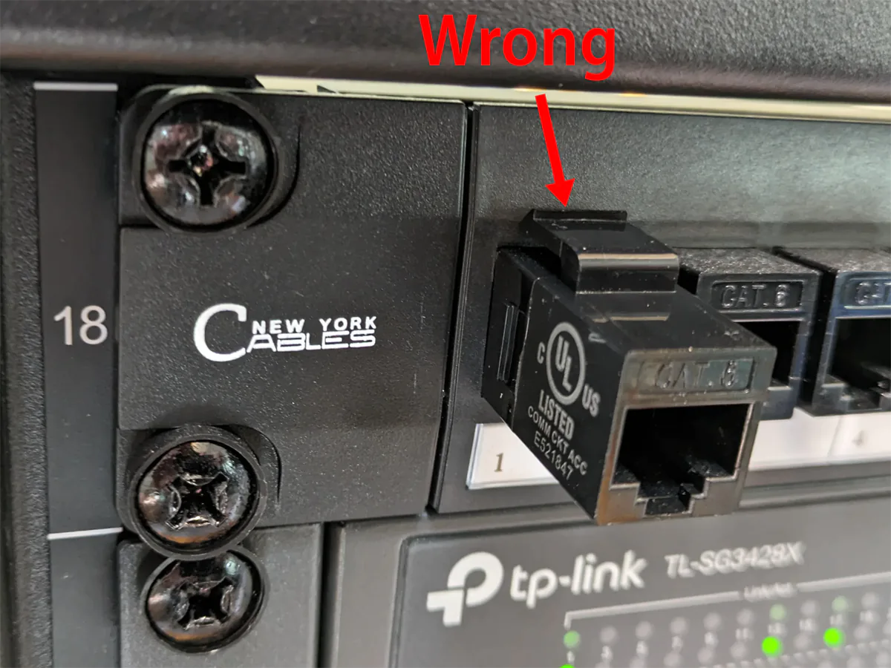

Seven years ago, I built my [first home server](/building-a-vm-homelab-2017/). It made a huge difference to my software development workflow, so over the years, I've gotten more into the homelab scene and added custom-built storage server, a dedicated firewall, and more advanced switches.

My wife has pointed out that I never clean certain parts of my office because of all the wires. I thought, "What? This is a normal amount of wires." But then I started looking at them and realized it was kind of a lot of wires...


{{}}
{{}}


I saw a lot of tech enthusiasts buy server racks for their home, but I never thought of myself as a server rack guy. I just had a VM server here, a data server there. Maybe a few switches scattered around. Having a server rack felt like an admission that I wasn't just a casual home server guy, but an intense homelab maniac.

But then I gave in and bought a rack, and I'm now embracing being a homelab weirdo. It's so much better having all of my computers in one place where the wiring can be semi-organized.

TODO: Photo of finished rack

## I don't want your life story &mdash; just show me the rack

If you want to skip the explanations and jump to my rack, click below.

TODO: Table of contents

## Why build a server rack at home?

### What's a homelab?

"Homelab" is a colloquial term that's grown in popularity in the last few years.

A homelab is a place in your home where you can experiment with IT hardware or software that you'd typically find in an office or data center. It can serve as a practice environment for new professional skills, or it can just be a place to play with interesting technology.

## Why this guide?

### By a beginner for beginners

Even though I've been doing homelab stuff for the past few years, I still consider myself a beginner, and this is a beginner-level guide.

I've read a lot of other homelab guides where the author sounds like they're building their 20th rack. They don't explain their thought process for choosing components or why they rejected alternatives. At this point, they probably don't even know. They've been doing it so long that the decisions have become unconscious.

Because this is my first time building a server rack, I'm free from the curse of knowledge (TODO: link). I'm walking you through how I approached the process for the first time so that you can follow along.

I made mistakes in this process, and I didn't build the ideal rack, but I think readers learn better by seeing mistakes instead of seeing only perfect racks where the author says they did everything perfectly.

### No conflict of interest

The uncomfortable truth about most homelab blog posts is that they're funded by affiliate links.

If you're not familiar with affiliate links, it means that if a blog post links to a product, and the reader makes a purchase through that link, the author of the blog post receives a commission.

Authors can still provide valuable information despite using affiliate links, but it creates a clear conflict of interest. An author is inherently biased if they get paid by merchants they recommend. And it incentivizes recommending expensive products, as commissions are usually percentage-based.

I'm not getting paid by anyone or receiving any free products.

I write my blog out of vanity. My payment is hearing people tell me that they found the article interesting or useful.

My rack does contain a TinyPilot, a hardware device that I created, but I'll disclose that whenever it's mentioned.

## Choosing a rack

If you're buildig a server rack, it seems like the first thing you'd choose is the rack itself, but it's not that simple.

Choosing a rack is an iterative process. You can't decide what type of rack to buy until you know what will go into your rack. But knowing what type of racks are available also informs what components to buy.

Here's the process I followed to pick a server rack:

1. Browse racks casually to get a high-level view of pricing, features, and size options.
1. Make a rough list of components I want for my rack.
1. Calculate how much rack height and depth I'll need for those components.
1. Narrow the list of racks that meet my needs.
1. Repeat steps 2-4 until I've made a final selection.

### How many rack units?

Racks have capacity measured in rack units (RUs). A rack unit is XX ". Most network switches are 1U, battery backups are usually 2U, servers are typically 2U.

You don't want to buy too short a rack and run out of room for your components, but you also don't want a rack that's too tall and takes up a lot of space for no reason.

As you pick components, add up how many rack units they'll take up. Leave some extra buffer based on how much you might want to expand your rack in the next few years.

### How deep does it need to be?

Server racks vary in depth. Most server racks are designed for enterprise-grade servers, which are up to XX" long.

My office has a XX server, and it's a huge hassle. It's XX" long and XX lbs. It was a pain to mount, and it will be a pain when I need to sell it.

I have a relatively small office, and I didn't want the rack server to dominate the space. For my home rack, I decided to limit myself to components that are shallow enough to only need front mounts.

I looked at small rack-mountable chassis for servers, and the smallest ones were about XX" in depth, so I set that as my minimum.

### Does it need four posts or two?

Racks come in two different styles: two-post or four-post. On four-post racks, you can mount components to both the front and back.

If you plan to buy long, heavy servers, you definitely need to secure them from the front and back. If you want to minimize space, a two-post rack might be sufficient.

For my rack, four posts felt a bit sturdier, so I figured why not.

### Does it need wheels?

Some server racks have wheels to allow you to move the entire structure around.

For me, wheels were a critical feature. I wanted to be able to clean behind the rack, so having wheels made it easy to move around for cleaning.

### Candidates

- **[StarTech 4POSTRACK18U 18U rack](https://www.startech.com/en-us/server-management/4postrack18u)**: $315.99

StarTech also has a good reputation and a decent website, so I just chose between different StarTech racks.

### Review: StarTech 4POSTRACK18U 18U rack

{{}}

- Grade: A

This rack is working out well. It feels sturdy, and the wheels make it easy to move around.

Assembly was straightforward. From start to finish, it took me about two and a half hours. One minor complaint is that none of the parts are labeled, but I could match them to the instructions based on shape.

The rack is depth-adjustable, and I chose the shallowest depth. The rack does have a design flaw in that the shortest depth makes some screw holes inaccessible. I worked around this by expanding the depth, screwing in the spots that are unreachable at shallow depth, then adjusting the depth back down.

The rack came with a grounding cable, but I can't figure out how to use it.

## Choosing a network switch

The networking switch ended up being the hardest decision of my whole rack.

Network switches get expensive fast, so I didn't want to spend $300 on something only to have to supplement it with another component or replace it later on. And rack space is precious, so I don't want to buy a switch and then have to buy another one in a year or two and totally rearrange my rack.

### What speed do you need?

Unless you're buying something very exotic, the speeds available for a rack-mounted switch are:

- 1 Gbps
- 2.5 Gbps
- 10 Gbps

For as long as I can remember, I've had 1 Gbps Ethernet speed in my house, and that's been fine. I do most of my work online, so the bottleneck is almost always my ISP rather than my home network.

Lately, I've been finding that the bottleneck on my home storage server is my 1 Gbps network link, so I've been interested in a network upgrade. (TODO: Link)

Given that I've been fairly satisfied with 1 Gbps, I thought 10 Gbps would probably be too big a jump, so I might as well take a smaller step to 2.5 Gbps.

The more I read about 2.5 Gbps gear, the more complaints I saw that it's flaky and unreliable. The consensus seemed to be that it's just as hard to level up to 10 Gbps as it is to 2.5 Gbps, so you might as well go for 10 Gbps.

I did run into headaches, but I'll cover that more below (TODO: link)



**Gotcha**: If you see a 10G switch, check how many of the ports support 10G. Often a 10G switch will only offer 10G speeds on a subset of ports, and the rest will be 1 Gbps.



### Managed or unmanaged network switch?

There are two kinds of network switches you can purchase: managed or unmanaged.

- **Managed switches** allow you to configure rules and settings for your switch. The most common reason you'd want a managed switch is to create virtual networks (VLANs) to increase security on your network.

- **Unmanaged switches** offer no configuration. They're just dumb boxes that route network traffic. Any host connected to the switch can send network traffic to any other port on the switch.

Personally, I wanted a plain old unmanaged switch. I've never used a managed switch, and I didn't want a whole bunch of extra configuration to manage. I just wanted the network to work.

It turned out, none of the network switches that met my criteria were unmanaged, so I went with a managed switch. I planned to accept all the default settings and not configure VLANs.

Once I got my managed switch, I found that it's pretty fun to have VLANs for different devices on my network. Now I want to configure VLANs for everything!

### PoE or standard Ethernet?

Certain low-power devices can run entirely from the power they draw from the Ethernet cable.

My home WiFi access point, the Ruckus RXX (TODO: link) supports PoE, so my access point conveniently needs only a single cable for both power and network connectivity.

TODO: Photo

To power a device over PoE, you need a PoE-enabled switch.

If you want a PoE swtich, the next question is how many PoE devices do you need to support? Most PoE switches only support PoE on a subset of their ports (TODO: is this true?), so make sure your switch has enough PoE ports for devices you own now or may add in the future.

The downside of PoE switches is that they consume more power and they're more expensive (TODO: check). If you buy a PoE switch but have no PoE devices, you're wasting money and power on features you can't use.

I've also seen reviews that claim PoE switches are noisier. I haven't experienced this, as all my switches have been silent and fanless. But noise is now something I check reviews for when picking a switch.

### How many ports do you need?

The next question in selecting a networking switch is how many Ethernet ports you need.

Obviously, you need at least as many ports as you have wired networking devices.

The harder question is figuring out how many extra ports to buy beyond your current needs. This is going to vary a lot depending on your needs and your plans for growing your homelab in the next few years.

You can buy additional switches later, but if you're buying an expensive switch, you don't want to have to just replace the entire thing in a couple years. And you don't want to lose another 1U of rack real estate to an additional switch when you could have bought a single switch with more ports.

I searched for switches that had a minimum of 2x my current wired devices. I currently have eight devices with Ethernet ports, so I looked for switches with at least 16 ports.

### Candidates

| Brand       | Model                                                                                                                             | Ports  | Speed                        | Managed | PoE    | Price       |
| ----------- | --------------------------------------------------------------------------------------------------------------------------------- | ------ | ---------------------------- | ------- | ------ | ----------- |
| **TP-Link** | [**TL-SG3428X**](https://www.newegg.com/tp-link-tl-sg3428x-24-x-rj45-4-x-sfp/p/0XP-0054-00091?Item=0XP-0054-00091&SoldByNewegg=1) | **24** | **4x10Gbps 24x1Gbps**        | **Yes** | **No** | **$299.00** |
| Netgear     | [GS108LP](https://www.amazon.com/gp/product/B07G5XBM3V/ref=ppx_yo_dt_b_asin_title_o06_s00?ie=UTF8&th=1)                           | 8      | 1 Gbps                       | No      | Yes    | $91.72      |
| Qnap        | [QSW-1105-5T-US](https://www.newegg.com/qnap-qsw-1105-5t-us-5-x-rj45/p/N82E16833831027)                                           | 5      | 2.5 Gbps                     | No      | No     | $138.27     |
| TP-Link     | [Unnamed Chinese Model](https://www.aliexpress.us/item/3256804686136282.html)                                                     | 18     | 2x10 Gbps SFP+ 16 x 2.5 Gbps | No      | No     | $499.90     |
| Microtik    | [CRS305](https://www.amazon.com/MikroTik-CRS305-1G-4S-Gigabit-Ethernet-RouterOS/dp/B07LFKGP1L)                                    | 5      | 4x10 Gbps SFP+               | Yes     | No     | $157.72     |
| Microtik    | [CRS328-24P-4S+RM](https://mikrotik.com/product/crs328_24p_4s_rm#fndtn-gallery)                                                   | 28     | 4x10 Gbps SFP+ 24x1Gbps      | Yes     | Yes    | $490.50     |
| TP-Link     | [T1600G-28TS](https://www.amazon.com/TP-Link-Jetstream-24-Port-T1600G-28TS-TL-SG2424/dp/B016M1QTS2)                               | 24     | 4x10 Gbps SFP 24x1Gbps       | Yes     | No     | $299.00     |
| TP-Link     | [T1600G-28PS](https://www.amazon.com/TP-Link-JetStream-T1600G-28PS-24-Port-Gigabit/dp/B0196RGV50)                                 | 24     | 4x10 Gbps SFP 24x1Gbps       | Yes     | Yes    | $295.99     |
| TP-Link     | [T1700G-28TQ](https://www.amazon.com/TP-Link-JetStream-24-Port-Ethernet-T1700G-28TQ/dp/B01CHP5IAC)                                | 24     | 4x10 Gbps SFP 24x1Gbps       | Yes     | No     | $958.40     |

I've tried Microtik in the past, and I want to like them. They're a small, independent hardware company. And there are people who love their weird 90s style UI, but I found it confusing and difficult to navigate.

{{}}

I've had great experience with unmanaged TP-Link switches, so I felt good about the brand.

I almost went with [this 16 x 2.5 Gbps port TP-Link unit](https://www.aliexpress.us/item/3256804686136282.html), but it's only available from China, and it doesn't seem to have any US safety or compliance certification, so I decided not to risk it.

I considered the TP-Link T1600G-28PS, which was like everything good about the TL-SG3428X, except it _also_ had PoE. But I read several reviews that said the fans are loud, and I didn't want a noisy switch. I went with the TL-SG3428X and figured I could get a cheaper, silent unmanaged PoE switch, as I didn't actually need 24 PoE ports.

### Review: TP-Link TL-SG3428X

- Grade: B-

Overall, I like the TP-Link TL-SG3428X switch pretty well. It's silent, which is a big plus. I haven't had any issues with reliability.

My experience with the TP-Link web admin UI has been poor, but most networking admin interfaces are pretty weak. Some networking concepts are hard to represent in a web UI, but TP-Link has done a particularly bad job of it.

TODO: Screenshot of web UI

It took me a long time to figure out [how to configure VLANs](/notes/debugging-vlans-tp-link/). I've seen how other [brands like QNAP represent VLAN controls](https://www.youtube.com/watch?v=XdqP14NclZ0), and I think they did a much better job than TP-Link.

### Review: Netgear XX Unmanaged PoE Switch

- Grade: A

I only have a handful of PoE devices, so I originally planned to power them with a small 5-port PoE switch I'd keep on a shelf. But late last year, I began prepping my office for our move-out (TODO: link), and I decided to adopt the Netgear XX switch that was installed there.

As an unmanaged switch, it does what I need. It connects my devices, and

In retrospect, I should have tried harder to find a single managed switch with PoE ports instead of having two separate switches. (TODO: link to mistakes)

## Choosing 10G NICs

If you choose a 10G switch, your work isn't over. In order to achieve 10 Gbps speeds, you need a 10G NIC (TODO: define acronym) for each device you want to enjoy the 10G speed. A regular 1 Gbps NIC will still work with a 10G switch, but it will be limited to 1 Gbps Ethernet speeds.

I had a lot of trouble finding 10G NICs for my systems. I was able to get 10G working on my Windows desktop after a bit of tinkering, but I tested four different NICs on my TrueNAS storage server, and I couldn't get any of them to work.

- Mellanox XX NIC
  - On my Windows desktop, the activity lights didn't flash at all, and Windows didn't recognize anything in the PCI slot.
  - I found a forum post where somemeone mentioned that switching to another PCI slot on their motherboard solved the problem. I was skeptical, but that fixed it.
  - My TrueNAS server couldn't recognize it, but it worked on my Windows desktop.
- Mellanox XX NIC
  - My TrueNAS server couldn't recognize it, but it worked on my Windows desktop.
- Chelsio 520 NIC
  - Chelsio is one of the most common brands for TrueNAS servers, and [Serve the Home's buyer's guide](https://www.servethehome.com/buyers-guides/top-hardware-components-for-truenas-freenas-nas-servers/top-picks-freenas-nics-networking/) listed it as a recommended option
  - My TrueNAS server couldn't recognize it. (TODO: Link to TrueNAS forums)
- Chelsio XX NIC
  - My TrueNAS server couldn't recognize this one, either.

My best guess is that the issue is motherboard incompatibility. My TrueNAS server uses a consumer-grade XX motherboard, so it may not support these enterprise-oriented 10G NICs.

I'm planning to build a new storage server in the next few months, so I'll try a fancier motherboard to see if that lets me use one of the three 10G NICs I have lying around.

Currently, my Windows desktop can talk to my managed switch at 10 Gbps speeds, but it's limited to 1 Gbps bandwidth for everything else. That's not ideal, but if I need to click a checkbox on my switch's web UI, I can do it at blazing 10 Gbps speeds.

## Choosing a UPS (battery backup)

When I lived in Manhattan, I'd experience around five power outages per year. They were all brief, but they were long enough to power cycle my computer.

To avoid surprise shutdowns, I bought a battery backup system, also known as an uninterruptible power supply (UPS). It was an APC XX, and I've used that same battery backup for XX years.

TODO: Photo

For short power outages, the battery saves me from any downtime. For extended outages, the battery gives me enough time to gracefully shutdown my systems to avoid data loss.

The downside of the battery backup is that it added a lot of cabling to my office. My desktop, servers, and router were all in different corners of my office, so big, unsightly power cables had to run all around my office to connect those components to the UPS.

### How much time do you need for a graceful shutdown?

For extended power outages, you'll need enough time to shut down your systems before they exhaust your UPS' battery. The amount of time you need depends on the size of your UPS' battery and the power draw of the systems attached to it.

I theoretically could have used my Kill-A-Watt to measure the wattage of each of my devices during normal operation and then used that to find a battery. I was too lazy for that level of rigor, so I estimated based on metrics from my previous UPS.

My APC UPS had a XX battery, and it reported 12 minutes of battery life while powering a desktop computer, a VM server, a storage server, a firewall, and a networking switch.

The UPS I ended up buying has a XX battery. It reports 30 minutes of battery life while powering a VM server, a storage server, a firewall, and a networking switch. The total power draw of all these systems in a typical workload is XX to XX.

My old UPS now powers my desktop exclusively, so each UPS has a smaller load to support.

### Does it need to send alerts?

After I set up my rack, a co-worker mentioned that most modern UPS systems can send alerts to devices on the local network to tell them to shut down gracefully.

I actually never looked into that and didn't set that up.

TODO: Does my UPS support it?

For me, automating shutdowns from my UPS isn't worth the trouble, but you might choose differently if your systems are more sensitive to hard power cuts or if you're in an area where power outages are more frequent.

### Candidates

| Brand          | Model                                                                                                                               | Power   | Outlets | Price   |
| -------------- | ----------------------------------------------------------------------------------------------------------------------------------- | ------- | ------- | ------- |
| **CyberPower** | [**CP1500PFCRM2U**](https://www.bhphotovideo.com/c/product/1709939-REG/cyberpower_cp1500pfcrm2u_cp15_1500va_100w_2u_rackmount.html) | 1500 VA | 8       | $334.95 |
| Tripp Lite     | [SMART1500LCD](https://www.newegg.com/tripp-lite-smart1500lcd-5-15r/p/N82E16842111052)                                              | 1500 VA | 8       | $298.00 |
| CyberPower     | [CPS1500AVR](https://www.newegg.com/cyberpower-cps1500avr/p/N82E16842102006)                                                        | 1500 VA | 8       | $459.95 |
| CyberPower     | [OR700LCDRM1U](https://www.newegg.com/cyberpower-or700lcdrm1u/p/N82E16842102088)                                                    | 700 VA  | 4       | $299.00 |

### Review: CyberPower CP1500PFCRM2U

- Grade: A

The LCD is user-friendly and has useful metrics about power consumption. You can also turns the display off to have fewer flashing lights on your rack. It reports XX minutes of battery life when I cut power, which is plenty of time for me to shut my systems down.

It's also completely silent, which I thought was a given for a battery backups, but it turns out it's not...

### Review: Tripp Lite SMART1500LCD

- Grade: D

The first UPS I purchased for my rack was the Tripp Lite SMART1500LCD, but it was incredibly noisy.

I didn't even realize battery backups could _be_ noisy. My APC UPS was completely silent except when it lost power and failed over to battery backup.

Not only was the Tripp Lite UPS the loudest thing in my rack, it was the loudest thing in my whole house. It was like constantly having a hair dryer running in my office. My wife could hear it from her office a floor away.

Did I just get a defective unit? Surely, a UPS can't be designed to be this loud all the time, right?

I reached out to Tripp Lite customer support with a video of the UPS' noise level. They said that it was working as intended, and it's supposed to be that loud.

I tried to get used to the noise, but it was so distracting that I gave up after day two.

To my surprise, I realized Newegg's return policy was "replacement only." I'd always had an easy return experience with Newegg so I didn't even think to check the return policy beforehand, but I guess they're more strict about these XX lb units.

Fortunately, I asked Newegg customer service nicely for a refund, and they granted it, which is another reason I keep coming back to Newegg.

## Choosing a power strip

Even though my rack has a UPS with many power outlets, I find it useful to have a simple power strip as well.

Some of the components in my rack are non-essential and don't need to stay online during a power outage.

For example, I keep a little IoT device in my rack that [monitors performance of my solar panels](/notes/debugging-vlans-tp-link/#mistake-2-forgetting-to-add-my-router-to-the-vlan). That device is totally extraneous, so I'm fine if it goes offline during a power failure. In fact, I prefer it to go offline because I don't want to squander my limited battery life in an outage on a solar monitor.

### Candidates

Power strips are, frankly, not so exciting, so I didn't shop around very much. I just looked at two.

| Brand          | Model                                                                                                                  | Outlets | Price      |
| -------------- | ---------------------------------------------------------------------------------------------------------------------- | ------- | ---------- |
| **Tripp Lite** | [**RS-1215-RA**](https://www.newegg.com/black-tripp-lite-12-outlets-power-strip/p/N82E16812120265?Item=9SIAFVF75F0869) | **12**  | **$78.11** |
| CyberPower     | [CPS1215RMS](https://www.newegg.com/cyberpower-cps1215rms-12-outlets-nema-5-15r/p/N82E16842102076)                     | 12      | $59.84     |

### Review: Tripp Lite RS-1215-RA

- Grade: B+

This power strip has worked well. The rear outlets are spaced apart so that brick-style power plugs still only take up one outlet.

The front outlets are all unused, but I find them useful occasionally if I have a device I want to test for a few hours, and I don't want to route it to the UPS or rear of the rack.

### Review: CyberPower CPS1215RMS

- Grade: C

I bought this power strip a few years ago for the TinyPilot office (TODO: link). My main issue is that the outlets are too close together. A lot of the things I plug in at the office are bricks, so they cover two outlets.

## Choosing rack shelves

Some of my existing office infrastructure has no rack mounting option, so I needed 2U of shelf space for:

- OPNsense firewall server (running on a XX mini PC)
- TinyPilot
- Dell XX mini PC, which I use for testing

### Candidates

| Brand       | Model                                                                          | Price |
| ----------- | ------------------------------------------------------------------------------ | ----- |
| TODO: Other | XX                                                                             | $XX   |
| StarTech    | [CABSHELFV 2U 16"](https://www.startech.com/en-us/server-management/cabshelfv) | $XX   |

### Review: XX shelves

- Grade: A

I found these no-name shelves on Amazon, and they worked great.

They were easy to install, they're low in price, and they have a lip that prevents components from sliding off the rack.

### Review: StarTech CABSHELFV 2U shelves

- Grade: D

I originally purchased the StarTech shelves because StarTech has such a good reputation in the server world.

When I installed them into my rack, I thought I must be misunderstanding how they work. They have a bottom lip that bends downward into the next rack slot.

{{}}

This downward lip forces you to either allocate 3U to each of your 2U shelves or shift everything down by 0.5U.

I couldn't even figure out a purpose for the lip. It would make sense if it curved up because that would protect items on the shelf from slipping off, but why bend down? It didn't look like it provided any structural support to the shelf either.

I scoured reviews of this shelf to see if anyone else was talking about this bizarre design choice. When other reviewers mentioned it, they didn't seem to mind that much. The comments had the tone of, "Oh, yeah, it extends past 2U a bit." Huh? Why would anyone accept that?

I'm still trying to figure out if I'm crazy or if there's something I'm missing about why StarTech's downward-facing lips are a good idea. I promptly returned mine and found alternative rack shelves on Amazon.

## Choosing a patch panel

### What the heck is a patch panel?

From reading a lot of homelab blog posts, I noticed a lot of other homelabbers integrating a patch panel into their racks. When it came time to finally build my server rack, I finally had to ask the question that had been on my mind for years:

- "What the heck is a patch panel?"

Shopping around for patch panels made me even more confused. It's just a row of empty spaces? What's the point?

The concept didn't click for me until I built my rack. In short, the patch panel keeps the clutter of your networking cables behind your rack rather than in front of it.

For example, without a patch panel, connecting my managed switch to my PoE switch would look like this:

TODO: Photo

Instead, the patch panel lets me route networking cables into the rear of my rack.

TODO: Photo


**Tip**: I recommend having a patch panel adjacent to every switch in your rack.


### Candidates

| Brand          | Model                                                                                                                      | Price  |
| -------------- | -------------------------------------------------------------------------------------------------------------------------- | ------ |
| NewYork Cables | [24-Port 1U](https://www.amazon.com/dp/B08LLDCRCV/ref=cm_sw_r_apan_glt_i_2AEKK799CAJQ591DCSWS?_encoding=UTF8&th=1)         | $18.99 |
| Tripp Lite     | [16-Port 1U](https://tripplite.eaton.com/16-port-1u-rack-mount-unshielded-blank-keystone-multimedia-patch-panel~N062016KJ) | $12.87 |

### Review: NewYork Cables 24-Port 1U Patch Panel

- Grade: B+

This works fine. At the end of the day, it's basically just a metal and plastic panel, so there's not much to do well or poorly. But it feels sturdy and installs into the rack well.

One of the reasons I chose the NewYork brand patch panel was that I saw in reviews it has a rear bar that helps support Ethernet cables. In my rack, the rear bar doesn't do anything. It's too close to the Ethernet ports to provide support, and they don't seem to need it anyway.

TODO: Show photos of rear

My complaint is with the port labels. They're slips of paper under plastic, like a landline phone would have for speed dial in the 90s. That's too permanent. I don't like the idea of pulling out the entire paper strip and erasing and rewriting every time I rearrange cables.

TODO: Photo of labels

### Review: Tripp Lite 16-port 1U Patch Panel

- Grade: A

As with the NewYork cables patch panel, it's fine, but there's not much to get excited about with patch panels.

TODO: Photo

I like that the labels are tiny whiteboards. I had whiteboard markers on hand, but they were too big to write in such tiny spaces, so I bought ultra fine-tip whiteboard markers (TODO: link), and those worked well.

TODO: Photo

## Choosing a Raspberry Pi rack mount

I do a lot of professional and hobby projects with the Raspberry Pi, a small, inexpensive single-board computer.

I'd seen rack mounts for the Raspberry Pi, so I thought it would be fun to add one to my rack.

### Review: UCTRONICS Ultimate Rack with PoE Functionality

[UCTRONICS Ultimate Rack with PoE Functionality](https://www.uctronics.com/raspberry-pi/1u-rack-mount/raspberry-pi-4b-rack-mount-19-inch-1u-with-poe-and-oled-screen.html) - $189.99

- Grade: C+

The rack mount is okay, not great. It's a decent value for the price. PoE HATs for a Raspberry Pi 4 are generally around $XX, so getting four of those is already basically a $XX value.

The craftsmanship on the rack mount itself is mediocre. The pieces don't fit together that well. There are noticeable gaps around the HDMI ports.

TODO: Photo

The HDMI ports are also secured poorly to the mount. When I plug in an HDMI cable, the connector bends and strains. I worry they're going to snap off one day.

PoE tends to generate a lot of heat, so it's good that these come with an integrated fan, but they create a constant high-pitch whirring. I've disabled the fans on each of my Pis. They could overheat without the fans, but it just means the CPU throttles or shuts down, which isn't a big deal for my hobby projects.

Lastly, the instructions are terrible. Step one is to screw in the OLED. Okay, that's fine. Step two is to screw in the power button. Sure, easy peasy. Step three is: okay, put together five other things simultaneously!

TODO: Photo

## Choosing cage nuts

Rack-monted components attach to your rack with a special type of screw and nut called cage nuts. Most rack-mountable components come with their own cage nuts, but you'll need some extras for any components that don't include their own.

I read recommendations to buy a special tool for inserting and removing cage nuts. It might make sense if you work in a data center and are working with cage nuts all the time. I only plan to install cage nuts a few times per year, so small flathead screwdriver is good enough for my needs.

### Review: XX Cage nuts

- Grade: D

These were the only cage nuts I tried, but I don't recommend them. They were worse quality than the cage nuts that came free with other components.

Other cage nuts I've tried are shaped so that you can screw them in most of the way just using your fingers. With these cage nuts, I couldn't get enough of a grip to tighten them with my fingers.

The screws are made from some soft type of metal, so I had to tighten lightly to avoid stripping the heads.

The washers are too wide, so they take up a lot of unnecessary space. In my rack, the washers were so wide that they'd collide with washers in adjacent rack slots, making it hard to screw in components next to each other.

## Choosing Ethernet cables

If you're converting an existing setup to a server rack, you'll likely need new Ethernet cables. If you're including a patch panel, remember to buy short (6-12") cables (sometimes called "patch cables") to connect the patch panel to your switch.

You'll likely need a mix of different patch cable lengths. For example, on my rack, port 16 on my switch is just XX" from port 16 on my patchpanel, but port 1 on my switch is XX" from its corresponding patch panel port.

TODO: Photo

I bought 6", 12", and 3' Ethernet cables at a ratio of about 5:2:1.

Some people are creative and buy different colors to represent different functionality. I'm boring and just stuck with blue and black Ethernet cables because they look standard and proper to me.

## Choosing fiber cables

### Ethernet, DAC, or fiber?

If you're building a 1 Gbps network, you can just by regular RJ45 Ethernet cables and call it a day.

If you go above 1 Gbps speeds, you have to choose between Ethernet or fiber cables.

With Ethernet, it's pretty simple. Your Ethernet adapter has an Ethernet port, so you plug in an Ethernet cable. Easy peasy!

With fiber, cabling is more complicated.

A fiber networking device will have an SFP or SFP+ port, but there's no such thing as an SFP or SFP+ cable. You need to convert SFP/SFP+ to something else.

In my case, my network switch and 10G NICs all had SFP+ ports, so I knew the connections had to start and end with SFP+. That meant my connection would look like:

1. SFP+ port on my network swtich
1. SFP+ to _something_ Transceiver
1. _something_ cable
1. SFP+ to _something_ Transceiver
1. SFP+ port on my 10G NIC

I'd need to convert SFP+ to something else to connect the two ends. The options were:

1. RJ45 (Ethernet)
1. LC (Fiber)
1. DAC (Copper)

The connection had to run through my patch panel. I was able to find patch keys for Ethernet and fiber, but nothing for DAC. I still don't understand why DAC fiber keys don't exist or if I just am not seeing how to connect DAC through a patch panel.

That reduced my options to just to just RJ45 or LC.

### Ethernet vs. fiber

I couldn't find many practical differences between RJ45 and LC. LC is thinner, so I find it a bit more visually appealing. But it means a different type of cable than all my other components, which are Ethernet.

I was surprised at the difference in pricing between Ethernet and fiber. For the options I saw, SFP+ to RJ45 transceivers were significantly more expensive than SFP+ to fiber, but Ethernet cables are cheaper than fiber cables.

When I priced everything out, pricing was significantly better for fiber:

| Component                                                       | Ethernet price | Fiber price |
| --------------------------------------------------------------- | -------------- | ----------- |
| Three transceivers (for my switch, desktop, and storage server) | $150           | $60         |
| One 16' cable (desktop to switch)                               | $9             | $15         |
| One 3' cable (storage server to switch)                         | $7             | $10         |
| Two 7" patch cables                                             | $0\*           | $30         |
| Four patch keys                                                 | $0\*           | $19         |
| **Total**                                                       | **$163**       | **$134**    |

\* These effectively would cost no extra money because I had to buy these anyway for the rest of the ports in my switch.



**Gotcha**: If you use fiber, make sure that all your SFP+ cables match in "mode." You can't mix single-mode fiber with multimode fiber. (TODO: Link)



Here were the final components I chose:

| Component                                                                                               | Price  |
| ------------------------------------------------------------------------------------------------------- | ------ |
| [Cable Matters SFP+ to LC Multi Mode Fiber Transceiver](https://www.amazon.com/dp/B07TTKHG6T/) (2-pack) | $40.49 |
| [Cat6 Keystone Coupler (25-pack)](https://www.amazon.com/dp/B075ZPGV1H)                                 | $22.99 |
| [Fiber LC coupler (5-pack)](https://www.amazon.com/dp/B01B5AG0TI)                                       | $18.99 |
| [LC to LC Fiber patch cables (0.2m)](https://www.amazon.com/dp/B08MCPBCFD)                              | $29.99 |
| [12" Ethernet Cables (10-pack)](https://www.amazon.com/dp/B07MVT1P2P/)                                  | $18.99 |
| [6" Ethernet Cables (25-pack)](https://www.amazon.com/dp/B00XIFJSEI)                                    | $33.99 |
| [16' Fiber Cable](https://www.amazon.com/dp/B00U7UP1UM/)                                                | $14.49 |
| [3' Fiber Cable](https://www.amazon.com/dp/B00T5796DQ/)                                                 | $9.99  |

## Choosing cable ties

Cable ties are optional, but if you want to keep everything clean, you either need to cut your own cables or wrap up the excess with cable ties. You can also join groups of wires together with cable ties.

### Velcro vs. rubber cable ties

I've tried two styles of cable ties: velcro and rubber.

The velcro ones are secure, but they're a bit too secure. They take me about 5 seconds to attach or detach, whereas the rubber ones I can detach almost instantly, and I can attach them in a second or two.

### Choosing

[UMUST Silicone Cable Ties](https://www.amazon.com/dp/B0B5RM6NLP/) - $8.99

## What I already had

### Router: Qotom Q355G4 with OPNsense

I built a router a few years ago. I bought a cheap Qotom Q355G4 unit from China and installed OPNsense.

### Out-of-band Management: TinyPilot Voyager 2a PoE

Full disclosure: This is a product [I created](/tinypilot/) and now [sell](https://tinypilotkvm.com).

I generally connect to components in my rack over SSH or web interfaces. In times where I need to reinstall the OS, change boot settings, or when I screw up the network settings, I need to type

I created a product called TinyPilot to provide remote access. It's built on top of a Raspberry Pi, and it uses the Pi to emulate a keyboard, mouse, and USB drive. It also captures display output from the target computer. So instead of having to drag a keyboard and monitor over to my rack, I can plug in TinyPilot when I need hardware-level access.

## How do I arrange components in a rack?

Once I selected my rack components, the next step was figuring out how to lay everything out. I tried to find guides for how you're supposed to do it, and I didn't find much guidance. Instead, I just reasoned out what made sense to me.

To plan the layout, I used a spreadsheet and color coded it. This was also helpful in thinking about what size rack to purchase. I wanted the rack to contain everything I wanted now plus a little room to grow.

{{}}

### Place heavy components on the bottom of your rack

The one piece of guidance around server rack layouts that everyone seemed to agree on is that heavier components should go on the bottom.

The rack has a lot of expensive equipment. You don't want it to fall over and damage things or, worse, injure someone. So, you want it to have a low center of gravity to maximize stability.

The heaviest component in my rack by far is the UPS, weighing in at a whopping XX lbs (XX kg).

I haven't built my rack-mounted storage server yet, but I'm leaving space for it on the bottom, as it will be the next heaviest thing after the UPS, as disks are heavy.

Patch panels weigh almost nothing, and networking switches are fairly light as well. For this reason, most server racks keep these components in the top two slots of the rack.

### Keep components with front-facing connections close together

It wasn't obvious to me until I built my server, but it's important to closely arrange components that connect through front-facing ports. For example, my patch panel and networking switch go in adjacent rack slots because I'd otherwise have Ethernet cables stretched over other components in the rack.

### Rear cables don't matter so much

Some of the guidance I read said to arrange components so that you can minimize the length of your power cables. I didn't see the point.

Maybe minimizing cable length is important in a data center where you're replicating the same setup hundreds of times. In a home environment, I don't see the difference between connecting my server to my UPS with a 2 ft. power cable vs. a 4 ft. power cable.

## My final rack setup

TODO: List of components and prices

| Component                       | Choice        | Price | Satisfaction |
| ------------------------------- | ------------- | ----- | ------------ |
| Server rack                     | XX            | XX    | B+           |
| Network switch (managed)        | XX            | XX    | C+           |
| Network switch (PoE, unmanaged) | XX            | XX    | C+           |
| UPS                             | CyberPower XX | XX    | A+           |
| Rack shelves                    | XX            | XX    | A            |
| Raspberry Pi rack mount         | XX            | XX    | B            |
| Power strip                     | XX            | XX    | A            |
| RJ45 Patch keys                 | XX            | XX    | ??           |
| LC Patch keys                   | XX            | XX    | ??           |

TODO: Photos

## Next steps in my rack

### Rack-mounted server

You may have noticed that my server rack is conspicuously missing one common component: a server.

I still have my VM server and storage server that I rebuilt in the last few years. I'm planning to migrate them to rack-mounted chassis the next time I do some upgrades, but I've punted that task since building the rack was a significant enough project on its own.

### Are there hats for my rack?

One of the things I've been searching for without success is a "hat" for my rack. The top of my rack is just open space.

I'd love to find some top that fits securely into the open space on top of my rack and lets me put things on top of it. It would be convenient extra storage if I could find something sturdy and easy to remove, but I can't find anything like that.

If you know a solution to this, let me know in the comments.

## Avoiding mistakes I made

### Test the UPS before mounting it

The UPS was, by far, the hardest component to mount in the rack. I don't understand how people do it. It's a XX lb device, and you need at least one hand holding it in place and one hand securing the screws. I eventually decided it was a two-person job and called my wife in for reinforcements.

But you don't want to go through all that work and find out, like I did, that the UPS is too loud to earn a permanent place in your rack. Or it could just be a dead device, and you don't want to find that out after you mount it.

So before you mount your UPS, remember to test it for functionality and noise before you go to the trouble of mounting it.

### Check return policies

on Newegg: I'd never seen anything on Newegg before that was replacement-only, so I took it for granted that I'd be able to return it if I didn't like it.

### Check UPS reviews for noise complaints

Some UPS devices are totally silent and some produce constant noise. If it's anywhere near you, take noise into consideration.

### Get a PoE-enabled switch if you have any PoE components

It's a bit silly that I now have 2U of network switches and 2U of patch panels, and I'm only using 11 of the 44 ports, but I guess better to have too much available than too little.

I regret not looking around more for a managed switch that supported PoE without a noise problem. My ideal would be to have a managed switch where at least eight of the ports have PoE without sacrificing fanless operation.

I want to be able to add rules to devices plugged into my PoE switch, but because it's unmanaged, they all have to share the same rules.

### Cage nuts aren't supposed to hurt

When you install components into your rack, you screw special cage screws through the mounting holes of whatever you're installing, and the cage screw goes into a cage nut.

Cage nuts have a clever design in that they clip into the rack. That way, you don't have to hold the nut in place while you're screwing the component into your rack.

But... nobody told me about these clips. I thought cage nuts worked like other nuts where you just hold them behind the thing you're screwing into, and then you tighten it by hand.

It was only after installing about eight cage nuts and cursing the terrible design of this thing that has sharp corners that cut into my fingertips that I thought I may be doing something wrong.


**Tip**: If you find yourself exerting a lot of force or feeling physical pain while building computer hardware, you're probably doing something wrong. Server equipment is designed so that middle-aged, out-of-shape IT people can build them, so you're not expected to be in peak physical condition.


### Don't install patch keys backwards

I'm going to sound like a moron here, but I installed my patch panel keys incorrectly twice before I realized how to do it the correct way.

Now that I've seen the correct way, what I thought was correct before looks absurd, but it's my first rack!

So, my first attempt was like this:

{{}}

It fit snugly, and it was easy to plug Ethernet cables into it like that, so I thought that was right. But I quickly noticed it was popping out of the patch panel every time I removed an Ethernet cable.

"I must have done this backwards," I thought. So I plugged the keys in from the rear. It was tougher to get them in, but they stayed in place better.


{{}}
{{}}


I had them like this for six months!

It wasn't until I bought my second patch panel and experimented with installing the keys before I installed the patch panel that I realized there was a different method.

It turns out that the little ridge on the top isn't for decoration. They go in from the back and click in. You'll hear a little click when they slot into the correct position. The front face should be roughly flush with the front of the patch panel.

TODO: Photos

### Flash Mellanox cards to latest firmware on a Windows system

I found that management software for 10G NICs is only available on Windows. When I was trying to install a NIC on my TrueNAS Core server (FreeBSD),

Didn't flash Mellanox card before installing it in TrueNAS.

https://network.nvidia.com/products/adapter-software/ethernet/windows/winof-2/

### If the motherboard doesn't detect a 10G NIC, try a different PCI slot

When I installed my Mellanox 10G NIC into my desktop, Windows didn't detect it at all. I tried re-seating it, and I saw the same results. I tried downloading the latest drivers, but Windows still wasn't seeing the device at all in Device Manager.

Finally, I stumbled across a forum post where someone reported that their Mellanox card worked when they switched it to a different PCI slot. I tried a different PCI slot on my motherboard, and voila! It worked perfectly.

I still don't understand why the PCI slot mattered. According to my motherboard's documentation, the two PCI slots are supposed to be identical, but one worked, and the other didn't.

### Incorrect length Ethernet cables

Patch cables

### Don't mix SFP+ multimode and single mode fiber cables

The first day that I installed my Mellanox NIC on my Windows desktop, everything worked fine.

After around 24 hours of use, I noticed my Ethernet connection suddenly disconnecting and reconnecting every few seconds. I rebooted, and the problem went away.

24 hours later, I saw the same issue. This time, I tried disconnecting and reconnecting the fiber cable from the switch, and the problem persisted. I tried instead skipping the patch panel and connecting the cable from my desktop directly to the switch.

That worked, and the connection stayed stable for several days. That suggested the problem was either in the patch cable or the patch panel key. I tried a different set of patch keys and patch cables, and the problem came back within a day.

Then I went back and looked at whether there was some sort of incompatibility between my patch cables or patch keys. And then I spotted it: my patch cables were SFP+ single mode, whereas my long fiber cables were SFP+ multimode. I didn't even know there was a difference in fiber cables, but apparently there is, and they don't get along.

I bought a new set of SFP+ multimode fiber cables, and the problem went away. Unfortunately, I discovered the problem three days after the return window for my $XX box of SFP+ single mode fiber cables had closed.

I bought a box of five 7" fiber patch cables not really paying attention to the price, and then I realized I spent $70. On tiny cables! to add insult to injury, I realized two days after the return window had closed that they were the wrong "mode" of fiber.

{{}}

## Thoughts on my life with a rack

I'm happy with my new rack, and I have no regrets about the investment. It definitely beats my old setup of having bits and pieces of infrastructure scattered around my office. Now everything is in one location with clear organization.

I underestimated how nice it would be to have my TinyPilot physically close to all of my devices. Before the rack, I used to keep my TinyPilot on the floor next to my desk. If I ever needed to debug something on a server or a Raspberry Pi on the other side of my office, I avoided it because it involved shutting down the TinyPilot, disconnecting a lot of wires, then reconnecting them on the other side of the room.

With everything now physically adjacent, it's easy for me to quickly plug TinyPilot in to any misbehaving device for low-level access. It came in handy for things like exploring NixOS and figuring out how to install NixOS on a Raspberry Pi. (TODO: Link)
