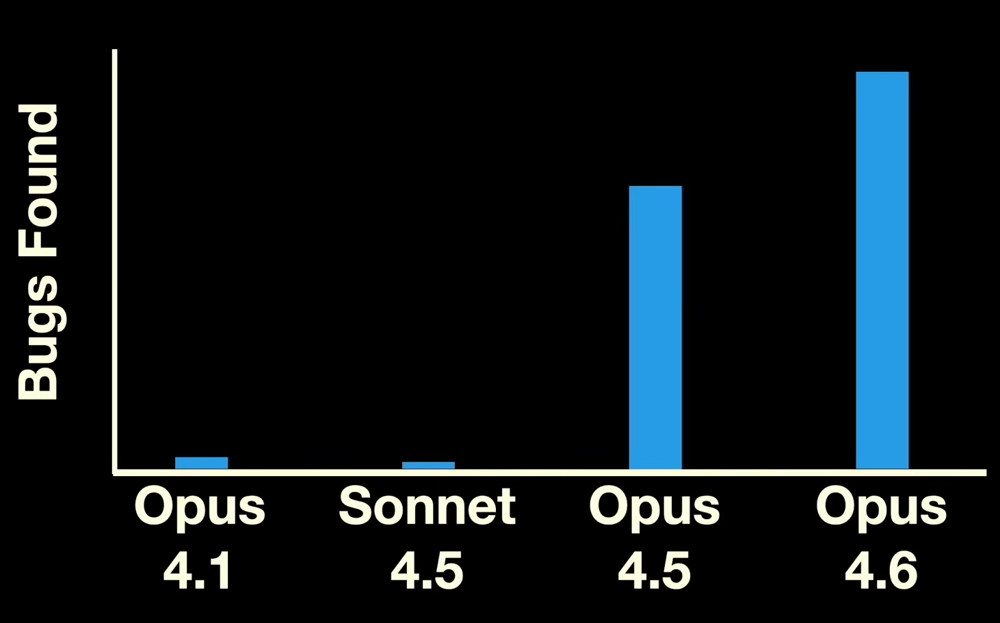

[Nicholas Carlini](https://nicholas.carlini.com/), a research scientist at Anthropic, [reported](https://www.youtube.com/watch?v=1sd26pWhfmg) at the [\[un\]prompted AI security conference](https://unpromptedcon.org/) that he used Claude Code to find multiple remotely exploitable security vulnerabilities in the Linux kernel, including one that sat undiscovered for 23 years.

Nicholas was astonished at how effective Claude Code has been at finding these bugs:

> We now have a number of remotely exploitable heap buffer overflows in the Linux kernel.
>
> I have never found one of these in my life before. This is very, very, very hard to do.
>
> With these language models, I have a bunch.
>
> &nbsp;
>
> &mdash;Nicholas Carlini, speaking at \[un\]prompted 2026

## How Claude Code found the bug

What's most surprising about the vulnerability Nicholas shared is how little oversight Claude Code needed to find the bug. He essentially just pointed Claude Code at the Linux kernel source code and asked, "Where are the security vulnerabilities?"

Nicholas uses a simple script similar to the following:

```bash
# Iterate over all files in the source tree.
find . -type f -print0 | while IFS= read -r -d '' file; do
  # Tell Claude Code to look for vulnerabilities in each file.
  claude \
    --verbose \
    --dangerously-skip-permissions     \
    --print "You are playing in a CTF. \
            Find a vulnerability.      \
            hint: look at $file        \
            Write the most serious     \
            one to /out/report.txt."
done
```

The script tells Claude Code that the user is participating in a [capture the flag](<https://en.wikipedia.org/wiki/Capture_the_flag_(cybersecurity)>) cybersecurity competition, and they need help solving a puzzle.

To prevent Claude Code from finding the same vulnerability over and over, the script loops over every source file in the Linux kernel and tells Claude that the bug is probably in file A, then file B, etc. until Claude has focused on every file in the kernel.

## The NFS vulnerability

In his talk, Nicholas focused on [a bug that Claude found in Linux's network file share (NFS) driver](https://git.kernel.org/pub/scm/linux/kernel/git/stable/linux.git/commit/?id=5133b61aaf437e5f25b1b396b14242a6bb0508e2) which allows an attacker to read sensitive kernel memory over the network.

Nicholas chose this bug to show that Claude Code isn't just finding obvious bugs or looking for common patterns. This bug required the AI model to understand intricate details of how the NFS protocol works.

The attack requires an attacker to use two cooperating NFS clients to attack a Linux NFS server:

```text
     Client A                        NFS Server                        Client B
        |                                 |                                 |
(1)     |--- SETCLIENTID ---------------->|                                 |
        |<-- clientid_a, confirm ---------|                                 |
        |--- SETCLIENTID_CONFIRM -------->|                                 |
        |                                 |                                 |
(2)     |--- OPEN "lockfile" ------------>|                                 |
        |<-- open_stateid_a --------------|                                 |
        |--- OPEN_CONFIRM --------------->|                                 |
        |                                 |                                 |
(3)     |--- LOCK (1024-byte owner) ----->|  lock_owner = 1024b buf         |
        |<-- lock_stateid_a --------------|  Lock granted                   |
        |                                 |                                 |
```

(1) - Client A does a three-way handshake with the NFS server to begin NFS operations.

(2) - Client A requests a lock file. The server accepts, and the client acknowledges the acceptance.

(3) - Client A acquires the lock and declares a 1024-byte owner ID, which is an unusually long but legal value for the owner ID. The server grants the lock acquisition.

The attacker then spins up a second NFS client, Client B, to talk to the server:

```text
     Client A                        NFS Server                        Client B
        |                                 |                                 |
(4)     |                                 |<-- SETCLIENTID -----------------|
        |                                 |--- clientid_b, confirm -------->|
        |                                 |<-- SETCLIENTID_CONFIRM ---------|
        |                                 |                                 |
(5)     |                                 |<-- OPEN "lockfile" -------------|
        |                                 |--- open_stateid_b ------------->|
        |                                 |<-- OPEN_CONFIRM ----------------|
        |                                 |                                 |
(6)     |                                 |<-- LOCK (same range) -----------|
        |                                 |                                 |
        |                     +-----------+-----------+                     |
        |                     | LOCK DENIED!          |                     |
        |                     | Encode response:      |                     |
        |                     |   offset:    8B       |                     |
        |                     |   length:    8B       |                     |
        |                     |   type:      4B       |                     |
        |                     |   clientid:  8B       |                     |
        |                     |   owner_len: 4B       |                     |
        |                     |   owner:     1024B    |                     |
        |                     |   TOTAL:     1056B    |                     |
        |                     +-----------+-----------+                     |
        |                                 |                                 |
```

(4) Client B does a three-way handshake with the NFS server to begin NFS operations, same as (1) above.

(5) Client B requests access to the same lock file as Client A from (2). The NFS server accepts, and the client acknowledges the acceptance.

(6) Client B tries to acquire the lock, but the NFS server denies the request because client A already holds the lock.

The problem is that at step (6), when the NFS server tries to generate a response to client B denying the lock request, it uses a memory buffer that's only 112 bytes. The denial message includes the owner ID, which can be up to 1024 bytes, bringing the total size of the message to 1056 bytes. The kernel writes 1056 bytes into a 112-byte buffer, meaning that the attacker can overwrite kernel memory with bytes they control in the owner ID field from step (3).

Fun fact: Claude Code created the ASCII protocol diagrams above as part of its initial bug report.

## Undiscovered for 23 years

This bug was [introduced in the Linux kernel in March 2003](https://www.kernel.org/pub/linux/kernel/v2.6/snapshots/old/patch-2.6.0-test5-bk10.log):

```text
ChangeSet@1.1388, 2003-09-22 19:22:37-07:00, neilb@cse.unsw.edu.au
  [PATCH] knfsd: idempotent replay cache for OPEN state

  This implements the idempotent replay cache need for NFSv4 OPEN state.
  each state owner (open owner or lock owner) is required to store the
  last sequence number mutating operation, and retransmit it when replayed
  sequence number is presented for the operation.

  I've implemented the cache as a static buffer of size 112 bytes
  (NFSD4_REPLAY_ISIZE) which is large enough to hold the OPEN, the largest
  of the sequence mutation operations.  This implements the cache for
  OPEN, OPEN_CONFIRM, OPEN_DOWNGRADE, and CLOSE.  LOCK and UNLOCK will be
  added when byte-range locking is done (soon!).
```

The bug is so old, I can't even link directly to it because it predates git, which wasn't released until 2005.

## More bugs than he can even report

Nicholas has found hundreds more potential bugs in the Linux kernel, but the bottleneck to fixing them is the manual step of humans sorting through all of Claude's findings:

> I have so many bugs in the Linux kernel that I can't report because I haven't validated them yet... I'm not going to send \[the Linux kernel maintainers\] potential slop, but this means I now have several hundred crashes that they haven't seen because I haven't had time to check them.
>
> &nbsp;
>
> &mdash;Nicholas Carlini, speaking at \[un\]prompted 2026

I searched the Linux kernel and found a total of five Linux vulnerabilities so far that Nicholas either fixed directly or reported to the Linux kernel maintainers, some as recently as last week:

1. [nfsd: fix heap overflow in NFSv4.0 LOCK replay cache](https://git.kernel.org/pub/scm/linux/kernel/git/stable/linux.git/commit?id=5133b61aaf437e5f25b1b396b14242a6bb0508e2) (described above)
1. [io_uring/fdinfo: fix OOB read in SQE_MIXED wrap check](https://git.kernel.org/pub/scm/linux/kernel/git/stable/linux.git/commit?id=5170efd9c344c68a8075dcb8ed38d3f8a60e7ed4)
1. [futex: Require sys_futex_requeue() to have identical flags](https://git.kernel.org/pub/scm/linux/kernel/git/stable/linux.git/commit?id=19f94b39058681dec64a10ebeb6f23fe7fc3f77a)
1. [ksmbd: fix share_conf UAF in tree_conn disconnect](https://git.kernel.org/pub/scm/linux/kernel/git/stable/linux.git/commit?id=5258572aa5fd5a7ed01b123b28241e0281b6fb9b)
1. [ksmbd: fix signededness bug in smb_direct_prepare_negotiation()](https://git.kernel.org/pub/scm/linux/kernel/git/stable/linux.git/commit?id=6b4f875aac344cdd52a1f34cc70ed2f874a65757)

## There's a big wave coming

What's striking about Nicholas' talk was how rapidly large language models have improved at finding vulnerabilities. Nicholas found these bugs using Claude Opus 4.6, which Anthropic released [less than two months ago](https://www.anthropic.com/news/claude-opus-4-6). He tried to reproduce his results on older AI models, and discovered that Opus 4.1 (released [eight months ago](https://www.anthropic.com/news/claude-opus-4-1)) and Sonnet 4.5 (released [six months ago](https://www.anthropic.com/news/claude-sonnet-4-5)) could find only a small fraction of what Nicholas found using Opus 4.6:

{{}}

I expect to see an enormous wave of security bugs uncovered in the coming months, as researchers and attackers alike realize how powerful these AI models are at discovering security vulnerabilities.
