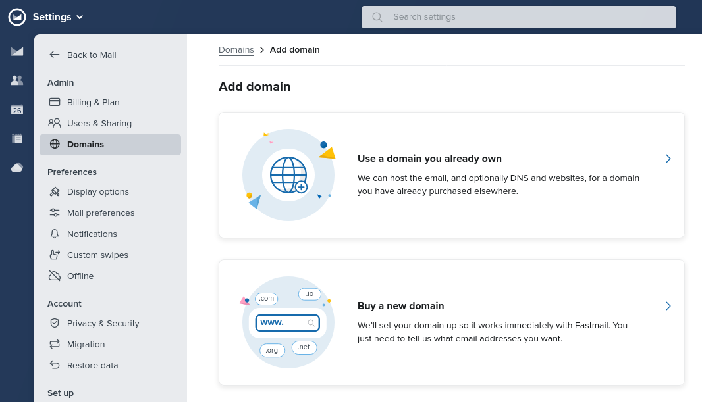
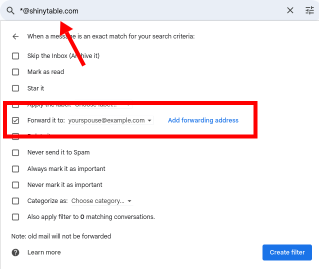
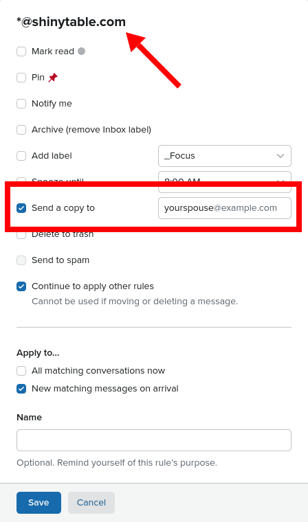

<!-- markdownlint-disable no-bare-urls -->

I've only been married for a few years, but I have a fantastic marriage tip you won't hear from any marriage counselor or book:

- Get a couple's email domain

## What's a couple's email domain?

My wife and I share a .com domain name for email. I'm not going to reveal our real domain name, but pretend it's this:

- @shinytable.com

Emails to michael@shinytable.com go to both me and my wife, and the same for her name.

## No, not a shared Gmail account

When I tell people that my wife and I have a couple's email domain, they think I registered a Gmail account like michaelandhiswife25@gmail.com, and we share access to that account. That's not what I mean.

We have a couple's email _domain_. We still send and receive email through our normal email accounts.

If you email michael@shinytable.com or my wife's name, we both receive the email in our normal inboxes. We don't have a special @shinytable.com inbox we have to check separately. Similarly, we can both send emails as each other, if needed.

You can get most of the same benefits by sharing an extra email account, but then you're stuck managing an extra inbox and messing up each other's read/unread status.

## Why get a couple's email domain?

### Keeping everyone looped in with vendors

I got the idea for a couple's email domain while my wife and I were planning our wedding. Despite the fact that it's a core part of their job, most wedding vendors don't seem to understand how to send emails to two people at once.

If I emailed a photographer and cc'ed my wife, half the time the photographer would forget to reply-all, cutting my wife out of the thread.

By switching to a couple's email domain, we made it impossible for vendors to accidentally drop one of us from the thread. Even when emails were addressed only to michael@shinytable.com, they still went to my wife as well.

### Shared online accounts

As a married couple, my wife and I share lots of online accounts: insurance, tax bills, grocery delivery, etc.

We sign up for all shared services using our couple's email domain and save the credentials in our shared password manager, [Bitwarden](https://bitwarden.com/). That way, we both receive all notices related to our shared accounts. If we ever have to do a password reset, either of us can do it.

## Picking a good domain name

When you pick a couple's domain name, consider the experience of saying your email address over the phone, especially to support reps who may not speak English natively:

- Choose words that have easy, unambiguous spelling
  - e.g., don't use a word like "scent" because people might think you meant "sent" or "cent."
  - e.g., don't use a word like "accommodate" because only six people can spell it correctly on their first try.
- Choose words that sound distinct from other words, especially in sequence
  - e.g., if you choose "clean ditch," people will probably mishear it as "clean dish."

So, shinytable.com is not our real domain, but it would be a good couple's domain because most English speakers can spell the words "shiny" and "table," and it's hard to mishear "shiny table dot com" as something else.

## How to set up a couple's email domain

### Buy a domain name

To set up a couple's domain for you and your spouse, the first step is to buy a domain name.

Some email providers let you buy a domain name within their service. I prefer to buy my domains from a dedicated domain registrar. The prices are generally better, and I have the freedom to switch email providers. You can buy the domain name from your email vendor if you prefer the simpler solution.

### Connect your custom domain to your email account

Next, you need to connect your domain name to your email account. You'll connect your spouse's soon after.

I use Fastmail, and they support custom domain names particularly well. So, once I've purchased the domain, I go to Settings > Domains to connect `shinytable.com` to my Fastmail account.

{{}}

You can also connect a custom domain to [a basic, free Gmail account](https://andykong.org/blog/freebusinessemail/), but Google makes this process somewhat tedious process because they want you to pay for the feature in Google Workspace.

### Forward mail to your spouse

Once you're able to send and receive email with your custom domain name, the next step is automatically forwarding your spouse all emails to your couple's domain.

If you use Gmail, create a filter with your domain name and configure it to forward emails to your spouse's email address:

{{}}

If you use Fastmail, create a custom rule for your custom domain where the action is "Send a copy to" with your spouse's email.

{{}}

Once your spouse can receive emails to that domain, they need to do the same thing you did above to send emails using the custom domain.

## Tips for using your couple's email domain

### Avoid double replies: cc your spouse

On group threads with you and your spouse, you do still have to watch out for the other party dropping one of you from the thread. If that happens, you'd both still receive replies from the other party, but you'd miss your spouse's reply.

To prevent this, just make sure to cc or bcc your spouse (or yourself) on all replies.

In practice, this has rarely been a problem. If my wife and I are both on an email thread with a vendor, typically one of us is actively managing the project and the other is just following along. Even if we forget to cc each other, we're still seeing all the responses from the vendor.

### Don't give your couple's email address to friends and family

When I first set up our couple's email domain, I was so excited about how well it worked that I thought about using it for all emails threads we're both on, including with family and friends.

Then, I realized that if a person emails michael@shinytable.com, they'd reasonably assume I'm the only recipient and might say something they don't mean for my wife to see.



**Note**: If you're reading this, and you're my wife, I just mean for like... surprise parties and stuff.



So, we only give out our couple's email addresses to online services or people with whom we have a pure business relationship.

### Bonus: Use per-service couple's email addresses

These days, if I order a $7 spatula online, the merchant immediately starts spamming me about kitchenware deals and shares my email with their 900 closest, trusted advertising partners.

To prevent spam, I go a step further with my couple's email domain and give each vendor a unique email address. So, instead of entering michael@shinytable.com as my email address at checkout, I'd use the vendor's name, like cheapspatulasdirect@shinytable.com. If I start receiving spam, I just block emails from cheapspatulasdirect@shinytable.com.

Per-service email addresses are fine when I'm typing the address into a web form, but if I tell Jane the dogwalker that my email address is jane.the.dogwalker@shinytable.com, she gets confused or weirded out. In those cases, I'll say Michael but add a semi-random suffix like michael.dw5@shinytable.com, where "dw" is for dogwalker and the 5 is in case I've used "dw" as a suffix before.

I use the same technique to obscure the vendor's name for services that are aggressive at fraud prevention. I once signed up for a food delivery service, and as soon as I placed my first order, they flagged my account for fraud and canceled my order. I suspect the reason was that the vendor's name appeared in my email address. So, now, if I sign up with a service that might be sensitive to fraud, I do my name plus some random numbers.

Per-service email domains work especially well with Fastmail, as they allow unlimited email addresses and support wildcard ("catch-all") addresses (`*@shinytable.com`). You can do this with Gmail as well, and it works fine for receiving mail, but if you ever need to send mail from cheapspatulasdirect@shinytable.com, you have to go through the tedious process of adding it to your Gmail account. With Fastmail, you can send from any email address within your domain with zero configuration.

---

_Cover image by [Piotr Letachowicz](https://cartoony.eu)._
