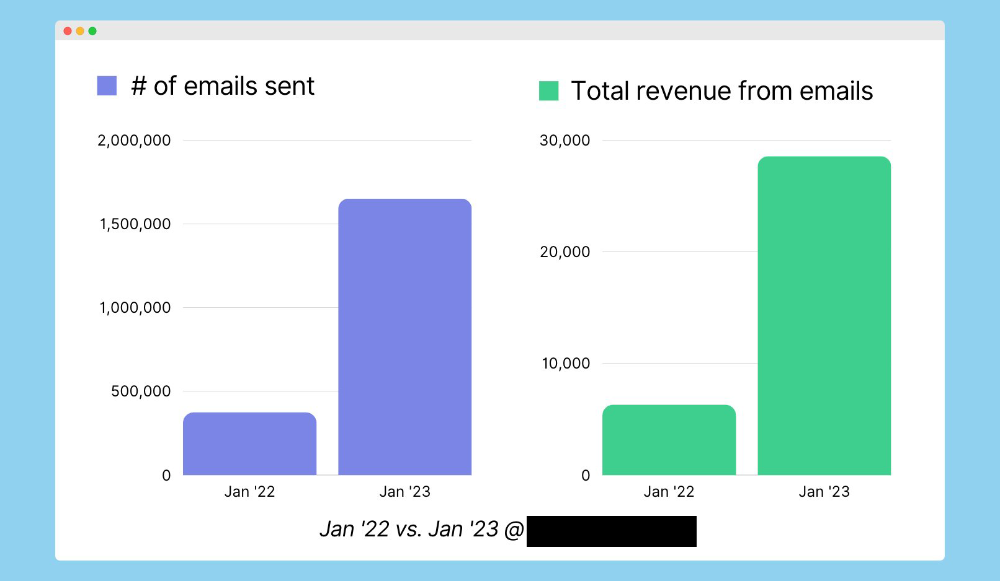

I've been in the world of bootstrapped founders for about seven years. I used to organize Indie Hacker meetups in New York City, and I continue to organize them in Western Massachusetts. I've worked full-time as a bootstrapped founder for the past six years and try as much as possible to connect with other founders.

When people start a bootstrapped business, they're usually excited. They've read stories online of other founders like Pieter Levels or XX. And they're excited to build the business. And then they launch something and it flops, and they're crushed.

If you find yourself in this situation, know that it gets easier and you're probably holding yourself to unrealistic standards.

## Success rarely comes quickly

I was at a meetup a few years ago and one of the people who attended had quit his job in big tech to pursue his own business. That was cool because it was exactly what I had done.

He told me he regretted it. I was sad for him. He felt like he got taken in by the hype of bootstrapped businesses.

I asked him how long he'd been trying to build his business. He sounded so grizzled and worn out that my guess was that he'd been at it for somewhere between three to five years.

"Almost three months," he told me.

Cory Zue, Pieter Levels, Josh Pigford all had years of failure or, at best, marginal success before they started making enough to support themselves.

## The Instagram reality of bootstrapper media

By now, people are familiar with the distinction between the reality of someone's lifestyle and the glamorized, highly polished version of themselves they present on Instagram.

I think people aren't yet aware that this dynamic is at play in interviews and blog posts about successful bootstrapped founders. This is not to say that founders are lying or fabricating their numbers, but there are a ton of biases at play that are distorting reality.

First, and most obviously, there's a selection bias in what stories you see. If you browse social media or bootstrapper forums, the posts that get the most attention are the ones about atypical success. An article called, "I launched my product three months ago, and now I'm earning $50k/month" is going to receive much more attention than an article called, "I launched my product two years ago, and I'm not even covering my costs."

Compare the response on Hacker News to my fifth year as a bootstrapper (when I barely broke even) to my sixth year (when I made $1M in revenue and $236k in profit):

TODO: screenshots

Even beyond the bias of whose stories you see, the stories themselves are glamorized and sugarcoated. Founders primarily do interviews or write articles about their lifestyle in the hopes that it will help their business. That means they often can't give a brutally honest account of how they're doing.

Finally, the media outlets themselves want to focus on the positives. Occasionally, they'll have a Very Special Episode about mental health, but 99% of it is about how being a bootstrapped founder is fun and exciting. And being a bootstrapped founder is fun and exciting, but it's also a lot of other things that are hard to handle if you expect the experience to be 100% fun and exciting.

TODO: Visualization of selection bias and exaggeration.

## The metric you never see: profit per founder

Often inflate numbers. Report revenue instead of profit. And I'm guessing in a lot of cases, it's not even revenue they receive but revenue before fees. Also, nobody talks about revenue per founder, but $100k ARR for four founders + 4 freelencers is very different than a single founder working alone.

They announce that they hit $100k ARR. And then you realize that it's two founders whose market rate would be $100-200k/yr each. And then you realize that's revenue not expenses, and they probably have a lot of expenses, including employees, marketing, cloud services, etc.

You can inflate your revenue by spending a ton on marketing. e.g., spend $1000/mo on Google Ads and make $800/mo in revenue. Fake it till you make it.

Patrick Campbell sold ProfitWell to Paddle for $200M, but the week before the close, he only had $15k in liquid assets because everything else was tied up in his business. (talked about on 2022 IH podcast)

## Wild success is so close to abject failure

XX years after I wrote about quitting Google, I found a blog post about a guy who did something similar. Daniel Vassallo had left a a well-paid position at Amazon to try bootstrapping his own business.

Over the next year, I saw Daniel succeed wildly. He basically had the experience that a lot of optimistic founders expect to have.

Based on his experience at Amazon, he co-wrote an e-book called "AWS: The Good Parts." He'd never had a Twitter account, but he joined because he heard that's where people might be interested in his book. He tweeted about

Daniel realized he was so successful at promoting his book on Twitter, and the market for promoting things on Twitter is so much larger than the market for people who want to learn AWS, so he made a video course about building an audience on Twitter.

And then he realized people were so fascinated with his story that he made a private community for people who wanted to follow his business strategy.

I think Daniel is a smart guy, and I'm a satisfied customer of several of his products, but it's unmistakable how much luck played into Daniel's success.

Let's imagine we rewind the story to just after Daniel publishes his AWS book, and everything is the same except that Twitter's algorithm is slightly different. Now, Daniel is tweeting all the same stuff, but Twitter shows it to 1% of the people it did in our timeline. Instead of making $150k, he makes $1.5k.

He probably doesn't see it as a wild success, and even if he does, nobody's going to want to buy a course from someone who tweets all day and only managed to make $1.5k from it. And people certainly aren't going to pay money to join Daniel's private community when he has no success to show.

So, what happens to Daniel Vassallo in that timeline? Daniel's smart, so maybe he keeps trying new things until he finds success, but it's easy to imagine the Daniel of that timeline following the path of so many other bootstrapped founders. His first few swings all miss, he assumes that he's not cut out for the bootstrapper lifestyle, and he goes back to his job in big tech.

## Other tricks indie founders use to seem more successful

When I was 17, I read _The Motley Fool's Guide to Investing_, and one thing I remember two decades later is this section of the book that laid out all the deceptive strategies other online investing advicors used to deceive readers into seeming more successful. Even though they publicly tracked their stock picks, they'd use sleight of hand to mislead readers about their performance.

We need something similar with founders because a lot of founders are

- Exclude fees
  - I suspect that a lot of founders are reporting their revenues before fees. If you hear someone say they sold $100k on Gumroad, the amount they received is probably closer to $87k after Gumroad's fees and credit card processing fees.
-

## Other founders have unfair advantages

They're not cheating, but if you look closely at a lot of wild founder success stories, they often have some massive advantage that you don't.

- They have a romantic partner who quietly does unpaid work for the company that would cost six figures on the open market.
- They have a romantic partner who does all domestic work for them.
- They "bootstrapped" the business with hundreds of thousands of dollars of money they already had.
- They have a friend in an influential position who brought them their critical early customers.

In XX, the Indie Hackers podcast had a debate between DHH and Natalie Nagele, both wildly successful bootstrapped founders. DHH was arguing that founders can run a company on only 10 hours per week, as that's what his company did in the early days. When pressed, it became clear that DHH was spending a lot more than 10 hours per week on things like promoting the business on Twitter, answering support emails. And most importantly, he was running it on top of a successful consulting business. He already had all the team and infrastructure in place to start a small company with the unused hours from his consulting business.

It's not cheating to use your unfair advantages, and I encourage you to use every advantage available to you. Just remember that when you see another founder boasting of wild success through their hard work and determination, if you look closely enough, you'll usually see that they're not emphasizing some advantage they had just by pure chance.

## Some businesses that seem successful are making the world worse

A lot of the founders that achieve wild success are doing it because they're just extractive. They're doing the equivalent of producing a new chemical and dumping all the waste product into the town reservoir.

I saw a successful founder last year ago decide he was so good at email marketing that he decided to sell a course about it. Part of his marketing was that every month, he generates $30k in revenue by sending 1.5 million emails. So, let's say that means something like 500 sales per month, so that's 1,499,500 emails per month that didn't go to someone happy to buy, just wasted their time. And if we say the cost of receiving an email you don't like is a $0.05, it means that he generated $30k in revenue while pushing a cost of about $75k onto his email list.

{{}}

That's not even the worst of it. That founder promotes the course and nobody bats an eye! It gets way worse. A few months ago, Neil Patel tweeted about the costs of . But it's all just garbage. Even the human-written work he's publishing is just slop he's shoveling onto the Internet to attract clicks.

https://x.com/neilpatel/status/1749570322800759133

## Find the founders that resonate with you

Oh no, they have to be great at YouTube and Twitter and Pinterest and TikTok. There are lots of different paths to success, and the vast majority of successful founders aren't publishing all their results (it's fine if you do or don't).

- Justin Duke
- Cory Zue
- Jen Yip

## How to get a more grounded reality

If you want a more accurate picture, listen to interviews with people after they've moved on from their company. It's a very different picture, one filled with a lot of fear, stress, and anxiety.

Listen to founders who do interviews because they're business nerds and don't have anything to sell. I love every Jason Cohen interview because he clearly doesn't need to promote his businesses, but he enjoys sharing what he's learned.

Go to conferences and meetups and talk to other attendees. It will be closer to reality, but even that's biased because the founders making money are more able to attend conferences.
