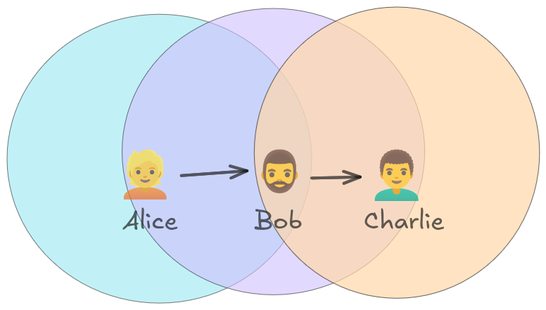
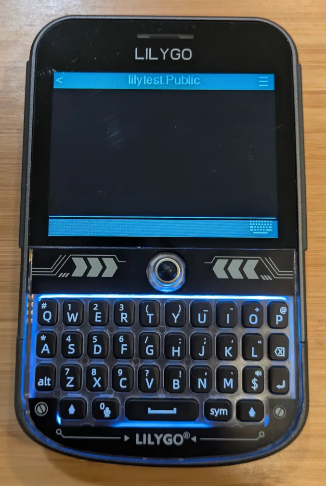
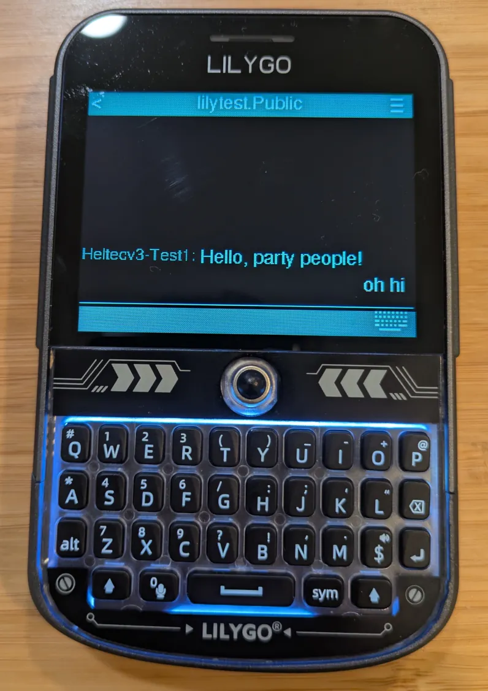
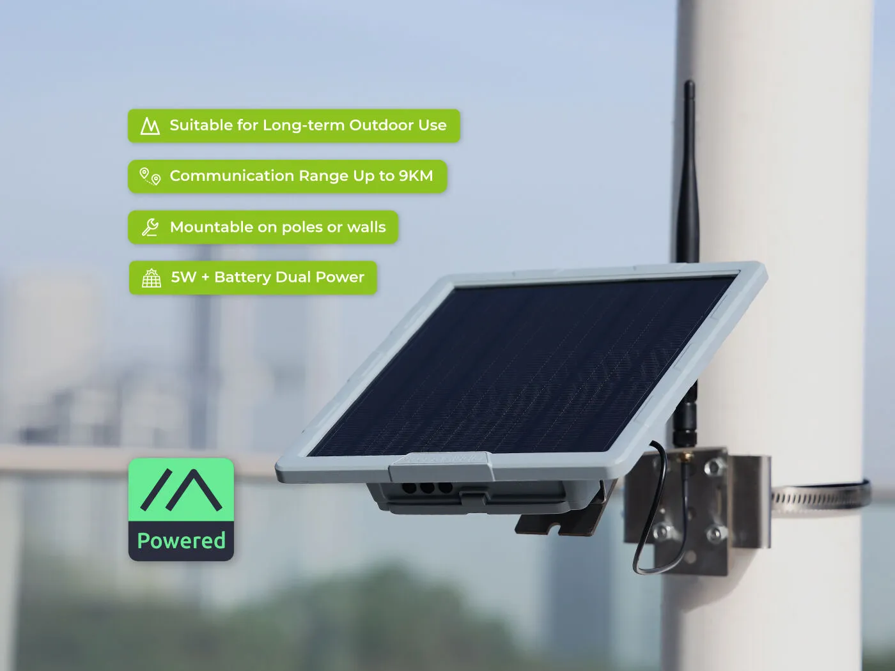
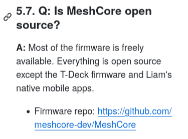
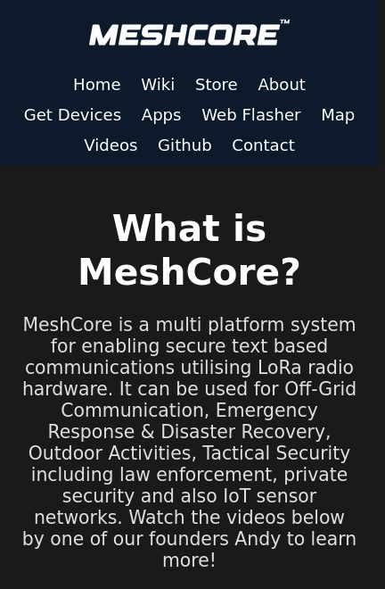

When my wife saw me playing with my new encrypted radio, she asked what it was for.

"Imagine," I said, "if I could type a message on my phone and send it to you, and the message would appear on your phone. Instantly!"

She wasn't impressed.

"It also works if phone lines are down due to a power outage... or societal collapse." Still nothing.

{{}}

"If we're not within radio range of each other, we can route our messages through a mesh network of our neighbors' radios. But don't worry! The radios encrypt our messages end-to-end, so nobody else can read what we're saying." By this point, she'd left the room.

My wife has many wonderful qualities, but, if I'm being honest, "enthusiasm for encrypted off-grid messaging" has never been one of them.

The technology I was pitching to my wife was, of course, MeshCore.

{{}}

## tl; dr - What did I think?

If you'd like to skip to the end, check out [the summary](#summary).

## What's MeshCore?

MeshCore is software that runs on inexpensive [long-range (LoRa) radios](https://en.wikipedia.org/wiki/LoRa). LoRa radios transmit up to several miles depending on how clear the path is. Unlike HAM radios, you don't need a license to broadcast over LoRa frequencies in the US, so anyone can pick up a LoRa radio and start chatting.

MeshCore is more than just sending messages over radio. The "mesh" in the name is because MeshCore users form a mesh network. If Alice wants to send a message to her friend Charlie, but Charlie's out of range of her radio, she can route her message through Bob, another MeshCore user in her area, and Bob will forward the message to Charlie.

{{}}

## My dream for off-grid communication

I'm not exactly a doomsday prepper, but I plan for realistic disaster scenarios like extended power outages, food shortages, and droughts.

When I heard about MeshCore, I thought it would be neat to give some devices to friends nearby so we could communicate in an emergency. And if it turned out that we're out of radio range of each other, maybe I could convince a few neighbors to get involved as well. We could form a messaging network that's robust against power failures and phone outages.

## Why not Meshtastic?

MeshCore is a newer implementation of an idea that was popularized by a technology called [Meshtastic](https://meshtastic.org/).

I first heard about Meshtastic from [Tyler Cipriani's 2022 blog post](https://tylercipriani.com/blog/2022/07/31/meshtastic-a-review/). I thought the idea sounded neat, but Tyler's conclusion was that Meshtastic was too buggy and difficult for mainstream adoption at the time.

I have no particular allegiance to MeshCore or Meshtastic, as I've never tried either. Some people I follow on Mastodon have been excited about MeshCore, so I thought I'd check it out. Most MeshCore-compatible devices are also compatible with Meshtastic, so I can easily experiment with one and later try the other.

I only have a limited understanding of the differences between Meshtastic and MeshCore, but what I gather is that MeshCore's key differentiator is preserving bandwidth. Apparently, Meshtastic hits scaling issues when many users are located close to each other. The Meshtastic protocol is chattier than MeshCore, so I've seen complaints that Meshtastic chatter floods the airwaves and interferes with message delivery. MeshCore attempts to solve that problem by minimizing network chatter.

## I'm not a radio guy

I should say at this point that I'm not a radio guy.

It seems like many people in the LoRa community are radio enthusiasts who have experience with HAM radios or other types of radio broadcasting.

I'm a tech-savvy software developer, but I know nothing about radio communication. If I have an incorrect mental model of radio transmission, that's why.

## Heltec v3: The cheapest introduction to MeshCore

The MeshCore firmware runs on a couple dozen devices, but the official website recommends three devices in particular. The cheapest one is the Heltec v3. I bought two for $27/ea.

{{}}

I connected the Heltec v3 to my computer via the USB-C port and used the [MeshCore web flasher](https://flasher.meshcore.co.uk/) to flash the latest firmware. I selected "Heltec v3" as my device, "Companion Bluetooth" as the mode, and "v1.9.0" as the version. I clicked "Erase device" since this was a fresh install.

{{}}

Then, I used the [MeshCore web app](https://app.meshcore.nz/) to pair the Heltec with my phone over Bluetooth.



{{}}

{{}}

{{}}



## Fumbling around the MeshCore web app

Okay, I've paired my phone with my MeshCore device, but... now what?

{{}}

The app doesn't help me out much in terms of onboarding.

I try clicking "Map" to see if there are any other MeshCore users nearby.

{{}}

Okay, that's a map of New Zealand. I live in the US, so that's a bit surprising. Even if I explore the map, I don't see any MeshCore activity anywhere, so I don't know what the map is supposed to do.

The map of New Zealand reminded me that different countries use different radio frequencies for LoRa, and if the app defaults to New Zealand's location, it's probably defaulting to New Zealand broadcast frequencies as well.

I went to settings and saw fields for "Radio Settings," and I clicked them expecting a dropdown, but it expects me to enter a number. And then I noticed a subtle "Choose Preset" button, which listed presets for different countries that were "suggested by the community." I had no idea what any of them meant, but who am I to argue with the community? I chose "USA/Canada (Recommended)."



{{}}

{{}}



I also noticed that the settings let me change my device name, so that seemed useful:

{{}}

It seemed like there were no other MeshCore users within range of me, which I expected. That's why I bought the second Heltec.

{{}}

I repeated the process with an old phone and my second Heltec v3, but they couldn't see each other. I eventually realized that I'd forgotten to configure my second device for the US frequency. This is another reason I wish the MeshCore app took initial onboarding more seriously.

Okay, they finally see each other! They can both publish messages to the public channel.

{{}}

## Figuring out direct messaging

If I communicate with friends over MeshCore, I don't want to broadcast our whole conversation over the public channel, so it was time to test out direct messaging.

I expected some way to view a contact in the public channel and send them a direct message, but I couldn't. Clicking their name did nothing. There's a "Participants" view, but the only option is to block, not send a direct message.

{{}}

This seems like an odd design choice. If a MeshCore user posts to the public channel, why can't I talk to them?

I eventually figured out that I have to "Advert." There are three options: "Zero Hop," "Flood Routed," and "To Clipboard." I don't know what any of these mean, but I figure "flood" sounds kind of rude, whereas "Zero Hop" sounds elegant, so I do a "Zero Hop."



{{}}
{{}}



Great! Device 2 now sees device 1. Let's say hi to Device 1 from Device 2.

{{}}

Whoops, what's wrong? Maybe I need to "Advert" from Device 2 as well?

Okay, I do, and voila! Messages now work.

{{}}

This is a frustrating user experience. If I have to advert from both ends, why did MeshCore let me send a message on a half-completed handshake?

I'm assuming "Advert" is me announcing my device's public key, but I don't understand why that's an explicit step I have to do ahead of time. Why can't MeshCore do that implicitly when I post to a public channel or attempt to send someone a direct message?

Anyway, I can talk to myself in both public channels and DMs. Onward!

## Ordering more MeshCore devices

The Heltec v3 boards were a good way to experiment with MeshCore, but they're impractical for real-world scenarios. They require their own power source, and a phone to pair. I wanted to power it from my phone with a USB-C to USB-C cable, but the Heltec board wouldn't power up from my phone. In a real emergency, that's too many points of failure.

The MeshCore website recommends two other MeshCore-compatible devices, so I ordered those: the Seeed SenseCAP T-1000e ($40) and the Lilygo T-Deck+ ($100).

{{}}

## Testing the SenseCAP T-1000e

The T-1000e was a clear improvement over the Heltec v3. It's self-contained and has its own battery and antenna, which feels simpler and more robust. It's also nice and light. You could toss it into a backpack and not notice it's there.

{{}}

Annoyingly, the T-1000e uses a custom USB cable, so I can't charge it or flash it from my computer with one of my standard USB cables:

{{}}

I used the web flasher for the Heltec, but I decided to try flashing the T-1000e directly from source:

```bash
git clone https://github.com/meshcore-dev/MeshCore.git

# Latest firmware version at the time I tested.
FIRMWARE_VERSION='companion-v1.9.0'
git checkout $FIRMWARE_VERSION
```

I use Nix, and the repo conveniently has a `default.nix`, so the dependencies installed automatically with `direnv`. I then flashed the firmware for the T-1000e like this:

```bash
# Specify the device settings, from variants/t1000-e/platformio.ini.
DEVICE_SETTINGS='t1000e_companion_radio_ble'
pio run \
  --environment $DEVICE_SETTINGS \
  --target upload \
  --upload-port /dev/ttyACM0
```

From there, I paired the T-1000e with my phone, and it was basically the same as using the Heltec. The only difference was that the T-1000e has no screen, so it defaults to the Bluetooth pairing password of `123456`. Does that mean anyone within Bluetooth range can trivially take over my T-1000e and read all my messages?

It also seems impossible to turn off the T-1000e, which is undesirable for a broadcasting device. The manufacturer [advises users](https://wiki.seeedstudio.com/sensecap_t1000_e/) to just leave it unplugged for several days until the battery runs out.

**Update**: MeshCore contributor [Frieder Schrempf](https://fris.de/) just [fixed this](https://mastodon.social/@frisch/115651352440724135) in commit [07e7e2d](https://github.com/meshcore-dev/MeshCore/commit/07e7e2d44bfd68abbe87f73a853b04d76b37ddf5), which is included in the v.1.11.0 MeshCore firmware. You can now power off the device by holding down the button at the top of the T-1000e.

## Testing the Lilygo T-Deck

Now it was time to test the Lilygo T-Deck.

This was the part of MeshCore I'd been most excited about since the very beginning.

If I handed my non-techy friends a device like the T-1000e, there were too many things that could go wrong in an actual emergency. "Oh, you don't have the MeshCore app? Oh, you're having trouble pairing it with your phone? Oh, your phone battery is dead?"

The T-Deck looked like a 2000s era Blackberry. It seemed dead-simple to use because it was an all-in-one device: no phone pairing step or app to download. I wanted to buy a bunch, and hand them out to my friends. If society collapsed and our city fell into chaos, we'd still be able to chat on our doomsday hacker Blackberries like it was 2005.

### This is not a Blackberry

As soon as I turned on my T-Deck, my berry was burst. This was not a Blackberry at all.

{{}}

As a reminder, _this_ is what a Blackberry looked like in 2003:

{{}}

Before I even get to the T-Deck software experience, the hardware itself is so big and clunky. We can't match the quality of a hardware product that we produced _22 years ago_?

{{}}

Right off the bat, the T-Deck was a pain to use. You navigate the UI by clicking a flimsy little thumbwheel in the center of the device, but it's temperamental and ignores half of my scrolls.



Good news: there's a touchscreen. But the touchscreen misses half my taps:



There are three ways to "click" a UI element. You can click the trackball, push the "Enter" key, or tap the screen. Which one does a particular UI element expect? You just have to try all three to find out!



### Sidenote: Putting the Lilygo T-Deck+ into DFU mode for flashing

I had a hard time even finding instructions for how to reflash the T-Deck+. I found this [long Jeff Geerling video](https://www.youtube.com/watch?v=2Ry-ck0fhfw) where he expresses frustration with how long it took him to find reflashing instructions... and then he never explains how he did it!

This is what worked for me:

1. Disconnect the T-Deck from USB-C.
1. Power off the T-Deck.
1. Connect the T-Deck to your computer via the USB-C port.
1. Hold down the thumbwheel in the center.
1. Power on the device.

Confusingly, there's no indication that the device is in DFU mode. I guess the fact that the screen doesn't load is sort of an indication. On my system, I also see `dmesg` logs indicating a connection.

## Messaging with the T-Deck

Once I figured out how to navigate the T-Deck, I tried messaging, and the experience remained baffling. For example, guess what screen I'm on here:

{{}}

If you guessed "chat on Public channel," you're a better guesser than I am, because the screen looks like nothing to me. Even when it displays chat messages, it only vaguely looks like a chat interface:

{{}}

I encountered lots of other instances of confusing UX, but it's too tedious to recount them all here.

The tragic upshot for me is that this is not a device I'd rely on in an emergency. There are so many gotchas and dead-ends in the UX that would trip people up and prevent them from communicating with me.

## Testing MeshCore in the field

Even though the T-Deck broke my heart, I still hoped to use MeshCore with a different device.

I needed to see how these devices worked in the real world rather than a few inches away from each other on my desk.

### T-1000e to Heltec from 1 mile away

First, I took my T-1000e to a friend's house about a mile away and tried messaging the Heltec back in my home office. The transmission failed, as it seemed the two devices couldn't see each other at all from that distance.

Okay, fair enough. I'm in a suburban neighborhood, and there are lots of houses, trees, and cars between my house and my friend's place.

### T-1000e to Heltec from a few blocks away

The next time I was riding in a car away from my house, I took along my T-1000e and tried messaging the Heltec v3 in my office.

One block away: messages succeeded.

Three blocks away: still working.

Five blocks away: failure.

And then I was never able to reach my home device until returning home later that day.

### T-Deck to T-1000e from a few blocks away

Maybe the issue is the Heltec? I keep trying to leave the Heltec at home, but I read that the Heltec v3 has a particularly weak antenna.

I tried again by leaving my T-1000e at home and taking the T-Deck out with me.

I could successfully message my T-1000e from about five blocks away, but everything beyond that failed.

## Do I need a repeater?

The other part of the MeshCore ecosystem I haven't mentioned yet is repeaters.

{{}}

MeshCore repeaters are like WiFi extenders. They receive MeshCore messages and re-broadcast them to extend their reach.

Repeaters are what create the "mesh" in MeshCore. The repeaters send messages to other repeaters and carry your MeshCore messages over longer distances.

There are some technologically cool repeaters available. They're solar powered with an internal battery, so they run independently and can survive a few days without sun.

The problem was that I didn't know how much difference a repeater makes. A repeater with a strong antenna would broadcast messages well, but does that solve my problem? If my T-Deck can't send messages to my T-1000e from six blocks away, how is it going to reach the repeater?

By this point, my enthusiasm for MeshCore had waned, and I didn't want to spend another $100 and mount a broadcasting device to my house when I didn't know how much it would improve my experience.

## Inspecting MeshCore's source code

MeshCore's [firmware is open-source](https://github.com/meshcore-dev/MeshCore), so I took a look to see if there was anything I could do to improve the user experience on the T-Deck.

The first surprise with the source code was that there were no automated tests. I [wrote simple unit tests](https://github.com/meshcore-dev/MeshCore/pull/925), but nobody from the MeshCore team has responded to my proposal, and it's been about two months.

From casually browsing, the codebase feels messy but not outrageously so. It's written in C++, and most of the classes have a large surface area with 20+ non-private functions and fields, but that's what I see in a lot of embedded software projects.

Another code smell was that my unit test calls the `toHex` function, which [encodes raw bytes to a hex string](https://github.com/meshcore-dev/MeshCore/pull/925/files#diff-3e0cb09133a928bbf14276af63f5c0c5cffca33c6dc64bcdc32b4c68e878fa70R14).

```c++
// Create a test input.
uint8_t input[] = {0x01, 0x23, 0x45, 0x67, 0x89, 0xAB, 0xCD, 0xEF};
char output[HEX_BUFFER_SIZE(input)];

// Call the function we're testing.
Utils::toHex(output, input, sizeof(input));

// Verify that toHex encoded our bytes correctly.
EXPECT_STREQ("0123456789ABCDEF", output);
```

MeshCore's `toHex` implementation depends on headers for two [crypto](https://github.com/meshcore-dev/MeshCore/pull/925/files#diff-8fe022be9e41bf437216567eb081b55fe69f294bdac92108246f7a595f650fa1) [libraries](https://github.com/meshcore-dev/MeshCore/pull/925/files#diff-44bbe9f8c6be4ff4ec7446a37bd4f1cac9ad261611164ca5a6600a61f8332c0f), even though the function has nothing to do with cryptography. It's the kind of needless coupling MeshCore would avoid if they wrote unit tests for each component.

My other petty gripe was that the code doesn't have consistent style conventions. Someone [proposed](https://github.com/meshcore-dev/MeshCore/issues/276) using [the `.clang-format` file that's already in the repo](https://github.com/meshcore-dev/MeshCore/blob/companion-v1.10.0/.clang-format), but a maintainer [closed the issue](https://github.com/meshcore-dev/MeshCore/issues/276#issuecomment-3295460688) with the guidance, "Just make sure your own IDE isn't making unnecessary changes when you do a commit."

Why? Why in 2025 do I have to think about where to place my curly braces to match the local style? Just [set up a formatter](/human-code-reviews-1/#let-computers-do-the-boring-parts) so I don't have to think about mundane style issues anymore.

## Wait, MeshCore isn't open-source?

I originally started digging into the MeshCore source to understand the T-Deck UI, but I couldn't find any code for it. I couldn't find the source to the MeshCore Android or web apps either.

And then I realized: it's all closed-source. All of the official MeshCore client implementations are closed-source and proprietary.

{{}}

What!?! They'd advertised this as open-source! How could they trick me?

And then I went back to the MeshCore website and realized they never say "open-source" anywhere.

{{}}

It just _seems_ like such an open-source thing that I assumed it was. But I was severely disappointed to discover that critical parts of MeshCore are proprietary.

Without open-source clients, MeshCore doesn't work for me.

I'm not an open-source zealot, and I think it's fine for software to be proprietary, but the whole point of off-grid communication is decentralization and technology freedom, so I can't get on board with a closed-source solution.

Some parts of the MeshCore ecosystem are indeed open-source and liberally licensed, but critically the T-Deck firmware, the web app, and the mobile apps are all closed-source and proprietary. The firmware I flashed to my Heltec v3 and T-1000e is open-source, but the mobile and Android apps (clients) I used to use the radios were closed-source and proprietary. As far as I see, there are no open-source MeshCore clients aside from [the development CLI](https://github.com/meshcore-dev/meshcore-cli).

| Product                                                                                     | Open-source?                   | Free to use?                                                         |
| ------------------------------------------------------------------------------------------- | ------------------------------ | -------------------------------------------------------------------- |
| [MeshCore radio firmware](https://github.com/meshcore-dev/MeshCore)                         | <font color="green">Yes</font> | <font color="green">Yes</font>                                       |
| [MeshCore protocol](https://github.com/meshcore-dev/MeshCore/wiki/Companion-Radio-Protocol) | <font color="green">Yes</font> | <font color="green">Yes</font>                                       |
| [Web-based MeshCore firmware flasher](https://flasher.meshcore.co.uk/)                      | <font color="green">Yes</font> | <font color="green">Yes</font>                                       |
| [Official Android / iOS MeshCore apps](https://meshcore.co.uk/apps.html)                    | <font color="red">No</font>    | <font color="darkorange">Yes, but some features are paywalled</font> |
| [Official MeshCore web app](https://meshcore.co.uk/apps.html)                               | <font color="red">No</font>    | <font color="darkorange">Yes, but some features are paywalled</font> |
| [T-Deck MeshCore firmware](https://buymeacoffee.com/ripplebiz)                              | <font color="red">No</font>    | <font color="darkorange">Yes, but some features are paywalled</font> |

## Summary

### Final thoughts

I still love the idea of MeshCore, but it doesn't yet feel practical for communicating in an emergency. The software is too difficult to use, and I've been unable to send messages farther than five blocks (about 0.3 miles).

I'm open to revisiting MeshCore, but I'm waiting on open-source clients and improvements in usability.

### What I like about MeshCore

- It is incredibly cool to send text messages without relying on a big company's infrastructure.
- The concept delights the part of my brain that enjoys disaster prep.
- MeshCore runs on a wide variety of low-cost devices, many of which also work for Meshtastic.
- There's an active, enthusiastic community around it.

### What I dislike about MeshCore

- All of the official MeshCore clients are closed-source and proprietary.
- The user experience is too brittle for me to rely on in an emergency, especially if I'm trying to communicate with MeshCore beginners.
- Most of the hardware assumes you'll pair it with your mobile phone over Bluetooth, which introduces many more points of failure and complexity.
- The only official standalone device is the T-Deck+, but I found it confusing and frustrating to use.
- There's no written getting started guide.
  - There's [a FAQ](https://github.com/meshcore-dev/MeshCore/blob/repeater-v1.10.0/docs/faq.md), but it's a hodgepodge of details without much organization.
  - There's a good unofficial [intro video](https://www.youtube.com/watch?v=t1qne8uJBAc), but I prefer text documentation.
