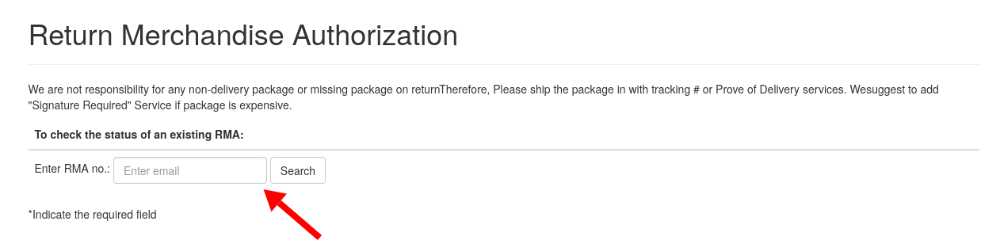
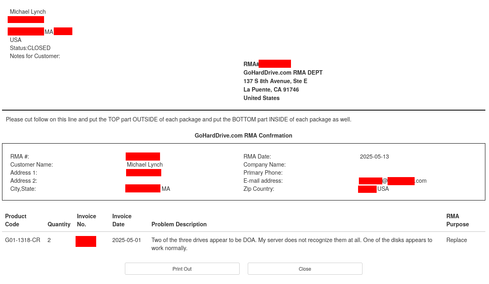

I recently purchased a set of three refurbished 8 TB hard drives from goHardDrive, a company that specializes in selling used hard drives. Two of my three drives were defective, so I had to return them. When I went through the return process, I was surprised to discover that goHardDrive's return status page allowed me to view the full address, email address, phone number, and order details of any customer that had returned merchandise to goHardDrive. I believe this affected between 10k-100k customers.

## The leak

The leak is painfully trivial. You don't need special tools or any special knowledge of web security. All you need is a regular web browser.

When I requested a return from goHardDrive, they assigned me a (RMA) number ending in five numeric digits. goHardDrive never emailed me confirmation of my RMA, so every time I checked the status, I had to type it manually in this form.

{{}}

Note that the form says email address, but it actually expects an RMA number. This form is public and has no authentication, rate limits, or CAPTCHA.

When I entered my RMA number, I saw this screen:

{{}}

That screen shows every bit of private information that goHardDrive knew about me as a customer, including:

- My name
- My mailing address
- My email address
- My phone number (which I thankfully did not provide)
- My order number and date
- The products I was returning and the reason for their return

I didn't notice how much it was exposing until I accidentally mistyped the last digit of my RMA number and saw the full information from another customer who had returned their merchandise on the same date that I had.

The URL for this page had the form of:

```text
https://ghdwebapps.com/rma/check?rmaNo=XYZ12345&fromButton=1
```

Where `XYZ12345` was just my RMA number. It would be trivial to write a script that sends an HTTP GET request for every RMA number from 00001 to 99999 and scrapes the personal details of every goHardDrive customer who had requested a return.

Note that I didn't perform this enumeration, as some companies become litigious as a way to prevent public disclosure of vulnerabilities, so I didn't want to do anything that goHardDrive could claim violated the [Computer Fraud and Abuse Act](https://www.justice.gov/jm/jm-9-48000-computer-fraud). I can't say for certain how many goHardDrive customers this vulnerability affected, but assuming that goHardDrive started their RMA numbers at somewhere at 10000 or below, I think 10k-100k customers were likely exposed in this leak.

## Sidenote: The many other issues with goHardDrive's return process

goHardDrive has the worst RMA process of any merchant I've encountered. I originally chose goHardDrive because of glowingly positive comments about goHardDrive on reddit, like this one:

In my case, two out of the three hard drives

## Bug bounty

I asked goHardDrive if they offer a bug bounty program for people who offer coordinated disclosure of security vulnerabilities. They said that they did not but they gave me a $20 refund on my $XX purchase as a thank you. For context, the bounty on a disclosure like this would [normally be in the hundreds to thousands of dollars](https://www.tabcut.com/blog/post/How-I-made-200-in-2-Minutes-on-Hackerone-Zomato-Bug-Bounty-Program-POC), so $20 is quite low.

## Timeline

- I follow up with goHardDrive asking for a status update.
