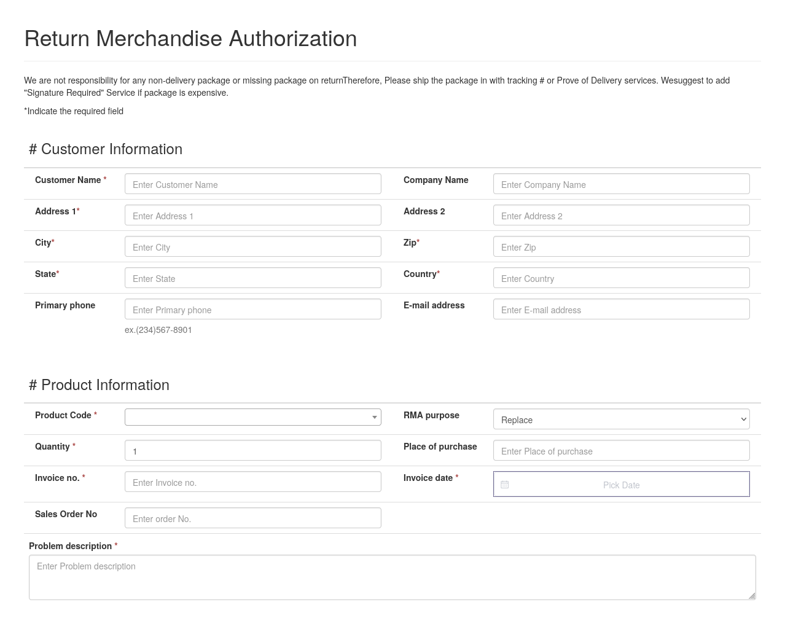

During a product return with goHardDrive, a merchant that specializes in selling used hard drives, I discovered that they were accidentally publishing details about thousands of their customer, including their full names, mailing addresses, email addresses, and order details.

## The leak

When I requested a return from goHardDrive, they assigned me a return merchandise authorization (RMA) number ending in five numeric digits. For reasons that should become clear, I'm not going to publish my actual RMA number, but you can imagine that it was a number like this:

- `GHD12345`

To check the status of my return, I typed my RMA number into this form at `ghdwebapps.com/rma`:

{{}}

When I entered my RMA number, I saw this screen:

{{}}

That screen shows every bit of private information that goHardDrive knew about me as a customer, including:

- My name
- My mailing address
- My email address
- My phone number (which I thankfully did not provide)
- My order number and date
- The products I was returning and the reason for their return

I didn't notice how much it was exposing until I accidentally mistyped the last digit of my RMA number and saw the full information from another customer who had returned their merchandise on the same date.

The URL for this page had the form of:

```text
https://ghdwebapps.com/rma/check?rmaNo=GHD12345&fromButton=1
```

It would be trivial to write a script that sends an HTTP GET request that replaces `12345` with every number from 00001 to 99999 and scrapes the personal details of every goHardDrive customer who had requested a return. Even someone with no specialized knowledge could just type any RMA number in the form and get all of that customer's data.

This form was public and had no authentication, rate limits, or CAPTCHA.

## Scale of leak

I didn't enumerate every possible RMA number to get an exact count of how many customers this affected. Some companies use the [Computer Fraud and Abuse Act (CFAA)](https://www.justice.gov/jm/jm-9-48000-computer-fraud) as a way to prevent public disclosure of vulnerabilities. I didn't want to do anything that potentially violated the CFAA, but I can deduce a lot without doing the actual scraping.

I can't say for certain how many goHardDrive customers this vulnerability affected, but assuming that goHardDrive started their RMA numbers at `10000` or below and increments by one, that means that 10k-100k customers were exposed in this leak.

## goHardDrive's attempted fix

I emailed goHardDrive about this issue on May 21, 2025. To their credit, they responded two hours later to acknowledge the issue and confirm that they would deploy a fix within three to five business days.

I didn't hear back from them, so I checked back a week later, and they said they'd updated the form to prevent attackers from enumerating RMA numbers.

I checked their RMA form and found that they changed it to require customers to enter their postal code and house number.

{{}}

At first, this seemed sufficient to me. Given a sequential RMA number, you can trivially guess every other valid RMA number, but what are the odds of guessing an RMA number and the corresponding ZIP code and house number?

Then, I thought about it a bit more. US ZIP codes are only five digits, meaning there are only 100k possible zip codes. And, actually, it's less than half that, as there are only [41,642 valid ZIP codes](https://facts.usps.com/42000-zip-codes/). And ZIP codes are not evenly distributed, so [certain ZIP codes](https://datacommons.org/ranking/Count_Person/CensusZipCodeTabulationArea/country/USA?h=zip%2F14607) are much more common.

There's a wide range of possible house numbers, but the majority are likely to fall in the range of 1 to 100, likely with heavy clustering in the lower numbers.

So, the worst case is that an attacker has to try about 41.6k x 100 = 4.16M possible combinations to leak details associated with an RMA number. Optimizing by ZIP codes and house numbers probably means the attacker has &gt;50% chance of success after about 50k guesses.

How long does it take to make 50k guesses against a web API? The security researcher brutecat recently wrote about enumerating phone numbers on a Google web API. They were able to make [40k HTTP requests per second](https://brutecat.com/articles/leaking-google-phones#time-required-to-brute-the-number) on a $0.30/hr cloud server. I doubt goHardDrive's RMA server could _serve_ 40k requests per second, but I wouldn't be surprised if an attacker could test 1k possibilities per second, meaning that they'd have a 50% chance of guessing correctly within about one minute.

## goHardDrive removes RMA status checks entirely

I followed up with goHardDrive to tell them that I thought the new mitigations were insufficient.

I suggested that they reduce the RMA details to just the RMA status and stop publishing customer data at all. As the customer, I don't need to see all of my personal details when I check my RMA status. I just want to see when goHardDrive has received my return and when they've shipped me a replacement. There's no need to publish all of my private details, though I assume it serves some internal process on goHardDrive's side.

goHardDrive didn't reply, so I followed up a week later to ask if they considered this an issue. They replied a few hours later to say they'd remove the RMA status check from their website entirely.

The following week, I checked back and found that they had indeed removed the RMA status check from the website. I asked what the new process was for getting RMA status, and goHardDrive said that customers could just email them for status updates.

## Bug bounty

I asked goHardDrive if they offer a bug bounty program for people who offer coordinated disclosure of security vulnerabilities. goHardDrive said that they had no bug bounty program, but that they'd refund $20 of my $330 purchase as a thank you.

The bounty on an information disclosure of this scale is [normally hundreds to thousands of dollars](https://www.tabcut.com/blog/post/How-I-made-200-in-2-Minutes-on-Hackerone-Zomato-Bug-Bounty-Program-POC), so $20 is quite low.

## Timeline

- 2025-05-21: I report the vulnerability to goHardDrive.
- 2025-05-21: (two hours later) goHardDrive acknowledges the issue and says that they are working on a fix. They say to expect an update in 3-5 business days.
- 2025-05-29: I request a status update from goHardDrive.
- 2025-05-29: goHardDrive responds to say that they've remediated the issue by requiring the customer to enter the matching zip code and street number for the RMA.
- 2025-06-05: I express concerns to goHardDrive about their new RMA search feature.
- 2025-06-20: goHardDrive confirms to me that they've permanently removed their RMA search form and now share RMA status exclusively over email.

## Sidenote: Leaks aside, this is a terrible return process

Even if they hadn't leaked all my data, goHardDrive has the worst RMA process of any merchant I've encountered.

I originally chose goHardDrive because of glowing comments about the company on reddit, like this user who reported that goHardDrive replaced a bad drive before even receiving the return and gave the customer a postage-paid label to send the defective unit back:

{{}}

In my case, two out of the three hard drives I purchased from goHardDrive arrived dead. I wasted a lot of time trying to diagnose hardware issues on my server because I thought it was so unlikely that two separate drives would arrive dead, but I ultimately realized that goHardDrive had simply sent me two dead drives.

I started the return process and was surprised to find that goHardDrive makes me manually re-enter all of my order and address details.

{{}}

Normally, an RMA process lets you enter your order number, and the merchant pulls up your information, and you just let them know which item you need to return. With goHardDrive, it was as if they completely forgot who I was in the two weeks since I'd made my purchase.

Also, contrary to the claim I saw on reddit, goHardDrive does not pay return shipping. I had to pay postage out of pocket even though goHardDrive had shipped me broken hardware.

Finally, goHardDrive never sent any email confirmation or updates throughout the process. I'm glad I thought to photograph my package before shipping it because I otherwise wouldn't have any record of my RMA number. From checking the insecure RMA status page, I could see my request go from `OPEN` to `RECEIVED` to `CLOSED` with no further information. Two weeks after I shipped my return, I received working replacements from goHardDrive, but they never sent me tracking information for my replacements.
