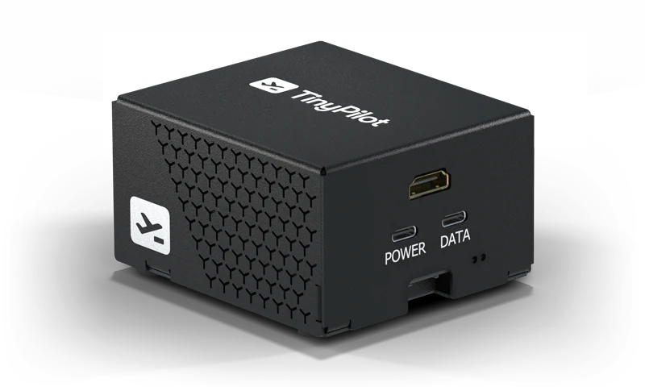
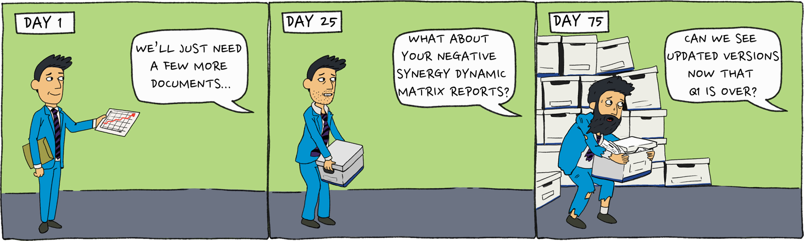

My first two years as a bootstrapped founder went poorly. I could barely find any paying customers, and all of my businesses lost money. I began questioning my decision to [quit my cushy Google job](/why-i-quit-google).

In mid-2020, yet another of my businesses [had flopped](/retrospectives/2020/04/), and it was only kind of COVID's fault. Desperate for a distraction, I made a little contraption that controlled my home servers through my web browser. I called it [TinyPilot](https://tinypilot.com).

{{}}

I [blogged about creating TinyPilot](/tinypilot/), and I immediately knew I was onto something. My post reached the [#1 spot on Hacker News](https://news.ycombinator.com/item?id=23927380) and [several](https://www.reddit.com/r/programming/comments/hwt1it/tinypilot_build_a_kvm_over_ip_for_under_100/) [popular](https://www.reddit.com/r/HomeServer/comments/jeoc74/tinypilot_build_a_kvm_over_ip_for_under_100/) [subreddits](https://www.reddit.com/r/homelab/comments/hwimys/tinypilot_build_a_kvm_over_ip_for_under_100/).

I started offering pre-packaged kits so my readers could build their own TinyPilots, and they immediately sold out. With every other project, I had to beg and plead with people even to try my product. With TinyPilot, there was so much demand that I struggled for months to keep the product stocked.

For the next four years, I focused full-time on building TinyPilot into a business and improving the product. I grew the company to a team of seven people and [$1M in annual revenue](/solo-developer-year-6/#tinypilot-became-20x-more-profitable).

A month ago, I sold the company for $600k.


{{}}
{{}}


## Details of the sale

- Sale price: $598,000 (2.4x annual earnings)
- Broker commission: $88,900
- Legal fees: $18,297
- My profit from the sale: $490,803
- Payment terms: Full cash payment at closing (no earnout, no seller financing)
- Seller obligations:
  - 30 days of free consulting (max of 40 hours/week, 80 hours total)
  - 45 days of paid consulting (max of 10 hours/week at $180/hr)
- Lifetime profit from business (including final sale): $920k over four years

## What am I allowed to say?

I specifically negotiated in the sale agreement that I could discuss the terms of the sale and the process of selling the business.

I can't say anything disparaging about TinyPilot or reveal anything about TinyPilot that would give its competitors a meaningful advantage.

## Part 1: Preparing to sell

### Why sell?

After years of flops, I was finally earning a consistent profit, selling a product I was proud of, and working with a great team. Wasn't that exactly what I wanted?

I missed writing code. TinyPilot is a hardware business, so there were tons of moving parts beyond the software. I was the sole manager of six people on three distinct teams and managed relationships with our key vendors. I rarely had uninterrupted time for deep focus, and when I did, I felt too exhausted from juggling everything else.

My wife and I also wanted to start a family. TinyPilot only occupied about 20% of my time, but it occupied 90% of my stress. I would have done a terrible job juggling founder stress with new parent stress.

### Who would want to buy such a strange business?

TinyPilot fell into an odd, in-between business category. It was a hardware manufacturer, a software company, and an eCommerce store. How would I find a buyer comfortable with all three?

There were larger competitors selling equivalent devices to TinyPilot for twice the price. I considered approaching enterprise competitors and saying, "Give me a million dollars, and I'll never build another TinyPilot."

{{}}

But I didn't want to sell out. I'd asked customers to take a chance on me as a new, unproven hardware manufacturer. Running off with the cash would have felt like a massive betrayal to my customers and the TinyPilot team.

I wanted a buyer who would keep investing in the company, not a competitor who would just axe the product or bleed it dry.

### FE International: The wrong broker for TinyPilot

In October 2022, I reached out to [FE International](https://feinternational.com/), the only brokerage I'd ever heard of that catered to bootstrapped founders. I wasn't ready to sell, but I wanted to understand the path to an exit.

FE initially seemed interested. Then, after a few email exchanges and seeing my financials, they gave me a soft brushoff:

> Unfortunately, with the current set up of two main SKUs generating roughly 98% of your revenue, this would not be a good fit for most buyers. Buyers typically want to see that a business has a minimum of 10 SKUs, and that none of these SKUs generate more than 30% of revenue.
>
> At this time we would advise, in preparation for a sale to start to consider increasing your product offering. These don’t always have to be completely new products, and this could also be USB-C cables, wall plugs, ethernet cables, servers, display ports, HDMI cables etc, this would also help to increase your AOV.

After FE's rejection, I felt trapped and panicked.

I had invested hundreds of thousands of dollars into software and hardware engineering to make just one product, and I was barely scraping by. According to FE, I had no chance of selling unless I did _ten times_ as much as I was currently doing?

### If you can't get out, get comfortable

I didn't want to shut down the company and lay everyone off, but I also didn't want to carry the stress of running TinyPilot for the rest of my life. So, I looked for ways to make the business less stressful.

One of the most difficult parts of TinyPilot was hardware revisions. We were always redesigning TinyPilot's hardware to make improvements, but that meant constantly finding new suppliers and rethinking our manufacturing pipeline. In 2023, I decided to keep the design we had and stop fiddling with the hardware.

The other source of complexity was TinyPilot's office. We were still doing everything in-house: managing inventory, assembling devices, and fulfilling orders. I worked with TinyPilot's in-person team to migrate the office's core functions to external vendors. It was a major challenge to outsource so many delicate processes, but it eliminated an enormous amount of management overhead and stress.

The happy side-effect of making TinyPilot easier to manage was that it also made the company more attractive to potential buyers. When I stopped pouring $100k/year into hardware improvements, the company became [substantially more profitable](/solo-developer-year-6/#tinypilot-became-20x-more-profitable). And without an office and custom in-house manufacturing, a prospective owner could run TinyPilot from anywhere in the world.

## Part 2: Starting the sales process

### The strategic acquirer

With the company in stronger shape, I decided to restart my search for a buyer. Going through a broker didn't work, so I began contacting buyers on my own.

In his book [_The Art of Selling Your Business_](https://books.builttosell.com/sp/the-art-of-selling-your-business-free-book-landing-page/), John Warrilow encourages founders to seek acquisitions from "strategic buyers," companies that could use your business as part of their growth strategy.

For example, if you're a salsa company that consistently makes $100k/year, a typical buyer might acquire you for $300k. But a buyer who already manufactures tortilla chips would see obvious synergy between the two businesses, so your salsa company would be worth $400k-600k to them.

{{}}

I emailed the CEOs of five companies that complemented TinyPilot in some way. Most ignored me or gave polite brushoffs, but one company showed immediate interest. I'll call them ServerCo.

ServerCo was an attractive buyer. They were bootstrapped as well, they seemed culturally aligned with TinyPilot, and we sold complementary products to similar customers. Having never participated in an acquisition before, they were cautious but enthusiastic about buying TinyPilot.

ServerCo had a lot of detailed questions about TinyPilot's finances and risks. They'd email me a round of detailed questions, I'd answer in a day or two, then there'd be weeks of silence. Finally, they'd respond with a new round of questions, and we'd start the cycle again.

After four months of intermittent discussions, ServerCo finally presented me with an offer:

- $150k cash
- $100k employment contract for 12 months of full-time work
- 25% of TinyPilot's profit the first year after closing
- 10% of TinyPilot's profit the second year after closing

They didn't intend it to be an insultingly bad offer, but it was a pretty bad offer.

eCommerce companies typically sell for 2.5-3.5x earnings. The cash portiton of ServerCo's offer was 0.9x TinyPilot's earnings.

As for the salary, $100k/year is roughly what a software developer makes fresh out of college in the US. And that's without a 12-month commitment.

I politely told ServerCo we were too far apart on price to continue negotiating, but we both agreed to keep the door open in case things changed.

### Attending Microconf and meeting Quiet Light Brokerage

In 2023, I attended [Microconf](https://microconf.com/), a small conference for bootstrapped founders. I hoped that I could either find a potential buyer there or at least get advice from other founders about what to do with TinyPilot.

One of the sponsors of the conference was a brokerage I'd never heard of, [Quiet Light](https://quietlight.com/). They piqued my interest because not only did they cater to bootstrapped founders, they worked with a lot of eCommerce companies.

At the event, I spoke with Chris Guthrie, an advisor at Quiet Light. He seemed optimistic about selling TinyPilot, so after the conference, he began working with me on a sales package. It was a set of documents and financial reports to show prospective TinyPilot buyers. It included a profit and loss statement for the past two years, a detailed questionnaire about the company, and a brief video interview with me.

Chris recommened presenting TinyPilot mainly as an eCommerce business with an asking price of around 3x the last twelve months of earnings. At the time, earnings were $208k, so we agreed to list at $599k, roughly 2.9x earnings.

{{}}

For the first two months, things looked bleak. Chris received a handful of inquiries, but they were from buyers who either wanted me to stay on as a co-founder or wanted me to finance the majority of the purchase.

### Serious buyers finally appear

Finally, in January, two attractive buyers appeared around the same time.

The first buyer was Scott, who worked a corporate job in media production but had grown disilussioned with big company culture, much like I had. He'd read my [public retrospectives about building TinyPilot](/retrospectives/) and saw potential to bring the product to a broader customer base.

The other offer was from a pair of founders. They were initially TinyPilot customers and had reached out to me about building a managed services company on top of the product. When I told them I was selling the company, they were interested in buying.

### Soliciting LOIs

The sales process officially starts with the letter of intent (LOI). The LOI lays out the high-level details of the sale, the most important being the purchase price.

Crucially, the LOI isn't binding. The document that really matters is the asset purchase agreement (APA), which you sign when the deal closes. But the LOI officially kicks off due diligence and the drafting of the APA.

When we started LOI discussions, I was in an excellent negotiation position. I had two serious buyers competing against each other. Since listing on Quiet Light, TinyPilot's annual earnings had increased by $10k, and we received pre-qualification for an SBA loan, which meant buyers who didn't have $599k in cash could now get a government-backed loan to buy the business.

Chris told the two prospective buyers that we were planning to re-launch on Quiet Light at $625k but that I'd honor the original price if they made an offer within the next two weeks.

### Price negotiations

Scott made the first formal offer, but it was for $500k, a steep $99k drop from my asking price. At that point, I had several attractive alternatives, so I declined.

We awaited an offer from the founder duo, who had sounded eager to move forward. Two days later, they backed out without making an offer at all.

Uh oh. Did I blow the deal? What if $500k was the best I was going to get, and I just rejected it? I still had the option of re-launching on Quiet Light, but seeing both buyers reject the asking price shook my confidence.

Fortunately, the next day, Scott sent a new LOI for my $599k asking price, and I accepted.

It was great to bump the price by $99k, but that would be the last point in the process that felt like I was negotiating from a position of strength.

## Part 3: Closing

### Due diligence makes me weaker by the day

One of the biggest surprises in this process was how much closing time matters.

Chris from Quiet Light had recommended selling, if at all possible, to a buyer with cash on hand rather than someone who needs a loan. When the buyer finances the purchase with a bank loan, due diligence takes longer, and there are more decision-makers who can kill the deal.

At the time, I thought, "Faster would be better, but I'm a patient person. What's an extra two months?"

I quickly learned that a slower closing isn't about a few months of patience &mdash; it's about how much additional risk and work the seller absorbs with each passing week of due diligence.

When you sell a house, the buyer has to put down a deposit of 1-5% to hold their claim on the house. If financing falls through or the buyer changes their mind, the seller keeps the money as compensation for the time they lost.

When you sell a business at TinyPilot's scale, there's no deposit. You can invest hundreds of hours into preparing reports for due diligence, reveal all your confidential business secrets, and spend thousands of dollars negotiating legal documents and still walk away with nothing if the buyer backs out.

As due diligence stretched on, my negotiating position became markedly weaker. Before signing the LOI, I could easily move on to the next buyer. By month two of due diligence, walking away from the deal meant restarting this costly and time-consuming process from zero. I'd also risk TinyPilot's sales slipping after so many months being distracted from the business.

{{}}

### Closing week

By April, we'd been in due diligence for what felt like a year but was actually just three months. Finally, on April 3rd, Scott's bank approved the deal. They recommended a closing date of Friday, April 12th.

That final week was the longest week of my life. I didn't know what to do with myself.

The only thing I could find motivation for was ruminating about all the things that could go wrong. What if the buyer got cold feet? What if Google announced an identical product and gave it away for free? What if our manufacturer spontaneously went out of business?

It felt like I was on my way to my retirement party, but there was a 5% chance that when I got there, my boss would say, "Gotcha! You're not really retiring. Now, work extra hard to make up for all the time you wasted preparing to leave."

On closing day, I couldn't focus on anything at all. I woke up at 4 AM and couldn't fall back to sleep. I couldn't do anything that required even basic thinking, and I couldn't relax enough to watch TV, so I started disassembling some old TinyPilot devices while checking my email every 90 seconds.

Finally, at 2 PM, I received the email I'd been waiting for all day. The escrow company confirmed that they had the money ready to wire, so I signed the closing documents. TinyPilot was no longer my company.

## Part 4: After the sale

The first thing I did after I got the money was eat dessert.

My wife and I were at dinner the night of the closing, and I got the email confirmation of the wire transfer right before our dessert arrived.

{{}}

Over the next 48 hours, I had celebratory meals with friends and family in different parts of Massachusetts, during which I ate the following desserts (in order):

1. Chocolate tort and vanilla ice cream
1. Oreo cheesecake
1. Chocolate lava cake and vanilla ice cream
1. Chocolate caramel cheesecake
1. Crème brûlée
1. Pizookie Trio (Strawberry Shortcake, Sugar Cookie, Salted Caramel)

### Did I feel relief?

When I talked to friends about the sale, the most common question was whether I felt relieved to be done.

For the first few weeks, I still felt anxious. Consciously, I knew that the deal had closed, but my body was still stuck in high-alert mode from months of urgent due diligence requests.

I got more relaxed each week and probably felt Officially Relaxed™ by week three. By that point, I'd transferred all of TinyPilot's accounts to Scott, and he was comfortable taking the reins. I felt like the company was in good hands.

### Do I feel a loss of identity?

I've heard other founders say they struggled with a loss of identity after they sold their business. Others say it feels like they've given up their baby.

I didn't feel a change in identity or a sense of deep loss.

I always ran TinyPilot like a modest small business rather than a world-changing startup. I'm proud of TinyPilot and put a lot of care into the company, but it was never a blood, sweat, and tears thing for me.

## Timeline

- Oct. 3, 2023 - I sign an engagement letter with Quiet Light.
- Oct. 17, 2023 - Quiet Light lists TinyPilot on their website.
- Dec. 15, 2023 - I have my first conversation with Scott.
- Jan. 16, 2023 - I receive the first LOI.
- Jan. 23, 2024 - I sign the LOI with target close date of April 16.
- Feb. 23, 2024 - I get the first draft of the APA.
- March 7th, 2024 - Lender approves the loan.
- March 20th, 2024 - Scott and I finalize the APA.
- March 25th, 2024 - Lender finishes legal review and submits loan package to SBA.
- April 3rd, 2024 - Lender notifies buyer of SBA approval and suggests a closing date of April 12th.
- April 12th, 2024 - We sign final legal agreements, and I receive payment.

## What's next?

My wife and I are expecting our first child in August, so that's been the main thing I'm preparing for. I'm trying to keep plans loose until I see what my life is like with a baby.

In the short term, I'm looking for simple projects that I can step away from abruptly when the baby arrives. Beyond that, I'd like to find a way to build a virtuous cycle between my blog and my business. I'd love it if I could write about what I'm interested in, then attract cusomers to my product through my writing and fund my writing from the business.

If you're a reader of my blog, let me know what you're interested in seeing me do next, and maybe I'll do it:

- [What should Michael do next?](https://tally.so/r/nr6Pyv)

As for TinyPilot, Scott plans to keep improving the product and bring it to a wider audience. Everyone on the team received offers to stay on, and they all accepted. The company will continue to publish updates on [TinyPilot's blog](https://tinypilotkvm.com/blog), and Scott is continuing my tradition of [blogging about TinyPilot's behind-the-scenes strategy](https://www.aftertheladder.com).

---

_Original illustrations by [Piotr Letachowicz](https://cartoony.eu). Thanks to other founders who shared their acquisition stories, especially [Josh Pigford](https://baremetrics.com/blog/i-sold-baremetrics), [Kareem Mayan](https://blog.codetree.com/articles/what-its-like-buying-a-128k-side-project.html), and [Laura Roeder](https://lauraroeder.com/exactly-how-i-cold-emailed-my-way-to-a-life-changing-exit-and-you-can-too-165d8eaf8306)._
