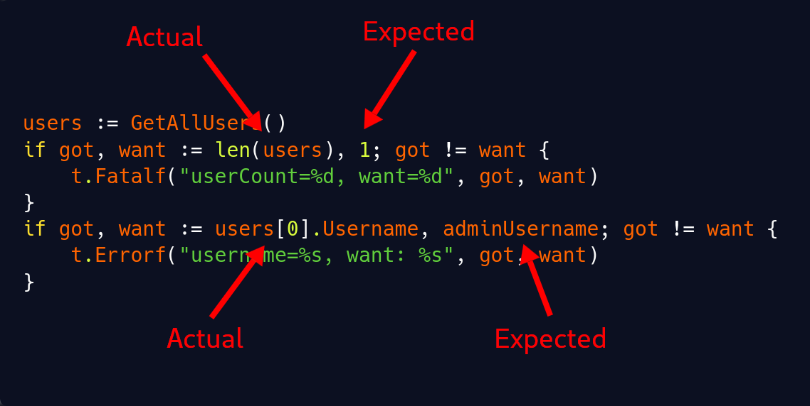

There's an excellent Go pattern for creating clearer tests, and too few people are aware of it. I can teach it to you in 30 seconds.

Instead of writing Go tests like this:

```go
// The common, unrefined way.
username := GetUser()
if username != "dummyUser" {
  t.Errorf("unexpected username: got %s, want: %s", username, "dummyUser")
}
```

Write your tests like this, beginning each assertion with `if got, want :=`:

```go
// The underused, elegant way.
if got, want := GetUser(), "dummyUser"; got != want {
  t.Errorf("username=%s, want=%s", got, want)
}
```

The `if got, want :=`: pattern works even better in [table-driven tests](https://go.dev/wiki/TableDrivenTests). Here's an example from [my library for parsing social media handles](https://github.com/mtlynch/social-go/blob/5348ed8e66e318651c646aea4d72ef62481c30fa/twitter_test.go):

```go
func TestParseTwitterHandle(t *testing.T) {
	for _, tt := range []struct {
		explanation    string
		input          string
		handleExpected social.TwitterHandle
		errExpected    error
	}{
		{
			"regular handle on its own is valid",
			"jerry",
			social.TwitterHandle("jerry"),
			nil,
		},
		{
			"regular handle in URL is valid",
			"https://twitter.com/jerry",
			social.TwitterHandle("jerry"),
			nil,
		},
		{
			"handle with exactly 15 characters is valid",
			"https://twitter.com/" + strings.Repeat("A", 15),
			social.TwitterHandle(strings.Repeat("A", 15)),
			nil,
		},
		{
			"handle with more than 15 characters is invalid",
			"https://twitter.com/" + strings.Repeat("A", 16),
			social.TwitterHandle(""),
			social.ErrInvalidTwitterHandle,
		},
	} {
		t.Run(fmt.Sprintf("%s [%s]", tt.explanation, tt.input), func(t *testing.T) {
			handle, err := social.ParseTwitterHandle(tt.input)
			if got, want := err, tt.errExpected; got != want {
				t.Fatalf("err=%v, want=%v", got, want)
			}
			if got, want := handle, tt.handleExpected; got != want {
				t.Errorf("handle=%v, want=%v", got, want)
			}
		})
	}
}
```

## How does it work?

Simple `if` statements in Go evaluate a boolean expression:

```go
// A simple if statement that evaluates a boolean expression.
if volume > maxVolume {
  volume = maxVolume
}
```

Go allows [a second type of `if` statement](https://go.dev/ref/spec#If_statements) where you can execute a statement before evaluating the boolean expression:

```go
// Execute a statement before evaluating the boolean expression.
if volume := getRequestedVolume(); volume > maxVolume {
  panic("requested volume is too high")
}
```

The neat trick is that you can declare and assign multiple variables within an `if` statement:

```go
// Declare and assign multiple variables within if statement.
if a, b, c := nextScore(), nextScore(), nextScore(); a + b + c == 300 {
  fmt.Print("Congratulations! You got a perfect score!")
}
```

Variables that you declare within the scope of the `if` statement only exist within the `if` statement. That's why you can reuse the variable names `got` and `want` in all of your assertions without causing naming conflicts.

In fact, if you try to access `got` or `want` outside of an `if` statement, the Go compiler will tell you that the variable doesn't exist:

```go
// got and want are only available within the if statement.
if got, want := GetUser(), "dummyUser"; got != want {
  t.Errorf("username=%s, want=%s", got, want)
}
log.Printf("username was %s", got) // This won't compile
```

## What's so great about this technique?

### It trains your eye to find important information

Go code tends to be verbose, especially its test logic.

Consider the following test snippet:

```go
users := GetAllUsers()
if len(users) != 1 {
  t.Fatalf("expected only a single user, got %d", len(users))
}
if users[0].username != adminUsername {
  t.Errorf("unexpected username: got %s, want: %s", users[0].username, adminUsername)
}
```

At a glance, is it obvious which values I expect and which are the values that `GetAllUsers` returned? Not to me.

If I rewrite the above snippet using the `if got, want :=` pattern, the ambiguity goes away:

```go
users := GetAllUsers()
if got, want := len(users), 1; got != want {
  t.Fatalf("userCount=%d, want=%d", got, want)
}
if got, want := users[0].username, adminUsername; got != want {
  t.Errorf("username=%s, want: %s", got, want)
}
```

Once you know the pattern, your eye can quickly find the important information in a test assertion:

{{}}

### It's easy to copy/paste

When the variables are always named `got` and `want`, you can copy paste assertions without having to change much. You usually just have to change the assignments, the name in the `t.Errorf`, and maybe the format specifiers (e.g., `%s` vs `%v`).

It also protects you from a mistake I made frequently before this technique where I'd copy/paste a structure but forget to update the error message, so it referred to the wrong thing, like this:

```go

```

### It distinguishes test assertions from test logic

When I implement HTTP servers in Go, I often write unit tests that look like this:

```go
func TestUserHandler(t *testing.T) {
    for _, tt := range []struct {
        explanation     string
        payload         string
        statusExpected  int
        responseExpected string
    }{
        {
            "valid request returns success",
            "username=doug",
            http.StatusOK,
            "created user doug",
        },
        {
            "reject username with angle brackets",
            "username=d<script>oug",
            http.StatusBadRequest,
            "",
        },
        {
            "reject empty username",
            "username=",
            http.StatusBadRequest,
            "",
        },
    } {
        t.Run(tt.explanation, func(t *testing.T) {
            req, err := http.NewRequest("POST", "/user", strings.NewReader(tt.payload))
            if err != nil {
                t.Fatal(err)
            }

            s := NewServer()
            rec := httptest.NewRecorder()
            s.Router().ServeHTTP(rec, req)
            res := rec.Result()

            if got, want := res.StatusCode, tt.statusExpected; got != want {
                t.Fatalf("httpStatus=%v, want=%v", got, want)
            }

            // If this is not a test for valid input, ignore the rest of the
            // server's response.
            if tt.statusExpected != http.StatusOK {
                return
            }

            body, err := io.ReadAll(res.Body)
            if err != nil {
                t.Fatal(err)
            }
            defer res.Body.Close()

            if got, want := string(body), tt.responseExpected; got != want {
                t.Fatalf("response=%s, want=%s", got, want)
            }
        })
    }
}
```

In that test body, there are two different types of `if` statements: test assertions and test logic branches.

Every `if` statement with the `if got, want :=` pattern is an assertion about the code that I'm testing.

Every other `if` statement is just controlling code flow of my test and is not an assertion about my code. For example, the first `if` statement in the test is to check that I was able to construct an HTTP request object:

```go
req, err := http.NewRequest("POST", "/user", strings.NewReader(tt.payload))
if err != nil {
    t.Fatal(err)
}
```

That's not an assertion about my code because I haven't even called my server yet. If that code fails, something wacky has happened in the Go standard library.

On the other hand, any time the reader sees `if got, want :=`, they can be certain I'm asserting something about the code I'm testing:

```go
if got, want := res.StatusCode, tt.statusExpected; got != want {
    t.Fatalf("httpStatus=%v, want=%v", got, want)
}
```

## Why not use a third-party test assertion library?

If you're a devout user of a third-party testing library like `stretchr/testify` or `is`, then this post probably sounds ridiculous to you. With those libraries, you get both expressive test output and clear assertions, so why don't I just use one of those libraries?

When I started writing Go, I was mainly writing Python, so I thought it was absurd that Go didn't come with an API like [Python's `unittest.assertEqual`](https://docs.python.org/3/library/unittest.html#basic-example). I immediately reached for third-party libraries for mocks and assertions, but my more experienced teammates asked me to try foregoing them in favor of the Go standard library.

I came to prefer the minimalism and explicitness of Go's standard testing library over third-party libraries. Eschewing third-party testing libraries means one less dependency and one less layer of technology for newcomers to learn when they work on my codebase.

## Credit

I learned this technique from [Litestream](https://litestream.io/) author, [Ben Johnson](https://github.com/benbjohnson), who, in turn, learned it [from its occasional use in the Go standard library](https://github.com/search?q=repo%3Agolang%2Fgo+%22if+got%2C+want%22+&type=code).
