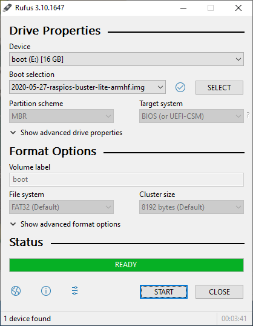
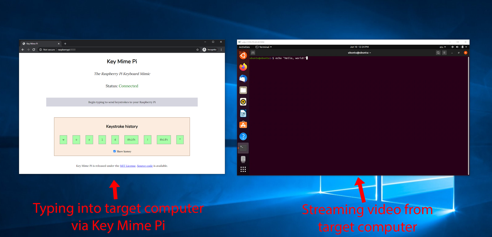

Recent versions of the Raspberry Pi support USB on-the-go (USB OTG), which allows them to impersonate USB devices such as keyboards, thumb drives, and microphones. To take advantage of this, I made an open-source web app that turns my Pi into a fake keyboard. I call it [Key Mime Pi](https://github.com/mtlynch/key-mime-pi.git).

This post demonstrates how Key Mime Pi works and how you can build one for yourself.

## Demo



## What you'll need

* A Raspberry Pi that supports USB OTG:
  * [Raspberry Pi 4](https://amzn.to/3fdarLM) (all variants)
  * [Raspberry Pi Zero W](https://amzn.to/2BMgOXN)
  * Raspberry Pi A and A+ *(verification needed)*
    * [This source](https://raspberrypi.stackexchange.com/a/73911) claims that early Pis support USB OTG, but I have not tested these devices personally.
* [Raspberry Pi OS](https://www.raspberrypi.org/downloads/raspberry-pi-os/) (aka Raspbian)
  * Stretch or later
* A USB cable
  * For the Pi 4: [USB-C to USB-A](https://www.amazon.com/AmazonBasics-Type-C-USB-Male-Cable/dp/B01GGKYN0A/) (Male/Male)
  * For the Pi Zero W: [Micro-USB to USB-A](https://amzn.to/2B08iE5) (Male/Male)
* Alternate power source (optional)
  * [USB to TTL serial cable](https://amzn.to/3cVkuTT)
  * [USB wall charger](https://amzn.to/3hal8Ax)

## Install Raspberry Pi OS Lite

To begin, install [Raspberry Pi OS lite](https://www.raspberrypi.org/downloads/raspberry-pi-os/) (formerly known as Raspbian) on a microSD card.

{{}}

Enable SSH access by placing a file called `ssh` on the microSD's boot partition, and insert the microSD card into your Pi device. If you're connecting over wireless, you'll also need to [create a `wpa_supplicant.conf` file](https://www.raspberrypi.org/documentation/configuration/wireless/headless.md) on the boot partition.

## Connecting your Pi

Connect the USB cable to your Pi's USB OTG port. On the Pi 4, this is the USB-C port. For the Pi Zero, it's the Micro-USB port labeled "USB."


  
  


Connect the other end of the USB cable to the computer that you want to connect to as a keyboard. USB 3.0 ports work better because they output more power, but all the USB 2.0 ports I tested worked fine as well.

Your Pi should draw power from the computer's USB port and power up.

## Install Key Mime Pi

You have two options for installing Key Mime Pi. You can do it using plain old bash, which requires no external tools. Or, for a touch of class, install it via [Ansible](https://docs.ansible.com/ansible/latest/index.html), my favorite open source configuration management tool.

### Option 1: The pure bash way

From a bash shell, enter the following commands to connect to your Pi and configure it for USB device emulation:

```bash
# SSH into your Pi
PI_HOSTNAME="raspberrypi" # Change to your pi's hostname
PI_SSH_USERNAME="pi"      # Change to your Pi username

# Connect to the Pi (default password is "raspberry")
ssh "${PI_SSH_USERNAME}@${PI_HOSTNAME}"

# Install pre-requisites
sudo apt-get update && \
  sudo apt-get install -y \
    git \
    python-pip \
    python3-venv

# Install Key Mime Pi
git clone https://github.com/mtlynch/key-mime-pi.git
cd key-mime-pi
sudo ./enable-usb-hid
sudo reboot
```

Allow the Pi to reboot, then SSH in again and start the Key Mime Pi web server:

```bash
ssh "${PI_SSH_USERNAME}@${PI_HOSTNAME}"
cd key-mime-pi
python3 -m venv venv
. venv/bin/activate
pip install --requirement requirements.txt
PORT=8000 ./app/main.py
```

### Option 2: The Ansible way

If you're an Ansible user, you can use my [Key Mime Pi Ansible role](https://galaxy.ansible.com/mtlynch/keymimepi) for better automation. The following commands install Key Mime Pi on your device as a [systemd service](https://wiki.archlinux.org/index.php/systemd):

```bash
PI_HOSTNAME="raspberrypi" # Change to your pi's hostname
PI_SSH_USERNAME="pi"      # Change to your Pi username

# Install the Key Mime Pi Ansible role
ansible-galaxy install mtlynch.keymimepi

# Create a minimal Ansible playbook to configure your Pi
echo "- hosts: $PI_HOSTNAME
  roles:
    - role: mtlynch.keymimepi" > install.yml

# Install all software (default password is "raspberry")
ansible-playbook \
  --inventory "$PI_HOSTNAME", \
  --user "$PI_SSH_USERNAME" \
  --become \
  --become-method sudo \
  --ask-pass \
  install.yml

# Reboot the Pi
ansible \
  "$PI_HOSTNAME" \
  -m reboot \
  --inventory "$PI_HOSTNAME", \
  --user "$PI_SSH_USERNAME" \
  --ask-pass \
  --become \
  --become-method sudo
```

## Using Key Mime Pi

After you run the install script, Key Mime Pi will be available at:

* [http://raspberrypi:8000/](http://raspberrypi:8000/)

Its interface looks like this:

{{}}

And like, magic, when you type into your browser, the keys will appear on the machine connected to the Pi.

{{}}

## How it works

### USB device emulation

The real magic here comes from [Linux's USB Human Interface Device (HID) gadget driver](https://www.kernel.org/doc/html/latest/usb/gadget_hid.html). It allows user-mode applications to interact with the operating system as if they were USB devices.

The [key-mime-pi configuration script](https://github.com/mtlynch/ansible-role-key-mime-pi/blob/master/files/enable-rpi-hid) creates a file path at `/dev/hidg0`. Any program can read or write to this path, and the OS translates the data to keyboard signals.

To mimic a keyboard, the Pi has to communicate with the OS according to the [USB HID spec](https://www.usb.org/sites/default/files/documents/hid1_11.pdf). At 97 pages of keycodes and tables, that document is a bit of a slog, but it turns out that the protocol for keyboards is dead simple.

Upon each keystroke, the keyboard sends an 8-byte message called a "report."

| Byte Index | Purpose |
|------------|---------|
| 0          | Modifier keys (Ctrl, Alt, Shift) |
| 1          | Reserved for manufacturers |
| 2          | Key #1   |
| 3          | Key #2   |
| 4          | Key #3   |
| 5          | Key #4   |
| 6          | Key #5   |
| 7          | Key #6   |

Sending the keys for "Hi" looks like this:

```bash
# H (Right shift + h)
echo -ne "\x20\0\xb\0\0\0\0\0" > /dev/hidg0
# i
echo -ne "\0\0\xc\0\0\0\0\0" > /dev/hidg0
# Release all keys
echo -ne "\0\0\0\0\0\0\0\0" > /dev/hidg0
```

In addition to signalling key presses, keyboards must also indicate key releases. An 8-byte block of zeroes indicates that no keys are active.

The above example sent one keystroke at a time, but HID reports have space for six keys. This means you can send up to six keystrokes in a single message as long as they're distinct keys:

```bash
echo -ne "\0\0\x1a\x0b\x04\x17\x18\x13" > /dev/hidg0 && \
  echo -ne "\0\0\0\0\0\0\0\0" > /dev/hidg0
```

```
whatup
```

### Translating from JavaScript to HID

When you type into a browser window, JavaScript generates events for each keystroke. The website [keycode.info](https://keycode.info) provides an excellent demonstration of this functionality in action.

JavaScript key events include keycodes, but they're distinct from HID keycodes. Fortunately, there's a mostly 1:1 mapping between the two. To translate from JavaScript to HID, I created a [lookup table](https://github.com/mtlynch/key-mime-pi/blob/904e56b6bf1f76da1abb85f654637da0e3c35fa3/app/js_to_hid.py#L32) like this:

```python
_JS_TO_HID_KEYCODES = {
    3: 0x48,  # Pause / Break
    8: 0x2a,  # Backspace / Delete
    9: 0x2b,  # Tab
    ...
    65: 0x04,  # a
    66: 0x05,  # b
    67: 0x06,  # c
    68: 0x07,  # d
```

The Key Mime Pi server listens for JavaScript keycode events from the browser, translates them into HID codes, then sends them to the Pi's HID interface at `/dev/hidg0`.

Here's how it works from end to end:

1. A user hits a key in the browser.
1. JavaScript on the page sends the JavaScript keycode to the Key Mime Pi server on the Pi.
1. The Key Mime Pi server translates the JavaScript keycode to its equivalent HID code.
1. The Key Mime Pi server sends the HID code to the USB gadget interface at `/dev/hidg0`.
1. The computer connected to the Pi's USB cable receives this as keyboard input, causing a character to appear on the screen.

## The power problem

In my tests, USB ports from computers produced enough electricity to power the Pi, but under-voltage warnings appeared frequently in the system log:

```bash
 $ sudo journalctl -xe | grep "Under-voltage"
Jun 05 03:46:05 pikvm kernel: Under-voltage detected! (0x00050005)
Jun 05 03:48:29 pikvm kernel: Under-voltage detected! (0x00050005)
Jun 05 03:54:22 pikvm kernel: Under-voltage detected! (0x00050005)
```

The Pi was correctly detecting that standard USB 2.0 and USB 3.0 ports provide insufficient power to meet the Pi's requirements.

| Raspberry Pi Model | Power requirements |
| ------------------ | ------------------ |
| Pi Zero W          | 5 V / 1.2 A        |
| Pi 4               | 5 V / 3.0 A        |

Standard USB ports come up short:

| USB Port Type      | Power output       |
|--------------------|--------------------|
| USB 2.0            | 5 V / 0.5 A        |
| USB 3.0            | 5 V / 0.9 A        |

I currently am still searching for a solution tot his problem. Here are some possible solutions I have not yet tested:

* Use a [PoE HAT](https://www.raspberrypi.org/products/poe-hat/) to draw power from the Ethernet port
* Use the [Zero2Go Power Adaptor](http://www.uugear.com/product/zero2go-omini-wide-input-range-multi-channel-power-supply-for-raspberry-pi/) to connect an [AC to microUSB adaptor](https://amzn.to/30OyQl6).

## Maintaining continuous power

Relying on power from the target computer has the drawback that the Pi can only run when the target computer is turned on. In my tests, the Pi survived reboots of the target computer, but when the target shut off completely, the Pi lost power.

I solved this by purchasing a [USB wall charger](https://amzn.to/2YitxsN) and a [USB to TTL serial cable](https://amzn.to/2Yk1CIX). The USB to TTL cable connects to the Pi's GPIO pins, ensuring the device always receives power, though the cable provides only 0.5 Amps, which is still lower than the Pi requires for stable operation.



## Troubleshooting

### Verifying the driver is working

If Key Mime Pi fails to forward keystrokes to the target machine, the first step is to determine whether the USB gadget is working properly.

Try the following commands:

```bash
echo -ne "\0\0\xb\0\0\0\0\0" > /dev/hidg0 && \
  echo -ne "\0\0\xc\0\0\0\0\0" > /dev/hidg0 && \
  echo -ne "\0\0\0\0\0\0\0\0" > /dev/hidg0
```

If everything is working, you should see the following output on the machine the Pi is connected to via USB:

```
hi
```

### Writes to HID interface hang

When testing Key Mime Pi on the Pi Zero W, I ran into a case where writes to `/dev/hidg0` hung indefinitely. I tried a different Micro-USB to USB-A cable, and the problem went away. I suspect that the first cable was either damaged or supported power only and not data. If you run into hanging writes to `/dev/hidg0`, try a USB cable that supports data transfer (most USB cables do).

## Next step: embedding display output

Remote typing is fun, but it's a bit impractical. When you're typing into a system, it generally helps to see the output too.

My next step is to capture HDMI output from the target computer and embed it in Key Mime Pi's web interface. That way, I'll be able to plug my Pi into a headless server and have a virtual console in the browser. It will essentially be a low-cost, hackable [KVM over IP device](https://amzn.to/2ZVT51k).

I have a working prototype using [ffplay](https://ffmpeg.org/ffplay.html) and an [HDMI extender](https://amzn.to/3cxrYfI), but I'm still working on a solution that puts everything in a single browser window with low latency.

{{}}

## Want a pre-configured kit?


**Update: June 29, 2020**


I now have a working solution that both captures video output from a target device and allows you to send keystrokes, all within a browser window.


A detailed follow-up post is coming soon, but in the meantime, you can pre-order pre-configured KVM Pi kits that include everything you need to build your own KVM Pi:

* [tinypilotkvm.com](https://tinypilotkvm.com)

## Source code

Key Mime Pi's code is fully open source under the permissive [MIT license](https://opensource.org/licenses/MIT):

* [key-mime-pi](https://github.com/mtlynch/key-mime-pi.git): Web server that forwards keystrokes to the Pi's virtual keyboard.
* [ansible-role-key-mime-pi](https://github.com/mtlynch/ansible-role-key-mime-pi): The Ansible role for configuring the Pi's USB gadget functionality and for installing the web server as a systemd service.

## Acknowledgments

* [raspberrypisig/pizero-usb-hid-keyboard](https://github.com/raspberrypisig/pizero-usb-hid-keyboard) was the first sample code I found that successfully installed the virtual USB HID device on my Pi.
* [Fmstrat/diy-ipmi](https://github.com/Fmstrat/diy-ipmi) was an inspiration for this project and proved that it was possible to make a Pi function as a KVM over IP.
* [Rafael Medina](https://www.rmedgar.com/blog/using-rpi-zero-as-keyboard-send-reports) provided the most readable explanation of the HID protocol I found.
* Thanks to the Linux and Raspberry Pi OS developers who made USB gadget functionality possible.