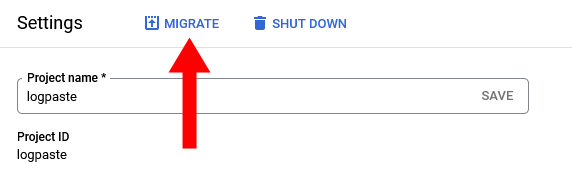
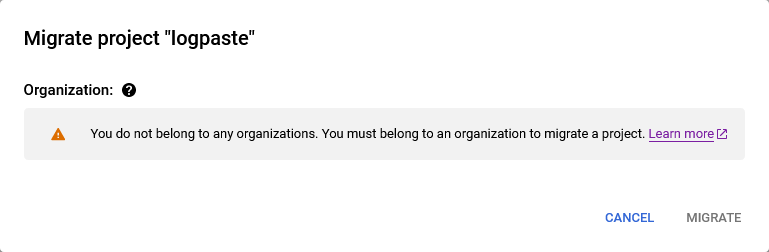

In April of this year, [I sold TinyPilot](/i-sold-tinypilot/), the bootstrapped [hardware company](https://tinypilotkvm.com) I founded and ran for four years.

My earlier post told the story of how the sale happened, but I'd like to share more about the practical lessons I learned from the sale itself.

In this post, I'm sharing what went well, what I want to improve in the future, and what surprised me about the process of selling my business.

## What I'm glad I did

### Invested heavily into documentation

Before I even started my first business, I read the book _Built to Sell_ by John Warrilow. The book encourages founders to organize their company so that it runs smoothly even if the founder is not actively managing day-to-day business. An effective company has a set of well-defined processes, and the team knows how to execute those processes.

I've always been a fan of clear documentation, so when I started building out the team for TinyPilot, I invested a lot into documentation. Rather than train people in person or on video calls, I would wrote playbooks and ask the team member to follow them. If we ran into issues or misunderstandings, we'd update the playbook. When new team members joined, they'd onboard via the same playbooks, and we'd continuously improve them.

After I sold TinyPilot, the contract called for a 30-day transition period during which I would provide up to 80 hours of consulting time to help the buyer with the transition.

The buyer ended up using only about 25 hours of the consulting time available. The team already knew how to run the day-to-day of TinyPilot, and the buyer had access to all of our documentation. Most of my time post-transition was just introducing the new owner to the team and our key vendors.

### Created a transition checklist

When I began serious discussions about selling TinyPilot, I started a checklist of all the things I wanted to do before I sold. It included things like deleting outdated information from our playbooks and ensuring that all of our account credentials were in the company Bitwarden account.

As we entered due diligence, I expanded this checklist to include things that would need to happen during the transition. I split the checklist into four categories:

- Things that must happen before closing
- Things that must happen a day or two after closing
- Things that should happen within the first week after closing
- Things that should happen within the first month after closing

It was helpful to start this checklist several months before the actual closing because new things came to mind through negotiations. For example, I'd send a letter to one of TinyPilot's affiliate partners and then remember to add, "Introduce buyer to affiliates" to the post-close checklist.

The checklist turned out to be extremely valuable, especially the week of the closing. So many accounts were changing hands and processes needed tweaking for the new owner, so it was helpful to have a checklist I created in calmer times.

### Worked with a broker I trusted

Before I started the sales process for TinyPilot, I had a negative view of M&A brokers. The picture in my head of a broker was someone who just wanted to close deals as quickly as possible for the highest possible number and didn't care about anything else. I imagined them saying things like, "Let's bottom line this," or "Time for some Jäger bombs!"

When I attended Microconf in 2023, I met Chris Guthrie, an advisor at Quiet Light Brokerage. He immediately came across as laid back, low-pressure, and founder-focused. He was a former founder, and he talked about finding the best deal for the founder, not necessarily the quickest payout.

I appreciated working with Quiet Light because our incentives felt aligned throughout the process. The pool of founders looking for M&A brokers is small and fairly tight-knit, so Quiet Light has natural pressure to maintain a positive reputation.

In discussions about the sale, some people balked at Quiet Light's $88.9k fee, as it represented 15% of the sale price. I still think that was a fair commission, as they found me a buyer that I couldn't have found on my own.

### Avoided seller financing

When I started thinking about a sale, I didn't need cash desperately, so I was open to receiving payments in installments over several years.

When I spoke to other founders about seller financing, they warned me away from it. One founder had advice that stuck with me:

> If you sell to a buyer and finance the purchase yourself, you now work for the buyer.

I was puzzled. How does financing the sale mean I work for the buyer?

The founder explained that you don't get paid unless the business makes money, and the new owner knows that. The new owner can dump management responsibilities onto you. If you say no, the new owner can let the business fail, and they stop making payments to you.

The other major risk of seller financing is that I, as a small time lender, don't have tools or experience to collect a loan if a buyer defaults. The buyer might have plenty of cash to pay and simply refuse. For a deal that's under $1M, I'd probably spend more in legal fees than I could hope to collect from an unscrupulous buyer.

I would have been open to seller financing if there were no other options available, but it would be a major red flag to me that the buyer was unable to obtain a loan from a bank. Further, I'd need interest rates that are much higher than the prevailing rates banks offer because my risk would be so much higher than a bank's.

### Assumed I'd get nothing after closing

From talking to other founders about acquisition stories, most people seemed disappointed with the payments they were supposed to receive after closing. In some cases, the buyer failed to honor the contract, but it was too small an amount for the seller to litigate. In other cases, the new owner used creative bookkeeping to avoid paying performance-based bonuses.

The advice I heard consistently was to structure the deal so that if I got nothing after closing, I'd still be happy. I should treat anything after closing as an unexpected bonus.

The buyer and I did send some money back and forth after closing to account for little costs that we forgot to include in the deal, and that went smoothly. These amounts were a tiny part of the overall transaction, less than $5k. I would have been frustrated had the buyer not paid, but the amounts were so small that I never stressed about the buyer withholding payment.

### Recognized the limits of my influence on the business post-close

One of the most important aspects of the deal was that the new owner continued investing in the product, the team and our customers.

I asked other founders for advice about how to avoid a buyer who will simply gut the company and squeeze everything for short-term profits. The advice I heard was that I can't control what the new owner does after closing, so I shouldn't think about it.

It's true that I can't control how the new owner runs their business, but I think it's possible to screen out risky buyers. For example, if I was approached by a company like Idera, I'd notice that they have a history of buying companies and [laying off their staff](https://news.ycombinator.com/item?id=19218036), so I'd have a good guess about their plans for TinyPilot.

I looked for buyers whose vision for the company aligned with mine, but I also recognized that my influence over the company ended on closing day. And I feel like that worked. The new owner runs the business his own way, but his approach matches what we discussed about his vision for the company.

### Revised the broker agreement so that the broker gets paid when I get paid

The broker agreement that Quiet Light initially sent me said that their broker fee is a percentage of the purchase price, and it's due at closing.

The problem I saw in that agreement was that I, as the seller, may not receive the full purchase price at closing. I sign with the broker well before I know the terms of any deal they might find me.

If the purchase agreement involved deferred payment, I'd have to pay Quiet Light upfront and potentially wait years until I received my full end of the deal. Worse, if the buyer failed to make payment after closing, I'd have paid a broker commission on money I never received.

I requested that Quiet Light revise the broker agreement to say that they only get paid when I get paid, and they quickly agreed.

I was relieved that they were willing to adjust their contract, as the new payment terms kept incentives aligned between me and Quiet Light. They'd have just as much incentive to push back against deferred payments as I would.

### Discussed contentious issues without lawyers first

For this acquisition, the buyer drafted their own asset purchase agreement. For the most part, we agreed on the initial draft, but there were a few key terms where we had different expectations.

We could have each told our lawyers what we wanted and had them hash it out, but lawyers get expensive fast &mdash; mine was $550/hr.

Lawyers also slow down the process. The buyer and I could usually arrange to meet within one business day, whereas arranging a meeting with both of our lawyers would probably take a week. For a process that already felt long at three months, every day mattered.

When the buyer and I ran into disagreements in the contract, we'd first talk one-on-one. In these conversations, my goal was to go past the terms in the contract and find out the underlying need.

For example, the first draft of the contract called for tight restrictions on discussing the sale publicly. So, the buyer and I talked about why the clause was there, and it turned out that there were only a small number of things the buyer cared about me disclosing. We adjusted the wording from "you can't discuss anything publicly" to "you can't discuss [these two specific things](/i-sold-tinypilot/#what-am-i-allowed-to-say) publicly," and we both felt good about the compromise.

### Used dedicated accounts for the business

Part of what made ownership handoff smooth was that TinyPilot's accounts and infrastructure were totally separate from my other business and personal accounts:

- I always sent emails related to the business from my @tinypilotkvm.com email address.
- I kept TinyPilot's email in a dedicated Fastmail account.
  - This wasn't true at the beginning. TinyPilot originally shared a Fastmail account with my other businesses, but I eventually migrated it to its own standalone Fastmail account.
- Every service TinyPilot used was associated with an @tinypilotkvm.com email address.
- I never associated my personal phone number with TinyPilot, Instead, I always used a dedicated Twilio number that forwarded to my real number.
- All account credentials were in Bitwarden.

After closing, handing over control was extremely straightforward. I just added the new owner to Bitwarden, and they took over from there. There were a few hiccups around 2FA codes I'd forgotten to put in Bitwarden, but we worked those out quickly.

## What I'll do differently in the future

### Offer incentives for a cash buyer

One of the biggest factors for closing time is how the buyer is financing the purchase. In TinyPilot's case, the buyer used a loan from the US Small Business Administration (SBA), which is common for deals of TinyPilot's scale.

The typical closing time for a buyer with an SBA-backed bank loan is three to five months. For TinyPilot, the time from signing the letter of intent to closing day was three months, so we were relatively fast.

The problem is that [every day of due diligence makes the seller weaker](/i-sold-tinypilot/#due-diligence-makes-me-weaker-by-the-day). If the buyer had backed out the day before closing, that would have been an enormous blow, as the sale had occupied most of my work focus for several months.

If I sell another business, I plan to offer incentives that make it easier for the buyer to purchase in cash. I could offer a discount for a cash purchase or make other accomodations to attract buyers who can purchase in cash and make a fast close.

Cash deals involve fewer decision-makers and require less paperwork and bureacracy. I've heard of cash deals closing in 30 days or less.

The other subtlety of a buyer purchasing with a bank loan is that it makes the closing contract more complicated, which means you spend more on lawyers. Working through the requirements from the bank and the SBA probably consumed $10k in lawyer time on each side, so even if I accepted a lower price from a cash buyer, I'd make some of it back by reducing closing costs.

### Discuss key contract terms earlier in the process

The most stressful part of the sale for me was the contract negotiations, and I'm still not sure how to do it better.

I didn't see the first draft of the contract until five weeks into due dilligence. By that point, I felt like I was already in terrible negotiating position. I'd invested so much time and revealed so much during due diligence that I felt exhaused and afraid of starting the whole process over with a new buyer.

It would be wonderful for me if the buyer had to present the full purchase agreement along with the letter of intent. That way, if I saw terms I didn't like, I could request adjustments before ever taking TinyPilot off the market or participating in due diligence.

The problem is that virtually no buyer would agree to a purchase agreement before starting due diligence. They don't want to spend thousands of dollars of lawyer time before they've gotten some commitment from the seller.

What I'll try next time is to negotiate a few terms I care about at the letter of intent stage. I'd want to include things like:

- Short transition time
- Limited restrictions on confidentiality
- Seller liability is limited to 50% of sale price

### Begin working with a lawyer earlier

I found an M&A law firm to represent me in the sale when I started talking with a broker. The lawyer reviewed the broker agreement, but I didn't reach out to them again until I had the purchase agreement from the buyer.

I never asked my lawyer to review the LOI, as I figured there wasn't much value in paying a lawyer to review something that wasn't legally binding in the first place.

In retrospect, I think it would have been helpful to involve my lawyer at that stage, as the LOI sets a baseline for the APA.

Had I met with my lawyer earlier, they also would have helped me with other due diligence tasks like reviewing my existing contracts and gathering other documents the buyer or lender would request later.

Working with a lawyer at the letter of intent stage also would have been a good opportunity to find out if I liked working with my lawyer. I ended up feeling dissatisfied with my lawyer, but by the time I saw the issues, it would have been too large a disruption to replace him in the middle of negotiations with the buyer.

### Create an unofficial "small stuff agreement" with the buyer

TinyPilot had a physical office that was a short drive from my house but a plane ride from the buyer, so they didn't want to keep it.

We had about $1k worth of equipment in the office, but the value was spread over so many small items that the cost of liquidating it would cancel out whatever proceeds we'd collect. For example, we could sell our printer for $40, but the cost of interrupting an employee's normal work to sell a printer is higher than $40.

Still, the stuff in TinyPilot's office was a business asset, so the buyer and I felt like we had to define in the asset purchase agreement what should happen to it. We spent several hours enumerating everything of value in the office, working out a timeline of when the buyer would clear it from the office, and how long I'd extend the lease to facilitate that. The buyer and I probably spent $2k on lawyer hours trying to work out how to handle $1k of stuff that neither of us wanted.

If I were to do this again, I'd propose to the buyer a "small stuff agreement." This would sit outside of the official legal documents and maybe have some header at the top saying "Nothing in here is a real legal agreement." And that's where we could define things where we need to decide _something_, but the stakes are so small that if one side breaches the agreement, it wouldn't matter.

### Announce the sale to my team later

When should an owner announce an acquisition to their team? I haven't seen anyone come up with a good solution to this problem.

If you keep the sale a secret until the deal closes, you're effectively lying to your team. An acquisition will have a major impact on their lives, and there are important decisions they might make where it would greatly benefit them to know about the sale.

On the other hand, if you're completely transparent about the sale to your team, you bear enormous risk. Members of the team might threaten to leave and put the sale in jeopardy unless you offer them bonuses or promotions. Or the looming sale might kill their motivation and tank their job performance.

In the case of TinyPilot, I had a good relationship with every member of the team, so I didn't think anyone would use the sale as negotiating leverage against me. That said, I've had plenty of experiences of people doing weird and unexpected things when they know a relationship is about to end.

I chose to reveal the sale to the team at the earliest formal step of the process: when I signed the agreement to begin working with my broker. That ended up being six months before closing.

I regret that decision _slightly_.

Nothing catastrophic happened, but announcing the sale made certain parts of managing the team more difficult. I unfortunately need to be a bit vague here to respect the team's privacy.

I didn't fully understand it until we were in the middle of the sale that the team and I faced different levels of risk. To the team, an acquisition meant the potential for the new owner to fire them or change their role in a way that makes them want to leave. And job changes are stressful, but everyone worked part-time for hourly pay. Nobody was about to take out a mortgage on a new home with the expectation that they'd be working at TinyPilot for the next 20 years.

But if an employee wanted to interfere with the sale, that could mean scaring away a buyer and slicing $50-100k off the valuation. Worse, they could delay the sale and leave me in a position where I'm managing the company, trying to prepare it for sale, and [caring for a newborn](/i-sold-tinypilot/#whats-next) all at the same time.

I didn't want a bad outcome for anyone, but the worst case for me was significantly worse than the worst case for any other member of the team.

If I do this again, I'd wait to tell my team about the sale until it's a done deal, but I'd also disclose early on in working together that an acquisition is always a possibility. I'd explain before I even start looking for a buyer that an acquisition might happen, and that the team won't necessarily know it's happening. I'd communicate that if an acquisition did happen, I'd be looking for a buyer that aligns with the team's interests, as I did with TinyPilot.

I don't think this strategy is ideal or fair to everyone, but it feels like the least bad of many flawed options.

### Don't catastrophize every setback

I found the due diligence process quite stressful and exhausting. There were so many hoops to jump through and so many approvals to win, so I was constantly worried something would blow up the deal and I'd be left wasting a painful amount of time and money for nothing.

I made the closing process even more stressful on myself by catastrophizing everything. Every time I recognized the potential for something to go awry, I started imagining how bad it would be if it happened. I'd think about the bad outcome so much that I'd feel like the bad thing already happened.

For example, TinyPilot uses the H.264 video encoding algorithm. That algorithm is patented, so before we released it, we had to get a license from the patent holder. During due diligence, we discovered that the license terms forbid me from transferring the license in an asset sale.

I immediately started worrying that the patent owner would refuse to grant the new owner the same license or otherwise take too long and blow up the deal. But then a day after I told the buyer about the license, they had already heard back from the patent owner and the wheels were in motion for a new license. I tore my hair out for nothing.

If I sell a company in the future, I hope to worry less about potential disasters. I need to remember to sleep on things and see how they feel in the morning.

### Reveal vendors earlier, but put tighter restrictions in LOI

Another founder advised me to withhold the names of TinyPilot's critical vendors until after the deal closed. They argued that you can force the buyer to sign something to say they can't use the information if the deal falls through, but it's hard as the seller to enforce that on small-scale deals. The only way to protect the information is to not share it at all.

I withheld the names of my vendors, but I wouldn't do it again.

Remember when I said that the buyer [wanted to see every single bank statement](#due-diligence-is-unbounded-high-stress-work)? My vendors names obviously appear frequently in my bank statements, so I had to manually go through a hundred PDFs searching for each vendor's name, manually redacting the information, and then rasterizing the PDF to prevent leaks in the metadata.

After all that work, I was horrified weeks later when I sent an inventory report to the buyer, and he replied, "Who's FooCorp?"

"FooCorp" (not the real name) was the very web searchable name of TinyPilot's electrical engineering design firm. I completely forgot that their name appeared on the report, so I didn't redact it before sending.

And then just a few weeks later, the buyer's bank firmly insisted on seeing vendor names anyway, so I had to reveal everything at that point anyway.

If I sell a business in the future, my strategy will be to require the buyer to sign a contract at the LOI stage preventing them from acting on insider secrets they learn in due diligence. I'd guard more carefully if I was selling to a competitor, but my default would be to trust a contract to discourage bad behavior.

Hiding the names of multiple key vendors makes due diligence so much more onerous. On top of all the work, one accidentally leaked name makes all the work you did pointless.

### Eliminate inventory from the broker's commission

My only regret about my broker agreement with Quiet Light was that part of their commission was a percentage of the value of my inventory at the time of the sale.

I didn't realize it until I started the sale process with the buyer, but giving the broker a commission on inventory makes no sense.

First, the value of TinyPilot's inventory could vary by a factor of four depending on where we are in the manufacturing cycle. Why should I pay the broker $20k if we close when my inventory happens to be high vs. $5k if my inventory is low?

Worse, I was selling my inventory to the buyer at cost. It's not like they can negotiate a great price on my unsold inventory and earn their commission that way. If I have $100k in inventory, I actually only receive $90k for it after paying the broker their commission, so it's a pure loss for me.

That said, I got lucky and the deal closed when TinyPilot's inventory was at the almost ideal level for the sale. On closing day, we were a couple of weeks from when I'd normally place my next manufacturing order for the subsequent eight months, so we were low but not so low that the new buyer was coming in understocked. On top of that, there's some wiggle room in how to calculate the inventory for the broker fee, and Quiet Light calculated it in a way that was especially generous to me.

Still, the broker fee on inventory was one more layer that made the close's timing stressful. If the deal had stretched out another month, I'd have been in a worse position with inventory.

If I do this again, I'll push the broker to eliminate inventory from the fee, even if it means giving them a higher percentage of the sale price.

### Assume from the start that nothing written is private

Part of TinyPilot's sale included all of TinyPilot's emails. This seemed reasonable and standard to me, as a lot of institutional knowledge is buried in old emails.

As I started thinking more about the sale, I realized that some of my email would be complicated to hand over. What if my employees had said something personal and private to me an email?

As a fictional example, imagine an employee emailed me at some point and said, "Ever since my father died, I've been struggling with anxiety and depression, and I've been feeling unproductive." If someone shared something like that with me, it would be with me, Michael their human co-worker with whom they have a trusting relationship, not Michael, the corporate owner of TinyPilot's business assets. It felt strange and cold to sell that email to the new buyer.

Fortunately, I worked out an agreement between the buyer and the team that before closing, anyone could request that I purge any private, personal emails they prefer that I not share.

There were also other sensitive emails, like emails where I'm working with my lawyer on the sale. I didn't want the buyer to see our private discussions even after the sale was complete, so we agreed in the purchase agreement to exclude those from the sale.

In the future, I'd make two changes in how I approach emails in my business:

- Make sure everyone on the team understands that in the case of an acquisition, any emails and meeting notes will transfer to the new buyer.
- When working with lawyers and brokers on the sale itself, do it from a separate email account from the business I'm selling.

### Define what happens to money flows around the time of closing

I didn't realize until late in the process that there's a lot of ambiguity around who's entitled to money flowing in and out of the business around the time of the closing.

The buyer and I were able to find amicable resolutions for everything after the fact, but I wish we had answered these questions more explicitly in the closing contract:

- How do you split bills for services that straddle the closing (e.g., a monthly bill that's charged a week after closing)?
- What happens to money in PayPal or Shopify that hasn't yet transferred to your bank?
- Who pays when a customer purchases before closing but requests a refund after closing?
- Who receives revenue from sales on closing day?
- Who pays employees for work on closing day?
- Who pays fees associated with closing (e.g., escrow fees)?

### In the transition agreement, value calendar days more than work hours

Most acquisitions have terms around how much work the seller agrees to do after the sale to help the buyer with the post-close transition.

My initial offer to the buyer was that I'd do free consulting after the closing for two weeks up to 40 hours per week, and after that, he could purchase consulting hours from me for $180/hr for up to 10 hours per week.

The buyer counteroffered a 30-day free consulting period with a maximum of 80 hours total. That is, the same total hours stretched over a longer period.

I knew a longer transition period would be a better deal for the buyer, but I didn't realize how much it would cost me until the transition period.

Even though I was available for 40 hours per week, the buyer can't really use all of those hours. He's taking over a team of six employees and learning how to run everything, so it's hard for him to direct my time enough to fill 40 hours per week right out of the gate. In practice, I did everything he needed with only 8-10 hours per week.

But even though I was officially only working 10 hours, there's still a high cost to me of being available every workday for 30 days. There was nothing in the contract about how quickly I had to respond, but I was checking my TinyPilot email every hour or so. If I did two hours of transition work in a day, it was often spread into several 30-minute chunks, so I wasn't getting a lot else done.

### Disconnect non-transferable accounts from business email before closing

Sales below $1M are usually asset sales, meaning that the buyer is purchasing assets from the business but not the business itself. This is in contrast to a stock sale, where the buyer purchases the business and everything it owns.

Because this was an asset sale, TinyPilot's banking and payroll accounts stayed with me after closing. The problem was that I forgot to change the email address on those accounts before I handed over control of TinyPilot's email account to the new buyer. For example, I didn't want the email address associated with my bank account to be `abc-bank@tinypilotkvm.com` when I could no longer receive email at that address.

I worked with the new owner to fix up the email address on those accounts after the sale, but I wish I'd done it myself before I handed over the email accounts.

### Take even fewer dependencies on Google

Most account transitions were smooth. Everything was in Bitwarden, so I just added the new owner as an admin in our Bitwarden organization, and they were able to take possession of all the accounts.

The one account that couldn't transfer over was Google. I used Google Cloud Platform for some TinyPilot services, but I never created a dedicated TinyPilot GCP account. I just used a dedicated TinyPilot GCP project within my personal Google account. I figured that when the time came, I'd just transfer the project to the new owner.

There's a big "Migrate" button at the top of the GCP project settings page, so I stupidly thought Google would allow me to push that button and specify the new owner's GCP account as the destination.

{{}}

When closing was complete and I finally clicked that button, I saw this error message:

{{}}

Google Drive and GCP couldn't transfer to the buyer without creating a paid Google Workspace account. The [project migration docs](https://cloud.google.com/resource-manager/docs/project-migration) are a maze of confusing and incorrect instructions. The jist seemed to be that both the new owner and I would need to create paid Google Workspace accounts and go through some complicated process from there.

We had a similar issue with some notes and old documents that I'd stored in Google Drive.

The new owner decided it was too much hassle and the value of the data in our Google accounts was too low to do the official migration process. I exported what I could, and we deleted the rest.

In general, I've tried to minimize my dependencies on Google, both personally and professionally, as they frequently burn me with corner cases like these, so this is just a further reminder to depend on them even less.

## What surprised me

### Due diligence is unbounded, high-stress work

I greatly underestimated how labor-intensive the due diligence process would be.

At the start, I thought due diligence would be somewhat tedious but still straightforward. I'd already shared monthly profit and loss statements before the buyer even signed the LOI.

I thought maybe the buyer would need to see a few of my bank statements to prove that my profit and loss was real. Perhaps I'd have an opportunity to show off my immaculate bookkeeping ledger, of which I was quite proud.

It turned out that the due diligence process required me to share _all_ of my bank statements from the last two years. And that was just part of the first round of requests.

As we proceeded further into the due diligence process, I needed to create lots of one-off reports to demonstrate some aspect of my business, like how frequently our customers make repeat purchases or which platforms account for what percentage of our revenue. And I didn't want to expose customer data, so I often had to do custom processing on our reports to avoid leaking private information.

But the more I customized the reports, the more likely I was to make an error. And if I made an error, the buyer could come back after the deal and accuse me of fraud for providing false numbers during due diligence. So even for simple reports, I felt stressed about doing them perfectly.

This is also a case where a non-cash buyer makes things more challenging. The buyer was presenting me with requests from both himself and the bank. And the bank felt harder to negotiate because they don't really care if the deal falls through. I was more comfortable pushing back against the buyer because he also had a lot of skin in the game to make the deal go through. But I can't say to the buyer, "Is this something you want or that the bank wants? Because if it's you, I'm going to say no, but if it's the bank, I'll say yes."

### Due diligence bound me to a single seller, even beyond the due diligence period

The last time I bought a house, I requested a 10-day inspection period. I wanted enough time to bring in a home inspector and electrician to identify red flags. The seller pushed back and asked me to limit the inspection period to seven days. If the deal fell through, even three days of keeping the house off-market could make a difference. And that's a house!

I didn't realize at the start of the process how much it costs me to take my business off the market for three whole months.

Three months of due diligence means three months where I'm distracted from the business and spending 50% of my time on the sale itself.

A pending sale also prevents me from thinking about anything but the short-term future. If I could spend $20k to reduce my hardware costs by $50k over the next six months, I can't do that because it will look to the seller like my manufacturing costs are increasing with nothing to offset them.

If the buyer withdraws from the deal, I'd be in a worse position to sell than when I started because I'd spent the last several months distracted by the sale and optimizing for the short term.

### As you prepare to sell, everything costs 4x as much

Every time you spend money, it costs you 4x as much. For example, suppose the multiple for your business is about 3x. If your annual profit is $100k, you can sell your business for $300k.

Now imagine you decided to give one of your employees a $10k bonus. Now your profit is $90k, so your sale price is $270k. So to give the employee the $10k bonus, it costs you $40k: the initial $10k you paid plus another $30k in deflated valuation.

It's not just bonuses. It's everything you spend money on. If you need to buy someone a new laptop, that $1k laptop now costs $4k.

And beyond just costs, the sale process made me care a lot about numbers. Before, I obviously cared about profits, but it was just for myself. If I had a slow month, I would be disappointed but take solace in the fact that it's the long-term trends that matter, and I'd probably do better next month. But once I started thinking about a sale, a slow month could mean $30k off my valuation.

### You don't strictly need a broker to sell

I liked Quiet Light, and I have no regrets with using them as the broker to sell my business, but I was surprised at the end to see that I didn't strictly need a broker to sell the business.

My only frame of reference for a deal of this size is buying or selling a house. In that process, the broker does a lot of things I don't understand or know how to do like list on MLS (TODO: link) or ensure we're meeting municipal requirements for the sale.

Quiet Light's main contribution was finding a buyer, as that's something I could not have done on my own. But after that, they're outside of the critical path of the deal. Once we found a buyer, then the work shifted to the M&A lawyer to review legal documents.

The M&A broker should and did provide guidance to keep the deal on track. They even found a new lender for the buyer when the buyer's original lender backed out. But if the broker had disappeared after the LOI, we could have completed the sale without a broker. This is in contrast to roles like the lawyer, where the deal can't move forward without one.

If I sell a business in the future, I may forego a broker if I can find a buyer independently. As a first-time seller, it was worth 15% to have an advisor on my side from start to finish. Now that I have experience selling, I might try a future deal using only an M&A lawyer, but I would still always consider working with a broker again to have that support all the way through the process.

### If the non-compete is too restrictive, you're screwed

If a big tech company hires me as a rank-and-file developer and has me sign a contract with a clause on page 305 saying that I can never write software for any other company ever again, a judge would likely reject that non-compete as unfair and unreasonable.

If, however, I sell my company and the purchase agreement says that I agree to never work in software again, then a judge will hold me to that promise. They assume that I had reasonable bargaining power and awareness of the agreement, so if I signed a bad deal, it's on me.

When reviewing TinyPilot's purchase agreement, we looked carefully at the non-compete to ensure that it was limited specifically to the domain of KVM over IP devices and not software or technology in general.

### If there's no cap on liability, you're screwed

When you run a business in the US as a corporation or an LLC, the most you can ever lose financially is the value of the business itself.

If your business is worth $50k, and someone sues you for $1M, the worst that can happen is that they take your business. They can't take your house or car or first-born child &mdash; only the assets under the business itself. That's what "limited liability" means in the name limited liability company (LLC).

But it turns out that when you sell the business, you lose limited liability protection unless you explicitly protect yourself in the purchase agreement.

The buyer's lawyer originally wanted my liability to be higher (TODO: look up initial offer). My lawyer pushed back and said that was unusual and we wouldn't sign anything above the sale price. My lawyer suggested I push for a liability cap of 50% of the sale price, as that's what he perceived as more normal for a deal of this size. I was exhausted and just wanted to get through it. I felt like the chances of the buyer suing me were pretty low, so I was satisfied making sure it wasn't infinity.

### Buyers have incentive to keep the seller happy

One of my worries in the sale was that once I handed over all the accounts and domains to the seller, they'd lose incentive to cooperate with me. For example, what if the buyer forgets to update the billing information on one of the accounts I transferred, and I get hit with a $2k credit card charge? What leverage would I have to make the buyer reimburse me?

I trusted the buyer, but you also never know how people are going to behave when power shifts.

It turned out that even if the buyer is devious and wants to take advantage of the seller, the seller still holds the leverage of institutional knowledge. The buyer doesn't want to screw over the seller for $2k if there's a chance that a month later, the buyer stumbles across some key account they don't know how to access or some workflow they don't understand because they won't be able to ask the seller for help. So, there's a nice balance of power that keeps both sides on their best behavior.
