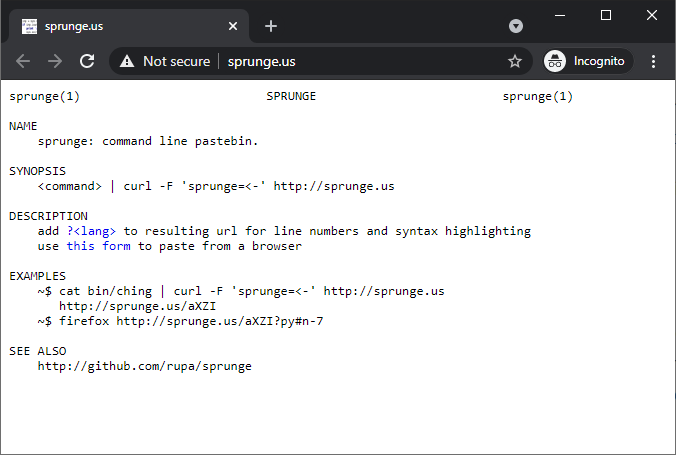



**Note**: This is a pre-release blog post draft. Please do not share this URL.



I recently needed a frictionless way for my users to share their debug logs with me. I would have happily paid for such a service, but nothing matched my needs. Instead, I built my own and released the code under the open-source MIT license.

The tool is called [LogPaste](https://logpaste.com). My favorite feature is that you can kill a LogPaste server and launch it somewhere else with no data backup. You can re-launch the service somewhere else, and it will still have all of its data. It achieves this this without any external database service or proprietary data store.


Here are some other features of LogPaste:

* You can run your own LogPaste server for pennies per month and no maintenance overhead
* The code is open-source and vendor-agnostic, so you can run it anywhere
* Users can share text logs with zero signup
* Users can generate shareable URLs from a single shell command or a few lines of JavaScript
* LogPaste background-syncs its datastore to any S3-compatible interface, so you can tear down and rebuild your server without losing any data

## sprunge is about to die

I initially collected log files from users with a service called [sprunge](http://sprunge.us/). It was a nearly perfect match for my needs &mdash; it's a free service that accepts uploads of plaintext files and hosts them forever.

{{}}

Unfortunately, "free" is a double edged sword. If nobody's paying for the service, it could disappear at any moment. Additionally, as a non-paying user, I have no control over the service. If one of my customers accidentally uploads their social security number and bank logins to sprunge, I have no way to purge the data.

sprunge is [open-source](https://github.com/rupa/sprunge), so I thought I could simply self-host it. But when I inspected the source, I realized sprunge was not long for this world. Nobody has touched the code in six years. Further, it depended on the Python 2.7 version of AppEngine and Google Cloud Datastore, two services that Google is [actively](https://cloud.google.com/appengine/docs/standard/python/migrate-to-python3) [killing off](https://cloud.google.com/datastore/docs/upgrade-to-firestore).

## Storing data without a database server

There are at least [a dozen open-source text sharing services](https://github.com/awesome-selfhosted/awesome-selfhosted#pastebins), but none of them were a match for what I wanted. Most of them included complex features I didn't need like encryption or a slick editing interface. I just wanted the simple ability to upload from the command line or JavaScript.

Worse, almost all the solutions required a separate database server to manage the uploads. And my shameful programmer secret is that I can't maintain a database server.

I've been building my own software products and services for the last eight years, and I've never used a database server in production. I don't want to be responsible for database backups or software upgrades, so anything that requires a database is a dealbreaker for me.

Instead, I've always used Google-managed datastores like Cloud Datastore, Firebase, and Firestore. But every few years, Google builds a totally new datastore solution, deprecates its old solution, and [dumps all the migration work onto its customers](https://medium.com/@steve.yegge/dear-google-cloud-your-deprecation-policy-is-killing-you-ee7525dc05dc). I was tired of Google's [shiny object syndrome](https://en.wikipedia.org/wiki/Shiny_object_syndrome) and didn't want to build another service using technologies that Google would probably kill off soon.

{{}}

## Litestream: all the fun of a database server minus the hassle

A [post recently popped up on Hacker News](https://news.ycombinator.com/item?id=26103776) about Litestream. It's an open source tool that replicates a SQLite database to Amazon's S3 cloud storage.

{{}}

This was my ticket out of Google Cloud Platform! Litestream was the best of both worlds. SQLite [runs without a server process](https://www.sqlite.org/serverless.html), so I didn't need to maintain my own database. With Litestream replicating all the data to S3, I don't need to worry about backups.

Best of all, it gave me incredible vendor flexibility: I can run SQLite anywhere. And I have tons of options for data replication because there are many S3-compatible storage services, including [BackBlaze B2](https://www.backblaze.com/b2/cloud-storage.html), [Wasabi](https://wasabi.com/), and [Minio](https://min.io/).

TODO: Better transition

## Creating the basic functionality

I decided to use Go to implement the service. This app would be a simple web service, and that's where Go really shines. It allowed me to create a solution that's efficient, lightweight, and secure with minimal third-party dependencies.

LogPaste needed to accept HTTP PUT requests from the command-line, so I began by writing [this HTTP handler](https://github.com/mtlynch/logpaste/blob/add9e363bd0ea0116d60e759778114ddbc979024/handlers/paste.go#L45L78).

```go
func (s defaultServer) pastePut() http.HandlerFunc {
  return func(w http.ResponseWriter, r *http.Request) {
    // Read the full HTTP PUT request body as a string.
    bodyRaw, err := ioutil.ReadAll(r.Body)
    if err != nil {
      http.Error(w, "can't read request body", http.StatusBadRequest)
      return
    }
    body := string(bodyRaw)

    // Generate a random entry ID.
    id := generateEntryId()

    // Store the PUT body in the SQLite database.
    err = s.store.InsertEntry(id, body)
    if err != nil {
      http.Error(w, "can't save entry", http.StatusInternalServerError)
      return
    }

    // Send a JSON response with the ID we generated.
    w.Header().Set("Content-Type", "application/json")
    resp := PastePutResponse{
      Id: id,
    }
    if err := json.NewEncoder(w).Encode(resp); err != nil {
      panic(err)
    }
  }
}
```

This allows LogPaste to accept HTTP requests from command-line utilities like this:

```bash
$ curl -X PUT -d "Hello, world!" http://localhost:3001
{"id":"fFnL9cU6"}
$ curl http://localhost:3001/fFnL9cU6
Hello, world!
```

That works, but it's just writing the SQLite database to the local filesystem. To deploy this to a public, production server, I needed to make data replication easy and automatic.

## Layering in Docker and Litestream

TODO: Clean up the wording in this section

Docker is one of my favorite ways to deploy a web service. There are dozens of managed Docker hosting vendors, so I'm not bound to any particular platform. And Docker would provide a nice way for me to integrate LogPaste with Litestream without baking any Litestream-specific logic into my LogPaste's code.

Generally, Docker containers should hold Just One Service. But the jump from a service that can live entirely in one Docker container to one that depends on two increases the complexity significantly. It's a bit of a hack, but I just run Litestream as a background service within my LogPaste container.

The only thing I need before running Litestream is to create a [configuration file](https://litestream.io/reference/config/). I create this at runtime in my [Docker entrypoint script](https://github.com/mtlynch/logpaste/blob/add9e363bd0ea0116d60e759778114ddbc979024/docker_entrypoint#L60L71):

```bash
cat > /etc/litestream.yml <<EOF
access-key-id:     "${AWS_ACCESS_KEY_ID}"
secret-access-key: "${AWS_SECRET_ACCESS_KEY}"
dbs:
  - path: "${DB_PATH}"
    replicas:
      - url: "${DB_REPLICA_URL}"
EOF
```

I deliberately create this file at container runtime so that I can change S3 replica locations or credentials without rebuilding the Docker image.

With the configuration file in place, I can use Litestream to pull down the latest database:

```bash
# Restore database from S3.
if [[ "${CREATE_NEW_DB}" != 'true' ]]; then
  litestream restore -v "${DB_PATH}"
fi
```

Then, before I start my web service, I spawn a Litestream instance in the background that watches my SQLite database and continually replicates it to an S3 instance:

```bash
# Begin replication to S3 in the background.
litestream replicate "${DB_PATH}" "${DB_REPLICA_URL}" &
```

Finally, to run the Docker container with all the environment variables set properly, I use this command:

```bash
AWS_ACCESS_KEY_ID=YOUR-ACCESS-ID
AWS_SECRET_ACCESS_KEY=YOUR-SECRET-ACCESS-KEY
DB_REPLICA_URL=s3://your-bucket-name/db

docker run \
  -e "PORT=3001" \
  -e "AWS_ACCESS_KEY_ID=${AWS_ACCESS_KEY_ID}" \
  -e "AWS_SECRET_ACCESS_KEY=${AWS_SECRET_ACCESS_KEY}" \
  -e "DB_REPLICA_URL=${DB_REPLICA_URL}" \
  -e "CREATE_NEW_DB='true'" `# change to false after first run` \
  -p 3001:3001/tcp \
  --name logpaste \
  mtlynch/logpaste
```

Here's how it all fits together:

TODO: Add diagram

## Demo

Users can upload to LogPaste from the command line, but it's also easy to integrate with other web apps. Here's a demo of a custom HTML client for LogPaste that runs against my demo instance:

TODO: Make this prettier

<div class="upload-form">
  <textarea id="upload-textarea" placeholder="Enter some text"></textarea>
  <button class="button" id="upload">Upload</button>
</div>
<a id="result"></a>
<div id="error"></div>

<script src="https://logpaste.com/js/logpaste.js"></script>
<script>
const baseUrl = 'https://logpaste.com';
document.getElementById("upload").addEventListener("click", (evt) => {
  const resultElement = document.getElementById("result");
  const errorElement = document.getElementById("error");
  resultElement.innerText = "";
  errorElement.innerText = "";
  const textToUpload = document.getElementById("upload-textarea").value;
  logpaste
    .uploadText(textToUpload, baseUrl)
    .then((id) => {
      const url = `${baseUrl}/${id}`;
      resultElement.innerText = url;
      resultElement.href = url;
    })
    .catch((error) => {
      errorElement.innerText = error;
    });
});
</script>

The code is pretty simple:

```html
<div class="upload-form">
  <textarea id="upload-textarea" placeholder="Enter some text"></textarea>
  <button class="button" id="upload">Upload</button>
</div>
<a id="result"></a>
<div id="error"></div>

<script src="https://logpaste.com/js/logpaste.js"></script>
<script>
const baseUrl = 'https://logpaste.com';
document.getElementById("upload").addEventListener("click", (evt) => {
  const resultElement = document.getElementById("result");
  const errorElement = document.getElementById("error");
  resultElement.innerText = "";
  errorElement.innerText = "";
  const textToUpload = document.getElementById("upload-textarea").value;
  logpaste
    .uploadText(textToUpload, baseUrl)
    .then((id) => {
      const url = `${baseUrl}/${id}`;
      resultElement.innerText = url;
      resultElement.href = url;
    })
    .catch((error) => {
      errorElement.innerText = error;
    });
});
</script>
```

## Using LogPaste in production

I run a business called [TinyPilot](https://tinypilotkvm.com). I develop and sell open source KVM over IP devices that let users control their servers remotely. LogPaste has been handling all of TinyPilot's debug logs for the past few months, and it's worked well.



My use case is, admittedly, fairly gentle. Only a handful of users upload their logs each day, so there may be pain points with this setup under heavier workloads. Still, I've been incredibly impressed with Litestream, and I'm eager to use it in more scenarios.

## Self-hosting LogPaste

It's trivial to run your own instance of LogPaste. You can even customize the text on the homepage so that it says your product's name instead of "LogPaste."

For example, here's TinyPilot's version:

{{}}

I've written deployment instructions for a few different platforms:

* [Docker](https://github.com/mtlynch/logpaste#from-docker--cloud-data-replication)
* [Heroku](https://github.com/mtlynch/logpaste/blob/master/docs/deployment/heroku.md)
* [Amazon LightSail](https://github.com/mtlynch/logpaste/blob/master/docs/deployment/lightsail.md)

## Source

The source is available on Github under the MIT License:

* [mtlynch/logpaste](https://github.com/mtlynch/logpaste)
