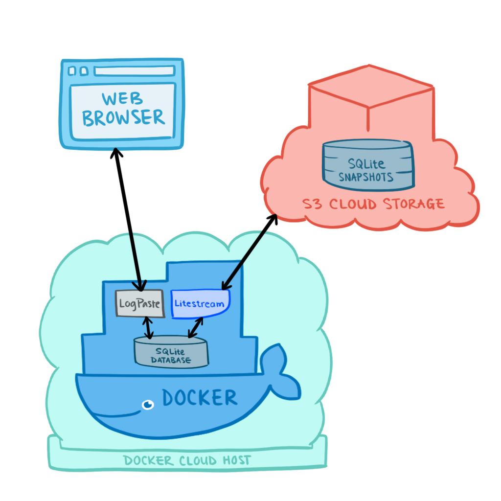

Here's a riddle. My web app keeps all of its data in a SQL database. I can spontaneously tear it down, deploy the code to a different hosting platform, and the app will still serve all the same data. Running my app in production costs $0.03 per month.

How is this possible?

>That's easy. You have a separate database server running somewhere that stores all of your app's state.

No, my app never talks to a remote database server.

>Oh, then you're using a proprietary, managed datastore like [Amazon DynamoDB](https://aws.amazon.com/dynamodb/) or [Google Cloud Firestore](https://cloud.google.com/firestore).

Nope, my entire stack is open-source and platform-agnostic.

>Then what?

I combined [SQLite](https://sqlite.org/index.html), [Litestream](https://litestream.io/), and [Docker](https://www.docker.com/).

My tool is called [LogPaste](https://logpaste.com). It allows users to generate shareable URLs for text files. I use it in my open-source [KVM over IP device](https://tinypilotkvm.com) so that users can easily share diagnostic logs with me.

Sharing text files isn't exactly revolutionary, but serverless data replication might be. Here's a demo of me migrating my LogPaste app server between two separate hosting platforms: [Heroku](https://www.heroku.com/) and [fly.io](https://fly.io). There's no database server or data migration step, but all of my data persists between platforms:

<script id="asciicast-I2HcYheYayeh7aHj23QSY9Vyf" data-speed="2.0" data-size="medium" data-cols="80" src="https://asciinema.org/a/I2HcYheYayeh7aHj23QSY9Vyf.js" async></script>

The best part is that I didn't need to modify my app's code at all. It just writes to a local SQLite database, and Litestream magically handles data replication in the background.

In this post, I'll explain how I integrated Litestream into my app and how you can do the same to replace your expensive, complicated database servers.

## Data persistence for people who hate database servers

My shameful programmer secret is that I can't maintain a database server.

I've been building my own software products and services for the past eight years, and I've never used a database server in production. I don't want to be responsible for backups or software upgrades, so anything that requires MySQL, Postgres, or Redis is a dealbreaker for me.

Instead, I've always used Google-managed datastores like Cloud Datastore, Firebase, and Firestore. But every few years, Google builds a totally new datastore solution, deprecates its old one, and [dumps all the migration work onto its customers](https://medium.com/@steve.yegge/dear-google-cloud-your-deprecation-policy-is-killing-you-ee7525dc05dc). I didn't want to create another service on top of a tech stack that Google would probably kill off soon.

{{}}

## Litestream: the serverless database server

A few months ago, I saw that [Ben Johnson](https://twitter.com/benbjohnson), author of the popular [Bolt database](https://github.com/boltdb/bolt), had taken on a new project: [Litestream](http://litestream.io). It's a simple, open-source tool that replicates a SQLite database to Amazon's S3 cloud storage.

{{}}

It seemed neat, but I wasn't particularly excited about it. I never use SQLite, so what did I care?

I didn't have anything against SQLite, but the design seemed impractical. Unlike other databases that send data to an external server over the network, SQLite writes everything to a local file. I always worried, "What happens if I lose that file?"

Thinking about it more, I realized I'd dismissed Litestream because I didn't use SQLite. But Litestream solved the very obstacle keeping me from adopting SQLite... Maybe this was worth a try.

Even better, Litestream could be my ticket out of Google Cloud Platform. SQLite runs anywhere, so I'd have freedom in choosing server hosting platforms. Litestream provides vendor flexibility on the storage side, as it supports any S3-compatible service, including [BackBlaze B2](https://www.backblaze.com/b2/cloud-storage.html), [Wasabi](https://wasabi.com/), and [Minio](https://min.io/).

Litestream sounded rosy in theory, but you can't judge a technology until you test it in production. I needed a log upload service, and it seemed like the perfect project to test Litestream.

## Creating the basic functionality

LogPaste needed to accept HTTP PUT requests from the command-line, so I wrote [this simple HTTP handler](https://github.com/mtlynch/logpaste/blob/add9e363bd0ea0116d60e759778114ddbc979024/handlers/paste.go#L45L78) in Go:

```go
func (s defaultServer) pastePut() http.HandlerFunc {
  return func(w http.ResponseWriter, r *http.Request) {
    // Read the full HTTP PUT request body as a string.
    bodyRaw, err := ioutil.ReadAll(r.Body)
    if err != nil {
      http.Error(w, "can't read request body", http.StatusBadRequest)
      return
    }
    body := string(bodyRaw)

    // Generate a random entry ID.
    id := generateEntryId()

    // Store the PUT body in the SQLite database.
    err = s.store.InsertEntry(id, body)
    if err != nil {
      http.Error(w, "can't save entry", http.StatusInternalServerError)
      return
    }

    // Send a JSON response with the ID we generated.
    w.Header().Set("Content-Type", "application/json")
    resp := PastePutResponse{
      Id: id,
    }
    if err := json.NewEncoder(w).Encode(resp); err != nil {
      panic(err)
    }
  }
}
```

The [`InsertEntry` implementation](https://github.com/mtlynch/logpaste/blob/master/store/sqlite/sqlite.go#L56L75) looks how you'd expect. It's a basic SQLite row insertion:

```go
func (d db) InsertEntry(id string, contents string) error {
	_, err := d.ctx.Exec(`
	INSERT INTO entries(
		id,
		creation_time,
		contents)
	values(?,?,?)`, id, time.Now().Format(time.RFC3339), contents)
	return err
}
```

This allows LogPaste to accept HTTP requests from the command line like this:

```bash
$ curl -X PUT -d "Hello, world!" http://localhost:3001
{"id":"fFnL9cU6"}
$ curl http://localhost:3001/fFnL9cU6
Hello, world!
```

That works, but it's writing the SQLite database to the local filesystem. I needed to integrate Litestream to enable cloud storage.

## Layering in Litestream for cloud data syncing

One of Litestream's biggest strengths is that it's completely independent of the application it serves. My LogPaste code never calls into a Litestream API, nor does it require any special configuration to allow syncing. Litestream quietly does its job in the background.

I created [a custom Docker image](https://hub.docker.com/r/mtlynch/logpaste/) to combine Litestream and LogPaste. Generally, Docker images should hold Just One Service, but I sometimes bend this rule to facilitate deployment. It's orders of magnitude easier to deploy a single, independent Docker container than two containers that need to coordinate with each other.

LogPaste's [Dockerfile](https://github.com/mtlynch/logpaste/blob/a9d9b39e4b78401c68cd54ed3d2fd40838dd7b8b/Dockerfile) starts by building the LogPaste binary from source, and then it pulls down the Linux executable for Litestream.

```Dockerfile
# Build LogPaste from source
RUN go build \
  -mod=readonly \
  -v \
  -o /app/server \
  ./main.go

# Download Litestream executable
RUN wget "https://github.com/benbjohnson/litestream/releases/download/v${litestream_version}/${litestream_deb_filename}"
```

Next, Docker copies a custom `litestream.yml` file into the image. This is Litestream's [configuration file](https://litestream.io/reference/config/).

```yaml
access-key-id: ${LITESTREAM_ACCESS_KEY_ID}
secret-access-key: ${LITESTREAM_SECRET_ACCESS_KEY}
dbs:
  - path: ${DB_PATH}
    replicas:
      - url: ${DB_REPLICA_URL}
```

The `replicas.url` field contains the cloud storage location for my database. `access-key-id` and `secret-access-key` are the IAM-style credentials Litestream needs to access the cloud storage bucket.

You can hardcode these values into the configuration file, but Litestream supports environment variables and interpolates them at runtime. That's a convenient feature, as it allows you to keep your `litestream.yml` file under source control without storing any sensitive credentials. It also makes the Docker image portable &mdash; anyone can create their own LogPaste server by reusing [my image](https://hub.docker.com/r/mtlynch/logpaste/) and setting environment variables for their cloud storage bucket.

The next bit of Litestream logic is in LogPaste's [`docker_entrypoint` script](https://github.com/mtlynch/logpaste/blob/a9d9b39e4b78401c68cd54ed3d2fd40838dd7b8b/docker_entrypoint), which runs when the Docker container launches. It starts by pulling down the app's latest database snapshot from cloud storage:

```bash
# Restore database from S3.
litestream restore -if-replica-exists -v "${DB_PATH}"
```

The `-if-replica-exists` flag tells Litestream that it's okay if no snapshots exist on cloud storage yet. Otherwise, you'd have a chicken-and-egg problem. Your app could never launch because there's no cloud database to restore, but Litestream can't replicate the database to cloud storage because the app has never run.

Next, the entrypoint script spawns a Litestream process, which watches LogPaste's SQLite database and continuously streams any changes to cloud storage:

```bash
# Begin replication to S3 in the background.
litestream replicate "${DB_PATH}" "${DB_REPLICA_URL}" &
```

The minor hack is in that trailing `&`. It tells the script to run the Litestream process in the background, which is how I can execute two long-running processes in the same Docker container. Ben Johnson has published [a cleaner solution](https://github.com/benbjohnson/litestream-s6-example), but I'm using the hacky version for ease of demonstration.

The entrypoint script ends by launching the Logpaste app, which is a simple HTTP server:

```bash
# Start LogPaste server.
/app/server
```

To run the Docker container with all the environment variables populated, I use [this command](https://github.com/mtlynch/logpaste#from-docker--cloud-data-replication):

```bash
LITESTREAM_ACCESS_KEY_ID=MY-ACCESS-ID
LITESTREAM_SECRET_ACCESS_KEY=MY-SECRET-ACCESS-KEY
DB_REPLICA_URL=s3://my-bucket-name/db

docker run \
  -e "PORT=3001" \
  -e "LITESTREAM_ACCESS_KEY_ID=${LITESTREAM_ACCESS_KEY_ID}" \
  -e "LITESTREAM_SECRET_ACCESS_KEY=${LITESTREAM_SECRET_ACCESS_KEY}" \
  -e "DB_REPLICA_URL=${DB_REPLICA_URL}" \
  -p 3001:3001/tcp \
  --name logpaste \
  mtlynch/logpaste
```

Here's how it all fits together in production:

{{}}

## LogPaste demo

Users can upload to LogPaste from the command line, but it's also easy to integrate with other web apps. Here's a simple HTML client for LogPaste that runs against [my demo instance](https://logpaste.com/):

<div class="demo">
<div class="upload-form">
  <textarea id="upload-textarea" placeholder="Enter some text"></textarea>
  <button class="button" id="upload">Upload</button>
</div>
<a id="result"></a>
<div id="error"></div>
</div>

<script src="https://logpaste.com/js/logpaste.js"></script>
<script>
const baseUrl = 'https://logpaste.com';
document.getElementById("upload").addEventListener("click", (evt) => {
  const resultElement = document.getElementById("result");
  const errorElement = document.getElementById("error");
  resultElement.innerText = "";
  errorElement.innerText = "";
  const textToUpload = document.getElementById("upload-textarea").value;
  logpaste
    .uploadText(textToUpload, baseUrl)
    .then((id) => {
      const url = `${baseUrl}/${id}`;
      resultElement.innerText = url;
      resultElement.href = url;
    })
    .catch((error) => {
      errorElement.innerText = error;
    });
});
</script>

The client-side code is less than 30 lines of HTML and JavaScript:

```html
<div class="upload-form">
  <textarea id="upload-textarea" placeholder="Enter some text"></textarea>
  <button class="button" id="upload">Upload</button>
</div>
<a id="result"></a>
<div id="error"></div>

<script src="https://logpaste.com/js/logpaste.js"></script>
<script>
const baseUrl = 'https://logpaste.com';
document.getElementById("upload").addEventListener("click", (evt) => {
  const resultElement = document.getElementById("result");
  const errorElement = document.getElementById("error");
  resultElement.innerText = "";
  errorElement.innerText = "";
  const textToUpload = document.getElementById("upload-textarea").value;
  logpaste
    .uploadText(textToUpload, baseUrl)
    .then((id) => {
      const url = `${baseUrl}/${id}`;
      resultElement.innerText = url;
      resultElement.href = url;
    })
    .catch((error) => {
      errorElement.innerText = error;
    });
});
</script>
```

## Using LogPaste in production

I'm using LogPaste in production for [TinyPilot](https://tinypilotkvm.com), my open-source KVM over IP device. Because users run my software on devices they own, I can't see any diagnostic information when they report issues. LogPaste provides a convenient way for users to share their logs with me.



LogPaste has handled all of TinyPilot's debug logs for the past few months, and it's worked well. The cost for data replication truly is just $0.03 per month:

{{}}

My use case is, admittedly, fairly gentle. Only a handful of users upload their logs each day, so there may be pain points with this setup under heavier workloads.

It's also important to note that Litestream can't resolve conflicts between multiple database writes, so each database can have only one application server with write access.

Still, I've been incredibly impressed with Litestream, and I'm eager to use it in more scenarios.

## Self-hosting LogPaste

If you want to host your own instance of my LogPaste app, it's easy to deploy. You can even customize the text on the homepage so that it says your product's name instead of "LogPaste."

For example, here's TinyPilot's version:

{{}}

I've written deployment instructions for a few different platforms:

| Platform | Notes |
|----------|-------|
| [fly.io](https://github.com/mtlynch/logpaste/blob/master/docs/deployment/fly.io.md) | Free tier allows up to three always-on instances and includes SSL certificates |
| [Amazon LightSail](https://github.com/mtlynch/logpaste/blob/master/docs/deployment/lightsail.md) | $7/month per instance, includes SSL certificates |
| [Heroku](https://github.com/mtlynch/logpaste/blob/master/docs/deployment/heroku.md) | Free tier allows unlimited on-demand instances, $7/month for SSL certificates on custom domains |

## Further reading

* [Litestream](https://litestream.io/): Litestream's official documentation.
* [mtlynch/logpaste](https://github.com/mtlynch/logpaste): MIT-licensed source code and documentation for LogPaste.
* [litestream-s6-example](https://github.com/benbjohnson/litestream-s6-example): A more advanced and robust method for running Litestream alongside your app in a Docker container. It uses [s6-overlay](https://github.com/just-containers/s6-overlay) to restart the Litestream instance on failure.

---

*Architecture diagram by [Loraine Yow](https://www.linkedin.com/in/lolo-ology/).*

*Thanks to [Ben Johnson](https://twitter.com/benbjohnson) for his work on Litestream and his early review of this article. Thanks to the members of the [Blogging for Devs Community](https://bloggingfordevs.com) for providing feedback on this post.*
