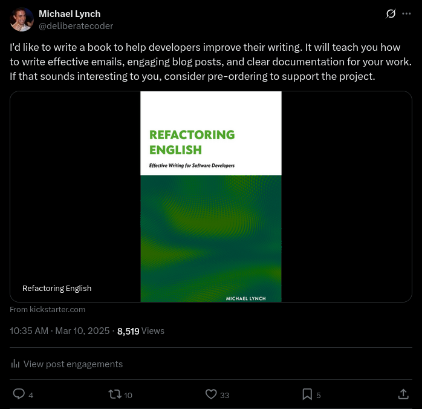

I just received $5,947 in advance sales for my first technical book, even though it's only 25% complete, and I'm self-publishing it. The book is called [_Refactoring English_](https://refactoringenglish.com), and it's a guide for software developers to improve their writing.

In March, I ran a three-week pre-sale for the book [on Kickstarter](https://www.kickstarter.com/projects/mtlynch/refactoring-english). The pre-sale raised $6,551 from 191 customers. After Kickstarter's fees, I get $5,946.92, or 91% of the total.

{{}}

I haven’t seen many authors crowdfund their books ahead of time, so I thought I'd write about why I did this, which parts of the process worked well, and which parts turned out to be a waste of time:

## Benefits of crowdfunding a self-published book

- $6k is a higher advance than most traditional publishers offer to first-time authors.
- The money has looser obligations than a traditional publisher.
  - I have to make a good-faith effort to complete the book, but I don't owe the money back if the book runs late or if I fail to complete it.
- The pre-sale gives me confidence that when I complete the book, I can find readers willing to purchase it.
- I didn't have to beg a publisher for permission to write my book.
- I don't have to split sales with a publisher when I complete the book.
  - My only cost will be payment processor fees, so I'll receive 97% of the sale price.
- I still have the option to publish the same book with a traditional publisher in the future.

## My unfair advantages

One of my pet peeves is seeing social media posts like this:

> Wow, I just put up a pre-order form for my USB-powered toilet paper. Within two hours, I'd made $100k! Business is so easy!

And then I check their profile and see that they have 40 million followers and a long track record of successful products.

So, I want to be upfront that I had advantages in my pre-sale:

- My personal blog receives 300-500k unique readers per year.
- I'm atypically successful at writing articles that reach the front page [of Hacker News](https://refactoringenglish.com/tools/hn-popularity/domain/?d=mtlynch.io) and [reddit](https://www.reddit.com/search?q=url%3Amtlynch.io&sort=relevance&t=all).
  - During my pre-sale, an excerpt from my book reached [the #10 spot for the day on Hacker News](https://news.ycombinator.com/item?id=43503872).
- I have 2.1k subscribers on my blog's mailing list and 1.5k subscribers on the book's mailing list.
  - There's surprisingly little overlap between the two, so it's about 3.5k unique subscribers.
- I have 9.2k followers on [Twitter](https://x.com/deliberatecoder) and 600 followers on [Bluesky](https://bsky.app/profile/mtlynch.io).

## How does crowdfunding compare to an advance from a traditional publisher?

Most publishers don't disclose the deals they offer to first-time authors, so it's difficult to compare my results directly with most publishers.

[No Starch Press](https://nostarch.com/) is the most transparent publisher in terms of [author pay](https://nostarch.com/writeforus). They offer first-time authors three possible payment structures:

- no advance, 15% royalties on print sales, 25% royalties on ebook sales
- $5k advance, 12% royalties on print sales, 25% royalties on ebook sales
- $8k advance, 10% royalties on print sales, 25% royalties on ebook sales

Manning doesn't publish their rates, but Teiva Harsanyi [recently shared](https://www.thecoder.cafe/p/100-go-mistakes) his experience publishing with Manning as a first-time author. They paid him $2k upfront, $2k after delivering the first 1/3rd, and then 10% of sales. This earned him $47k over four years (11,452 copies sold).

By self-publishing, I get a better deal on my advance, I can continue selling pre-orders as I write the book, and I still have the option to publish a future edition with a traditional publisher.

## Worst case: 200 people want to read my book

Writing a book is a risky venture — I expect it to take me 6-12 months. I'd be devastated to spend all that time writing only to discover that nobody wanted to read my book in the first place.

A pre-sale guarantees that some people are interested enough in my book to pay for it.

With Kickstarter, you set a goal amount for the pre-sale. If you don't hit the goal, none of your customers pay, and you walk away with nothing.

Kickstarter's all-or-nothing structure sounds brutal, but it was ideal for me. It protects me from an awkward "half-success" where pre-orders fall short of my expectations, and then I'm stuck either writing a book for a tiny readership or awkwardly refunding a bunch of pre-orders and ending up in the negative after payment processing fees.

I chose $5k as my pre-sale goal because it's the lowest figure that would feel okay as my total earnings for the book. I'd, of course, enjoy selling more copies of my book later, but I'd still feel good about making $5k from a self-published book. My more realistic expectation was that if I could sell $5k in pre-orders when the book was only 25% complete, I could likely sell another $10-15k worth of copies when I finish the book.

I priced the pre-orders at $25 per copy, so I figured that if 150 people bought, it would get me to $3,750, and then I'd make up the rest in the premium Kickstarter rewards like a public thank you or personalized writing feedback. The "worst case" would be if I reached my goal with everyone paying $25, but that still means 200 people want to read my book, which is pretty good.

## A pre-sale connects me with my most enthusiastic readers

One unexpected benefit of the pre-sale was that it connected me with the readers who are most excited about my book. These are exactly the readers I want to hear early feedback from.

Before the pre-sale, I published sample chapters, and people signed up for my mailing list, but I didn't know how to initiate useful conversations with them. When I'd email subscribers new chapters, I'd invite them to give me feedback on the material, but barely anyone did.

Once the pre-sale ended, I realized that I suddenly knew 200 people who felt engaged and invested in the book's future.

Last week, I invited everyone who pre-ordered to attend a live video class where I taught the material from the book's next chapter. Six people attended the class, and their feedback was incredibly helpful. The attendees seemed excited to ask questions and help shape the book, so it felt like a win-win for everyone.

## How did I find customers?

According to Kickstarter, here's how pre-sales for my book broke down:

| Source                                         | % of sales |
| ---------------------------------------------- | ---------- |
| [Book website](https://refactoringenglish.com) | 42%        |
| Kickstarter                                    | 12%        |
| [Personal blog](https://mtlynch.io)            | 11%        |
| Twitter                                        | 4%         |
| Other / Unknown                                | 31%\*      |

\* I suspect that my mailing lists made up a large chunk of that "Unknown" category, but I forgot to use links in my newsletter that [would have recorded the source of those purchases](#kept-better-track-of-how-customers-found-me).

### Publishing book excerpts

Sharing book excerpts on my mailing lists and social media turned out to be the most effective strategy for selling pre-orders.

I published the [excerpts](https://refactoringenglish.com/chapters/) on the book's website for free, and I included a self-ad at the end of each post to lead readers to the full book:

{{}}

During the pre-sale, I published two new excerpts from the book. I published [the first](https://refactoringenglish.com/chapters/commit-messages/) at the start of the pre-sale to kick things off and [the second](https://refactoringenglish.com/chapters/write-blog-posts-developers-read/) five days before the pre-sale ended.

It's tough to say how much the first excerpt impacted sales, as I released it at the same time I announced the pre-sale to my mailing list.

The second excerpt definitely made a difference. It gained traction [on Hacker News](https://news.ycombinator.com/item?id=43503872) and [Lobsters](https://lobste.rs/s/youq7y/how_write_blog_posts_developers_read), and readers from those sites doubled pre-orders for my book in a matter of days. Without that second excerpt, the pre-sale would have failed, and I'd have walked away with nothing.

{{}}

### Advertising the book on my personal blog

Similar to the self-ad on my book's website, I added a little box at the bottom of all my blog posts to say that I want to write a book and that readers can support it with a pre-order.

{{}}

I wrote [one new blog post](/no-longer-my-favorite-git-commit/) during the pre-sale, which seemed to bring a small bump in sales. I also have a deep archive of posts that attract 6-7k readers per week even when I'm not publishing anything new. I suspect some readers purchased based on stumbling across my old posts.

### Sharing progress updates on Twitter

According to Kickstarter's metrics, 4% of orders came from Twitter. I didn't invest a ton there — I just [created a thread announcing the pre-sale](https://x.com/deliberatecoder/status/1899106915126239720) and posted occasional updates on progress toward my goal amount.

{{}}

I tried the same thing on [Bluesky](https://bsky.app/profile/mtlynch.io/post/3ljzrjoqg3k2b) and [Mastodon](https://m.mtlynch.io/@michael/114138636617854162), as I prefer those platforms, but my posts there got almost zero response.

## Which attempts at finding customers failed?

### Soliciting sponsorships from companies

Increasingly, open-source projects are raising money by displaying company logos on their website in exchange for a monthly donation. I thought, "Why not do the same thing with an ebook?"

But company sponsorships didn't work for me. I reached out to ten companies, and none of the discussions went anywhere:

- One company offered $1k to buy a page in the book's acknowledgments section and a banner ad on the website.
  - I asked whether they'd be open to something time-limited, as I didn't want a "forever" obligation, and they stopped responding.
- One company was interested but then stopped responding when they realized I wanted them to purchase the sponsorship through Kickstarter.
- One company gave a quick, polite no.
- One company responded several weeks after the pre-sale to say no.
- Six companies (the rest) never responded.

Part of the problem was that I waited until the last ten days of the pre-sale to reach out. At that point, it looked like my project was a flop.

I kept thinking I'd have a hit post during the pre-sale so that I could wow potential sponsors with flashy metrics about how many of my readers would see their logo, but I didn't have that until the end.

{{}}

Even when the one company offered to sponsor for $1k, I was hesitant to let a single company carry so much of the pre-sale. I expect the number of pre-orders to correlate with how many customers purchase the completed book. If I can't reach my pre-sale goal without one whale of a sponsor, that would have been a bad sign for long-term sales.

I had better luck just announcing that I was open to sponsorships and letting companies reach out to me. Scott, the owner [who acquired my last company](/i-sold-tinypilot/) reached out and purchased [a sponsorship](https://refactoringenglish.com/#professional-sponsors) when he heard about the book, and I'm in discussions with another reader who participated in the pre-sale.

### Creating a web app to pander to Hacker News

I've often wondered who the most popular bloggers are on Hacker News, so, last summer, I wrote a quick and dirty tool to figure out the answer.

During the pre-sale, I realized my blog popularity tool would be a good way to attract attention from Hacker News. People who care about the top Hacker News bloggers might also be interested in my book, so I [published the tool](https://refactoringenglish.com/tools/hn-popularity/) on the book's website. To lead visitors to the book, I put a prominent pre-order link in the navigation menu:

{{}}

My personal blog is one of the top 50 on the list, so I gave myself unique flair to lead readers to my book:

{{}}

Hacker News did [get excited about the tool](https://news.ycombinator.com/item?id=43474505), and it reached [the top 10 of the front page for the day](https://news.ycombinator.com/front?day=2025-03-25). [John Gruber](https://en.wikipedia.org/wiki/John_Gruber), the 5th most popular blogger on Hacker News, [wrote an article about my tool](https://daringfireball.net/2025/03/the_website_hacker_news_is_afraid_to_discuss).

Unfortunately, none of that attention translated to pre-orders. Sales were nearly zero over the two days that the blog ranking tool was most popular.

{{}}

## What I'm glad I did

### Ran the pre-sale on Kickstarter

I'd never used Kickstarter before, and I was pleasantly surprised by how smooth and easy the process was.

I'm so jaded by "indie creator" platforms that hammer me with upsells and use deceptive techniques to squeeze me for money. I kept waiting for Kickstarter to tell me that I had to pay $500 to be "featured" or some other gotcha at the last minute, but it never happened.

Kickstarter did what it said it would do. They facilitated the pre-sale and never tried to milk me for money. Throughout the process, I felt like Kickstarter aligned incentives so that they only make money if my project succeeded.

I was surprised at how many customers discovered my book through Kickstarter itself. Part of Kickstarter's pitch is that they have a community of members interested in funding indie projects, but I didn't expect to find customers that way. According to Kickstarter's metrics, 12% of sales were from people who discovered my book on Kickstarter.

I have a few quibbles with Kickstarter, but I'd still recommend them to anyone interested in a similar project.

### Edited my sample chapters to work as blog posts

As I started working on my book, I struggled to choose which chapters to release as free samples. I wanted the samples to read like standalone blog posts rather than out-of-context book chapters. But which of my chapters would work both as book chapters and self-contained blog posts?

Finally, I realized that there's no rule saying that what I call an "excerpt" has to 100% match what appears in the book. I could adapt the material however I wanted to fit the medium of a blog post.

For example, I published ["How to Write Blog Posts that Developers Read"](https://refactoringenglish.com/chapters/write-blog-posts-developers-read/) as a single article on the book's website, but in the full book, I plan to split that material across several chapters and expand on the ideas.

I think adapting the material for a blog post worked well. I doubt that my blogging excerpt would have reached as many readers had I presented it exactly as it will appear in the book.

### Underpromised on rewards

When Tracy Osborn [ran a pre-sale for her first book](https://www.kickstarter.com/projects/tracyosborn/hello-web-app-intro-to-building-web-apps-with-djan), one of the rewards she offered was home-baked cookies. The fun, personal reward helped her project succeed, but then she [felt stressed having to bake and ship hundreds of cookies](https://hellowebbooks.com/news/reviewing-hello-web-apps-kickstarter-campaign/).

I definitely felt the temptation to offer better, more eye-catching rewards during my pre-sale. Especially as sales slowed down, desperation set in, and I wondered [what I could offer](my-secret-weapon.mp4) to reach my $5k goal.

I considered offering signed prints of the book, but that meant committing to a print run and shipping physical products, which is months of work in itself.

Looking back, I'm relieved that I didn't succumb to desperation. I still feel good about everything I offered and the prices I set.

### Didn't go overboard on a fancy Kickstarter promotion

You can spend infinite time polishing your Kickstarter page. Some projects have slick promotional videos, professional designs, and big-name testimonials that look like they took months to put together.

I didn't want to do that.

Honestly, the main reason was that I hate working on marketing stuff. But also, I felt like it was a rational choice because I didn't want to sink weeks of work into an elaborate Kickstarter page before I even knew if anyone wanted this book.

In total, I spent 5-10 hours creating my Kickstarter project. I had to write a pitch for my book, but I had already done most of that work when I created the book's website.

I recorded a short intro video because that's what other successful projects seemed to do. It felt like a good way to demonstrate that I'm a real person and not a money-stealing AI bot.



The video took me about 90 minutes to make. I wrote a short script, memorized it, and then recorded it about ten times until I captured a take I liked.

## What I wish I'd done differently

### Offered an "I just want to give you extra money" option

I recently attended a talk by [Aaron Francis](https://aaronfrancis.com/) about creating educational software videos. He [offers a course](https://screencasting.com) on this topic for $300, but he also sells a premium $1k package that includes a 40-minute 1:1 video call with him.

After the talk, I asked Aaron if those $1k customers ever pressured him to deliver something unreasonable on those calls or demanded more of his time afterward.

Surprisingly, Aaron said that he experienced the opposite.

When customers paid $1k for a private consultation with him, he found that they "somewhat want help, somewhat just want to hang out." He sensed that customers viewed the $1k package as a generous tip. "It's like I turned the iPad around, and they tipped a thousand dollars."

I thought about offering a 1:1 call as part of my pre-sale, but I figured that if someone wanted to pay me above my asking price for the book, Kickstarter already offers that option. Or they could buy one of the premium rewards like a personalized writing review.

In retrospect, I should have offered a 1:1 call for $300-500. A 1:1 call feels different than just paying above the asking price and getting nothing in return, so that might have appealed to some people. It would have been a nice hourly rate for me and would give me valuable feedback from readers.

### Started with my most excerpt-able material

By the end of the pre-sale, I'd published four excerpts from my book: two beforehand and two during.

Here are the metrics on how well those excerpts did at attracting readers, sorted from earliest to latest published:

| Excerpt                                                                                                                     | Unique Readers | Hacker News score                                    | Lobsters score                                                        | reddit score                                                                                             |
| --------------------------------------------------------------------------------------------------------------------------- | -------------- | ---------------------------------------------------- | --------------------------------------------------------------------- | -------------------------------------------------------------------------------------------------------- |
| ["Rules for Writing Software Tutorials"](https://refactoringenglish.com/chapters/rules-for-software-tutorials/)             | 24k            | [376](https://news.ycombinator.com/item?id=42574641) | [27](https://lobste.rs/s/7t86dw/rules_for_writing_software_tutorials) | [162](https://www.reddit.com/r/programming/comments/1hrux0b/rules_for_writing_software_tutorials/)       |
| ["Passive Voice Considered Harmful"](https://refactoringenglish.com/chapters/passive-voice-considered-harmful/)             | 2.4k           | -                                                    | [35](https://lobste.rs/s/xg2chc/passive_voice_considered_harmful)     | -                                                                                                        |
| ["How to Write Useful Commit Messages"](https://refactoringenglish.com/chapters/commit-messages/)                           | 7.3k           | -                                                    | [12](https://lobste.rs/s/usdefp/how_write_useful_commit_messages)     | [39](https://www.reddit.com/r/programming/comments/1j5nvm5/how_to_write_useful_commit_messages/)         |
| ["How to Write Blog Posts that Developers Read"](https://refactoringenglish.com/chapters/write-blog-posts-developers-read/) | 30.8k          | [603](https://news.ycombinator.com/item?id=43503872) | [49](https://lobste.rs/s/youq7y/how_write_blog_posts_developers_read) | [0](https://www.reddit.com/r/programming/comments/1jl3wgw/how_to_write_blog_posts_that_developers_read/) |

With the benefit of hindsight, the best strategy would have been to start with my two most popular excerpts and publish them during the pre-sale. The problem is that I couldn't predict for certain which articles would become my most popular. I actually thought that the two most popular excerpts would be "Rules for Writing Software Tutorials" and "How to Write Useful Commit Messages."

The thing I was confident about ahead of time was that "Passive Voice Considered Harmful" would never be a hit. I personally care a lot about it, but I know that an impassioned rant about passive voice will never set the Internet on fire.

If I had to do this over, I'd have queued up two excerpts that I thought would be most popular and released them both during the pre-sale while I worked on the third. I'd save less flashy topics like "Passive Voice Considered Harmful" for after the pre-sale.

### Kept better track of how customers found me

Kickstarter can generate custom links to identify how customers found your project, but I never used them.

{{}}

Looking back, the custom links would have provided helpful insight into how customers found me. Without the custom tags, Kickstarter goes by the HTTP referer header, which is not as reliable as custom links.
