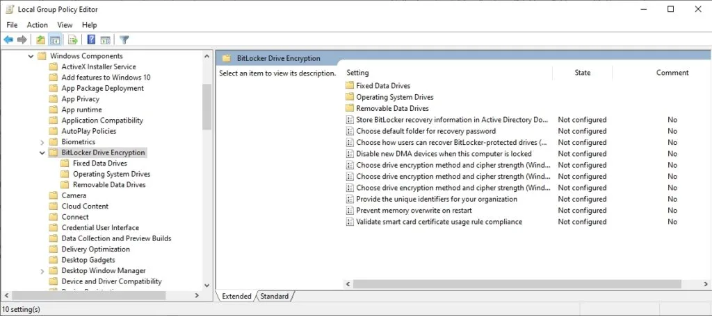

I'm a pretty humble guy, so most people don't know this extremely impressive fact about me: Raymond Chen once [mentioned me](https://devblogs.microsoft.com/oldnewthing/20090724-00/?p=17373) on _The Old New Thing_, the classic Windows development blog.

No, he didn't mention me by name nor did he provide any way to identify me, but I still deserve credit for how little I boast about this stunning achievement.

{{}}

## The problem I was trying to solve

Raymond described me in the post as "a customer," but I was actually his fellow Microsoft employee at the time. I was 23 and coming up on two years as a developer at Microsoft, my first job out of college.

I worked on [BitLocker](https://en.wikipedia.org/wiki/BitLocker), the feature of Windows that encrypts disk drives. We were starting development on Windows 8, and my project was to improve BitLocker's configuration experience.

BitLocker had many knobs and dials that admins could configure through organization-level settings ([Group Policy](https://en.wikipedia.org/wiki/Group_Policy), in Windows terms). An IT admin could enforce a rule across their organization like, "Everyone's BitLocker passphrase has to be at least 12 characters long," and then BitLocker would force users to create passphrases that were at least 12 characters.

{{}}

One of BitLocker's configuration headaches was that the error messages were vague. If you tried to configure a rule that said passphrases had to be at least 1000 characters, BitLocker would throw an error like, "No, that's too long," but it wouldn't tell you what the limit was.

At Microsoft, <span style="white-space: nowrap;">C++</span> code couldn't contain error messages because the localization team had to translate all user-facing text into other languages. So, all user-facing text lived in `.mc` files that looked like this:

```text
SymbolicName=ERROR_BITLOCKER_PASSPHRASE_MINIMUM_TOO_LONG
The BitLocker minimum passphrase length is too high.
.
SymbolicName=...
```

And then somewhere in the <span style="white-space: nowrap;">C++</span> code, we'd have a check that looked like this:

```c++
#define MAX_PASSPHRASE_MINIMUM 20

UINT32 minimumPassphraseLength = ReadGroupPolicy(GP_BITLOCKER_MINIMUM_PASSPHRASE_LENGTH);
if (minimumPassphraseLength > MAX_PASSPHRASE_MINIMUM) {
  ShowError(ERROR_BITLOCKER_PASSPHRASE_MINIMUM_TOO_LONG);
}
```

I wanted to change BitLocker's error messages so that they gave the user specific information about why the error occurred. So, instead of seeing this:

> The BitLocker minimum passphrase length **is too high**.

I wanted the user to see this:

> The BitLocker minimum passphrase length **cannot exceed 20**.

I didn't want to copy the value of `20` from the <span style="white-space: nowrap;">C++</span> code into the `.mc` file because if we later changed the value of `MAX_PASSPHRASE_MINIMUM`, it would go out of sync with the `.mc` file and make the error message incorrect.

## How Raymond Chen got involved

I didn't know a lot about the Message Compiler tool that consumed `.mc` files. I couldn't find any examples of anyone referencing <span style="white-space: nowrap;">C++</span> values in `.mc` files, but I felt like there had to be some way of doing it.

I asked on a company-internal mailing list if I could write the `.mc` file like this:

```text
SymbolicName=ERROR_BITLOCKER_PASSPHRASE_MINIMUM_TOO_LONG
The BitLocker minimum passphrase length cannot exceed ${MAX_PASSPHRASE_MINIMUM}.
```

Raymond Chen posted frequently on these mailing lists. Even in 2009, he had been at Microsoft forever and had an encyclopedic knowledge of everything related to Windows development. His replies were helpful and authoritative but snarky if he thought you didn't do enough research before asking the question.

If I recall correctly, Raymond sent a terse reply to my thread, saying, "There's no law saying you can't use the preprocessor," and an example of generating the `.mc` file with the preprocessor command.

It took me a while to even understand what he was trying to tell me. I didn't know you _could_ tell a <span style="white-space: nowrap;">C++</span> compiler to only run the preprocessing step.

## Wasting Raymond Chen's time

The shameful part of this story is that even though I got advice from the great Raymond Chen, I chickened out of using it.

In Raymond Chen's blog post, he showed how easy it is to change a few lines in your Makefile so that your source file is a `.mcp` file instead of a `.mc` file. Easy peasy!

The Windows build system was infinitely more complicated than a Makefile. I don't remember what it looked like except that I found it scary and confusing.

Worse, if you messed up the build, you might not find out until you received an email the next morning announcing that you broke the nightly build, and now dozens or hundreds of people don't have that day's Windows build because of you.

So, I had a choice. I could be the first person to try a new thing in the build system and risk burning a week or two on fixing unexpected issues. Or I could pretend I never had the idea to put specific numbers into BitLocker's error messages and focus on other ways to make the configuration easier.

I chose the latter.

## I still wouldn't know how to solve this today

At the time, I remember thinking, "Wow, I'm dumb for not knowing I could use the C preprocessor like this."

Most of the time, when I look back at a software problem I struggled with years ago, the solution is more obvious to me today. Usually, I can think of a better solution.

But 16 years later, Raymond's solution to run the C preprocessor on a non-C/<span style="white-space: nowrap;">C++</span> file still feels unexpected. If I had all of my professional experience except this one memory of Raymond Chen, and you told me to solve the problem again, I'd still struggle just as much as I did in 2009.

The difference today is that I don't feel dumb for not knowing how to solve this problem. I now see it as a weakness in Microsoft's internal tooling. At Microsoft, on their flagship product, how was there no standard way for developers to reference constant values in both error messages and <span style="white-space: nowrap;">C++</span> code?

As a software engineer, there are some problems that you find unpleasant, but you grit your teeth and practice until you get better. Other problems, you just avoid by carefully picking what jobs and projects you take on.

Understanding arcane build systems is one of the problems I've avoided, and I'm fine with that. [Except when I use Nix](/bootstrapped-founder-year-7/#nix).
