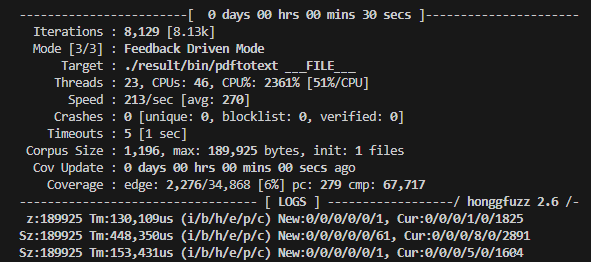

Fuzz testing is a technique for automatically uncovering bugs in software. The problem is that it's a pain to set up. Read any fuzz testing tutorial, and the first task is an hour of building tools from source and chasing down dependencies upon dependencies.

I recently found that [Nix](https://nixos.org) eliminates a lot of the gruntwork from fuzz testing. I created a Nix configuration that kicks off a fuzz testing workflow with a single command. The only dependencies are Nix and git.

I used my Nix workflow to find an unpatched bug in a PDF renderer, even though I'm a beginnner to both Nix and fuzz testing.

## A preview of the solution

Here's a preview of my final result: you can start fuzz testing [an open-source PDF reader](https://www.xpdfreader.com/) with a single command:

```bash
nix run gitlab:mtlynch/fuzz-xpdf
```

The command should work on any Linux system with Nix installed, and maybe MacOS, too. After a few minutes of building, you should see a terminal UI that looks like this:

{{}}

Here's everything that happens when you run the command above:

1. Nix downloads all tools and dependencies for the PDF reader and the testing toolchain.
1. Nix compiles the PDF reader from source with proper instrumentation for fuzz testing.
1. Nix downloads a set of edge-case PDFs for generating test inputs.
1. Nix automatically generates new PDFs, feeds them to the PDF reader, and reports which inputs caused the PDF reader to crash.

If you want to change the fuzzing options or test a different version of the PDF reader, it's as simple as editing a single file.

I'm going to share how I created the fuzz testing workflow step by step. I'm using a particular PDF rader in my example, but you can use the same methodology to find bugs in other projects.

If you're impatient, you can skip to the end to see my [final result](https://gitlab.com/mtlynch/fuzz-xpdf).

## What's fuzz testing?

Fuzz testing or "fuzzing" is a way of finding bugs in software by randomly generating input data and checking to see if the input causes the target application to crash.

For example, if you wanted to test a program that resized JPEG images, the workflow would look like this:

1. Take a set of valid and/or malformed JPEG image files.
1. Randomly select one of the input files and randomly mutate it (flip some bits, add some data, delete some data).
1. Feed the mutated input file to the image resizing program.
1. If the mutated input caused the program to crash or hang, save the input for later analysis.
1. Go back to step (2)

## What's Nix?

[Nix](https://nixos.org) is a complex tool that does a lot of different things, many of which I don't even understand.

For the purposes of this article, it's sufficient to understand two things about Nix:

- **Nix is a package manager**, similar to `apt` or `yum`. Nix has 100k+ packages available to run within the Nix environment.
- **Nix is a build tool**, similar to `make` or `Docker`. Nix allows you to define a set of build steps and the dependencies between them. When you request a build from Nix, it performs all the required steps to create the result you requested.

## Requirements

To follow along, you'll only need two things:

- Nix (with the flakes feature enabled)
  - I recommend the [Determinate Systems installer](https://zero-to-nix.com/start/install), which enables flakes by default.
- git

## Selecting a fuzzing target

The PDF reader I'm fuzz testing is called [xpdf](https://xpdfreader.com). I'd never seen it before, but it was an example in [a good fuzzing tutorial](https://github.com/antonio-morales/Fuzzing101) I found, so I'm sticking with it.

xpdf is a PDF viewer, but it ships with a suite of PDF utilities. One of the utilities, `pdftotext` is an attractive fuzzing target because it's so simple. It has no GUI; it just accepts a PDF as input and produces plaintext as output. It still exercises xpdf's complex PDF parsing code, so if I find a bug in `pdftotext`, it means I've probably found a bug in the whole xpdf suite.

## Putting the Nix boilerplate in place

To start the project, I create a new folder and git repository.

```bash
mkdir fuzz-xpdf \
  && cd fuzz-xpdf \
  && git init
```

Next, I create a file called `flake.nix`:

```nix
{
  description = "compile xpdf from source for fuzzing";

  inputs = {
    nixpkgs.url = "github:NixOS/nixpkgs/nixos-24.05";
    flake-utils.url = "github:numtide/flake-utils";
  };

  outputs = { self, nixpkgs, flake-utils }:
    flake-utils.lib.eachDefaultSystem (system:
      let
        pkgs = nixpkgs.legacyPackages.${system};
      in
      {
        packages = rec {
          default = xpdf;

          xpdf = pkgs.stdenv.mkDerivation rec {
            # TODO: I'll populate this next.
          };
        };
      }
    );
}
```

This is a Nix "flake," which defines a set of Nix packages and applications.

So far, this is just a boilerplate skeleton of a Nix flake. Most of it is not worth discussing except this line:

```
nixpkgs.url = "github:NixOS/nixpkgs/nixos-24.05";
```

This tells Nix that when I want to pull in packages, I'm pulling them from the [May 2024 branch](https://github.com/NixOS/nixpkgs/tree/24.05) of the package repository, the latest stable branch at the time of this writing.

This file is just a skeleton and won't successfully build yet. To compile xpdf using Nix, I need to add a few bits.

## Specifying a source tarball

To compile xpdf, I need a copy of its source code.

First, I call [`mkDerivation`](https://nixos.org/manual/nixpkgs/stable/#sec-using-stdenv), which is how Nix defines build components. It requires a package name (`pname`) and version, so I specify `xpdf`, the package I want to fuzz and `4.05`, the latest published version of xpdf, as of this writing.

```nix
{
  xpdf = pkgs.stdenv.mkDerivation rec {
    pname = "xpdf";
    version = "4.05";
    ...
```

The other required field in `mkDerivation` is a `src` property, which specifies how Nix should retrieve the inputs for the build. In the case of xpdf, the source tarball is located at this URL:

- https://dl.xpdfreader.com/xpdf-4.05.tar.gz

I specify xpdf's tarball URL using the `pname` and `version` variables so that when the version number changes in the future, the URL still works:

```nix
{
  xpdf = pkgs.stdenv.mkDerivation rec {
    ...
    src = pkgs.fetchzip {
      url = "https://dl.xpdfreader.com/${pname}-${version}.tar.gz";
      extension = "tar.gz";
    };
```

The problem is that Nix needs a hash of the tarball to determine whether the local version matches what's on the server. If I run `nix build` at this point, Nix complains that the hash is wrong:

```text
warning: found empty hash, assuming 'sha256-AAAAAAAAAAAAAAAAAAAAAAAAAAAAAAAAAAAAAAAAAAA='
error: hash mismatch in fixed-output derivation '/nix/store/z3ckfdjqpfd73xkkwsnpg4ijwj60vyz8-source.drv':
         specified: sha256-AAAAAAAAAAAAAAAAAAAAAAAAAAAAAAAAAAAAAAAAAAA=
            got:    sha256-LBxKSrXTdoulZDjPiyYMaJr63jFHHI+VCgVJx310i/w=
```

To fix the hash mismatch, I paste the value from the error message into my `flake.nix`:

```nix
{
  xpdf = pkgs.stdenv.mkDerivation rec {
    ...
    src = pkgs.fetchzip {
      url = "https://dl.xpdfreader.com/${pname}-${version}.tar.gz";
      # Paste the hash that appeared next to "got" in the error message.
      hash = "sha256-LBxKSrXTdoulZDjPiyYMaJr63jFHHI+VCgVJx310i/w=";
      extension = "tar.gz";
    };
```

## Compiling xpdf from source

Now that I've shown Nix how to retrieve xpdf's source code, I have to figure out how to build that code.

The xpdf [compile instructions](https://gitlab.com/mtlynch/xpdf/-/blob/4.05/INSTALL#L32-39) list the following dependencies:

> Make sure you have the following installed:
>
> - CMake 2.8.8 or newer
> - FreeType 2.0.5 or newer
> - Qt 5.x or 6.x (for xpdf only)
> - libpng (for pdftopng and pdftohtml)
> - zlib (for pdftopng and pdftohtml)

I only want to run `pdftotext`, so I only need CMake and FreeType.

Building a complex tool from source is usually a painful process. I want to build tool A, but it depends on library X, so I have to figure out how to install library X. It turns out library X depends on libraries Y and Z, so I have to figure out how to install those, and so on.

Nix radically simplifies the process of building from source in two ways:

- Nix has one of the largest repositories of any package manager, so most packages I need are already available.
- Nix packages are not tied to any OS version, so as long as there's a Nix package for my architecture, I can use it.

Looking at the [Nix package repository](https://search.nixos.org), I see that packages for CMake and FreeType are indeed already available:

- [CMake](https://search.nixos.org/packages?channel=24.05&show=cmake&from=0&size=50&sort=relevance&type=packages&query=cmake)
- [FreeType](https://search.nixos.org/packages?channel=24.05&show=freetype&from=0&size=50&sort=relevance&type=packages&query=freetype)

I assume that I only need CMake at build time, not at runtime, which means it belongs under `nativeBuildInputs`. I probably need FreeType at runtime, so I specify it under `buildInputs`:

```nix
{
  xpdf = pkgs.stdenv.mkDerivation rec {
    ...

    # Build dependencies belong here.
    nativeBuildInputs = with pkgs; [
      cmake
    ];

    # Runtime dependencies belong here.
    buildInputs = with pkgs; [
      freetype
    ];
```

At this point, my `flake.nix` looks like this:

```nix
{
  description = "compile xpdf from source for fuzzing";

  inputs = {
    nixpkgs.url = "github:NixOS/nixpkgs/nixos-24.05";
    flake-utils.url = "github:numtide/flake-utils";
  };

  outputs = { self, nixpkgs, flake-utils }:
    flake-utils.lib.eachDefaultSystem (system:
      let
        pkgs = nixpkgs.legacyPackages.${system};
      in
      {
        packages = rec {
          default = xpdf;

          xpdf = pkgs.stdenv.mkDerivation rec {
            pname = "xpdf";
            version = "4.05";

            src = pkgs.fetchzip {
              url = "https://dl.xpdfreader.com/${pname}-${version}.tar.gz";
              hash = "sha256-LBxKSrXTdoulZDjPiyYMaJr63jFHHI+VCgVJx310i/w=";
              extension = "tar.gz";
            };

            nativeBuildInputs = with pkgs; [
              cmake
            ];

            buildInputs = with pkgs; [
              freetype
            ];
          };
        };
      }
    );
}
```

When I build with Nix, it generates output under a folder called `result`, so I create a file called `.gitignore` that excludes that folder from source control:

```bash
echo 'result' > .gitignore
```

Next, I add everything to my git repository:

```
git add --all
```


**Note**: An annoying gotcha of Nix flakes is that Nix can't see files unless they're under source control by git. If you get error messages about "file not found," check that you've added the file to git.


Finally, I build the package from source with `nix build`:

```bash
nix build
```

If everything worked, there should be a set of binaries under `./result/bin` that I can run:

```bash
$ ls ./result/bin/
pdfdetach  pdffonts  pdfimages  pdfinfo  pdftohtml  pdftopng  pdftoppm  pdftops  pdftotext
```

Sure enough, `pdftotext` works correctly:

```bash
$ ./result/bin/pdftotext -v
pdftotext version 4.05 [www.xpdfreader.com]
Copyright 1996-2024 Glyph & Cog, LLC
```

As a test I downloaded the [Form W-4 PDF](https://www.irs.gov/pub/irs-pdf/fw4.pdf) from the IRS website and fed it to `pdftotext`:

```text
$ ./result/bin/pdftotext fw4.pdf /dev/stdout | head -n 5
Form W-4
Department of the Treasury Internal Revenue Service

Employee's Withholding Certificate
Complete Form W-4 so that your employer can withhold the correct federal income tax from your pay. Give Form W-4 to your employer.
```

Cool, that looks correct.

The full source at this stage is [available on Gitlab](https://gitlab.com/mtlynch/fuzz-xpdf/-/tree/01-compile-xpdf).

## That was confusingly easy

If you're confused about how Nix built the xpdf binaries, so was I.

I hadn't even told Nix what the build process was for xpdf, so how did it know?

It turns out that the Nix `mkDerivation` function I called assumes a standard `make` build process:

> for Unix packages that use the standard `./configure; make; make install` build interface, you don’t need to write a build script at all; the standard environment does everything automatically. If `stdenv` doesn’t do what you need automatically, you can easily customise or override the various build phases.
>
> ["The Standard Environment"](https://nixos.org/manual/nixpkgs/stable/#chap-stdenv) from the Nix Manual

Still, it seemed a bit _too_ magical to me.

The xpdf instructions explain how you have to [tell the compiler where to find FreeType's headers and libraries](https://gitlab.com/mtlynch/xpdf/-/blob/4.05/INSTALL#L61-70). I never did that, so how was Nix compiling the project anyway?

And `make install` normally writes to a system-wide directory like `/usr/bin`, so how did that happen if I never elevated to root privileges with `sudo`?

I suspected that, in addition to implicitly calling the `make` build sequence, Nix was quietly controlling the build process through environment variables.

To test my theory, I replaced the default `installPhase` section of `mkDerivation` with one that dumped all environment variables:

```nix
{
  xpdf = pkgs.stdenv.mkDerivation rec {
    ...
    installPhase = ''
      printenv
      make install
    '';
```

I then re-ran `nix build` with verbose logging:

```bash
nix build -L
```

Sure enough, I saw that it pointed to the FreeType headers via the `CMAKE_INCLUDE_PATH` variable:

```text
CMAKE_INCLUDE_PATH=/nix/store/rmqyzrzpz2kzmn8329bc4fjmzvd33ylw-freetype-2.13.2-dev/include:...
```

And the reason it hadn't scribbled over my `/usr/bin` directory was that Nix told CMake to install in a Nix-specific install directory:

```text
cmakeFlags=...-DCMAKE_INSTALL_BINDIR=/nix/store/7w4ql3kdrl3c0knnvx3lxsnrqfzfcy34-xpdf-4.05/bin
```

This aspect of Nix's behavior is a double-edged sword. When it works, it feels magical that Nix figured out the build process without me having to hold its hand. But if it hadn't worked, I'd have to debug the issue through an opaque layer of Nix's abstraction of the build process.

## Compiling xpdf with honggfuzz

Now that I can compile xpdf successfully, it's time to introduce the fuzz testing part of the workflow.

[honggfuzz](https://github.com/google/honggfuzz) is a Google-maintained fuzz testing tool. It's a coverage-guided fuzzer, which means that it traces which parts of the target binary execute for a particular test input. When it discovers an input that causes the binary to execute a new code path, it generates more inputs similar to the one that opened a new code path, as it means a greater chance of hitting untested behavior.

honggfuzz ships with C and C++ compilers, so compiling xpdf with honggfuzz should be as simple as pointing Nix at honggfuzz's compilers instead of Nix's default compilers. To do this, I first modify `nativeBuildInputs` to include the [`honggfuzz`](https://search.nixos.org/packages?channel=24.05&show=honggfuzz&from=0&size=50&sort=relevance&type=packages&query=honggfuzz) package, so that it's available during compilation:

```nix
{
  xpdf = pkgs.stdenv.mkDerivation rec {
    ...
    nativeBuildInputs = with pkgs; [
      cmake
      honggfuzz
    ];
}
```

Okay, now honggfuzz will be available in my build environment, but how do I tell CMake to use the honggfuzz compiler instead of whatever it was using before?

Make and CMake obey the [`CC`](https://cmake.org/cmake/help/latest/envvar/CC.html) and [`CXX`](https://cmake.org/cmake/help/latest/envvar/CXX.html) environment variables, which specify the C and C++ compilers, respectively.

I can see that honggfuzz ships with compilers called [hfuzz-clang and hfuzz-clang++](https://github.com/google/honggfuzz/tree/2.6/hfuzz_cc). That sounds promising, but I don't know where to find those binaries appear in honggfuzz's Nix package. I search the package like this:

```bash
$ nix build nixpkgs#honggfuzz

$ find -L result -type f -name hfuzz-clang
result/bin/hfuzz-clang
```

Okay, that tells me that the compilers in honggfuzz's Nix package are in the `bin/` subdirectory.

To tell Nix to build xpdf using the honggfuzz compilers, I point the `CC` and `CXX` variables to the right compiler paths:

```nix
{
    xpdf = pkgs.stdenv.mkDerivation rec {
      ...

      preConfigure = ''
        export CC=${pkgs.honggfuzz}/bin/hfuzz-clang
        export CXX=${pkgs.honggfuzz}/bin/hfuzz-clang++
      '';
}
```

If I build with verbose output, I see that Nix is indeed using the hongfuzz compilers:

```
$ nix build -L
...
xpdf> -- The C compiler identification is Clang 16.0.6
xpdf> -- The CXX compiler identification is Clang 16.0.6
...
xpdf> -- Check for working C compiler: /nix/store/kb9vkjv4admbdixrjyanfb1i9dd3cbmm-honggfuzz-2.6/bin/hfuzz-clang - skipped
...
xpdf> -- Check for working CXX compiler: /nix/store/kb9vkjv4admbdixrjyanfb1i9dd3cbmm-honggfuzz-2.6/bin/hfuzz-clang++ - skipped
```

At this point, `flake.nix` should [look like this](https://gitlab.com/mtlynch/fuzz-xpdf/-/blob/02-compile-xpdf-with-hongg/flake.nix).

## Ad-hoc fuzzing in a dev shell

Okay, I've compiled xpdf using honggfuzz's compiler, but now I want to get to the fun stuff.

I could set up an elegant command for kicking off fuzzing within my Nix flake, but at this point, I just want to get my hands dirty and start messing around as quickly as possible. To do that, I create a Nix dev shell with all of my tools available.

To create a Nix dev shell, I add the following to my Nix flake:

```nix
{
    packages = rec {
        ...
    };

    devShells.default = pkgs.mkShell {
      buildInputs = self.packages.${system}.xpdf.nativeBuildInputs ++ (with pkgs; [
        wget
      ]);

      shellHook = ''
        wget --version | head -n 1
      '';
    };
```

At this point, `flake.nix` should [look like this](https://gitlab.com/mtlynch/fuzz-xpdf/-/blob/03-dev-shell/flake.nix).

I enter my Nix dev shell by typing `nix develop`:

```bash
$ nix develop
GNU Wget 1.21.4 built on linux-gnu.
```

The "GNU Wget" output is from `shellHook` which prints the version numbers of the tools available within the shell. The `honggfuzz` binary is also available:

```bash
$ honggfuzz --help 2>&1 | head -n 1
Usage: honggfuzz [options] -- path_to_command [args]
```

That works because within `mkShell`, I specified `buildInputs` as all the `nativeBuildInputs` from the xpdf package (`cmake` and `honggfuzz`) plus `wget`, which I want only in my dev shell for downloading PDFs.

Next, I create a directory to store the fuzz results. Since this is just experimental, I'm using a temporary directory:

```bash
PDF_DIR="$(mktemp --directory)"
```

Then, I grab a PDF to use as my sample input.

```bash
$ PDF_URL='https://www.irs.gov/pub/irs-pdf/fw4.pdf' && \
  wget --directory-prefix="${PDF_DIR}" "${PDF_URL}"
```

I do one more `nix build` to ensure that `pdftotext` is ready to run under the `./result/bin` folder:

```bash
$ nix build && ./result/bin/pdftotext -v
pdftotext version 4.05 [www.xpdfreader.com]
Copyright 1996-2024 Glyph & Cog, LLC
```

Finally, it's the moment of truth. I kick off honggfuzz's test runner:

```bash
$ honggfuzz \
    --input "${PDF_DIR}" \
    -- ./result/bin/pdftotext ___FILE___
```

Here's how it works:

- `--input "${PDF_DIR}"` specifies the directory of input files to mutate.
- `-- ./result/bin/pdftotext ___FILE___`: Specifies the target program to fuzz. `___FILE___` is a placeholder parameter. honggfuzz replaces it with the path to a newly generated file on each execution.

I run the command and am greeted to the honggfuzz fuzzing interface:

{{}}

It worked! I could let honggfuzz run for a few days to see if it catches anything, but I want to polish the workflow a bit more to increase the probability of finding bugs.

## Next: Using Nix to find an unpatched bug in xpdf

At this point, I've shown how to use Nix and honggfuzz to perform basic fuzz testing of the xpdf PDF reader.

In my follow-up post, I'll show how to:

- Automate the complete fuzzing workflow.
- Gather tricky PDFs more likely to cause crashes.
- Find an unpatched bug in the latest version of xpdf.

Read on below:

- [Using Nix to Fuzz Test a PDF Parser (Part Two)](/nix-fuzz-testing-2/)

---

_Thanks to [Antonio Morales](https://x.com/Nosoynadiemas) for creating the [Fuzzing101 tutorial series](https://github.com/antonio-morales/Fuzzing101) upon which this work is based._
