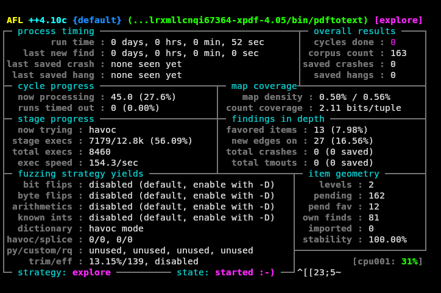

Fuzz testing is a technique for automatically uncovering bugs in software. It's an effective way to find subtle data parsing bugs, including security critical issues, but it's a pain to set up.

I recently used Nix to set up a fuzz testing workflow, and I was pleasantly surprised at how much gruntwork it eliminated from fuzz testing. Nix helped me find an unpatched bug in a PDF renderer, and the experience finally made key Nix concepts click for me.

## A preview of the solution

I'm going to show you the process I used to create a fuzzing workflow with Nix, but here's the end result: you can start fuzz testing [an open-source PDF reader](https://www.xpdfreader.com/) with a single command:

```bash
nix run gitlab:mtlynch/fuzz-xpdf
```

The command should work on any Linux system with Nix installed, and maybe MacOS, too. It should cause your system to spend a few minutes building and then start a terminal UI that looks like this:

{{}}

Here's everything that happens when you run the command above:

1. Nix downloads all tools and dependencies for the PDF reader itself and the testing toolchain.
1. Nix compiles an open-source PDF reader from source with proper instrumentation for fuzz testing.
1. Nix downloads a set of edge-case PDFs to use as a basis for generating inputs for testing.
1. Nix automatically generates new PDFs, feeds them to the PDF reader, and reports which inputs caused the PDF reader to crash.

You don't have to hunt around for all the tools in the toolchain for compiling the PDF reader or the fuzzer. You just run the command above, and it will install everything for you.

What's more, if you want to change the fuzzing options or test a different version of the PDF reader, you can change a single file and re-run the command.

In this post, I'm going to share how I created it step by step. The methodology I show allows you to apply the same techniques to other projects.

If you're impatient, you can tinker with [my configuration](https://gitlab.com/mtlynch/fuzz-xpdf/-/blob/master/flake.nix?ref_type=heads) without sticking around for the explanation.

## What's fuzz testing?

Fuzz testing or "fuzzing" is a way of finding bugs in program by feeding it randomly generated input.

For example, if you wanted to fuzz test a program that resized JPEG images, the workflow would look like this:

1. Take a set of valid and/or malformed JPEG image files.
1. Randomly select one of the input files and randomly mutate it (flip some bits, add some data, delete some data).
1. Feed the mutated input file to the image resizing program.
1. If the mutated input caused the program to crash or hang, save the input for later analysis.
1. Go back to step (2)

Fuzz testing often reveals security-critical bugs.

### Coverage-aware fuzzing

Modern fuzzers are even smarter than random, as they trace execution within a program. So if the fuzzing tool mutates an input file, feeds it to the target program, and then the program executes a piece of code that no other input has triggered, the fuzzer tries more mutations from there to try to execute less-traveled code paths, as that's often where bugs lie.

### Why fuzzing is hard

One of the biggest obstacles to fuzz testing is that it's a pain to set up. I've been trying to learn fuzzing, but all the tutorials I've found make it so hard to get a working setup.

## What's Nix?

Nix is a complex tool that does a lot of different things, many of which I don't even understand.

For the purposes of this article, it's sufficient to think of Nix as:

- A package manager, similar to `apt` or `yum`. Nix has XXk packages available to run within the Nix environment.
- A build tool, similar to `make` or `Docker`. Nix allows you to define a set of build steps and the dependencies between them, and Nix figures out which steps to perform to achieve the build you request.

## Requirements

To follow along, you'll only need two things:

- Nix (with Flakes enabled)
  - I recommend the Determinate Systems installer, which enables Flakes by default.
- git

## Selecting a fuzzing target

The PDF reader I'm fuzz testing is called [xpdf](https://xpdfreader.com). I'd never seen it before, but it was an example in a good fuzzing tutorial I found (TODO: link), so I'm sticking with it.

xpdf is a PDF viewer, but it ships with a suite of PDF utilities. One of the utilities, `pdftotext` is an attractive fuzzing target because it's so simple. It has no GUI; it just accepts a PDF as input and produces plaintext as output, but it still exercises xpdf's complex PDF parsing code. If I find a bug in `pdftotext`, it means I've probably found a bug in the whole `xpdf` suite.

## Putting the Nix boilerplate in place

To start the project, I create a new folder and create a git repository.

```bash
mkdir fuzz-xpdf \
  && cd fuzz-xpdf \
  && git init
```

Next, I create this file called `flake.nix`:

```nix
{
  description = "compile xpdf from source for fuzzing";

  inputs = {
    nixpkgs.url = "github:NixOS/nixpkgs/nixos-24.05";
    flake-utils.url = "github:numtide/flake-utils";
  };

  outputs = { self, nixpkgs, flake-utils }:
    flake-utils.lib.eachDefaultSystem (system:
      let
        pkgs = nixpkgs.legacyPackages.${system};
      in
      {
        packages = rec {
          default = xpdf;

          xpdf = pkgs.stdenv.mkDerivation rec {
            # TODO: I'll populate this next.
          };
        };
      }
    );
}
```

This is a Nix "flake," which is a file that defines a set of Nix packages and applications.

So far, this is just a boilerplate skeleton of a Nix flake. Most of it is not worth discussing except this line:

```
nixpkgs.url = "github:NixOS/nixpkgs/nixos-24.05";
```

This tells Nix that when I want to pull in packages, I'm pulling them from the [24.05 tag](https://github.com/NixOS/nixpkgs/tree/24.05) of the Nix package repository.

But this is just a skeleton and won't successfully build yet. To compile xpdf using Nix, I need to add a few bits.

## Specifying a source tarball

To compile xpdf, I need a copy of its source code.

First, I call [`mkDerivation`](https://nixos.org/manual/nixpkgs/stable/#sec-using-stdenv), which is how I define a build component in Nix. It requires a package name (`pname`) and version, so I specify `xpdf`, the package I want to fuzz and `4.05`, the latest published version of xpdf as of this writing.

```nix
{
  xpdf = pkgs.stdenv.mkDerivation rec {
    pname = "xpdf";
    version = "4.05";
    ...
```

The other required field in `mkDerivation` is a `src` which specifies how Nix should retrieve the inputs for the build. In the case of xpdf, the source tarball is located at this URL:

- https://dl.xpdfreader.com/xpdf-4.05.tar.gz

I specify xpdf's tarball URL using the `pname` and `version` variables so that when future versions of xpdf come out, it's obvious how to adjust the version number in my Nix flake to match:

```nix
{
  xpdf = pkgs.stdenv.mkDerivation rec {
    ...
    src = pkgs.fetchzip {
      url = "https://dl.xpdfreader.com/${pname}-${version}.tar.gz";
      extension = "tar.gz";
    };
```

The problem is that Nix needs a hash of the tarball to determine whether the local version matches what's on the server. If I try to `nix build` at this point, Nix complains that the hash is wrong:

```text
warning: found empty hash, assuming 'sha256-AAAAAAAAAAAAAAAAAAAAAAAAAAAAAAAAAAAAAAAAAAA='
error: hash mismatch in fixed-output derivation '/nix/store/z3ckfdjqpfd73xkkwsnpg4ijwj60vyz8-source.drv':
         specified: sha256-AAAAAAAAAAAAAAAAAAAAAAAAAAAAAAAAAAAAAAAAAAA=
            got:    sha256-LBxKSrXTdoulZDjPiyYMaJr63jFHHI+VCgVJx310i/w=
```

To fix the hash mismatch, I paste the value in the error message after `got` back into my `flake.nix`.

```nix
{
  xpdf = pkgs.stdenv.mkDerivation rec {
    ...
    src = pkgs.fetchzip {
      url = "https://dl.xpdfreader.com/${pname}-${version}.tar.gz";
      # Paste the hash that appeared next to "got" in the error message.
      hash = "sha256-LBxKSrXTdoulZDjPiyYMaJr63jFHHI+VCgVJx310i/w=";
      extension = "tar.gz";
    };
```

## Compiling xpdf from source

Now that I've shown Nix how to retrieve xpdf's source code, I have to figure out how to build it.

The xpdf [compile instructions](https://gitlab.com/mtlynch/xpdf/-/blob/4.05/INSTALL#L32-39) list the following dependencies:

> Make sure you have the following installed:
>
> - CMake 2.8.8 or newer
> - FreeType 2.0.5 or newer
> - Qt 5.x or 6.x (for xpdf only)
> - libpng (for pdftopng and pdftohtml)
> - zlib (for pdftopng and pdftohtml)

I only want to run `pdftotext`, so I only need CMake and FreeType.

This is normally the stage during building a tool from source where the pain begins. I find out that tool A depends on library X, then I have to research how to install X, and it depends on package Y, and on and on. And often, there's a package available but only for different version of my OS.

With Nix, installing dependencies is easier than in other environments because:

- Nix has one of the largest package repositories of any package manager, so most packages I need are already available.
- Nix packages are not tied to any OS version, so as long as there's a Nix package for my architecture, I can use it.

Looking at the [Nix package repository](https://search.nixos.org), I see that packages for cmake and freetype are indeed already available:

- [cmake](https://search.nixos.org/packages?channel=24.05&show=cmake&from=0&size=50&sort=relevance&type=packages&query=cmake)
- [freetype](https://search.nixos.org/packages?channel=24.05&show=freetype&from=0&size=50&sort=relevance&type=packages&query=freetype)

I assume I only need cmake at build time, not at runtime, which means it belongs under `nativeBuildInputs`. I probably need `freetype` at runtime, so I specify it under `buildInputs`:

```nix
{
  xpdf = pkgs.stdenv.mkDerivation rec {
    ...
    nativeBuildInputs = with pkgs; [
      cmake
    ];

    buildInputs = with pkgs; [
      freetype
    ];
```

At this point, `flake.nix` should look like this:

```nix
{
  description = "compile xpdf from source for fuzzing";

  inputs = {
    nixpkgs.url = "github:NixOS/nixpkgs/nixos-24.05";
    flake-utils.url = "github:numtide/flake-utils";
  };

  outputs = { self, nixpkgs, flake-utils }:
    flake-utils.lib.eachDefaultSystem (system:
      let
        pkgs = nixpkgs.legacyPackages.${system};
      in
      {
        packages = rec {
          default = xpdf;

          xpdf = pkgs.stdenv.mkDerivation rec {
            pname = "xpdf";
            version = "4.05";

            src = pkgs.fetchzip {
              url = "https://dl.xpdfreader.com/${pname}-${version}.tar.gz";
              hash = "sha256-LBxKSrXTdoulZDjPiyYMaJr63jFHHI+VCgVJx310i/w=";
              extension = "tar.gz";
            };

            nativeBuildInputs = with pkgs; [
              cmake
            ];

            buildInputs = with pkgs; [
              freetype
            ];
          };
        };
      }
    );
}
```

For tidiness, I create a `.gitignore`:

```bash
echo 'result' > .gitignore
```

And I add everything to the git repository:

```
git add --all
```


**Note**: An annoying gotcha of Nix flakes is that Nix can't see files unless they're under source control by git. If you get error messages about "file not found," check that you've added the file to git.


Finally, I build the package from source with `nix build`:

```bash
nix build
```

If everything worked, there should be a set of binaries under `./result/bin` that I can run:

```bash
$ ls ./result/bin/
pdfdetach  pdffonts  pdfimages  pdfinfo  pdftohtml  pdftopng  pdftoppm  pdftops  pdftotext
```

I can run `pdftotext` and verify that it's working:

```bash
$ ./result/bin/pdftotext -v
pdftotext version 4.05 [www.xpdfreader.com]
Copyright 1996-2024 Glyph & Cog, LLC
```

As a test I downloaded the [Form W-4 PDF](https://www.irs.gov/pub/irs-pdf/fw4.pdf) from the IRS website and fed it to `pdftotext`:

```text
$ ./result/bin/pdftotext fw4.pdf /dev/stdout | head -n 5
Form W-4
Department of the Treasury Internal Revenue Service

Employee's Withholding Certificate
Complete Form W-4 so that your employer can withhold the correct federal income tax from your pay. Give Form W-4 to your employer.
```

Cool, that looks correct.

The full source at this stage is [available on Gitlab](https://gitlab.com/mtlynch/fuzz-xpdf/-/tree/01-compile-xpdf).

## That was confusingly easy

If you're confused at how Nix built those binary, so was I.

I hadn't even told Nix what the build process was for `xpdf`, so how did it know?

It turns out that the Nix `mkDerivation` function I called assumes a standard `make` build process:

> for Unix packages that use the standard `./configure; make; make install` build interface, you don’t need to write a build script at all; the standard environment does everything automatically. If `stdenv` doesn’t do what you need automatically, you can easily customise or override the various build phases.
>
> ["The Standard Environment"](https://nixos.org/manual/nixpkgs/stable/#chap-stdenv) from the Nix Manual

Still, it seemed a bit _too_ magical to me.

The `xpdf` instructions explain how you have to [tell the compiler where to find Freetype's headers and libraries](https://gitlab.com/mtlynch/xpdf/-/blob/4.05/INSTALL#L61-70). I never did that, so how was that working?

And `make install` normally writes to a system-wide directory like `/usr/bin/`, but that shouldn't be possible, since I never elevated to root with `sudo`.

I suspected that, in addition to implicitly calling the `make` build sequence, Nix was quietly controlling the build process through environment variables.

To test my theory, I replaced the default `installPhase` option with one that dumped all environment variables:

```nix
{
  xpdf = pkgs.stdenv.mkDerivation rec {
    ...
    installPhase = ''
      printenv
      make install
    '';
```

I then re-ran `nix build` with verbose logging:

```bash
nix build -L
```

Sure enough, I saw that it pointed to the Freetype headers via the `CMAKE_INCLUDE_PATH` variable:

```text
CMAKE_INCLUDE_PATH=/nix/store/rmqyzrzpz2kzmn8329bc4fjmzvd33ylw-freetype-2.13.2-dev/include:...
```

And the reason it hadn't scribbled over my `/usr/bin` directory was that Nix told `cmake` to install in a Nix-specific install directory:

```text
cmakeFlags=...-DCMAKE_INSTALL_BINDIR=/nix/store/7w4ql3kdrl3c0knnvx3lxsnrqfzfcy34-xpdf-4.05/bin
```

## Compiling xpdf with honggfuzz

honggfuzz is a coverage-guided fuzzer, which means that it traces which parts of the target binary execute as different inputs run. honggfuzz can do this even for closed-source binaries, but for open-source projects, honggfuzz does a better job of fuzzing if I recompile the application using honggfuzz as my compiler.

honggfuzz ships with C and C++ compilers that are drop-in replacements for TODO, so compiling with honggfuzz should be as simple as telling the build toolchain to use this compiler.

According to [honggfuzz's docs](https://github.com/AFLplusplus/AFLplusplus/blob/v4.21c/docs/fuzzing_in_depth.md#a-selecting-the-best-afl-compiler-for-instrumenting-the-target), I'm likely to see the best fuzzing results with `afl-clang-lto`, but that requires clang 11 or higher. honggfuzz docs also recommend the newest possible version of llvm. The latest version of LLVM available through Nix is 18.

Next, I modify `nativeBuildInputs` to include both the [`aflplusplus`](https://search.nixos.org/packages?channel=24.05&show=aflplusplus&from=0&size=50&sort=relevance&type=packages&query=aflplusplus) package and the [`llvm_18` package](https://search.nixos.org/packages?channel=24.05&show=llvm_18&from=0&size=50&sort=relevance&type=packages&query=llvm):

```nix
{
  xpdf = pkgs.stdenv.mkDerivation rec {
    ...
    nativeBuildInputs = with pkgs; [
      aflplusplus
      cmake
      llvm_18
    ];
}
```

Okay, now honggfuzz will be available in my build environment, but how do I tell cmake to use the honggfuzz compiler instead of whatever it was using before?

Make and CMake respect the [`CC`](https://cmake.org/cmake/help/latest/envvar/CC.html) and [`CXX`](https://cmake.org/cmake/help/latest/envvar/CXX.html) environment variables, which specify a C and C++ compiler, respectively.

Interestingly, I tested setting `export CC=afl-clang-lto`, and that worked fine, but that creates ambiguity, whereas I specifically want to point to the binary from the `aflplusplus` package. But I don't know where in that package `afl-clang-lto` is located

Next, I specify some environment variables to compile xpdf effectively for fuzzing:

```bash
$ nix build nixpkgs#aflplusplus

$ find -L result -type f -name afl-clang-lto
result/bin/afl-clang-lto
```

Okay, that tells me that the compilers are under the package output for aflplusplus under the `bin/` subdirectory, so I specify them like this:

```nix
{
    xpdf = pkgs.stdenv.mkDerivation rec {
    ...
      preConfigure = ''
        export CC=${pkgs.aflplusplus}/bin/afl-clang-lto
        export CXX=${pkgs.aflplusplus}/bin/afl-clang-lto++
      '';
}
```

At this point, `flake.nix` should [look like this](https://gitlab.com/mtlynch/fuzz-xpdf/-/blob/02-compile-xpdf-with-afl++/flake.nix?ref_type=heads).

## Ad-hoc fuzzing

```nix
{
    packages = rec {
        ...
    };

    devShells.default = pkgs.mkShell {
      buildInputs = self.packages.${system}.xpdf.nativeBuildInputs ++ (with pkgs; [
        wget
      ]);

      shellHook = ''
        wget --version | head -n 1
      '';
    };
```

At this point, `flake.nix` should [look like this](https://gitlab.com/mtlynch/fuzz-xpdf/-/blob/03-dev-shell/flake.nix?ref_type=heads).

The `mkShell` function creates a terminal shell where I can access the components in my Nix environment. I enter the shell by typing `nix develop`:

```bash
$ nix develop
GNU Wget 1.21.4 built on linux-gnu.
GNU gdb (GDB) 14.2
honggfuzz++4.10c
```

The output is from `shellHook` which prints the version numbers of the tools available within the shell.

Next, I grab a PDF to use as my sample input.

```bash
$ PDF_URL='https://www.irs.gov/pub/irs-pdf/fw4.pdf' && \
  PDF_DIR="$(mktemp --directory)" && \
  wget --directory-prefix="${PDF_DIR}" "${PDF_URL}"
```

Then I create a directory to store the fuzz results. Since this is just experimental, I'm using a temporary directory:

```bash
FUZZ_OUTPUT_DIR="$(mktemp --directory)"
```

I do one more `nix build` to ensure that `pdftotext` is ready to run under the `./result/bin` folder:

```bash
$ nix build && ./result/bin/pdftotext -v
pdftotext version 4.05 [www.xpdfreader.com]
Copyright 1996-2024 Glyph & Cog, LLC
```

Finally, it's the moment of truth. I put everything together to call honggfuzz's fuzz testing runner, `honggfuzz`.

```bash
$ honggfuzz \
    --input "${PDF_DIR}" \
    -- ./result/bin/pdftotext ___FILE___
```

There's a lot to this command, so let me break it down:

- `--input "${PDF_DIR}"`: Specifies the directory of input files to mutate.
- `-- ./result/bin/pdftotext ___FILE___`: Specifies the target program to fuzz. `honggfuzz` replaces the `___FILE___` with a newly generated file on each execution.

I run the command and am greeted to the honggfuzz fuzzing interface:

TODO

## Next: Finding an unpatched bug

That's enough for part one. In my follow-up post, I'll show how to automate more of the fuzzing workflow and tune honggfuzz to find an unpatched bug in the latest version of xpdf.

- [Nix is Surprisingly Useful for Fuzz Testing (Part Two)](/nix-fuzz-testing-2/)

---

_Thanks to XX for creating the tutorial series XX. This work builds on that foundation._
