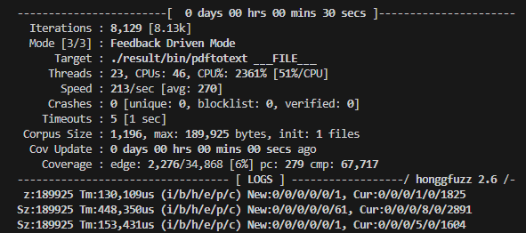
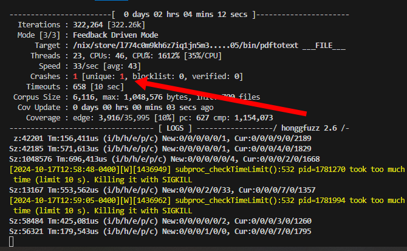

This is the second half of a post about [using Nix to automate a fuzz testing workflow](/nix-fuzz-testing-1/).

At this point, I can run honggfuzz against `pdftotext`, but it takes a bit of manual effort to get things started. I promised in part one that I'd get all installation and fuzzing down to a single command.

## Downloading tricky PDFs

In my ad-hoc fuzzing, I had to download a boring PDF from the IRS interactively through the command-line. I'll start by automating that step.

While I'm automating, I can probably do better than a single PDF. For fuzzing, my goal is to have a wide variety of PDFs that exercise different parts of the PDF file format.

Adobe [used to have a corpus of interesting-looking test PDFs](https://web.archive.org/web/20150228065245/http://acroeng.adobe.com/wp/?page_id=10), but they've taken it offline.

The best collection of difficult-to-parse PDFs I found was in Mozilla's pdf.js project. It [contains 700 PDFs](https://github.com/mozilla/pdf.js/tree/v4.7.76/test/pdfs) that have caused parsing bugs in their tool, so it's likely that these same PDFs will trip up other PDF parsers.

I create a new build step in my Nix flake that downloads all the PDFs from Mozilla's pdf.js project:

```nix
{
    packages = rec {
        ...
        sample-pdfs = pkgs.stdenv.mkDerivation rec {
          pname = "sample-pdfs";
          version = "4.7.76";

          src = pkgs.fetchzip {
            url = "https://github.com/mozilla/pdf.js/archive/refs/tags/v${version}.zip";
            hash = "sha256-2xt8j2xJ3Teg/uiwjbWnpR6zckdxsp3LVbfsbBc3Dco=";
          };

          buildCommand = ''
            mkdir -p $out
            cp $src/test/pdfs/*.pdf $out
          '';
        };
```

At this point, `flake.nix` should [look like this](https://gitlab.com/mtlynch/fuzz-xpdf/-/blob/04-download-pdfs/flake.nix).

Sidenote: In addition to the PDFs themselves, the pdf.js repo contains several hundred `.link` files that contain URLs of external PDFs. I can't think of a simple way of pulling those external PDFs into a Nix pipeline. I welcome suggestions on integrating them, as they would achieve higher fuzzing coverage.

I run the new `sample-pdfs` build step with the following command:

```bash
nix build .#sample-pdfs
```

From there, I verify that Nix successfully downloaded 700 PDFs:

```bash
$ ls ./result | head -n 5
160F-2019.pdf
alphatrans.pdf
annotation-border-styles.pdf
annotation-button-widget.pdf
annotation-caret-ink.pdf

$ $ ls ./result | wc --lines
700
```

The new build step gives me an initial corpus of edge case PDFs that will hopefully exercise less frequent code paths of any PDF parsing code.

## Automating fuzz runs

In part 1 of this series, I showed how to run honggfuzz manually from a Nix dev shell. I can make that process even easier by defining a launch command for the fuzzer in my Nix flake.

To start, I add a new shell script for launching honggfuzz:

```nix
{
    packages = rec {
      xpdf = pkgs.stdenv.mkDerivation rec {
        ...
      }

      fuzz-xpdf = pkgs.writeShellScriptBin "fuzz-xpdf" ''
        readonly CORPUS_DIR='fuzz-corpus'
        mkdir -p "$CORPUS_DIR"

        # Copy the source corpus into a new directory for active fuzzing.
        cp --force ${sample-pdfs}/*.pdf "$CORPUS_DIR"

        ${pkgs.honggfuzz}/bin/honggfuzz \
          --input "$CORPUS_DIR" \
          --instrument \
          --timeout 10 \
          -- ${xpdf}/bin/pdftotext ___FILE___
      '';
```

I build the shell script with `nix build`:

```bash
nix build .#fuzz-xpdf
```

Nix then creates a bash script at `./result/bin/fuzz-xpdf`:

```bash
$ cat ./result/bin/fuzz-xpdf
#!/nix/store/1xhds5s320nfp2022yjah1h7dpv8qqns-bash-5.2p32/bin/bash
readonly CORPUS_DIR='fuzz-corpus'
mkdir -p "$CORPUS_DIR"

# Copy the source corpus into a new directory for active fuzzing.
cp --force /nix/store/gncc6jy3cry5lwbkd2b54h1dg46wfkdc-sample-pdfs-4.7.76/*.pdf "${CORPUS_DIR}"

/nix/store/kb9vkjv4admbdixrjyanfb1i9dd3cbmm-honggfuzz-2.6/bin/honggfuzz \
  --input "$CORPUS_DIR" \
  --instrument \
  -- /nix/store/pixq8qiqyy6iwsc4wisb1vrmgy7l1kas-xpdf-4.05/bin/pdftotext ___FILE___
```

In the shell script, Nix replaced all the Nix variables with absolute paths. The bash variable (`CORPUS_DIR`) remains a symbol so that bash can interpret it at script runtime.

If I run the shell script, it starts a new fuzzing session:

```bash
./result/bin/fuzz-xpdf
```

That command should produce a screen like this:

{{}}

This works, but I'd have to remember to run the `nix build` command first every time I execute the shell script. Nix offers an even simpler solution with its `apps` feature.

I add an `apps` definition to my Nix flake after the `packages` section:

```nix
{
    packages = rec {
        ...
    };

    apps = {
      default = self.apps.${system}.fuzz-xpdf;
      fuzz-xpdf = {
        type = "app";
        program = "${self.packages.${system}.fuzz-xpdf}/bin/fuzz-xpdf";
      };
    };
```

With my `fuzz-xpdf` app in place, I kick off fuzzing with a single command:

```bash
nix run .#fuzz-xpdf
```

I declared `fuzz-xpdf` as the default app for this flake, so I can actually use an even simpler command:

```bash
nix run
```

At this point, `flake.nix` should [look like this](https://gitlab.com/mtlynch/fuzz-xpdf/-/blob/05-launch-honggfuzz/flake.nix).

Now, the fuzzing workflow is complete.

I can put this Nix flake in a brand new directory, and when I run `nix run`, it will download all the tricky PDFs, compile xpdf, and start fuzzing. I can let honggfuzz run indefinitely and see what crashes it finds.

{{}}

## Turning subtle memory errors into loud crashes with ASAN

By this point, my fuzzing workflow is functional, but I can run it more efficiently.

When fuzz testing, you only know when you've found an interesting bug when it causes the target application to crash. The problem is that are lots of ways to make a program misbehave without crashing it.

One of the most famous examples of a security bug with no crashes the 2014 [Heartbleed](https://heartbleed.com/) bug in OpenSSL. It allowed attackers to extract sensitive information from web servers, but it didn't cause them to crash. Tricking a program into reading or writing memory outside of the intended bounaries doesn't always crash it.

The good news is that there's a tool that forces otherwise non-crashy memory errors to crash the program immediately. [Address Sanitizer (ASAN)](https://github.com/google/sanitizers/wiki/addresssanitizer) adds extra safety checks to a program's memory reads and writes that crash with debug output if the program attempts to read or write beyond a variable's memory location.

Adding ASAN to my fuzzing workflow allows me to find more memory bugs than I otherwise would. To compile xpdf with ASAN enabled, I add `-fsanitize=address` to xpdf's compilation step:

```nix
{
    {
      packages = rec {
        xpdf = pkgs.stdenv.mkDerivation rec {

          ...

          preConfigure = ''
            export CC=${pkgs.honggfuzz}/bin/hfuzz-clang
            export CXX=${pkgs.honggfuzz}/bin/hfuzz-clang++

            # Use address sanitizer (ASAN).
            export CFLAGS="$CFLAGS -fsanitize=address"
            export CXXFLAGS="$CXXFLAGS -fsanitize=address"
          '';
        };
```

At this point, `flake.nix` should [look like this](https://gitlab.com/mtlynch/fuzz-xpdf/-/blob/06-asan/flake.nix).

Now, I'm finally ready to kick off my fuzzer and let it find some bugs for me. With my Nix flake, that's as simple as running:

```bash
nix run
```

## Finding my first crash

I let honggfuzz run for two hours and checked back to find that it discovered its first crash:

{{}}

honggfuzz saved the PDF that caused the crash in a file named:

- `SIGABRT.PC.55555592fff5.STACK.1bb46b81df.CODE.-6.ADDR.0.INSTR.mov____%eax,%edx.fuzz`

To reproduce the crash, I ran the following commands:

```bash
# Specify the path to the crashing PDF.
CRASHING_PDF='SIGABRT.PC.55555592fff5.STACK.1bb46b81df.CODE.-6.ADDR.0.INSTR.mov____%eax,%edx.fuzz'

# Rebuild pdftotext in the result folder
nix build

# Run pdftotext with the crashing PDF.
./result/bin/pdftotext "${CRASHING_PDF}" /dev/null
```

The program indeed crashes, with ASAN reporting that it caught a buffer overflow:

```text
==1259902==ERROR: AddressSanitizer: heap-buffer-overflow on address 0x60200002228f at pc 0x557c3230bd58 bp 0x7ffd7f070cf0 sp 0x7ffd7f070ce8
READ of size 1 at 0x60200002228f thread T0
    #0 0x557c3230bd57  (/nix/store/l774c0m9kh6z7iq1jn5m31kzy77kwffc-xpdf-4.05/bin/pdftotext+0x3e3d57)
    #1 0x557c3231f6ea  (/nix/store/l774c0m9kh6z7iq1jn5m31kzy77kwffc-xpdf-4.05/bin/pdftotext+0x3f76ea)
    #2 0x557c32327a0d  (/nix/store/l774c0m9kh6z7iq1jn5m31kzy77kwffc-xpdf-4.05/bin/pdftotext+0x3ffa0d)
    #3 0x557c3232733c  (/nix/store/l774c0m9kh6z7iq1jn5m31kzy77kwffc-xpdf-4.05/bin/pdftotext+0x3ff33c)
    #4 0x557c322bfaa7  (/nix/store/l774c0m9kh6z7iq1jn5m31kzy77kwffc-xpdf-4.05/bin/pdftotext+0x397aa7)
...
SUMMARY: AddressSanitizer: heap-buffer-overflow (/nix/store/l774c0m9kh6z7iq1jn5m31kzy77kwffc-xpdf-4.05/bin/pdftotext+0x3e3d57)
Shadow bytes around the buggy address:
  0x602000022000: fa fa fd fd fa fa fd fa fa fa fd fd fa fa fd fa
  0x602000022080: fa fa fd fd fa fa fd fd fa fa 00 01 fa fa fd fd
  0x602000022100: fa fa 00 03 fa fa fd fa fa fa 00 00 fa fa fd fa
  0x602000022180: fa fa fd fa fa fa fd fd fa fa 00 02 fa fa fd fa
  0x602000022200: fa fa fd fa fa fa fd fa fa fa fd fa fa fa 00 00
=>0x602000022280: fa[fa]00 fa fa fa fd fa fa fa fd fa fa fa fd fa
  0x602000022300: fa fa fd fa fa fa fd fa fa fa 03 fa fa fa fd fa
```

ASAN's error message is a bit arcane, but it's telling me that ASAN caught `pdftotext` trying to read 1 byte outside of the buffer that `pdftotext`'s code had allocated.

So, how do I dig deeper into what's causing this crash?

## Improving debug symbols

When `pdftotext` crashed, I hoped to see a stack trace that included source filenames and line numbers. Instead, the output was just binary offsets, which makes debugging harder:

```text
#0 0x557c3230bd57  (/nix/store/l774c0m9kh6z7iq1jn5m31kzy77kwffc-xpdf-4.05/bin/pdftotext+0x3e3d57)
#1 0x557c3231f6ea  (/nix/store/l774c0m9kh6z7iq1jn5m31kzy77kwffc-xpdf-4.05/bin/pdftotext+0x3f76ea)
#2 0x557c32327a0d  (/nix/store/l774c0m9kh6z7iq1jn5m31kzy77kwffc-xpdf-4.05/bin/pdftotext+0x3ffa0d)
```

Strangely, the hardest part of this whole process was figuring out how to get debug symbols to work properly so I could see source information in my crash dumps.

First, I happened to notice that `nix run`'s log output said something about stripping debug output from the binary. It turns out that Nix has [a `dontStrip` option](https://nixos.org/manual/nixpkgs/stable/#var-stdenv-dontStrip) that defaults to `false`, meaning that it automatically strips debug information.

I also noticed that xpdf's [compile instructions](https://gitlab.com/mtlynch/xpdf/-/blob/4.05/INSTALL#54) mentioned a `CMAKE_BUILD_TYPE` option. It's not documented, but searching the source [revealed that it accepted a value of `Debug`](https://gitlab.com/mtlynch/xpdf/-/blob/4.05/cmake-config.txt#L48).

To preserve debug symbols in my xpdf binaries, I added these options to the end of my `xpdf` package definition:

```nix
{
    {
      packages = rec {
        xpdf = pkgs.stdenv.mkDerivation rec {

          ...

          preConfigure = ''
            ...
          '';

          cmakeFlags = [
            "-DCMAKE_BUILD_TYPE=Debug"
          ];

          # Don't strip debug information from binaries, as the debug symbols
          # are usefule during crash analysis.
          dontStrip = true;
        };
```

At this point, something strange happened. I got rich stack traces with filenames and line numbers, but then they'd mysteriously stop working after a few hours. I still don't know why.

To get the rich stack traces to work consistently, I had to use a tool called `llvm-symbolizer`, which I'd never heard of before. Fortunately, `llvm-symbolizer` ships as part of the popular [`llvm_18` Nix package](https://search.nixos.org/packages?channel=24.05&show=llvm_18&from=0&size=50&sort=relevance&type=packages&query=llvm_18), so I included that package in my Nix flake and added an environment variable called `ASAN_SYMBOLIZER_PATH` to point to that binary.

The changes to my Nix flake are a bit hard to show because they touch several disparate parts of the file, so it's easiest to look at [the diff](https://gitlab.com/mtlynch/fuzz-xpdf/-/compare/06-asan...07-debug-symbols).

With the changes to my Nix flake, I need to enter the Nix dev shell to see rich stack traces, as that will set the proper `ASAN_SYMBOLIZER_PATH` environment value.

```bash
# Enter the nix dev shell.
nix develop

# Rebuild pdftotext in the result folder
nix build

# Specify the path to the crashing PDF.
CRASHING_PDF='SIGABRT.PC.55555592fff5.STACK.1bb46b81df.CODE.-6.ADDR.0.INSTR.mov____%eax,%edx.fuzz'

# Run pdftotext with the crashing PDF.
./result/bin/pdftotext "${CRASHING_PDF}" /dev/null
```

And then, I should finally see a stack trace with filenames:

```
=================================================================
==1461608==ERROR: AddressSanitizer: heap-buffer-overflow on address 0x60200002228f at pc 0x55555592fff5 bp 0x7fffffffac70 sp 0x7fffffffac68
READ of size 1 at 0x60200002228f thread T0
    #0 0x55555592fff4 in GString::getChar(int) /build/source/goo/GString.h:82:32
    #1 0x55555592fff4 in GfxFont::readFontDescriptor(XRef*, Dict*) /build/source/xpdf/GfxFont.cc:553:20
    #2 0x5555559423da in GfxCIDFont::GfxCIDFont(XRef*, char const*, Ref, GString*, GfxFontType, Ref, Dict*) /build/source/xpdf/GfxFont.cc:1732:3
    #3 0x55555594a065 in GfxFont::makeFont(XRef*, char const*, Ref, Dict*) /build/source/xpdf/GfxFont.cc:190:16
...
    #22 0x7ffff7a7110d in __libc_start_call_main (/nix/store/r8qsxm85rlxzdac7988psm7gimg4dl3q-glibc-2.39-52/lib/libc.so.6+0x2a10d) (BuildId: 323d12eb412f4a20879fb07d3514ca673c5aee20)
    #23 0x7ffff7a711c8 in __libc_start_main@GLIBC_2.2.5 (/nix/store/r8qsxm85rlxzdac7988psm7gimg4dl3q-glibc-2.39-52/lib/libc.so.6+0x2a1c8) (BuildId: 323d12eb412f4a20879fb07d3514ca673c5aee20)
    #24 0x555555698a04 in _start (/nix/store/x59ccyx8gz0ap74zapdi7k8ssgypmipm-xpdf-4.05/bin/pdftotext+0x144a04)
```

It worked! Now, I get source filenames, line numbers, and function names.

But there's still a problem. Look at the path to any of the files.

```text
/build/source/xpdf/GfxFont.cc
^^^^^^^^^^^^^
  Where is this coming from?
```

The xpdf sources all point to a root folder called `/build/source`, but that path doesn't exist on my system:

```bash
$ ls /build/source
ls: cannot access '/build/source': No such file or directory
```

I'm not sure if the `/build/source` path is a quirk of Nix or of xpdf's build configuration. The only way I've been able to fix this is with a semi-ugly hack that replaces the incorrect path with the correct one at compile time using clang's `-fdebug-prefix-map` flag:

```nix
{
    {
      packages = rec {
        xpdf = pkgs.stdenv.mkDerivation rec {

          ...

          preConfigure = ''
            ...

            # For some reason, without these flags, the debug symbols point to
            # source files at the base filesystem /build/source, so we
            # manually fix the source path.
            export CXXFLAGS="$CXXFLAGS -fdebug-prefix-map=/build/source=${xpdf.src}"
          '';
```

If I re-run my `nix build` sequence, finally, the stack traces are correct:

```text
==1498830==ERROR: AddressSanitizer: heap-buffer-overflow on address 0x60200002228f at pc 0x55555592fff5 bp 0x7fffffffac70 sp 0x7fffffffac68
READ of size 1 at 0x60200002228f thread T0
    #0 0x55555592fff4 in GString::getChar(int) /nix/store/alirmx60yanq6g8ym5v3laa7ncw2h9nm-source/goo/GString.h:82:32
    #1 0x55555592fff4 in GfxFont::readFontDescriptor(XRef*, Dict*) /nix/store/alirmx60yanq6g8ym5v3laa7ncw2h9nm-source/xpdf/GfxFont.cc:553:20
    #2 0x5555559423da in GfxCIDFont::GfxCIDFont(XRef*, char const*, Ref, GString*, GfxFontType, Ref, Dict*) /nix/store/alirmx60yanq6g8ym5v3laa7ncw2h9nm-source/xpdf/GfxFont.cc:1732:3
    #3 0x55555594a065 in GfxFont::makeFont(XRef*, char const*, Ref, Dict*) /nix/store/alirmx60yanq6g8ym5v3laa7ncw2h9nm-source/xpdf/GfxFont.cc:190:16
    #4 0x55555594a065 in GfxFontDict::load(char*, GfxFontDictEntry*) /nix/store/alirmx60yanq6g8ym5v3laa7ncw2h9nm-source/xpdf/GfxFont.cc:2393:12
```

If I plug that file path into `sed`, it prints the file's contents:

```bash
$ sed -n '548,558p' /nix/store/alirmx60yanq6g8ym5v3laa7ncw2h9nm-source/xpdf/GfxFont.cc
      i -= 2;
    } else if (i > 7 && !strncmp(name->getCString() + i - 7, "Oblique", 7)) {
      flags |= fontItalic;
      i -= 7;
    }
    char c = name->getChar(i-1);
    if (!((c >= 'A' && c <= 'Z') ||
          (c >= 'a' && c <= 'z') ||
          (c >= '0' && c <= '9'))) {
      --i;
    }
```

At this point, `flake.nix` should [look like this](https://gitlab.com/mtlynch/fuzz-xpdf/-/blob/07-debug-symbols/flake.nix).

## Understanding the crash

I now have an out of bounds memory read that crashes consistently. I've got all the debugging information I need to understand this bug, so it's time to dive into the source.

The top of the stack trace points to [this line](https://gitlab.com/mtlynch/xpdf/-/blob/4.05/goo/GString.h#L82):

```c
// goo/GString.h

// Get <i>th character.
char getChar(int i) { return s[i]; }
```

Okay, so `s` is a `char` buffer, so it probably contains a C-style string. The `getChar` function doesn't perform any bounds-checking to ensure that the caller is passing a legal value for `i`, and so the function is reading memory outside of the buffer that was allocated for `s`.

I'll step back one level and check how `getChar` was called just before the crash. The [next line](https://gitlab.com/mtlynch/xpdf/-/blob/4.05/xpdf/GfxFont.cc#L553) of the stack trace points here:

```c++
// xpdf/GfxFont.cc

void GfxFont::readFontDescriptor(XRef *xref, Dict *fontDict) {
  ...

  // scan font name for bold/italic tags and update the flags
  if (name) {
    i = name->getLength();
    if (i > 2 && !strncmp(name->getCString() + i - 2, "MT", 2)) {
      i -= 2;
    }

    ...

    char c = name->getChar(i-1); // <<< CRASH
```

Okay, this is actually a fairly simple bug.

`readFontDescriptor` checks that `name` is not `NULL`, but it assumes that it has a length of at least 1. If `name` is an empty string (length 0), then the `getChar` call evaluates to `name->getChar(-1)`. Then, `getChar` returns `s[-1]`, which is 1 byte before the memory buffer that was allocated for `s`.

Re-reading the crash's debug output, my hypothesis matches what ASAN was trying to tell me:

```text
==241578==ERROR: AddressSanitizer: heap-buffer-overflow on address 0x60200002360f at pc 0x55555592fff5 bp 0x7fffffffa650 sp 0x7fffffffa648
READ of size 1 at 0x60200002360f thread T0
    #0 0x55555592fff4 in GString::getChar(int) /nix/store/alirmx60yanq6g8ym5v3laa7ncw2h9nm-source/goo/GString.h:82:32
    #1 0x55555592fff4 in GfxFont::readFontDescriptor(XRef*, Dict*) /nix/store/alirmx60yanq6g8ym5v3laa7ncw2h9nm-source/xpdf/GfxFont.cc:553:20

...

SUMMARY: AddressSanitizer: heap-buffer-overflow /nix/store/alirmx60yanq6g8ym5v3laa7ncw2h9nm-source/goo/GString.h:82:32 in GString::getChar(int)
Shadow bytes around the buggy address:
...
=>0x602000023600: fa[fa]00 fa fa fa fd fd fa fa fd fa fa fa fd fa
```

ASAN said that it's an illegal read of size 1, which makes sense because `getChar` tries to read a single 1-byte character.

ASAN also shows the memory layout where it read the memory address containing byte `fa`. That byte appears immediately before an address containing `00`. The variable `s` contains an empty string, which C++ represents in memory as `00`, so `pdftotext` was trying to read the byte just before the empty string. That read is illegal because it contains data that was not assigned to the `s` variable.

## Fixing the bug

If my hypothesis is correct, this bug should be easy to fix. In `readFontDescriptor`, I can change this line:

```c++
  if (name) {
```

To this:

```c++
  if (name && (name->getLength() > 0)) {
```

That ensures that the function treats an empty string the same as a null pointer and doesn't process it further.

To test my hypothesis, I'll create a patch with this change, recompile xpdf, then re-run `pdftotext` against the same PDF to see if my fix prevents the same crash.

xpdf is a bit unusual for an open-source project in that it doesn't publish a git repository, just periodic tarballs. But that's okay. I'l create my own scratch git repository so I have a workspace for editing the code:

```bash
ORIGINAL_SRC="$(nix eval --raw .#xpdf.src.outPath)"
MODIFIED_SRC="$(mktemp --directory)"

pushd "${MODIFIED_SRC}" && \
  cp --recursive --verbose $ORIGINAL_SRC/* . && \
  chmod -R u+w . && \
  git init && \
  git add --all && \
  git commit --message "Dummy base commit"
```

I now have a copy of xpdf's source code in a fresh git repository. I edit `GfxFont.cc` to make my fix:

```bash
vim xpdf/GfxFont.cc
```

When I've finished my edits and saved the file, I call `git diff` to create a patch file, which looks like this:

```diff
diff --git a/xpdf/GfxFont.cc b/xpdf/GfxFont.cc
index c3db4e8..7074354 100644
--- a/xpdf/GfxFont.cc
+++ b/xpdf/GfxFont.cc
@@ -535,7 +535,7 @@ void GfxFont::readFontDescriptor(XRef *xref, Dict *fontDict) {
   obj1.free();

   // scan font name for bold/italic tags and update the flags
-  if (name) {
+  if (name && (name->getLength() > 0)) {
     i = name->getLength();
     if (i > 2 && !strncmp(name->getCString() + i - 2, "MT", 2)) {
       i -= 2;
```

I copy the patch back to my fuzz testing directory:

```bash
# Create a patch file for the fix.
git diff > check-font-name-length.patch

# Get back to fuzz-xpdf git repo.
popd

mv "${MODIFIED_SRC}/check-font-name-length.patch" .
```

With my patch file in the same directory as my `flake.nix`, I update my Nix flake to tell it to apply my custom patch when compiling xpdf:

```nix
{
  xpdf = pkgs.stdenv.mkDerivation rec {
    ...
    src = pkgs.fetchzip {
      url = "https://dl.xpdfreader.com/${pname}-${version}.tar.gz";
      extension = "tar.gz";
    };

    # Add a custom patch to fix the font name length bug.
    patches = [
      ./check-font-name-length.patch
    ];
```

At this point, `flake.nix` should [look like this](https://gitlab.com/mtlynch/fuzz-xpdf/-/blob/08-patch-bug/flake.nix).

I'm ready to test my fix. I recompile xpdf with my patch and run it against the PDF that caused the previous crash:

```bash
# Specify the path to the crashing PDF.
$ CRASHING_PDF='SIGABRT.PC.55555592fff5.STACK.1bb46b81df.CODE.-6.ADDR.0.INSTR.mov____%eax,%edx.fuzz'

# Rebuild pdftotext in the result folder
$ nix build

# Run pdftotext with the crashing PDF.
$ ./result/bin/pdftotext "${CRASHING_PDF}"
Syntax Error: Couldn't read xref table
Syntax Warning: PDF file is damaged - attempting to reconstruct xref table...
Syntax Error (2800): Bad dynamic code table in flate stream
Syntax Error (2800): Bad block header in flate stream
Syntax Error (2158): Dictionary key must be a name object
Syntax Error: Unterminated string
Syntax Error: Leftover args in content stream
```

And voila! `pdftotext` reports a lot of errors, but the program never crashes. My fix worked.

## Wrapping up

I've found Nix to be an excellent tool for creating fuzz testing workflows.

It took a bit of work to figure out all of Nix's odds and ends for use in fuzzing, but now it should be easy to drop in a different PDF parser or use a different fuzzer. The beauty of Nix is that it composes well, so it's easy to swap out different components within the workflow.

This project ended up being a great way to learn more about both fuzzing and Nix. I've been dabbling in Nix for the last year, but using Nix in this way helped crystallize a lot of concepts that had been foggy for me.

---

_Excerpts from xpdf are used under [the GPLv3 license](https://gitlab.com/mtlynch/xpdf/-/blob/4.05/COPYING3)._
