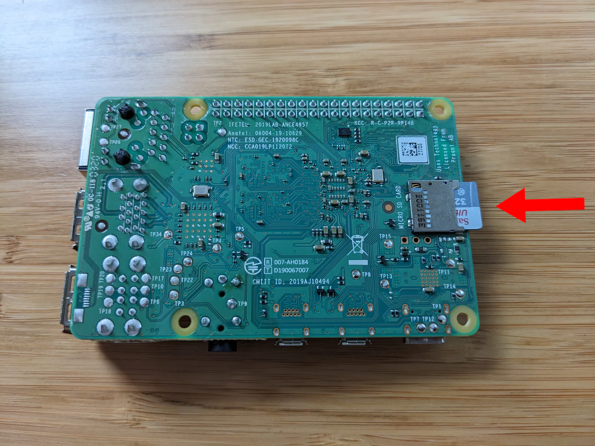

[Nix](https://nixos.org/) is a tool that allows you to define your software environment from code. Nix has several components to it, and one of the most interesting to me is NixOS, which lets you use Nix tooling to define your entire OS configuration using plaintext files.

I only recently started [experimenting with Nix](/notes/nix-first-impressions/), and there's a huge amount to learn. One of the first things I tried to do was [install NixOS on my Raspberry Pi](/notes/nix-first-impressions/#failed-attempt-2-nixos-on-the-raspberry-pi-4), but my first several attempts failed. Every NixOS Pi tutorial I could find was either incomplete or out of date.

I present to you my complete and working guide to installing NixOS on a Raspberry Pi 4. I'm a newcomer to NixOS, so this guide is for Nix beginners, but I assume you have basic familiarity with Raspberry Pi and Linux.

## Requirements

To follow this tutorial, you'll need:

- A Raspberry Pi 4
- A microSD card with at least 8 GB of storage
- A microSD writer
- A separate computer to flash the microSD card

## Download the NixOS microSD image

To begin, download the NixOS microSD image from the link below:

- [nixos-sd-image-21.11.337977.2766f77c32e-aarch64-linux](https://hydra.nixos.org/build/213143754/download/1/nixos-sd-image-21.11.337977.2766f77c32e-aarch64-linux.img.zst)



**Note**: As of this writing, the latest NixOS image that works on the Raspberry Pi 4 is NixOS 21.11, which is almost two years old. I'll explain [later in this post](#the-future-of-nixos-on-the-raspberry-pi) why subsequent releases don't work. For now, I'm going to run NixOS on the Pi the only way I know how.



## Decompress the NixOS microSD image

The NixOS team compresses their microSD images with an uncommon compression format called [Zstandard](https://facebook.github.io/zstd/), an open-source format from Facebook.

To decompress the NixOS image, download the latest Zstandard release for your platform:

- [Zstandard releases](https://github.com/facebook/zstd/releases/latest)

Once you have both the Zstandard tool and the NixOS microSD image, decompress the `.img.zst` file with the following command:

```bash
zstd --decompress "nixos-sd-image-21.11.337977.2766f77c32e-aarch64-linux.img.zst"
```

Decompressing the Zstandard file should produce a file called `nixos-sd-image-21.11.337977.2766f77c32e-aarch64-linux.img`.

## Flash the NixOS microSD image

After you've decompressed the image, flash it to a microSD using your favorite microSD flashing utility.

If you don't know which microSD flashing tool to use, I recommend [balenaEtcher](https://etcher.balena.io/). It's user-friendly and works on every major OS.

{{}}

When you flash the microSD, choose the `.img` file rather than the `.img.zst` file, as most flashing tools won't understand the Zstandard format.

## Insert the microSD card into your Pi

After you flash the microSD, insert it into the microSD slot of your Raspberry Pi:

{{}}

## Connect a display and keyboard to your Pi

Most Raspberry Pi images offer a way to access the device over the network on the first boot. I haven't found a way to do that with NixOS, so you'll need to temporarily connect a keyboard and HDMI display to your Pi to see what's happening.

{{}}

For this tutorial, I'm controlling my Pi with [TinyPilot](https://tinypilotkvm.com), a device [I created for situations just like this](/tinypilot/).


{{}}
{{}}


You don't need a TinyPilot for this tutorial, as you can follow along with a plain old keyboard and HDMI display.

## Boot your NixOS system

It's time for the moment of truth. Power on your Raspberry Pi.

If everything went well, you should see a boot sequence like the following:



The boot is complete when you see the NixOS command prompt:

```bash
[nixos@nixos~:]$
```

If the boot failed, try [updating your Pi's bootloader](#upgrade-to-the-latest-pi-bootloader) to the latest available version and then trying again.

## Enable SSH access (optional)

When working with Raspberry Pis, I find SSH much more convenient than typing on a separate keyboard.

There are two options for enabling SSH access on a fresh NixOS system.

### Option 1: Add a password

On the NixOS system, you can assign a password to the default `nixos` user account by running the following command:

```bash
passwd
```

Once you've set a password, you can SSH into your NixOS system normally:

```bash
ssh nixos@nixos.local
```

### Option 2: Add an SSH key

You can also add your SSH public key as an authorized key on the system.

If you authenticate to Github with SSH keys, Github offers a convenient way to download your public SSH key to any device:

```bash
GITHUB_USERNAME="your-github-username" # Replace this.

mkdir -p ~/.ssh && \
  curl "https://github.com/${GITHUB_USERNAME}.keys" > ~/.ssh/authorized_keys
```

If you see an error that says `certificate is not valid yet`, it means that your Pi is still synchronizing its system time. Wait 60 seconds, and try the command again.

Once you've added your public SSH key to the NixOS system, you can SSH in like normal:

```bash
ssh nixos@nixos.local
```

## Write the NixOS configuration file

You're now in NixOS!

There's not much you can do yet because it's a minimal NixOS environment with nothing installed.

To make your NixOS experience more interesting, install a desktop GUI and a few applications. To begin, download [my example NixOS configuration file](/nixos-pi4/configuration.nix):

```bash
curl \
  --show-error \
  --fail \
  /nixos-pi4/configuration.nix \
  | sudo tee /etc/nixos/configuration.nix
```

You can make changes to `/etc/nixos/configuration.nix` at this point using `nano` or `vim`. You might want to change the `hostname`, `user`, or `password` values at the top.

```bash
sudo nano /etc/nixos/configuration.nix
```

Don't worry too much about perfecting the configuration file just yet. With NixOS, you can change your mind about any option at any time, and applying the change is as easy as editing the configuration file again.

When you're happy with your `configuration.nix` file, run these commands to apply the configuration to your system and reboot:

```bash
sudo nixos-rebuild boot && \
  echo "install complete, rebooting..." && \
  sudo poweroff --reboot
```

When the reboot completes, you should see a screen that looks like this:

{{}}

Your Pi is now running NixOS with a [Gnome desktop environment](https://www.gnome.org/)!

If you used the default `configuration.nix` file above, your username is `tempuser` and your password is `somepass`.

## Experimenting with NixOS

At this point, your NixOS system is up and running.

You're free to explore NixOS as you wish, but I've included a couple of beginner experiments you can try on your new system.

### Experiment 1: Change the desktop enviroment

The `configuration.nix` file above assumes that you want to use the Gnome desktop environment, but maybe you prefer [a different one](https://nixos.wiki/wiki/Category:Desktop_environment). There's another desktop manager called [Plasma](https://nixos.wiki/wiki/KDE) that's similar in design to Microsoft Windows.

To change your NixOS system to use Plasma instead of Gnome, open the your `configuration.nix` file in a text editor:

```bash
sudo nano /etc/nixos/configuration.nix
```

Find these lines in the file:

```text
    displayManager.gdm.enable = true;
    desktopManager.gnome.enable = true;
```

Replace them with these lines:

```text
    displayManager.sddm.enable = true;
    desktopManager.plasma5.enable = true;
```

To apply the changes save the file, exit `nano`, and run these commands:

```bash
sudo nixos-rebuild boot && sudo reboot
```

When you reboot, you should see a desktop like the following:


{{}}
{{}}


All it took to change your whole desktop environment was just a two-line change.

### Experiment 2: Create an ad-hoc software environment

One of the most approachable tools I've found for Nix is `nix-shell`. It lets you create software environments on the fly with any software packages you specify.

`nix-shell` doesn't affect any other configuration on your system, so you're free to try new tools without the risk of breaking anything else.

I sometimes run into projects I wrote a few years ago that depend on an older version of Node.js. I've tried tools like [`nvm`](https://nvm.sh) to install Node versions side-by-side, but I always end up spending 20 minutes remembering how to use `nvm` and configure it correctly.

Even though `nix-shell` is a general purpose tool for installing packages, I find it more convenient even than language-specific dev tools like `nvm`.

Here's how you can create a `nix-shell` environment with Node.js 18.x:

```bash
$ nix-shell --packages nodejs-18_x
these paths will be fetched (11.25 MiB download, 52.36 MiB unpacked):
  /nix/store/87kgx3ym4kgmqwaijckqvbfrkzm8ax75-nodejs-18.2.0
copying path '/nix/store/87kgx3ym4kgmqwaijckqvbfrkzm8ax75-nodejs-18.2.0' from 'https://cache.nixos.org'...

[nix-shell:~]$ node --version
v18.2.0

[nix-shell:~]$ npm --version
8.9.0
```

When you're done with the environment, just hit `Ctrl+D` or type `exit`.

Here's how you can do the same thing to create a Node.js 16.x environment:

```bash
$ nix-shell --packages nodejs-16_x
these paths will be fetched (10.77 MiB download, 50.24 MiB unpacked):
  /nix/store/1ba3sqw3rkadg2ksywqc85lq2hvx9fvk-nodejs-16.15.0
copying path '/nix/store/1ba3sqw3rkadg2ksywqc85lq2hvx9fvk-nodejs-16.15.0' from 'https://cache.nixos.org'...

[nix-shell:~]$ node --version
v16.15.0

[nix-shell:~]$ npm --version
8.5.5
```

[nix-develop](https://nixos.org/manual/nix/stable/command-ref/new-cli/nix3-develop.html) is the better tool for managing development environments, but it unfortunately is not available in NixOS 21.11.

## The future of NixOS on the Raspberry Pi

I suspect the reason that NixOS builds after November 2021 fail to install on a Raspberry Pi is due to this October 2021 post on the Nix forums:

- [Planning for a better NixOS on ARM (and other non-x86_64 systems)](https://discourse.nixos.org/t/planning-for-a-better-nixos-on-arm-and-other-non-x86-64-systems/15346)

Most of the explanation is over my head, but the basic idea is that prior to 2021, NixOS worked on the Raspberry Pi, but maintenance was unsustainable. The NixOS dev team didn't have the resources to maintain an OS and to have special code specifically for the Raspberry Pi.

Instead, the dev team's plan was to build generic images that can boot from any UEFI environment. The NixOS images you see on NixOS' [download page](https://nixos.org/download.html) are the UEFI-based images.

The problem is that Raspberry Pi does not support UEFI. To bridge the gap, the NixOS maintainers were planning to rely on third-party bootloaders like [Tow-Boot](https://tow-boot.org/), which create UEFI environments on systems that don't have UEFI.

I tried this flow out, but I couldn't get it to work. Here were my steps:

1. Download the latest [Tow-Boot release for Raspberry Pi](https://github.com/Tow-Boot/Tow-Boot/releases/download/release-2021.10-005/raspberryPi-aarch64-2021.10-005.tar.xz) (2021.10-005)
1. Flash the Tow-Boot image onto a USB stick.
1. Download the [NixOS 23.05 Gnome (64-bit ARM)](https://nixos.org/download.html) image.
1. Flash the NixOS image onto a microSD.
1. Insert both the USB stick and the microSD into a Raspberry Pi 4.
1. Power on the Raspberry Pi 4.

The Pi boots into Tow-Boot, and then it boots from Tow-Boot to the NixOS image on the microSD.



The install looked promising, and I proceeded through the graphical installer, but it locked up at 46% progress.



I tried again with the NixOS 23.05 minimal image, but it also hung partway through. I tried again with 22.11, and same thing. I'm not sure if Tow-Boot 2021.10 + NixOS 23.05 is expected to work on the Raspberry Pi 4, but I couldn't figure out any way to make it happen.

Interestingly, after talking to a member of the NixOS documentation team, I found out that [the preview image of NixOS 23.11](https://hydra.nixos.org/build/226381178/download/1/nixos-sd-image-23.11pre500597.0fbe93c5a7c-aarch64-linux.img.zst) installs successfully on the Raspberry Pi 4 without Tow-Boot. Given that, I'm not sure if Tow-Boot is still the plan. I would have used the 23.11 preview in this tutorial, except I couldn't get the desktop GUI to work.

## Troubleshooting

### Upgrade to the latest Pi bootloader

If you're running into boot issues with NixOS, you may need to update your Pi's bootloader and [EEPROM](https://www.raspberrypi.com/documentation/computers/raspberry-pi.html#raspberry-pi-4-boot-eeprom).

Boot a recent build of [Raspberry Pi OS (aka "Raspbian")](https://www.raspberrypi.com/software/operating-systems/), then run these command to install the latest bootloader:

```bash
sudo raspi-config nonint do_boot_rom E1 && \
  sudo reboot
```

To update the EEPROM, run these commands:

```bash
sudo apt update && \
  sudo apt install --yes rpi-eeprom && \
  sudo rpi-eeprom-update -a && \
  sudo reboot
```

The Pi 4 devices I tested booted the NixOS 21.11 disk image out of the box, so the above steps weren't necessary for me.

## Appendix: Failed attempts

In creating this tutorial, I ran into a ton of paths that didn't work. I've collected them here for the sake of saving others time retrying the same steps.

- [Failed Attempts to Install NixOS on the Raspberry Pi 4](/notes/nixos-pi4-failed-attempts/)

---

_Thanks to [Alex Groleau](https://proof.construction/) from the NixOS documentation team for his help with this guide and his work on [the official NixOS Raspberry Pi tutorial](https://nix.dev/tutorials/nixos/installing-nixos-on-a-raspberry-pi)._
