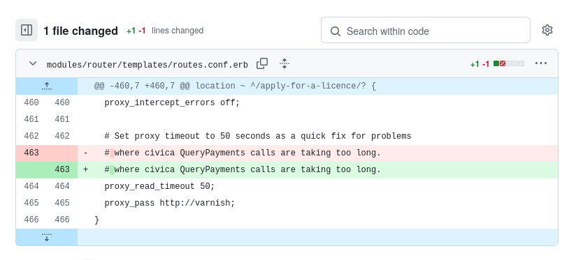
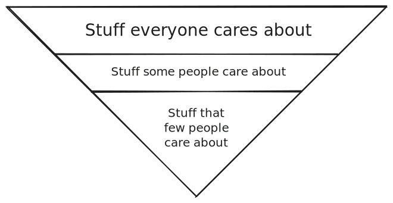

Six years ago, David Thompson wrote a popular blog post called ["My favourite Git commit"](https://dhwthompson.com/2019/my-favourite-git-commit) celebrating a whimsically detailed commit message his co-worker wrote. I enjoyed the post at the time and have sent it to several teammates as a model for good commit messages.

I recently revisited Thompson's article as I was creating my own guide to [writing useful commit messages](https://refactoringenglish.com/chapters/commit-messages/). When pressed to explain what made Thompson's post such an effective example, I was surprised to find that I couldn't. It was fun to read as an outside observer, but I couldn't justify it as a model of good software engineering.

## Thompson's favorite commit

Here's the [commit message](https://github.com/alphagov/govuk-puppet/commit/63b36f93bf75a848e2125008aa1e880c5861cf46) that so enamored Thompson and others at the time, including me:

> ### Convert template to US-ASCII to fix error
>
> I introduced some tests in a feature branch to match the contents of
> `/etc/nginx/router_routes.conf`. They worked fine when run with `bundle exec
rake spec` or `bundle exec rspec modules/router/spec`. But when run as
> `bundle exec rake` each should block failed with:
>
> ```text
> ArgumentError:
>  invalid byte sequence in US-ASCII
> ```
>
> I eventually found that removing the `.with_content(//)` matchers made the
> errors go away. That there weren't any weird characters in the spec file. And
> that it could be reproduced by requiring Puppet in the same interpreter with:
>
> ```bash
> rake -E 'require "puppet"' spec
> ```
>
> That particular template appears to be the only file in our codebase with an
> identified encoding of `utf-8`. All others are `us-ascii`:
>
> ```bash
> dcarley-MBA:puppet dcarley$ find modules -type f -exec file --mime {} \+ | grep utf
> modules/router/templates/routes.conf.erb:  text/plain; charset=utf-8
> ```
>
> Attempting to convert that file back to US-ASCII identified the offending
> character as something that looked like a whitespace:
>
> ```bash
> dcarley-MBA:puppet dcarley$ iconv -f UTF8 -t US-ASCII modules/router/templates/routes.conf.erb 2>&1 | tail -n5
>   proxy_intercept_errors off;
>
>   # Set proxy timeout to 50 seconds as a quick fix for problems
>   #
> iconv: modules/router/templates/routes.conf.erb:458:3: cannot convert
> ```
>
> After replacing it (by hand) the file identifies as `us-ascii` again:
>
> ```bash
> dcarley-MBA:puppet dcarley$ file --mime modules/router/templates/routes.conf.erb
> modules/router/templates/routes.conf.erb: text/plain; charset=us-ascii
> ```
>
> Now the tests work! One hour of my life I won't get back..

The "punchline" is that, after this lengthy preamble, Thompson shows the actual diff:

{{}}

Yes, the commit message contains six paragraphs and five code snippets, all to describe a one-character whitespace change.

## Favorite != best

It's easy to see what's appealing about this commit.

Most developers would document this change as simply "Fix whitespace character," so it's a pleasant surprise that someone went to such lengths to explain their process for investigating and fixing the bug.

It is a good commit message for all the reasons Thompson offers: it creates a searchable artifact and shares helpful insights about the developer's tools and process.

This is not an attack on Thompson or even the original author of the commit. Thompson never claimed it was the "best" commit message, just his favorite.

That said, I now see flaws that prevent me from using it as a model commit message.

### It buries the most important information at the end

When Thompson originally published his blog post, one of the most common critiques was that the commit message was too verbose. I found that criticism misguided.

Thorough details in a commit message are useful as long as they're relevant, and Thompson's were. They'd help less experienced teammates learn the author's debugging process and toolset. They'd also give more experienced teammates an opportunity to see if the developer overlooked something or is unaware of a relevant tool.

The reason people perceived Thompson's example as overly verbose is that it buries the most important information deep into the commit message.

Re-read the first paragraph:

> I introduced some tests in a feature branch to match the contents of
> `/etc/nginx/router_routes.conf`. They worked fine when run with `bundle exec
rake spec` or `bundle exec rspec modules/router/spec`. But when run as
> `bundle exec rake` each should block failed with:
>
> ```text
> ArgumentError:
>  invalid byte sequence in US-ASCII
> ```

Three sentences and a code snippet into this commit message, and the reader still doesn't have any information about what the change actually does.

Commit messages should [present the most important information first](https://refactoringenglish.com/chapters/commit-messages/#put-the-most-important-information-first) and gradually transition to finer details. Journalists call this the inverted pyramid style of writing.

<div style="max-width: 550px; margin-left: auto; margin-right: auto">

<figure>



<figcaption><p>Journalists structure news reports in an inverted pyramid, where the information relevant to the most people is at the top.</p></figcaption>

</figure>

</div>

If I'm scrolling through a commit history, I want to find out quickly if each commit is relevant. The commit message should provide a high-level summary of the change right from the start.

### It never quite explains the problem

By the end of Thompson's example commit message, do you even understand the change?

Here's the closest it comes to explaining the problem:

> That particular template appears to be the only file in our codebase with an identified encoding of utf-8. All others are us-ascii:
>
> ```bash
> dcarley-MBA:puppet dcarley$ find modules -type f -exec file --mime {} \+ | grep utf
> modules/router/templates/routes.conf.erb:  text/plain; charset=utf-8
> ```

The message says that `routes.conf.erb` has UTF-8 encoding, but it never explains why. Fortunately, the project is open-source, so I can investigate myself.

The issue is on [line 463](https://github.com/alphagov/govuk-puppet/blob/bfe3f647cc158e04ab6c80bee035d2e832582786/modules/router/templates/routes.conf.erb#L463) of `routes.conf.erb`:

```bash
$ cat modules/router/templates/routes.conf.erb | head -n 463 | tail -n 1
  # where civica QueryPayments calls are taking too long.
```

You can't see the issue with a regular text editor or web browser, but if you dump the raw file bytes with a tool like `xxd`, you see the issue:

```bash
$ cat modules/router/templates/routes.conf.erb \
  | head -n 463 | tail -n 1 \
  | xxd | head -n 1
00000000: 2020 23c2 a077 6865 7265 2063 6976 6963    #..where civic
                 ^^ ^^
```

If you haven't memorized the US-ASCII and UTF-8 tables, here are the first few characters of that line:

| Byte representation | Text representation                                                           |
| ------------------- | ----------------------------------------------------------------------------- |
| `0x20`              | `' '` (space)                                                                 |
| `0x20`              | `' '` (space)                                                                 |
| `0x23`              | `'#'`                                                                         |
| `0xc2` `0xa0`       | `' '` ([UTF-8 non-breaking space](https://www.compart.com/en/unicode/U+00A0)) |

So, the file had the byte sequence `0xC2 0xA0`, which means it can't be a US-ASCII file, as `0xC2` and `0xA0` both fall outside of [the US-ASCII byte range](https://www.columbia.edu/kermit/ascii.html).

The `0xC2 0xA0` sequence means any application that consumes `routes.conf.erb` must interpret it with UTF-8 encoding, a newer and more internationally-friendly scheme for encoding text.

Thompson's codebase used [Ruby 1.9.3](https://github.com/alphagov/govuk-puppet/blob/63b36f93bf75a848e2125008aa1e880c5861cf46/.ruby-version), which [supported UTF-8 encoding](http://graysoftinc.com/character-encodings/ruby-19s-three-default-encodings), but it defaulted to US-ASCII if the file didn't explicitly declare otherwise.

Digging through the source history, I found that [commit 5a8607](https://github.com/alphagov/govuk-puppet/commit/5a86076bd73f0e92558d49a15f4e828860886eca) originally introduced the UTF-8 character. That commit message doesn't mention any reason for introducing the UTF-8 character, so it was likely an accident.

A Hacker News commenter [floated a plausible theory](https://news.ycombinator.com/item?id=21290159) about why that stray UTF-8 character appeared in `routes.conf.erb`:

> _the likely origin of the invalid character is somebody using an Apple Ireland/UK keyboard layout where # is Option-3 (AltGr-3), and non-breaking space is Option-Space (AltGr-Space)._
>
> -[messe](https://news.ycombinator.com/item?id=21290159) on Hacker News

### It references code without linking to it

Thompson's example commit opens with a reference to some external code:

> I introduced some tests in a feature branch to match the contents of
> `/etc/nginx/router_routes.conf`. They worked fine when run with `bundle exec
rake spec` or `bundle exec rspec modules/router/spec`.

But the commit message never names the branch or specifies a commit hash, so the reader has no way to reproduce the developer's findings.

Later, the commit message says:

> I eventually found that removing the `.with_content(//)` matchers made the errors go away. I didn't see any weird characters in the spec file.

Without a commit hash or link, the reader doesn't know what matchers or which spec file the developer means.

If a commit message references external code, it should [link to it explicitly](https://refactoringenglish.com/chapters/commit-messages/#cross-references-to-issues-or-other-changes) so that code reviewers and future maintainers can see the exact context for the change.

## My rewrite

Here's my proposed revision of Thompson's favorite git commit:

<!-- markdownlint-disable no-empty-links -->

> ### Convert routes.conf.erb template to US-ASCII
>
> `routes.conf.erb` has a stray UTF-8 character that seems to have been introduced by accident in [5a8607](https://github.com/alphagov/govuk-puppet/commit/5a86076bd73f0e92558d49a15f4e828860886eca).
>
> `rake` expect US-ASCII format, so the single UTF-8 character in `routes.conf.erb` causes test failures in `rake`.
>
> This change replaces the UTF-8 character with an equivalent US-ASCII character to prevent test failures in `rake`.
>
> #### The stray UTF-8 character
>
> The issue is on line 463 of `modules/router/templates/routes.conf.erb`:
>
> ```bash
> $ cat modules/router/templates/routes.conf.erb \
>   | head -n 463 | tail -n 1 \
>   | xxd | head -n 1
> 00000000: 2020 23c2 a077 6865 7265 2063 6976 6963    #..where civic
>                  ^^ ^^
> ```
>
> `0xC2 0xA0` is not a valid US-ASCII byte sequence, but it's the [UTF-8 non-breaking space character](https://www.compart.com/en/unicode/U+00A0). Any tool that reads the file expecting US-ASCII encoding will fail.
>
> #### How I discovered this
>
> I introduced some tests in a feature branch to match the contents of `/etc/nginx/router_routes.conf` (see [abcd123](#)). They worked fine when I ran them with `bundle exec rake spec` or `bundle exec rspec modules/router/spec`, but when I ran the tests as `bundle exec rake`, each `should` block failed with:
>
> ```text
> ArgumentError:
>  invalid byte sequence in US-ASCII
> ```
>
> I eventually found that removing the `.with_content(//)` matchers made the errors go away. I didn't see any weird characters in the spec file. I could reproduce the error by requiring Puppet in the same interpreter with:
>
> ```bash
> rake -E 'require "puppet"' spec
> ```
>
> That particular template appears to be the only file in our codebase that `file` identifies as `utf-8`. All others are `us-ascii`:
>
> ```bash
> $ find modules -type f -exec file --mime {} \+ | grep utf
> modules/router/templates/routes.conf.erb:  text/plain; charset=utf-8
> ```
>
> Attempting to convert that file back to US-ASCII identified the offending character as something that looked like a whitespace:
>
> ```bash
> $ iconv -f UTF8 -t US-ASCII modules/router/templates/routes.conf.erb 2>&1 \
>    | tail -n5
>
>   proxy_intercept_errors off;
>
>   # Set proxy timeout to 50 seconds as a quick fix for problems
>   #
> iconv: modules/router/templates/routes.conf.erb:458:3: cannot convert
>
> ```
>
> After I replaced the UTF-8 character (by hand), `file` identifies `routes.conf.erb` as `us-ascii` again:
>
> ```bash
> $ file --mime modules/router/templates/routes.conf.erb
> modules/router/templates/routes.conf.erb: text/plain; charset=us-ascii
> ```
>
> Now the tests work! One hour of my life I won't get back..

Here were my changes:

- I added a high-level summary early in the message.
- I added a more explicit explanation of the UTF-8 character and where it came from.
- I moved most of the author's original content to a "How I found this" section to make it clear that it's [extra-credit reading](https://refactoringenglish.com/chapters/commit-messages/#rants-and-stories).
- I made light grammatical fixes.
- I [removed passive voice](https://refactoringenglish.com/chapters/passive-voice-considered-harmful/) to reduce ambiguity.
- I simplified the terminal prompt from `dcarley-MBA:puppet dcarley $` to just `$`, as the former is mostly noise.

Notably, I didn't remove details, as the problem wasn't verbosity but how the developer organized and presented information.

## The value of defining your own principles

Revisiting Thompson's post reminded me how much value there is in defining software engineering principles for yourself.

I accepted the commit as a good example because I agreed with Thompson about its strengths. It wasn't until I sat down and defined what I think are the most important qualities in a commit message that I saw the shortcomings of Thompson's example.

I've explained my perspective about several different software engineering practices over the years, and every time I do it, it makes me a better developer. It forces me to think critically about ideas I take for granted and helps me remember what my ideal looks like even if I'm not always able to achieve it.

- [Reviewing code for teammates](/human-code-reviews-1/)
- [Sending out my code for review](/code-review-love/)
- [Writing unit tests](/good-developers-bad-tests/)
- [Communicating with freelance software developers](/freelancer-guidelines/)
- [Writing software tutorials](https://refactoringenglish.com/chapters/rules-for-software-tutorials/)

## Further reading

- ["How to Write Useful Commit Messages"](https://refactoringenglish.com/chapters/commit-messages/) - My more detailed explanation of what I think makes a good commit message.

---

_Excerpts from the govuk-puppet project are Copyright Crown Government Digital Service, used under the [MIT License](https://github.com/alphagov/govuk-puppet/blob/main/LICENCE.md)._
