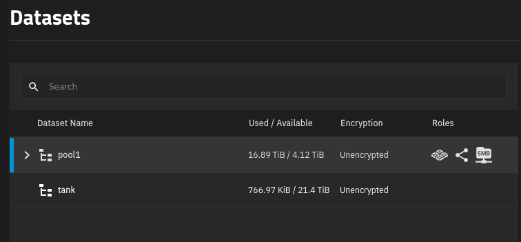
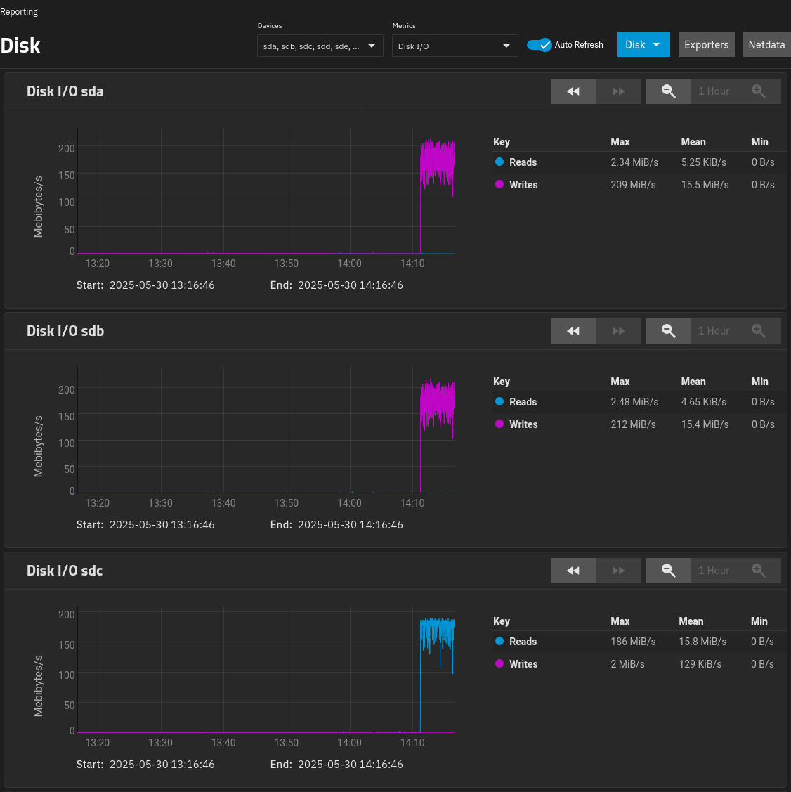

My home TrueNAS server is now three years old, and I've reached 80% of its capacity. I'm using about 19 TB of data.

I set up the server with four 8 TB drives set up as RAIDZ1, meaning that it can tolerate a single drive failure.

When I built the server, I was betting on ZFS adding support for expanding pools by adding disks, which they did (TODO: link). The problem is that if I add drives, I'm increasing the risk of a pool failure. With only four disks, I feel like the odds are low of two disks failing at the same time. But if I expand to six or more disks, I worry a bit more.

So, I'd like to convert my ZFS pool from RAIDZ1 to RAIDZ2, which means that it can tolerate two disk failures without data loss.

But I had 18 TB of data. To match that on RAIDZ2, I'd need one more 8 TB drive, as 5 x 8 TB on a RAIDZ2 pool would give me 24 TB of usable storage.

So, I just buy one more disk, right? Unfortunately, ZFS doesn't support switching from RAIDZ1 to RAIDZ2. The RAIDZ mode is something you have to decide at pool creation time.

The process I see recommended for converting a pool from RAIDZ1 to RAIDZ2 is to move all of your data to a temporary location, destroy your pool, create a new pool as RAIDZ2, then restore all your data.

The problem is that I don't have an extra 19 TB of spare storage lying around. The naive solution would be to buy five extra disks, build a RAIDZ2 pool, then move all of my data over to the new pool. But I'd end up with nine disks when I only wanted five.

I already have data backups, but they're at the filesystem level not at the ZFS level. In other words, if I blew everything away, I'd have to recreate each of my ZFS datasets.

After considering a few different options, I managed to migrate all of my data by only buying three extra disks.

## The strategy

1. Buy three new 8 TB disks.
1. Offline one disk from my old RAIDZ1 pool.
1. Create a RAIDZ2 pool using my three new disks, one disk from my RAIDZ1 pool, and one fake disk
   - The new pool has 24 TB of capacity.
1. Offline the fake disk from the RAIDZ2 pool.
   - The new pool can tolerate this as it's equivalent to just one disk failure.
1. Migrate a snapshot of the old pool to the new pool.
1. Destroy the old pool.
1. Use one disk from the old RAIDZ1 pool to replace the fake disk in the RAIDZ2 pool.
1. Add the remaining two disks from the old RAIDZ1 pool to the new RAIDZ2 pool

Sidenote: I'm saying these are "pools" although they're technically vdevs within the pool. My pool consists of only a single vdev.

## Make backups

## Identifying the disks

To start, I need to identify which disks

```bash
fdisk --list
```

I find it easier to visit the Storage > Disks dashboard in TrueNAS:

{{}}

So, for this experiment, I want to use the disks like the following:

- Existing disks: `sda`, `sdc`, `sde`, `sdf`
- New disks: `sdb`, `sdg`, `sdh`

## Find the weakest disk

```bash
for drive in /dev/sd?; do
  [ -e "$drive" ] && echo -e "\n=== $drive ===" && smartctl -A $drive | grep -E '(Power_On_Hours|Wear_Leveling|Media_Wearout|Reallocated_Sector)'
done
```

```text
=== /dev/sda ===
  5 Reallocated_Sector_Ct   0x0033   100   100   050    Pre-fail  Always       -       0
  9 Power_On_Hours          0x0032   032   032   000    Old_age   Always       -       27228

=== /dev/sdb ===
  5 Reallocated_Sector_Ct   0x0033   100   100   005    Pre-fail  Always       -       0
  9 Power_On_Hours          0x0012   100   100   000    Old_age   Always       -       423

=== /dev/sdc ===
  5 Reallocated_Sector_Ct   0x0033   100   100   010    Pre-fail  Always       -       0
  9 Power_On_Hours          0x0032   077   077   000    Old_age   Always       -       20998

=== /dev/sdd ===
  9 Power_On_Hours          0x0032   100   100   000    Old_age   Always       -       29606

=== /dev/sde ===
  5 Reallocated_Sector_Ct   0x0033   100   100   010    Pre-fail  Always       -       0
  9 Power_On_Hours          0x0032   067   067   000    Old_age   Always       -       29599

=== /dev/sdf ===
  5 Reallocated_Sector_Ct   0x0033   100   100   010    Pre-fail  Always       -       0
  9 Power_On_Hours          0x0032   067   067   000    Old_age   Always       -       29603

=== /dev/sdg ===
  5 Reallocated_Sector_Ct   0x0033   100   100   005    Pre-fail  Always       -       0
  9 Power_On_Hours          0x0012   100   100   000    Old_age   Always       -       141

=== /dev/sdh ===
  5 Reallocated_Sector_Ct   0x0033   100   100   005    Pre-fail  Always       -       0
  9 Power_On_Hours          0x0012   100   100   000    Old_age   Always       -       147
```

- `sda`: 032
- `sdc`: 077
- `sde`: 067
- `sdf`: 067

They all seem healthy, but sda's value of 32 is closest to zero, so that's the disk I'll move.

## ID the disk

You're not supposed to create the disks by the `/dev/sdX` path, as that can change across reboots, so I wrote this bash snippet to convert the `/dev/sdX` path to the disk's stable identifier, which will persists across boots:

```bash
get_disk_id() {
    local dev=$1
    local target="/dev/$dev"

    for path in /dev/disk/by-id/*; do
        if [ -L "$path" ] && [ "$(readlink -f "$path")" = "$target" ] &&
           ([[ "${path: -2:1}" == ":" ]] || [[ "${path: -2:1}" != ":" ]]); then
            echo "$path"
            return 0
        fi
    done
    echo "Disk ID not found for device: $dev" >&2
    return 1
}

```

```bash
# Old disks
DISK_1="$(get_disk_id sda)"
DISK_2="$(get_disk_id sdc)"
DISK_3="$(get_disk_id sde)"
DISK_4="$(get_disk_id sdf)"
```

```bash
OLDPOOL='pool1'
```

```bash
# New disks
DISK_5="$(get_disk_id sdb)"
DISK_6="$(get_disk_id sdg)"
DISK_7="$(get_disk_id sdh)"
```

`DISK_1` is the weakest, so I run the following:

```bash
MOVED_DISK="${DISK_1}"
```

```bash
$ sudo zpool status ${OLDPOOL}
  pool: pool1
 state: ONLINE
  scan: scrub repaired 68K in 10:40:08 with 0 errors on Wed May 14 06:25:26 2025
config:

        NAME        STATE     READ WRITE CKSUM
        pool1       ONLINE       0     0     0
          raidz1-0  ONLINE       0     0     0
            sde2    ONLINE       0     0     0
            sdf2    ONLINE       0     0     0
            sdc2    ONLINE       0     0     0
            sda2    ONLINE       0     0     0

errors: No known data errors
```

```bash
$ sudo zpool offline "${OLDPOOL}" sda2
```

```bash
$ sudo zpool status ${OLDPOOL}
  pool: pool1
 state: DEGRADED
status: One or more devices has been taken offline by the administrator.
        Sufficient replicas exist for the pool to continue functioning in a
        degraded state.
action: Online the device using 'zpool online' or replace the device with
        'zpool replace'.
  scan: scrub repaired 68K in 10:40:08 with 0 errors on Wed May 14 06:25:26 2025
config:

        NAME        STATE     READ WRITE CKSUM
        pool1       DEGRADED     0     0     0
          raidz1-0  DEGRADED     0     0     0
            sde2    ONLINE       0     0     0
            sdf2    ONLINE       0     0     0
            sdc2    ONLINE       0     0     0
            sda2    OFFLINE      0     0     0

errors: No known data errors
```

## Move the old disk

```bash
wipefs --all "${MOVED_DISK}"
```

Find the bytes of the disks:

```bash
$  fdisk --list | grep "^Disk.*bytes"
Disk /dev/sdf: 7.28 TiB, 8001563222016 bytes, 15628053168 sectors
Disk /dev/sdd: 111.79 GiB, 120034123776 bytes, 234441648 sectors
Disk /dev/sda: 7.28 TiB, 8001563222016 bytes, 15628053168 sectors
Disk /dev/sdc: 7.28 TiB, 8001563222016 bytes, 15628053168 sectors
Disk /dev/sde: 7.28 TiB, 8001563222016 bytes, 15628053168 sectors
Disk /dev/sdb: 7.28 TiB, 8001563222016 bytes, 15628053168 sectors
Disk /dev/mapper/sdd3: 16 GiB, 17179869184 bytes, 33554432 sectors
Disk /dev/zd0: 10 GiB, 10737418240 bytes, 20971520 sectors
Disk /dev/sdg: 7.28 TiB, 8001563222016 bytes, 15628053168 sectors
Disk /dev/sdh: 7.28 TiB, 8001563222016 bytes, 15628053168 sectors
```

Create a fake drive:

```bash
FAKE_DISK='/tmp/fake-drive.img'
truncate --size 8001563222016 "${FAKE_DISK}"
```

```bash
NEWPOOL='tank'
```

```bash
zpool create \
  -f \
  ${NEWPOOL} \
  raidz2 \
  -m "/mnt/${NEWPOOL}" \
  "${DISK_5}" \
  "${DISK_6}" \
  "${DISK_7}" \
  "${MOVED_DISK}" \
  "${FAKE_DISK}"
```

{{}}

```bash
$ zpool status "${NEWPOOL}"
  pool: tank
 state: ONLINE
config:

        NAME                                   STATE     READ WRITE CKSUM
        tank                                   ONLINE       0     0     0
          raidz2-0                             ONLINE       0     0     0
            ata-HGST_HUS728T8TALE6L1_VGGGYUEG  ONLINE       0     0     0
            ata-HGST_HUS728T8TALE6L1_VRGMRVJK  ONLINE       0     0     0
            ata-HGST_HUS728T8TALE6L1_VRGNZU9K  ONLINE       0     0     0
            ata-TOSHIBA_HDWG480_71R0A14YFR0H   ONLINE       0     0     0
            /tmp/fake-drive.img                ONLINE       0     0     0

errors: No known data errors
```

```bash
$ zpool list "${NEWPOOL}"
NAME   SIZE  ALLOC   FREE  CKPOINT  EXPANDSZ   FRAG    CAP  DEDUP    HEALTH  ALTROOT
tank  36.4T  1.27M  36.4T        -         -     0%     0%  1.00x    ONLINE  -
```

Remove the fake disk:

```bash
zpool offline "${NEWPOOL}" "${FAKE_DISK}" && \
  rm "${FAKE_DISK}"
```

Check the status:

```bash
$ zpool status "${NEWPOOL}"
  pool: tank
 state: DEGRADED
status: One or more devices has been taken offline by the administrator.
        Sufficient replicas exist for the pool to continue functioning in a
        degraded state.
action: Online the device using 'zpool online' or replace the device with
        'zpool replace'.
config:

        NAME                                   STATE     READ WRITE CKSUM
        tank                                   DEGRADED     0     0     0
          raidz2-0                             DEGRADED     0     0     0
            ata-HGST_HUS728T8TALE6L1_VGGGYUEG  ONLINE       0     0     0
            ata-HGST_HUS728T8TALE6L1_VRGMRVJK  ONLINE       0     0     0
            ata-HGST_HUS728T8TALE6L1_VRGNZU9K  ONLINE       0     0     0
            ata-TOSHIBA_HDWG480_71R0A14YFR0H   ONLINE       0     0     0
            /tmp/fake-drive.img                OFFLINE      0     0     0

errors: No known data errors
```

```bash
$ zpool list "${NEWPOOL}"
NAME   SIZE  ALLOC   FREE  CKPOINT  EXPANDSZ   FRAG    CAP  DEDUP    HEALTH  ALTROOT
tank  36.4T  1.41M  36.4T        -         -     0%     0%  1.00x  DEGRADED  -
```

## Transfer the data

```bash
SNAPSHOT_NAME="fullpool_$(date +%Y%m%d)"
zfs snapshot -r "${OLDPOOL}@${SNAPSHOT_NAME}" && \
  zfs send -w -R "${OLDPOOL}@${SNAPSHOT_NAME}" \
    | zfs receive -F "${NEWPOOL}"
```

Very long wait with no progress.

{{}}

Update the mount point so they won't conflict:

```bash
zfs set mountpoint="/mnt/${OLDPOOL}-old" "${OLDPOOL}" && \
  zfs set mountpoint="/mnt/${NEWPOOL}" "${NEWPOOL}"
```

```bash
$ echo 'This is a new file' > /mnt/testpool2/dataset123/testfile2.txt
$ cat /mnt/testpool2/dataset123/testfile2.txt
This is a new file
```

It doesn't affect the old pool:

```bash
$ ls /mnt/testpool1-old/dataset123/
testfile.txt
```

## Absorb the old disks

```bash
zpool destroy "${OLDPOOL}"
```

## Replace the fake disk

```bash
zpool replace "${NEWPOOL}" /tmp/fake-drive.img "${DISK_2}"
```

```bash
zpool status "${NEWPOOL}"
  pool: testpool2
 state: ONLINE
  scan: resilvered 156K in 00:00:09 with 0 errors on Sun May 11 13:07:53 2025
config:

        NAME                                                                                                                                                      STATE     READ WRITE CKSUM
        testpool2                                                                                                                                                 ONLINE       0     0     0
          raidz2-0                                                                                                                                                ONLINE       0     0     0
            usb-SanDisk_Extreme_AA010110141601114860-0:0                                                                                                          ONLINE       0     0     0
            usb-USB_SanDisk_3.2Gen1_0101420f852a9d28e04c8e417cf3fab3690eb536b2ae07cf5bd65ad8a89596eebee2000000000000000000008a891c540010470081558107c62cd91d-0:0  ONLINE       0     0     0
            usb-USB_SanDisk_3.2Gen1_01010c7a5697abd4685016482e932af13a383daa1864476162b1f6f175ee6565383300000000000000000000a1b0161d0001470081558107c62cd903-0:0  ONLINE       0     0     0
            usb-Samsung_Flash_Drive_FIT_0371022030001364-0:0                                                                                                      ONLINE       0     0     0
            usb-Samsung_Flash_Drive_FIT_0373417030009828-0:0                                                                                                      ONLINE       0     0     0

errors: No known data errors
```

Reports `ONLINE` instead of `DEGRADED`.

## Add the extra disks

```bash
zpool attach "${NEWPOOL}" raidz2-0 "${DISK_3}"
```

```bash
$ zpool status "${NEWPOOL}" | grep --after-context=1 "expand:"
expand: expansion of raidz2-0 in progress since Sun May 11 13:13:06 2025
        563K / 588K copied at 14.8K/s, 95.75% done, 00:00:01 to go
```

Note that this is a bit buggy. It shows me above 100% progress:

```bash
$ zpool status "${NEWPOOL}" | grep --after-context=1 "expand:"
expand: expansion of raidz2-0 in progress since Sun May 11 13:13:06 2025
        924K / 768K copied at 8.47K/s, 120.25% done, (copy is slow, no estimated time)
```

You should eventually see this:

```bash
$ zpool status "${NEWPOOL}" | grep --after-context=1 "expand:"
expand: expanded raidz2-0 copied 944K in 00:02:17, on Sun May 11 13:15:23 2025
```

And then just repeat with the last disk:

```bash
zpool attach "${NEWPOOL}" raidz2-0 "${DISK_4}"
```

```bash
$ zpool status "${NEWPOOL}" | grep --after-context=1 "expand:"
expand: expanded raidz1-0 copied 562K in 00:01:57, on Wed Apr 30 03:30:02 2025
```

## Final state

```bash
$ zpool status "${NEWPOOL}"
  pool: testpool2
 state: ONLINE
  scan: scrub repaired 0B in 00:00:01 with 0 errors on Sun May 11 13:18:14 2025
expand: expanded raidz2-0 copied 743K in 00:02:03, on Sun May 11 13:18:13 2025
config:

        NAME                                                                                                                                                      STATE     READ WRITE CKSUM
        testpool2                                                                                                                                                 ONLINE       0     0     0
          raidz2-0                                                                                                                                                ONLINE       0     0     0
            usb-SanDisk_Extreme_AA010110141601114860-0:0                                                                                                          ONLINE       0     0     0
            usb-USB_SanDisk_3.2Gen1_0101420f852a9d28e04c8e417cf3fab3690eb536b2ae07cf5bd65ad8a89596eebee2000000000000000000008a891c540010470081558107c62cd91d-0:0  ONLINE       0     0     0
            usb-USB_SanDisk_3.2Gen1_01010c7a5697abd4685016482e932af13a383daa1864476162b1f6f175ee6565383300000000000000000000a1b0161d0001470081558107c62cd903-0:0  ONLINE       0     0     0
            usb-Samsung_Flash_Drive_FIT_0371022030001364-0:0                                                                                                      ONLINE       0     0     0
            usb-Samsung_Flash_Drive_FIT_0373417030009828-0:0                                                                                                      ONLINE       0     0     0
            usb-Samsung_Flash_Drive_FIT_0347017070021373-0:0                                                                                                      ONLINE       0     0     0
            usb-Samsung_Flash_Drive_FIT_0375022030006895-0:0                                                                                                      ONLINE       0     0     0

errors: No known data errors
```

```bash
$ zpool list "${NEWPOOL}"
NAME        SIZE  ALLOC   FREE  CKPOINT  EXPANDSZ   FRAG    CAP  DEDUP    HEALTH  ALTROOT
testpool2   102G   669K   102G        -         -     0%     0%  1.00x    ONLINE  -
```

## Appendix: Alternatives I considered

### Back up ZFS pool to Wasabi

The best option I found was to back up all my data to Wasabi. I have decently fast fiber Internet, so I can upload 19 TB to Wasabi in about 36 hours.

Wasabi charges $7/TB/month, so I'd pay $133 to back up my ZFS pool for a month. Except Wasabi charges by the day, so if I only kept the data on Wasabi for two days, I'd only have to pay 1/15th the monthly price, or about $9, which is pretty good.

And even though Wasabi doesn't support ZFS, but they support the S3 API, and AWS S3 command-line client supports piping from stdout. This means I could do something like this:

```bash
zfs send -R mypool@20250510 \
  | aws s3 cp - s3://s3.us-east-2.wasabisys.com/michaels-zfs-backup/20250510.zfs
```

Except that wouldn't work because the file would exceed S3's limit of 5 TB per file.

I found [the z3 utility](https://www.presslabs.com/docs/code/z3/how-to-use-z3/) to work around the file size limitation, but that feels like bringing in too much complexity to my backup workflow.

Worst of all, I wouldn't be able to test backup and restore before deleting all of my local data, so it felt too risky.

### Back up ZFS pool to rsync.net

rsync.net claims to be the only platform that natively supports ZFS backup. I was considering it, but they charge $10/TB/month, and it doesn't look like you can purchase fractions of a month. I had 19 TB, which would mean spending $190 to back up and restore my data over a few days.

### Back up to temporary large disks

Another possibility is buying a 20 TB disk and moving all my data there while I do the migration. But that costs about $300, and I risk total data loss if that disk fails mid-migration. I can mitigate it by buying two large disks, but then I've spent about $600.

I could theoretically just send the disks back for a refund after the migration, but that's not a very kind thing to do to the merchant
