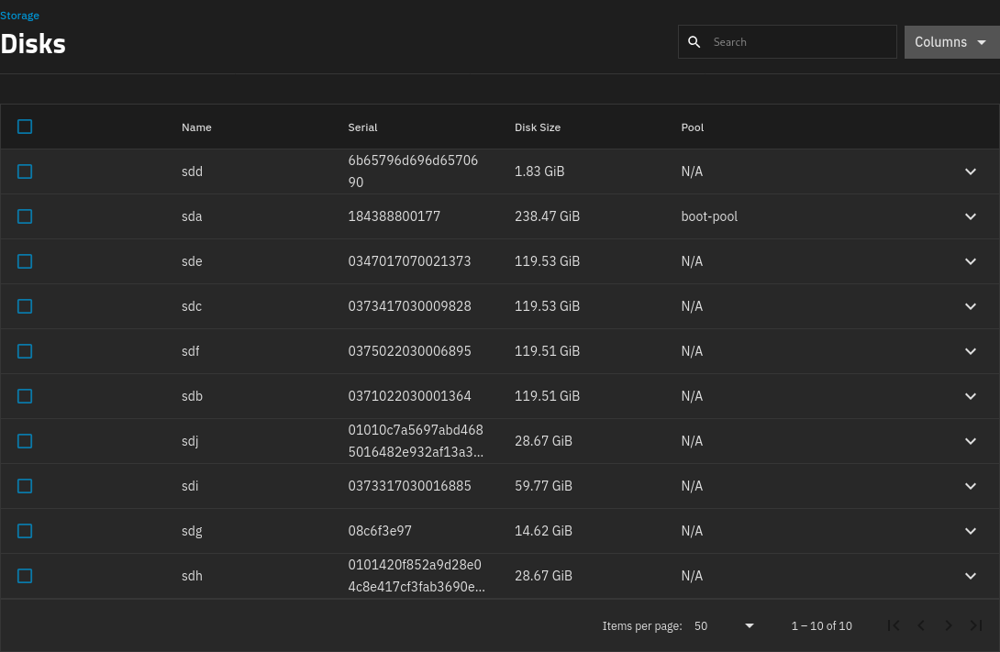
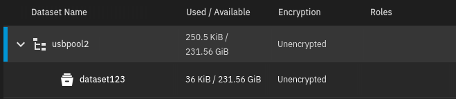

My home TrueNAS server is now three years old, and I've reached 80% of its capacity. I'm using about 19 TB of data.

I set up the server with four 8 TB drives set up as RAIDZ1, meaning that it can tolerate a single drive failure.

When I built the server, I was betting on ZFS adding support for expanding pools by adding disks, which they did (TODO: link). The problem is that if I add drives, I'm increasing the risk of a pool failure. With only four disks, I feel like the odds are low of two disks failing at the same time. But if I expand to six or more disks, I worry a bit more.

So, I'd like to convert my ZFS pool from RAIDZ1 to RAIDZ2, which means that it can tolerate two disk failures without data loss.

But I had 18 TB of data. To match that on RAIDZ2, I'd need one more 8 TB drive, as 5 x 8 TB on a RAIDZ2 pool would give me 24 TB of usable storage.

So, I just buy one more disk, right? Unfortunately, ZFS doesn't support switching from RAIDZ1 to RAIDZ2. The RAIDZ mode is something you have to decide at pool creation time.

The process I see recommended for converting a pool from RAIDZ1 to RAIDZ2 is to move all of your data to a temporary location, destroy your pool, create a new pool as RAIDZ2, then restore all your data.

The problem is that I don't have an extra 19 TB of spare storage lying around. The naive solution would be to buy five extra disks, build a RAIDZ2 pool, then move all of my data over to the new pool. But I'd end up with nine disks when I only wanted five.

I already have data backups, but they're at the filesystem level not at the ZFS level. In other words, if I blew everything away, I'd have to recreate each of my ZFS datasets.

After considering a few different options, I managed to migrate all of my data by only buying three extra disks.

1. Buy three new 8 TB disks.
1. Offline one disk from my old RAIDZ1 pool.
1. Create a RAIDZ2 pool using my three new disks, one disk from my RAIDZ1 pool, and one fake disk
   - The new pool has 24 TB of capacity.
1. Offline the fake disk from the RAIDZ2 pool.
   - The new pool can tolerate this as it's equivalent to just one disk failure.
1. Migrate each dataset from the old pool to the new pool.
1. Destroy the old pool.
1. Add the three disks from the old RAIDZ1 pool to the new RAIDZ2 pool

Sidenote: I'm saying these are "pools" although they're technically vdevs within the pool. My pool consists of only a single vdev.

## Make backups

## Identifying the disks

To start, I need to identify which disks

```bash
fdisk --list
```

I find it easier to visit the Storage > Disks dashboard in TrueNAS:

{{}}

So, for this experiment, I want to use the disks like the following:

- RAIDZ1 disks: `sdb`, `sdg`, `sdh`, `sdj`
- RAIDZ2 disks: `sdb`, `sdi`, `sde`, `sdf`

Note that sdb appears in both, as I'm going to move it from the RAIDZ1 pool to the RAIDZ2 pool.

You're not supposed to create the disks by the `/dev/sdX` path, as that can change across reboots, so I wrote this bash snippet to convert the `/dev/sdX` path to the disk's stable identifier, which will persists across boots:

```bash
get_disk_id() {
    local dev=$1
    local target="/dev/$dev"
    for path in /dev/disk/by-id/*; do
        # Check if it's a symlink, its target matches, and the penultimate char is ':'.
        if [ -L "$path" ] && [ "$(readlink -f "$path")" = "$target" ] && [[ "${path: -2:1}" == ":" ]]; then
            echo "$path"
            break
        fi
    done
}
```

```bash
DISK_1="$(get_disk_id sdb)"
DISK_2="$(get_disk_id sdg)"
DISK_3="$(get_disk_id sdh)"
DISK_4="$(get_disk_id sdj)"
```

```bash
OLDPOOL='testpool1'
```

```bash
# Uncomment the following lines, but be careful, as they'll erase disks with no
# further confirmation:

# wipefs --all "${DISK_1}"
# wipefs --all "${DISK_2}"
# wipefs --all "${DISK_3}"
# wipefs --all "${DISK_4}"
```

To start:

```bash
zpool create \
  -f \
  "${OLDPOOL}" \
  raidz1 \
  -m "/mnt/${OLDPOOL}" \
  "${DISK_1}" \
  "${DISK_2}" \
  "${DISK_3}" \
  "${DISK_4}"
```

```bash
$ zpool status "${OLDPOOL}"
  pool: testpool1
 state: ONLINE
config:

        NAME                                 STATE     READ WRITE CKSUM
        testpool1                            ONLINE       0     0     0
          raidz1-0                           ONLINE       0     0     0
            usb-Samsung_Flash_Drive_FIT_0:0  ONLINE       0     0     0
            usb-SanDisk_Extreme-0:0          ONLINE       0     0     0
            usb-USB_SanDisk_3.2Gen1-0:0      ONLINE       0     0     0
            usb-USB_SanDisk_3.2Gen1_-0:0     ONLINE       0     0     0

errors: No known data errors
```

Everything works!

## Create some data

```bash
DATASET_NAME='dataset123'
```

```bash
zfs create \
  "${OLDPOOL}/${DATASET_NAME}"
```

```bash
echo "This is a test file" > "/mnt/${OLDPOOL}/${DATASET_NAME}/testfile.txt"
```

```bash
$ cat "/mnt/${OLDPOOL}/${DATASET_NAME}/testfile.txt"
This is a test file
```

## Steal a disk from the old pool

Find the weakest disk:

```bash
for drive in /dev/sd?; do
  [ -e "$drive" ] && echo -e "\n=== $drive ===" && smartctl -A $drive | grep -E '(Power_On_Hours|Wear_Leveling|Media_Wearout|Reallocated_Sector)'
done
```

In my case, let's pretend `DISK_1` is the weakest, so I run the following:

```bash
MOVED_DISK="${DISK_1}"
```

```bash
sudo zpool offline "${OLDPOOL}" "${MOVED_DISK}"
```

```bash
$ zpool status "${OLDPOOL}"
  pool: testpool1
 state: DEGRADED
status: One or more devices has been taken offline by the administrator.
        Sufficient replicas exist for the pool to continue functioning in a
        degraded state.
action: Online the device using 'zpool online' or replace the device with
        'zpool replace'.
config:

        NAME                                 STATE     READ WRITE CKSUM
        testpool1                            DEGRADED     0     0     0
          raidz1-0                           DEGRADED     0     0     0
            usb-Samsung_Flash_Drive_FIT-0:0  OFFLINE      0     0     0
            usb-SanDisk_Extreme-0:0          ONLINE       0     0     0
            usb-USB_SanDisk_3.2Gen1-0:0      ONLINE       0     0     0
            usb-USB_SanDisk_3.2Gen1-0:0      ONLINE       0     0     0

errors: No known data errors
```

## Snapshot old pool

```bash
SNAPSHOT_NAME="fullpool_$(date +%Y%m%d)"

zfs snapshot -r "${OLDPOOL}@${SNAPSHOT_NAME}"
```

## Move the old disk

```bash
wipefs --all "${MOVED_DISK}"
```

```bash
DISK_5="$(get_disk_id sdi)"
DISK_6="$(get_disk_id sde)"
DISK_7="$(get_disk_id sdf)"
```

Create a fake drive:

```bash
FAKE_DISK='/tmp/fake-drive.img'
truncate --size 128GB "${FAKE_DISK}"
```

```bash
NEWPOOL='testpool2'
```

```bash
zpool create \
  -f \
  ${NEWPOOL} \
  raidz2 \
  -m "/mnt/${NEWPOOL}" \
  "${DISK_5}" \
  "${DISK_6}" \
  "${DISK_7}" \
  "${MOVED_DISK}" \
  "${FAKE_DISK}"
```

```bash
$ zpool status "${NEWPOOL}"
  pool: testpool2
 state: ONLINE
config:

        NAME                                 STATE     READ WRITE CKSUM
        testpool2                            ONLINE       0     0     0
          raidz2-0                           ONLINE       0     0     0
            usb-Samsung_Flash_Drive_FIT-0:0  ONLINE       0     0     0
            usb-Samsung_Flash_Drive_FIT-0:0  ONLINE       0     0     0
            usb-Samsung_Flash_Drive_FIT-0:0  ONLINE       0     0     0
            usb-Samsung_Flash_Drive_FIT-0:0  ONLINE       0     0     0
            /tmp/fake-drive.img              ONLINE       0     0     0

errors: No known data errors
```

```bash
$ zpool list "${NEWPOOL}"
NAME        SIZE  ALLOC   FREE  CKPOINT  EXPANDSZ   FRAG    CAP  DEDUP    HEALTH  ALTROOT
testpool2   596G   322K   596G        -         -     0%     0%  1.00x    ONLINE  -
```

Remove the fake disk:

```bash
zpool offline testpool2 "${FAKE_DISK}" && \
  rm "${FAKE_DISK}"
```

Check the status:

```bash
$ zpool status "${NEWPOOL}"
  pool: testpool2
 state: DEGRADED
status: One or more devices has been taken offline by the administrator.
        Sufficient replicas exist for the pool to continue functioning in a
        degraded state.
action: Online the device using 'zpool online' or replace the device with
        'zpool replace'.
config:

        NAME                                 STATE     READ WRITE CKSUM
        testpool2                            DEGRADED     0     0     0
          raidz2-0                           DEGRADED     0     0     0
            usb-Samsung_Flash_Drive_FIT-0:0  ONLINE       0     0     0
            usb-Samsung_Flash_Drive_FIT-0:0  ONLINE       0     0     0
            usb-Samsung_Flash_Drive_FIT-0:0  ONLINE       0     0     0
            usb-Samsung_Flash_Drive_FIT-0:0  ONLINE       0     0     0
            /tmp/fake-drive.img              OFFLINE      0     0     0

errors: No known data errors
```

```bash
$ zpool list "${NEWPOOL}"
NAME        SIZE  ALLOC   FREE  CKPOINT  EXPANDSZ   FRAG    CAP  DEDUP    HEALTH  ALTROOT
testpool2   596G   322K   596G        -         -     0%     0%  1.00x  DEGRADED  -
```

## Transfer the data

```bash
zfs send -R "${OLDPOOL}@${SNAPSHOT_NAME}" \
    | zfs receive -F "${NEWPOOL}"
```

Update the mount point so they won't conflict:

```bash
zfs set mountpoint="/mnt/${OLDPOOL}-old" "${OLDPOOL}"
zfs set mountpoint="/mnt/${NEWPOOL}" "${NEWPOOL}"
```

```bash
$ echo 'This is a new file' > /mnt/testpool2/dataset123/testfile2.txt
$ cat /mnt/testpool2/dataset123/testfile2.txt
This is a new file
$ ls /mnt/testpool1-old/dataset123/
testfile.txt
```

## Absorb the old disks

```bash
zpool destroy "${OLDPOOL}"
```

```bash
zpool attach "${NEWPOOL}" raidz2-0 "${DISK_2}"
```

```bash
$ zpool status testpool2 | grep "expand:"
expand: expanded raidz1-0 copied 648K in 00:00:03, on Wed Apr 30 03:27:03 2025
```

```bash
zpool attach testpool2 raidz1-0 "${DISK_3}"
```

```bash
$ zpool status testpool2 | grep "expand:"
expand: expanded raidz1-0 copied 562K in 00:01:57, on Wed Apr 30 03:30:02 2025
```

```bash
zpool attach testpool2 raidz1-0 "${DISK_4}"
```

```bash
$ zpool status testpool2 | grep "expand:"
expand: expanded raidz1-0 copied 562K in 00:01:57, on Wed Apr 30 03:30:02 2025
```

{{}}

## Appendix: Alternatives I considered

### Back up ZFS pool to Wasabi

The best option I found was to back up all my data to Wasabi. I have 2 Gbps fiber Internet, so I could theoretically upload 18.5 GB in 2.5 hours.

Wasabi charges $7/TB/month, so I'd pay $129.50 to back up my ZFS pool for a month. Except Wasabi charges by the day, so if I only kept the data on Wasabi for two days, I'd only have to pay 1/15th the monthly price, or about $9, which is pretty good.

And even though Wasabi doesn't support ZFS, but they support the S3 API, and AWS S3 command-line client supports piping from stdout. This means I could do something like this:

```bash
zfs send -R mypool@20250510 \
  | aws s3 cp - s3://s3.us-east-2.wasabisys.com/michaels-zfs-backup/20250510.zfs
```

Except that probably wouldn't work because the file would exceed S3's limit of 5 TB per file. And I found [the z3 utility](https://www.presslabs.com/docs/code/z3/how-to-use-z3/) to work around the file size limitation, but that feels like bringing in too much complexity to my backup workflow.

Worst of all, I wouldn't be able to test backup and restore before deleting all of my local data, so it felt too risky.

### Back up ZFS pool to rsync.net

rsync.net claims to be the only platform that natively supports ZFS backup. I was considering it, but they charge $10/TB/month, and it doesn't look like you can purchase fractions of a month. I had 18.5 TB, which would mean spending $185 to back up and restore my data over a few days.

### Back up to temporary large disks

Another possibility is buying a 20 TB disk and moving all my data there while I do the migration. But that costs about $300, and I risk total data loss if that disk fails mid-migration. I can mitigate it by buying two large disks, but then I've spent about $600.

I could theoretically just send the disks back for a refund after the migration, but that's not a very kind thing to do to the merchant
