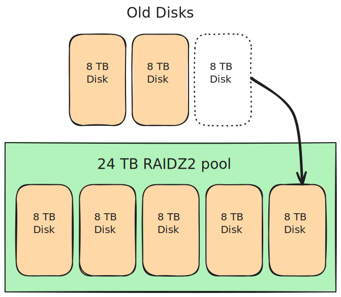

<style>
p img {
  display: block;
  margin-left: auto;
  margin-right: auto;
}
</style>

I recently upgraded my home TrueNAS server and migrated 18 TB of data from a 4-disk RAIDZ1 ZFS pool to a new RAIDZ2 pool, and I did it with only three additional 8 TB disks.

The neat part is that I never transferred my data to external storage. That's tricky because:

1. You can't convert a RAIDZ1 pool to a RAIDZ2 pool in place.
1. You can't shrink a ZFS pool to a smaller number of disks.
1. You can't fit 18 TB of data on a 3-disk, 8TB RAIDZ2 pool (the three new disks).

## How I did it

### Step 0: Initial state

Starting out, I have a 4x8TB RAIDZ1 ZFS pool, and I'm using 18 TB of its 23 TB capacity. I purchased three refubrbished 8 TB disks that I have available for this migration.


### Step 1: Borrow one disk to create a RAIDZ2 pool

To begin, I remove one disk from my original RAIDZ1 pool, leaving it in a degraded state.

I then create a new 5x8TB RAIDZ2 pool using:

1.  My three new disks
1.  One disk from my RAIDZ1 pool
1.  One 8 TB sparse file to act as a fake disk

The sparse file is in my `/tmp` directory, even though the filesystem there can't actually store 8 TB of data. That's okay because the sparse file is only temporary. It's a hack that allows me to create a 5-disk pool, but I won't write any data to it.


### Step 2: Offline the fake disk

Next, I offline the fake disk (the 8 TB sparse file) from the RAIDZ2 pool.


After offlining the fake disk, the pool is still healthy, as RAIDZ2 can operate with up to two disks missing.

### Step 3: Migrate a snapshot of the RAIDZ1 pool to the RAIDZ2 pool

I snapshot all datasets in my RAIDZ1 pool and migrate the snapshot to my new RAIDZ2 pool using `zfs send`.


### Step 4: Destroy the old pool

Once I verify that I've successfully migrated my data to the RAIDZ2 pool, I destroy my old RAIDZ1 pool, leaving me with three extra disks.


### Step 5: Replace the fake disk with an old disk

I use one disk from my old RAIDZ1 pool to replace the fake disk in my RAIDZ2 pool, so it is no longer missing a disk.



### Step 6: Expand the new pool with the old disks

Finally, I use ZFS expansion to add the last two disks from my old RAIDZ1 pool to my new RAIDZ2 pool, giving me a total of 33 TB of usable storage and a healthy 7x8TB RAIDZ2 pool.


## Why switch from RAIDZ1 to RAIDZ2?

I built my [home TrueNAS server in 2022](/budget-nas/) with a 4x8TB RAIDZ1 pool. I was comfortable with RAIDZ1 because it could tolerate one disk failure, and I considered it unlikely for two out of my four disks to fail simultaneously.

What I failed to consider was that each new disk would increase my odds of a catastrophic pool failure. I'm not worried about two disks failing out of four, but if I have six or eight disks, then concurrent failures begin to feel more likely.

RAIDZ2 can tolerate two disk failures without data loss. Even if I expanded to 10 disks (the max capacity of my current server chassis), the odds of three simultaneous disk failures feels low enough to be safe.

Every disk I add to my RAIDZ1 pool makes a migration to RAIDZ2 harder because it means my new pool has to be even bigger, and I have even fewer physical disk slots available to a new pool.

## Why is switching from RAIDZ1 to RAIDZ2 hard?

ZFS doesn't support switching from RAIDZ1 to RAIDZ2. You set the RAIDZ mode at pool creation time and can never change it.

The naïve solution would be to buy five extra disks, build a RAIDZ2 pool, then move all of my data over to the new pool. That would leave me with 4 original disks + 5 new disks = 9 total disks when I only wanted 6-7.

If you search online for how to convert from RAIDZ1 to RAIDZ2, all the advice says to do it the naïve way or to move all your data temporarily to a spare ZFS server, destroy your RAIDZ1 pool, create a RAIDZ2 pool in its place, then migrate your data back. But what if, like me, you don't have a spare 18 TB ZFS server lying around?

The reason there isn't much guidance on a more efficient way to switch from RAIDZ1 to RAIDZ2 is that my solution depends on [RAIDZ expansion](https://github.com/openzfs/zfs/pull/15022), which only became available in ZFS [six months ago](https://github.com/openzfs/zfs/releases/tag/zfs-2.3.0).

## Migrating from RAIDZ1 to RAIDZ2: in practice

In theory, my RAIDZ1 to RAIDZ2 migration plan was straightforward, but I ran into a few hiccups actually performing this migration.

I'm sharing a detailed joural of the exact commands and output for anyone who wants to repeat this process.

### Step 1: A practice migration with USB sticks

My migration plan involves some risky maneuvers. Before I tried it on my main TrueNAS server with all of my data, I first tried it on a test server.

I installed TrueNAS Core 25.04 on an old mini PC and then connected 7 USB thumbdrives.

{{}}

It wasn't a perfect experiment because the drives were different sizes, but the process worked. It gave me the confidence to try my migration plan with my real data.

### Step 2: Backing up my data

I said above that I never moved my data to external storage, but that's not strictly true. I did use external storage for backups, though I didn't end up needing it.

I already run nightly backups with [restic](https://github.com/mtlynch/mtlynch-backup), but they're at the filesystem level not at the ZFS level. In other words, if I corrupted my ZFS pool during the migration, I'd have to recreate each of my ZFS datasets.

Even though I run nightly backups, there's one type of data I don't back up: media. Because I'm a data hoarder, I keep the raw images of all of my DVDs and Blu-rays. Because what if I one day get the urge to watch the director's commentary on my DVD copy of 1998's _There's Something About Mary_?

{{}}

Between the raw disc images and encoded video files, I have about 15 TB of movies and TV shows. I don't back those files up to cloud storage because it would cost me \~$90/mo even on low-cost cloud storage providers like Wasabi or Backblaze B2.

I tell myself that if I ever lost my media data, I could re-rip everything from the original discs. But at the start of this process, I was considering the prospect of re-ripping and re-encoding 500+ disks one by one, and I decided to make an exception and back them up on a short-term basis in case anything went wrong with the migration.

#### Where can I back up 15 TB for three days?

I only needed to back up 15 TB. If I could find a vendor that did per-day or per-hour billing, that should be pretty affordable.

I'm aware of two cloud vendors that offer ZFS-native backup:

- rsync.net: Minimum billing is one month ($180 for 18 TB).
- zfs.rent: Requires me to send them my own hard disks.

So, neither of those options were good for backing up data for only a couple of days.

There are tools for backing up ZFS to S3-compatible storage, but I didn't want to try those, as it felt too complex, and I couldn't easily verify that the backups worked without a spare server with 18 TB of capacity.

That left just using my standard restic backup to a cloud storage vendor that billed at the granularity of per-day or shorter. These were the options I found:

- Amazon S3 (Standard): $0.76/TB/day
- Google Cloud Storage (Standard): $0.66/TB/day
- Cloudflare R2: $0.50/TB/day
- Backblaze B2: $0.20/TB/day
- [Hetzner storage boxes](https://www.hetzner.com/storage/storage-box/): $0.09/TB/day
  - I unfortunately didn't discover this option until after doing the migration.

I chose Backblaze B2, and somehow my 15 TB of data turned into 24.6 TB on Backblaze's end.

{{}}

It took me almost a week to upload everything to Backblaze, so I had to store the data longer than I expected, but my bill at the end of the month was only a few dollars more than normal, so I'm not sure how they calculated my costs.



**Warning**: Check your cloud storage vendor's minimum retention policy

I initially backed up to Wasabi on a migration attempt that didn't work. Okay, that's fine. I just owe Wasabi $30 or so for a few days of backup. It turned out that Wasabi does support per-day billing, but you have to pay for [a minimum of 90 days](https://docs.wasabi.com/docs/how-does-wasabis-minimum-storage-duration-policy-work) for any data you back up. So now, instead of a $30 Wassabi bill, I was looking at a $300 bill.

I emailed Wasabi support asking for mercy, and they had strange advice for me. Apparently, you can escape the minimum storage requirement by deleting your entire Wasabi account. This isn't a hack or trick or anything but actual guidance that official Wasabi support gave me.

But then without me even pushing back, another Wasabi rep joined the ticket and told me that as a one-time courtesy, they'd credit me the cost of my overages.



### Step 3: Update TrueNAS

This migration requires ZFS's [RAIDZ expansion feature](https://github.com/openzfs/zfs/pull/15022), which is in [OpenZFS 2.3.0](https://github.com/openzfs/zfs/releases/tag/zfs-2.3.0) and TrueNAS' [25.04 (Fangtooth) release](https://www.truenas.com/docs/scale/25.04/gettingstarted/scalereleasenotes/).

I can verify my ZFS version from from the TrueNAS shell:

```bash
root@truenas:~# zfs --version
zfs-2.3.0-1
zfs-kmod-2.3.0-1
```



**Gotcha**: Check your release train when updating.

I accidentally skipped the update step because TrueNAS told me that I was on the latest version. It turned out that I was on the latest version _for my release train_, which was still set to 24.x by default. So, you may have to update TrueNAS to pick a later major version if you don't see ZFS 2.3.0 or higher.



### Step 3: Identifying the disks

To begin this migration, I need to identify all of my disks so I can refer to them in ZFS command-line utilities.

The simplest way to show my disks is through this command:

```bash
fdisk --list
```

I find it easier to visit the Storage > Disks dashboard in TrueNAS:

{{}}

Based on the screenshot above, I see that my disks have IDs as follows:

- Disks in existing pool: `sda`, `sdc`, `sde`, `sdf`
- New disks: `sdb`, `sdg`, `sdh`

### Step 4: Find the weakest disk

The riskiest part of the migration is the time from when I [borrow a disk from my old RAIDZ1 pool](#step-1-borrow-one-disk-to-create-a-raidz2-pool) until I [migrate the data to my new RAIDZ2 pool](#step-3-migrate-a-snapshot-of-the-raidz1-pool-to-the-raidz2-pool). Removing a disk from my RAIDZ1 pool puts it into a degraded state. If any of the other disks in my old pool die during the data migration, I lose data.

Because of this risky window, I wanted the weakest disk from my old pool to be the one I borrow to build the new pool. The RAIDZ2 pool can tolerate the weak disk failing, but the RAIDZ1 can't tolerate a second disk failure after I borrow the first one.

To find the weakest disk, I ran this quick bash snippet to query [SMART diagnostic data](https://en.wikipedia.org/wiki/Self-Monitoring,_Analysis_and_Reporting_Technology) for my disks:

```bash
for drive in /dev/sd?; do
  [ -e "$drive" ] && echo -e "\n=== $drive ===" && smartctl -A $drive | \
    grep -E '(Power_On_Hours|Wear_Leveling|Media_Wearout|Reallocated_Sector)'
done
```

```text
=== /dev/sda ===
  5 Reallocated_Sector_Ct   0x0033   100   100   050    Pre-fail  Always       -       0
  9 Power_On_Hours          0x0032   032   032   000    Old_age   Always       -       27228

=== /dev/sdb ===
  5 Reallocated_Sector_Ct   0x0033   100   100   005    Pre-fail  Always       -       0
  9 Power_On_Hours          0x0012   100   100   000    Old_age   Always       -       423

=== /dev/sdc ===
  5 Reallocated_Sector_Ct   0x0033   100   100   010    Pre-fail  Always       -       0
  9 Power_On_Hours          0x0032   077   077   000    Old_age   Always       -       20998

=== /dev/sdd ===
  9 Power_On_Hours          0x0032   100   100   000    Old_age   Always       -       29606

=== /dev/sde ===
  5 Reallocated_Sector_Ct   0x0033   100   100   010    Pre-fail  Always       -       0
  9 Power_On_Hours          0x0032   067   067   000    Old_age   Always       -       29599

=== /dev/sdf ===
  5 Reallocated_Sector_Ct   0x0033   100   100   010    Pre-fail  Always       -       0
  9 Power_On_Hours          0x0032   067   067   000    Old_age   Always       -       29603

=== /dev/sdg ===
  5 Reallocated_Sector_Ct   0x0033   100   100   005    Pre-fail  Always       -       0
  9 Power_On_Hours          0x0012   100   100   000    Old_age   Always       -       141

=== /dev/sdh ===
  5 Reallocated_Sector_Ct   0x0033   100   100   005    Pre-fail  Always       -       0
  9 Power_On_Hours          0x0012   100   100   000    Old_age   Always       -       147
```

Based on that, they all seem pretty healthy. The only metric where they differ is [Power-on hours](https://en.wikipedia.org/wiki/Power-on_hours):

- Existing disks
  - `sda`: 032
  - `sdc`: 077
  - `sde`: 067
  - `sdf`: 067
- New disks
  - `sdb`: 100
  - `sdg`: 100
  - `sdh`: 100

The new disks are all at 100%, which makes sense, as they're freshly refurbished. `sda` is the lowest at 32%, so I'll designate it as the weakest and move it to the new pool first.

### Step 5: Create stable disk identifiers

The `/dev/sdX` paths are not stable across reboots. A disk that's at `/dev/sda` can show up as `/dev/sdf` on my next reboot. It's unclear to me if ZFS resolves disks to more stable identifiers, but I didn't want to take any chances.

I wrote this bash function to convert the `/dev/sdX` path to a stable identifier for the disk:

```bash
get_disk_id() {
    local dev=$1
    local target="/dev/$dev"

    for path in /dev/disk/by-id/*; do
        if [ -L "$path" ] && [ "$(readlink -f "$path")" = "$target" ] &&
           ([[ "${path: -2:1}" == ":" ]] || [[ "${path: -2:1}" != ":" ]]); then
            echo "$path"
            return 0
        fi
    done
    echo "Disk ID not found for device: $dev" >&2
    return 1
}
```

To use my `get_disk_id` bash function, I give it the `sdX` identiier, and it returns the stable path to that disk:

```bash
$ get_disk_id sda
/dev/disk/by-id/ata-HGST_HUS728T8TALE6L1_VGGGYUEG
```

To make my process reusable, I saved my disk IDs to environment variables:

```bash
# Old disks
DISK_1="$(get_disk_id sda)"
DISK_2="$(get_disk_id sdc)"
DISK_3="$(get_disk_id sde)"
DISK_4="$(get_disk_id sdf)"
```

And I create environment variables for my new disks:

```bash
# New disks
DISK_5="$(get_disk_id sdb)"
DISK_6="$(get_disk_id sdg)"
DISK_7="$(get_disk_id sdh)"
```

I also created an environment variable to refer to my existing RAIDZ1 pool:

```bash
OLDPOOL='pool1'
```

### Step 6: Offline the weak disk

Before I touch anything, I verify that my old pool is healthy and has the disks I expect:

```bash
$ sudo zpool status ${OLDPOOL}
  pool: pool1
 state: ONLINE
  scan: scrub repaired 68K in 10:40:08 with 0 errors on Wed May 14 06:25:26 2025
config:

        NAME        STATE     READ WRITE CKSUM
        pool1       ONLINE       0     0     0
          raidz1-0  ONLINE       0     0     0
            sde2    ONLINE       0     0     0
            sdf2    ONLINE       0     0     0
            sdc2    ONLINE       0     0     0
            sda2    ONLINE       0     0     0

errors: No known data errors
```

`sda2` (`DISK_1`) is the weak disk that I want to move to the new RAIDZ2 pool, so I run the following:

```bash
DISK_TO_OFFLINE='sda2'

sudo zpool offline "${OLDPOOL}" "${DISK_TO_OFFLINE}"
```

Checking `zpool status`, I see that offlining the disk has put the pool into a degraded state, as I expected:

```bash
$ sudo zpool status ${OLDPOOL}
  pool: pool1
 state: DEGRADED
status: One or more devices has been taken offline by the administrator.
        Sufficient replicas exist for the pool to continue functioning in a
        degraded state.
action: Online the device using 'zpool online' or replace the device with
        'zpool replace'.
  scan: scrub repaired 68K in 10:40:08 with 0 errors on Wed May 14 06:25:26 2025
config:

        NAME        STATE     READ WRITE CKSUM
        pool1       DEGRADED     0     0     0
          raidz1-0  DEGRADED     0     0     0
            sde2    ONLINE       0     0     0
            sdf2    ONLINE       0     0     0
            sdc2    ONLINE       0     0     0
            sda2    OFFLINE      0     0     0

errors: No known data errors
```

### Step 7: Wipe the weak disk

There's a bit of a hitch with creating my RAIDZ2 pool. If I try to create a new pool with the weak disk (`DISK_1`) , ZFS will tell me that it already belongs to another pool.

To stop my RAIDZ1 pool from claiming ownership over the weak disk, I need to fully wipe it.

I define an environment variable to track the disk I'm moving:

```bash
MOVED_DISK="${DISK_1}"
```

And then I wipe all data from the disk:



**Caution**: Run the `wipefs` command carefully, as it wipes the entire disk with zero confirmation.



```bash
# Be careful! This command completely wipes the disk with no confirmation.
wipefs --all "${MOVED_DISK}"
```

### Step 8: Create a fake disk with a sparse file

I could create a 4x8TB RAIDZ2 pool, but that would only give me 16 TB of usable capacity, not enough to store my 18 TB of data.

Instead, I create a 5x8TB RAIDZ2 pool, except the fifth disk doesn't really exist. ZFS allows me to create a ZFS pool using a sparse file as a disk, so I'll do that.

To create a fake disk as a sparse file, I need to know the exact size of the other disks in my pool, which I can find with `fdisk`:

```bash
$  fdisk --list | grep "^Disk.*bytes"
Disk /dev/sdf: 7.28 TiB, 8001563222016 bytes, 15628053168 sectors
Disk /dev/sdd: 111.79 GiB, 120034123776 bytes, 234441648 sectors
Disk /dev/sda: 7.28 TiB, 8001563222016 bytes, 15628053168 sectors
Disk /dev/sdc: 7.28 TiB, 8001563222016 bytes, 15628053168 sectors
Disk /dev/sde: 7.28 TiB, 8001563222016 bytes, 15628053168 sectors
Disk /dev/sdb: 7.28 TiB, 8001563222016 bytes, 15628053168 sectors
Disk /dev/mapper/sdd3: 16 GiB, 17179869184 bytes, 33554432 sectors
Disk /dev/zd0: 10 GiB, 10737418240 bytes, 20971520 sectors
Disk /dev/sdg: 7.28 TiB, 8001563222016 bytes, 15628053168 sectors
Disk /dev/sdh: 7.28 TiB, 8001563222016 bytes, 15628053168 sectors
```

Based on that, I see that each of my real disks has `8001563222016` bytes, so I create a fake drive with the `truncate` command:

```bash
FAKE_DISK='/tmp/fake-drive.img'
truncate --size 8001563222016 "${FAKE_DISK}"
```

Finally, I need a name for my new pool. I used the name `pool1` before I knew that it's convention to name your ZFS pool `tank`, so I thought this would be my opportunity to fit in with the cool kids of the ZFS community.

```bash
NEWPOOL='tank'
```

Unforutnately, I didn't get to keep `tank` as a pool name. TrueNAS has a lot of dependencies on the pool name, so I chose to go back to `pool1` rather than update all of my shares and cron jobs to point to `tank` instead. (TODO: link)

### Step 9: Create the RAIDZ2 pool

Finally, it's time to create my 5x8TB RAIDZ2 pool:

```bash
zpool create \
  -f \
  ${NEWPOOL} \
  raidz2 \
  -m "/mnt/${NEWPOOL}" \
  "${DISK_5}" \
  "${DISK_6}" \
  "${DISK_7}" \
  "${MOVED_DISK}" \
  "${FAKE_DISK}"
```

Creating the pool succeeded, and I can check it with ZFS utilities:

```bash
$ zpool status "${NEWPOOL}"
  pool: tank
 state: ONLINE
config:

        NAME                                   STATE     READ WRITE CKSUM
        tank                                   ONLINE       0     0     0
          raidz2-0                             ONLINE       0     0     0
            ata-HGST_HUS728T8TALE6L1_VGGGYUEG  ONLINE       0     0     0
            ata-HGST_HUS728T8TALE6L1_VRGMRVJK  ONLINE       0     0     0
            ata-HGST_HUS728T8TALE6L1_VRGNZU9K  ONLINE       0     0     0
            ata-TOSHIBA_HDWG480_71R0A14YFR0H   ONLINE       0     0     0
            /tmp/fake-drive.img                ONLINE       0     0     0

errors: No known data errors

$ zpool list "${NEWPOOL}"
NAME   SIZE  ALLOC   FREE  CKPOINT  EXPANDSZ   FRAG    CAP  DEDUP    HEALTH  ALTROOT
tank  36.4T  1.27M  36.4T        -         -     0%     0%  1.00x    ONLINE  -
```

I can also see my new RAIDZ2 pool from the TrueNAS web UI, which reports 21.4 TiB (23.5 TB) of usable capacity:

{{}}

### Step 10: Remove the fake disk

The fake disk is just a file in my `/tmp` directory, and it can't really store the 8 TB it claims it can hold. To prevent ZFS from catching on to my trick, I immediately remove the fake disk from my RAIDZ2 pool:

```bash
zpool offline "${NEWPOOL}" "${FAKE_DISK}" && \
  rm "${FAKE_DISK}"
```

As expected, ZFS utilities report that my RAIDZ2 pool is degraded, but it can tolerate up to two disk failures, so a single offline disk is fine:

```bash
$ zpool status "${NEWPOOL}"
  pool: tank
 state: DEGRADED
status: One or more devices has been taken offline by the administrator.
        Sufficient replicas exist for the pool to continue functioning in a
        degraded state.
action: Online the device using 'zpool online' or replace the device with
        'zpool replace'.
config:

        NAME                                   STATE     READ WRITE CKSUM
        tank                                   DEGRADED     0     0     0
          raidz2-0                             DEGRADED     0     0     0
            ata-HGST_HUS728T8TALE6L1_VGGGYUEG  ONLINE       0     0     0
            ata-HGST_HUS728T8TALE6L1_VRGMRVJK  ONLINE       0     0     0
            ata-HGST_HUS728T8TALE6L1_VRGNZU9K  ONLINE       0     0     0
            ata-TOSHIBA_HDWG480_71R0A14YFR0H   ONLINE       0     0     0
            /tmp/fake-drive.img                OFFLINE      0     0     0

errors: No known data errors

$ zpool list "${NEWPOOL}"
NAME   SIZE  ALLOC   FREE  CKPOINT  EXPANDSZ   FRAG    CAP  DEDUP    HEALTH  ALTROOT
tank  36.4T  1.41M  36.4T        -         -     0%     0%  1.00x  DEGRADED  -
```

### Step 11: Migrate my data from RAIDZ1 to RAIDZ2

```bash
SNAPSHOT_1="fullpool_$(date +%Y%m%d)"
zfs snapshot -r "${OLDPOOL}@${SNAPSHOT_1}" && \
  zfs send -v -w -R "${OLDPOOL}@${SNAPSHOT_1}" \
    | zfs receive -v -F "${NEWPOOL}"
```

For some reason, only some of the datasets transferred over, so I had to do the remaining datasets one-by-one.

```bash
DATASET='data'
```

```bash
zfs send -v -w -R -s "${OLDPOOL}/${DATASET}@${SNAPSHOT_1}" \
  | zfs receive -v -F -s "${NEWPOOL}/${DATASET}"
```

But then when I'd mount it at `/mnt/tank/data`, it showed up as empty. I tried `zpool export` and `zpool import`, and no change. What finally fixed it was rebooting my whole TrueNAS server.

{{}}

#### Resuming interrupted transfers

```bash
RESUME_TOKEN="$(zfs get -H -o value receive_resume_token "${NEWPOOL}/${DATASET}")"


zfs send -v -t "${RESUME_TOKEN}" | zfs receive -v -s "${NEWPOOL}/${DATASET}"
```

I don't know if it actually resumes because it seems to start the progress back from zero, but it claims it's parsing the resume token correctly.

#### Final cleanup

```bash
SNAPSHOT_2="migrate2"
zfs snapshot -r "${OLDPOOL}@${SNAPSHOT_2}"
```

```bash
zfs send -v \
  -i "${OLDPOOL}/${DATASET}@${SNAPSHOT_1}" \
     "${OLDPOOL}/${DATASET}@${SNAPSHOT_2}" \
  | zfs receive -v "${NEWPOOL}/${DATASET}"
```

### Step 12: Swap pool names

```bash
sudo systemctl stop k3s
sudo umount -l /var/lib/kubelet
sudo systemctl stop smbd
sudo systemctl stop nmbd
sudo systemctl stop winbind
sudo systemctl stop middlewared
sudo systemctl stop netdata
```

```bash
zpool export -f "${OLDPOOL}" && \
  zpool export -f "${NEWPOOL}" && \
  zpool import "${OLDPOOL}" "${OLDPOOL}-old"

zpool import ${NEWPOOL} ${OLDPOOL}
zfs set mountpoint="/mnt/${OLDPOOL}" "${OLDPOOL}"
```

```bash
sudo systemctl start middlewared
sudo systemctl start smbd
sudo systemctl start nmbd
sudo systemctl start winbind
sudo systemctl start netdata
sudo systemctl start k3s
```

Needed to reboot

{{}}

### Step 13: Destroy my old RAIDZ1 pool

Ran a scrub on pool1 just to be safe before I blow away the old pool.

{{}}

```bash
zpool destroy "${OLDPOOL}-old"
```

### Step 14: Replace the fake disk with a real disk

```bash
root@truenas:~# REPLACEMENT_DISK="$(get_disk_id sde)"
root@truenas:~# echo $REPLACEMENT_DISK
/dev/disk/by-id/ata-ST8000VN004-2M2101_WSD5B9XY
```

```bash
NEWPOOL='pool1'
zpool replace "${NEWPOOL}" /tmp/fake-drive.img "${REPLACEMENT_DISK}"
```


```bash
$ zpool status "${NEWPOOL}"
  pool: pool1
 state: DEGRADED
status: One or more devices is currently being resilvered.  The pool will
        continue to function, possibly in a degraded state.
action: Wait for the resilver to complete.
  scan: resilver in progress since Sat May 31 19:58:51 2025
        2.04T / 28.5T scanned at 56.6G/s, 0B / 28.5T issued
        0B resilvered, 0.00% done, no estimated completion time
config:

        NAME                                   STATE     READ WRITE CKSUM
        pool1                                  DEGRADED     0     0     0
          raidz2-0                             DEGRADED     0     0     0
            ata-HGST_HUS728T8TALE6L1_VGGGYUEG  ONLINE       0     0     0
            ata-HGST_HUS728T8TALE6L1_VRGMRVJK  ONLINE       0     0     0
            ata-HGST_HUS728T8TALE6L1_VRGNZU9K  ONLINE       0     0     0
            ata-TOSHIBA_HDWG480_71R0A14YFR0H   ONLINE       0     0     0
            replacing-4                        DEGRADED     0     0     0
              /tmp/fake-drive.img              OFFLINE      0     0     0
              ata-ST8000VN004-2M2101_WSD5B9XY  ONLINE       0     0     0

errors: No known data errors
```

Reports `ONLINE` instead of `DEGRADED`.

### Step 15: Absorb the two remaining disks


import pool. It already showed up, so ???


```bash
$ zpool attach "${NEWPOOL}" raidz2-0 "${NEWDISK}"
cannot attach /dev/disk/by-id/ata-ST8000VN004-3CP101_WRQ02GX5 to raidz2-0: can only attach to mirrors and top-level disks
```

```bash
# zfs --version
+ zfs --version
zfs-2.2.4-1
zfs-kmod-2.2.4-1
```

Realized I was on 24.05 the wrong update train.

```bash
root@truenas:~# NEWDISK=$(get_disk_id sdd)
root@truenas:~# NEWPOOL='pool1'
root@truenas:~# zpool attach "${NEWPOOL}" raidz2-0 "${NEWDISK}"
cannot use '/dev/mapper/': must be a block device or regular file
root@truenas:~# zfs --version
zfs-2.3.0-1
zfs-kmod-2.3.0-1

+ zpool attach pool1 raidz2-0 /dev/disk/by-id/ata-ST8000VN004-3CP101_WRQ02GX5
cannot attach /dev/disk/by-id/ata-ST8000VN004-3CP101_WRQ02GX5 to raidz2-0: raidz_expansion feature must be enabled in order to attach a device to raidz

+ zpool get feature@raidz_expansion pool1
NAME   PROPERTY                 VALUE                    SOURCE
pool1  feature@raidz_expansion  disabled                 local

root@truenas:~# zpool get feature@raidz_expansion pool1
+ zpool get feature@raidz_expansion pool1
NAME   PROPERTY                 VALUE                    SOURCE
pool1  feature@raidz_expansion  enabled                  local
```

```bash
$ zpool status "${NEWPOOL}" | grep --after-context=1 "expand:"
+ grep --after-context=1 expand:
+ zpool status pool1
expand: expansion of raidz2-0 in progress since Sun Jun  1 08:08:03 2025
        17.1G / 28.5T copied at 501M/s, 0.06% done, 16:36:03 to go
```

---

_Thanks to [@NugentS on the TrueNAS forums](https://forums.truenas.com/t/raidz1-to-raidz2-without-doubling-drives/40718/2?u=mtlynch) for teaching me the clever sparse file hack for creating a larger RAIDZ2 pool._
