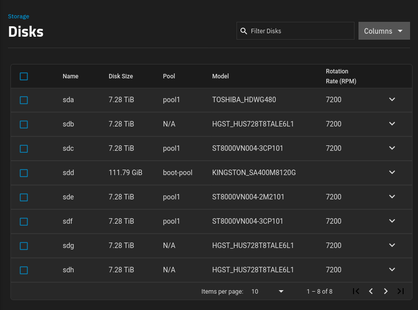

<style>
p img {
  display: block;
  margin-left: auto;
  margin-right: auto;
}
</style>

I recently upgraded my home TrueNAS server and migrated 18 TB of data from my four-disk RAIDZ1 ZFS pool to a new seven-disk RAIDZ2 pool.

The neat trick is that I never transferred my data to external storage. That's tricky because:

1. You can't convert a RAIDZ1 pool to a RAIDZ2 pool in place.
1. Using the new disks to create a 3x8TB RAIDZ2 pool would mean too little capacity for my 18 TB of data.

## How I did it

### Step 0: Initial state

Starting out, I have a 4x8TB RAIDZ1 ZFS pool, and I'm using 18 TB of its 23 TB capacity. I have three new disks that I want to integrate into my storage server.


### Step 1: Borrow one disk to create a RAIDZ2 pool

To begin, I remove one disk from my original RAIDZ1 pool, leaving it in a degraded state.

I then create a new 5x8TB RAIDZ2 pool using:

1.  My three new disks
1.  One disk from my RAIDZ1 pool
1.  One 8 TB sparse file to act as a fake disk

The sparse file is just a hack to allow me to create a 5-disk pool, and it won't actually receive any data.


### Step 2: Offline the fake disk

Next, I offline the fake disk (the 8 TB sparse file) from the RAIDZ2 pool. I only used it to trick ZFS into allowing me to create a 5x8TB RAIDZ2 pool with only four disks, but I don't want ZFS to write data to the fake disk because I don't actually have storage for that file.

After offlining the fake disk, the pool is still healthy, as RAIDZ2 can operate with up to two disks missing.


### Step 3: Migrate a snapshot of the RAIDZ1 pool to the RAIDZ2 pool

I snapshot all datasets in my RAIDZ1 pool and migrate all my data to the new RAIDZ2 pool using `zfs send`.


### Step 4: Destroy the old pool

Once I verify that I've successfully migrated my data to the RAIDZ2 pool, I destroy my old RAIDZ1 pool, leaving me with three extra disks.


### Step 5: Replace the fake disk with an old disk

I use one disk from my old RAIDZ1 pool to replace the fake disk in my RAIDZ2 pool, so it is no longer missing a disk.


### Step 6: Expand the new pool with the old disks

Finally, I use ZFS expansion to add the last two disks from my old RAIDZ1 pool to my new RAIDZ2 pool, giving me a total of 33 TB of usable storage and a healthy 7x8TB RAIDZ2 pool.


## Why is this hard?

The primary challenge in this migration is that you can't remove disks from a ZFS pool. Otherwise, you could create a new RAIDZ2 pool with just three physical disks, down

It sounds simple in theory, but in practice, I ran into a few hiccups which I'll share.

## Why switch from RAIDZ1 to RAIDZ2?

My home TrueNAS server is now three years old, and I've reached 80% of its capacity. I'm using about 19 TB of data.

I set up the server with four 8 TB disk in using RAIDZ1, meaning that a single disk can fail without losing data. If a second disk dies before I can replace the first dead one, I lose data.

When I built the server, I was betting on ZFS adding support for expanding pools by adding disks, which they did (TODO: link). The problem is that if I add drives, I'm increasing the risk of a pool failure. With only four disks, I feel like the odds are low of two disks failing at the same time. But if I expand to six or more disks, I worry a bit more.

So, I'd like to convert my ZFS pool from RAIDZ1 to RAIDZ2, which means that it can tolerate two disk failures without data loss.

But I had 18 TB of data. To match that on RAIDZ2, I'd need one more 8 TB drive, as 5 x 8 TB on a RAIDZ2 pool would give me 24 TB of usable storage.

So, I just buy one more disk, right? Unfortunately, ZFS doesn't support switching from RAIDZ1 to RAIDZ2. The RAIDZ mode is something you have to decide at pool creation time.

The process I see recommended for converting a pool from RAIDZ1 to RAIDZ2 is to move all of your data to a temporary location, destroy your pool, create a new pool as RAIDZ2, then restore all your data.

The problem is that I don't have an extra 19 TB of spare storage lying around. The naive solution would be to buy five extra disks, build a RAIDZ2 pool, then move all of my data over to the new pool. But I'd end up with nine disks when I only wanted five.

I already have data backups, but they're at the filesystem level not at the ZFS level. In other words, if I blew everything away, I'd have to recreate each of my ZFS datasets.

After considering a few different options, I managed to migrate all of my data by only buying three extra disks.

https://github.com/openzfs/zfs/pull/15022

available in 2.3.0

## Backing up my data

I said I never moved my data to external storage, but that's not strictly true. I did use external storage for backups, though I didn't end up needing them.

I already back up most of my data, but the vast majority of ZFS pool is media. I have 15 TB of movies and TV shows, and, because I'm a data hoarder, I keep the raw images of all of my disks. Because what if one day, I decide I really need to watch the director's commentary for my DVD copy of 1998's _There's Something About Mary_?

TODO: Show photo of DVDs

So, I back up all of my important personal data to multiple cloud storage buckets using restic (TODO: link), but it would cost me $XX/mo to keep backups of my TV shows and movies, so I don't back them up.

I'm aware of two cloud vendors that offer ZFS-native backup:

- rsync.net: Minimum billing is one month ($180 for 18 TB).
- zfs.rent: Requires me to send them my own hard disks.

There are tools for backing up ZFS to S3-compatible storage, but I didn't want to try those, as it felt too complex, and I wouldn't have a way of verifying the backups worked.

That left just using my standard restic backup to a cloud storage vendor that billed at the granularity of per-day or shorter.

### Gotcha: Wasabi has a minimum retention policy

I initially backed up to Wasabi on a migration attempt that didn't work. Okay, that's fine. I just owe Wasabi $30 or so for a few days of backup. It turned out that Wasabi does support per-XX billing, but you have to pay for a minimum of 90 days for any data you back up. So now, instead of a $30 Wassabi bill, I was looking at a $XX bill.

I emailed Wasabi support asking for mercy, and they had strange advice for me. Apparently, you can escape the minimum storage requirement by deleting your entire Wasabi account. This isn't a hack or trick or anything but actual guidance that official Wasabi support gave me.

But then without me even pushing back, another Wasabi rep joined the ticket and told me that as a one-time courtesy, they'd credit me the cost of my overages.

## Identifying the disks

To start, I need to identify which disks

```bash
fdisk --list
```

I find it easier to visit the Storage > Disks dashboard in TrueNAS:

{{}}

So, for this process, I want to use the disks like the following:

- Existing disks: `sda`, `sdc`, `sde`, `sdf`
- New disks: `sdb`, `sdg`, `sdh`

## Find the weakest disk

The riskiest part of the migration is the time from when I borrow a disk from my old RAIDZ1 pool until I migrate the data to my new RAIDZ2 pool. I'm running my old pool in degraded state with a missing disk, so if any of the other disks in my old pool die during the data migration, I lose data.

Because of this risky window, I wanted the weakest disk from my old pool to be the one I borrow to build the new pool. The RAIDZ2 pool can tolerate the weak disk failing, but the RAIDZ1 can't tolerate a second disk failure after I borrow the first one.

```bash
for drive in /dev/sd?; do
  [ -e "$drive" ] && echo -e "\n=== $drive ===" && smartctl -A $drive | \
    grep -E '(Power_On_Hours|Wear_Leveling|Media_Wearout|Reallocated_Sector)'
done
```

```text
=== /dev/sda ===
  5 Reallocated_Sector_Ct   0x0033   100   100   050    Pre-fail  Always       -       0
  9 Power_On_Hours          0x0032   032   032   000    Old_age   Always       -       27228

=== /dev/sdb ===
  5 Reallocated_Sector_Ct   0x0033   100   100   005    Pre-fail  Always       -       0
  9 Power_On_Hours          0x0012   100   100   000    Old_age   Always       -       423

=== /dev/sdc ===
  5 Reallocated_Sector_Ct   0x0033   100   100   010    Pre-fail  Always       -       0
  9 Power_On_Hours          0x0032   077   077   000    Old_age   Always       -       20998

=== /dev/sdd ===
  9 Power_On_Hours          0x0032   100   100   000    Old_age   Always       -       29606

=== /dev/sde ===
  5 Reallocated_Sector_Ct   0x0033   100   100   010    Pre-fail  Always       -       0
  9 Power_On_Hours          0x0032   067   067   000    Old_age   Always       -       29599

=== /dev/sdf ===
  5 Reallocated_Sector_Ct   0x0033   100   100   010    Pre-fail  Always       -       0
  9 Power_On_Hours          0x0032   067   067   000    Old_age   Always       -       29603

=== /dev/sdg ===
  5 Reallocated_Sector_Ct   0x0033   100   100   005    Pre-fail  Always       -       0
  9 Power_On_Hours          0x0012   100   100   000    Old_age   Always       -       141

=== /dev/sdh ===
  5 Reallocated_Sector_Ct   0x0033   100   100   005    Pre-fail  Always       -       0
  9 Power_On_Hours          0x0012   100   100   000    Old_age   Always       -       147
```

- `sda`: 032
- `sdc`: 077
- `sde`: 067
- `sdf`: 067

They all seem healthy, but sda's value of 32 is closest to zero, so that's the disk I'll move.

## ID the disk

You're not supposed to create the disks by the `/dev/sdX` path, as that can change across reboots, so I wrote this bash snippet to convert the `/dev/sdX` path to the disk's stable identifier, which will persists across boots:

```bash
get_disk_id() {
    local dev=$1
    local target="/dev/$dev"

    for path in /dev/disk/by-id/*; do
        if [ -L "$path" ] && [ "$(readlink -f "$path")" = "$target" ] &&
           ([[ "${path: -2:1}" == ":" ]] || [[ "${path: -2:1}" != ":" ]]); then
            echo "$path"
            return 0
        fi
    done
    echo "Disk ID not found for device: $dev" >&2
    return 1
}
```

And then I saved the disk IDs to environment variables:

```bash
# Old disks
DISK_1="$(get_disk_id sda)"
DISK_2="$(get_disk_id sdc)"
DISK_3="$(get_disk_id sde)"
DISK_4="$(get_disk_id sdf)"
```

```bash
OLDPOOL='pool1'
```

```bash
# New disks
DISK_5="$(get_disk_id sdb)"
DISK_6="$(get_disk_id sdg)"
DISK_7="$(get_disk_id sdh)"
```

`DISK_1` is the weakest, so I run the following:

```bash
MOVED_DISK="${DISK_1}"
```

```bash
$ sudo zpool status ${OLDPOOL}
  pool: pool1
 state: ONLINE
  scan: scrub repaired 68K in 10:40:08 with 0 errors on Wed May 14 06:25:26 2025
config:

        NAME        STATE     READ WRITE CKSUM
        pool1       ONLINE       0     0     0
          raidz1-0  ONLINE       0     0     0
            sde2    ONLINE       0     0     0
            sdf2    ONLINE       0     0     0
            sdc2    ONLINE       0     0     0
            sda2    ONLINE       0     0     0

errors: No known data errors
```

```bash
$ sudo zpool offline "${OLDPOOL}" sda2
```

```bash
$ sudo zpool status ${OLDPOOL}
  pool: pool1
 state: DEGRADED
status: One or more devices has been taken offline by the administrator.
        Sufficient replicas exist for the pool to continue functioning in a
        degraded state.
action: Online the device using 'zpool online' or replace the device with
        'zpool replace'.
  scan: scrub repaired 68K in 10:40:08 with 0 errors on Wed May 14 06:25:26 2025
config:

        NAME        STATE     READ WRITE CKSUM
        pool1       DEGRADED     0     0     0
          raidz1-0  DEGRADED     0     0     0
            sde2    ONLINE       0     0     0
            sdf2    ONLINE       0     0     0
            sdc2    ONLINE       0     0     0
            sda2    OFFLINE      0     0     0

errors: No known data errors
```

## Move the old disk

```bash
# Be careful, as this completely wipes the disk with no confirmation.
wipefs --all "${MOVED_DISK}"
```

Find the bytes of the disks:

```bash
$  fdisk --list | grep "^Disk.*bytes"
Disk /dev/sdf: 7.28 TiB, 8001563222016 bytes, 15628053168 sectors
Disk /dev/sdd: 111.79 GiB, 120034123776 bytes, 234441648 sectors
Disk /dev/sda: 7.28 TiB, 8001563222016 bytes, 15628053168 sectors
Disk /dev/sdc: 7.28 TiB, 8001563222016 bytes, 15628053168 sectors
Disk /dev/sde: 7.28 TiB, 8001563222016 bytes, 15628053168 sectors
Disk /dev/sdb: 7.28 TiB, 8001563222016 bytes, 15628053168 sectors
Disk /dev/mapper/sdd3: 16 GiB, 17179869184 bytes, 33554432 sectors
Disk /dev/zd0: 10 GiB, 10737418240 bytes, 20971520 sectors
Disk /dev/sdg: 7.28 TiB, 8001563222016 bytes, 15628053168 sectors
Disk /dev/sdh: 7.28 TiB, 8001563222016 bytes, 15628053168 sectors
```

Create a fake drive:

```bash
FAKE_DISK='/tmp/fake-drive.img'
truncate --size 8001563222016 "${FAKE_DISK}"
```

```bash
NEWPOOL='tank'
```

```bash
zpool create \
  -f \
  ${NEWPOOL} \
  raidz2 \
  -m "/mnt/${NEWPOOL}" \
  "${DISK_5}" \
  "${DISK_6}" \
  "${DISK_7}" \
  "${MOVED_DISK}" \
  "${FAKE_DISK}"
```

{{}}

```bash
$ zpool status "${NEWPOOL}"
  pool: tank
 state: ONLINE
config:

        NAME                                   STATE     READ WRITE CKSUM
        tank                                   ONLINE       0     0     0
          raidz2-0                             ONLINE       0     0     0
            ata-HGST_HUS728T8TALE6L1_VGGGYUEG  ONLINE       0     0     0
            ata-HGST_HUS728T8TALE6L1_VRGMRVJK  ONLINE       0     0     0
            ata-HGST_HUS728T8TALE6L1_VRGNZU9K  ONLINE       0     0     0
            ata-TOSHIBA_HDWG480_71R0A14YFR0H   ONLINE       0     0     0
            /tmp/fake-drive.img                ONLINE       0     0     0

errors: No known data errors
```

```bash
$ zpool list "${NEWPOOL}"
NAME   SIZE  ALLOC   FREE  CKPOINT  EXPANDSZ   FRAG    CAP  DEDUP    HEALTH  ALTROOT
tank  36.4T  1.27M  36.4T        -         -     0%     0%  1.00x    ONLINE  -
```

Remove the fake disk:

```bash
zpool offline "${NEWPOOL}" "${FAKE_DISK}" && \
  rm "${FAKE_DISK}"
```

Check the status:

```bash
$ zpool status "${NEWPOOL}"
  pool: tank
 state: DEGRADED
status: One or more devices has been taken offline by the administrator.
        Sufficient replicas exist for the pool to continue functioning in a
        degraded state.
action: Online the device using 'zpool online' or replace the device with
        'zpool replace'.
config:

        NAME                                   STATE     READ WRITE CKSUM
        tank                                   DEGRADED     0     0     0
          raidz2-0                             DEGRADED     0     0     0
            ata-HGST_HUS728T8TALE6L1_VGGGYUEG  ONLINE       0     0     0
            ata-HGST_HUS728T8TALE6L1_VRGMRVJK  ONLINE       0     0     0
            ata-HGST_HUS728T8TALE6L1_VRGNZU9K  ONLINE       0     0     0
            ata-TOSHIBA_HDWG480_71R0A14YFR0H   ONLINE       0     0     0
            /tmp/fake-drive.img                OFFLINE      0     0     0

errors: No known data errors
```

```bash
$ zpool list "${NEWPOOL}"
NAME   SIZE  ALLOC   FREE  CKPOINT  EXPANDSZ   FRAG    CAP  DEDUP    HEALTH  ALTROOT
tank  36.4T  1.41M  36.4T        -         -     0%     0%  1.00x  DEGRADED  -
```

## Transfer the data

```bash
SNAPSHOT_1="fullpool_$(date +%Y%m%d)"
zfs snapshot -r "${OLDPOOL}@${SNAPSHOT_1}" && \
  zfs send -v -w -R "${OLDPOOL}@${SNAPSHOT_1}" \
    | zfs receive -v -F "${NEWPOOL}"
```

For some reason, only some of the datasets transferred over, so I had to do the remaining datasets one-by-one.

```bash
DATASET='data'
```

```bash
zfs send -v -w -R -s "${OLDPOOL}/${DATASET}@${SNAPSHOT_1}" \
  | zfs receive -v -F -s "${NEWPOOL}/${DATASET}"
```

But then when I'd mount it at `/mnt/tank/data`, it showed up as empty. I tried `zpool export` and `zpool import`, and no change. What finally fixed it was rebooting my whole TrueNAS server.

{{}}

## Resuming interrupted transfers

```bash
RESUME_TOKEN="$(zfs get -H -o value receive_resume_token "${NEWPOOL}/${DATASET}")"


zfs send -v -t "${RESUME_TOKEN}" | zfs receive -v -s "${NEWPOOL}/${DATASET}"
```

I don't know if it actually resumes because it seems to start the progress back from zero, but it claims it's parsing the resume token correctly.

## Final cleanup

```bash
SNAPSHOT_2="migrate2"
zfs snapshot -r "${OLDPOOL}@${SNAPSHOT_2}"
```

```bash
zfs send -v \
  -i "${OLDPOOL}/${DATASET}@${SNAPSHOT_1}" \
     "${OLDPOOL}/${DATASET}@${SNAPSHOT_2}" \
  | zfs receive -v "${NEWPOOL}/${DATASET}"
```

## Rename pools

```bash
sudo systemctl stop k3s
sudo umount -l /var/lib/kubelet
sudo systemctl stop smbd
sudo systemctl stop nmbd
sudo systemctl stop winbind
sudo systemctl stop middlewared
sudo systemctl stop netdata
```

```bash
zpool export -f "${OLDPOOL}" && \
  zpool export -f "${NEWPOOL}" && \
  zpool import "${OLDPOOL}" "${OLDPOOL}-old"

zpool import ${NEWPOOL} ${OLDPOOL}
zfs set mountpoint="/mnt/${OLDPOOL}" "${OLDPOOL}"
```

```bash
sudo systemctl start middlewared
sudo systemctl start smbd
sudo systemctl start nmbd
sudo systemctl start winbind
sudo systemctl start netdata
sudo systemctl start k3s
```

Needed to reboot

## Dashboard

{{}}

## Scrub

Ran a scrub on pool1 just to be safe before I blow away the old pool.

{{}}

## Absorb the old disks

```bash
zpool destroy "${OLDPOOL}-old"
```

## Replace the fake disk

```bash
root@truenas:~# REPLACEMENT_DISK="$(get_disk_id sde)"
root@truenas:~# echo $REPLACEMENT_DISK
/dev/disk/by-id/ata-ST8000VN004-2M2101_WSD5B9XY
```

```bash
NEWPOOL='pool1'
zpool replace "${NEWPOOL}" /tmp/fake-drive.img "${REPLACEMENT_DISK}"
```


```bash
$ zpool status "${NEWPOOL}"
  pool: pool1
 state: DEGRADED
status: One or more devices is currently being resilvered.  The pool will
        continue to function, possibly in a degraded state.
action: Wait for the resilver to complete.
  scan: resilver in progress since Sat May 31 19:58:51 2025
        2.04T / 28.5T scanned at 56.6G/s, 0B / 28.5T issued
        0B resilvered, 0.00% done, no estimated completion time
config:

        NAME                                   STATE     READ WRITE CKSUM
        pool1                                  DEGRADED     0     0     0
          raidz2-0                             DEGRADED     0     0     0
            ata-HGST_HUS728T8TALE6L1_VGGGYUEG  ONLINE       0     0     0
            ata-HGST_HUS728T8TALE6L1_VRGMRVJK  ONLINE       0     0     0
            ata-HGST_HUS728T8TALE6L1_VRGNZU9K  ONLINE       0     0     0
            ata-TOSHIBA_HDWG480_71R0A14YFR0H   ONLINE       0     0     0
            replacing-4                        DEGRADED     0     0     0
              /tmp/fake-drive.img              OFFLINE      0     0     0
              ata-ST8000VN004-2M2101_WSD5B9XY  ONLINE       0     0     0

errors: No known data errors
```

Reports `ONLINE` instead of `DEGRADED`.

## Backblaze


## Add the extra disks


import pool. It already showed up, so ???


### Actual

```bash
$ zpool attach "${NEWPOOL}" raidz2-0 "${NEWDISK}"
cannot attach /dev/disk/by-id/ata-ST8000VN004-3CP101_WRQ02GX5 to raidz2-0: can only attach to mirrors and top-level disks
```

```bash
# zfs --version
+ zfs --version
zfs-2.2.4-1
zfs-kmod-2.2.4-1
```

Realized I was on 24.05 the wrong update train.

---

```bash
root@truenas:~# NEWDISK=$(get_disk_id sdd)
root@truenas:~# NEWPOOL='pool1'
root@truenas:~# zpool attach "${NEWPOOL}" raidz2-0 "${NEWDISK}"
cannot use '/dev/mapper/': must be a block device or regular file
root@truenas:~# zfs --version
zfs-2.3.0-1
zfs-kmod-2.3.0-1

+ zpool attach pool1 raidz2-0 /dev/disk/by-id/ata-ST8000VN004-3CP101_WRQ02GX5
cannot attach /dev/disk/by-id/ata-ST8000VN004-3CP101_WRQ02GX5 to raidz2-0: raidz_expansion feature must be enabled in order to attach a device to raidz

+ zpool get feature@raidz_expansion pool1
NAME   PROPERTY                 VALUE                    SOURCE
pool1  feature@raidz_expansion  disabled                 local

root@truenas:~# zpool get feature@raidz_expansion pool1
+ zpool get feature@raidz_expansion pool1
NAME   PROPERTY                 VALUE                    SOURCE
pool1  feature@raidz_expansion  enabled                  local
```

```bash
# zpool status "${NEWPOOL}" | grep --after-context=1 "expand:"
+ grep --after-context=1 expand:
+ zpool status pool1
expand: expansion of raidz2-0 in progress since Sun Jun  1 08:08:03 2025
        17.1G / 28.5T copied at 501M/s, 0.06% done, 16:36:03 to go
```

## Appendix: Alternatives I considered

### Back up ZFS pool to Wasabi

The best option I found was to back up all my data to Wasabi. I have decently fast fiber Internet, so I can upload 19 TB to Wasabi in about 36 hours.

Wasabi charges $7/TB/month, so I'd pay $133 to back up my ZFS pool for a month. Except Wasabi charges by the day, so if I only kept the data on Wasabi for two days, I'd only have to pay 1/15th the monthly price, or about $9, which is pretty good.

And even though Wasabi doesn't support ZFS, but they support the S3 API, and AWS S3 command-line client supports piping from stdout. This means I could do something like this:

```bash
zfs send -R mypool@20250510 \
  | aws s3 cp - s3://s3.us-east-2.wasabisys.com/michaels-zfs-backup/20250510.zfs
```

Except that wouldn't work because the file would exceed S3's limit of 5 TB per file.

I found [the z3 utility](https://www.presslabs.com/docs/code/z3/how-to-use-z3/) to work around the file size limitation, but that feels like bringing in too much complexity to my backup workflow.

Worst of all, I wouldn't be able to test backup and restore before deleting all of my local data, so it felt too risky.

### Back up ZFS pool to rsync.net

rsync.net claims to be the only platform that natively supports ZFS backup. I was considering it, but they charge $10/TB/month, and it doesn't look like you can purchase fractions of a month. I had 19 TB, which would mean spending $190 to back up and restore my data over a few days.

### Back up to temporary large disks

Another possibility is buying a 20 TB disk and moving all my data there while I do the migration. But that costs about $300, and I risk total data loss if that disk fails mid-migration. I can mitigate it by buying two large disks, but then I've spent about $600.

I could theoretically just send the disks back for a refund after the migration, but that's not a very kind thing to do to the merchant

### Back up to Hetzner

https://www.hetzner.com/storage/storage-box/
