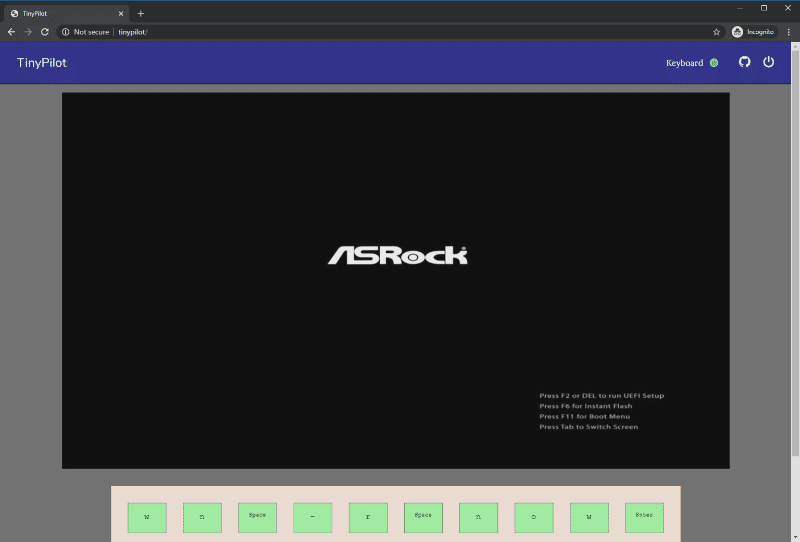
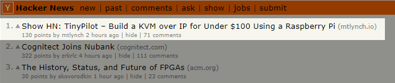
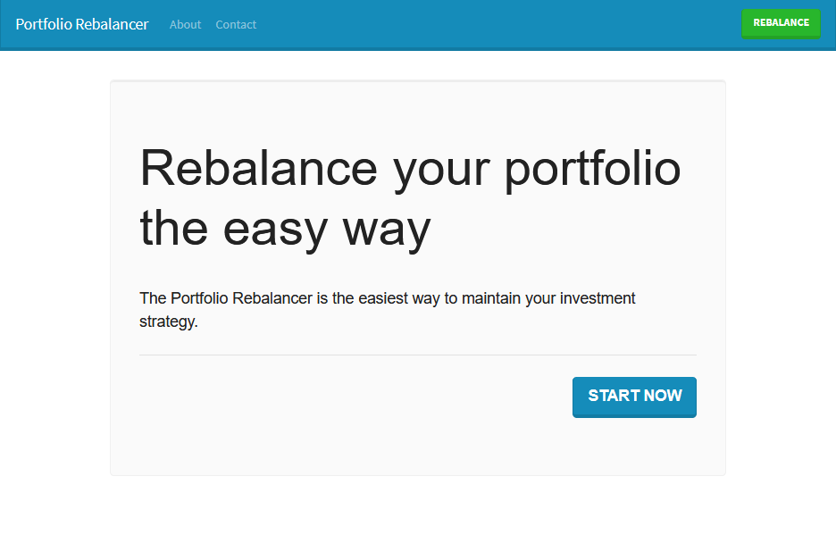

Today is the third anniversary of [quitting my job at Google](/why-i-quit-google/) to build my own software business. I posted updates at the end of my [first](/solo-developer-year-1/) and [second](/solo-developer-year-2/) years, so it's time to share my progress.

## The year things clicked into place

In my first two years working for myself, I earned less than $10k total. [My goal](/solo-developer-year-2/#goals-for-year-three) for the third year was to earn $20k in revenue.

Halfway through the year, it looked like I'd fall short. My businesses collectively generated about $300/month, and none of my new ideas were working.

Miraculously, one new product in May turned everything around. By the end of the year, I earned $63k in revenue, far exceeding my goal.

<canvas id="overall-finances"></canvas>

Okay, my net profits are still negative, but this time I have a good excuse!

I sell a physical product now, so my income lags my expenses by two or three months. My profit margins are 30-50% per sale, so the numbers will catch up eventually.



**Wait, how can you afford to keep losing money?**

I went into more detail about this [in last year's retrospective](/solo-developer-year-2/#how-can-you-afford-to-keep-losing-money), but the short version is: low cost of living, significant savings from my Google days, and passive investment income.



## Project by project

### [TinyPilot](https://tinypilotkvm.com/?ref=mtlynch.io)

{{}}

For the past few years, I've done all my software development on a [home server](/building-a-vm-homelab/). It works great, except for when I screw up the network configuration or want to install a new operating system. My server has no monitor or keyboard attached, so I have to drag it over to my desk, swap all the cables with my workstation, and then swap everything back when I'm done.

I'd read that a [Raspberry Pi](https://www.raspberrypi.org/) could masquerade as a USB keyboard, and I knew it could capture video. What if a web app combined those two features and transformed the Pi into a miniature remote administration device?

After a few months of tinkering, I had a working prototype.



{{}}



I questioned whether there was a market for this. Why would anyone buy this device from me? It was just a collection of widely available hardware components. Maybe one or two customers per week would purchase, so if I made $80 per kit, it would be worth my time packing and shipping orders.

Then, I published [a blog post](/tinypilot/) about it.

Immediately, it became clear that this business was different than anything I'd ever done before. Less than four hours after the blog post went live, customers had purchased all nine kits from my inventory, and they kept buying even when it was backordered.

Within a week, the blog post had driven $8.8k in sales. It reached the front page of Hacker News and became [one of the top "Show HN" posts](https://bestofshowhn.com/) of all time.


 {{}}
 {{}}


There was a drop in sales after that initial spike, but TinyPilot has been growing consistently ever since. I had zero experience selling a physical product, so I quickly learned how to [manage inventory](/retrospectives/2020/08/#managing-inventory-is-hard), systematize the order fulfillment process, and work with vendors to make [circuit boards](/retrospectives/2020/10/#manufacturing-a-power-connector-from-start-to-finish) and [3D-printed cases](/retrospectives/2020/12/#new-products-require-new-habits).

TinyPilot ended the year with almost $54k in revenue. My net income is still negative, but it's because my costs are front-loaded. TinyPilot's expenses for 2020 include inventory to last through February 2021.



| Income/Expense            | 2020        |
|---------------------------|-------------|
| Sales                     | $53,362     |
| Donations                 | $380        |
| Materials                 | -$46,143    |
| Electrical engineering consulting             | -$7,130     |
| Order fulfillment         | -$2,570     |
| Software development\*      | -$1,321     |
| Open-source contributions | -$1,270     |
| Advertising               | -$675       |
| Graphic design            | -$250       |
| Hosting / Domains         | -$64        |
| **Net profit**            | **-$5,681**    |

\* I write the vast majority of the code, but I hired a developer to help with the [sales page](https://tinypilotkvm.com/?ref=mtlynch.io).

### [Hit the Front Page of Hacker News](https://hitthefrontpage.com)

{{}}

In May, I gave an informal presentation to my peer mentorship group called ["How to be a Sort of Successful Software Blogger."](https://decks.mtlynch.io/show-and-tell-2020-05/) I tried to deconstruct the techniques that make my writing succeed on sites like Hacker News and reddit. It was fun to share my process, but I didn't know what more to do with the material.

Over the year, I increasingly saw developers teaching what they knew in paid courses. TinyPilot had shown me how powerful it was to align my blog with my business. If people liked my blog, they might be interested in purchasing a course about my writing.

Recording the course was harder than I expected. I planned for 30-40 hours of work, but it turned into nearly 200.

The course came out in January 2021, so the numbers below don't include post-launch orders. Sales have been modest so far, but it's too early to get a sense of long-term revenue. In any case, I'm proud of the material, and several of my students have told me that the lessons impacted their writing significantly.

| Metric            | 2020        |
|-------------------|-------------|
| Pre-orders            | 29          |
| Pre-order revenue             | $1,431        |
| Cover design      | -$293        |
| Recording equipment       | -$584        |
| **Net profit**    | **$554**    |

### mtlynch.io (this blog)

My major change in blogging this year was thinking more strategically about article topics. Before 2020, I wrote with an attitude of, "This topic is on my mind right now, so I'm going to write about it and see what happens." Sometimes the post would find an audience, but more often, it wouldn't.

This year, before I began any new article, I asked myself two questions:

1. How many readers are interested in this topic?
1. Do I have a way of reaching them?

This small bit of planning made a huge difference in my readership. In 2019, my posts averaged 5,000 readers in their first week. In 2020, this number jumped to 25,000. Of the nine new blog posts I published, all but one reached the front page of Hacker News, and four of them hit the #1 slot.

| Metric                                      | 2019    | 2020    | Change |
|---------------------------------------------|---------| --------|--------|
| Pageviews                                   | 273,817 | 719,899 | +446,082 (+163%)
| Affiliate revenue\*                         | $374    | $1,599     | +$1,225 (+328%)
| Development                                 | -$460   | $0      | -$460 (-100%)
| [Illustrations](/how-to-hire-a-cartoonist/) | -$769   | -$964    | +$195 (+25%)
| Hosting / Domain                            | -$150   | -$534      | +$384 (+256%)
| [Editing](/editor/) + [Grammarly](https://grammarly.com)  | -$200    | -$222 | +$22 (+11%)
| **Net profit**                              | **-$3,835** | **-$121** | **+$3,714** |

\* I [dropped all affiliate partnerships](https://twitter.com/deliberatecoder/status/1342847048811499523) from this blog at the end of 2020.

## Failed projects

One of the most important lessons I learned last year was that pursuing the right ideas means [rejecting the wrong ones](/solo-developer-year-2/#pursuing-the-right-idea-means-rejecting-the-wrong-ones). After six to eight weeks, if a business fails to generate meaningful revenue, I either pivot to focus on different customers or move on to an entirely new project.

### [Is It Keto](https://isitketo.org)

{{}}

I started [Is It Keto](https://isitketo.org) in 2018. It's a simple site that tells you whether or not particular foods fit the keto diet.

I gave up on the site in 2019 but [came crawling back](/retrospectives/2020/05/) in April 2020 after several of my new business ideas flopped. Is It Keto was profitable, but barely. It earned less than $0.01 per visitor, so it needed a drastic increase in visitors and/or earnings.



To scale growth, I tried to automate article-writing. For all of Is It Keto's life, each article was 100% original and custom-written by me or [writers I hired](/hiring-content-writers/). In reviewing my existing content, I noticed consistent patterns that I could abstract into templates. Plugging in the right food name, photos, and nutritional information would allow me to generate new pages rapidly.

{{}}

At first, it seemed like templatizing content would add hundreds of articles per week, but it proved challenging to scale that fast without sacrificing quality. In two months, I only managed to add 118 articles. The more templates I added, the faster I could go, but the additional content drew too few users to make it worthwhile.

The other idea came from my friend [Justin Vincent](http://nugget.one/jv), who was flabbergasted to hear that my site earned so little from 70-100k pageviews per month. He recommended that I build a paid sister product and use Is It Keto to attract qualified leads.

I tested a few landing pages for keto communities and apps, but only 0.1% of visitors [signed up for more information](/retrospectives/2020/07/#validating-keto-product-ideas). Around this time, TinyPilot began taking off, so I put Is It Keto on the backburner.

| Metric                                      | 2019    | 2020      | Change |
|---------------------------------------------|---------|-----------|---------|
| Pageviews                                   | 521,913 | 1,314,583   | +792,670 (+152%)
| Ad revenue                                  | $940    | $2,934         | +$1,994 (+212%)
| Affiliate revenue                           | $1,315  | $2,147      | +$832 (+63%)
| Meal plan sales\*                           | $24     | $18          | -$6 (-25%)
| Freelance designers and [content writers](/hiring-content-writers/) | -$4,322 | -$105     | -$4,217 (-98%)
| Hosting / domain                            | -$115   | -$241          | +$126 (+110%)
| **Net profit**                              | **-$2,158 **  | **$4,753** | **+$6,911**

\* I [gave up on meal plans](/retrospectives/2019/12/#giving-up-on-meal-plans) in January 2020

### [WanderJest](https://wanderjest.com)

{{}}

WanderJest was a short-lived project I started at the beginning of 2020. I described it as "Bandsintown, but for comedy."

I love comedy, but I've missed countless opportunities to see comedians perform near me. Either I'm not on the right mailing list, not following the right social media account, or not checking Ticketmaster at the right time. WanderJest was going to solve that by aggregating show listings from as many sources as possible.

My plan was to make money through affiliate deals with theaters, but nobody ever used my discount codes. Once COVID hit, I [shuttered the site](/retrospectives/2020/04/#putting-wanderjest-on-hold).

### [Portfolio Rebalancer](https://assetrebalancer.com/)

{{}}

My investment portfolio is a mix of stocks and bonds of different categories with a target percentage for each asset type. As prices fluctuate, the balance of my investments changes, so I have to move money around to get back to my target ratios. I do this a few times per year by tediously plugging numbers into a spreadsheet until everything looks right.

What if a web app automated this? I put together a quick prototype and shared it on reddit, my blog, and through Google ads. The tool attracted 1,000 visitors in its first month. Sadly, only one person signed up for a free trial, and they never upgraded to a paid plan. I wasn't confident in the idea to begin with, so I [moved on](/retrospectives/2020/05/#portfolio-rebalancer-has-lots-of-visitors-but-no-sales) after a month.

## Lessons learned

### Product/market fit is magic

Finding ["product/market fit"](https://en.wikipedia.org/wiki/Product/market_fit) means building a product and connecting with enough customers to make your business viable. When founders talk about achieving product/market fit, they describe it in the same breathless tone as finding true love. Now, I understand why.

The first two and a half years of working on my own, I'd spend hundreds of hours executing an idea and see only a few dollars of extra revenue. TinyPilot was product/market fit at first sight. As soon as I published the blog post, I knew.

With TinyPilot, it feels like the product drives the business, and I'm just along for the ride. There have been several months where I made critical mistakes in managing the business, and it continued growing anyway.

When I do improve the product, the results are immediate and substantial. In November, I released [a new, high-end model](https://tinypilotkvm.com/blog/introducing-voyager) of TinyPilot. It sold 55 units in the first month, generating an extra $14k in revenue. That felt a whole lot better than [my 0.1% signup rate](#is-it-ketohttpsisitketoorg) on Is It Keto and Portfolio Rebalancer.

### You can build a successful business without being available 24/7

I still vividly remember a show I saw at the [UCB comedy theater](https://ucbtheatre.com/) in late 2017, but I couldn't tell you a single joke from the performance. All I remember was worrying the entire time that the pager in my pocket could go off at any moment and force me to rush home.

My team at Google had an "on-call rotation," which meant that every two months, you carried a pager everywhere you went for two weeks. If the pager went off, you had to be "fingers on keyboard" within 30 minutes.

When I left Google, I was [unsure of my future plans](/why-i-quit-google/#whats-next), but I was certain of one thing: I'd never carry a pager again. And I haven't &mdash; I've refused to entertain any business idea where an outage would be A Big Deal.

Around the two year mark, thoughts began creeping into my mind that *this* was what held me back. Other founders were building services that promised constant availability, so why should I succeed with anything less?

Fortunately, bootstrapped founder extraordinaire Jason Cohen told me to keep doing what I'm doing. Well, he didn't tell *me* exactly, but it felt like he was speaking directly to me. At [the 32-minute mark](https://youtu.be/otbnC2zE2rw?t=1962) of his excellent talk, ["Designing the Ideal Bootstrapped Business,"](https://www.youtube.com/watch?v=otbnC2zE2rw) Cohen pointedly discourages founders from creating "real-time" businesses. He explained that if you're a self-funded small business, it's not worth having customers wake you up in the middle of the night.



 I'm so glad I didn't cave to my fears. TinyPilot is about as far from "real-time" as it gets. Customers run my software on their own hardware, so I could shut down every server and code repository without interrupting anyone's workflow.

### Success is more stressful than failure

Even though TinyPilot doesn't require constant availability, my brain often forgets that.

After my big launch, I couldn't sleep for two days. I mailed out all nine kits to my customers and then agonized over what would happen next. What if everyone got their devices, and none of them worked? What if my customers expected TinyPilot to do something totally different? What if there was some horrible bug that destroyed everyone's servers?

{{}}

Fortunately, initial customers loved their TinyPilots, so I finally exhaled. But every few weeks, something new would pop up and worry me for days. The post office lost a shipment of critical parts. A positive review drove a surge of orders and exhausted my inventory. I messed up a customs form and braced myself for imprisonment in export jail.

Realistically, the pressure I feel is all self-imposed. If I'm out of stock for a few days, who cares? When my poor planning delays an order, I feel anxious about disappointing the customer, but nobody's ever complained. In fact, when I apologize that a shipment will be late, customers only ever reply to say they're impressed I took the time to let them know.

I've been getting better at easing the pressure on myself and separating work from my personal life, but it's an ongoing process.

## Grading last year's goals

At the start of last year, I [set three high-level goals](/solo-developer-year-2/#goals-for-year-three).

### Earn $20k in revenue across my businesses

* **Result**: Earned $63k in revenue
* **Grade**: A+

It looked bleak at the beginning, but I far exceeded my goal. Considering my 2019 revenue was only $7.2k, an increase of almost 9x feels like a major accomplishment.

### Publish 10 blog posts

* **Result**: Published nine blog posts
* **Grade**: A-

I was on track to publish 10 posts, but I sacrificed my tenth in order to create [my writing course](https://hitthefrontpage.com). Nevertheless, I'm pleased with the results of my blogging this year. I wrote several articles I feel proud of, and they connected with appreciative audiences.

### Learn one new technology

* **Result**: Learned more JavaScript
* **Grade**: B-

I was hoping to find an excuse to learn Rust, but I never found a good match.

Instead, I gained breadth and depth in JavaScript. I already knew [Vue](https://vuejs.org/), but this year, I learned [Gridsome](https://gridsome.org/), a Vue-based static site generator. I used it to build [my TinyPilot sales site](https://tinypilotkvm.com/?ref=mtlynch.io) and to [rewrite Is It Keto](https://whatgotdone.com/michael/2020-04-17).

I also learned to use plain JavaScript more effectively. TinyPilot's web app [is pure JavaScript](https://github.com/tiny-pilot/tinypilot/tree/bf07bfe72941457cf068ca0a44c6b0d62dd9ef05/app/static/js) with no build or compilation steps. It's astonishing how much complexity you save by eschewing modern JavaScript frameworks.

## Goals for year four

### Grow TinyPilot to $600k in annual revenue

Okay, as crazy as it sounds to go from a goal of $20k/year to $600k/year, I think this is achievable.

TinyPilot earned $43k in January 2021, so it could reach $600k for the year by averaging 3% growth each month.

### Publish six blog posts and one book

Ever since I began working for myself, I've distantly fantasized about self-publishing a book. This year, I'm finally doing it.

The book will teach software engineers practical ways to improve their writing. The tentative title is [*Refactoring English: Effective Writing for Software Developers*](https://refactoringenglish.com).

### Automate TinyPilot management

My girlfriend works with me part-time on TinyPilot, managing inventory and packing orders. We enjoy working together, but it's a fragile system that scales poorly. If either of is unavailable for a few days, we quickly accumulate a massive backlog.

I'd like to systematize and outsource enough of our processes that we can take a two-week vacation without everything grinding to a halt.

## Closing thoughts

Before I quit my job, I constantly read books and listened to podcasts about startups. The part that intrigued me most was the boundlessness of possibility.

When you run your own business, you can do *anything*. With a month of available time and $10k of capital, there are millions of ways to grow your business. You can add a new feature, try a new marketing strategy, or hire a new salesperson. You can make up a totally new technique that nobody in your industry has ever seen before.

Throughout my career, I was always on some predefined career ladder. To progress, I had to prove that I met arbitrary criteria that bore only a faint resemblance to my day-to-day work. If my manager asked me to add a new feature, I couldn't say, "No, I think we need a better marketing strategy, so I'm going to do that instead." But with my own business, I say stuff like that all the time! (Though now, the manager and the employee are both me.)

As I finally see financial success with one of my businesses, there's more revenue, which means more possibilities. It's just as fun as I hoped. Stressful, but fun.

Once again, I feel incredibly fortunate to be working for myself, and I hope to continue doing it forever.



---

*Cover image by [Loraine Yow](https://www.lolo-ology.com/). Thanks to [Monica Lent](https://monicalent.com/) and the [Blogging for Devs community](http://bloggingfordevs.com/) for providing early feedback for this post.*

