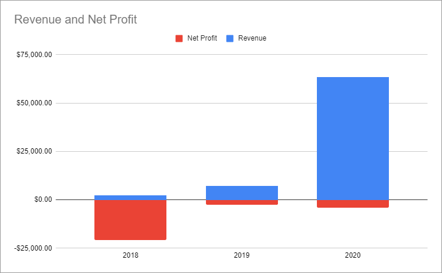


**Note**: This is a preview of an upcoming blog post. Please do not share this URL.


Today is the third anniversary of me [quitting my developer job at Google](/why-i-quit-google/) to build my own software business. I posted updates at the end of my [first](/solo-developer-year-1/) and [second](/solo-developer-year-2/) years on my own, so it's time for another update.

## The year things clicked into place

In my first two years on my own, I earned less than $10,000. [My goal](/solo-developer-year-2/#goals-for-year-three) for year three was to earn $20k by the end of 2020.

For the first six months, it didn't look like I was going to make it. My businesses collectively earned about $300/month, and none of my new ideas were working.

Miraculously, one good idea in May turned everything around. By the end of the year, I earned $63k in revenue, far exceeding my goal.

{{}}

&nbsp;

| Metric     | 2019        | 2020       | Change                                        |
|------------|-------------|------------|-----------------------------------------------|
| Revenue    | $7,254   | $63,477  | +$56,223 (+775%) |
| Expenses   | $9,657  | $67,441  | +$57,784 (+598%) |
| **Net Profit** | **-$2,402** | **-$3,964** | **-$1,561 (-65%)** |

Okay, I'm still not making a profit, but this time I have a good excuse!

I sell a physical product now, so my income lags my expenses by two or three months. My profit margins are 50% to 200% per sale, so the numbers will catch up eventually.



**Wait, how can you afford to keep losing money?**

I went into more detail about this [in last year's retrospective](/solo-developer-year-2/#how-can-you-afford-to-keep-losing-money), but the short version is: low cost of living, significant savings from my Google days, and passive investment income.



## Project by project

### [TinyPilot](https://tinypilotkvm.com)

{{}}

For the past few years, I've done all my software development on a [home server](/building-a-vm-homelab/). It works great, except when I screw up the network configuration or want to install a new operating system. My server has no monitor or keyboard attached, so I have to drag it over to my desk, swap all the cables with my workstation, and then swap everything back when I'm done.

I had read that the Raspberry Pi could masquerade as a USB keyboard, and I knew it could capture video. I wondered if I could turn one of my Raspberry Pis into a little remote administration device, where I could plug it into a server, and it would host a web interface where I could type in keyboard input and see the server's video output. In July, after a few months of tinkering, I had a working prototype.

TODO: photo of prototype

Was there even a market for this? I wasn't excited to sell a physical product, but I figured it would be worth it for me to spend an hour a week packing up a box if I could make like $80 in profit per kit. And it seemed like I could sell maybe one or two kits per week.

Then, I published [a blog post](/tinypilot/) about it.

Immediately, it became clear that this business was different than anything I'd ever done before. It reached the front page of Hacker News and became [one of the top "Show HN" posts](https://bestofshowhn.com/) of all time.  Within two hours, customers had purchased all 13 of the kits in my inventory. Over the next few weeks, I'd earn $XXk in revenue, primarily from people who had seen my blog post or articles about my post.

TODO: Screenshots of reddit, HN

I interviewed as many customers as I could to ask what features they want and spent the rest of the year improving the product.  I added support for mouse input. I created my own custom hardware to improve power. I worked with a 3D printing lab to create a sleek case. I'm a software developer, so I had to learn quickly many things outside my experience, like managing inventory, ordering custom circuit boards, and working with 3D printing labs to design custom cases.

In mid-August, I discovered a design flaw (TODO: link) and paused sales for four weeks until I could ship a fix to my customers. After that, TinyPilot grew consistently each month, ending the year with almost $54k in total revenue.



| Income/Expense            | 2020        |
|---------------------------|-------------|
| Sales                     | $53,362     |
| Donations                 | $380        |
| Materials                 | -$XX        |
| EE consulting             | -$XX        |
| Order fulfillment         | -$2,570     |
| Graphic Design            | -$XX        |
| Advertising               | -$XX        |
| Open Source Contributions | -$XX        |
| Hosting / Domains         | -$XX        |
| **Net profit**            | **-$XX**    |

### [Hit the Front Page of Hacker News](https://hitthefrontpage.com)

{{}}

In May, I gave an informal presentation to my peer mentorship group called ["How to be a Sort of Successful Software Blogger."](https://decks.mtlynch.io/show-and-tell-2020-05/) I tried to reverse engineer the techniques that made my writing especially successful on sites like Hacker News and reddit. I enjoyed deconstructing my process, but I didn't know what more to do with the material.

Over the course of the year, I saw more and more developers teach what they knew in paid courses. TinyPilot had shown me how powerful it could be to align my blog with my business, so I felt like if people liked my writing, they might buy a course about how I do it.

The course was much harder than I expected. What I planned to be 30-40 hours of work turned into nearly 200. I released the course in January, and the audience turned out to be smaller than I expected, but I'm still proud of the course, and many of the customers who have watched it have told me that it taught them a lot.

| Metric            | 2020        |
|-------------------|-------------|
| Pre-orders            | 29          |
| Pre-order revenue             | $1,431        |
| Private presentations       | $400        |
| Cover design      | -$293        |
| Recording equipment       | -$584        |
| **Net profit**    | **$954**    |

### mtlynch.io (this blog)

I don't think of my blog as a business. I write because I enjoy it and want to improve my writing.

Perhaps because it's not a business, I'd never thought much about strategy before this year. I wrote with an attitude of, "This topic is on my mind right now, so I'm going to write about it and see what happens." Sometimes the post would find an audience, but more often it wouldn't.

The big change I made in 2020 was choosing my topics more strategically. Before I began any new post, I asked myself two questions:

1. How many readers are interested in this topic?
1. Do I have a way of reaching them?

Question #2 is important, as it would have saved me the three months I spent writing "Hiring Content Writers: A Guide for Small Businesses." (TODO: link) There are plenty of people interested in that topic, but I have no way of reaching them.

This small bit of extra planning made a huge difference in my readership. In 2019, my articles attracted an average of 5,000 readers in their first week. In 2020, this jumped to 25,000. Eight of my nine blog posts reached the front page of Hacker News, and four of them reached the #1 slot.

| Metric                                      | 2019    | 2020    | Change |
|---------------------------------------------|---------| --------|--------|
| Pageviews                                   | 273,817 | 719,899 | +XX (+XX%)
| Affiliate revenue\*                         | $374    | $1,599     | +$XX (-XX%)
| Development                                 | -$460   | $0      | +$460 (-100%)
| [Illustrations](/how-to-hire-a-cartoonist/) | -$769   | -$XX    | +$XX (+XX%)
| Hosting / Domain                            | -$150   | -$XX     | -$XX (-XX%)
| [Editing](/editor/) + [Grammarly](https://grammarly.com)  | -$200    | -$XX | -$XX (-XX%)
| **Net profit**                              | **-$3,835** | **$XX** | +$XX (+XX%) |

\* I [dropped all affiliate partnerships](https://twitter.com/deliberatecoder/status/1342847048811499523) from this blog at the end of 2020.

## Failed projects

### [Is It Keto](https://isitketo.org)

{{}}

I started [Is It Keto](https://isitketo.org) in 2018. It's a simple site that tells you whether or not certain foods fit the keto diet.

I go through alternating cycles of focusing on it, ditching it out of boredom, then crawling back a few months later to my only profitable business. I returned once again in early 2020, but I knew something had to change drastically. The site only earned around $0.01 per visitor, so I had to do something that dramatically increased visitors and/or earnings.



To scale growth, I tried to templatize the site's content. For all of Is It Keto's life, each article was 100% original and custom-written by me or [writers I hired](/hiring-content-writers/). In 2020, I tried making templates instead. From looking at all my human-written articles, there were consistent structures and patterns that I could abstract into templates and plug in the right food name and nutritional information.

TODO: Screenshot

At first, it seemed like this would allow me to add hundreds of articles per week, but I found it harder than I expected to auto-generate content while still maintaining accuracy and quality. In XX months, I only managed to add XX articles. The more templates I added, the faster I could go, but it wasn't attracting enough new users to make it worthwhile.

My other idea was from my friend Justin Vincent (TODO: link). When he found out that XX users visited Is It Keto every month, he was astonished that I was squandering my readers' attention on banner ads and affiliate links. I tested a few landing pages for paid keto communities and apps, but only 0.1% of visitors [signed up for more information](/retrospectives/2020/07/#validating-keto-product-ideas).

TODO: screenshot

| Metric                                      | 2019    | 2020      | Change |
|---------------------------------------------|---------|-----------|---------|
| Pageviews                                   | 521,913 | 1,314,583   | +XX (+XX%)
| Ad revenue                                  | $940    | $2,934         | +$XX (+XX%)
| Affiliate revenue                           | $1,315  | $2,147      | +$XX (+XX%)
| Meal plan sales\*                             | $XX     | $18          | +$XX (+XX%)
| Freelance designers and [content writers](/hiring-content-writers/) | -$3,845 | $0     | $3,845 (-100%)
| Hosting / domain                            | -$103   | XX          | +$XX (+XX%)
| **Net profit**                              | **-$1,882 **  | **$XX** | $XX (+XX%)

\* I gave up on these in January 2020

### [WanderJest](https://wanderjest.com)

{{}}

WanderJest was a short-lived project I started at the beginning of the year. I described it as "Bandsintown, but for comedy."

I love live comedy, but I've missed countless opportunities to see a comedian perform near me because I'm not on the right mailing list, not following the right social media account, or not checking Ticketmaster at the right time. WanderJest was going to solve that.

My plan was to earn money through affiliate deals with theaters, but nobody ever used my discount codes. Once COVID hit, I shuttered the site.

### [Portfolio Rebalancer](https://assetrebalancer.com/)

{{}}

After shutting down WanderJest, I didn't know what to work on. With COVID turning everything upside down, I decided to just make a tool I wanted personally: a portfolio rebalancer.

My investment portfolio is 45% US stock, 35% bonds, and 20% international stocks. As market prices fluctuate, the balance of my investments change, so I have to move money around to get back to my target ratios.

My rebalancing process involves exporting my portfolio to a spreadsheet and then tediously plugging in hypothetical trades through trial and error until everything looks right. Why not automate it in a web app?

I quickly put together a prototype that automated the process I'd been following with my spreadsheet and began talking about the tool on reddit and my blog. Even though XX people visited the site through my posts, only one person was interested enough to sign up for the free trial. They ultimately decided not to buy. After a month, I decided it wasn't worth pursuing and moved on.

## Lessons learned

### Product-market fit is magic

There's a term that's popular in the startup community: product-market fit. It means building a product and finding enough customers for it to make your business viable. When founders talk about finding product-market fit, they describe it in the same breathless terms they'd use to talk about finding true love. Now, I understand why.

The first two and a half years of working on my own, I was grinding away to grow little by little. Some of my businesses would grow consistently, but the money was small potatoes. Other times, I'd [make a big sale](/retrospectives/2020/01/#zestfulhttpszestfuldatacom) but then fail to replicate it.

TinyPilot was product-market fit at first sight. As soon as I published the blog post, I knew. It's a completely different experience than anything else I've built. It feels like the product drives the business, and I'm just along for the ride. There have been several months where I felt like I made critical mistakes in managing the business, and it continued growing anyway.

### There's no shame in seeking product-founder fit

I still have a vivid memory of a comedy show I saw at the UCB comedy theater (TODO: link) in late 2017. I don't recall anything about the show. What I remember was that I was on-call that week, so all I could think about was that my pager could go off at any moment and force me to rush home.

My team at Google had an "on-call rotatation," which meant that every two months, you had to carry a pager at all times for two weeks. If the pager went off, you had to be "fingers on keyboard" within 30 minutes.

That dumb pager woke me up several times at 2am, sometimes again the same night. It ruined parties, prevented me from enjoying live shows, and generally stressed me out for the whole two weeks I was on-call.

When I left Google, I was unsure of many things about my future, but I was certain of one thing: I'm never carrying a pager again.

Since then, I've carefully avoided creating any business where an outage would be A Big Deal. I wanted a business that let me control exactly how much of my life it occupied.

I learned recently that there's a term for this: product-founder fit. While product-market fit is about finding the right product for your customers, product-founder fit is about finding a product that would make you happy to build.

Around the two year mark, I started worrying that this restriction that was preventing me from succeeding. I kept seeing other founders succeed with businesses that promise 24/7 support. Maybe there wasn't space for founders who weren't willing to make that commitment?

Early last year, I watched a talk by Jason Cohen (TODO: link), who has launched several multimillion dollar startups. In the video, he recommends that solo founders avoid businesses where an outage is A Big Deal. He says that there's too high a risk of burnout. It was a huge relief to just hear from a successful founder that it's okay to protect your focus and downtime.

I'm glad I didn't cave to the pressure of a 24/7 business. TinyPilot had $40k in revenue last month, but I've never thought once about outages. TinyPilot customers run my software on their own devices. I could shut down every server and delete every code repository, and TinyPilot customers could continue happily using what they purchased.

### Success is more stressful than failure

Even though TinyPilot is structured in a way that lets me disconnect when I want, actually letting myself disconnect is another story.

After my big launch, I couldn't sleep for two days. I sold my first 13 kits in hours, but nobody besides me had ever tested this software. What if everyone got their devices and none of them worked? What if there was some horrible bug that destroyed people's servers?

After I got happy reports from customers, I was able to relax a bit and take pleasure in the success. But about once a month, something will keep me up at night. A shipment of parts I need will get stuck in customs. A positive review will drive a surge of customers that clears out my inventory. I'll fill out an international invoice and worry that I did it incorrectly and be sent to export jail.

Realistically, the pressure I feel is all self-imposed. A customer has never told me they're furious because I failed to deliver a feature they expected. If I'm out of stock for a few days and sell a little bit less than I could have, what does it really matter?

I've been getting better at separating work from life, but it's an ongoing process. It's been months since TinyPilot kept me up at night, but I'm still not able to disconnect at the end of the day. I'm putting systems in place that let me avoid work things until I explicitly choose to see them during work hours.

## Grading last year's goals

At the start of last year, I [set three high-level goals](/solo-developer-year-2/#goals-for-year-three). Here's how I performed against them.

### Earn $20,000 in revenue across my businesses

* **Result**: Earned $XX in revenue
* **Grade**: A+

For the first half of the year, I didn't think I'd make it. Fortunately, TinyPilot grew so quickly that it put me well past my goal.

### Publish 10 blog posts

* **Result**: Published nine blog posts
* **Grade**: A-

I was on track to publish 10 posts, but I decided to forego my tenth post to make time to produce my video course. Nevertheless, I'm pleased with the results of my blog posts this year.

### Learn one new technology

* **Result**: Learned more JavaScript
* **Grade**: B-

I was hoping to find an excuse to learn Rust, but I never found a good match.

Instead, I gained breadth and depth in JavaScript. I already knew Vue, but this year I learned Gridsome, a Vue-based static site generator. I used it to build [my TinyPilot sales site](https://tinypilotkvm.com) and rewrite Is It Keto (TODO: link).

I also learned to use plain JavaScript more effectively. TinyPilot's web app [is pure JavaScript](https://github.com/mtlynch/tinypilot/tree/bf07bfe72941457cf068ca0a44c6b0d62dd9ef05/app/static/js) with no build or compilation steps. It's astonishing how much complexity that eliminates.

## Goals for year four

### Grow TinyPilot to $600,000 in annual revenue

Okay, as crazy as it sounds to go from a goal of $20k to $600k, I think this is achievable. TinyPilot earned $40k in January, so I'd have to grow an average of 4% per month to reach a $600k annual total.

### Publish six blog posts and one book

I've distantly fantasized about self-publishing a book ever since I began working for myself. This year, I'm finally going to do it.

The book will teach software developers practical ways to improve their writing. The tentative title is [*Refactoring English: Effective Writing for Software Developers*](https://refactoringenglish.com) (TODO: put up landing page).

### Automate TinyPilot management

My girlfriend works with me part-time on TinyPilot, managing inventory and packing orders. We enjoy working together, but it's a fragile system that scales poorly. If either of us can't work for a few days, we'd quickly accumulate a massive backlog of work.

I'd like to systematize and outsource enough of our processes that we can take a two-week vacation and let the business run on its own.

## Closing thoughts

At one point at Google, my team had to spend two weeks filling out spreadsheets to generate data for a new machine learning algorithm. The spreadsheet was nothing complicated &mdash; it was work an intelligent high school graduate could do with a few hours of instruction for $15/hour.

Because of Google's size, hiring a new person to fill out spreadsheets would have meant months of coordination, approvals, and HR paperwork. It was easier to pay software engineers to do it for an average of $250/hour, even though that was obviously absurd.

Those days, I'd come home and listen to the Indie Hackers podcast (TODO: link), where host Courtland Allen interviewed software founders who started their companies without venture capital investment. One of the things that intrigued me about their stories was the limitless possibilities of it all.

When you work a corporate job, you have to fill out spreadsheets for days because they ask you to. When you're a founder, there are infinite choices you can make. You could focus on the product, market, sales, or hiring. Within each of those categories, there are almost infinite subcategories. And you get to see the result, usually pretty fast. If you're at Google, it's hard for you to measure your impact on the company, but if you're running a scrappy bootstrapped business, and you spend $5,000 on something, you'll usually find out in a month or two whether it was worth the money.

With any fantasy, you figure it's never going to be *as* fun as you expect, but running a successful business actually is. Stressful, but fun. Now that I have money coming in, there are almost limitless ways for me to reinvest it into the business.

So once again, I feel incredibly lucky I have the freedom to work for myself, and I hope to do it forever.

---

*Thanks to Monica Lent (TODO: link) and the Blogging for Devs community (TODO: link) for providing early feedback for this post.*

