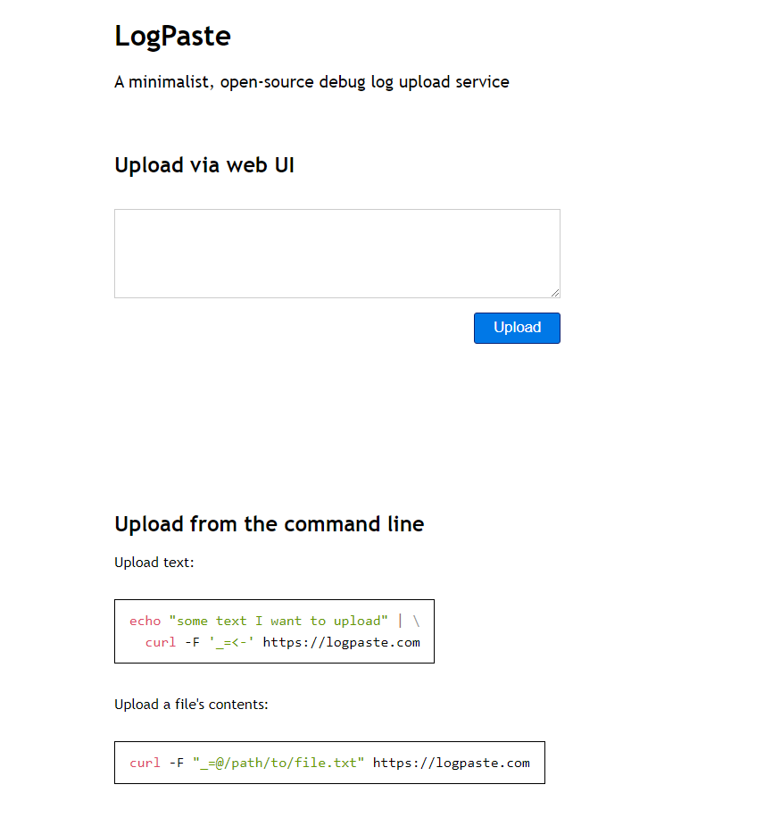

Four years ago to the day, I [quit my job as a developer at Google](/why-i-quit-google/) to experiment with bootstrapping a software business. I attempted several businesses for the first few years, and one finally caught on in 2020.

Previous updates:

* [My First Year as a Solo Developer](/solo-developer-year-1/)
* [My Second Year as a Solo Developer](/solo-developer-year-2/)
* [My Third Year as a Solo Developer](/solo-developer-year-3/)

## The year of scaling

TODO: Graph of money



**How can you afford to keep losing money?**

I went into more detail [in my year two retrospective](/solo-developer-year-2/#how-can-you-afford-to-keep-losing-money), but the short answer is: low cost of living, significant savings from my Google days, and passive investment income.



## TinyPilot's second year

In 2021, I focused mainly on TinyPilot, a company I created in mid-2020 (TODO: link). TinyPilot is an open-source KVM over IP device built on the Raspberry Pi. It allows you to control your computers from your browser without installing any software, even when the computer is in BIOS or has no network connectivity.

At the start of 2021, I was TinyPilot's sole developer. I was also the sole customer support person, salesperson, and marketer. My girlfriend managed fulfillment and inventory. We ran TinyPilot out of our house, where it was slowly occupying more and more territory.

Today, TinyPilot has a real office, a two-person fulfillment staff, a team of three developers, and even a [European distributor](https://kvm-ip.de).

The software has changed a lot in the last year, too. For fun, I installed the TinyPilot image from last January, and compared it to the latest release. I was surprised at how much has changed in just a year in just the UI:

TODO: GIF comparison

We've added several major features in the last year including:

* Mounting virtual USB drives and CD-ROMs
* Wake on LAN
* Password-based authentication
* System updates from the browser
* Video bandwidth tuning

One of my favorite moments of the year was when we got our first-ever product review from one of my favorite YouTube creators, Craft Computing. We sat on the couch and watched it on our TV, so the experience was fairly surreal.

That video led to the biggest sales jump we had ever seen at that point. And it was still just my girlfriend and I, so we were running around for two weeks trying to ship orders out fast enough and replenish our inventory even though sales were twice as large as any sales spike we planned for. It [exhausted us](/retrospectives/2021/02/#tinypilots-first-postmortem).

We were both lying awake at night hours after we went to bed because we were so wired from running around. It was stressful, but it was also exciting to be working on so much growth.



## Other projects

### *Refactoring English*

One of my 2021 goals (TODO: link) was to publish a book about techniques developers can use to improve their writing. I often hear developers say they struggle with writing, and I've learned several techniques that have made my writing more effective. I wanted to write a book capturing all the techniques I apply when writing.

My great shame of the year is that I made almost no progress on this book. I got about 80% done with the first chapter, and then put it on the backburner indefinitely.

I've had a morning ritual for the past three years of writing for an hour every morning. That generally translated to about ten blog posts per year. I thought that if I spent that time on a book instead, I'd be done within a year.

But that morning ritual worked in my pre-TinyPilot life. TinyPilot has its own pace that I don't fully control. For the first few months of 2021, I stuck to writing for an hour a day, but I'd end every day with a list of important, unfinished TinyPilot tasks. I decided to [suspend my writing](/retrospectives/2021/09/#can-i-afford-to-keep-writing) until TinyPilot slowed down, and then that never happened.

I'm still excited to write this book, and I hope I have more time for it this year.

### mtlynch.io (this blog)

As with my lack of book-writing time, I had very little blog-writing time. I published three new blog posts.

Ironically, the year that I have the least amount of time to write is the year that I had the most to write about. There are so many things I have to learn for TinyPilot that I wish I could write about and capture while it's still fresh in my mind, but there just isn't enough time.

I dif faithfully maintain my habit of writing [monthly retrospectives](/retrospectives/). I can budget time for those because they're so clearly a net positive for my business, even in the short term. Almost every retrospective I write, I recognize some flaw in my thinking or a weakness in my plans that I wouldn't have noticed had I not sat down to organize my thoughts and write everything out.

### Hit the Front Page of Hacker News

{{}}

At the beginning of the year, I released my first-ever paid course. It was a course teaching everything I've learned about writing blog posts that gain traction on tech-savvy sites like Hacker News and reddit.

I'm proud of the content of the course. I've heard positive feedback about the course, and a few people credited it with helping them write successful blog posts.

It earned $XX in its first year, and I was hoping for something closer to $20k. Had TinyPilot not been so busy, I think I could have spent more time marketing it and gotten closer to my goal. I still learned a lot about creating an educational product, and I'd like to do more of it in the future.



### Is It Keto

{{}}

I started [Is It Keto](https://isitketo.org) in 2018. It's a simple site that tells you whether or not particular foods fit the keto diet. It earns money from Amazon Affiliate links and Google AdSense.

I put the site on the backburner when I started TinyPilot, but it continued to grow on its own in 2021. In the second half of the year, another site appeared and continued adding content, so they quickly overtook Is It Keto in search results.

I did briefly explore the idea of moving to MediaVine, which is one of the higher-end ad networks. I've heard they pay 3-8x as much as AdSense. MediaVine accepted Is It Keto into their program, but then I discovered [how bad their contract terms are](/retrospectives/2021/09/#is-it-ketohttpsisitketoorg), so I bailed on them and stuck with AdSense.





#### Why don't you just sell the site?

I'd guess that market price for the site is $8-15k, but it would probably take 30-60 hours to go through the whole sales process. I think I'm better off spending that time on TinyPilot.



### Zestful

2021 was a nice comeback year for Zestful. The only work I did on it was to publish a Python SDK for it. I don't think that had anything to do with the growth.



### LogPaste

{{}}

I created LogPaste because I wanted an easy way for TinyPilot users to share their diagnostic logs with me. Every other solution I found was too heavyweight, so I created my own [using Go, SQLite, and Litestream](/litestream/).

LogPaste has worked out great. It works as I expected it to. It eliminates the hurdles users would normally face in sharing log files with me. Nobody has ever failed to figure it out or run into errors.

```bash
$ echo "hello, world!" | curl -F '_=<-' https://logpaste.com
http://logpaste.com/BQGczWYC
```

### What Got Done

I created What Got Done in 2019 as a lightweight way for team members to share weekly updates with each other. It never took off as a business, but I've continued working on it on weekends as a way to learn new technologies or do just-for-fun development.

My major What Got Done achievement in 2021 was migrating the site from Google Cloud Platform to fly.io. To replace Google Firestore, I used SQLite and Litestream, which achieved an XXx speedup on most requests. That change was a lot of fun, and I love the switch from Firestore to SQLite. I can replicate my production database locally in seconds [with a single command](https://youtu.be/_XuJaHJGgrc?t=2826). That would have been a week-long project with Firestore. And it's so easy for me to make schema changes because I can do that in simple scripts as well.

## Lessons learned

### Sell just one thing

For most of the year, TinyPilot earned between $20-30k per month in revenue. I sadly invested very little in marketing, as I was mostly running around trying to keep things .

The one marketing move I did use was sending review units to YouTubers with related audiences. For most of the year, the months where I broke $30k in revenue, it was a direct result of a popular YouTuber reviewing TinyPilot on their channel.

From October to December, my sales doubled and I didn't have any YouTube reviews. In fact, I didn't do any marketing at all.


With the chip shortage, I was afraid of running out of Raspberry Pis. I didn't want to fail to sell my flagship product because I used up all my Pis on my low-end product. So I got rid

After I got rid of the Hobbyist Kit, I decided to just get rid of the product index page entirely. I'd sell just the TinyPilot Voyager and see how that went.

Sales immediatley jumped. They haven't stopped.

It obviously simplifies things for inventory management, fulfillment, and customer support as well. So now I'm selling just one product.

### Good management attracts a good team

A few months ago, I caught up with my friend Matt on a video call. Matt and I met on the BitLocker team at Microsoft, where we were both hired straight out of college. He's one of the smartest developers I know, and he has incredibly incisive insight into software and organizations at both a high level and a low level.

He had followed TinyPilot's progress on my blog, but this was the first time we were talking about it directly. I was saying how lucky I was that I ended up with such a good team, both in terms of the developers I've hired and the local staff that run the TinyPilot office. Well, give yourself some credit. I know you, and you probably shaped that team by putting processes in place that allowed people to work well.

I think Matt's right about everything, so I have no choice but to accept his praise.

I of course still have a lot to learn about being a manager, but I think many of the early things I've done have contributed to building a good team. When we agree on a new process or policy, it's not just a verbal agreement or buried in an email somewhere. We update our documentation so that everyone on the team can see it and refer back to it easily.

I can't prove it, but I think it's true. I designed the TinyPilot jobs to be . And I put a lot of effort into defining expectations and process.

I think that's also good management...

### Leadership means helping teammates grow

In August, I listened to [an interview with WPEngine founder Jason Cohen](https://youtu.be/Sjs5gEUlZyU?t=3605).  One of the takeaways from me was what he said about how a good leader focuses on making their team better rather than just improving their own skills:

>With leadership, yes, you're trying to get the right answers, and goals, and decisions... You're also trying to build a team that's smarter and better, that's themselves making better decisions, themselves are coming up with better answers, themselves have better context. They're smarter in whatever that means. In whatever dimension that may mean. That's also the goal.
>
>If you're the only one who can do that in the room, you're a terrible leader. Because that means your team isn't getting better. That's the only way for the organization to succeed is if the team is getting better. And that's your job: to build great teams.

Handling rush orders.

Letting developers [peer review](/retrospectives/2021/08/#allow-developers-to-review-each-others-pull-requests)

Letting fulfillment staff take over customer support.

### Plan to fail for four years


## Favorite discoveries

* beancount
* Litestream
* TalkYard

## Grading last year's goals

At the start of last year, I [set three high-level goals](/solo-developer-year-3/#goals-for-year-four).

### Grow TinyPilot to $600k in annual revenue

* **Result**:
* **Grade**:

### Publish six blog posts and one book

* **Result**: Published two blog posts and zero books
* **Grade**: D

I got

I have more topics I want to write about than ever before but no time to write.

### Automate TinyPilot management

* **Result**:
* **Grade**: C

This time last year, I was still running TinyPilot out of my house, and my girlfriend and I were the only employees.

I've made a lot of progress in getting myself out of the critical path. I took a one-week vacation over the holidays, and that mostly worked fine, although I did have to do about 30 minutes of emergency work to prevent thousands of dollars of equipment from being sent back to China.

## Goals for year four

### Grow TinyPilot to $1M in annual revenue

There hasn't been any time for marketing. I think I should be able to explore more marketing channels. I've reached out to YouTube reviewers offering them review units, and that's been successful, but there are tons of paid marketing channels I haven't tested at all. I think there's a lot of room to grow.

 double revenue

### Reduce TinyPilot to 30 hours per week

This is a continuation of my goal from last time. I'd like to manage TinyPilot on 30 hours per week so that I have time left over to write and develop new skills.

I feel like I get stuck in what XX calls the urgent but unimportant quadrant. The time I enjoy TinyPilot the most are when I feel like I've gotten through all of my emails and I have time to think about new things to add. The times when I enjoy it least are when it feels like there are a thousand little things that need to get done, and I'm the only one in a position to do them.

## Do I still love it?

This has definitely been my most stressful year as a bootstrapped founder.

I love writing and programming, and the past year didn't leave me much time to do either. The nature of the business requires . My team is growing

I still prefer it to working for any employer I've had, but it's not a happy-go-lucky. I'd like to find ways back to the parts that I loved.

---

*Cover image by [Loraine Yow](https://www.lolo-ology.com/).*


<script src="/js/chart.js/2.9.4/Chart.min.js"></script>
<script>
const dollarFormatter = new Intl.NumberFormat('en-US', {
  style: 'currency',
  currency: 'USD',
  minimumFractionDigits: 0,
  maximumFractionDigits: 0,
});
function drawChart(chartId, labels, data) {
  const ctx = document.getElementById(chartId);
  if (!ctx) {
    return;
  }
  ctx.height = 300;
  const myChart = new Chart(ctx, {
      type: 'line',
      data: {
        labels: labels,
        datasets: [{
          label: 'Total Revenue',
          data: data,
          backgroundColor: '#047a15',
          borderColor: '#4ba658',
          fill: false,
          lineTension: 0.0,
          }]
        },
      options: {
        responsive: true,
        maintainAspectRatio: false,
        tooltips: {
          callbacks: {
            label: function(tooltipItems) {
              return dollarFormatter.format(parseFloat(tooltipItems.yLabel));
            },
          },
        },
        scales: {
              yAxes: [{
                  ticks: {
                    suggestedMin: 0,
                      callback: function(value) {
                          return dollarFormatter.format(value);
                      }
                  }
              }]
          }
      },
  });
}
// Parse a date string like "2020-05" into a JavaScript Date object.
function parseDate(d) {
  const dateParts = d.split('-');
  const year = parseInt(dateParts[0]);
  const month = parseInt(dateParts[1]) - 1;
  return new Date(year, month);
}
function drawCharts(limit) {
  fetch('/data/project-revenue.json')
    .then(res => res.json())
    .then(revenueByProject => {
      const limitDate = parseDate(limit);
      for ([project, data] of Object.entries(revenueByProject)) {
        let dates = [];
        for (d of Object.keys(data)) {
          const date = parseDate(d);
          if (date >= limitDate) {
            continue;
          }
          dates.push(date.toLocaleString('default', { month: 'long' }) + ' ' + date.getFullYear());
        }
        let values = Object.values(data).slice(0, dates.length);
        drawChart(project + '-revenue', dates, values);
      }
    });
}
/*
function drawOverallChart() {
  const ctx = document.getElementById("overall-finances");
  if (!ctx) {
    return;
  }
  ctx.height = 500;
  const myChart = new Chart(ctx, {
      type: 'bar',
      data: {
          datasets: [
            {
              label: 'Net Profit',
              data: [-20871, -2402, -3964],
              type: 'line',
              backgroundColor: 'black',
              borderColor: 'black',
              pointBorderColor: 'black',
              pointBackgroundColor: 'black',
              fill: false,
            },
            {
              label: 'Expenses',
              data: [-23133, -9657, -67441],
              backgroundColor: 'red'
            },
            {
              label: 'Revenue',
              data: [2262, 7254, 63477],
              backgroundColor: '#047a15'
            }
          ],
          labels: ['2018', '2019', '2020']
      },
      options: {
        responsive: true,
        maintainAspectRatio: false,
        tooltips: {
          callbacks: {
            label: function(tooltipItems) {
              return dollarFormatter.format(parseFloat(tooltipItems.yLabel));
            },
          },
        },
        scales: {
              yAxes: [{
                  ticks: {
                    suggestedMin: 0,
                      callback: function(value) {
                          return dollarFormatter.format(value);
                      }
                  }
              }]
          }
      },
  });
}*/
//drawOverallChart();
drawCharts("2022-01");
</script>
