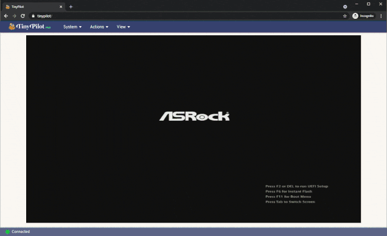

Four years ago, I [quit my job as a developer at Google](/why-i-quit-google/) to create my own self-funded software company.

For the first few years, all of my businesses flopped. They all operated at a loss, and none of them earned more than a few hundred dollars per month in revenue.

Halfway through my third year, I created a network administration device called [TinyPilot](https://tinypilotkvm.com). It quickly caught on, and it's been my main focus ever since. TinyPilot generated $460k in 2021, its first full year in operation.

In this post, I'll share what I've learned from TinyPilot about being a bootstrapped founder.

Previous updates:

- [My First Year as a Solo Developer](/solo-developer-year-1/)
- [My Second Year as a Solo Developer](/solo-developer-year-2/)
- [My Third Year as a Solo Developer](/solo-developer-year-3/)

## My first year of profit

After running in the red for the first few years, this is my first cashflow positive year. I earned a total of $13k in profit in 2021. Although TinyPilot generated the vast majority of revenue, most of my profit came from old projects running in the background.

<canvas id="total-finances" style="margin-bottom: 50px;"></canvas>

| Metric         | 2020                                 | 2021                                   | Change               |
| -------------- | ------------------------------------ | -------------------------------------- | -------------------- |
| Revenue        | $63,477                              | $478,638                               |      |
| Expenses       | -$67,441                             | -$464,071                              |      |
| **Net Profit** | **-$3,964** | **$14,518** | **** |



**How can you afford to live on so little money?**

I went into more detail [in my year two retrospective](/solo-developer-year-2/#how-can-you-afford-to-keep-losing-money), but the short answer is: low cost of living, significant savings from my Google days, and passive investment income.



## TinyPilot's second year

{{}}

TinyPilot is an open-source KVM over IP device [built on the Raspberry Pi](/tinypilot). It allows you to control another computer from your browser without installing any software, even if the computer has no operating system or network connectivity.

At the start of 2021, I was TinyPilot's sole developer, customer support agent, salesperson, and marketer. The only other employee was my girlfriend, who managed inventory and fulfilled orders. We ran TinyPilot out of our Western Massachusetts home, which was slowly transforming into a TinyPilot warehouse.

Today, TinyPilot has a real office, a two-person fulfillment staff, a team of three developers, and a [distributor in Europe](https://kvm-ip.de).

{{}}

### TinyPilot finances

For most of the year, TinyPilot's sales were inconsistent. We saw spikes when popular tech reviewers featured TinyPilot, but sales always dwindled afterward.

Starting in September, we partnered with a European distributor and refocused our website (more on that [below](#sell-just-one-thing)). Those changes smoothed out our sales and made the business less reliant on luck or external events.



| Income/Expense | 2020    | 2021     | Change           |
| -------------- | ------- | -------- | ---------------- |
| Sales          | $53,742 | $459,529 |  |

<<<<<<< HEAD
| Credit card rewards | $0 | $1,139 |  |
=======

> > > > > > > master
> > > > > > > | Raw materials | -$46,143 | -$248,273 |  |
> > > > > > > | Software development | -$1,321 | -$119,015 |  |
> > > > > > > | Electrical engineering consulting | -$7,130 | -$28,662 |  |
> > > > > > > | Fulfillment staff | -$2,570 | -$25,893 |  |
> > > > > > > | Web design / branding | -$250 | -$15,931 |  |
> > > > > > > | Cloud services | -$64 | -$5,554 |  |
> > > > > > > | Office space | $0 | -$4,400 |  |
> > > > > > > | Advertising | -$675 | -$3,633 |  |
> > > > > > > | Office equipment | $0 | -$2,083 |  |
> > > > > > > | Everything else | $0 | -$2,738 |  |
> > > > > > > <<<<<<< HEAD

# | **Net profit** | **-$5,681** | **$4,247** | **** |

| **Net profit** | **-$5,681** | **$3,108** | **** |

> > > > > > > master


**Note**: Net profit is a little misleading, as it doesn't reflect the additional $59k I have in inventory.


### TinyPilot's software development

For fun, I installed TinyPilot's January 2021 release and compared it the current version. I was surprised at how much has changed in the last year:

Aside from UI changes, we've added several major features, including:

- Mount virtual USB drives and CD-ROMs
- Wake on LAN
- Password-based authentication
- Software updates from the web UI
- Video bandwidth tuning

## Other projects

### _Refactoring English_

In building this blog over the past five years, I've learned several techniques that have made my writing clearer, more interesting, and better at attracting readers. One of my [2021 goals](/solo-developer-year-3/#publish-six-blog-posts-and-one-book) was to share what I've learned in a book called [_Refactoring English_](https://refactoringenglish.com). It would teach writing skills specifically to software developers.

My great shame of the year is that I made almost no progress on the book.

For the past three years, I've had a routine of writing for an hour every morning. That generally translated to about ten blog posts per year. I thought if I spent that time on the book, I'd finish within the year.

Unfortunately, TinyPilot has its own pace that I don't fully control. For the first few months of 2021, I stuck to my writing habit, but I'd end every day behind on TinyPilot. I decided to pause my writing until TinyPilot required less management, but I'm not there yet.

I'm still excited to write the book, and I hope to have more time for it this year.

### mtlynch.io (this blog)

As with my lack of book-writing time, I had very little blog-writing time. I only published three new blog posts, my fewest ever in five years of blogging.

Ironically, it's when I'm most desperate to write that I have the least time to do it. There are so many things I've learned for TinyPilot that I wish I could capture while they're still fresh, but there just isn't enough time.

I kept my habit of writing [monthly retrospectives](/retrospectives/). I budget time for those because they're unambiguously a net positive for my business. Sitting down to organize my thoughts almost always reveals some flaw in my strategy or a weakness in my plans that I wouldn't have noticed otherwise.

| Metric                                                   | 2020                               | 2021                               | Change               |
| -------------------------------------------------------- | ---------------------------------- | ---------------------------------- | -------------------- |
| Pageviews                                                | 719,899                            | 479,666                            |      |
| Affiliate revenue\*                                      | $1,599                             | $0                                 |      |
| [Illustrations](/how-to-hire-a-cartoonist/)              | -$964                              | -$384                              |      |
| Hosting / Domain                                         | -$534                              | -$306                              |      |
| [Editing](/editor/) + [Grammarly](https://grammarly.com) | -$222                              | -$140                              |      |
| **Net profit**                                           | **-$121** | **-$830** | **** |



\* I [dropped all affiliate partnerships](https://twitter.com/deliberatecoder/status/1342847048811499523) from this blog at the end of 2020.



### Hit the Front Page of Hacker News

{{}}

At the beginning of the year, I released my first-ever [paid course](https://hitthefrontpage.com). It explained my approach to writing blog posts that gain traction on tech-oriented sites like Hacker News and reddit.

I'm proud of the content, and I've heard positive feedback from students. A few of them credited the course with helping them write blog posts that reached the #1 spot on Hacker News.

The course earned $7.5k in sales, which fell disappointingly short of my $20k goal. Had TinyPilot not been so busy, I could have spent more time marketing the course. Still, the experience taught me a lot about creating educational products, and I'd like to do more of that in the future.



| Metric         | 2020                               | 2021                                  | Change               |
| -------------- | ---------------------------------- | ------------------------------------- | -------------------- |
| Purchases      | 29                                 | 230                                   |      |
| Revenue        | $0                                 | $7,483                                |      |
| Expenses       | -$983                              | -$148                                 |      |
| **Net profit** | **-$983** | **$7,335** | **** |

### Is It Keto

{{}}

I started [Is It Keto](https://isitketo.org) in 2018. It's a simple site that tells you whether or not particular foods fit the keto diet. It earns money from Amazon Affiliate links and Google AdSense.

I put the site on the back burner when I started TinyPilot, but it continued to grow on its own in 2021, providing a nice side income of $500-$1k/month. That slowed down around June, as other sites began offering similar content and supplanted Is It Keto in search results.

I considered selling the site but, I suspect it's only worth $5-10k. It would probably take 30-60 hours to go through the sales process, and I'd rather focus on TinyPilot.

| Metric                                                              | 2020                                  | 2021                                  | Change               |
| ------------------------------------------------------------------- | ------------------------------------- | ------------------------------------- | -------------------- |
| Pageviews                                                           | 1,314,583                             | 1,163,745                             |      |
| Ad revenue                                                          | $2,934                                | $5,252                                |      |
| Affiliate revenue                                                   | $2,147                                | $2,022                                |      |
| Freelance designers and [content writers](/hiring-content-writers/) | -$105                                 | $0                                    |      |
| Hosting / domain                                                    | -$241                                 | -$240                                 |      |
| **Net profit**                                                      | **$4,753** | **$7,034** | **** |

### Zestful

{{}}

Zestful is a paid service that parses recipe ingredients into structured data. For example, if you give it the string `"2 1/2 tablespoons finely chopped parsley"`, it tells you that the quantity is `2.5`, the product is `parsley`, the preparation step is `finely chopped`, etc.

I created Zestful in 2019 and worked on it for a few months before writing it off as a failure. It attracted clients every few months for one-time bulk parses, but it never generated revenue consistently.

2021 was a gratifying comeback year for Zestful. Starting midyear, its revenue became more regular. New clients started building on top of Zestful, and old clients increased their usage. It regularly earns a few hundred dollars per month and crossed $1k from pay-as-you-go users for the first time in December.



| Metric           | 2020                                  | 2021                                  | Change               |
| ---------------- | ------------------------------------- | ------------------------------------- | -------------------- |
| Revenue          | $1,889                                | $2,495                                |      |
| Hosting / domain | -$112                                 | -$113                                 |      |
| **Net profit**   | **$1,777** | **$2,382** | **** |

## Lessons learned

### Sell just one thing

For most of the year, TinyPilot earned between $20k and $30k in monthly revenue. The months where sales jumped were because of positive reviews, mainly on YouTube.

Starting in October, revenues doubled to $40-60k/month, but TinyPilot didn't receive any new reviews in those months. In fact, I didn't do any marketing at all.

So, what doubled sales? I got rid of our product page.

{{}}

Instead, I focused the website exclusively on our flagship product, the TinyPilot Voyager.

{{}}

Sales jumped immediately. At first, I thought it might be a coincidence, but they've stayed in their new range for several months now.

{{}}

I think the change eliminated friction and decision-making from the buying process. Customers didn't always understand the difference between our products or whether they needed to buy accessories separately. Now that there's only a single option, the purchase decision reduces to a straightforward question: do you want this product?


**Note**: I considered taking this strategy one step further and selling zero products. That would logically increase my revenue to infinity, but I didn't want to be greedy.


### Good leadership means helping teammates grow

{{}}

In a [recent interview](https://youtu.be/Sjs5gEUlZyU?t=3605), [WPEngine](https://wpengine.com) founder Jason Cohen described leadership in a way that stuck with me:

> With leadership, yes, you're trying to get the right answers, and goals, and decisions... You're also trying to build a team that's smarter and better, that's themselves making better decisions, themselves are coming up with better answers, themselves have better context...
>
> If you're the only one who can do that in the room, you're a terrible leader. Because that means your team isn't getting better.
>
> **The only way for the organization to succeed is if the team is getting better. And that's your job: to build great teams.**

When I started TinyPilot, I thought good management meant protecting my employees from anything outside their job description. I worked hard to fill gaps between roles to ensure that my employees had consistent, focused work.

Over time, I realized that my protectiveness limited growth. People enjoy learning and evolving in their careers. If I prevent employees from doing anything beyond their original job, it hinders their development.

In October, Eric, a member of TinyPilot's fulfillment staff, was interested in increasing his hours. We decided to share the customer support load I'd been carrying alone. I'd previously considered delegating support, but I worried it required technical knowledge that only I had.

As soon as Eric began working on the support queue, I realized we should have done it earlier. I overestimated the difficulty of our customers' technical questions. Eric could solve most issues by referring to our help forum and email archives. When he couldn't, he'd just escalate to me. Now, Eric handles about 70% of support emails without me.

Eric was surprised at how much he enjoyed taking over customer service. Talking to our customers has made him feel more invested in the business and gives him more insight into how his work benefits them.

And remember my big insight about [consolidating TinyPilot to a single product](/solo-developer-year-4/#sell-just-one-thing)? That happened the same month that Eric started sharing customer support with me. It's no coincidence. Ceding that task gave me back several hours per week of free time, allowing me to think critically about the way customers see TinyPilot.

## Grading last year's goals

At the start of last year, I [set three high-level goals](/solo-developer-year-3/#goals-for-year-four).

### Grow TinyPilot to $600k in annual revenue

- **Result**: Quadrupled TinyPilot's monthly revenue, totaling $468k for the year
- **Grade**: B

Okay, my $600k goal turned out to be a tad optimistic. I chose that target in January when revenue had grown 20-200% every month for the previous five months. After I announced that goal, TinyPilot's sales shriveled by 50% over the next two months. We recovered but never recaptured the rapid growth of the early days.

Still, $468k is nothing to sneeze at. Different decisions might have brought me to $600k, but nothing stands out as an egregious blunder.

### Publish six blog posts and one book

- **Result**: Published three blog posts and zero books
- **Grade**: D

Writing is one of the things I enjoy most, so I'm disappointed I had so little time for it.

Looking back, I still feel like deprioritizing my writing was the right decision, but I fell short of the goal I set.

### Automate TinyPilot management

- **Result**: Systematized enough of TinyPilot to take a one-week vacation
- **Grade**: B-

I've made great progress removing myself from the critical path of TinyPilot's day-to-day operations.

My goal was to be able to take a two-week vacation, but I'm not quite there yet. I took a one-week vacation over the holidays, where I didn't check work email or monitor sales. That went well, though I did have to take a call from FedEx to prevent thousands of dollars of equipment from being sent back to China.

## Goals for year four

### Grow TinyPilot to $1M in annual revenue

I've never invested in marketing as much as I should for TinyPilot. I've been fortunate that the business survives almost exclusively on word of mouth and organic search. The only marketing I've done is sending free units to YouTube creators. That's been successful, but there are tons of marketing channels that I've never explored at all.

I think the right marketing channels could double my current revenue. And if I double to $900k, why not make it a cool million?

### Manage TinyPilot on 20 hours per week

The times when I enjoy TinyPilot most are when things are running smoothly enough that I have space to think about growth. The least pleasant times are when I have a thousand short-term tasks, and they're too urgent or scattered to delegate.

This year, I'd like to continue systematizing TinyPilot so that everything runs smoothly if I only spend 20 hours per week on management. That would also give me time to write and code, neither of which I do now.

### Ship a new TinyPilot hardware product

TinyPilot runs on top of the [Raspberry Pi](https://www.raspberrypi.org) single-board computer. The Pi has been fantastic in getting TinyPilot up and running, but we're starting to feel its limitations as we grow.

I plan to work with my electrical engineering vendor to develop a new TinyPilot product. It will eliminate the Raspberry Pi and instead use a custom board that we can optimize for our customers' needs.

## Do I still love it?

When I do these [annual writeups](/tags/annual-review/), I always think about whether I still love being a bootstrapped founder. This is the first year where it's difficult to say yes. I still like my job, but it's not as fun and easy as when I was just building unsuccessful software products and blogging about it.

I enjoy feeling like I run a real business. Before TinyPilot, my businesses typically earned less than $500/month. At that scale, I felt too limited by capital. You can't hire for skilled roles or pay for expert guidance with $500. I frequently had to solve uninteresting problems simply because my revenue was too small to justify better solutions.

With TinyPilot, there's enough money coming in to hire teammates where it makes sense. After three years of coding by myself, I appreciate working with a talented dev team again. I pay $200/month for dev tooling and continuous integration because eliminating that gruntwork is obviously a net positive. In my previous businesses, those tools would consume most of my revenue.

I'm pleased to have a company culture that matches what I always wanted to see from my employers. Everyone has flexible hours. There are no tight deadlines, so we don't have to compromise on quality. Almost all of our work is asynchronous, so everyone has the space to do [deep, focused work](/book-reports/deep-work/).

The hardest part for me about running a business with thousands of real customers is being responsible for failure. We're a team, but the buck ultimately stops with me. When I ship a serious bug or fail to launch a new product by the date I predicted, I find it painful and personally embarrassing. It's a completely different experience from being a developer at Microsoft or Google, where I shared responsibility with teammates who reviewed my work, and we were all eight layers removed from real customers.

Overall, I'm still happy to be working for myself, and I hope to sustain it for the rest of my working life.



---

_Cover image by [Loraine Yow](https://www.lolo-ology.com/). Thanks to the [Blogging for Devs community](http://bloggingfordevs.com/) for providing early feedback for this post._

