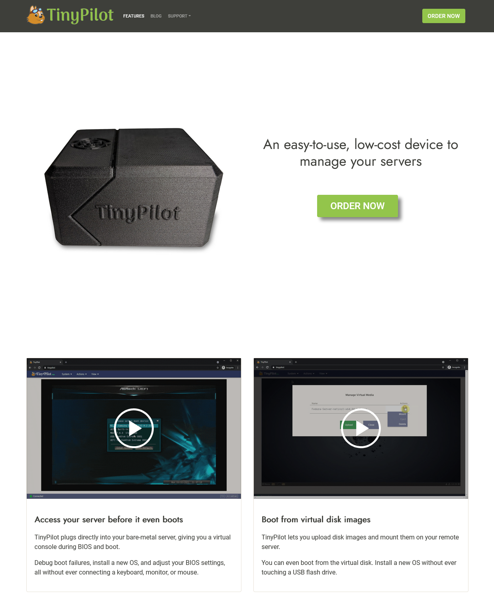
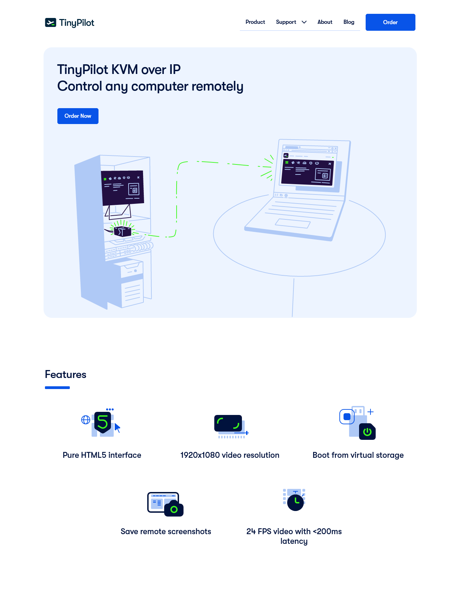
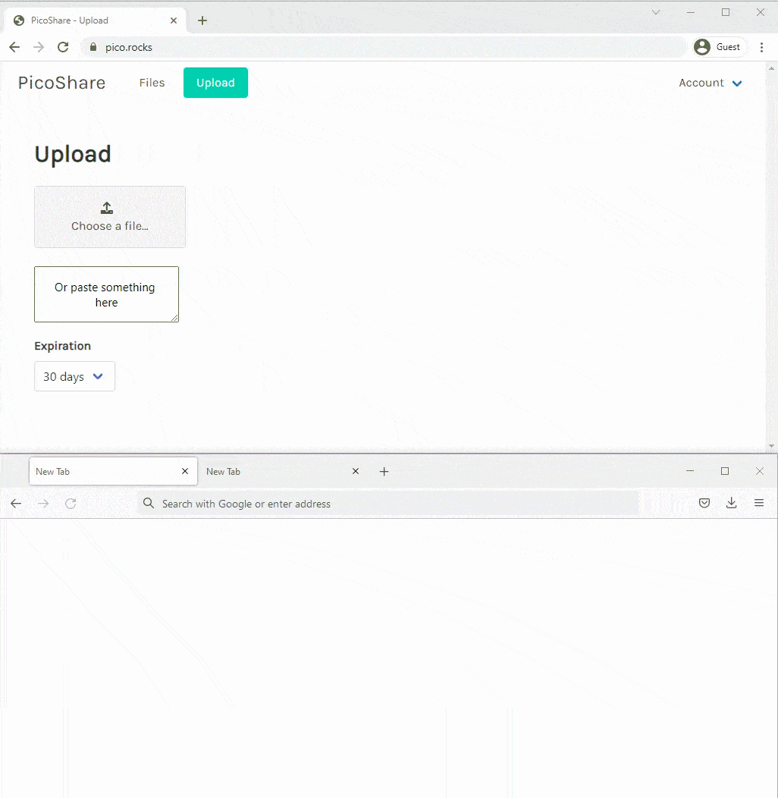
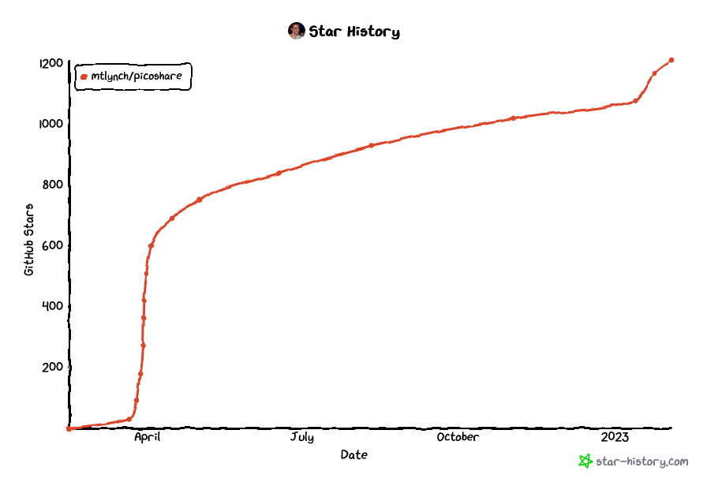

Five years ago, I [quit my job as a developer at Google](/why-i-quit-google/) to create my own bootstrapped software company.

For the first few years, all of my businesses flopped. None of them earned more than a few hundred dollars per month in revenue, and they all had negative profit.

Halfway through my third year, I created a device called [TinyPilot](https://tinypilotkvm.com). It allows users to control their computers remotely without installing any software. The product quickly caught on, and it's been my main focus ever since.

In 2022, TinyPilot generated $812k in revenue, a 76% increase from 2021.

In this post, I'll share what I've learned about being a bootstrapped founder from my fifth year at it.

## Previous updates

- [My First Year as a Solo Developer](/solo-developer-year-1/)
- [My Second Year as a Solo Developer](/solo-developer-year-2/)
- [My Third Year as a Solo Developer](/solo-developer-year-3/)
- [My Fourth Year as a Bootstrapped Founder](/solo-developer-year-4/)

## Highlights from the year

### TinyPilot grew annual revenue to $812k



| Income/Expense                    | 2021      | 2022      | Change           |
| --------------------------------- | --------- | --------- | ---------------- |
| Sales                             | $459,529  | $807,459  |  |
| Credit card rewards               | $2,241    | $4,327    |  |
| Raw materials                     | -$224,046 | -$333,656 |  |
| Payroll                           | -$142,744 | -$206,187 |  |
| Electrical engineering consulting | -$28,662  | -$124,643 |  |
| Advertising                       | -$3,873   | -$51,764  |  |
| Web design / branding             | -$15,931  | -$30,215  |  |
| Postage                           | -$24,227  | -$30,779  |  |
| Cloud services                    | -$5,553   | -$7,865   |  |
| Office space                      | -$4,400   | -$6,600   |  |
| Equipment                         | -$2,083   | -$5,915   |  |
| Everything else                   | -$4,902   | -$8,183   |  |
| **Net profit**                    | $5,349    | $5,979    |  |

While it sounds impressive to grow revenue by $350k, it's a little less exciting that I'm only walking away with $6k in profit. I don't pay myself a salary, so $6k is what I earned from the business. Still, I'm excited about these numbers and what they mean for 2023.

One of the major cost increases was electrical engineering. Throughout 2021, TinyPilot's electrical engineering vendor was struggling to keep up with TinyPilot's needs. In late 2021, I switched to a new vendor that fits our needs better, but they cost three times as much.

The ongoing chip shortage forced us into costly redesigns, which bloated costs for both engineering hours and raw materials. We were frequently in a race to redesign a circuit board before we ran out of our existing version, so we paid a premium to expedite everything and often ended up with unusable leftover components.

We finally escaped the redesign treadmill in September. I'm hopeful that TinyPilot's fourth quarter 2022 results will be reflective of the coming year. Our profit was $28.6k for the quarter, which is $9.5k per month. If I can sustain that for 2023, I'll be happy.

### TinyPilot got a new website

When I launched TinyPilot in 2020, I told myself the website and logo were just placeholders. Then, things took off so quickly that I never had time to replace them.

In 2022, I finally hired a design agency to create a new logo and redesign the website.


{{}}
{{}}


I wrote previously about how [frustrating and expensive](/tinypilot-redesign) it was working with the design agency, but I'm pleased with the result. My old website looked like a hobby project, and the new design looks like a real company.

### The TinyPilot team grew from six people to seven

At the end of 2021, the TinyPilot team was:

- Me, the sole founder
- Three software developers
- Two local staff who handle assembling devices and fulfilling orders
  - One of whom also handled customer service

By the end of 2022, we had added two support engineers and adjusted responsibilities, so the team is now:

- Me, the sole founder
- **Two** software developers
- Two local staff who handle assembling devices and fulfilling orders
  - **Both now work on customer service**
- **Two support engineers**

Adding the support engineers felt like the final piece of the puzzle. Before they joined, I was the only person handling technical support, and I was spending [about 20% of my time](/retrospectives/2022/02/#how-can-i-manage-tinypilot-with-only-20-hours-per-week) on support requests. Now, I spend less than 5% of my time on support requests, and customers receive faster support.

The support engineers also do things I didn't have time for like investigating complex bugs, writing documentation, and improving our diagnostic tools.

Growing the team stretched my skills as a manager. In 2021, TinyPilot's workflows were fairly simple. Almost everyone did their work as a single-person unit. The results either went directly to a customer or to me. When employees needed to coordinate with each other, it was always among teammates of the same role.

Integrating support engineers meant figuring out how different teams work together. How do support requests work when they require coordination between fulfillment staff and support engineers? What's the feedback loop between the support engineers and the dev team?

### PicoShare became my fastest-growing project

One of my pet peeves in the last few years is how difficult it is to share a single file with cloud storage providers like Google or Dropbox. They won't give you a direct link to your file &mdash; just a link to *their* web interface, where they pressure your recipient to sign up for an account. If you upload a video, Google Drive makes you wait 15+ minutes while they re-encode it, even if it was optimized to play in the browser in the first place.

So, I made a minimalist file sharing app called [PicoShare](https://github.com/mtlynch/picoshare). You just upload a file, and it gives you a direct link that you can share. Easy! No re-encoding, no prompts to sign up for anything.

<figure class="picoshare-demo">

<figcaption>Demo of PicoShare</figcaption>
</figure>

PicoShare become the fastest growing open-source project I ever published. It received 600 Github stars within two weeks of release. As of this writing, PicoShare has [over 100k installs](https://hub.docker.com/r/mtlynch/picoshare/).

{{}}

There are a few open-source tools that offer [similar functionality](https://github.com/awesome-selfhosted/awesome-selfhosted#file-transfer---single-click--drag-n-drop-upload), but PicoShare is unique in not requiring a database server. That means you can run it in a single Docker container, whereas other solutions require more complicated orchestration.

## Lessons learned

### Don't become anyone's smallest client

I made many mistakes throughout the whole [TinyPilot website redesign fiasco](/tinypilot-redesign), but the core problem was that the design agency was a fundamental mismatch for TinyPilot.

All of the agency's other clients had projects 5-20x the size of TinyPilot's. At first, I thought that was such a gift &mdash; this fancy agency with expensive clients was betting on a little company like mine.

The reality was that TinyPilot was the agency's lowest priority. They managed the project poorly, which drove up costs, bloated scope, and stretched out timelines.

Now, when I work with new vendors, I ask them how my company compares to their other clients. If I'm an outlier in any important dimension like size, revenue, or industry, I look elsewhere.

### Run at 50% capacity

Wouldn't it be wonderful if your business' capacity perfectly matched your customers' needs? Your employees would fulfill every order and satisfy every support request while working working exactly 40 hours per week. They'd never feel overworked nor underworked, and there'd be no wasted time.

In practice, that would be a terrible system. Running at 100% utilization means you have no margin for error. You'd spiral into a crisis over typical events like employees taking vacation or sales experiencing a spike.

I aim for everyone at TinyPilot to run at around 50% capacity. That is, a balance of 50% reactive work and 50% proactive work. For some roles, the balance isn't quite 50/50, but it's a good rule of thumb.

The clearest example of a 50/50 split is the the technical support team: they spend around half of their time responding to support requests and half of their time finding ways to save users from needing support. The proactive tasks include fixing bugs in the product, writing documentation, and improving our diagnostic tools.

Every TinyPilot team comprises two people. When one person is unavailable, the other can suspend their proactive work and handle time-sensitive tasks without feeling overwhelmed. If we get a rush because a popular YouTube channel [mentions us](/retrospectives/2022/12/#tinypilothttpstinypilotkvmcomrefmtlynchio-stats), we have spare capacity to absorb the bump.

| Team                | Reactive tasks                                                                             | Proactive tasks                                                                                            |
| ------------------- | ------------------------------------------------------------------------------------------ | ---------------------------------------------------------------------------------------------------------- |
| Founder             | Team management Vendor management Reviewing work Filling gaps in responsibilities | Marketing Sales Re-evaluating strategy Hiring and training                                        |
| Support engineers   | Answering technical support questions                                                      | Writing documentation Writing tutorials Investigating difficult bugs                                |
| Software developers | Fixing urgent bugs Releasing new features                                               | Improving dev experience Creating automated tests Fixing non-urgent bugs |
| Fulfillment staff   | Assembling devices Fulfilling orders Customer service                                | Creating support playbooks Assisting in marketing                                              |

### Ansible and git are not software distribution tools

When I started working on TinyPilot, I didn't know how to distribute Linux software.

To publish the first prototype of TinyPilot, I used the tools that I knew: bash scripts, Ansible, and git. The [bash script](https://github.com/tiny-pilot/tinypilot/blob/2a97cf02bd6e032a2fc60846d7d2c60be92c7c74/quick-install) bootstrapped an Ansible environment and executed an Ansible playbook. Ansible installed dependencies, made necessary changes to the operating system, and cloned the TinyPilot git repository.

The installation process was okay, not great. It was slow but reliable and didn't require users to configure anything manually.

Two years later, TinyPilot's update process was a mess. It still relied on the same shaky foundations from the prototype, except now there was complex web of interdependencies. Ansible roles depended on Git repositories, which depended on other Ansible roles, which depended on parameters in a bunch of YAML files. Minor changes could swallow weeks of development time.

All this because I never bothered to learn standard Linux packaging tools.

This year, the TinyPilot learned to use Debian packages. It was far less painful than I'd feared. I thought we'd have to deploy all sorts of package servers and key servers, but it turns out we didn't need any of that. The process was relatively easy once we found [the right guides](/retrospectives/2022/12/#getting-out-of-the-ansible-hole).

Debian packages have accelerated our development. The tooling catches expensive mistakes earlier, and we can deploy pre-release versions to physical test devices easily, whereas our previous installation system made that process prohibitively complex.

## Grading last year's goals

### Grow TinyPilot to $1M in annual revenue

- **Result**: Grew TinyPilot's revenue by 76% to $812k
- **Grade**: B

I always knew that $1M was an aggressive goal. We fell short, but I'm still impressed at how close we came.

### Manage TinyPilot on 20 hours per week

- **Result**: I spent more time managing TinyPilot in 2022 than in 2021.
- **Grade**: D

I worked about 40-50 hours per week. I wrote a little more on my blog and participated slightly more in TinyPilot's software development.

I added a new team, and people expanded their roles. It's not just the work of training a new person, it's defining how they fit into other processes. And the more people you have, the more complexity there is in designing workflows that involve multiple people and multiple teams.

### Ship the TinyPilot Voyager 3

- **Result**: We never even completed the design phase
- **Grade**: D

TinyPilot has always used the Raspberry Pi 4B as the core hardware. The 4B is relatively expensive, and it's difficult to engineer extra hardware functionality on top of it.

My plan for 2022 was to create a custom circuit board built around the slimmer, less expensive Raspberry Pi Compute Module 4. That could cut our manufacturing costs by up to 60% and simplify our hardware design.

Instead, all of our hardware engineering time went to chasing down manufacturing issues and supply shortages, so we made no progress on a new product.

## Goals for year six

### Manage TinyPilot on 20 hours per week

I failed miserably at reducing my hours last year, but it's now my top priority.

I'm hopeful that I'll be more successful at reducing my management time this year. Most of my management work in 2022 was growing teams that can independently manage TinyPilot's day-to-day operations. It required a lot of up front investment in hiring, training, and defining processes, but I expect that investment to pay off in 2023.

### Earn $100k in profit

For most of 2023, TinyPilot's production will be [constrained by supply](/retrospectives/2023/01/#losing-450k-in-a-single-email), so I'm going to focus on profit rather than growth.

In previous years, I've focused on growth. For a hardware business to work, you need to be at a certain scale. At this point, I'm at the scale where I'd feel happy maintaining this indefinitely.

TODO: Expand on this.

### Close the TinyPilot office

I leased a physical office space for TinyPilot [in early 2021](/retrospectives/2021/05/#tinypilots-new-office-the-fun-stuff). We use it for assembling devices, fulfilling orders, and storing inventory.

Having our own local office has helped us adapt quickly to changes in our hardware and processes, but it's a lot of extra overhead. This year, I hope to move the assembly process to China, where all of our parts originate. I'm also in the process of moving our fulfillment to a third-party logistics vendor. If we can pull this off, TinyPilot and its employees will have more flexibility in time and location, since

## Do I still love it?

Every year, when I write these blog posts, I ask myself whether I still love what I'm doing.

2022 was a hard year &mdash; certainly my hardest since going off on my own. I wasn't miserable, but I can't say I _loved_ it.

The things I enjoy doing most are programming and writing, and the past year gave me little time for either. I spent most of my time on TinyPilot scrambling to keep up with demand, filling in gaps as we grew, and putting out small fires.

I grew as a manager. I learned more about hiring and coordinating in an organization with more complexity.

I'm hopeful that this year was hard because I was doing a lot of things that will pay dividends over the next few years.

I still prefer working for myself to working for an employer, and I plan to do it indefinitely.

---

_Cover image by [Loraine Yow](https://www.lolo-ology.com/). Thanks to the [Blogging for Devs community](http://bloggingfordevs.com/) for providing early feedback for this post._

