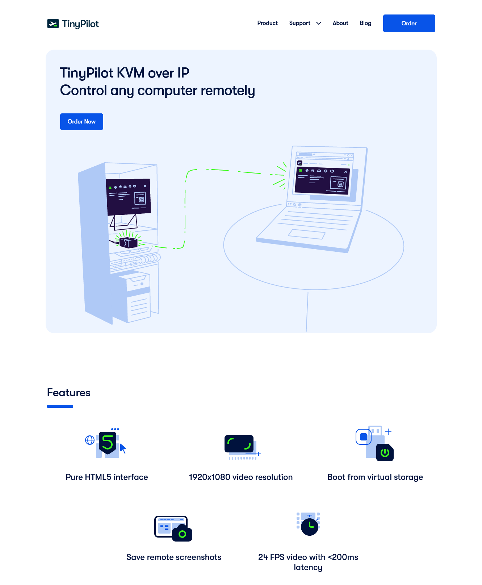

Five years ago, I [quit my job as a developer at Google](/why-i-quit-google/) to create my own bootstrapped software company.

For the first few years, all of my businesses flopped. None of them earned more than a few hundred dollars per month in revenue, and they all had negative profit.

Halfway through my third year, I created a network administration device called [TinyPilot](https://tinypilotkvm.com). It quickly caught on, and it's been my main focus ever since.

In 2022, TinyPilot generated $812k in revenue, a XX% increase from 2021.

In this post, I'll share what I've learned in my fifth year about being a bootstrapped founder.

## Previous updates

- [My First Year as a Solo Developer](/solo-developer-year-1/)
- [My Second Year as a Solo Developer](/solo-developer-year-2/)
- [My Third Year as a Solo Developer](/solo-developer-year-3/)
- [My Fourth Year as a Bootstrapped Founder](/solo-developer-year-4/)

## Highlights from the year

### TinyPilot got a new website

When I launched TinyPilot in 2020, I told myself the website and logo were just placeholders until I found out if there was any demand for the product. But then things took off so quickly that I got so busy.

In 2022, I finally hired a design agency to develop a new logo and redesign the website.


{{}}
{{}}


The process of working with the agency was an extremely frustrating and expensive process that I [wrote about previously](/tinypilot-redesign), but the results have been great. I never tested it rigorously, but my gut feeling is that the website is responsible for the steady increase in sales we saw in 2022.

### The TinyPilot team grew from five people to seven

At the end of 2021, the TinyPilot team was:

- Me, the sole founder
- Two software developers
- Two local staff who handle assembling devices and fulfilling orders
  - One of the two was also doing customer service

At the end of 2022, we added two support engineers and adjusted responsibilities:

- Me, the sole founder
- Two software developers
- Two local staff who handle assembling devices and fulfilling orders
  - **Both now work on customer service**
- **Two support engineers**

Adding the support engineers felt like finding the missing piece of the puzzle. Before they joined, I was the only person handling technical support, and I was spending [about 20% of my time](/retrospectives/2022/02/#how-can-i-manage-tinypilot-with-only-20-hours-per-week) on support requests. Now, I spend less than 5% of my time on support requests, and customers receive faster support. The support engineers also do things I didn't have time for like investigating complex bugs, writing documentation, and improving our diagnostic tools.

The team changes also stretched my skills as a manager. In 2021, TinyPilot's workflows were fairly simple, organizationally speaking. Everyone could do their work as a single person unit and either hand the result to a customer or to me. Adding support engineers meant figuring out how different teams work together. How does the customer service team escalate an issue to the support engineering team? How does the support engineering team coordinate product changes with the software development team?

### PicoShare became my fastest-growing project

One of the annoying situations I ran into running TinyPilot and in my personal life was sharing files that are too large for email. I'd often want to share a 15 MB screen capture demonstrating some workflow or bug, but that's a little bit obnoxious to send by email.

I didn't like any of the existing solutions. Google Drive would insist on making you wait for 15 minutes so they can re-encode the video. And they don't give you a direct link to a file. Your recipients have to go through the Google Drive UI. And sometimes Google refuses to serve the file unless the recipient has a Google Drive account. Dropbox is a little better, but it has similar issues.

So, I made a minimalist file sharing app called [PicoShare](https://github.com/mtlynch/picoshare). You just upload a file, and it gives you a direct link that you can share. If the file is a video, you can stream it immediately. If it's a file download, recipients can download it immediately.

<figure class="picoshare-demo">

<figcaption>Demo of PicoShare</figcaption>
</figure>

The other neat/bizarre thing about PicoShare is that it uses SQLite for storage, including all file uploads. It's an unusual choice, but it means that I can integrate with [Litestream](https://litestream.io), a tool that replicates SQLite databases in real time. You can blow away a server without warning, and then the next time you run it, it will simply restore itself from the replicated data in cloud storage. I first explored this technique with LogPaste, which I [wrote about more in 2021](/litestream/).

PicoShare become the fastest growing project I ever published. It received 600 Github stars within its first two weeks of release.

{{}}

As of this writing, PicoShare has [over 100k installs](https://hub.docker.com/r/mtlynch/picoshare/). It became popular among users who like to run their own servers because PicoShare is simpler and easier to install than open-source tools like Nextcloud.

## Lessons learned

### Don't become anyone's smallest client

I made many mistakes throughout the whole TinyPilot website redesign fiasco (TODO: link), but the core problem was a mismatch between the agency and TinyPilot as a client.

All of the design agency's other clients were spending 10-100x as much as I was. At first, I thought that was such a gift &mdash; this fancy agency with expensive clients was betting on a little company like TinyPilot. The reality turned out to be that TinyPilot was the agency's lowest priority, so they ran the project poorly and drove up costs and stretched out timelines much more than I wanted.

When I work with new vendors now, I ask them how my company compares to their clients. If I'm an outlier in any important dimension like size, revenue, or industry, I look elsewhere.

### Run at 50% capacity

If a popular YouTube channel mentions you, your sales can double overnight. If you were already running at near-capacity, you'll fold when demand doubles.

Instead, what I aim for with TinyPilot is to run at around 50% capacity. That is, a balance of 50% reactive work and 50% proactive work.

The clearest example of a 50/50 split is the the technical support team: they spend around half of their time responding to support requests and half of their time finding ways to save users from needing support. That includes things like fixing bugs in the product, writing documentation, and improving our diagnostic tools.

Every TinyPilot team is two people, so if one person is unavailable, the other person can suspend their proactive work and handle time-sensitive tasks without feeling overwhelmed.

For some roles, the balance isn't quite 50/50, but it's a good rule of thumb.

| Team                | Reactive tasks                                                                             | Proactive tasks                                                                                            |
| ------------------- | ------------------------------------------------------------------------------------------ | ---------------------------------------------------------------------------------------------------------- |
| Founder             | Team management Vendor management Reviewing work Filling gaps in responsibilities | Marketing Public writing Re-evaluating strategy Hiring and training                               |
| Support engineers   | Answering technical support questions                                                      | Writing documentation Writing blog posts Investigating difficult bugs                                |
| Software developers | Releasing new features Fixing urgent bugs                                               | Refactoring code Improving development experience Creating automated tests Fixing non-urgent bugs |
| Fulfillment staff   | Assembling devices Fulfilling orders Customer service                                | Creating customer support playbooks Assisting in marketing                                              |

### Ansible and git are not software distribution tools

When I started working on TinyPilot, I didn't know how to distribute Linux software.

When it came time to publish the first prototype of TinyPilot, I used the tools that I knew: bash scripts, Ansible, and git. The bash script bootstrapped an Ansible environment and executed an Ansible playbook. Then Ansible installed dependencies, made necessary changes to the operating system, and cloned the TinyPilot git repository.

It worked okay, not great. Installation took about three minutes, which is a little long to install a few dependencies and place a few files. But it worked and users didn't have to configure anything manually.

Two years later, TinyPilot's update process was a mess. It still relied on the same shaky foundations I used to ship the prototype, except now there was complex web of interdependncies. Ansible roles depended on Git repositories, which depended on Ansible roles, which depended on parameters in a bunch of YAML files.

Small changes to our installation process would take weeks to develop because testing changes was so complex and time-consuming. Security fixes in Git were breaking our installation process between releases.

All this because I never bothered to learn standard Linux packaging technologies.

This year, the TinyPilot team and I learned to use Debian packages. It was much less painful than I expected. I thought we'd have to deploy a package server and a key server, but it turns out we didn't need any of that. The process turned out to be relatively easy once we found [the right guides](/retrospectives/2022/12/#getting-out-of-the-ansible-hole).

And things really are much better with Debian packages. There's better tooling, so we have to write less custom code, and we catch mistakes earlier. And because our installation process is now faster and simpler, it makes it easier to deploy code to real devices during development, which was previously a complex and error-prone process.

### My life is better without JavaScript frameworks

When I started learning web development in 2017, the new modern framework I'd been hearing about for years was AngularJS. It was one of the early frameworks for building single-page apps, and the idea of a self-updating was an elegance to the theory of SPAs that appealed to me.

I found it incredibly hard to be productive in AngularJS. It took me a week just to get a navigation bar to work on both desktop and mobile. And then I found out AngularJS was already obsolete in 2017, so I re-learned everything in Angular2. And then a few months later, Angular2 was deprecated, and there were a bunch of breaking changes.

Vue was a big improvement, but it had its own deprecation treadmill. And I still always felt like I had to work through too many abstraction layers that I didn't understand.

As I started working on TinyPilot, Julia Evans published, ["A little bit of plain Javascript can do a lot."](https://jvns.ca/blog/2020/06/19/a-little-bit-of-plain-javascript-can-do-a-lot/) Inspired, I intentionally deferred choosing a JavaScript framework for TinyPilot until I felt the pain of missing one.

And then I just never felt like I was missing anything by skipping the frameworks. In fact, I found development so much easier. A lot of the things I thought annoyed me about web development turned out to just be things that annoyed me about frontend frameworks.

I've written four web apps since starting TinyPilot, and none of them use a JavaScript framework. Vanilla JavaScript is great! WebComponents are woefully underrated.

This is my framework-free life:

- When my code throws a runtime exception, the code I see in the debugger is code I wrote and not some framework or library code I don't understand.
- I don't have to compile JavaScript to run my application.
- I don't have to configure bundlers or transpilers.
- I don't have to keep Node, npm, or a million transitive dependencies up to date.
- I almost never have to rewrite my code due to version changes upstream.
- I'm not marrying myself to an ecosystem that will be obsolete in two years.

## Finances



| Income/Expense                    | 2021      | 2022      | Change           |
| --------------------------------- | --------- | --------- | ---------------- |
| Sales                             | $459,529  | $807,459  |  |
| Credit card rewards               | $2,241    | $4,327    |  |
| Raw materials                     | -$224,046 | -$333,656 |  |
| Payroll                           | -$142,744 | -$206,187 |  |
| Electrical engineering consulting | -$28,662  | -$124,643 |  |
| Advertising                       | -$3,873   | -$51,764  |  |
| Web design / branding             | -$15,931  | -$30,215  |  |
| Postage                           | -$24,227  | -$30,779  |  |
| Cloud services                    | -$5,553   | -$7,865   |  |
| Office space                      | -$4,400   | -$6,600   |  |
| Equipment                         | -$2,083   | -$5,915   |  |
| Legal counsel                     | -$270     | -$3,406   |  |
| Insurance                         | -$1,753   | -$1,017   |  |
| Everything else                   | -$2,879   | -$3,759   |  |
| **Net profit**                    | $5,349    | $5,979    |  |

TODO: Discuss this more

## Grading last year's goals

### Grow TinyPilot to $1M in annual revenue

- **Result**: Grew TinyPilot's revenue by XX% to $812k
- **Grade**: B

I always knew that $1M was an aggressive goal. We fell short, but I'm still impressed how close we came.

### Manage TinyPilot on 20 hours per week

- **Result**: I spent more time managing TinyPilot in 2022 than in 2021.
- **Grade**: D

I'd estimate that I work 40-50 hours per week. I wrote a little more on my blog and participated slightly more in TinyPilot's software development.

I added a new team, and people expanded their roles. It's not just the work of training a new person, it's defining how they fit into other processes. And the more people you have, the more complexity there is in designing workflows that involve multiple people and multiple teams.

### Ship the TinyPilot Voyager 3

- **Result**: We never even completed the design phase
- **Grade**: D

TinyPilot has always used the Raspberry Pi 4B as the core hardware. The 4B is relatively expensive, and it's difficult to engineer extra hardware functionality on top of it.

My plan for 2022 was to create a custom circuit board built around the minimalist Raspberry Pi Compute Module 4. That would reduce our manufacturing costs by 60% and simplify our hardware design.

Instead, all of our hardware engineering time went to chasing down manufacturing issues and supply shortages, so we made no progress on a new product.

## Goals for year six

### Manage TinyPilot on 20 hours per week

I failed miserably at reducing my hours last year, but it's now my top priority.

I'm hopeful that I'll be more successful at reducing my management time this year. Most of my management work in 2022 was growing teams that can independently manage TinyPilot's day-to-day operations. It required a lot of up front investment in hiring, training, and defining processes, but I expect that investment to pay off in 2023.

### Earn $100k in profit

In previous years, I've focused on growth. For a hardware business to work, you need to be at a certain scale. At this point, I'm at the scale where I'd feel happy maintaining this indefinitely.

For most of 2023, TinyPilot's production will be constrained by supply, so I'm going to focus on profit rather than growth.

### Close the TinyPilot office

For most of the company's existence, TinyPilot's cases came from a local vendor who designed and 3D printed them. In the last few weeks, we completed the transition to metal cases.

The main reason we switched was to increase our scale &mdash; we had exhausted the print capacity of our local 3D printing partner. The side-effect I didn't anticipate is that most of our raw materials now originate in China. That means it should be possible to manufacture our entire devices at the factory in China rather than assembling and testing each device by hand in TinyPilot's office in the US.

If we don't need to build devices in our office, that eliminates our primary reason for maintaining an office. We can move fulfillment to a third-party logistics provider, and then TinyPilot's staff will no longer be in the critical path for manufacturing and fulfillment. That makes TinyPilot and its employees more time-independent and location-independent.

## Do I still love it?

Every year, when I write these blog posts, I ask myself whether I still love what I'm doing.

2022 was a hard year &mdash; certainly my hardest since going off on my own. I wasn't miserable, but I can't say I _loved_ it.

The things I enjoy doing most are programming and writing, and the past year gave me little time for either. I spent most of my time on TinyPilot scrambling to keep up with demand, filling in gaps as we grew, and putting out small fires.

I grew as a manager. I learned more about hiring and coordinating in an organization with more complexity.

I'm hopeful that this year was hard because I was doing a lot of things that will pay dividends over the next few years.

I still prefer working for myself to working for an employer, and I plan to do it indefinitely.

---

_Cover image by [Loraine Yow](https://www.lolo-ology.com/)._

