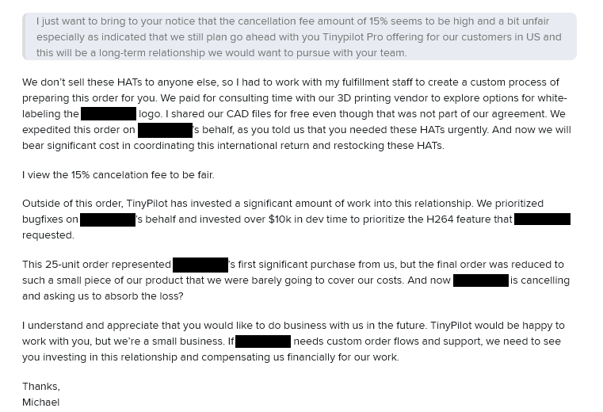

### TinyPilot's teams matured

One of the most important lessons I learned in 2021 was to allow TinyPilot's employees to expand their roles as the company grew. Originally, I thought my duty as a manager was to protect employees' jobs from changing at all. An interview with WPEngine founder Jason Cohen was a good wakeup call, as he described good leadership as the opposite of what I was doing:

> The only way for the organization to succeed is if the team is getting better. And that's [the founder's] job: to build great teams.

I had started this process in 2021 by encouraging employees to expand their roles. A member of the fulfillment team started helping out with customer service, and it made a huge difference.

In 2022, I continued this process with a focus on teams rather than individuals.

In August, I traveled to Ohio for a week to attend a wedding. Eric, who handles fulfillment and customer support, got sick the same week. Fortunately, support volume was low that week, and nothing required an urgent response. Still, it was a wakeup call that the customer service team can't just be a single person. The other member of the fulfillment team agreed to expand into customer support, so now it's a team instead of a single person.

I also hired TinyPilot's first support engineer in early 2022. They acted as a second level of support if the customer had technical issues that the customer service team didn't know how to handle. Similar to the experience I had with customer support, I found that one person wasn't enough. When they'd get sick or take vacation, I was spending up to three hours per day on customer support, which was difficult to fit in.

I expanded the support engineering team to two people in XX, and

This process has definitely been difficult. There's a large time investment in training a new person, but there's an even bigger time investment in creating teams and figuring out how they interact with the rest of the organization. The teams are still relatively new, but I'm seeing them take on an increasing share of work that used to be work I did.

### We untangled TinyPilot's update process

When I started working on TinyPilot, I didn't know the right way to install software on Linux. I had installed software from package managers like `apt` and `rpm`, but I'd never created my own packages. When I published the first prototype of TinyPilot, I let users install the software using the tools I was familiar with: bash scripts, Ansible, and git. The bash script bootstrapped an Ansible environment, then ran Ansible. The Ansible role installed dependencies and cloned the TinyPilot git repository.

The original install method worked well in the early days. It took about three minutes to install, but it was dead simple. Users could run a single command, and my script would install TinyPilot on their device. To update to the latest version, users could re-run the same script, and it would pull down the latest code.

Two years later, TinyPilot's update process was a mess. It still relied on the same foundations as my prototype, which made me realize why nobody installs software that way. We had a complicated tree of Ansible roles depending on other Ansible roles, which depended on command-line parameters and file contents in distant locations. Small changes to our installation process would take weeks because it was so slow and complicated to test changes.

Every update, it was getting worse. Things were getting slower, we were seeing more bugs. Security changes in Git were breaking our installation process (TODO: link), and we had it coming because Git is not meant to be part of an install process.

In May, we launched what we called "the update overhaul." We focused on how to reverse the course we were on and what a more maintainable method would be.

The first major change was that we eliminated Git from our update process. Our old installer would fetch every Git tag from our repo and then install the latest one, but that was limiting. Instead, we built a web service that the installer can query to find out which version it should install next given the version that's currently installed.

The other major change was that we created a TinyPilot Debian package. We still rely on Ansible, but having a Debian package means that we can incrementally trim logic out of Ansible and move it to our Debian package, where it executes faster.

- We can test updates end-to-end without pushing the new version to production.
- We can provision a device with any TinyPilot development version during development with a single command, when it used to
- We can inspect a TinyPilot package to see everything it will install instead of having to trace complicated paths in the installer

We made two major changes. The first was that updates went through a custom TinyPilot update server. The TinyPilot software queries the update server to find out what updates are available and where to find the code. That let us do things like actually enforce license checks and special case certain cases if the user's on a very old version.

The other major change was that we eliminated Git from our update process.

Our legacy update process also gave us very little control over what the user installed. There wasn't a good place to gate access based on whether the user had a valid license and what version they were upgrading from. So even though users were supposed to stop receiving free upgrades to our paid version after a year, they continued receiving updates, even with an expired license. And because we couldn't see

Things aren't perfect. We still depend on Ansible, and it's still complicated, but we're working our way out. Our Ansible role installs a TinyPilot Debian package, and we're incrementally pulling logic out of Ansible and into the Debian package.

Once the user has access to the repo, they have access forever. It also forced us into maintaining backwards compatibility forever because it was possible for a version from any point in the past to upgrade to the latest version.

## What went poorly this year?

### I derailed development to chase a large customer

Late in 2021, I received an email from a large company that was excited about TinyPilot. They wanted to buy 200 devices over the course of 2022, and they planned to increase that number in 2023. At the time, I was selling XX devices per month, so 200 devices from a single customer would be an enormous boost in our sales. It represented $XXk in additional revenue.

Before we moved forward, the customer wanted TinyPilot to support H264 video encoding, a more modern form of compression than our current solution. No problem! The third-party package we used for video streaming already supported H264, so it didn't seem that hard to switch over. Plus, H264 was one of our most commonly-requested features.

I estimated that if we prioritized H264, the feature would be ready by January 2022. To give ourselves some wiggle room, I told the customer that we expected to launch the feature by early March.

Then, we caught a bit of bad luck. A few weeks later, one of TinyPilot's developers discovered [a security vulnerability](https://tinypilotkvm.com/advisories/2022/03/token-reuse) in our code, so we paused new work to prioritize a fix. The fix required significant architectural changes, but I felt like we could dip into our "wiggle room" budget and still hit the March estimate.

Except it also turned out that integrating H264 video was an order of magnitude more difficult than I anticipated. We also had to integrate a WebRTC server, but it wasn't available for our platform, so we also had to figure out how to compile it and all of its dependencies from source. Also, it turns out that H264 is patented, so I had to go through a multi-month process with lawyers to license the format.

I reached out to the customer in XX to say that we wouldn’t have it ready by March. What we could do instead is get it to the point where the feature wasn’t part of the web UI, but they could enable and manage the feature through the command-line. I estimated that we’d have that ready by end of April. I'd been giving them early builds, so they were unblocked on building their UI.

The customer said that was fine. They were implementing their own web interface anyway, so they didn’t care that much about our UI.

#### Finally, we get paid

It was difficult to get the H264 feature out the door, but we finally shipped it in an official release in May. And it was finally time for all that hard work to pay off.

With H264 shipped, the customer was ready to place their first large order. They wanted 25 TinyPilot Voyager 2 devices, which represented about XX% of that month's sales.

They asked for a quote for 25 devices. I told them we could give it to them for $8.3k, a 5% discount from our retail price.

They said that this was for their India office, who had a smaller budget, so could we cut things out of the product to reduce the price? They didn't need any of the Pro software features, so could we cut that? After lots of back and forth, they decided that they only wanted our proprietary circuit board. Everything else, they'd source on their own. But they promised that this was just for the India office. When it came time to buy for the US offices, they'd buy our normal retail devices.

Their requests shrunk the sale from $8.3k to just $4.4k. It also required a lot of extra administrative work for me because we didn't have a process in place for selling our circuit boards as a standalone product. We had to figure out how to pack them, how to code them for international export, etc.

The day after they we shipped their order, they requested 3D models for our circuit board. This wasn't part of the agreement, but I just wanted to wrap this up, so I shared them.

The customer asked why our models didn't show a video capture port. I explained that our devices use a third-party chip for video capture. We would have included the video capture component if they ordered a pre-made device, but that was one of the things they decided to buy on their own.

They said our circuit boards were of no use to them without built-in video capture and asked for a full refund.

#### It all blows up

We had already shipped the customer's order to India and couldn't re-route it. I told them they'd have to get the package back to us, and then we'd charge them a 15% ($660) restocking fee to cover the costs of preparing this order and paying return tariffs.

The customer balked at having to pay the restocking fee, and that's when my patience ran out.

I kept it professional, but I emailed them a laundry list of ways I felt like they were abusing the relationship.

{{}}

They said they still wanted to work together and would place orders for their US offices, but they never followed up. I wasn't particularly eager to work with them again, so I never reached out, either.

In the end, it felt like a big mess where nobody was happy:

- I was frustrated that I spent so much time pursuing this sale that involved so many special requests and preconditions, and it ultimately led nowhere.
- The customer was upset that we didn't deliver what they expected at the price they wanted.
- TinyPilot's dev team had five back-to-back months of rushed development: two months for the security fix and three for H264.
- TinyPilot's other customers had five months where feature development slowed substantially because we were focused on just one customer.

### I let a website redesign go awry

Late last year, I started the process of a rebrand for TinyPilot.

I wrote a longer blog post about the experience, and it became popular in a way I didn't expect. It attracted XX readers in the first week and XX by the end of the year, making it my XXnd most popular blog post of all time.

When I say the results were unexpected, it's not false humility. I didn't think many people would find the story relatable. How many people have spent $46k on a website redesign?

I found afterwards was that people related to the experience of feeling mistreated by a business and struggling with how to fix the situation. That was also a good lesson in my writing that even with experiences that aren't widely shared, the emotions are what resonate with people.

Even though I spent more than I meant to, I believe the results paid for themselves. After we switched to the new design, website sales went from $XX-$XXk/month to $XX-$XXk/month, and I wasn't making other changes that would explain the increase. It could be that our product spreads through word of mouth, so those customers would have purchased anyway, but I feel a little better about blowing the $46k if I feel like I got a positive return.

### Accept that some bets fail

Late in 2021, a large customer reached out to me and said they wanted to buy 200 TinyPilot devices in 2022. That was great news!

The day after I shipped their first order, they said they'd changed their mind and wanted a full refund. It ended up being a big mess where nobody was happy.

In writing this post, I struggled to come up with a meaningful lesson from my unsuccessful pursuit of the large customer.

Certainly, it was a negative outcome, and I'd like to avoid it in the future, but I couldn't pinpoint what, exactly, I got wrong.

At first, I thought it was a lesson in making unreasonable promises to customers. But I didn't really make any. I told the customer that our timeline was an estimate, and I padded the estimate by 40% to account for unknown unknowns. We ultimately ran into unexpected delays, and even though I budgeted for them, they were more severe than I guessed.

Then, perhaps because I'm reading a lot of Nassim Taleb lately, I thought the experience was a lesson in avoiding customers that demand a lot of skin in the game from without offering much of their own. At the end, I felt like I invested thousands into development and dozens of hours answering their requests, and the customer had invested almost nothing.

> "Why did you do a deal with a customer who had no skin in the game, you fragilista?" -Imaginary Nassim Taleb, to me

Or had they? They were writing their own custom frontend for TinyPilot, so that's a serious investment. As a percentage of overall resources, I was certainly investing a lot more of TinyPilot's resources, but that's the nature of

In the end, I think the lesson might be kind of boring and obvious: some bets don't pay off. As the founder, I have to roll with the punches. If I'd do the same thing with the same information, it's not a mistake.
