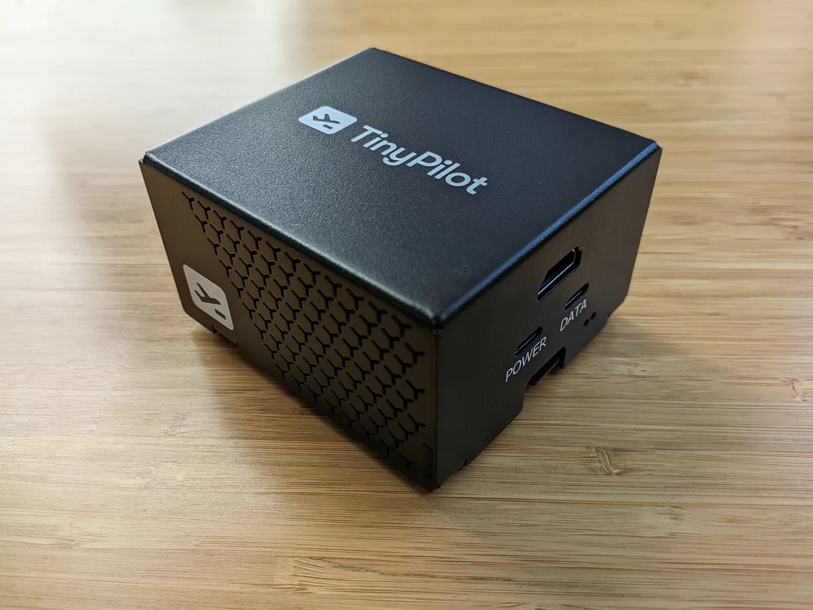
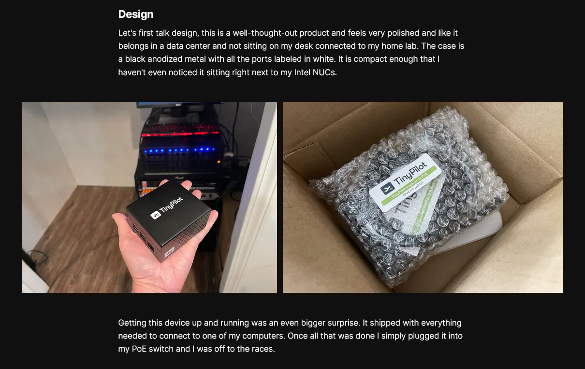
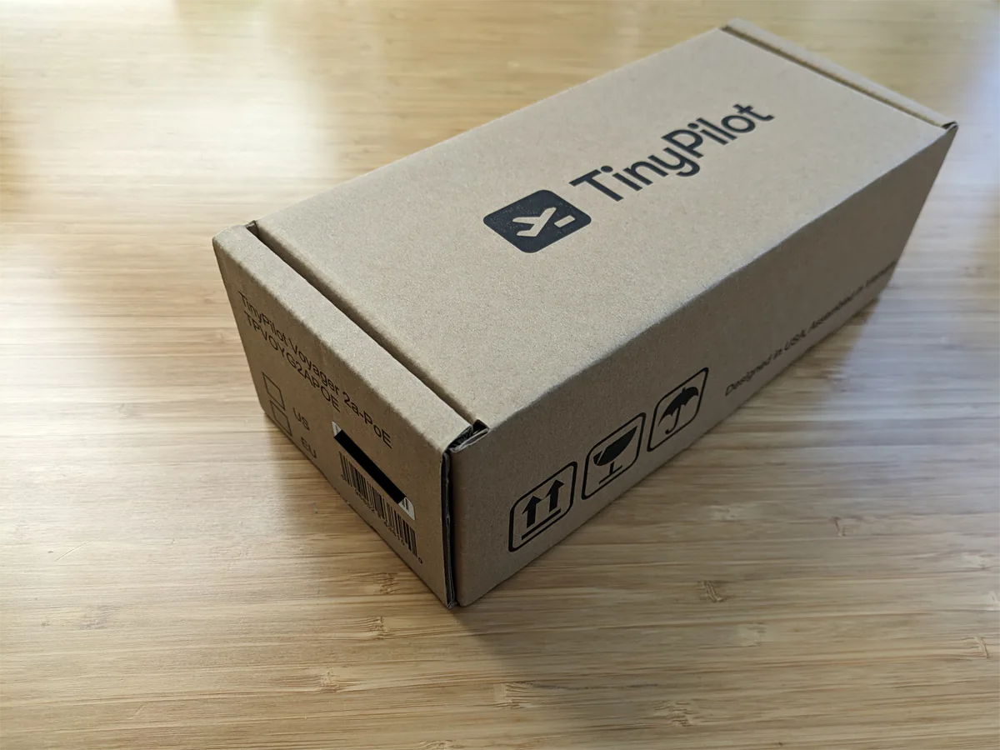
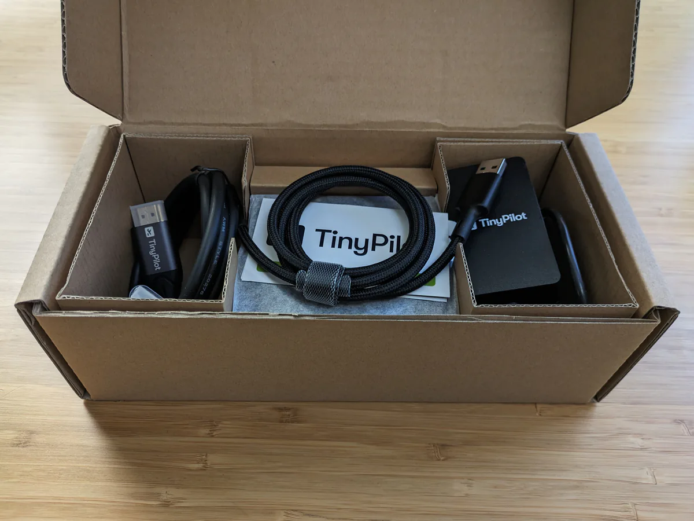
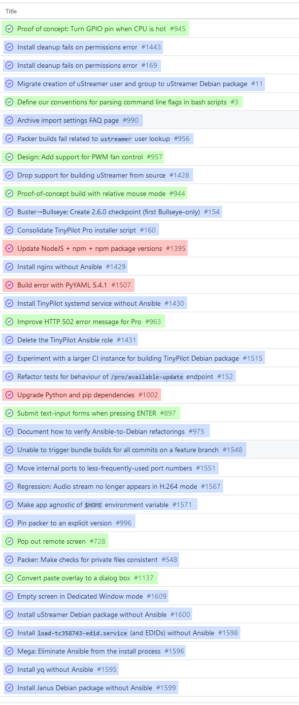

<!-- Disable linter complaints about duplicate headers -->
<!-- markdownlint-disable MD024 -->

Six years ago, I [quit my job as a developer at Google](/why-i-quit-google/) to create my own bootstrapped software company.

For the first few years, all of my businesses flopped. The best of them earned a few hundred dollars per month in revenue, but none were profitable.

Halfway through my third year, I created a device called [TinyPilot](https://tinypilotkvm.com). It allows users to control their computers remotely. The product quickly caught on, and it's been my main focus ever since.


{{}}
{{}}


In 2023, TinyPilot generated $997k in revenue, which I'll generously round up to a cool million. More importantly, the business earned $236k in profit, a 20x increase from 2022.

In this post, I'll share what I've learned about being a bootstrapped founder from my sixth year doing it.

## Previous updates

- [My First Year as a Solo Developer](/solo-developer-year-1/)
- [My Second Year as a Solo Developer](/solo-developer-year-2/)
- [My Third Year as a Solo Developer](/solo-developer-year-3/)
- [My Fourth Year as a Bootstrapped Founder](/solo-developer-year-4/)
- [My Fifth Year as a Bootstrapped Founder](/solo-developer-year-5/)

## TinyPilot became 20x more profitable



| Income/Expense                    | 2022          | 2023          | Change               |
| --------------------------------- | ------------- | ------------- | -------------------- |
| Sales Revenue                     | $807,458      | $992,597      |      |
| Credit Card Rewards               | $4,327        | $4,379        |      |
| **Total Income**                  | **$811,785**  | **$996,976**  | **** |
| Advertising                       | -$51,764      | -$39,270      |      |
| Cloud Services                    | -$9,151       | -$16,408      |      |
| Design Consulting                 | -$30,215      | -$950         |      |
| Electrical Engineering Consulting | -$124,643     | -$23,427      |      |
| Fulfillment Vendors               | -$0           | -$28,321      |      |
| Office Rent                       | -$6,600       | -$6,310       |      |
| Payroll                           | -$205,984     | -$255,779     |      |
| Postage                           | -$28,324      | -$16,853      |      |
| Raw Materials                     | -$324,140     | -$358,457     |      |
| Everything Else                   | -$25,398      | -$31,404      |      |
| **Total Expenses**                | **-$806,219** | **-$777,179** | **** |
| **Net Profit**                    | **$10,447**   | **$235,568**  | **** |

After two years of basically breaking even, TinyPilot finally earned a meaningful profit.

Most of the change is due to stronger sales. We switched to metal cases this year, which both increased the price customers were willing to pay and increased our manufacturing capacity.

Expenses shifted around but stayed roughly the same overall. Design costs shrunk to nearly zero, as I [stopped paying a design agency $6k/mo to tweak my logo](/tinypilot-redesign/). I focused on scaling my existing product rather than iterating on the hardware design, which reduced my electrical engineering costs by $100k.

I don't draw a salary, so the total amount I earned from TinyPilot in 2023 was $236k. People often wonder how I survived on the meager earnings of my first five bootstrapper years. The answer is that I live in Western Massachusetts, where the cost of living is low. I had savings in index funds from years working in big tech, and those investments generated enough dividend income to sustain me.

## The most terrifying 10 minutes of 2023

One lazy Saturday afternoon in February, I heard a knock on my door. Standing on my porch was a mid-fifties guy in jeans and a windbreaker. I opened the door, still in my pajamas.

"Are you the TinyPilot guy?" he asked me.

"Uh oh," I thought. Did a disgruntled customer find my house?

"Yes..." I said cautiously.

"I'm the handyman at the office. A sprinkler burst, and we can't get into your suite. Can you come down?"

That didn't sound good.

During my five-minute drive to the office, I wondered if this was the end of my business. We kept all of our inventory in TinyPilot's office. Would circuit boards work after being drenched? Probably not.

TinyPilot had insurance, but I chose coverage a year before when we carried half as much inventory. And even if insurance paid out, TinyPilot would be dead in the water for months until we could restart our whole manufacturing pipeline.

I arrived at the building and walked up to TinyPilot's office on the second floor, the carpet squishing damply with every step I took.

When I reached my floor, I was relieved to see that the sprinkler had actually burst in the shared conference room, not TinyPilot's suite. I unlocked our office and found everything was bone dry. The water hadn't even trickled under our door.

My relief was short-lived, as the landlord told me he might have to kick us out for "weeks to months" to repair the wall we shared with the conference room.

{{}}

Normally, being forced to move my entire office on a few days' notice would be disruptive, but it was _especially_ disruptive this week. I was about to take a two-week trip to Europe, my longest travel since starting TinyPilot.

If the team had to move while I was away, no one would be able to set up the computers or printers &mdash; the office IT guy was me. And if the team couldn't print shipping labels, they couldn't fulfill orders.

Long story short, we ended up not having to move, but the experience made me never want to be in that situation again. I was risking so much by centralizing TinyPilot's operations in a single, small office.

## Outsourcing order fulfillment and reducing stress

TinyPilot's order fulfillment had always been extremely smooth, which was why I'd always procrastinated outsourcing it. Out of 3,500+ orders in the past two years, there were only about five where we sent a customer the wrong item.

In March 2023, TinyPilot switched from fulfilling orders in-house to [using a third-party logistics (3PL) warehouse](/retrospectives/2023/04/). We were still assembling devices at our office, but we'd send customer-ready packages to the warehouse in bulk, and the 3PL would handle the final step of shipping orders to customers.

At the time of the 3PL shift, we were in ["urgent mode."](/retrospectives/2023/05/#getting-out-of-ldquourgent-moderdquo) Our team of two part-time employees assembled about fifty devices per week, but customers were buying at the same rate. It was a stressful situation because any interruption put us at risk of halting sales.

I hoped that outsourcing fulfillment would free up enough of the team's time to produce about 100 devices per week. It turned out that our full capacity was only about 70. At that rate, it would take months of working at maximum capacity to build up a healthy inventory at the warehouse. I ended up hiring a third employee temporarily to get us through the summer.

So, outsourcing fulfillment didn't free up a ton of time, but it did win us a lot more flexibility.

The local team seemed to have flexibility already because they could come in whenever they wanted. As long as orders were packed and ready for mail pickup the next day, they could take their shifts at 3 AM if they felt like it.

Switching to the 3PL eliminated the daily deadline of mail pickup. Instead, our only deadline was to ship assembled products to our warehouse once a week.

The increase in flexibility reduced a lot of stress. If an employee wanted to take a four-day weekend, they could shift their schedule around and still work their normal 15 hours that week. Or they could take a few days off and [not feel like it was overloading the rest of the team](/solo-developer-year-5/#run-at-50-capacity).

## Making TinyPilot look like a real product

One of the most notable changes to TinyPilot in 2023 was how we improved the product's physical appearance.

At the end of 2022, we were still making TinyPilot's cases with a fleet of seven high-end 3D printers running nonstop. As far as 3D printing goes, our cases were especially nice, but they still had the "just a prototype" feel of a 3D-printed product.

{{}}

In February 2023, we [switched to a metal case](https://tinypilotkvm.com/blog/introducing-voyager-2a).

{{}}

I was surprised at how much the metal case impacted sales. Not only did it increase the absolute number of sales, it increased the price customers were willing to pay. After [experimenting with pricing](/retrospectives/2023/05/#what-price-maximizes-profits), I ended up increasing our price by 10%, and our monthly sales were still higher than when we had a 3D-printed case.

We also updated TinyPilot's packaging. Until late last year, we were still bunching the device and all the cables together in a bubble wrap pouch and dropping that into a plain brown box.


{{}}
{{}}


Every time a reviewer shared their experience unboxing TinyPilot, I winced a little.

{{}}

I'd had a few conversations with designers about making a nice retail box for the product, but it never came together, and it was never my top priority. After we switched to metal cases, TinyPilot's packaging stood out as particularly immature.

In the second half of 2023, we worked with a contract manufacturer to take over our entire production process. As part of that work, they offered to make a retail box for us.


{{}}
{{}}


Our contract manufacturer did a great job on the box. It's not going to catch your eye if it was on the shelf at Best Buy, but it feels like professional packaging for a networking hardware product.

## Lessons learned

### There's hidden stress in low-latency responsibility

Switching TinyPilot's order fulfillment to a 3PL [reduced stress and increased flexibility](#outsourcing-order-fulfillment-and-reducing-stress) for TinyPilot's local team, but I was most surprised at how drastically it relieved stress for me.

I'd been carrying around so much "what if?" anxiety for years without even realizing it.

Before we switched to the 3PL, there was always a worry in the back of my mind about all the things that could block order fulfillment. What if our office router crashes and prevents anyone from accessing the Internet? What if the desktop suddenly can't talk to the printer? There were dozens of ways I might be called to unblock a critical process urgently.

Now that we've shifted to a 3PL and a contract manufacturer, there are still many things that can go wrong, but I'm outside the critical path of most day-to-day operations. If a printer breaks at our warehouse, someone else will fix it, and I'll hopefully never even hear about it.

### As a project matures, more time goes into maintenance

In June, when I sat down to write [the changelog](https://tinypilotkvm.com/pro/changes#260) for the latest TinyPilot software update, I struggled to explain how any of the work we did benefitted our users. Assuming I overdid it on refactoring work, I resolved to make our next release more user-focused.

When it came time to announce the [next update](https://tinypilotkvm.com/pro/changes#261), I had the same problem. After two and a half months of development, all we had to show for it were small, cosmetic improvements.

Our current pace felt glacial compared to the early days when we were releasing major features every couple of months. Was I prioritizing tasks poorly? Had the team lost their enthusiasm? Had we taken on too much technical debt?

I reviewed the complete list of tasks for the release, including all the work that wasn't visible to end-users. Even with the benefit of hindsight, I felt like I had chosen the right tasks. And the time we invested in each task felt reasonable as well.

{{}}

So, how could our progress be so much slower when we were prioritizing well and working efficiently?

I realized that the dominant factor was [the size of our codebase](/retrospectives/2023/09/#how-do-we-reduce-accidental-difficulty). We have three times the code that we did three years ago. And every line of code requires time to maintain. So, if I keep the number of developers fixed but increase the size of the codebase, then a higher proportion of our time must go to maintaining old code.

Beyond maintenance, more code means that new features are more expensive to build. If your app has zero features, building the first one is easy. If your app already has 20 features, you have to put a lot more thought into how your 21st feature integrates with everything else.

So, I haven't figured out a way for us to go significantly faster, but I've learned to temper my expectations around feature pace. And I've adjusted how I estimate dev costs to account for our more complex codebase.

### Most support escalation can happen asynchronously

I try to give the TinyPilot team [as much autonomy as possible](/solo-developer-year-4/#good-leadership-means-helping-teammates-grow). At the same time, I want to make sure everyone feels comfortable asking me for help when they get stuck.

The problem was that when support tickets escalated to me, they felt particularly stressful.

For a while, I thought that was the nature of support escalation. I'm only seeing the toughest customer questions, so of course they're going to feel stressful. It turned out that most of it was fixable.

First, I adjusted our process for escalation. Most escalation took the form of, "Michael, here's a problem we've never seen before. How do you want us to handle it?" I encouraged the team to tweak their approach by proposing a solution as part of escalating to me. If I wasn't available, and they were the last line of support, what would they tell the customer?

80% of the time, the team came up with the same solution that I would have recommended. The more the support team did this, the better they became at tackling hard cases.

Once I saw how close the team's answers were to my own, I realized there was no need to block a support ticket on an answer from me. If my only contribution to 80% of cases is, "Yes, do that," why not just do their plan immediately and check with me in parallel about alternatives?

In the minority of cases where I had a better idea for solving a support issue, it was almost always something the customer could try in addition to my team's suggestion. We never ran into a situation where my team told me, "Oh, we wish you'd intervened earlier because we suggested putting their device in the microwave, and now their house is on fire."

## Grading last year's goals

Last year, I set [three high-level goals](/solo-developer-year-5/#goals-for-year-six) that I wanted to achieve during the year. Here's how I did against those goals:

### Manage TinyPilot on 20 hours per week

- **Result**: I significantly reduced hours from previous years and traveled more than any previous year.
- **Grade**: B-

I did worked much less in 2023 than in 2022. I did a lot of travel for both work and non-work. I was "out of the office" for about five weeks cumulatively, and everything went fine.

When I signed off in the evenings, my work day usually felt complete, whereas in 2022, I frequently felt like I was leaving behind loose ends.

### Earn $100k in profit

- **Result**: I earned $236k in profit.
- **Grade**: A+

I expected this year to be profitable, as I knew I'd be spending less on hardware engineering, but I underestimated how much additional revenue TinyPilot would earn from the switch to metal cases.

I was pleasantly surprised to exceed my goal here.

### Close the TinyPilot office

- **Result**: We still have the office for non-critical workflows.
- **Grade**: B

When I made this goal, I didn't expect our landlord to agree to a month-to-month lease, but he did. Without a long-term commitment, there's less pressure to move out by a certain deadline.

We've successfully moved the critical operations of manufacturing and fulfillment out of our office. So, we don't strictly need the office, but it's convenient to have a home base.

If the handyman knocked on my door tomorrow to announce that some disaster destroyed all of our office property and made the space unusable, it would be frustrating but not catastrophic.

## Goals for year seven

### Manage TinyPilot on 20 hours per week

I know I set this as a goal in [2022](/solo-developer-year-4/#manage-tinypilot-on-20-hours-per-week) and again in [2023](/solo-developer-year-5/#manage-tinypilot-on-20-hours-per-week), but the third time's the charm! My management time is trending downward, so this could be my year.

### Publish a course or book

In 2021, I [said](/solo-developer-year-3/#publish-six-blog-posts-and-one-book) I'd [write a book](https://refactoringenglish.com/) to help developers improve their writing. I got 80% through the first chapter, and then TinyPilot absorbed all of my free time that year.

I still want to write that book, so if I reduce my management time, hopefully, I can use the free time to write more.

I've also been experimenting with [Nix](/tags/nix/) and [Zig](/tags/zig), two technologies that I find exciting but lacking in educational resources. Creating a course for one of those technologies could be a fun way to build my own expertise while also making these tools more accessible to others.

### Write software for ten working hours per week

Writing code is still one of my favorite activities.

For the past few years of TinyPilot, I've enjoyed programming, but it's never been a sensible way to spend my limited working hours. With a team of six people, several critical vendors, and many moving pieces, the most pressing parts of TinyPilot have always been management.

I hope that by outsourcing and delegating more of TinyPilot's operational side, I can free up enough bandwidth that programming is, if not the optimal use of my time, at least a reasonable use of my time.

## Do I still love it?

Every year, when I write these blog posts, I ask myself whether I still love what I'm doing.

2022 remains the toughest year I've had. I still preferred it to working for an employer, but it was a massive challenge to onboard new teammates while navigating [the global chip shortage](<https://en.wikipedia.org/wiki/Global_chip_shortage_(2020%E2%80%932023)>).

2023 was a major improvement from the previous year. There were fewer fires to put out, and it felt good to shift critical workflows to specialized vendors.

The downside to 2023 is that I have a hard time getting excited about it. It was a restructuring year, so I spent a lot of time redefining TinyPilot's processes and shifting around team responsibilities. TinyPilot has shown me that I'm better than the average developer at designing organizational processes, but I still find it painfully boring.

While I can't say that I loved the year, I still enjoyed most of it and preferred it to working for an employer. I'm grateful to be in a position where I can earn a living working for myself and creating a product I'm proud of.



---

_Cover image by [Loraine Yow](https://www.loraineyow.com/). After [six years](/how-to-hire-a-cartoonist/) as this blog's official illustrator, Loraine [has changed careers](https://www.loraineyow.com/post/how-accounting-blew-my-mind) but graciously agreed to make one last illustration for this post._

