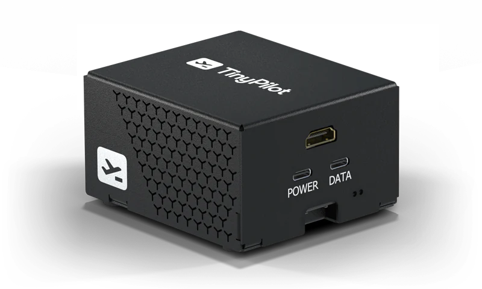
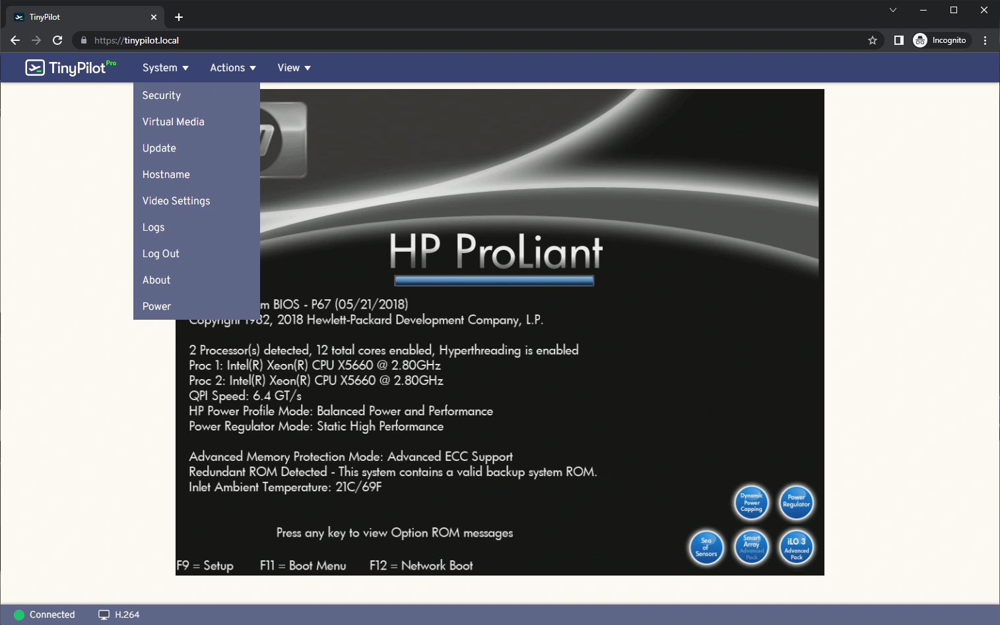
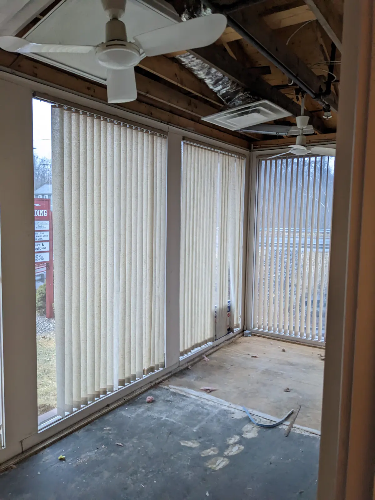
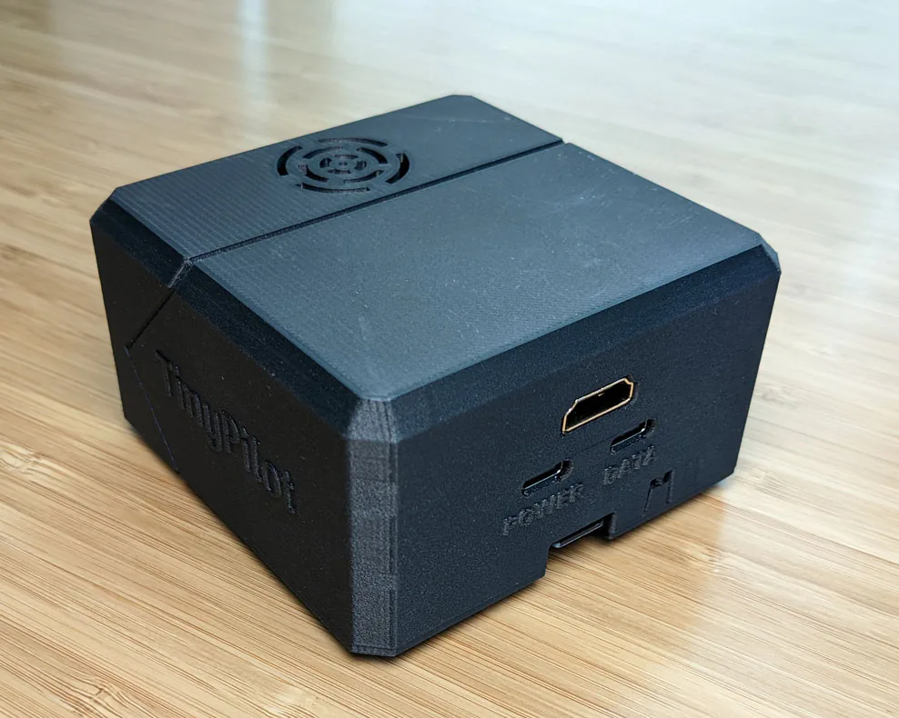
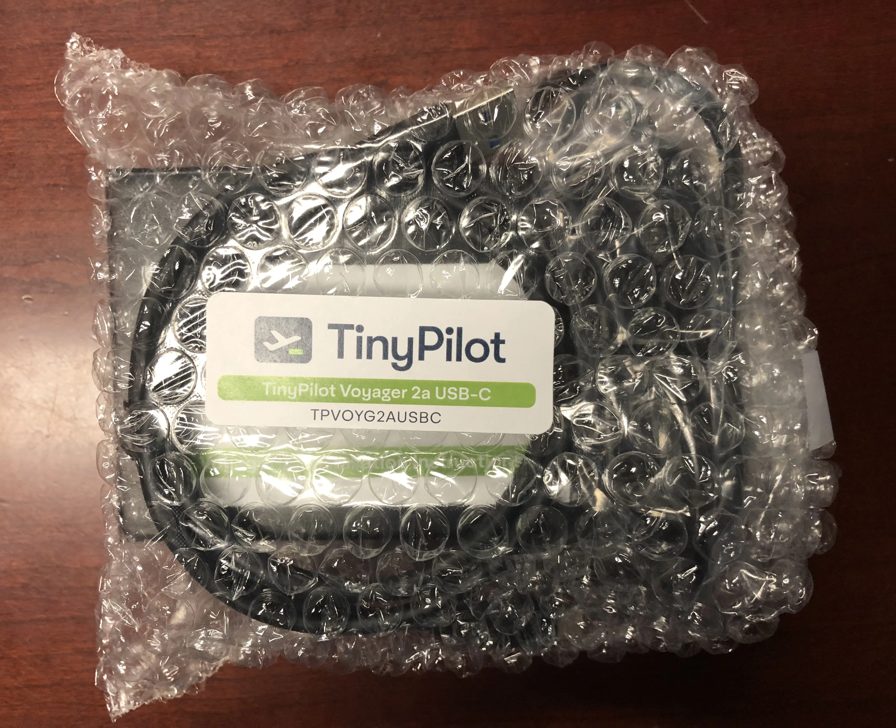
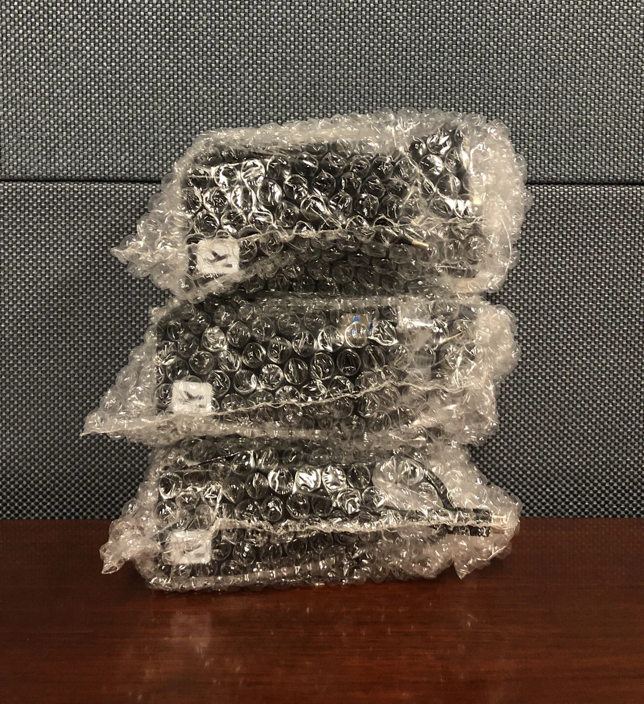

<!-- Disable linter complaints about duplicate headers -->
<!-- markdownlint-disable MD024 -->

Six years ago, I [quit my job as a developer at Google](/why-i-quit-google/) to create my own bootstrapped software company.

For the first few years, all of my businesses flopped. The best of them earned a few hundred dollars per month in revenue, but none of them were profitable.

Halfway through my third year, I created a device called [TinyPilot](https://tinypilotkvm.com). It allows users to control their computers remotely. The product quickly caught on, and it's been my main focus ever since.


{{}}
{{}}


In 2023, TinyPilot generated $997k in revenue, which I'll generously round up to a cool million. More importantly, the business earned $236k in profit, a 20x increase from 2022.

In this post, I'll share what I've learned about being a bootstrapped founder from my sixth year doing it.

## Previous updates

- [My First Year as a Solo Developer](/solo-developer-year-1/)
- [My Second Year as a Solo Developer](/solo-developer-year-2/)
- [My Third Year as a Solo Developer](/solo-developer-year-3/)
- [My Fourth Year as a Bootstrapped Founder](/solo-developer-year-4/)
- [My Fifth Year as a Bootstrapped Founder](/solo-developer-year-5/)

## TinyPilot became 20x more profitable



| Income/Expense                    | 2022         | 2023         | Change               |
| --------------------------------- | ------------ | ------------ | -------------------- |
| Sales Revenue                     | $807,458     | $992,597     |      |
| Credit Card Rewards               | $4,327       | $4,379       |      |
| **Total Income**                  | **$811,785** | **$996,976** | **** |
| Advertising                       | $51,764      | $39,270      |      |
| Cloud Services                    | $9,151       | $16,408      |      |
| Design Consulting                 | $30,215      | $950         |      |
| Electrical Engineering Consulting | $124,643     | $23,427      |      |
| Fulfillment Vendors               | $0           | $28,321      |      |
| Office Rent                       | $6,600       | $6,310       |      |
| Payroll                           | $205,984     | $255,779     |      |
| Postage                           | $28,324      | $16,853      |      |
| Raw Materials                     | $324,140     | $358,457     |      |
| Everything Else                   | $25,398      | $31,404      |      |
| **Total Expenses**                | **$806,219** | **$777,179** | **** |
| **Net Profit**                    | **$10,447**  | **$235,568** | **** |

Several of my costs were way down. My design consulting shrunk to nearly zero, as I [stopped paying a design agency $6k/mo to tweak my logo](/tinypilot-redesign/). And I focused on scaling my existing product rather than iterating on the hardware design, which saved me $100k in electrical engineering costs.

Payroll went up, but that's largely due to having more staff in 2023. I hired an extra person temporarily to help with assembling device until we completed our shift to the manufacturer. Other than that, I didnt' add staff, but the support engineers I hired midway through (TODO: link) 2022 were around for the full year in 2023.

Payroll does not include me, as I don't draw a salary from TinyPilot. The full amount I earned from TinyPilot in 2023 was $236k. Before the business was generating a meaningful income, I survived by living in a low cost of living area and taking dividends from my index fund investments.

## The most terrifying 10 minutes of 2023

One lazy Saturday afternoon in February, I heard a knock on my door. On my porch was a guy in his mid-forties, and he was wearing jeans and a windbreaker. I opened the door, still in my pajamas.

"Are you the TinyPilot guy?" he asked me.

"Uh oh," I thought. Did a disgruntled customer find my house?

"Yes..." I said cautiously.

"I'm the handyman at the office. A sprinkler burst, and we can't get into your suite. Can you come down?"

That didn't sound good.

During the five-minute drive to the office, I convinced myself that this was the end of my business. We we kept all of our inventory in TinyPilot's office, and it's where we assembled our products and shipped them to customers. Would circuit boards still work after being drenched? Probably not.

TinyPilot had insurance, but I chose coverage a year before when our inventory was lower. And even if insurance paid out, TinyPilot would be dead in the water for months until we could start our whole manufacturing pipeline up again.

I got to the building and walked up soaked carpeting to TinyPilot's office on the second floor, bracing myself for the worst.

I unlocked TinyPilot's suite. Everything was bone dry. The water hadn't even trickled under our door.

The sight of an untouched office was an incredible relief, but then I found out we wouldn't be able to use our office for a few days due to fire safety concerns. A few days later, the landlord told me they might have to repair the wall we shared with the office that flooded. If that happened, we'd have to move to a smaller spare office for "weeks to months."

{{}}

Normally, being forced to move my entire office on a few days' notice would be disruptive, but it was _especially_ disruptive this week. I was about to take a two-week trip to Europe, my longest trip since starting TinyPilot.

The office IT guy was me &mdash; nobody else knew how to set up our router, desktop, or print server if we were to move. And if the team can't print shipping labels, they can't fulfill orders.

Long story short, we ended up not having to move, but the experience made me never want to be in that situation again. It illustrated how risky it was to centralize so much of TinyPilot's operations in a single, small office.

## Outsourcing fulfillment

For all of TinyPilot's history, we've been fulfilling orders in-house. When I started the business, I'd assemble devices every day and drive orders to the post office. When that job grew to several hours per day, I hired my then-girlfriend-now-wife. In early 2021, my wife started grad school, so I leased office space and hired two local part-time employees to take over assembling products and fulfilling orders.

Our fulfillment had always been extremely smooth, which was why it took me so long to outsource it. Out of about 3,500 orders in the past two years, there were maybe three total where we shipped a customer the wrong item or quantity. We advertised three business days of handling time, but 97% of orders went out within one business day.

In March 2023, TinyPilot [transitioned its fulfillment to a third-party logistics (3PL) warehouse](/retrospectives/2023/04/). We were still assembling devices in-house, but we'd ship our products to the 3PL, and they'd ship them to customers as orders arrived.

At the time of the shift to the 3PL, we were in "urgent mode." We were struggling to keep up with orders because we still just had a local team of two-part time employees, and we could only build devices at about the same rate customers bought. I hoped outsourcing fulfillment would be our ticket out of urgent mode.

Shifting to the 3PL actually didn't save the team much time. It turned out that slapping a shipping label on a box and putting it out for the mail carrier was a pretty small percentage of the team's hours.

Shifting to the 3PL did significantly reduce stress, much more strongly than I anticipated. I knew that there was stress in keeping the office staffed six days a week, but I didn't realize how much more stress I carried about all the things that could block us from fulfilling orders. The office Internet could go down, a disk on the office desktop could fail. These were all things that I'd have to deal with immediately. A 3PL is subject to all of the same issues, but it's their problem. If their printer suddenly dies, it's them who has to furiously drive to Best Buy, not me.

## Making TinyPilot look like a real product

One of the biggest user-visible changes to TinyPilot this year has been how the physical product has matured visually.

At the end of last year, we were still making TinyPilot's cases with a fleet of 3D printers running nonstop. They were especially high-quality 3D-printed cases that we made with carbon fiber material, but they still had the "just a prototype" feel of a 3D printed product. When I looked at TinyPilot's 3D-printed case alongside all the alumnium-cased items in my server rack, TinyPilot's plastic casing stuck out.

{{}}

In XX, we introduced the TinyPilot Voyager 2a, which has a metal case.

TODO: Photo of metal case

The new case made a big difference. When we were constrained by supply, I tried increasing the price of our devices by XX%, but users continued buying at the same rate. I realized that the metal case had a huge impact on how customers perceived TinyPilot's value.

The other change we made was in our packaging. By the end of 2022, we were still shipping TinyPilot in a plain brown box with the device and all the cables bunched together in a bubble-wrap pouch.


{{}}
{{}}


Every time someone made a video review of TinyPilot, I prayed that they wouldn't show how ugly the unboxing process looked, but they usually did.

I'd had a few conversations with designers about making a nice retail box for the product, but it never came together, and it was never my top priority. But especially when we switched to metal cases, TinyPilot's packaging felt amateurish and embarrassing.

When we switched to our contract manufacturer, they offered to make a retail box for us as part of the project. And they ended up designing a box I like a lot. If someone were to make a TinyPilot unboxing video now, I'd be happy to see them open it.

TODO: Photo of Retail box, metal case

## Lessons learned

### There's hidden-stress in low-latency responses

I carried a pager for my last job, and I hated it. I intentionally designed TinyPilot to avoid being latency-sensitive. Nobody carries a pager. There are no critical servers that need to stay online. There are very few events that would require anyone on the team to react faster than one business day.

When TinyPilot transitioned from fulfilling orders in-house to using a 3PL, I thought the main impact would be on freeing up time. But it was actually on reducing stress.

Before the transition, someone had to be in the TinyPilot office six days per week to fulfill orders. The timing was flexible, as the only thing that had to happen urgently is that packages get a shipping label and put out for the mail carrier.

Instead of having to work at least an hour three days a week, the team mostly didn't have to work any particular day. They needed to be in the office to build devices, but it didn't matter if they built ten devices a day for five days or fifty devices in one marathon session.

There was a big change for me as well. I didn't realize how much mental real estate I was devoting to readiness for possible interruptions. What if the Internet goes out? What if the office desktop suddenly can't talk to the printer?

There were dozens of things that could block us from fulfilling orders, and most of them required me to fix them.

Now that we've switched to the contract manufacturer, there are even fewer things we need to worry about. The thing we're responsible for reacting to quickly is support requests, but we have five people available to do that across four cities. There are very few things that prevent all of us from responding to support requests.

### As a project matures, more time goes to maintenance

Why does it feel like we're just running in place? In the early days, we'd release huge features every month. Now, it felt like every release, I was struggling to write the release announcement because there was nothing that exciting in it.

So, I looked back at what work we had done, and I didn't regret any of the decisions.

Every line of code takes time to maintain. So if we had two developers three years ago, and we have two developers today, but our codebase is three times larger, then more of our time will go to maintenance. And new feature work is just going to take longer because it's harder to design around existing infrastructure than it is to do pure greenfield development.

We tested rigorously, we . We're not shipping a web app where we control everything server-side. We're shipping updates to software that our customers run locally. We deal with things like filesystem corruption

I felt frustrated that we were making such slow progress on features and we were getting bogged down with maintenance tasks.

We can make this fix, but what's the pattern? On page X, we do it this way, but on page Y, we do it this way.

### Most support escalation can happpen asynchronously

I try to give the team as much autonomy as possible. I want them to feel empowered to make their own decisions. At the same time, I want to make sure they feel comfortable asking me for help when they get stuck, so I say that anyone can always escalate issues or questions to me.

But I was finding that escalation was quickly becoming a source of stress for me. For a while, I thought that was just the nature of esclating issues. I'm only seeing the really tough customer questions, so they're going to feel more stressful. But thinking about it more, I realized there were ways for me to reduce the stress.

First, I adjusted our process for escalation. The style of escalation had been, "Michael, here's a problem we've never seen before. How do you want us to handle it?" Instead, I encouraged the team to propose a solution when they escalated. If I wasn't available, and they were the last line of support, what would they tell the customer?

That worked well because 80% of the time, the team came up with the same solution that I would have recommended. And the more they did this, the better they became at tackling hard cases.

That change helped a lot, but I realized another source of stress in escalations was the time pressure. We aim to respond to customers within one business day. By the time a question was escalated to me, we had generally burned half the response window, and we risked burning the other half due to variations in the team's daily work schedules. Whenever a question escalated to me, I felt like I had to respond NOW NOW NOW to avoid being the bottleneck.

I realized they don't really need to wait on an answer from me to continue helping the customer. If 80% of the time, I'm just saying, "Yes, do that," then they could do that immediately.

In the minority of cases where I had a better idea for solving a support issue, it was almost always something the customer could try in addition to my team's suggestion. We never ran into a situation where I said, "Oh, I think they'll have better luck trying X," and my team said, "Oh, we wish you'd said that earlier because we suggested hitting the device with a sledgehammer."

## Grading last year's goals

Last year, I set [three high-level goals](/solo-developer-year-5/#goals-for-year-four) that I wanted to achieve during the year. Here's how I did against those goals:

### Manage TinyPilot on 20 hours per week

- **Result**: I worked 35-40 hours per week, a reduction from previous years, and traveled more than any previous year.
- **Grade**: B-

It's not 20 hours, but I did work significantly less in 2023 than 2022. I did a lot of personal and work travel, so I was "out of the office" for about five weeks cumulatively, and things still went smoothly.

My workday used to start whenever I woke up, usually 7 or 8am, and end when I ate dinner at 6:30pm, with breaks for breakfast, lunch, and exercise. This year, I moved the end time up to 5:30pm, and that made a big difference in feeling like I had time to unwind and do non-work things in the evening. In 2022, it frequently felt like I was ending the day without getting to everything I wanted, whereas in 2023, I frequently felt like I got to everything I needed to.

In 2023, I found more time for writing wrote four new blog posts but 15 new "notes" posts, which is what I started doing when I wanted to share something but I didn't want to polish it enough for a blog post.

### Earn $100k in profit

- **Result**: I earned $236k in profit.
- **Grade**: A+

This caught me by surprise. My first two years running TinyPilot, I was basically at breakeven. Sales were going well, but I was also spending a ton on electrical engineering and software development, and a lot of my cash was tied up in inventory.

One of the major changes was that my electrical engineering costs dropped drastically. In previous years, I had to iterate on our hardware design as the supply chain evolved and as we learned new things from manufacturing. But by 2023, we'd been manufacturing the same hardware for about a year, so we didn't have to do as much redesigning.

I also underestimated how much the metal case would increase the value. I didn't experiment much with price before, but we were selling the 3D-printed version for $XX. When I switched to the metal case, I discovered that customers were willing to buy at higher prices (TODO: link).

### Close the TinyPilot office

- **Result**: We still have the office for non-critical workflows.
- **Grade**: B

I felt like we were past the point where it made sense to do a lot of our tasks in-house. Even though it went smoothly, there were lots of risks that could seriously disrupt business, such as sprinklers exploding.

It is awfully convenient. The team likes having a quiet place to work rather than working from home. And rent is only $600/month, so it's not a huge expense.

So, if a pipe burst in our office tomorrow and destroyed everything, it would be inconvenient, but we'd be fine. The most important thing we do there now is processing returns, but we're handing that job over to our manufacturer.

I didn't think our landlord would let us go month-to-month, but he ended up being fine with it. So if there's no long-term commitment, and we're using it out of convenience rather than necessity, I'm happy to keep it.

## Goals for year seven

### Manage TinyPilot on 20 hours per week

I know I set this as a goal in 2022 and 2023, but third time's the charm! My management time is definitely trending downward, so I think this year I can get to 20 hours per week.

### Publish a course or book

I created a course about blogging, and I'm proud of the material. I wish I'd done more of that.

When I look around at technology that I find exciting like Zig or Nix, I see such a dearth of long-form educational materials. Something I've realized over the years is that I enjoy teaching much more than most developers do. I also write so much publicly that I feel more comfortable writing material than most people do. Looking back on a lot of the blog posts I wrote this year.

Also, in 2021, I said I'd write a book, and I still want to write it.

### Write software for ten working hours per week

Writing code is still one of my favorite ways to spend time. For the past few years of TinyPilot, I've enjoyed coding, but it's never been a sensible way to spend my limited working hours. With a team of six people, several critical vendors, and many moving pieces, the most pressing parts of TinyPilot have always been management.

I hope that by outsourcing and delegating more of TinyPilot's operational side, I can free up enough of my time that coding is, if not the optimal use of my time, at least a positive use of my time.

## Do I still love it?

Every year, when I write these blog posts, I ask myself whether I still love what I'm doing.

2022 was the roughest year I've had running my own business. I still preferred it to working for an employer, but the growing pains were stressful.

2023 was a restructuring year. I deliberately shifted focus away from sales growth, product redesigns, and new features so that TinyPilot could focus on the long-term. So, in that way, 2023 was a major improvement over 2022.

The downside to 2023 is that I find myself having a hard time getting excited about it.

So, I'll say that 2023 was fine. I enjoyed lots of it, I didn't _love_ it. It's kind of hard to love. I spent a lot of time designing new processes. I think I'm good at it, but it's not something I love doing.

It's interesting being a bootstrapped founder after a year of tech layoffs. When I quit my job, my safety net was to just go get another big tech job. And now it's seeming like my safety net is gone.

But I'm grateful that for the past six years, I've been practicing how to make money without an employer. And so at this point, I feel like what I'm doing now maybe is the safer choice.

I always felt like, "Worse comes to worst, I just go back to working at a big tech company." But now I feel grateful that I'm more protected from layoffs and I've spent the last six years building skills around making money without an employer.

---

_Cover image by [Loraine Yow](https://www.lolo-ology.com/)._

