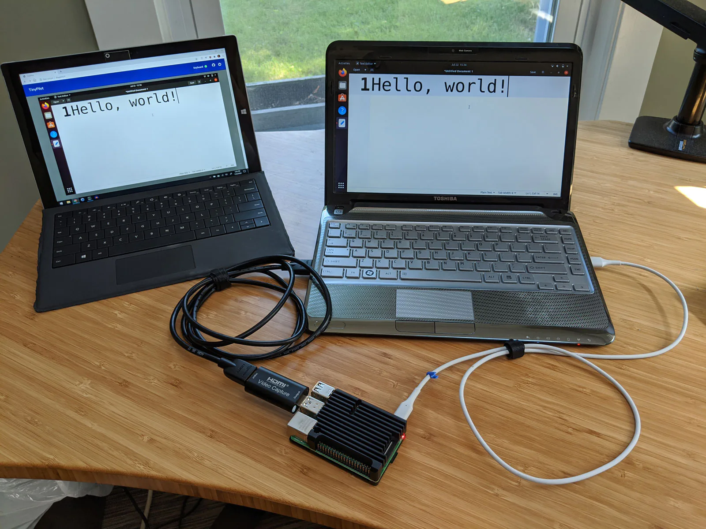

Exactly seven years ago, I [quit my job as a developer at Google](/why-i-quit-google/) to create my own bootstrapped software company.

Every year, I post an update about how things have gone in the last year and what my life is like as an an indie founder.

## I sold my company

The defining event of my professional year was that I sold [TinyPilot](https://tinypilotkvm.com), the company I founded in 2020.

TinyPilot is a device that lets users control their computers remotely. I built a rudimentary prototype in 2020 with a $35 Raspberry Pi mini computer and a $15 HDMI capture dongle.

{{}}

I wrote [a blog post](/tinypilot/) about how I got the initial version of TinyPilot to work, and dozens of customers materialized who were willing to pay $100-200 for TinyPilot build-it-it-yourself kits.

For the next four years, I improved on the TinyPilot product and built it into a real company. I graduated from kits to pre-made devices. I hired a team to help me with hardware, software, support, and logistics, eventually growing the company to $1M/year in revenue.

TODO: Photo of later version

Last year, I sold the company for $600k.

My wife and I wanted to start a family, and I didn't think I could be both the sole manager of a seven-person company and a good father to a newborn. I found a buyer whose vision for the company aligned with mine, and we completed the sale in April 2024.

{{}}

I already [wrote](/i-sold-tinypilot/) and [podcasted](https://softwaremisadventures.com/p/michael-lynch-indie-hacking) a lot about selling my company and [the lessons I learned](/lessons-from-my-first-exit/), but the short version is that I'm grateful for how everything worked out.

## I became a new parent

In August, my wife and I welcomed our first child, a son.

Shortly after the birth, one of the nurses took a nice photo of the three of us. I'm protective of my son's privacy, so I ran the picture through a hand-tuned Fast Fourier transform to remove identifying biometric details:

{{}}

I took two months off to not think about making money at all, and I've slowly been phasing work back in.

I'm thankful for the flexibility I get from being an indie founder and for the timing of the TinyPilot sale, as the past five months have been the happiest time of my life.

## I worked on educational products

I sold TinyPilot in April, but I stayed with the company through mid-May to help with the transition.

My son was due in August, and I knew I'd take time off when he arrived. That left me three months to start something new, but it needed to be something I could shelve for a few months while I figured out life post-baby.

I decided to work on an educational product like a course or book. It's easy to pause the work, and even if I have paying customers, there are no servers to keep online or support questions to answer.

My only experience with educational products was in 2021. I released a short video course about [blogging for technial audiences](https://hitthefrontpage.com). It only made $XXk that year, but it's made $XXk total, making it the highest return on investment project I've ever done.

Over the summer, I revised the material from my 2021 blogging course. I started by teaching it to a small group of students on weekly video sessions. My plan was to continue refining the course based on the students' feedback, and then record a final, downloadable version of the course to sell.

The live course went okay, but the feedback from students was that they wanted to learn more about writing technique and less about platforms to share their writing. I still wanted to finish the course, but my son arrived a few weeks early, so I never finished the recordings.

After my son was born, it became harder to record videos at home, so I switched to [writing a book](https://refactoringenglish.com) about effective writing techniques for developers. I'm publishing it chapter by chapter and iterating on the material based on reader feedback.

I still have a bunch of videos from the partially-recorded blogging course that I don't know what to do with, so here's one about why you should say yes if popular bootstrapping author [Patrick McKenzie](https://kalzumeus.com) challenges you to a blogging duel:

<iframe src="https://iframe.mediadelivery.net/embed/273218/f04d4f68-e5da-4886-a0f6-a3bedc62c399?autoplay=true&loop=false&muted=false&preload=true&responsive=true" loading="lazy" style="border:0;position:absolute;top:0;height:100%;width:100%;" allow="accelerometer;gyroscope;autoplay;encrypted-media;picture-in-picture;" allowfullscreen="true"></iframe>

## I learned cool technologies

When I was running TinyPilot, I didn't have a lot of time for technical work, which was a bummer because I still love writing software.

After TinyPilot, I basically only had time for learning cool technologies.

I've always loved programming, but I've never found it as exciting as I have in the last year. I'm awed by the amazing software that's available now for free, and I'm only able to experiment with a tiny fraction of it.

### Nix

The technology that's had the biggest impact on my work the last year is Nix and NixOS.

I've been adopting Nix little by little, but I like it so much that I now use Nix in every programming project and run NixOS on all of my computers.

- Who should try it?
  - Developers who appreciate infrastructure as code tools like Docker or Ansible.
- What's my pitch?
  - On software projects, Nix allows you to define all of your dependencies in source code. Anyone can replicate your environment in one command.
  - NixOS allows you to define your computer's entire configuration in source code. You can easily rebuild your computer from scratch or roll back to previous configurations.
  - Nix has many of the advantages of Docker, except that Nix packages compose better than Docker images.
- What are the drawbacks?
  - Nix has a steep learning curve, and I haven't found a good developer-oriented beginner guide. The closest is [_NixOS in Production_](https://leanpub.com/nixos-in-production), which is aimed at DevOps engineers.
  - There's a schism around a feature called "flakes." If you use flakes, it's hard to understand tutorials and documentation that don't, and vice-versa.
  - The Nix community is in an unhealthy state due to poor leadership.
  - In continuous integration (CI), Nix scales down poorly. I [haven't been able to find a way to run any Nix-dependent job](https://github.com/Gabriella439/nixos-in-production/issues/24) in less than one minute unless I switch to a Nix-specific CI vendor.
- What's a good way to explore it?
  - Try it in small increments. You can get a lot of value from Nix by using small parts of its functionality.
  - Install Nix through the Determinate Systems installer, and try running a program with `nix shell` (e.g., `nix shell -p cowsay` then `cowsay howdy, human`)
  - If you liked ephemeral shells, create a [dev shell](/notes/nix-dev-environment/) for one of your projects so that you can manage the versions of all your dependencies and dev tools from a single file.

### htmx

I'd seen people talking about htmx for the past several years, but the concept never clicked for me. "The flagship feature is that you can make the HTML `<button>` element send a POST request?" I thought. "Who cares?"

During a long plane ride, I read the free ebook _Hypermedia Systems_. It's written by the authors of htmx. And I finally got that it's not about letting a `<button>` send a POST request but rather about bringing simple interactivity to HTML without having to write custom JavaScript.

I was so used to writing custom JavaScript to make my web apps work. I knew it was repetitive and tedious, but I figured that that's just how it has to be if I'm going to add logic to the presentation-focused HTML.

- Who should try it?
  - Developers who prefer minimal frontend libraries over heavy frameworks like React and Vue.
- What's my pitch?
  - htmx makes you realize how much unnecessary JavaScript you've been writing all the time.
  - htmx strikes a balance that's difficult in web programming in that it saves you from duplicating boilerplate code. Heavier JS frameworks perform inscrutable magic on your code to turn it into a web app whose HTML looks nothing like the source code you wrote, but htmx is low-abstraction, so the code that's running in your browser is the code that you wrote.
  - It's a library rather than a framework, so adopting htmx isn't all-or-nothing. You can try it on a page or two to see if you like it.
  - There's no build step, so you don't have to run your code through any sort of Webpack / Node.js component just to render a page.
  - I wrote a longer pitch [last year](/retrospectives/2024/07/#learning-htmx).
- What are the drawbacks?
  - I find htmx's [error handling awkward](/retrospectives/2024/07/#htmxs-error-handling-is-underwhelming), but I have a [decent workaround](/retrospectives/2024/08/#finding-my-preferred-pattern-for-htmx-forms)
  - htmx [weakens Content Security Policy (CSP)](/retrospectives/2024/07/#htmx-weakens-content-security-policy-csp)
- What's a good way to explore it?
  - Read about my experience [porting ScreenJournal to htmx](/retrospectives/2024/08/#finding-my-preferred-pattern-for-htmx-forms).
  - Read the first few chapters of [_Hypermedia Systems_](https://hypermedia.systems/) (free, available online) to see if it resonates with you.
  - Try

### Zig

I'd been interested in Zig ever since I listened to Andrew Kelly on the XX podcast XX years ago. He argued that we suffer so much from designing low-level software in C and C++, languages that were designed XX years ago under constraints that no longer apply. He developed Zig to achieve the same results as C and C++ but using the technological advantages that are available today.

I found Andrew's argument compelling and his enthusiasm contagious. I loved the idea of Zig as a replacement for C++, but I hadn't written any C++ for personal projects in a decade. All the projects I create are just things I want to use and share with friends, so they're typically web apps, which I don't want to write in a low-level systems language like C++ or Zig.

After I attended Handmade Seattle in 2023, I met Andrew Kelly, and it inspired me to finally write some Zig. And I enjoyed Zig. It's the most fun I've had learning a new language in a long time. It reminds me of when I first learned to program and there's a sense of mastery because there's so little abstraction that you feel in control.

I started working on a pure Zig implementatio of the Ethereum virtual machine, but I ran out of steam. It's not particularly useful until I have a complete implementation, and that's a huge amount of work.

I'm always on the lookout for some excuse to use Zig for a practical purpose, but I just don't have any good project ideas for it at the moment.

The thing that kept me from learning Zig was that my fun coding is mainly around projects I want to use, and most of the project ideas I have are web apps.

Zig is the most fun programming I've done in a long time. There's something about coding with extremely low abstraction that feels exciting.

I still have fun coding in Zig. If I was sent to live on a desert island for a year with a laptop but no Internet, the project I'd want to work on is taking an open-source rebuild of some computer game I played in the 90s (e.g. [Age of Empires II](http://openage.dev/), [Command and Conquer](https://www.openra.net/)) and porting all the disgusting C++ code to elegant Zig.

- Who should try it?
  - TODO
- What's my pitch?
  - Easy to reason about.
- What are the drawbacks?
  - There's no stable release yet. You'll likely have to rewrite some of your code every time you update to the latest Zig compiler.
  - Documentation is limited.
- What's a good way to explore it?
  - TODO

### Fuzz testing with Nix

You probably thought I was done talking about Nix. I'm not!

I'd been curious to try fuzz testing to find security vulnerabilities, as I hadn't used fuzzing tools since I [found a serious vulnerability in VLC](https://www.nccgroup.com/us/research-blog/fuzzing-rtsp-to-discover-an-exploitable-vulnerability-in-vlc/), ten years ago.

I found Antonio Morales' 2021 [fuzz testing tutorial series](https://github.com/antonio-morales/Fuzzing101), which I liked, but it involves a lot of boring gruntwork to set up a working fuzzing environment.

I tried implementing a fuzzing workflow in Nix, and I found that Nix made the experience so much better.

I wish I had time to do more fuzzing tutorials with Nix because I feel like the world is sleeping on Nix as a fuzzing tool.

- Who should try it?
  - Anyone who performs fuzz testing, especially on C/C++ code.
- What's my pitch?
  - Nix makes fuzzing workflows reproducible.
    - Once you get your fuzzer running under Nix, anyone run your fuzzing configuration by just [typing `nix run`](/nix-fuzz-testing-1/#a-preview-of-the-solution). They don't have to figure out dependencies because Nix automatically reproduces the exact environment you used.
  - Nix simplifies installing dependencies.
    - Nix has one of the largest package repositories of any package manager. If your fuzzing target has dependencies, they're probably already available in the Nix package repository, so you don't have to figure out a special process for building each dependency.
  - Nix simplifies custom patches.
    - If you need to [apply custom patches](/nix-fuzz-testing-2/#fixing-the-bug) to fuzz your target, Nix makes it easy to apply those and keep the patch files in the same source tree as the rest of your fuzzing workflow.
  - Nix caches builds.
    - If you experiment with different compilation options, you don't have to compile from scratch each time. Nix will remember if you've compiled with the same options before and re-use that build. You never have to `make clean` or delete binaries manually.
- What are the drawbacks?
  - You have to figure out how to build the code you're testing through Nix as an extra layer of abstraction.
- What's a good way to explore it?
  - Try [my beginner-friendly tutorial](/nix-fuzz-testing-1/) about how I used Nix and honggfuzz to create a fuzzing workflow for an open-source PDF reader.

## Grading last year's goals

Last year, I set [three high-level goals](/solo-developer-year-6/#goals-for-year-seven) that I wanted to achieve during the year. Here's how I did against those goals:

### Manage TinyPilot on 20 hours per week

- **Result**: Reduced management to 20 hours per week
- **Grade**: A

I sold the company in April, so I only managed TinyPilot for a small amount of the year, but I finally did achieve my goal of managing on just 20 hours per week. That had been a repeated goal for the previous XX years.

The thing that finally made it work was that I had no choice. Due dilligence and managing the sale of the company took up 15-20 hours per week by itself, so I just didn't have the spare hours to do what I had been doing before.

The other unexpected consequence of selling was that the new CEO didn't have a programming background, so a lot of my focus in my last few months as CEO was identifying workflows that depended on the CEO making technical decisions and finding ways to empower the employees to do the heavy technical lifting. For example, I felt like I was just doing a few bits of our release process, but when I finally wrote it all out for the new CEO, I realized most of the steps were still on me.

### Publish a course or book

- **Result**: Taught a live course, but didn't publish a course or book.
- **Grade**: C

I decided to teach the course live before recording the downloadable version, but I underestimated how long it would take to run the class and work with students. I only got about 20% through recording the course videos and may not ever publish them.

### Write software for ten working hours per week

- **Result**: I write software for 10-20 hours per week.
- **Grade**: A

This goal was more about freeing up time as a manager for TinyPilot, but selling the company gave me lots more time to write code. I'm writing code more frequently and am enjoying it immensely.

## Goals for next year

### Earn $50k in profit

Across all of my products, I want to earn $50k in profit. It doesn't have to be recurring revenue. One-time sales count, but I want to find a way to earn about $50k from selling my own products.

### Publish a course or book

TODO

### Learn a new programming language

Every time I learn a new programming language, it gives me insights I can apply to any programming language.

A lot of my favorite bloggers are excited about [Elixir](https://elixir-lang.org/) and [Phoenix](https://hexdocs.pm/phoenix/), so I'm curious to try those.

---

_Illustrations by [Piotr Letachowicz](https://cartoony.eu) (except for the terrible stick figure one)._
