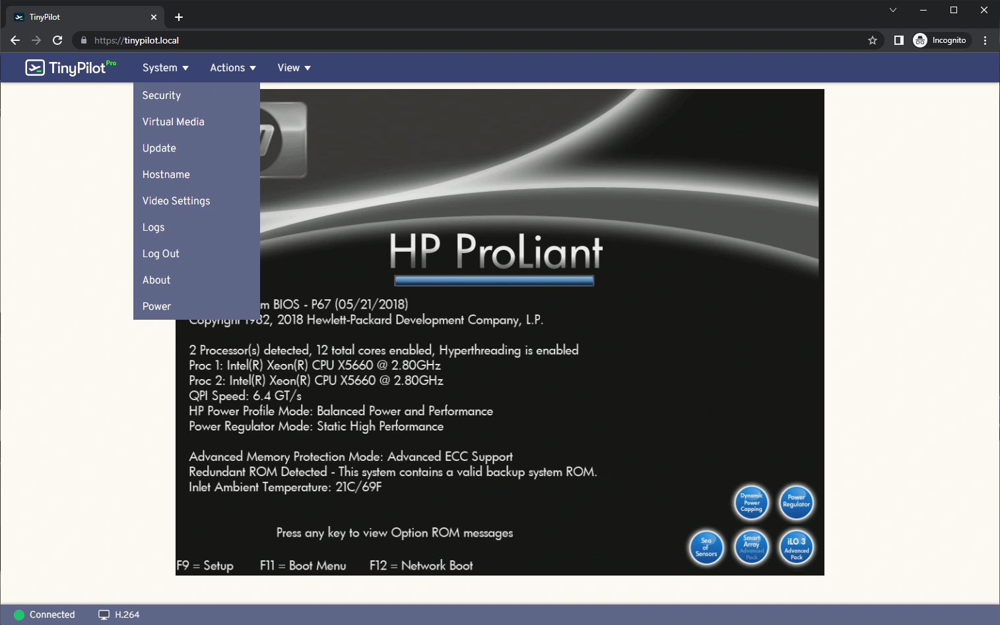
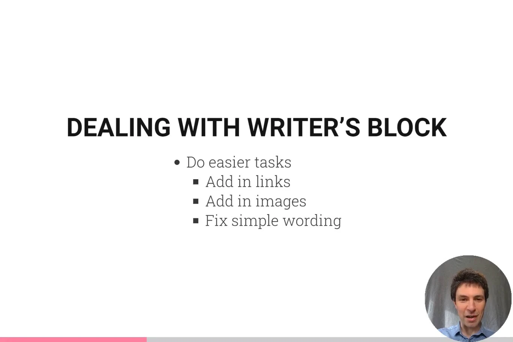
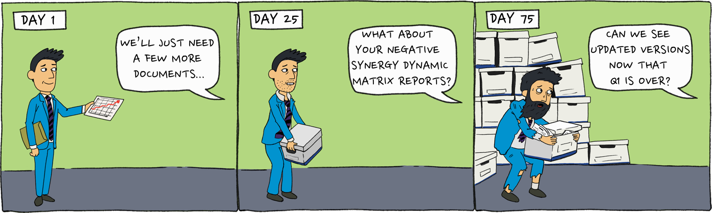

Seven years ago, I [quit my job as a developer at Google](/why-i-quit-google/) to create my own bootstrapped software company.

Every year, I [post an update](/tags/annual-review/) about how things have gone in the last year and what my life is like as an an indie founder.

## I sold my company

The defining event of my professional year was that I sold [TinyPilot](https://tinypilotkvm.com), the company I founded in 2020.

TinyPilot is a device that lets users control their computers remotely. I built a rudimentary prototype in 2020 with a $35 Raspberry Pi mini computer and a $15 HDMI capture dongle.

{{}}

I wrote [a blog post](/tinypilot/) about how I got the initial version of TinyPilot to work, and I offered build-it-it-yourself kits for $170. The kits sold out within four hours.

For the next four years, I improved on the TinyPilot product and built it into a real company. I evolved the product from DIY kits to pre-made devices. I hired a team to help me with hardware, software, support, and logistics, eventually growing the company to $1M/year in revenue.


{{}}
{{}}


Last year, I sold the company for $600k.

My wife and I wanted to start a family, and I didn't think I could be both the sole manager of a seven-person company and a good father to a newborn. I found a buyer whose vision for the company aligned with mine, and we completed the sale in April 2024.

{{}}

I already wrote and [podcasted](https://softwaremisadventures.com/p/michael-lynch-indie-hacking) about [the process of selling my company](/i-sold-tinypilot/) and [the lessons I learned](/lessons-from-my-first-exit/), but the short version is that I'm grateful for how everything worked out.

## I became a new parent

In August, my wife and I welcomed our first child, a son.

Shortly after the birth, one of the nurses took a beautiful photo of my wife and I with our new baby. I've included it below, but I'm protective of my son's privacy, so I ran the picture through a hand-tuned fast Fourier transform to remove biometric details:

{{}}

I took two months off to not think about making money at all, and I've slowly been phasing work back in.

I'm thankful for the flexibility I get from being an indie founder and for the timing of the TinyPilot sale, as the past five months have been the happiest time of my life.

## I worked on educational products

I sold TinyPilot in April, but I stayed with the company through mid-May to help with the transition to the new owner.

My son was due in August, and I knew I'd take time off when he arrived. That left me three months to start something new, but it needed to be something I could shelve for a few months while I figured out life post-baby.

I decided the best product for those three months would be a downloadable course or book. It's easy to pause work on an educational product, and even if I have paying customers, there are no servers to keep online or support questions to answer.

My only experience with educational products was in 2021. I created a video course about [blogging for technical audiences](https://hitthefrontpage.com). It made $7.6k in its first year and another $2.2k since then. It's not a smash success by course creator standards, but it took me about 100 hours to produce, and I'm proud of the material, so the course is the highest return on investment thing I've done since becoming an indie founder.

{{}}

Over the summer, I revised the material from my 2021 blogging course. I started by teaching it to a small group of students on weekly video sessions. My plan was to continue refining the course based on the students' feedback, and then record a final, downloadable version of the course to sell.

The live course went okay, but the feedback from students was that they wanted to learn more about writing technique and less about how to find readers. I still wanted to finish the course, but my son arrived a few weeks early, so I never finished the recordings.

After my son was born, it became harder to record videos at home, so I switched to [writing a book](https://refactoringenglish.com) about effective writing techniques for developers. I'm publishing it chapter by chapter and iterating on the material based on reader feedback.

I still have a bunch of videos from the partially-recorded blogging course that I don't know what to do with, so here's one about why you should say yes if popular bootstrapping author [Patrick McKenzie](https://kalzumeus.com) challenges you to a blogging duel:

<iframe src="https://iframe.mediadelivery.net/embed/273218/f04d4f68-e5da-4886-a0f6-a3bedc62c399?autoplay=true&loop=false&muted=false&preload=true&responsive=true" loading="lazy" style="border:0;position:absolute;top:0;height:100%;width:100%;" allow="accelerometer;gyroscope;autoplay;encrypted-media;picture-in-picture;" allowfullscreen="true"></iframe>

## I learned cool technologies

When I was running TinyPilot, I didn't have a lot of time for technical work, which was a bummer because I still love writing software.

After TinyPilot, I basically only had time for learning cool technologies.

I've always loved programming, but I've never found it as exciting as I have in the last year. I'm awed by the amazing software that's available now for free, and I'm only able to experiment with a tiny fraction of it.

### Nix

The technology that's had the biggest impact on my work the last year is [Nix and NixOS](https://nixos.org/).

I've been adopting Nix little by little, but I like it so much that I now use Nix in every programming project and run NixOS on all of my computers.

- Who should try it?
  - Developers who appreciate infrastructure as code tools like Docker, Ansible, and Terraform.
- What's my pitch?
  - On software projects, Nix allows you to define all of your dependencies in source code. Anyone can replicate your environment in one command.
  - NixOS is a Linux distro designed around the Nix concept. NixOS allows you to define your computer's entire configuration in plaintext files. NixOS allows you to easily rebuild your computer from scratch or roll back to previous configurations.
  - Nix has many of the advantages of Docker, except that Nix packages compose better than Docker images.
- What are the drawbacks?
  - Nix has a steep learning curve, and I haven't found a good developer-oriented beginner guide. The closest is [_NixOS in Production_](https://leanpub.com/nixos-in-production), which is aimed at DevOps engineers.
  - There's a schism around a feature called "flakes." If you use flakes, it's hard to understand tutorials and documentation that don't, and vice-versa.
  - The Nix community is in an unhealthy state due to poor leadership.
  - In continuous integration (CI), Nix scales down poorly. I haven't been able to find a way to run any Nix-dependent CI job [faster than 55 seconds](https://github.com/Gabriella439/nixos-in-production/issues/24) unless I switch to a Nix-specific CI vendor.
- What's a good way to explore it?
  - Try Nix in small increments. You can get a lot of value from Nix by using small parts of its functionality.
  - Install Nix through [the Determinate Systems installer](https://zero-to-nix.com/start/install/), and try running a program with `nix shell` (e.g., `nix shell -p cowsay` then `cowsay howdy, human`). Search [the package repo](https://search.nixos.org/packages) to see all the packages you can install in one line.
  - If you liked ephemeral shells, create a [dev shell](/notes/nix-dev-environment/) for one of your projects so that you can manage the versions of all your dependencies and dev tools from a single file.

### htmx

My friends have been praising [htmx](https://htmx.org) for the past several years, but the concept never clicked for me.

"You can make the HTML `<button>` element send a POST request? Who cares?"

Then, during a long plane ride, I read the free ebook [_Hypermedia Systems_](https://hypermedia.systems/) about the philosophy of htmx. The book made me realize that htmx's value isn't about letting a `<button>` send a POST request. It's about bringing simple interactivity to HTML without burdening the developer with custom JavaScript or deep layers of abstraction.

I always knew that the JavaScript part of web apps was tedious and repetitive, but I'd long ago accepted that as normal. HTML/CSS handles presentation, and JavaScript handles interactivity. There has to be glue code to connect the two, and glue code is inherently boring.

htmx's thesis is that you can eliminate glue code and boilerplate JavaScript by bringing more interactivity to the HTML/CSS part of a web app . And you can do it without introducing a lot of complexity and dependencies like npm, Webpack, and gigantic frontend frameworks.

- Who should try it?
  - Developers who prefer vanilla JavaScript or jQuery over heavy frameworks like React and Vue.
- What's my pitch?
  - htmx makes you realize how much unnecessary JavaScript you've been writing all your life.
  - htmx is a library rather than a framework, so adopting htmx isn't an all-or-nothing commitment like React or Vue. You can try htmx on a single form in your web app to see if you like it.
  - There's no build step, so you don't have to run your code through Webpack / Node.js just to generate plaintext HTML, CSS, and JavaScript. The code you write is the same code you see running in the browser.
- What are the drawbacks?
  - I found it challenging to shift my thinking to recognize the htmx way of writing web apps, but it often results in simpler code.
  - I find htmx's [error handling awkward](/retrospectives/2024/07/#htmxs-error-handling-is-underwhelming), but I have a [decent workaround](/retrospectives/2024/08/#finding-my-preferred-pattern-for-htmx-forms)
  - htmx [weakens Content Security Policy (CSP)](/retrospectives/2024/07/#htmx-weakens-content-security-policy-csp).
- What's a good way to explore it?
  - Read my [more detailed pitch for htmx](/retrospectives/2024/07/#learning-htmx).
  - Read about my experience [porting ScreenJournal to htmx](/retrospectives/2024/08/#finding-my-preferred-pattern-for-htmx-forms).
  - Read the first few chapters of [_Hypermedia Systems_](https://hypermedia.systems/) (free, available online) to see if it resonates with you.
  - Try htmx on a single form in your web application.

### Zig

The idea of Zig is that there are still programs we need to write in low-level languages like C, but we're making it harder on ourselves by continuing to write them in languages that were designed 50 years ago.

Zig gives you the same power and performance you can achieve with C, but it takes advantage of advancements in hardware and compiler design that weren't available when the C language was created.

I immediately loved the idea of Zig, but I struggled to find a project for it. I haven't used C or C++ for a personal project in 15 years. I typically find it more fun to build small-scale web apps, and Zig isn't the best tool for those.

I still find Zig extremely fun. If I was sent to live on a desert island for a year with a laptop but no Internet, my fantasy acitivity would porting an open-source rebuild of a computer game I played as a kid (e.g. [Age of Empires II](http://openage.dev/), [Command and Conquer](https://www.openra.net/)) from unrefined C++ code to elegant Zig.

- Who should try it?
  - Programmers who have used C and C++.
- What's my pitch?
  - Zig is the most fun I've had programming in a long time, and I generally find programming pretty fun. There's something extra fun about coding with extremely low abstraction and a rush I get from exercising full control over how many times my application touches a piece of memory.
  - Zig optimizes for explicit control flow and memory allocation, so I find Zig code easy to reason about.
  - The Zig community is welcoming and positive. Whenever I ask questions, I get patient, helpful answers. When I share my [Zig tutorials](/tags/zig/), the community welcomes them enthusiastically.
- What are the drawbacks?
  - There's no stable 1.0 release yet. You'll likely have to rewrite some of your code every time you update to the latest Zig compiler.
  - Becuase of compiler churn, you usually have to tweak examples you read in blog posts or sometimes [official language docs](https://github.com/ziglang/zig/issues/18497#issuecomment-2252162626).
  - I haven't found good resources for learning the language. There are no Zig books yet. I mainly learn by cobbling together information from disparate blog posts, forum discussions, and the [Zig language spec](https://ziglang.org/documentation/master/).
- What's a good way to explore it?
  - Take a simple program you'd normally write in C or C++, and write it in Zig instead.
  - Try [Ziglings](https://ziglings.org), beginnner exercises for learning Zig.
    - Ziglings exercises depend on pre-release versions of the Zig compiler. If you have Nix, an easy way to get the latest pre-release Zig compiler is by running: `nix shell 'github:mitchellh/zig-overlay#master'`

### Fuzz testing with Nix

You probably thought I was done talking about Nix. I'm not!

I'd been curious to try fuzz testing to find security vulnerabilities, as I hadn't used fuzzing tools since I [found a serious vulnerability in VLC](https://www.nccgroup.com/us/research-blog/fuzzing-rtsp-to-discover-an-exploitable-vulnerability-in-vlc/), ten years ago.

I enjoyed [Antonio Morales' 2021 fuzz testing tutorial](https://github.com/antonio-morales/Fuzzing101), but all the exercises involved boring gruntwork just to set up a working fuzzing environment.

I tried [implementing a fuzzing workflow in Nix](/nix-fuzz-testing-1/), and it was so much better. I wish I had time to create more fuzzing tutorials with Nix because I feel like the world is sleeping on Nix as a fuzzing tool.

- Who should try it?
  - Anyone who performs fuzz testing, especially on C/C++ code.
- What's my pitch?
  - Nix makes fuzzing workflows reproducible.
    - Once you get your fuzzer running under Nix, anyone run your fuzzing configuration by just [typing `nix run`](/nix-fuzz-testing-1/#a-preview-of-the-solution). They don't have to figure out dependencies because Nix automatically reproduces the exact environment you used.
  - Nix simplifies installing dependencies.
    - Nix has one of the largest package repositories of any package manager. If your fuzzing target has dependencies, they're probably already available in the Nix package repository, so you don't have to figure out a special process for building each dependency.
  - Nix simplifies custom patches.
    - If you need to [apply custom patches](/nix-fuzz-testing-2/#fixing-the-bug) to fuzz your target, Nix makes it easy to apply those and keep the patch files in the same source tree as the rest of your fuzzing workflow.
  - Nix caches builds.
    - If you experiment with different compilation options, you don't have to compile from scratch each time. Nix will remember if you've compiled with the same options before and re-use that build. You never have to `make clean` or delete binaries manually.
- What are the drawbacks?
  - You have to figure out how to build the code you're testing through Nix as an extra layer of abstraction.
  - Nix [does magic](/nix-fuzz-testing-1/#that-was-confusingly-easy) to help you build CMake-based projects, but it can be hard to understand what Nix does implicitly.
  - I had a difficult time [getting Nix to produce debug symbols](/nix-fuzz-testing-2/#improving-debug-symbols), and I'm still not sure what I was doing wrong.
- What's a good way to explore it?
  - Try [my beginner-friendly tutorial](/nix-fuzz-testing-1/) about how I used Nix and honggfuzz to create a fuzzing workflow for an open-source PDF reader.

## How was my year overall?

Every year, I ask myself whether I still enjoy being an indie founder.

For the past few years, I had a hard time answering this question. When I was running TinyPilot, I was proud of the company and enjoyed working with the TinyPilot team, but I felt like the pace and complexity of a hardware company was too much for me.

This year, I had fun being an indie founder again. I loved the freedom to spend so much time with my wife and our son. I was grateful that my return to work was entirely up to me, and I had complete control over how and when to integrate work into my post-baby life.

Selling TinyPilot was stressful and unpleasant, but when I look back, the parts I remember were celebrating with my wife and friends on [an impromptu dessert tour of Western Massachusetts](/i-sold-tinypilot/#part-4-after-the-sale).

In May, a Google recruiter offered me my old job back with no interview, and I was not at all tempted.

I continue enjoying life as an indie founder, and I still want to keep doing it for as long as possible.

## Lessons learned

### It's okay not to work

In the months leading up to my son's birth, I struggled with the question of how much time to take off. Obviously, taking one month off would be fine. But if one month is okay, why not two? Why not four? Why not a year?

In the months after my son's birth, I found myself with almost no free time. I had an even scarier thought: what if, now that I have a baby, I can't even return to work if I want to? What if I never reclaim enough uninterrupted time for writing and programming?

I took a breath and realized the reason I had no "free time" was that several days each week, I'd take long walks downtown to enjoy an outdoor brunch with my wife and son. Or we'd visitors were coming from out of town to meet the baby. And I had to remind myself that these were all _good things_ that I _liked doing_, and I was still in control of my time should I decide to resume working.

Ultimately, my return to work felt like it happened organically and not because I pressured myself. My wife and I figured out a childcare balance that felt right to us, and we continue to adjust as my son gets older and as family members have joined in to help with childcare.

### A process isn't really documented until someone else uses the documentation

In the months leading up to TinyPilot's sale, I focused on delegating as much as possible to the rest of the team. I didn't want the new owner to take over and feel like they couldn't complete some critical task because I was the only one who knew how to do it.

I expected delegation to be easy because I'd always written playbooks for my recurring tasks. As I began handing these playbooks over to my teammates, I realized how much of the "documented" process actually just [lived in my head](/retrospectives/2024/02/#i-accidentally-hoarded-tinypilots-release-process). Steps like, "Update the public changelog" or "Write the release announcement," were more complicated than the short phrases implied.

I now consider a process to be documented only when a teammate can follow the process using only the documentation.

### Selling to a cash buyer drastically reduces risk and paperwork

One of the biggest lessons from selling TinyPilot was how big a difference closing time makes. I didn't realize how much [additional risk and paperwork the seller bears](/i-sold-tinypilot/#due-diligence-makes-me-weaker-by-the-day) for every month that the acquisition process lasts.

{{}}

The buyer's financing has a major impact on closing time. If the buyer borrows money from a bank, the bank becomes a key decision maker in the deal. Banks move slowly, demand a lot of paperwork, and they're harder to negotiate with because they don't care if the deal falls through.

If I sell another company, I'll [offer incentives to attract a buyer with cash on hand](/lessons-from-my-first-exit/#offer-incentives-for-a-cash-buyer).

## Grading last year's goals

Last year, I set [three high-level goals](/solo-developer-year-6/#goals-for-year-seven) that I wanted to achieve during the year. Here's how I did against those goals:

### Manage TinyPilot on 20 hours per week

- **Result**: Reduced management to 20 hours per week
- **Grade**: A

I sold the company in April, so I only managed TinyPilot for a small amount of the year, but I finally did achieve my goal of managing on just 20 hours per week. That had been a repeated goal for the previous three years.

The thing that finally made it work was that I had no choice. Due dilligence and managing the sale of the company took up 15-20 hours per week by itself, so I just didn't have the spare hours to do what I had been doing before. Fortunately, the team stepped up to take over tasks that I hadn't previously thought to delegate.

### Publish a course or book

- **Result**: Taught a live course, but didn't publish a course or book.
- **Grade**: C

I likely could have released a course had I skipped the live version, but I'm still glad I did the test run, as it gave me useful feedback about the focus of the course.

### Write software for ten working hours per week

- **Result**: I write software for 10-20 hours per week.
- **Grade**: A

I'm writing code more frequently and am enjoying it immensely.

## Goals for next year

### Earn $50k in profit

Across all of my products, I want to earn $50k in profit. It doesn't have to be recurring revenue. One-time sales count, but I want to find a way to earn at least $50k from selling my own products.

### Publish a course or book

I've had an annual goal of publishing a book [since 2021](/solo-developer-year-3/#publish-six-blog-posts-and-one-book). I've never done it, but this feels like my year.

### Learn a new programming language

Every time I learn a new programming language, it gives me insights I can apply to any programming in general.

A lot of my favorite bloggers are excited about [Elixir](https://elixir-lang.org/) and [Phoenix](https://hexdocs.pm/phoenix/), so I'm curious to try that tech stack.

---

_Illustrations by [Piotr Letachowicz](https://cartoony.eu) (except for the terrible stick figure one)._
