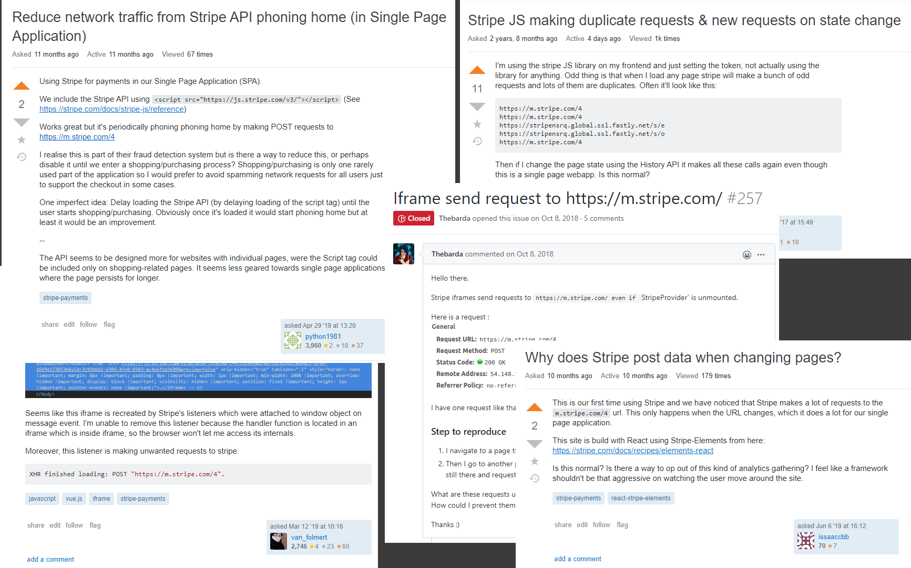
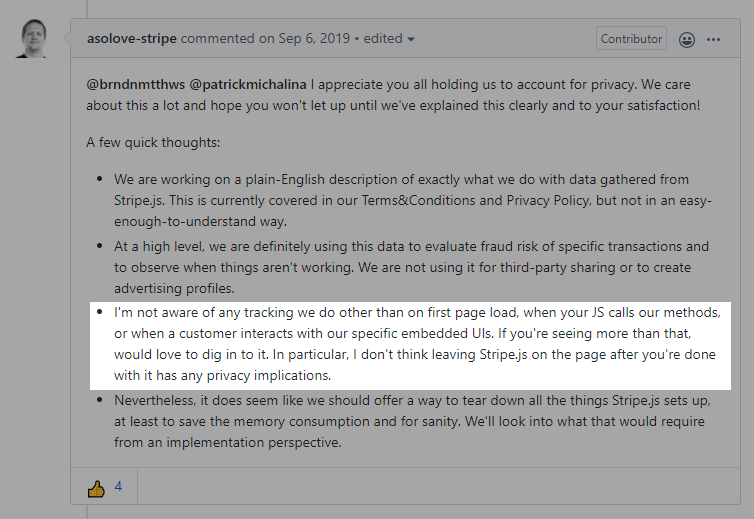
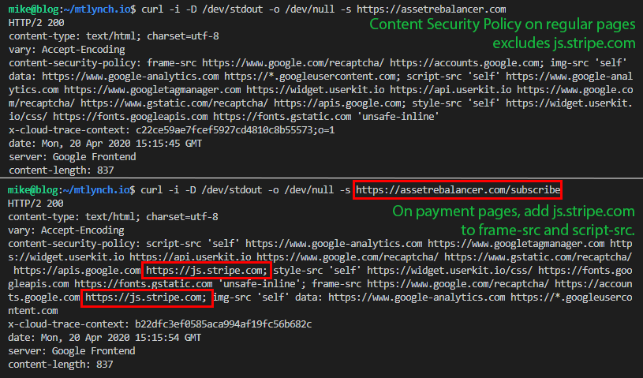

Among startups and tech companies, Stripe seems to be the near-universal favorite for payment processing. When I needed paid subscription functionality for my new web app, Stripe felt like the natural choice. After integration, however, I discovered that Stripe's official JavaScript library records all browsing activity on my site and reports it back to Stripe. This data includes:

1. Every URL the user visits on my site, including pages that never display Stripe payment forms
1. Telemetry about how the user moves their mouse cursor while browsing my site
1. Unique identifiers that allow Stripe to correlate visitors to my site against other sites that accept payment via Stripe

This post shares what I found, who else it affects, and how you can limit Stripe's data collection in your web applications.

## Who's affected?

Stripe collects this data on your website if either of the following is true:

- Your base page template includes the Stripe script tag:
  - `<script src="https://js.stripe.com/v3">`
- Your website is a single-page app, such as one created with React, Vue, or Angular, and you use Stripe to process payments.

## The discovery

I discovered this by accident while adding paid plans to my [portfolio rebalancer](https://assetrebalancer.com). As part of development, I was using [an HTTP proxy](https://portswigger.net/burp) that allows me to inspect HTTP traffic from my browser.

After successfully implementing my app's payment flow with Stripe, I noticed that every page navigation generated a new HTTP POST request to a Stripe URL:



This was strange because none of the pages I visited contained any calls to Stripe's library. In fact, my app doesn't collect payment information from users until they create an account, but Stripe was making HTTP requests when I landed on my app's homepage as a brand new user with no cookies or stored credentials.

## What is Stripe reporting?

All of the outgoing requests Stripe generated looked like this:

```text
POST /4 HTTP/1.1
Host: m.stripe.com
User-Agent: Mozilla/5.0 (Windows NT 10.0; Win64; x64; rv:75.0) Gecko/20100101 Firefox/75.0
Accept: */*
Accept-Language: en-US,en;q=0.5
Accept-Encoding: gzip, deflate
Content-Type: text/plain;charset=UTF-8
Content-Length: 692
Origin: https://m.stripe.network
Connection: close
Referer: https://m.stripe.network/inner.html
Cookie: m=e29f7c00-b748-4e5f-8625-34d14dbc1c01; m=e29f7c00-b748-4e5f-8625-34d14dbc1c01

JTdCJTIydjIlMjIlM0ExJTJDJTIyaWQlMjIlM0ElMjI4MTBiOWIxY2E3ODU5YzNlYzExYTY0NTI0NzNkMTZmYyUyMiUyQyUyMnQlMjIlM0E4JTJDJTIydGFnJTIyJTNBJTIyNC41LjIxJTIyJTJDJTIyc3JjJTIyJTNBJTIyanMlMjIlMkMlMjJhJTIyJTNBbnVsbCUyQyUyMmIlMjIlM0ElN0IlMjJhJTIyJTNBJTIyJTIyJTJDJTIyYiUyMiUzQSUyMmh0dHBzJTNBJTJGJTJGYXNzZXRyZWJhbGFuY2VyLmNvbSUyRnByaWNpbmclMjIlMkMlMjJjJTIyJTNBJTIyUG9ydGZvbGlvJTIwUmViYWxhbmNlciUyMiUyQyUyMmQlMjIlM0ElMjIxYjVhMDcxOS1jMTFjLTQwOTEtYWZiYi00NGE1MjRhMDM2ZGUlMjIlMkMlMjJlJTIyJTNBJTIyMWJhOTYwOWMtMjI0Ni00YjYwLTk1ZWUtYzg0YTRlNDhmOTkzJTIyJTJDJTIyZiUyMiUzQWZhbHNlJTJDJTIyZyUyMiUzQXRydWUlMkMlMjJoJTIyJTNBdHJ1ZSUyQyUyMmklMjIlM0ElNUIlMjJsb2NhdGlvbiUyMiU1RCUyQyUyMmolMjIlM0ElNUIlNUQlMkMlMjJuJTIyJTNBMTkzJTdEJTdE
```

The string shown at the bottom, beginning with `JTdCJTIydj...`, is a URL-encoded, base64-encoded JSON blob. The following bash commands decode it to a human-readable string:

```bash
$ echo "JTdCJTIydjIlMjIlM0ExJTJDJTIyaWQlMjIlM0ElMjI4MTBiOWIxY2E3ODU5YzNlYzExYTY0NTI0NzNkMTZmYyUyMiUyQyUyMnQlMjIlM0E4JTJDJTIydGFnJTIyJTNBJTIyNC41LjIxJTIyJTJDJTIyc3JjJTIyJTNBJTIyanMlMjIlMkMlMjJhJTIyJTNBbnVsbCUyQyUyMmIlMjIlM0ElN0IlMjJhJTIyJTNBJTIyJTIyJTJDJTIyYiUyMiUzQSUyMmh0dHBzJTNBJTJGJTJGYXNzZXRyZWJhbGFuY2VyLmNvbSUyRnByaWNpbmclMjIlMkMlMjJjJTIyJTNBJTIyUG9ydGZvbGlvJTIwUmViYWxhbmNlciUyMiUyQyUyMmQlMjIlM0ElMjIxYjVhMDcxOS1jMTFjLTQwOTEtYWZiYi00NGE1MjRhMDM2ZGUlMjIlMkMlMjJlJTIyJTNBJTIyMWJhOTYwOWMtMjI0Ni00YjYwLTk1ZWUtYzg0YTRlNDhmOTkzJTIyJTJDJTIyZiUyMiUzQWZhbHNlJTJDJTIyZyUyMiUzQXRydWUlMkMlMjJoJTIyJTNBdHJ1ZSUyQyUyMmklMjIlM0ElNUIlMjJsb2NhdGlvbiUyMiU1RCUyQyUyMmolMjIlM0ElNUIlNUQlMkMlMjJuJTIyJTNBMTkzJTdEJTdE" \
  | base64 --decode \
  | python -c "import sys; import json; from urllib.parse import unquote; print(json.dumps(json.loads(unquote(sys.stdin.read())), indent=2, sort_keys=True))"
```

```json
{
  "a": null,
  "b": {
    "a": "",
    "b": "https://assetrebalancer.com/pricing",
    "c": "Portfolio Rebalancer",
    "d": "1b5a0719-c11c-4091-afbb-44a524a036de",
    "e": "1ba9609c-2246-4b60-95ee-c84a4e48f993",
    "f": false,
    "g": true,
    "h": true,
    "i": ["location"],
    "j": [],
    "n": 193
  },
  "id": "810b9b1ca7859c3ec11a6452473d16fc",
  "src": "js",
  "t": 8,
  "tag": "4.5.21",
  "v2": 1
}
```

The Stripe library generates a new request like this every time a user views a new page in my app. Each request looks pretty similar except that the URL field reflects whatever URL is in the address bar at the time of the request. It appeared that Stripe was recording every single pageview in my app. What's more, Stripe records the full URL, including query parameters and URL fragments (e.g., `/account?id=12345#name=michael`), which some websites use to store sensitive information.

You may have noticed from the video that when I initially loaded the app, the first page generated two requests, whereas every other page load created only one. Here's what I found when I decoded that second request:

```json
{
  "data": [4669, 20, 26, 13, 21, 20, 40, 21, 25, 14],
  "muid": "1b5a0719-c11c-4091-afbb-44a524a036de",
  "sid": "1ba9609c-2246-4b60-95ee-c84a4e48f993",
  "source": "mouse-timings-10",
  "url": "https://assetrebalancer.com/"
}
```

Based on the name `mouse-timings`, it seems that Stripe is recording my users' mouse movements.

Lastly, each request contains the same cookie, uniquely identifying the user:

```text
Cookie: m=e29f7c00-b748-4e5f-8625-34d14dbc1c01
```

The cookie allows Stripe to track my users as they visit other sites across the web that integrate Stripe, even if they never see a payment form.

## Is this a mistake?

At first, I thought this was surely my mistake. There must have made a careless error in my Stripe integration that made it phone home erroneously.

To investigate, I [googled the URL](https://google.com/search?q=https%3A%2F%2Fm.stripe.com%2F4) that was receiving the HTTP POST requests from my app:

```text
https://m.stripe.com/4
```

Instead of finding a bug in my code, I discovered dozens of posts from other developers surprised to see this behavior in their apps. The reports go [all the way back to 2017](https://stackoverflow.com/q/45718026/90388).

{{}}

In one of the issue threads on Github, a Stripe employee [suggested that this behavior was unintentional](https://github.com/stripe/react-stripe-elements/issues/99#issuecomment-528987443) and Stripe would look for a fix:

{{}}

That was 7 months ago, and there has been no follow up from Stripe on that thread or anywhere else I could find.

## Confirming the issue

To be sure that nothing else in my app was triggering this behavior, I [created a minimal project](https://github.com/mtlynch/stripe-snooping-example) to reproduce the issue. It's a barebones Vue app with only the [`@stripe/stripe-js` npm package](https://www.npmjs.com/package/@stripe/stripe-js) installed.

My experiments confirmed that the following line causes the Stripe library to load and initiate user tracking:

```javascript
import { loadStripe } from "@stripe/stripe-js";
```

Note that my app never even _calls_ the `loadStripe` function. Stripe.js begins tracking user behavior as soon as the client app imports the library. For a single-page app, this occurs the moment the end-user loads any page of the website.


**Note**: `loadStripe` is a misleading name because Stripe loads before the client application ever calls that function. A more appropriate name would be `ensureStripeIsLoaded` because the function's real job is to queue any of the app's API calls until the Stripe library has finished loading.


## Reporting this to Stripe

I [reported this issue to Stripe support](email-to-stripe-support.txt) to see whether it was intended behavior and how to prevent it.

Stripe responded promptly to tell me that user tracking was by design, and I should, in fact, welcome this functionality:

> Hi Michael,
>
> Thanks for getting in touch. Faith here from Stripe support.
>
> Jumping right in, the calls being seen are by design in order to detect fraud and is in the best interests of the user. According to the docs: "To best leverage Stripe’s advanced fraud functionality, include this script on every page, not just the checkout page. This allows Stripe to detect anomalous behavior that may be indicative of fraud as customers browse your website."
>
> [https://stripe.com/docs/js/including](https://stripe.com/docs/js/including)
>
> Please let us know should you run into any other issues or have any other concerns.
>
> All the best,<br>
> Faith

The "in the best interests of the user" line felt particularly patronizing. The party benefiting most from this data collection is clearly Stripe and not the user. Stripe is getting free data to train its fraud-detection models and potentially selling that information to advertisers.

For the user, Stripe.js degrades their experience by forcing them to download an extra JavaScript library and sending extra HTTP requests from their browser. This happens even if the user never visits a page that accepts credit card payments.

## Is Stripe disclosing this?

I looked around for an official disclosure from Stripe about this behavior, but I couldn't find anything. The closest I found is this vague paragraph on [their npm package description](https://www.npmjs.com/package/@stripe/stripe-js), which the Stripe support rep quoted to me:

> To best leverage Stripe’s advanced fraud functionality, ensure that Stripe.js is loaded on every page, not just your checkout page. This allows Stripe to detect anomalous behavior that may be indicative of fraud as customers browse your website.

The [privacy policy](https://stripe.com/privacy) is a bit more specific about the data they collect, but it implies that they're collecting this data on stripe.com rather than on customer sites:

> Our Sites use cookies and other technologies to function effectively. These technologies record information about your use of our Sites, including:
>
> - Browser and device data, such as IP address, device type, operating system and Internet browser type, screen resolution, operating system name and version, device manufacturer and model, language, plug-ins, add-ons and the language version of the Sites you are visiting;
> - Usage data, such as time spent on the Sites, pages visited, links clicked, language preferences, and the pages that led or referred you to our Sites.
>
> We also may collect information about your online activities on websites and connected devices over time and across third-party websites, devices, apps and other online features and services.

Worryingly, the privacy policy also includes loose wording that allows Stripe to sell this data to advertisers:

> When you visit our Sites or online services, both we and certain third parties collect information about your online activities over time and across different sites to provide you with advertising about products and services tailored to your individual interests (this type of advertising is called “interest-based advertising”).

## Mitigation

For site owners to prevent this invasive tracking from Stripe, there are two problems to solve:

1. Delay execution of Stripe's library until the user reaches a page where payment is required
1. Unload the Stripe library after the user completes payment.

### Solving problem one: defer Stripe's script loading

As mentioned [above](#confirming-the-issue), Stripe begins executing as soon as the app imports the library. Some developers intentionally prevent this behavior by [adding asynchronous wrapper functions](https://stackoverflow.com/a/61248986/90388) or using [code splitting](https://webpack.js.org/guides/code-splitting/).

Fortunately, the stripe-js v.1.4.0 release, published last week [offers a cleaner solution](https://github.com/stripe/stripe-js/issues/43#issuecomment-614864800). The update introduced the `@stripe/stripe-js/pure` import path, which allows clients to import Stripe without side-effects:

```javascript
import { loadStripe } from "@stripe/stripe-js/pure";
```

This delays Stripe's library execution until the app explicitly calls the `loadStripe` function. If you limit calls to the `loadStripe` function only to pages or components that involve Stripe payments, Stripe will only load on those pages, thus preventing user tracking earlier in the browsing session.

### Solving problem two: unloading Stripe after payment

Deferring Stripe's library load is only half the battle. Even if you load Stripe only at payment time, their JavaScript persists in your app and continues tracking the user for the rest of their session. To prevent this, your app must force Stripe to unload when the customer's payment is complete.

Stripe unfortunately offers no supported way to unload its library or disable its user monitoring. One intrepid developer [created a JavaScript snippet to aggressively unload all Stripe code](https://github.com/stripe/react-stripe-elements/issues/99#issuecomment-522045812), but it's specific to React and is, by nature, a brittle solution because it depends on undocumented properties of the Stripe library that may change at any time.

I addressed the issue in my app by forcing an HTTP reload when the user exits my payment page. In Vue, the [`beforeRouteLeave`](https://router.vuejs.org/guide/advanced/navigation-guards.html#in-component-guards) hook executes before leaving the page. I added a hook that interrupts the routing process and forces the application to make a full HTTP request to the next route:

```javascript
beforeRouteLeave(to) {
  // Force an HTTP request instead of a JavaScript route change because we need
  // a new page load that does *not* import Stripe.
  window.location.replace(to.path);
}
```

### (New) Disable user tracking


**Added**: April 30, 2020


After the initial publication of my article, Stripe updated its JavaScript library to include [a new parameter to disable tracking entirely](https://github.com/stripe/stripe-js/blob/ef32028d0e1f8381b3b4ecca8bc74bf659e7153e/README.md#disabling-advanced-fraud-detection-signals). This option is available as of `@stripe/stripe-js` v1.5.0:

```javascript
import { loadStripe } from "@stripe/stripe-js/pure";

loadStripe.setLoadParameters({ advancedFraudSignals: false });
const stripe = await loadStripe("pk_test_TYooMQauvdEDq54NiTphI7jx");
```

This is a welcome option, though the downside is that the functionality is all-or-nothing. If you enable fraud detection, you can't turn it off after a Stripe transaction is complete unless you force a page reload (see [above](#solving-problem-two-unloading-stripe-after-payment)).

### (optional) Content Security Policy for defense in depth

The previous two steps are sufficient to prevent Stripe's tracking. For additional protection, apply [Content Security Policy](https://developer.mozilla.org/en-US/docs/Web/HTTP/CSP) (CSP) to restrict Stripe to your payment pages.

Here's what it looks like for my app:

{{}}

It's a bit tricky to implement per-page CSP in a single-page app because the browser, by default, won't query the server for new policies when the user navigates to a new page. To force a policy refresh, I use Vue's [`beforeRouteEnter`](https://router.vuejs.org/guide/advanced/navigation-guards.html#in-component-guards) guard on my payment page to force a new HTTP request when the page loads.

```javascript
beforeRouteEnter(to, from) {
  // If we're landing on this page from another route, force an HTTP request
  // so that we retrieve the route-specific Content Security Policy header.
  if (from.matched.length > 0) {
    window.location.replace(to.path);
  }
}
```

It's probably not worth implementing CSP solely to hobble Stripe, but if you have a working policy in place, it provides additional assurance that Stripe's library runs only on your payment pages.

## Demo site

To see Stripe's behavior on a live site, I created a minimal Vue app that demonstrates this behavior:

- [Vulnerable site](https://frosty-banach-185455.netlify.app/) [(source)](https://github.com/mtlynch/stripe-snooping-example)
- [Site with mitigations](https://5e9db0c5ea0e3200062c02ea--frosty-banach-185455.netlify.app/) [(source)](https://github.com/mtlynch/stripe-snooping-example/pull/1/files#diff-6d8c4c1f8080f58cb36a900829a76f43)

## Summary

Websites that use Stripe to collect payment usually include Stripe's JavaScript library within their application. Integrating it according to Stripe's documentation causes the library to share user tracking data with Stripe throughout the user's browsing session, even on pages that do not interact with Stripe or display payment forms. This data includes:

- Full URLs of each page the user visits, including query parameters and URL fragments
- Timings of how quickly the user moves their mouse during browsing
- A cookie that allows Stripe to track the same user across the web

Stripe does not clearly disclose their collection of this data, and they make it difficult for client applications to limit the library's tracking behavior.

When discussing the issue informally, Stripe has [publicly stated](https://github.com/stripe/react-stripe-elements/issues/99#issuecomment-528987443) that they use the data exclusively for fraud protection and diagnostics, but language in their [privacy policy](https://stripe.com/privacy) suggests that they may also use or sell it for marketing purposes.

## Recommendations to Stripe

Given how seriously Stripe seems to take security and privacy, it's surprising that they have been collecting so much data from their customers with so little transparency. My hope is that this is simply an oversight that's persisted because too few customers have noticed.

There are several actions Stripe can take to rectify this situation:

- Clearly disclose data sharing.
  - The npm package pages and the Stripe.js documentation should clearly define what browsing and telemetry data the library transmits to Stripe when a client application integrates it.
- Support library unloading.
  - Give client applications a supported mechanism to unload Stripe after the app has collected a user's payment.
- Grant client applications control over what data to share via opt-in.
  - Stripe clients bear the cost of chargebacks against their application, so they should decide how much information to share with Stripe to reduce those chargebacks.


**Update: April 21, 2020 - 2:47pm ET**

Stripe co-founder Patrick Collison [responded to this article](https://news.ycombinator.com/item?id=22937303) reasserting Stripe's commitment to use the data collected exclusively for fraud detection. He added that Stripe will soon clarify language in its terms of service around their data collection practices.

**Correction**: The article originally said, "Websites that use Stripe to collect payment **must** include Stripe's JavaScript library," but Collison points out that this is inaccurate, as it is possible for websites to integrate with Stripe without using the Stripe JS library.



**Update: April 30, 2020**

Stripe has [revised their privacy policy and developer documentation](https://stripe.com/blog/advanced-fraud-detection-updates) and added functionality to their JavaScript library that empowers integrators to limit tracking behavior.

I published a follow-up post that discusses how Stripe's changes address the concerns I raised:

- [Update: Stripe's Response Regarding User Tracking](/stripe-update/)
  
