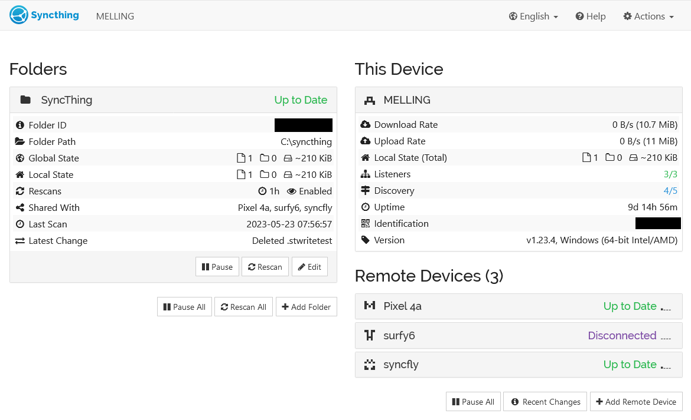
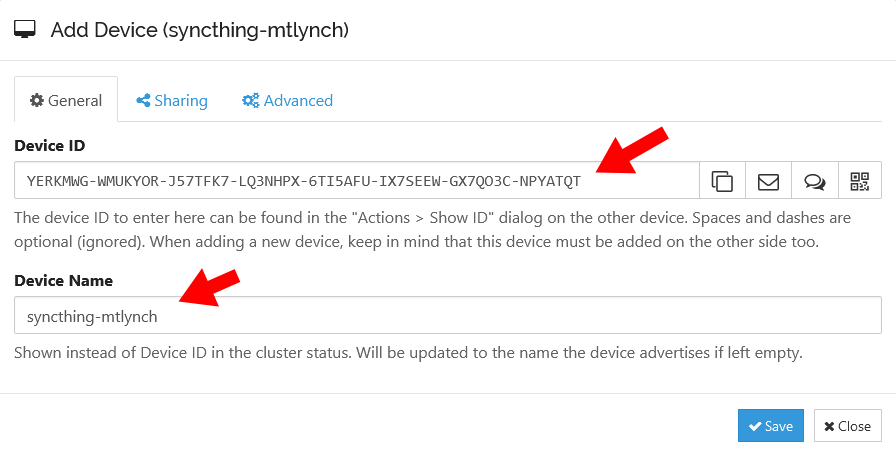
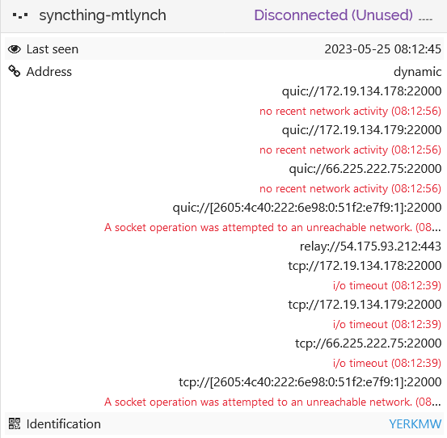
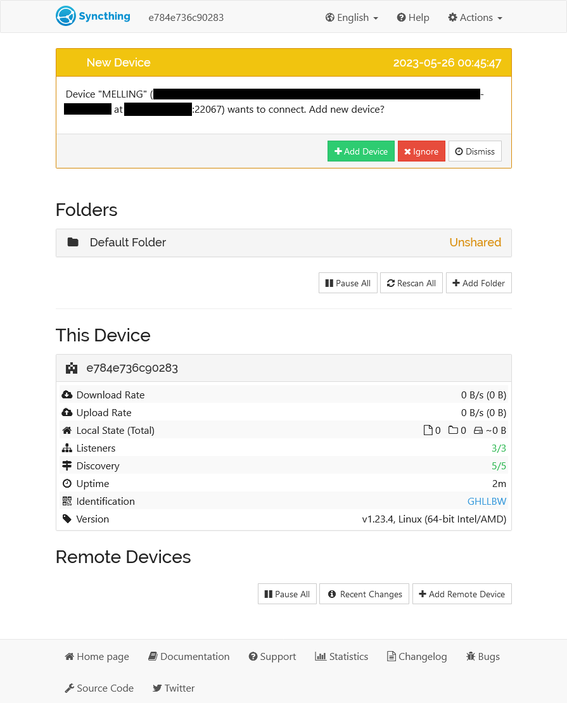
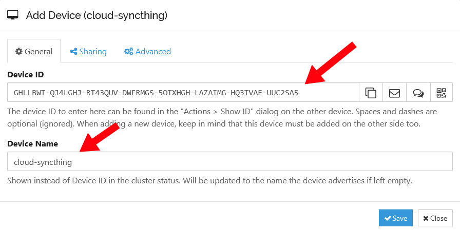
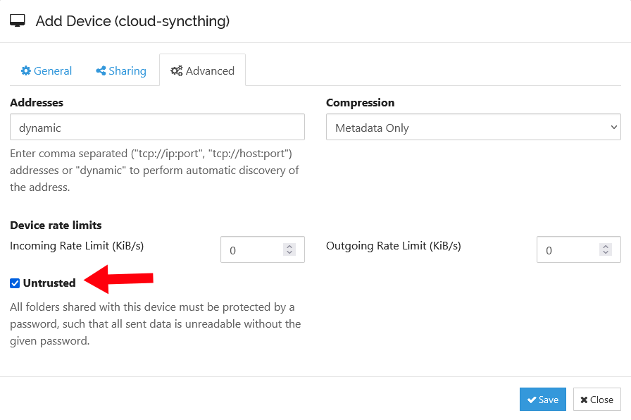
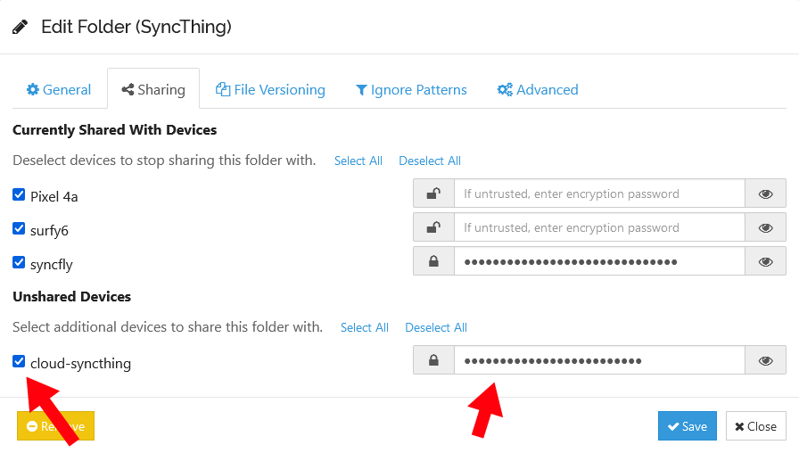

I recently discovered [Syncthing](https://syncthing.net/), an open-source tool for syncing files across multiple machines.

{{}}

Setting up Syncthing on my personal devices was easy, but I went on an interesting journey deploying it to a cloud server.

## Why run Syncthing in the cloud?

Syncthing synchronizes files peer to peer. That means that at least two of my devices have to be online and running Syncthing simultaneously to stay in sync. If I change a file on my desktop, shut it down, and then take my laptop with me on a work trip, my laptop won't pick up the changes I made on my desktop.

I could prevent my devices from going out of sync with each other if I had one cloud server running Syncthing that was always online and available.

## I don't want your life story &mdash; just tell me how to deploy Syncthing

I'm going to share some approaches to deploying Syncthing that failed. If you want to skip to the solution, see the section, ["How to deploy Syncthing to Fly.io"](#how-to-deploy-syncthing-to-flyio).

## Prior work: Syncthing + Tailscale on Fly.io

For the past two years, [Fly.io](https://fly.io) has been my preferred cloud hosting provider, so I checked if anyone had written about Syncthing on Fly.io. It turned out that [Andrew Katz had written a nice tutorial](https://web.archive.org/web/20240523091036/https://akatz.org/running-syncthing-on-fly-io-with-tailscale/) less than a year ago.

{{}}

Andrew's tutorial was great news because it proved that my idea was feasible. One quibble I had was that it depended on Tailscale, a popular VPN solution. I love Tailscale, but it has some serious drawbacks in this context.

Combining Syncthing with Tailscale requires building a custom Docker image. It's a nontrivial maintenance burden to update that image as both tools evolve. And mixing together two applications in a single container is [a bit of a Docker no-no](https://docs.docker.com/develop/develop-images/dockerfile_best-practices/#decouple-applications).

All Fly.io servers include Wireguard VPN by default. I suspected that I could improve Andrew's solution by leaning on the Wireguard connection that was already there instead of mixing in Tailscale.

## The linuxserver Docker image doesn't work on Fly.io

When I searched for a Syncthing Docker image, I somehow overlooked the [official Docker image](https://hub.docker.com/r/syncthing/syncthing) and instead found the [unofficial LinuxServer.io version](https://hub.docker.com/r/linuxserver/syncthing).

I tried deploying the linuxserver.io version to Fly.io, but the server immediately went into a crash loop:

```text
2023-05-23T12:44:17.247 [info] Preparing to run: `/init` as root
2023-05-23T12:44:17.258 [info] 2023/05/23 12:44:17 listening on [fdaa:0:20ad:a7b:cb:a9e9:30cd:2]:22 (DNS: [fdaa::3]:53)
2023-05-23T12:44:17.261 [info] s6-overlay-suexec: fatal: can only run as pid 1
```

I discovered a [Fly.io support thread](https://community.fly.io/t/deploying-grocy-image/6238?u=mtlynch) with the same issue:

> After some digging around I think I know what the issue is! Thanks to your last message with the error `s6-overlay-suexec: fatal: can only run as pid 1`
>
> I was able to do some digging and found that the image I’m using, uses a process manager that wants to run as pid 1 which, according to [Running Multiple Processes Inside A Fly.io App](https://fly.io/docs/app-guides/multiple-processes/#there-are-so-many-other-process-managers), isn’t possible.
>
> -[@mpaupulaire](https://community.fly.io/t/deploying-grocy-image/6238/6?u=mtlynch)

Looking at the linuxserver Docker source, their runtime image [depends on linuxserver/baseimage-alpine](https://github.com/linuxserver/docker-syncthing/blob/caf5ba87db5202e261215b807c03dc59c740de01/Dockerfile#L37). I pulled up the source for [that image](https://github.com/linuxserver/docker-baseimage-alpine/blob/07df980344f2b046c255bf9be5a391fe2f4a06f8/Dockerfile), and I don't know much about overriding the `init` process, but there were several lines in the file related to init, so it looked like the issue @mpaupulaire spotted explained my crash loop.

Instead of checking more rigorously for an official Syncthing Docker image, I spent three hours [making my own](https://github.com/mtlynch/docker-syncthing). When I sat down to write this tutorial, I realized I had overlooked [the official image](https://hub.docker.com/r/syncthing/syncthing), so I'll skip to that.

## A basic Syncthing deployment on Fly.io

With the official Syncthing Docker image in hand, I was ready to deploy to Fly.io. To start, I created a new Fly.io app:

```bash
$ fly apps create --name syncthing-mtlynch
? Select Organization: Michael Lynch (personal)
New app created: syncthing-mtlynch
```

Synthing needs a place to store data, so I created a Fly.io persistent volume called `syncthing_data`:

```bash
SIZE_IN_GB=3 # This is the limit of fly.io's free tier as of 2023-05-29

fly volumes create syncthing_data \
  --size "${SIZE_IN_GB}" \
  --yes
```

Next, made a minimal Fly.io config for Syncthing:

```toml
app = "syncthing-mtlynch"

[build]
  image = "syncthing/syncthing:1.23.4"

[mounts]
  source="syncthing_data"
  destination="/var/syncthing"
```

Now, the moment of truth. I launched the app:

```bash
$ fly deploy
==> Verifying app config
Validating /tmp/tmp.mezhLZdpSv/fly.toml
Platform: machines
✓ Configuration is valid
--> Verified app config
==> Building image
Searching for image 'syncthing/syncthing:1.23.4' remotely...
image found: img_98dgp8mlx504xw05

Watch your app at https://fly.io/apps/syncthing-mtlynch/monitoring

Updating existing machines in 'syncthing-mtlynch' with rolling strategy
  [1/1] Replacing 6e82ddd3ae5698 [app] by new machine
  [1/1] Machine 918570e1f96283 [app] update finished: success
  Finished deploying
```

And it worked! From the logs, Syncthing was up and running.

```text
2023/05/25 12:09:52 INFO: My ID: YERKMWG-WMUKYOR-J57TFK7-LQ3NHPX-6TI5AFU-IX7SEEW-GX7QO3C-NPYATQT
2023/05/25 12:09:53 INFO: GUI and API listening on [::]:8384
2023/05/25 12:09:53 INFO: Access the GUI via the following URL: http://127.0.0.1:8384/
2023/05/25 12:09:53 INFO: My name is "918570e1f96283"
2023/05/25 12:09:53 INFO: Completed initial scan of sendreceive folder "Default Folder" (default)
2023/05/25 12:10:12 INFO: quic://0.0.0.0:22000 detected NAT type: Port restricted NAT
2023/05/25 12:10:12 INFO: quic://0.0.0.0:22000 resolved external address quic://66.225.222.75:22000 (2023/05/25 12:10:32 INFO: Joined relay relay://54.175.93.212:443
```

The logs showed the Syncthing server's device ID, so I could add it as a peer from my local Syncthing server:

{{}}

Unfortunately, my local Syncthing instance failed to connect to the cloud server.

{{}}

That's expected because I haven't configured my Fly.io server to allow any inbound traffic.

If I left the server alone long enough, it would likely connect anyway through a [relay](https://docs.syncthing.net/users/relaying.html#relaying), but Syncthing works better if you configure its incoming ports correctly.

## Configuring firewall ports for Syncthing

At this point, Syncthing was up and running on Fly.io, but it couldn't accept traffic from any of my other devices.

Syncthing has helpfully clear documentation on configuring your firewall to expose the ports it needs [to communicate with peers](https://docs.syncthing.net/users/firewall.html#local-firewall):

> Port 22000/TCP: TCP based sync protocol traffic
>
> Port 22000/UDP: QUIC based sync protocol traffic
>
> Port 21027/UDP: for discovery broadcasts on IPv4 and multicasts on IPv6

Here's how I translated that into Fly.io's configuration.

```toml
[[services]]
  internal_port = 22000
  protocol = "tcp"

  [[services.ports]]
    port = 22000

  [[services.tcp_checks]]
    grace_period = "1s"
    interval = "15s"
    restart_limit = 0
    timeout = "2s"

[[services]]
  internal_port = 22000
  protocol = "udp"

  [[services.ports]]
    port = 22000

[[services]]
  internal_port = 21027
  protocol = "udp"

  [[services.ports]]
    port = 21027
```

I used port 22000 as a health check port. That means Fly.io will periodically poll that port, and if it can't connect, it will know that Syncthing is unhealthy.

The Synthing Docker image's admin interface defaults to 0.0.0.0:8384, so it accepts connections on both private and public network interfaces. This shouldn't _really_ matter since my Fly.io config doesn't expose port 8384. For the sake of defense in depth, I configured Syncthing to listen only on the loopback interface.

Syncthing's [documentation](https://github.com/syncthing/syncthing/blob/v1.23.4/README-Docker.md#gui-security) explains that you can restrict access to the admin UI by unsetting the `STGUIADDRESS` environment variable.

```toml
[env]
  # Only listen for connections to admin GUI through localhost.
  STGUIADDRESS = ""
```

Putting it all together, my `fly.toml` file looked like this:

```toml
app = "syncthing-mtlynch"

[build]
  image = "syncthing/syncthing:1.23.4"

[env]
  # Only listen for connections to admin GUI through localhost.
  STGUIADDRESS = ""

[mounts]
  source="syncthing_data"
  destination="/var/syncthing"

[[services]]
  internal_port = 22000
  protocol = "tcp"

  [[services.ports]]
    port = 22000

  [[services.tcp_checks]]
    grace_period = "1s"
    interval = "15s"
    restart_limit = 0
    timeout = "2s"

[[services]]
  internal_port = 22000
  protocol = "udp"

  [[services.ports]]
    port = 22000

[[services]]
  internal_port = 21027
  protocol = "udp"

  [[services.ports]]
    port = 21027
```

## Configuring Syncthing without Tailscale

Now, I've got Syncthing running on Fly.io! I can grab the device ID from the logs and add my Fly.io Syncthing node as a peer.

There's still a problem. Peer relationships in Syncthing require mutual consent. For my Syncthing cloud server to accept relationships from my devices, I'd need to access the cloud server's admin dashboard.

I didn't want to expose the Syncthing admin interface to the whole Internet. I theoretically could have protected it with a strong password, but network-level protections are stronger and more reliable.

Andrew Katz [solved this problem](#prior-work-syncthing--tailscale-on-flyio) by joining his Fly.io Syncthing server to his personal Tailscale VPN. That allowed Andrew to access the admin interface from within his VPN while preventing anyone else from connecting.

As I mentioned before, every Fly.io server has Wireguard VPN built in, so could I access the admin interface that way?

I started by attempting to SSH into my server:

```bash
$ fly ssh console
Connecting to fdaa:0:20ad:a7b:15f:92b0:4091:2... complete
32874e1dc76685:/#
```

That was easy. I now had console access to my Syncthing server and could run any command I wanted.

With the standard `ssh` utility, you can tunnel local ports to the other end of the SSH connection. If I could tunnel my local port 8384 to port 8384 on my Syncthing server, then I could access my Syncthing server's admin dashboard.

Unfortunately, the `fly ssh` command doesn't support port forwarding, so that was out. But I discovered that the `fly` utility has a `proxy` command, so I tried that:

```bash
$ fly proxy 8384:8384
Proxying local port 8384 to remote [syncthing-mtlynch.internal]:8384
```

Okay, that seemed like it was doing something. But then I tried connecting, and no dice:

```bash
$ curl http://localhost:8384
curl: (56) Recv failure: Connection reset by peer
```

I tried a simpler test where I launched netcat on port 8000 and then tried to proxy to that:

```bash
32874e1dc76685:/# nc -l 8000
```

```bash
$ fly proxy 8000:8000
Proxying local port 8000 to remote [syncthing-mtlynch.internal]:8000
```

```bash
$ curl http://localhost:8000
curl: (56) Recv failure: Connection reset by peer
```

On my Fly.io server, netcat didn't show any attempt at a connection. What gives?

I found a Fly.io forum post titled, ["Fly proxy seemingly doesn't work,"](https://community.fly.io/t/fly-proxy-seemingly-doesnt-work/7180?u=mtlynch) which certainly captured my feelings in that moment:

> I’m trying to connect my local computer through fly proxy 8080 and tells me the following:
>
> `Proxying local port 8080 to remote [notion-to-calendar.internal]:8080`
>
> However, `curl localhost:8080` or `curl 0.0.0.0:8080` just hangs until I close the proxy.
>
> -[@bram-dingelstad](https://community.fly.io/t/fly-proxy-seemingly-doesnt-work/7180?u=mtlynch)

`@jerome` from the Fly.io team explained what was going on:

> only listeners bound on ipv6 are accessible via the `fly proxy` command.
>
> -[@jerome](https://community.fly.io/t/fly-proxy-seemingly-doesnt-work/7180/9?u=mtlynch)

Ah, IPv6! That would explain it. If Syncthing was listening on an IPv4 interface, then it wouldn't receive the connection from the Fly.io proxy.

I ran into a similar issue [when I was maintaining the Sia Docker image](/sia-nextcloud/#dockerfilesia). The solution then was to proxy connections using a tool called `socat`, so I tried it here to listen on IPv6 port 8386 and proxy the connection to IPv4 port 8384.

```bash
apk add socat && \
  socat TCP6-LISTEN:8386,fork,su=nobody TCP4:localhost:8384
```

Then I updated the `fly proxy` command to send traffic to the IPv6 port:

```bash
fly proxy 8384:8386
```

And voila! It worked. I was able to access my Syncthing cloud server's admin dashboard from my local device.

{{}}

Andrew Katz's solution has the advantage of making his Fly.io server's admin interface available to him at any time. If I want to make administrative changes to my Fly.io server, I have to go through the ugly dance of setting up an ad-hoc proxy, but that's actually fine for me. I expect maintenance to be infrequent, so I don't mind some kludginess there.

## Can I avoid the socat hack?

Proxying IPv6 through `socat` worked, but it's ugly and convoluted. Is there a cleaner way?

It seemed like Syncthing natively supported IPv6, so I tried telling it to listen on the Fly.io server's IPv6 loopback interface, `::1`:

```toml
[env]
  STGUIADDRESS = "[::1]:8384"
```

I redeployed with `fly deploy` and everything started up fine. The logs showed that Syncthing was now listening on `::1`:

```text
INFO: Access the GUI via the following URL: http://[::1]:8384/
```

So far, so good. I'll try the proxy command again:

```bash
$ fly proxy 8384:8384
Proxying local port 8384 to remote [syncthing-mtlynch.internal]:8384
```

And now, I'll try connecting over `8384`:

```bash
$ curl http://localhost:8384/
curl: (56) Recv failure: Connection reset by peer
```

Darn! So close.

In my Syncthing server logs, I saw dozens of lines with this message:

```text
[UPMD6] 2023/05/25 11:41:16 INFO: Listen (BEP/tcp): TLS handshake: EOF
```

TLS? Huh? Syncthing's logs said it was listening for plaintext `http://` connections. But for fun, I tried the HTTPS protocol:

```bash
$ curl https://localhost:8384/
curl: (35) OpenSSL SSL_connect: Connection reset by peer in connection to localhost:8384
```

Nope, no dice there either. I suspect that I'm close to a solution here, so if readers have ideas, let me know.

The other route I considered was skipping the web GUI entirely and just doing everything through the CLI like a real hacker.

```bash
$ syncthing cli --home /var/syncthing/config config devices
NAME:
   syncthing cli config devices -

USAGE:
   syncthing cli config devices command [command options] [arguments...]

COMMANDS:

   ACTIONS:
     list      List item keys in the collection
     add       Add a new item to collection
     add-json  Add a new item to collection deserialised from JSON
```

But Syncthing's CLI seemed pretty complex, so I decided the web GUI is good enough for me.

**Update (2023-06-29)**: We have a solution!

Thanks to readers who let me know about using the `fly-local-6pn` address. I can update my `fly.toml` with this environment variable:

```toml
STGUIADDRESS = "fly-local-6pn:8384"
```

From there, I can use `flyctl proxy 8384:8384`, and connect like normal. I've updated the tutorial below to take advantage of this improvement.

## How to deploy Syncthing to Fly.io

Now that I've poked around Syncthing and Fly.io through lots of trial and error, I'm ready to present a clean way to deploy Syncthing on Fly.io. It should only take about five minutes from start to finish.

### Pre-requisites

Before you begin, you'll need:

- A Fly.io account (with billing activated)
- The `fly` CLI [installed](https://fly.io/docs/getting-started/installing-flyctl/) and authenticated on your machine

### Create your app

First, create a new Fly.io app.

The snippet below names your app `syncthing-` plus a random suffix, but you can choose any app name that isn't already claimed on Fly.io.

```bash
RANDOM_SUFFIX="$(head /dev/urandom | tr -dc 'a-z0-9' | head -c 6 ; echo '')"
APP_NAME="syncthing-${RANDOM_SUFFIX}"

fly apps create --name "${APP_NAME}"
```

### Create Fly.io configuration file

Next, create a Fly.io configuration file for your deployment.

I prefer to know exactly what version I'm running, so I'm setting `SYNCTHING_VERSION` to the explicit `1.23.4` version image. If you want your Fly.io server to run the latest stable version on every new server deployment, set the version to `latest`. If you're feeling wild, you can choose `edge` or `nightly` for an unstable release with bleeding edge features.

For `REGION`, choose [a Fly.io region](https://fly.io/docs/reference/regions/) near you.

The `VOLUME_NAME` doesn't matter, but you can change it to whatever you want.

```bash
SYNCTHING_VERSION="1.23.4"
REGION="ewr" # Deploy to Fly.io's Newark, NJ, USA data center.
VOLUME_NAME="syncthing_data"

cat <<EOF > fly.toml
app = "${APP_NAME}"
primary_region = "${REGION}"

[build]
  image = "syncthing/syncthing:${SYNCTHING_VERSION}"

[env]
  # Only listen for connections to admin GUI through fly.io's private Wireguard
  # network.
  STGUIADDRESS = "fly-local-6pn:8384"

[mounts]
  source="${VOLUME_NAME}"
  destination="/var/syncthing"

[[services]]
  internal_port = 22000
  protocol = "tcp"

  [[services.ports]]
    port = 22000

  [[services.tcp_checks]]
    grace_period = "1s"
    interval = "15s"
    restart_limit = 0
    timeout = "2s"

[[services]]
  internal_port = 22000
  protocol = "udp"

  [[services.ports]]
    port = 22000

[[services]]
  internal_port = 21027
  protocol = "udp"

  [[services.ports]]
    port = 21027
EOF
```

### Create a persistent volume

You'll need a persistent volume so that Syncthing doesn't lose your configuration and data on every server restart.

You can choose any volume size, but Fly.io [offers 3 GB in its free tier](https://fly.io/docs/about/pricing/#free-allowances) as of this writing.

```bash
SIZE_IN_GB="3" # This is the limit of fly.io's free tier as of 2023-05-24

fly volumes create "${VOLUME_NAME}" \
  --region "${REGION}" \
  --size "${SIZE_IN_GB}" \
  --yes
```

### Deploy your server

Finally, it's time to deploy your app. There's no reason to purchase IPv4 addresses for Syncthing, so you can add the `--no-public-ips` flag:

```bash
fly deploy --no-public-ips
```

If everything worked, you should see a message like this:

```text
No machines in group app, launching a new machine
  Machine e286537dbd3586 [app] update finished: success
Finished launching new machines
Updating existing machines in 'syncthing-ccdb2x' with rolling strategy
  Finished deploying
```

### Adding your Syncthing cloud server as a peer

Once your Syncthing server is running, you'll need its device ID to connect to it. You can find this by checking your server logs:

```bash
$ fly logs | grep "My ID: "
2023-05-26T04:20:28Z app[e784e736c90283] ewr [info][GHLLB] 2023/05/26 04:20:28 INFO: My ID: GHLLBWT-QJ4LGHJ-RT43QUV-DWFRMGS-5OTXHGH-LAZAIMG-HQ3TVAE-UUC2SA5
```

On your local Syncthing devices, add your cloud Syncthing server by clicking "Add Device" and entering the Device ID. You can give the server any device name. I chose the wildly creative name, `cloud-syncthing`.

{{}}

You can improve the security of your cloud Syncthing server by treating it as "Untrusted." That tells your other devices to send data to the server only after encrypting it. If an attacker ever compromises your Fly.io server, they'll only get unreadable encrypted data.

{{ Advanced">}}

Finally, share one of your folders with your new Syncthing server. Go to Edit Folder > Sharing and check the box for the new peer. If you marked it as untrusted, set a strong passphrase to encrypt the data.

{{ Sharing">}}

### Access web UI

To access your Fly.io server's Syncthing admin dashboard, open a proxy to connect your local port 8384 to your Fly.io server's port 8384:

```bash
fly proxy 8384:8384
```

With the proxy in place, you should be able to access your cloud server's Syncthing dashboard from your local device via a `localhost` URL:

- <http://localhost:8384>

You should see an admin dashboard like the following:

{{}}

Congratulations! You've deployed your Syncthing server to the cloud, and you now have full access to it. From here, you can configure it just like you would any other device running Syncthing.

When you're done configuring Syncthing settings on your Fly.io server, terminate the `fly proxy` command with `Ctrl+C`.
