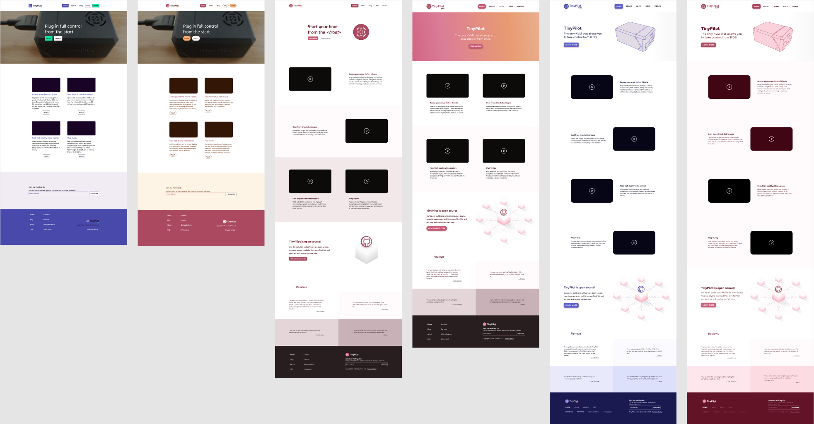
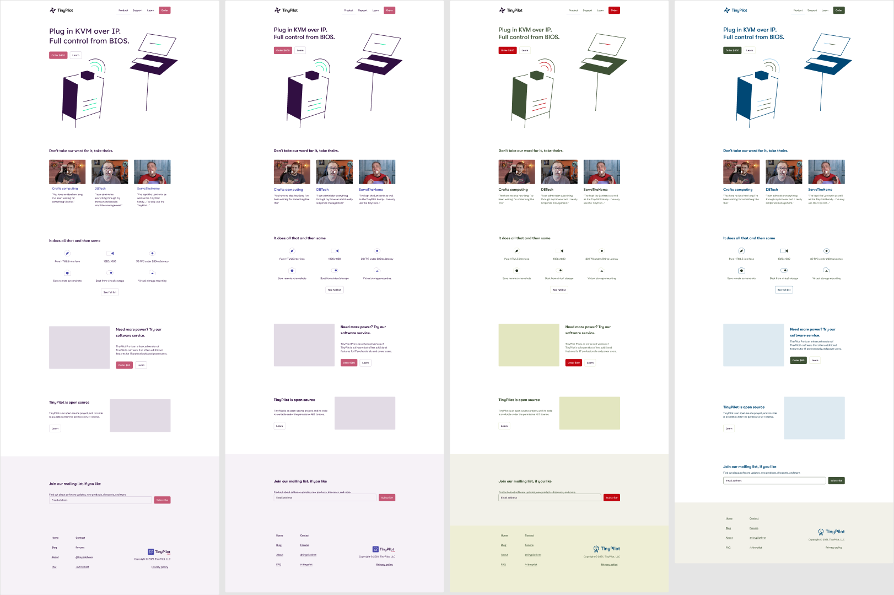
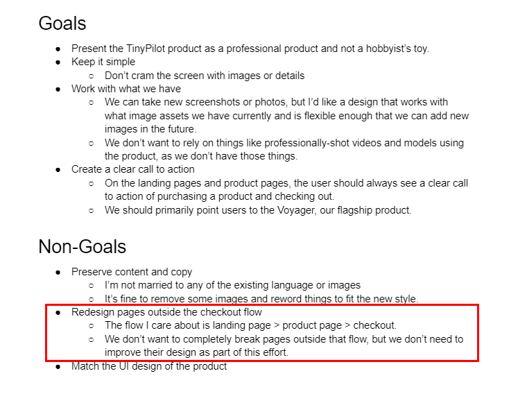
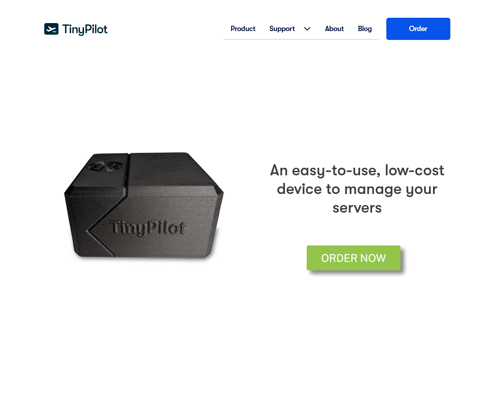
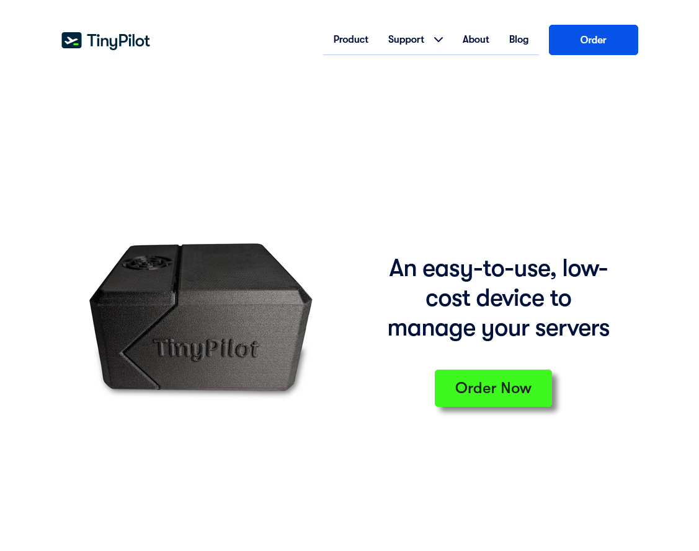
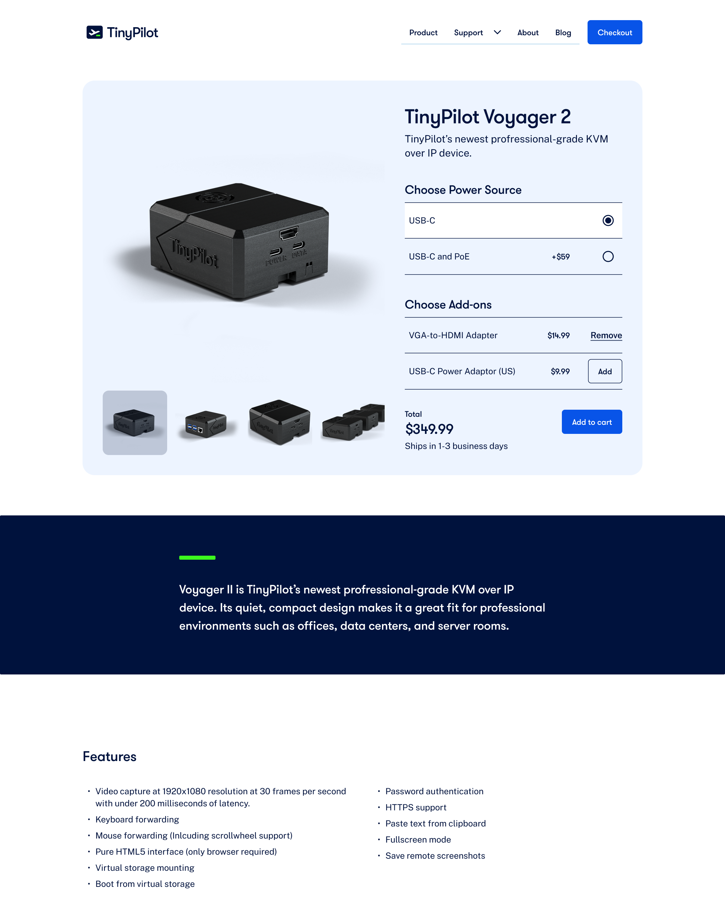

In 2020, I put up a website for a product I was launching called TinyPilot. I had no idea if the business would go anywhere, so the first version of the website was just a basic site with a free theme. A year later, my business was earning $45k/month in revenue, and my website still looked like a college student's hobby project.

{{}}

Beautiful designs aren't my strong side, so I set aside $15k to hire a designer for a few months. My site was pretty simple, and I only wanted to redesign the three pages the customer sees when they buy my product, so I expected it to take a couple of months.

Here's what the site looked after the redesign:

{{}}

Except it didn't take a few months and $15k. It took eight months, $46k, and massive stress.

Now that the project is over, I'm revisiting what mistakes I made in specifing this project, hiring a designer, and working with them that led this project so out of control.

## I know what you're thinking

If you hear that someone spent $46k to redesign three pages of a website, you probably think they're a rube who's never hired anyone before.

While I've never worked with an agency, I've hired dozens of freelancers, including [developers](/freelancer-guidelines/), [artists](/how-to-hire-a-cartoonist/), [writers](/hiring-content-writers/), and [editors](/editor/). I'm also a software developer, so I understood the work I hired the agency to complete.

I definitely made mistakes on this project, but hopefully they're more interesting than the ones you expect.

## How I found an agency

A $15k budget puts you in an awkward position. Anyone you can find by Googling "web design agency" is too big an agency to give you the time of day for a $15k project. And if you go the low-end route through freelancer marketplaces, there's enough fraud and inflated reviews that you waste a lot of time on low-quality designers.

To find candidates, I asked for recommendations from friends and searched sites like Indie Hackers and Hacker News. Through this process, I found four freelancers and one agency. I'm not going to name the agency because I think they acted in good faith and made some mistakes, so I'll just refer to them as WebAgency.

WebAgency immediately stood out as the best. Their portfolio showed a variety of styles that they executed well, and they had lots of different expertise in-house, so they could do design, development, animations, and 3D images if I needed them.

What's more, WebAgency's CEO suggested I reduce the project scope. Instead of a full-blown redesign, I should just start with a rebranding. WebAgency would create a new logo and work with me to select a new color scheme and fonts for the site. From there, I could measure results to see if it was worth continuing the redesign. If nothing else, a rebrand would give me solid foundation to create a marketing campaign with digital marketing agencies. That sounded smart!

## The initial estimate: four weeks and $7k

WebAgency estimated that the rebrand would require 30-40 billable hours over two to four weeks. Their hourly rate was $175, so we were looking at $5-7k for a new logo and branding.

WebAgency's CEO warned that I was smaller than their other clients. Most of their customers have WebAgency on expensive long-term retainer agreements. This project was so tightly-scoped that we could do it hourly, but there was a possibility that they'd have to pause my work occasionally if a retainer client needed more time.

I didn't mind pausing the project for a week or two if they got busy. I was originally expecting the project to take two to three months, so an extra few weeks felt like nothing.

## The honeymoon period

The first month of the project was fantastic.

WebAgency scheduled calls every two weeks with the CEO, their lead designer, a senior designer, and a project manager. They'd show me samples of the new logos and branding. I told them what I liked and disliked about the options. They took my feedback graciously, and the next round, we'd be a little closer.

Within six weeks, we had narrowed in on a logo concept we all liked.


{{}}
{{}}
{{}}
{{}}


## The first red flag: scope creep

In addition to the logo, the agency was also responsible for choosing new fonts and colors for the website. They showed me mockups of different colors and logos and how they'd look with my site design.

{{}}

At first, their mockups were just a basic version of my site with different colors and fonts. As the project progressed, the designs for the website part became more elaborate. They started making custom images and icons, which we had never discussed.

{{}}

It got to the point where they arranged a call to discuss progress, and there weren't even any changes to the logo or branding. All the changes were just design ideas for the website.

"To be clear, this project is still just the rebranding, right?," I asked them.

"Oh, yes, yes!" the lead designer reassured me. "Some branding choices wouldn't make sense on top of the old design, so these are just quick sketches of how they could look."

## Just finish the logo!

By December, WebAgency was 95% done with the logo. I'd asked for a few final adjustments which I expected to take hours, but there had been no progress for weeks.

I was desperate to get the logo to 100% because once that was done, I could put it on the sales site, my product's web app, and on the physical device's case. But instead of finalizing the last 5% of the logo, they just kept redesigning the website.

The breaking point was when they started showing me new designs for my site's blog. From the beginning, I had said that I only cared about the three pages in the site's purchase flow. All other pages were explicitly out of scope.

{{ product page > checkout. We don’t want to completely break pages outside that flow, but we don’t need to improve their design as part of this effort." hasBorder="true" caption="Excerpt from [project specification](tinypilot-redesign-spec.pdf) listing the blog as explicitly out of scope.">}}

I emailed the CEO, and he called me. He was embarrassed that the designers had gotten off track. He admitted that the designers went beyond just sketching. He said they were just so excited about the project that they got carried away and designed more than they should have, but he was going to remove the hours they'd spent redesigning the blog.

I didn't like that they had gone beyond the scope of the rebrand, but I reasoned that they were doing quality work, and I'd probably work with them in the future anyway, so why not do it.

## The two-month holiday slowdown

Midway through December, I noticed WebAgency had stopped making progress on anything.

They stopped scheduling calls to review work with me. They occasionally shared updates over email, but comments I left on their designs sat ignored for weeks.

At the time, I chalked it up to the holidays. Lots of people are on vacation in December, so I assumed things would pick back up in the new year.

The new year started, and not only did the pace stay slow, the quality of the work degraded.

When the project started, it felt like we were usually on the same wavelength. I'd give them feedback on the designs, and they'd integrate my feedback. Now, when I'd say something like, "there's not enough contrast between the text input and the background," it took three back-and-forths before they understood the note.

## "I just don't know when we'll have the hours"

I emailed the CEO to ask what was going on. We had a call, and he apologized for the way the project was going. He admitted that things were bumpy internally at WebAgency. Their project manager quit in November, and the CEO was scrambling to cover those duties while also interviewing replacements.

He confirmed that I wasn't imagining the drop in quality. They were busy with their larger clients, so they were squeezing my project into the gaps, but the designers probably weren't as focused as when we started.

I said I understood I was a small client to them. I was willing to wait a few weeks until their other work slowed down. We both agreed that there were probably only 10-15 hours of design work left. I just wanted them to be high-quality October hours and not the harried, pop-in-whenever hours I saw in December and January.

"We'll definitely finish your project. I just don't know when we'll have the hours," the CEO told me. I asked if it would be done by March, and he said he wasn't sure.

WebAgency's CEO did, however, have an idea for how we could complete the project quickly.

## The solution is to pay more

The real issue, WebAgency's CEO, said was that I was their only hourly client. I would always be at the mercy of their long-term retainer clients pre-empting my project. So what if I signed a retainer agreement to hire them long-term?

At this point, it seemed clear that WebAgency had played me. They structured the work in such a way that everything was about 80% done, but nothing was usable. If I took the work to a new agency or freelancer, there'd be a huge amount of rework. And now they were holding the last 20% hostage until I signed an expensive retainer agreement with them?

I tried to keep my cool. I just wanted the project complete, and the project wouldn't finish any faster if I just started yelling at WebAgency or throwing a tantrum about how poorly they were treating me.

One of the things I liked from the book _Crucial Conversations_ is to approach conflict by reviewing facts that both parties agree on. I raised the facts which we both agreed were true:

- WebAgency's designers had expanded the scope of the project beyond what I'd asked them to do
- Internal problems at WebAgency reduced the quality of their work
- Nobody had asked me whether I wanted to switch to a retainer agreement back in November, and I would have happily done it then.

Given these things, if felt unfair that the solution was just for me to keep paying them more.

WebAgency's CEO conceded that the situation was unfair to me. He promised to retroactively adjust my December and January bills as if I'd been on a retainer agreement and refund the difference. The offer was not even contingent upon me starting the retainer agreement.

I appreciated the refund, and it gave me confidence that they weren't just trying to manipulate me. I felt and still feel that WebAgency was acting in good faith, but they're a struggling agency, and they have to prioritize clients who contribute more to their bottom line.

## Start over or push through?

I had seen WebAgency do excellent work, but I'd also seen them drop the ball. Would the retainer get me back to the excellent work? It sounded plausible.

I was in the middle of launching a new product, and I barely had time to do my current work. I didn't have time to search, interview, and onboard a new agency or freelancer.

The CEO emphasized that the retainer would allow WebAgency to handle not only the design work but the development work to get it on my site. I had planned to use TinyPilot's in-house developers for that, but it was going poorly. TinyPilot's developers worked primarily in JavaScript and Python, so implementing designs in CSS wasn't their strong suit. WebAgency's CEO estimated that even their developers were significantly more expensive than TinyPilot's, the project would cost less overall since WebAgency's developers have so much experienced working with their designers and implementing their designs.

I signed the retainer. My good, protected hours were scheduled to resume in March.

## Implementation work begins with... minor bugfixes?

We were off to a good start. Within the first week of my retainer month, they wrapped up almost all of the outstanding design work. There were still some small kinks to work out, but two of the there pages were finalized and ready for the developers to begin coding up the designs so I could publish them.

WebAgency suggested that I overbook the schedule so that the devs never have to sit idle waiting for the next task. If I didn't give WebAgency enough to do, the hours wouldn't roll over or get credited back to me, so it was my responsibility to keep dev work available.

I put all the design tasks into a Github project in priority order. At the end, I put in some minor bugfix tasks just so the agency's devs would still have useful things to do after they finished the new designs.

And then nothing happened. For two weeks, there was no activity from the devs. I asked the CEO what was going on, and he explained that they only target hours on a monthly basis. He said they'd work the remaining 48 hours, but he didn't have an exact time.

Finally, on January XXth, the devs seemed to come to life. WebAgency's project manager assigned Github issues to two of their developers, Dan and Daniel. Daniel seemed to be the more junior dev, as the PM assigned him all the small bugfix tasks while Dan was responsible for all the tasks related to implementing the designs.

Dan contacted me to talk about how I wanted him to approach the design work. We had a call where we talked things over, and he seemed to have a plan.

By the end of the month, Dan hadn't submitted any work to make progress on publishing the new designs. Meanwhile, Daniel used 15 of the 60 hours I'd booked to fix the minor bugs from the end of the task queue. Oof.

## The one-week task that took five weeks

In April, there was a new problem.

The TinyPilot website uses the Bootstrap CSS framework. We were still using the same free, third-party theme I got from [Bootswatch](https://bootswatch.com/) when I created the first version of the site. And we had layered in our own customizations on top of the theme.

Dan pointed out that this architecture was convoluted, and suggested we replace the third-party theme and per-page styles with our own site-wide Bootstrap theme. He estimated that it would only be a few days of work.

A few days later, Dan said there was another issue. I wasn't using CSS utility classes. Like a caveman, I was still assigning my own CSS classes to page elements and then defining style rules like `margin: 1rem`. What I should be doing instead, Dan said, was to use Bootstrap's utility classes like `m-3`. That way, the styles would respect the theme. It should only be a few days of work, though.

Weeks went by and they kept working on refactoring the theme. Because WebAgency of how WebAgency reported their hours, I couldn't tell if this work was taking 40 hours or 4 hours. At the end of the month, the final hours breakdown gave me my answer.

The "one-week" task of replacing the Bootstrap theme ultimately took 38 hours over five weeks for a total cost of $6.1k.


{{}}
{{}}


## The final month

By May, we were seven months in, and I'd spent $46k on what was supposed to be a simple rebranding.

Every month, it seemed like we were weeks away from wrapping up the project. And every month, something managed to eat up time and prevent WebAgency from finishing the thing I cared about.

I decided I had to cut things off or this project could drag out for years. I gave WebAgency the required 28 days' notice that I was terminating the retainer contract.

Surprisingly, May was the month where the project progressed at the pace I expected from the start. Dan was able to code up each page within 7-10 days. WebAgency kept suggesting new flourishes to the design, and I always declined and asked them to focus on just wrapping up the basics in the time we had remaining.

By the final week, they had completed two of the three pages. The only thing left wast the product detail page, which was also the most complex.

{{}}

With two days left in May, Dan created a pull request that implemented the design changes to the product page. Yes! Victory was close at hand!

I looked closer at the code and saw that it was a bit of a mess. It mixed refactoring changes with behavioral changes (TODO: link), style changes with functional changes, and it had a functional bug that prevented the user from adding and removing items from their shopping cart. The pull request was still in draft state, so I was hoping Dan viewed this code as a rough draft.

On the last day of the month, I was anxiously watching Dan's final pull request to see what would happen. Would WebAgency disappear and leave me with a broken, incomplete code change? Or would they tell me I have to pay them more to finish it up?

Surprisingly, nothing happened. The month ended without any communication from WebAgency about how they'd disengage from the project.

Then, on June 1st, I received an email from Dan. He told me that WebAgency authorized him to wrap up the last pull request at no charge. I pointed out the bug and asked them to split it into five distinct pull requests. To their credit, they did with no fuss. They wrapped up the outstanding work in two days.

And then it was finally done! I was incredibly relieved not to be dealing with this project anymore that had spiralled so far beyond what I initially wanted.

## Before and after

Here's what the site looked like after the redesign:


{{}}
{{}}



{{}}
{{}}



{{}}
{{}}


## The postmortem

After the project ended, I asked WebAgency's CEO if he'd be open to a postmortem to discuss what could be improved on the project. I said I had some ideas for improvement on both sides, and I was interested in hearing his perspective as well. He was candid with me in admitting that the project hadn't gone as smoothly as he'd hoped, and he was open to talking it through with me.

He felt that the underlying problem was that WebAgency had trouble scaling down their workflows to fit TinyPilot's budget. Their typical client has a retainer in the range of $20-40k per month. TinyPilot was buying only 40-60 hours per month, which they typically only reserve for maintenance rather than new development.

I told him that I wished we'd structed the work to give me incremental results so that I'd have the logo first, then the landing page design, then the product page design, etc. instead of working on everything in parallel. He said that WebAgency typically works on completely new apps or bigger features where it's not valuable to deliver features piecemeal, so they weren't used to working that way, though he understood why I would have preferred it.

I told WebAgency that I expected that one of the benefits of the agency was that they'd be more active in managing the project, but it ultimately felt like I was doing my own project management and they had just loaned me developers. He agreed that this was true and that this was a misstep on his part. He said that WebAgency tries to keep project management to less than 5% of billable hours, but on a 40-hour retainer, that meant basically eliminating the project managers from the project. He admitted that was a mistake, and he should have included me in that conversation to make sure it was what I wanted.

I mentioned how I wished I could have had more insight into their hours as they happened, and I felt silly because he said they would have been happy to share that with me had I asked. They were tracking billable time with [toggl](https://toggl.com), so he wouldn't have minded just giving me access to their dashboard.

## What I'd do differently

If I were approaching this project again, here are the things I'd do differently, in descending order of importance.

### Budget more time for management

The fundamental mistake I made when hiring this agency was underestimating how much time I'd need to manage them. I certainly made other mistakes, but I think those would have been less likely had I kept a closer eye on the project to make sure that things were on track.

The agency was working with me for 40-60 hours per month, which was the same as each of TinyPilot's other freelancer developers. I thought the agency would require similar oversight to one freelancer, but having more people on a project requires more management even if they're collectively only working 40 hours per month.

### Structure for serial, incremental results

At first, it would seem ideal to let the agency parallelize as much of the work as possible. It reduces the total time of the project, and it lets the agency use their resources more efficiently.

For a small, budget-conscious client, parallelizing tasks carries several subtle disadvantages.

First, it's likely worse value for money. If you have eight tasks that will take one month each, it's better to have something usable by the end of month one and keep improving it than to have nothing for eight months and suddenly publish everything all at once.

Second, it puts you in terrible negotiating position. If the agency has eight tasks that are all 80% complete, it's expensive for you to scope down the project or replace the agency. If you limit the agency to only two or three tasks at a time, you're much more protected in the case of switching vendors because at the very worst, you'd just have to re-do those handful of subtasks rather than having a new agency restart everything.

Lastly, it's just more mentally taxing on you as the client to oversee eight different tasks happening in parallel. Each task occupies a bit of real estate in your mind, so it's better to knock them out in small batches as opposed to dragging everything out for the full length of the project.

### Narrow the project scope

I didn't enforce the project scope aggressively enough. During the design phase, I let the agency go too far in redesigning the website when they were supposed to focus on just the logo, color scheme, and fonts. During the implementation phase, I should have been more aggressive in preventing them from working on minor bugfixes until they finished the redesign.

### Agree on timelines

When I asked during the design phase how long they expected it to take, they said it depended on me. If I loved their first pitch, we could wrap up the design in days. If I hated everything they showed me for weeks, the project would be longer. I felt and still feel that was reasonable, so I didn't push for a more exact timeline.

I regret letting that attitude carry over into the development work. At the very least, I should pressed the developers to write down task estimates at the granularity of days to weeks with the understanding that we should revisit scope if a task balloons far beyond its estimate.

### Require a shared view of billable hours

Remember the Bootstrap refactoring that was supposed to take a few days but stretched into five weeks? That doesn't happen with TinyPilot's in-house developers, and a big factor is that they give me low-latency insight into how they spend their time. At the end of each working session, they record their hours with a short note saying what they were working on.

{{}}

WebAgency had a slower and opaque feedback loop. At the end of the month, they'd send me a report detailing how many hours went to each task, but by then, it's too late to course correct.

If I work with a design agency in the future, I'll insist on using a tool that lets us share a view of billable hours as they happen. I don't need some creepy spyware that monitors keystrokes, just something that lets them self-report what they did in each billable working session.

### Avoid hiring an agency as their smallest client

When we started the project, they told me that most of their clients were larger than I was, but they wanted to help me grow. It sounded like a great deal. I thought I'd get service normally reserved for large clients despite my limited budget.

In reality, I didn't get the same service as their large clients. When I was an hourly client, WebAgency was deprioritizing me in favor of their larger clients. When I switched to a retainer, they didn't know how to work with me on the scale of 40-60 hours per month.

## What I did well

### Write a spec

Whenever I'm soliciting bids for a new project, I always write a spec. Vendors are always surprised, but they always respond positively to it. It cuts out a lot of the initial discovery work because a lot of what they'd normally have to tease out of a client is already there.

I also suspect that it makes me more attractive as a client because it shows the vendor that I'm taking the project seriously and valuing their time.

[The spec](tinypilot-redesign-spec.pdf) also came in handy when the designers started redesigning the blog, as I could point back to the spec and show them that I explicitly asked them not to do that.

### Set expectations for code review

I sent them articles about TinyPilot's [development workflows](/freelancer-guidelines/) and [how we do code reviews](/code-review-love/).

### Automate code review tasks

I always [use automated tools to enforce code style conventions](/human-code-reviews-1/#let-computers-do-the-boring-parts), but it was especially important working with an agency.

There are always conventions that you can't automate, and it typically takes new developers a few weeks to learn them. The agency's developers never seemed to learn any coding conventions outside of what the tools enforced. They're constantly bouncing between clients, so it's hard to internalize style rules for any particular client.

I realized too late that I should have automated even more. While I had continuous integration in place for pull requests, I forgot to add pre-commit hooks to the repo for tests that could run quickly and locally. I noticed that their developers were pushing to Github and waiting a few minutes for CI to tell them about style errors rather than running the linter on their local machine. So I added a pre-commit hook and a script to enable it, similar to [what we use in the main TinyPilot repo](https://github.com/tiny-pilot/tinypilot/tree/2d82f7af60a1be3c99bb09cb7c2359a2abd0635e/hooks).

## Why didn't you just...?

I've shared pieces of this story in my [monthly retrospectives](/retrospectives), and I've gotten some questions about why I didn't solve the problem in some easy, obvious way. I think this feedback is well-intentioned, but a lot of it comes from people who have never hired an agency.

Below, I've addressed why the obvious suggestions would not have worked.

### Why didn't you just refuse to pay them until the work was done?

WebAgency required payment up-front, so I had no leverage to force them to complete the project.

If I had pushed for milestone-based payments at the start of the contract, WebAgency likely would have just declined the project. They saw me as a small client who could grow, but nobody wants to work with a tiny client who makes demands like a giant corporation.

### Why didn't you just find a cheap developer to do it for $4/hr?

In my experience, cheap developers are worthwhile in two scenarios:

1. You need throwaway code that has to work exactly once
1. You value your time at zero, so you don't mind giving 20 hours of feedback on a task a competent developer could complete in a couple of hours

I plan to keep the TinyPilot website around for a while, so I want code that I understand and feel comfortable maintaining. That meant I needed a developer who can write clear, maintainable code.

### Why didn't you just fire them and hire someone better?

The main reason I didn't fire them is that it's so difficult to find a good designer in the $10-15k budget range. I could have fired them and started over, but it would have burned 30-60 hours of management time, and there was no guarantee that the replacement would be better.

Also, due to the way the project was structured, for most of the project, I was sitting on a bunch of partially-complete tasks. The cost of reassigning it and bringing a new vendor up to speed would be almost as expensive as starting over from scratch. It always seemed like if I gave them one more month, they'd be done, and then it was always another month.

### Why didn't you just use a Shopify template?

If I could go back in time to when I first created the website, I would have made it a simple Shopify store with a custom theme.

When I launched the site, I used Vue, as it was the tech stack I knew best for web development. I didn't want to marry myself to Shopify and learn their templating system when all I needed was a simple "buy" button.

Over time, TinyPilot's purchase experience became more complex. I ended up expensively reimplementing functionality that would have been free had I used a Shopify store. But at this point, migrating all the content to a Shopify store would be its own major project, so I stuck with redesigning what I had.

## Conclusion

The new designs are inarguably better. Were they _$46k better_? It's hard to say.

I certainly wouldn't have chosen to begin the project had I known the true cost and stress involved, but the site is seeing significantly more sales since we put the new design in place, so it might end up working out.

I still think that WebAgency did their best on this project, and they have talented designers and developers. I don't think they tried to deceive me or squeeze money out of me. We just didn't match, as I was used to dealing with individual freelancers and they were used to dealing with large clients.
