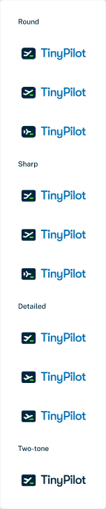

Two years ago, I created a website for my business. By combining my terrible design skills with a decent-looking free template, I created a site that looked okay. I told myself if the business took off, I'd hire a real designer to make it look professional.

{{}}

A year later, the business was generating $45k/month in revenue, but my website still looked like a college student's hobby project. It was time for that professional redesign I'd promised myself.

There were only three pages in the checkout flow for my main product, so I expected the redesign would be straightforward. Maybe a few months and $10-15k.

Here's what the site looked after the redesign:

{{}}

Except it didn't take a few months and $15k. It took eight months, $46k, and a lot of headache.

Now that the project is over, I'm revisiting what mistakes I made that let this project spiral so far beyond my initial plans.

## I know what you're thinking

If you hear that someone spent $46k to redesign three pages of a website, you probably think they're a rube with no software or hiring experience.

But I've done this before! I'm a software developer, and I've hired dozens of freelancers, including [developers](/freelancer-guidelines/), [artists](/how-to-hire-a-cartoonist/), [writers](/hiring-content-writers/), and [editors](/editor/).

I definitely made mistakes on this project, but hopefully they're more interesting than the ones you expect.

## The initial estimate: four weeks and $7k

I'm trying to explore what I did wrong rather than shaming the web design agency I worked with, so I'll just call them WebAgency. They're based in the US, and I found through one of the [Hacker News monthly freelancer threads](https://news.ycombinator.com/submitted?id=whoishiring).

WebAgency quoted the highest rate, but their portfolio best matched the style I wanted. They had a wide range of talent in-house, including design, custom illustrations, and 3D imaging.

Isaac, WebAgency's CEO, won my confidence during our initial call by suggesting I scope the project down to reduce costs. Even though it meant less money for him, Isaac proposed a rebranding rather than a full-blown redesign. That meant that instead of reinventing the site, they'd focus on the fundamentals like a new logo, color scheme and fonts.

After rebranding, I could measure results to see if it was worth continuing the redesign. If nothing else, a rebrand would give me solid foundation to create a marketing campaign with digital marketing agencies.

That sounded smart!

WebAgency estimated that the rebrand would require 30-40 billable hours over two to four weeks. Their hourly rate was $175, so we were looking at $5-7k for a new logo and branding. That was half my budget, so it was an easy call.

Isaac warned that I was smaller than their other clients. Most of their customers had expensive long-term retainer agreements. This project was so tightly-scoped that we could do it hourly, but there was a possibility that they'd have to pause my work occasionally if a retainer client needed more time.

I didn't mind pausing the project for a week or two if they got busy. I was originally expecting the project to take two to three months, so a few extra weeks was nothing.

## The honeymoon period

The first month of the project was fantastic.

WebAgency invited me to meetings every two weeks with the CEO, their lead designer, a senior designer, and a project manager. They'd show me samples of the new logos and branding, and I'd give feedback. The next round, we'd be a little closer.

Within six weeks, we had narrowed in on a concept we all liked.


{{}}
{{}}
{{}}
{{}}


## The first red flag: scope creep

In our first few meetings, WebAgency showed me mockups of my site with different color options.

{{}}

As the project progressed, the mockups became more elaborate. WebAgency started showing me custom images and icons for the site.

{{}}

We'd never discussed custom illustrations, but it seemed like a small amount of work, so I just let it go.

A few weeks later, WebAgency showed me their progress, and they had made zero changes to the logo and branding. They were just showing me design ideas for the website.

"To be clear, the project is still a rebranding and not a redesign, right?," I asked.

"Oh, yes, yes!" the lead designer reassured me. "Some branding choices wouldn't make sense on top of the old design, so these are just quick sketches of how they could look."

## Just finish the logo!

By December, we were three months into the project. WebAgency was 95% done with TinyPilot's new logo. All I wanted was to change the rounding on the corners and get rid of the border. I expected it to be a couple of hours of work maximum.

I was eager to finalize the logo because it would be the first completed asset from the project. Once it was done, I could use it immediately to improve the look of the website, the product's web interface, and the device's physical case.

TODO: Photo of all the places I want to replace the logo

All I needed was a couple more hours of work. But I didn't get them.

Instead, WebAgency just kept redesigning the website. Their lead designer didn't have availability to work on the logo, but what did I think about this new design idea for the landing page?

The breaking point came when WebAgency started showing me new designs for my site's blog. From the beginning, I had said that I only cared about three pages: the landing page, the product page, and the shopping cart page. All other pages were explicitly out of scope.

{{ product page > checkout. We don’t want to completely break pages outside that flow, but we don’t need to improve their design as part of this effort." maxWidth="550px" hasBorder="true" caption="Excerpt from [project specification](tinypilot-redesign-spec.pdf) listing the blog as explicitly out of scope.">}}

I pointed this out to WebAgency, and Isaac called me, embarrassed. He admitted that the designers went beyond just sketching. They were so excited about the project that they got carried away and designed more than they should have, but he was going to remove the hours they'd spent redesigning the blog.

## The two-month holiday slowdown

Midway through December, I noticed WebAgency had stopped making progress on anything.

They stopped scheduling calls to review work with me. They occasionally shared updates over email, but comments I left on their designs sat ignored for weeks.

I chalked it up to the holidays. Lots of people are on vacation in December, so I assumed things would pick back up in the new year.

The new year started, and not only did the pace stay slow, the quality of the work degraded. The easy, clear communication we had at the start of the project was gone. Now, a minor note about background color required three back-and-forths.

## "I just don't know when we'll have the hours"

In early February, I emailed Isaac to ask what was going on. He called and apologized for the way the project was going, admitting that internal issues at WebAgency were affecting my project. Their project manager quit in November, and Isaac was scrambling to fill the role himself while searching frantically for replacements.

He confirmed that I wasn't imagining the drop in quality. WebAgency was overloaded with work from their larger clients. They were squeezing my project into the gaps, so their designers probably weren't as focused as when we started.

I said I understood I was a small client to them, and I was willing to wait a few weeks until their other work slowed down. I just wanted the remaining 10-20 hours of work to be high-quality October hours and not the harried, pop-in-whenever hours I saw in December and January.

"We'll definitely finish your project. I just don't know when we'll have the hours," Isaac told me. I asked if they'd have time within the next two months. He wasn't sure.

Isaac did, however, have an idea for expediting the project.

## The solution is to pay more

The real issue, Isaac said, was that I was their only hourly client. I would always be at the mercy of long-term retainer clients pre-empting my project. So what if I signed a retainer agreement to guarantee WebAgency's time? Their retainers started at 40 hours per month for $160/hr.

I felt duped and manipulated. They structured the work so that everything was 80-90% done, but nothing was usable. If I took the work to a new vendor, there'd be a huge amount of rework. And now they were holding the last 20% hostage until I signed an expensive retainer agreement with them?

As diplomatically as possible, I told Isaac that I felt like the situation was WebAgency's fault. If a retainer agreement was better for everyone, why didn't they propose it months ago? The project could have been done by now.

Isaac conceded that the situation was unfair to me. He promised to retroactively adjust my December and January bills as if I'd been on a retainer agreement and refund the difference. The offer was not even contingent on the new retainer.

But what would we do with 40 hours per month if there were only 20 hours left in the project? Isaac proposed that WebAgency take over the dev work as well. WebAgency billed a much higher rate than TinyPilot's in-house developers, but Isaac predicted they'd reduce costs overall. TinyPilot's devs specialize in Python and JavaScript, but WebAgency's devs do design-heavy work all the time.

I signed the retainer. My 60 high-quality retainer hours were scheduled to resume in March.

## Development begins with... minor bugfixes?

The retainer agreement started off well. Within the first week, WebAgency wrapped up almost all of the outstanding design work. There were still some small kinks to work out, but two of the three pages were ready to hand over to the developers.

And then, radio silence.

For two weeks, there was no activity from the dev team. I asked Isaac what was going on, and he explained that WebAgency's schedule is fluid, so they won't necessarily work on my project every week. He assured me that by the end of the month, they'd certainly use the remaining 48 hours I'd booked.

When the month ended, WebAgency hadn't moved the website any closer to the new design. Instead, they spent the last few days of the month fixing minor bugs from my issue tracker.

{{}}

Where did WebAgency get the idea to take on these insignificant bugs, you ask? Well, WebAgency had asked me to create Github tickets for each of the redesign tasks. WebAgency warned that they don't refund or roll over unused hours, so they encouraged me to overbook the schedule with tasks beyond the redesign work.

The tasks were independent from one another, so I expected that if multiple developers worked on my project, one could focus on the landing page while the other could focus on the checkout page.

But that's not how WebAgency's devs split the work. One developer took on all the tasks for publishing the new designs, and the other took on everything else. And that's how a quarter of the March dev budget went to minor bugfixes.

## The one-week task that took five weeks

In April, there was a new problem.

The TinyPilot website uses the [Bootstrap CSS framework](https://getbootstrap.com/), and it still had the same Bootstrap theme I used when I first launched the website.

WebAgency pointed out that layering a new design onto a totally different theme would be messy. They proposed replacing the theme and all of our custom CSS with a custom TinyPilot Bootstrap theme. Their dev estimated that he'd only need a few days to complete the switch, and it would make the rest of the project go much faster.

Sure, that sounded fine.

And then days stretched into weeks, and I wasn't seeing progress on the new theme. Was the work taking longer than they expected? Or was this just a repeat of last month where most of the dev hours would be squeezed into the last few days of the month? At the end of the month, the invoice gave me my answer.

The "one-week" task of replacing the Bootstrap theme ultimately took five weeks and 38 billable hours for a total cost of $6.1k.


{{}}
{{}}


## The final month

By May, we were seven months and $46k into what was supposed to be a four-week, $7k rebranding. Every month, it seemed like we were weeks away from the finish line, but something always popped up to prevent WebAgency from finishing anything I cared about.

It was time to call it. I gave WebAgency the required 28-days' notice to terminate the contract.

Because I paid for each month up front, WebAgency already had my payment for the final month. I worried this would degrade things even further. They already had all my money, and I'd fired them, so what would incentivize them to care about my project?

Surprisingly, the dev work was never smoother than after I canceled the contract. The project finally seemed to work at the pace I expected. They coded up each page within 7-10 days.

There were still some issues, but I was prepared for them. WebAgency kept suggesting new flourishes to the design, but I declined all of them. I'm glad I did, because otherwise they'd probably still be working on the website today.

On the last day of the month, the final page was incomplete, and WebAgency hadn't communicated with me at all about how they'd disengage from the project. But on June 1st, their dev told me that Isaac had authorized him to finish the outstanding work at no charge. We officially wrapped two days later.

And then it was finally done! This project had spiralled so far beyond what I initially wanted and turned into an interminable drain on my time and finances. I was incredibly relieved to put it behind me.

## Before and after

Here's what the site looked like after the redesign:


{{}}
{{}}



{{}}
{{}}



{{}}
{{}}


## The postmortem

After the project ended, I told Isaac I'd like to write a blog post about what I learned from the project and wanted to know if he'd be interested in a call to discuss what each of us could have done to improve the outcome. He was candid with me that the project hadn't gone as smoothly as he'd hoped, and he was up for the call.

Isaac felt that the underlying problem was that WebAgency had trouble scaling down their workflows to fit TinyPilot's budget. Their typical client has a retainer in the range of $20-40k per month. TinyPilot was buying only 40-60 hours per month, which they typically only reserve for maintenance rather than new development.

I told him that I wished we'd structed the work to give me usable assets sooner. I would have preferred to have the logo first, then a new navbar design, then the landing page design, etc. instead of working on everything in parallel. He said that WebAgency typically works on completely new apps or bigger features where it's not valuable to deliver features piecemeal, so they weren't used to working that way, though he understood why I would have preferred it.

One of the surprises was how little WebAgency managed the project. One of the things I thought I was getting with an agency was a project manager that would regularly report status on tasks and maintain project timelines, but nobody was doing that. Isaac agreed and said it was a misstep on his part. WebAgency tries to keep project management to less than 5% of billable hours, but on a 40-hour retainer, that meant eliminating the project managers entirely. He admitted that he should have included me in that conversation to make sure it was what I wanted.

We talked about the opaqueness of WebAgency's hours. Because they shared their hours so infrequently and worked irregular hours, I could never tell when a task was bloating beyond estimates. And this is something I wished we discussed earlier because it turned out all I had to do was ask. They track billable time with [toggl](https://toggl.com), so he wouldn't have minded giving me access to their dashboard.

## What I'd do differently

If I were approaching this project again, here are the things I'd do differently, in descending order of importance.

### Hire an individual freelancer instead of an agency

I don't want to overgeneralize agencies based on this one experience, but I think an individual freelancer would have been a better fit than an agency for a client my size.

Many of the problems were around management, resource allocation, and communication. I drastically underestimated how much more difficult those problems would be with a team rather than a single freelancer.

The agency was working with me for 40-60 hours per month, which was the same as each of TinyPilot's other freelancer developers. I thought the agency would require similar oversight to one freelancer, but having more people on a project requires more management even if they're collectively only working 40 hours per month.

### Structure for serial, incremental results

It seems like a no-brainer to let the agency parallelize their work as much as possible. It lets them use their resources efficiently, so I'd get results faster and pay less money.

But think about it this way: if a project involves eight tasks that will take roughly one month each, would you rather have one complete task per month or have nothing until the end of eight months?

The one-at-a-time is better value for your money. At the end of month one, you have one asset that provides value to your business for the next seven months. In month two, you have even more, and so on.

Parallelizing everything also puts you in terrible negotiating position. If the agency has eight tasks that are all 80% complete, it's expensive for you to scope down the project or switch vendors. If you limit the agency to only two or three tasks at once, those are the only tasks at risk if the project goes south.

Lastly, it's just more mentally taxing to oversee eight subprojects at once. Every unfinished task occupies a bit of real estate in your mind. It's better to knock them out in small batches as opposed to dragging everything out for the full length of the project.

### Narrow the project scope

At the design stage, I let the agency go too far in redesigning the website when they were supposed to focus on just the logo, color scheme, and fonts.

During the implementation phase, I should have been more aggressive in preventing them from working on minor bugfixes until they finished publishing the new designs.

### Agree on timelines

In my first meeting with WebAgency's team, I asked how long they expected my project to take. They said it was up to me. I might love their first pitch, or I could reject everything for weeks. That was sensible, so I didn't push for a more exact timeline.

I mistakenly let that loose attitude carry into the development work. I should have pressed the developers to share estimates of each task and asked them to revisit scope if the work ballooned far beyond our expectations. That would have prevented situations like [the five-week refactoring quest](#the-one-week-task-that-took-five-weeks) that was only supposed to take a few days.

### Require a shared view of billable hours

Many of the issues with scope bloat were a consequence of the slow feedback loop in WebAgency's hours reporting.

WebAgency's process is to report hours twice per month. On the 15th, they report the total number of hours they've used with no details about which tasks contributed to the total. At the end of the month, they send a per-task breakdown.


{{}}
{{}}


In contrast, TinyPilot's in-house developers report their hours at the end of each working session. If a three-hour task explodes into something bigger, we re-evaluate whether to eliminate or downscope the task.

{{}}

If I work with a design agency in the future, I'll insist on using a tool that lets us share a view of billable hours as they happen, similar to what I use with TinyPilot's regular devs.

### Avoid hiring a vendor as their smallest client

When we started the project, WebAgency told me that most of their clients were larger than I was, but they wanted to help me grow. It sounded like a great deal. I thought I'd get service normally reserved for large clients despite my limited budget.

TODO: Screen cap of _Mad Men_ scene

In reality, I didn't get the same service as their large clients. When I was an hourly client, WebAgency kept deprioritizing me. When I switched to a retainer, they didn't know how to work with me effectively with only 40-60 retainer hours per month.

## Why didn't you just...?

I've shared pieces of this story in my [monthly retrospectives](/retrospectives), and I've gotten some questions about why I didn't solve the problem in some easy, obvious way. I think this feedback is well-intentioned, but a lot of it comes from people who either haven't worked with agencies or freelancers, or they have a lot more money to spend on them.

Below, I've addressed why some of the obvious suggestions I've received would not have worked.

### Why didn't you just refuse to pay them until the work was done?

WebAgency required payment up-front. For the hourly contract, I had to buy time in 30-hour blocks. For the monthly retainer, I had to pay for the full month's bill by the 1st of each month. There was no financial leverage to force them to complete the project.

If I had insisted on milestone-based payments from the beginning, WebAgency likely would have simply declined the project. They saw me as a small client who could grow, but nobody wants to work with a tiny client who's as demanding as a huge corporation.

### Why didn't you just find a cheap developer to do it for $4/hr?

In my experience, cheap developers are worthwhile if:

1. You need throwaway code that has to work exactly once
1. You value your time at zero, so you don't mind giving two hours of feedback for every hour of work you receive from the freelancer

I plan to keep the TinyPilot website around for a while, so I want code that I feel comfortable maintaining. For that, I need a competent developer who can write clear code.

### Why didn't you just fire them and hire someone better?

Firing WebAgency and searching for a replacement would have burned 30-60 hours of management time. And there was no guarantee that I'd find someone better.

For most of the project, I was sitting on a bunch of partially-complete tasks. The cost of reassigning half-done work and spinning up a new vendor would be almost as expensive as starting over from scratch.

### Why didn't you just use a Shopify template?

If I could go back to when I first created the website, I would have made it a simple Shopify store with a custom theme.

When I launched the site, I didn't want to marry myself to Shopify and learn their templating system when all I needed was a simple "buy" button, so I just hand-coded the site using a frontend framework I knew well.

Over time, TinyPilot's purchase experience became more complex. I ended up expensively reimplementing functionality that would have been free had I used a Shopify store. But at this point, migrating all the site's content to a Shopify store would be its own major project, so I stuck with redesigning what I had.

## Conclusion

I think that WebAgency tried their best on this project. I don't feel like they tried to deceive me or squeeze money out of me. We just didn't match. I was used to working with individual freelancers, and they were accustomed to larger clients.

If I had to do it over again, I wouldn't. But despite all the missteps and stress, this project might end up working out overall. The new website is inarguably better than the old one. I expected it to increase sales by 10-20%, but it's been closer to 40%. In July, the TinyPilot [hit an all-time high of $72.5k in sales](/retrospectives/2022/07/#tinypilothttpstinypilotkvmcomrefmtlynchio-stats), 66% more than the month before we published the new design.

It's too early to tell, but I'm optimistic about earning a positive return on the $46k I paid WebAgency.

{{}}

---

_Illustrations by [Loraine Yow](https://www.lolo-ology.com/). Thanks to the members of the [Blogging for Devs Community](https://bloggingfordevs.com) for providing early feedback on this post._
