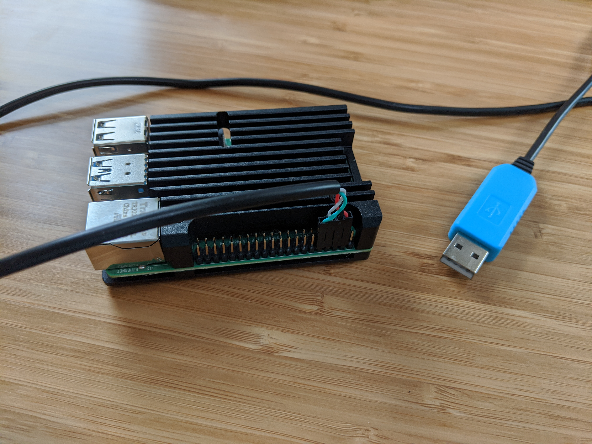
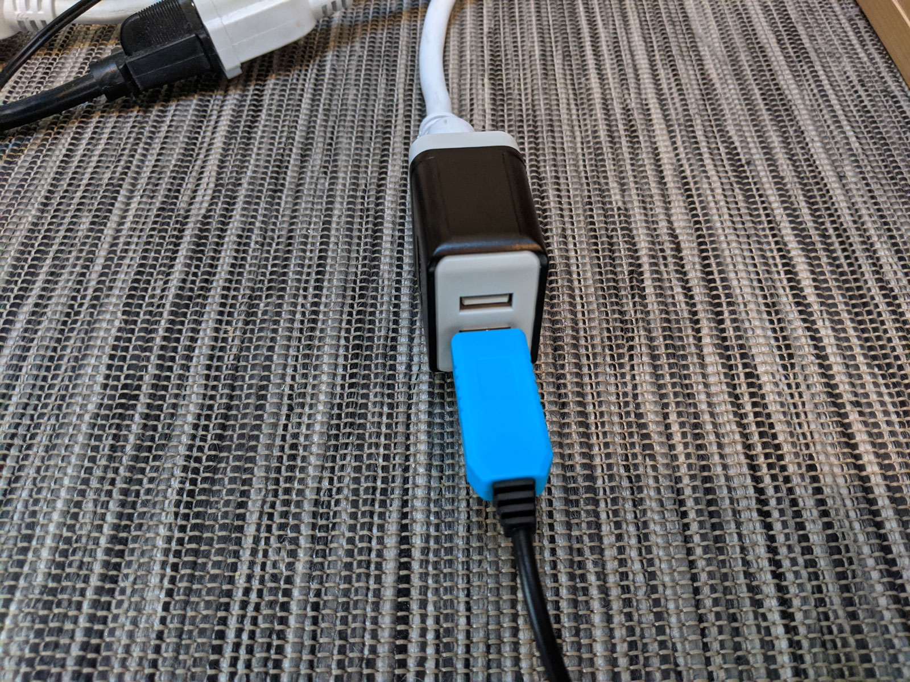

TinyPilot is a low-cost, open source device that provides remote access to a computer even before its operating system boots. I use TinyPilot to perform operating system upgrades and to debug boot failures on my [bare metal homelab servers](/building-a-vm-homelab/).

This posts explains my experience creating TinyPilot and how you can build your own for under $100.

## Don't tell me your life story; just tell me how to build it

If you're a grinch and you want to skip my fascinating tale of trial and error in developing TinyPilot, jump directly to [build your own TinyPilot](#how-to-build-your-own-tinypilot) for the tutorial portion of this post.

## Demo

TODO: Video demo

## Why TinyPilot?

A few years ago, I built my own home server to run the virtual machines I use in developing software. It's been a great investment, and I use it every day.

TODO: Photo of VM server

The server has no keyboard or monitor attached because I access it through its web interface or ssh. This is a convenient and mostly smooth setup, except when small things go wrong, they become a huge pain.

Every few months, I'll screw something up that prevents the server from booting or joining the network, effectively locking me out of the machine. To get things running again, I disconnect everything, drag the server over to my desk, and juggle cables around to connect the server to my workstation's keyboard and monitor.

I told myself that on my next server build, I'd give myself an option for debugging boot issues without all the machine dragging and cable swapping.

## Commercial solutions

I've seen friends use iDRAC, a chip in dell servers that gives console level access at the physical level. When it came time to actually build it, I realized iDRAC is super expensive. It adds $XX to the build and the iDRAC is bound to that particular machine.

TODO: Price of iDRAC

I looked at commercial KVM over IP solutions, but they were no better. They ranged in price from $500-1000. As lazy as I am about dragging servers around, I couldn't justify spending that amount on something I only use a few times per year.

{{}}

## Building a KVM over IP with Raspberry Pi

I've always enjoyed experimenting with the Raspberry Pi, the popular, inexpensive single-board computer. I'd read that recent versions supported USB on-the-go (USB OTG), which allows the Pi to impersonate USB devices such as keyboards, thumb drives, and microphones. I'd seen projects where people use the Pi to capture video, so I figured I could build my own KVM over IP for far less and customize the experience just the way I wanted.

TODO: Key Mime Pi, my first version of TinyPilot that supported keyboard forwarding but no video capture.

In order for the Pi to send keystrokes to the target device, it uses USB OTG functionality to impersonate a USB keyboard. I described this behavior in depth in [my previous post](/key-mime-pi#how-it-works).

## The challenge of capturing video

Keyboard forwarding isn't so useful if I can't see the what's happening on the screen. My obvious next step was to find a way to capture my server's display output in the Pi and render it in the browser.

Video capture was the most difficult part of this. It took a while to find hardware that could capture HDMI input while also being:

1. Affordable
1. Performant
1. Hackable

### First try: Lenkeng HDMI over IP extender

My first attempt at video capture was to use the [Lenkeng LKV373A HDMI extender](https://amzn.to/3cxrYfI). Daniel Kučera (aka [danman](https://blog.danman.eu/)) did an excellent job [reverse engineering](https://blog.danman.eu/new-version-of-lenkeng-hdmi-over-ip-extender-lkv373a/) this device. It was available from Chinese merchants on eBay for around $40, so it seemed like my best option.

{{}}

I received the LKV373A within a few weeks and quickly realized that it was tough to build a solution on top of a device designed for a different purpose. The LKV373A is supposed to be sort of an HDMI extension cord over your network. It pairs with a custom receiver, which translates the stream back to HDMI. danman found ways to intercept the video stream, but bending the device to perform against its intended purpose adds complexity to every stage of the process.

The other big drawback was that the LKV373A outputs its data through UDP multicast. That means that every device on your network receives an HD video stream while the LKV373A is running. danman found a way to switch it to unicast, but it involves flashing the device with mystery firmware from a shared Google Drive folder (legality TBD). I considered avoiding the unicast issue altogether by just connecting the LKV373A directly to the Pi's Ethernet port, but that would occupy the Pi's only Ethernet port.

### Capturing video with the LKV373A

Capturing video from the LKV373A was tricky because its video stream broke most video players. danman discovered that it broadcast empty UDP packets, which tripped up some video players. He [contributed a patch](https://ffmpeg.org/pipermail/ffmpeg-devel/2017-May/211607.html) to ffmpeg to handle it, so I was able to play the video with ffplay, the video player that comes bundled with ffmpeg:

```bash
ffplay -i udp://239.255.42.42:5004
```

{{}}

But it was very slow. There was almost a one-second delay between the target computer and the network stream.

{{}}

I tried playing around with ffplay's many command-line flags to speed up the stream, but I never pushed past 800 milliseconds. And that was a problem because that was the upper-limit since I was capturing the stream and rendering it locally on my desktop. I wanted to capture the stream on the Pi and re-encode over the network in the browser. That was likely to add a lot more latency.

Fortunately, I found a better solution by complete coincidence.

### HDMI to USB dongle

While mindless scrolling through Twitter, I happened to see [a tweet by Arsenio Dev](https://twitter.com/Ascii211/status/1268631069051453448) talking about a low-cost HDMI to USB dongle he had just purchased:

{{}}

It seemed a little too good to be true, so I ordered one from eBay. It was only $11, including shipping. I don't even know what you call it &mdash; it has no brand name, so I'll just call it "the HDMI dongle."

TODO: Screenshot of eBay

When the device arrived a few days later, it blew me away. As soon as I plugged it in to the Raspberry Pi, it showed up as a UVC capture device

```bash
$ sudo v4l2-ctl --list-devices
bcm2835-codec-decode (platform:bcm2835-codec):
        /dev/video10
        /dev/video11
        /dev/video12

UVC Camera (534d:2109): USB Vid (usb-0000:01:00.0-1.4):
        /dev/video0   << HDMI capture dongle
        /dev/video1
```

Within minutes of connecting it to my Pi, I was able to successfully stream the video output using ffmpeg.

```bash
# On the Pi
ffmpeg \
  -re \
  -f v4l2 \
  -i /dev/video0 \
  -vcodec libx264 \
  -f mpegts udp://10.0.0.100:1234/stream

# On my Windows desktop
ffplay.exe -i udp://@10.0.0.100:1234/stream
```

It was so darn convenient, too. The LKV373A was nearly brick-sized and required its own power source and Ethernet cable. The HDMI dongle was as small as a thumbdrive and required nothing more than a USB port.

{{}}

The only problem was latency. Using ffmpeg to stream, there was a delay of four to five seconds on the video.


 I wasn't sure if this delay was coming from dongle itself, from ffmpeg on the Pi, or from ffplay on my desktop. Arsenio Dev reported a latency of 20 ms, so I suspected that if I found a magic formula within ffmpeg's arcane flags, I could reduce the latency.

Fortunately, I was blessed with another stroke of luck that spared me from that task.

### Borrowing from a similar project

When I publised [my previous blog post](/key-mime-pi/) about getting keyboard input working, I received [a comment from Maxim Devaev](/key-mime-pi/#comment-4950940807), who encouraged me to check out his project, [Pi-KVM](https://github.com/pikvm/pikvm).

{{}}

{{}}

I had looked at Pi-KVM briefly earlier in my work, but it [required breadboards and soldering](https://github.com/pikvm/pikvm#v2-diagram), which scared me off.

At Maxim's suggestion, I gave Pi-KVM a second look, particularly interested in how he solved the video latency issue. I noticed that he captured video through a tool called [uStreamer](https://github.com/pikvm/ustreamer). I'd never heard of it, but it seemed simple enough to compile from source, so I did.

### uStreamer: a super-fast video streamer

Have you ever found a tool that's so good, it even solves problems adjacent to the ones your wanted it to address?

Right out of the box, uStreamer reduced my latency from 5 seconds to 600 milliseconds, an incredible speedup.

TODO: Side by side

Beyond the latency improvements, ustreamer eliminated a whole chain of extra work I expected to do.

Prior to uStreamer, my intended strategy was to encode the video using ffmpeg. I wasn't sure how exactly I'd get it from ffmpeg into the user's browser, but I knew it was possible somehow. I tested this [mostly-accurate tutorial](https://docs.peer5.com/guides/setting-up-hls-live-streaming-server-using-nginx/) for streaming video from ffmpeg to nginx using HLS. The ffmpeg + nginx solution had worked, but it added even more latency and left a few hairy problems to solve:

* It makes no sense for the user to play or pause the video stream, so could I eliminate those controls and make the video auto-play?
* How do I get ffmpeg to launch automatically when the user connects and HDMI cable?
* Browsers can't play HLS streams natively, so which third-party JavaScript solution should I use to render the stream?
* How do I debug issues now that the stream is going from target computer -> HDMI dongle -> ffmpeg -> nginx -> third-party video player -> browser?

uStreamer simply solved all of this. It ran its own minimal HTTP server that served video in a format browsers could play natively. I didn't have to bother with HLS streams or getting ffmpeg and nginx to talk to each other.

The tool was so fully-featured that I assumed Maxim simply forked it from a more mature tool, but no. This maniac wrote his own video encoder in C just to squeeze the maximum performance he could out of the Pi's hardware. I quickly [donated to Maxim](https://www.paypal.me/mdevaev), and I invite anyone who uses his software to do the same.

## What the heck is Motion JPEG?

I mentioned that uStreamer output to a regular URL endpoint. When I loaded the URL in the browser, it played the video natively.

I embedded uStreamer's video in TinyPilot's web interface using an `<iframe>`. That worked, so I assumed I solved the problem. Then, I noticed that my browser never stopped loading. Checking the network tab, it seemed to think that the uStreamer stream was just a never-ending download. That was still usable, but I wanted it to display the same way it would display any normal streaming video.

I tried dropping the `<iframe>` and loading the URL in a `<video>` tag. No luck.

From reading uStreamer's documentation, it said that it was streaming video in a format called Motion JPEG (MJPEG), which I'd never heard of before. I Googled how to embed MJPEG in a website. To my surprise, in all the discussions, people were talking about loading MJPEG streams in `` tags. What? A video stream in an `` tag? That would be madness.

But sure enough, I tried putting the URL in an `` tag, and it worked perfectly. The infinite reload issue went away. It had the exact behavior I wanted where the user didn't have to hit "play" to start the stream. It began streaming as soon as the page loaded.

## Improving video latency

uStreamer reduced my latency from 5 seconds down to 600 milliseconds. That was a huge leap forward but still a noticeable delay. I told Maxim I was interested in funding uStreamer further if he could find ways to improve performance, so we got to chatting.

Maxim was interested in the HDMI dongle I was using since he'd never tried that particular hardware. He invited me to create a shared shell session using tmate (TODO: link) so that he could access my device remotely.

{{}}

After a few minutes of testing how uStreamer played with my device, Maxim ran [`v4l2-ctl`](https://www.mankier.com/1/v4l2-ctl) and saw a line that fascinated him but totally went over my head:

```bash
$ sudo v4l2-ctl --all
Driver Info:
        Driver name      : uvcvideo
        Card type        : UVC Camera (534d:2109): USB Vid
...
Format Video Capture:
        Width/Height      : 1280/720
        Pixel Format      : 'MJPG' (Motion-JPEG)
...
Streaming Parameters Video Capture:
        Capabilities     : timeperframe
        Frames per second: 30.000 (30/1)
```

The HDMI dongle was delivering the video stream in `MJPG` format! uStreamer's hardware-assisted encoding was fast, but it was totally unnecessary since the stream was already compressed to Motion JPEG.

We adjusted uStreamer to skip the re-encode and just pass through the video stream.

{{}}

Wow! Latency went from 600 milliseconds all the way down to 200 ms. It's not instantaneous, but it's low enough to forget the latency after using it for a few minutes.

## TinyPilot in action

Remember way back at the beginning of this post when I said I wanted TinyPilot so that I could access my headless VM server before it boots? Well, it works!

TODO: TinyPilot Proxmox gif

I built a new headless VM server this year and used TinyPilot to install Proxmox, an open source hypervisor and web interface for managing VMs. I plugged a bootable USB into my server and used TinyPilot to reboot the system, boot from the USB drive, and install a new OS all from my browser. It was definitely more convenient than my old process of dragging computers around and swapping around cables.

## How to build your own TinyPilot

I have all-in-one kits you can use or you can buy your own parts. The software is all free and open source.

### Parts list


Want to buy all the parts as an all-in-one bundle? You can support TinyPilot's development by purchasing a TinyPilot kit from [my website](https://tinypilotkvm.com).


* [Raspberry Pi 4](https://amzn.to/3fdarLM) (all variants work)
* [USB-C to USB-A](https://www.amazon.com/AmazonBasics-Type-C-USB-Male-Cable/dp/B01GGKYN0A/) cable (Male/Male)
* [HDMI to USB capture dongle](https://amzn.to/2YHEvJN)
  * Strangely, these don't have a brand name, but you can recognize them by their appearance.
  * They're generally available on eBay for $11-15.
* [USB to TTL serial cable](https://amzn.to/3cVkuTT)
* [3A USB wall charger](https://amzn.to/3hal8Ax)
* [microSD card](https://amzn.to/2VH0RcL) (Class 10, 8 GB or larger)
* [HDMI to HDMI cable](https://amzn.to/3gnlZwj)
  * Or \[other\] to HDMI, depending on how your target machine displays output.
* (Optional) A cooling case or heat sink
  * Ensure that the case provides easy access to the Pi's GPIO pins.
  * I use a minimalist aluminum passively cooling case. (TODO: link)

### Install Raspberry Pi OS Lite

To begin, install [Raspberry Pi OS lite](https://www.raspberrypi.org/downloads/raspberry-pi-os/) (formerly known as Raspbian) on a microSD card.

{{}}

Enable SSH access by placing a file called `ssh` on the microSD's boot partition. If you're connecting over wireless, you'll also need to [add a `wpa_supplicant.conf` file](https://www.raspberrypi.org/documentation/configuration/wireless/headless.md).

When you're done preparing the microSD card, insert it into your Pi device.

### Install a case (optional)

The Raspberry Pi 4 famously generates a lot of heat (TODO: link to GeerlingGuy post). You can run it fine as a bare chip, but you'll likely hit stability issues. Fortunately, there's a wide selection of cases that cool either with a fan or by passively spreading the heat from the CPU and GPU across a larger surface area.

I like this minimalist case because it's inexpensive and passively cools the Pi without the complexity of connecting a powered fan:

TODO: Photos

### Power your Pi via GPIO

People typically power their Pi through its USB-C port, but TinyPilot needs this port to connect to the target computer and emulate a USB keyboard. Interestingly, the Pi can still draw enough power from a computer's USB port to run, but it needs 3 Amps of power for stable operation, and a computer's standard USB port outputs less than 1 Amp of power.

You can solve this with a [3 Amp USB wall charger](https://amzn.to/2YitxsN) and a [USB to TTL serial cable](https://amzn.to/2Yk1CIX). The USB to TTL cable plugs into the Pi's outer row of GPIO pins just before the end of the row:


  {{}}
  {{}}


To power on your Pi, plug the wall charger into an outlet, and connect the USB-A end of your power cable to the AC adaptor:

{{}}

### Connect to the machine via USB

To enable TinyPilot to function as a virtual keyboard, connect your Pi's USB-C port to a USB-A port on the target machine:


  {{}}
  {{}}


### Attach the HDMI capture dongle

To complete the physical assembly, insert the HDMI dongle into one of the Pi's USB ports. Insert an HDMI cable into the dongle, and connect the other end to the display output of your target computer.


  {{}}
  {{}}


TODO: Test Display Port to HDMI cable.


**Note**: If the computer you're connecting to has no HDMI output, you should be able to use a DisplayPort to HDMI cable or a DVI to HDMI cable, though I haven't tested the latter personally. (TODO: link to devices)


### Connect an Ethernet cable (optional)

If you're connecting to your Pi over wired Ethernet, attach an Ethernet cable to your Pi's Ethernet port:

{{}}

### Install the TinyPilot software

SSH into your Pi device (default credentials for Raspberry Pi OS are `pi` / `raspberry`), and run the following commands:

```bash
curl -sS https://raw.githubusercontent.com/mtlynch/tinypilot/master/quick-install \
  | bash -
sudo reboot
```

If you're appropriately suspicious of piping a random web script into your shell, I encourage you to inspect [the source](https://github.com/mtlynch/tinypilot/blob/master/quick-install).

The script bootstraps a self-contained Ansible environment with my [TinyPilot Ansible role](https://github.com/mtlynch/ansible-role-tinypilot), which installs four services that run on every boot:

* [nginx](https://nginx.org/): a popular open source web server
* [ustreamer](https://github.com/pikvm/ustreamer): a lightweight HTTP video streaming server
* [usb-gadget](https://github.com/mtlynch/tinypilot/blob/master/enable-usb-hid): a script enabling Pi's "USB gadget mode" which allows the Pi to impersonate USB devices
* [tinypilot](https://github.com/mtlynch/tinypilot): the web interface I created for TinyPilot

## Using TinyPilot

After you run the install script, TinyPilot will be available at:

* [http://raspberrypi/](http://raspberrypi/)

{{}}

## TinyPilot kits

If you'd like to support further development of this software, consider donating (TODO: link) or [purchasing a TinyPilot kit](https://tinypilotkvm.com). Kits include all the hardware you need to build your own, and it includes a pre-formatted microSD card so you don't need to configure anything.

{{}}

## Source code

All TinyPilot software is open source under the permissive [MIT license](https://opensource.org/licenses/MIT):

* [tinypilot](https://github.com/mtlynch/tinypilot.git): Web server that forwards keystrokes to the Pi's virtual keyboard.
* [ansible-role-tinypilot](https://github.com/mtlynch/ansible-role-tinypilot): The Ansible role for installing TinyPilot and its dependencies as systemd services.

---
*Special thanks to Maxim Devaev for his incredible work on [uStreamer](https://github.com/pikvm/ustreamer) and his contributions to TinyPilot.*