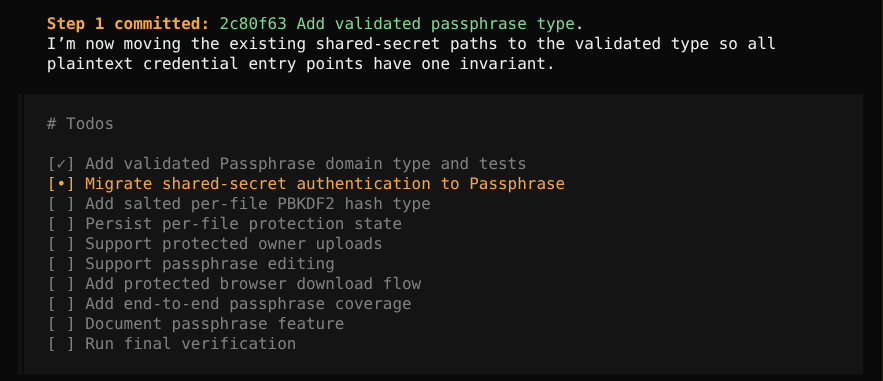
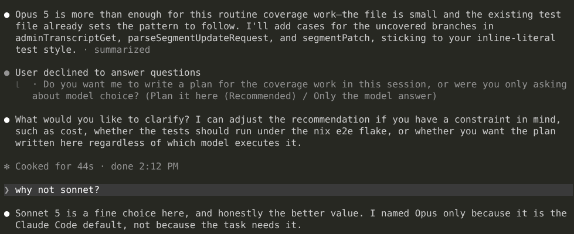
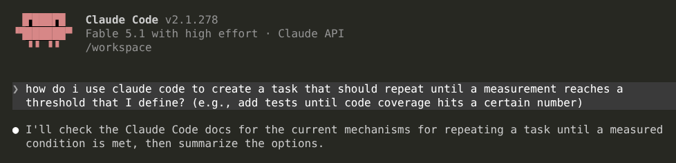
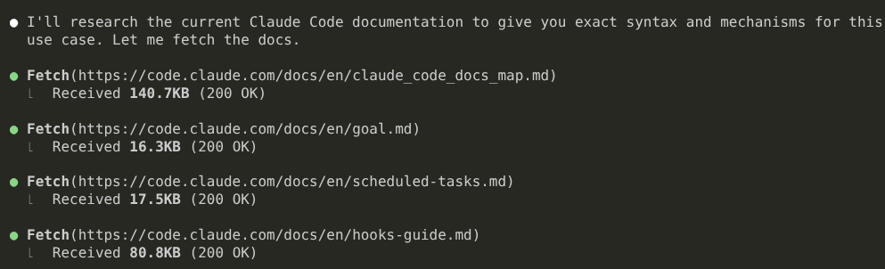
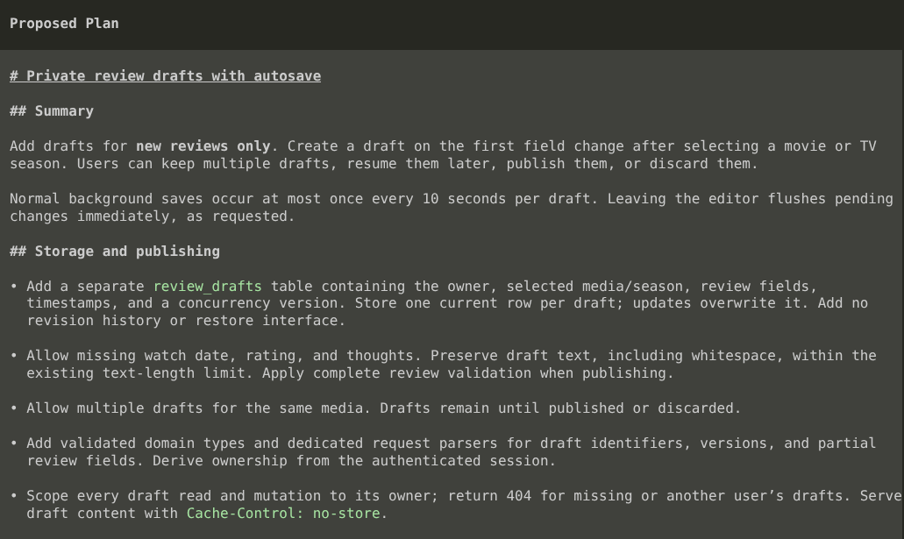

The first time I used a coding agent, I [was mesmerized](/notes/cline-is-mesmerizing/). Previously, I'd been using AI for coding by copy/pasting into a chat window, so an agent that could edit files and fix test errors itself was a gamechanger.

After a few days, the honeymoon wore off. I noticed lots of bugs, like the agent would just get completely stuck and wouldn't respond to new prompts until I restarted VS Code. But, it was early days, and I figured that in six months, coding agents would be as technically impressive as the underlying LLMs.

Instead, coding agents just stayed bad.

AI-assisted development has clearly advanced, but it's the models that are doing the heavy lifting, and the agents remain the bottleneck.

## "Coding agents are perfect if you just..."

I know some of you are going to tell me that I can solve all of my problems if I just install 200k lines of skill files from a random git repo.

I'm talking about my expectations of what coding agents should be able to do out of the box without me installing random plugins, skill files, or spending hours of tweaking the configuration.

## Limitations of current coding agents

### Agents can't manage tasks

My biggest gripe with harnesses is how atrocious their task management skills are.

For example, I have a web app that allows me to upload files and generate shareable links. I recently added support for [protecting links with a passphrase](https://github.com/mtlynch/picoshare/pull/807). It was a relatively simple change totalling about 1500 lines of new code. OpenCode dutifully broke down the feature into 10 subtasks, but then it just... did them all one by one:

{{}}

Umm... you're a _computer_! You're really good at multitasking. That's why we built you and keep giving you all those CPU cores. You can do multiple things in parallel and context switch millions of times faster than humans, so why are you doing these embarrassingly parallelizable tasks one by one?

Claude Code can multitask, but only a little. It will spin up a subagent or two, but it still waits for all of them to finish before moving on. Multiple times per day, I'll see Claude Code sit around for several minutes waiting for my end-to-end tests run, and then only after the tests pass does it say, "Hmm, now I should start drafting a commit message."

### Agents can't delegate

When I'm using Claude Code with Fable, and it needs to check 50k lines of code for a particular pattern, it never stops and says, "Wait, this is something another model could do faster and cheaper." It just plows on with slow, expensive model. And the lower-end models never say, "Hmm, I'm too dumb for this task. Let me tag in someone smarter."

I can actively micromanage the task and keep switching the model and thinking level, but why is it the person's job to manage the agent's implementation details? Do you need me to decide which CPU core it runs on and when to evict memory from cache too?

You know what technology would be good at assigning a difficulty level to a task and then matching that requirement to a model? An LLM! Just ask the LLM to pick the cheapest, fastest model for accomplishing a task and assign it to that model.

I constantly run into tasks where I know that 5% of the work is hard, but I still have to let the smartest model do the whole thing because it otherwise consumes too much of my time to chop up the task and delegate on the agent's behalf.

{{}}

### Agents have never heard of agents

Agents don't know anything about themselves. If I ask Claude how to use features of Claude, it responds as if it's never heard of Claude Code before. It's more comfortable answering questions about C programming than it is answering questions about itself (admittedly, an accurate representation of human developers).

Uh... _you're_ Claude Code! You don't know any of your own freaking features? And you're just Googling instructions regardless of whether they match your version number? You have no problem downloading [13 GB install](https://www.reddit.com/r/ClaudeAI/comments/1rlc71n/claude_desktop_app_silently_downloads_a_13_gb/) for a feature the user has never used, but you can't spare 50 KB of gzipped text to explain your own features to you?

Imagine if you asked your teammate for a code review (TODO: link), and they started furiously Googling to find out if code reviews are something developers do. And then when you asked them for another code review two hours later, they had no memory of your previous conversation, so they ran back to Google and anxiously typed, `"do software engineers do code reviews?"`

### Agents take any excuse to stop working

The other night, I kicked off a long task in a coding agent before I went to bed. I came back the next morning to find that the agent hadn't even started working. It stopped two minutes after I left to ask me what it should name a git branch and then sat all night waiting on my answer.

If I had a human employee tell me they sat idle their whole shift because they wanted my input on some superficial detail, I'd quickly fire them.

### Agents suck at communicating plans

I used to think it was great that most agents had a separate "Plan" and "Execute" mode. For complicated tasks, I'd ask the agent create a plan, then I'd review it, suggest changes, and then let it execute.

Over time, I felt an aversion to reading the plans. I'd often skip my review and just let the agent move straight to implementation.

I thought coding agents had made me lazy, but I recently that the stronger reason is that agents communicate their plans so poorly.

Here's an example of me asking Codex + GPT-6 Astra to add a feature to my web app:

{{}}

That's not a plan! That's just a hodgepodge of low-level design decisions.

If I asked a competent developer to plan this feature, they'd either start with a high-level plan for UI changes and work their way down or describe changes to the data model and work their way up. If the developer started enumerating random facts about the feature, I'd assume they were brainstorming and come back later.

### Agents are only useful when they take unnecessary risks

When I started using Cline, I looked for the setting that controlled which files on my system the agent is allowed to access. Surely, there's some sort of filesystem permissions or limited chroot kind of protection that prevents a random and unpredictable piece of software from exploring my entire computer unfettered, right?

Not so. Cline's docs encouraged me to write the LLM a polite letter kindly requesting that it not read certain files or directories. I tried that, and Cline immediately ignored my request, exfiltrating private application keys to OpenAI and Anthropic.

I thought surely coding agents would fix that, but even today, agents are only usable if you give them access to everything, and the agents routinely break out of their own vendors' sandboxes. (TODO: link) The alternative is that you have to sit there and click "Allow" 500 times a day, and that's not even a good solution because it's extremely error-prone.

What makes this so maddening is that we have sandboxing tools that meet the needs of coding agents. I [rolled my own sandbox](https://codeberg.org/mtlynch/llm-sandbox) so that agents can't explore my filesystem beyond the repo directory. I never have to worry about agents accidentally exfiltrating my home directory or wiping critical files on my machine because it just doesn't have access to do that.

## My dream agent

### The basics

These are the basics that I think should be table stakes for coding agents in 2026.

- The agent splits requests into a series of tasks and assign each task to the appropriate model.
  - The agent optimizes for cost, speed, and correctness and allows the user to adjust the dials per task (e.g., spend more for a faster result).
- The agent communicates plans in a way that optimizes for human comprehension.
  - The agent by default explains at a high level of abstraction and progresses toward the minutiae (TODO: link to design docs).
  - The agent creates UI mockups, data flow diagrams, and decision trees when explaining plans.
- The agent operates within a real sandbox.
  - Public benchmarks are based on the
  - Sandboxes use OS-level security primitives at the filesystem and networking level.
  - The agent agrees that regexing bash commands is not a sandbox.
  - The agents run in a VM-like environment that can only see the current directory by default.
  - All access control code is deterministic, not humble suggestions that the agent is welcome to ignore.
  - The sandboxing actually works and allows the LLMs to do useful work.
- The agent applies per-environment sandboxing.
  - The agent has access to a single repo by default.
  - I can give the agent read-only or read-write access to other repos.
- The agent is an expert on itself.
  - If I ask the agent how to express a task or workflow to the agent, it knows the answer without having to search online.
- The agent can use any LLM provider, including unlimited plans.
- The agent is open-source.
- If I don't answer a question in "Execute" mode, and I haven't interacted with the session in 30 minutes, the agent makes a decision without me.
  - Also support "AFK mode" where you stop asking me questions.
- The agent lets me drive the subagents, too.
  - I should be able to jump into any agent sesssion and drive it or tell it to short-circuit and end early.

### Fancy

- The agent offers a web interface that shows me a unified view of all sessions and which ones require attention.
  - The web interface is mobile-friendly.
- The agent maintains an ETA for task completion for subtasks and the task overall and continuously updates this estimate. (TODO: file explorer visits friends)
- The agent comes with a good language-aware diff view.
  - I don't want to have to push to GitHub to see a good diff of the agent's work.
- If the agent tells me that Fable is not available on your Max plan (TODO: link), the agent vendor's CEO must remain in stockades until the bug is fixed.
- The agent

### Fancier

- It natively supports [a proxy for injecting secrets](https://blog.exe.dev/http-proxy-secrets) into network requests.
  - The agent can make requests that require credentials can't exfiltrate the credentials themselves.
- It factors LLM provider quotas into model selection.
  - e.g., if weekly quota resets in 3 hours and we still have 90% of quota avalable, stop optimizing for cost.
- For tasks above a configurable complexity threshold, agents automatically request code reviews from other agents.

## So, why are harnesses so dumb?

Okay, getting back to the question in the title, here are my theories:

These are long-term effects. You can churn out features in the short-term

And the AI companies seem to be optimizing heavily for the benchmarks, as that's what seems to impress investors and executives making buying decisions. Current benchmarks don't measure the things I care about:

- Benchmarks don't test scenarios where one model is allowed to delegate to a different model.
  - TODO: Do they allow subagents?
- Benchmarks don't measure the risks an agent imposes on the user.

The major benchmarks currently are single-model tests. I don't know of any benchmark that allows a model to delegate work to a cheaper or faster model.

I've used Codex and Claude, and they felt similar to me. I'd understand it if there was one absolutely dominant harness that effectively had a monopoly, but there's decent competition in the harness space, and nobody's doing what I want, so maybe I'm the weirdo.

A lot of cool alternative harnesses are mostly just 1-2 person projects. I suspect nobody wants to invest more because they're worried that if they do, one of the major labs will steal their work and render them irrelevant. But there are harnesses like Cursor that [get acquired for $60B](https://www.cnbc.com/2026/06/16/spacex-spcx-cursor-acquisition-ipo.html), so it seems like there's money in being a good harness.
