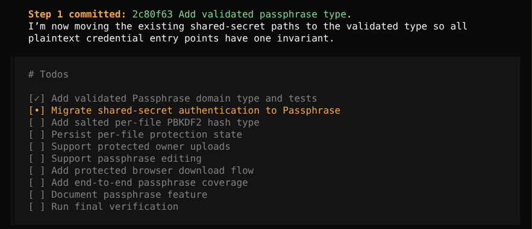
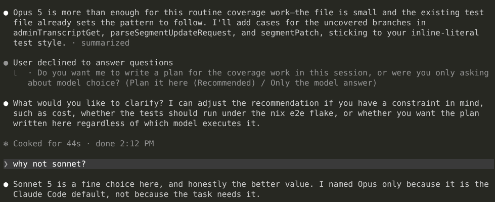
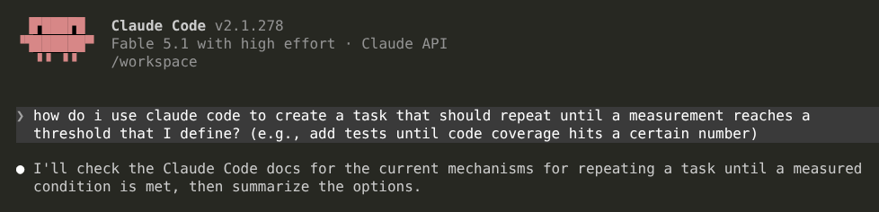
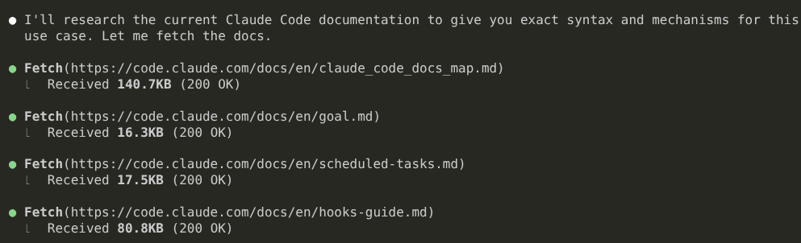
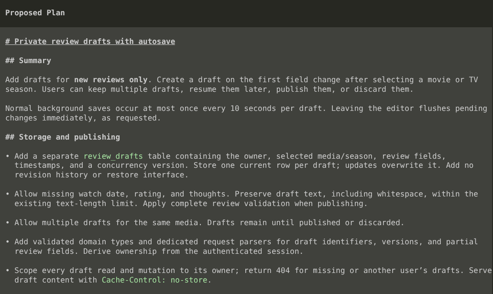

The first time I used a coding agent, I [was mesmerized](/notes/cline-is-mesmerizing/). Before using a dedicated coding agent, I was copy/pasting between my IDE and an AI chat window. It was amazing to see an agent edit files directly and fix its own compile and test errors.

After a few days, the honeymoon wore off. I noticed lots of bugs, like how the agent would sometimes get completely stuck and wouldn't respond to new prompts until I restarted it. Workflows with agents felt limiting, and developers had to layer on silly hacks like [ralph loops](/retrospectives/2026/02/#discovering-the-power-of-ai-sandboxes).

This was in February 2025, so it was still early days for coding agents. I figured that in six months, coding agents would be as technically impressive as the underlying LLMs.

Instead, coding agents just stayed bad.

AI-assisted development has clearly advanced, but the models are doing the heavy lifting while the agents remain the bottleneck.

## The agent is not the model

In all the hype around AI, the terms tend to get distorted.

When I say "model," I'm talking about large language models like GPT Astra or Claude Sonnet. Those are large language models that can generate text and images, and they're especially good at writing code.

When I say "agent," I mean the software that connects models to actual codebases. These are tools like Anthropic's Claude Code or OpenAI's Codex.

As a simple analogy, the model is the brain that thinks but can't directly interact with the world, and the coding agent is the body that lets the model read and write files and run commands on a computer.

## Limitations of current coding agents

### Agents can't manage tasks

My biggest gripe with coding agents is how atrociously they manage tasks.

For example, I have [an open-source web app](https://github.com/mtlynch/picoshare) that generates shareable links for file uploads. I recently added support for [protecting links with a passphrase](https://github.com/mtlynch/picoshare/pull/807). It was a relatively simple change, totalling about 1500 lines of new code. OpenCode dutifully broke the feature into 10 subtasks, but then it just... did them all one by one:

{{}}

Umm... you're a _computer_! You're really good at multitasking. That's why we built you and keep giving you all those CPU cores. You can do multiple things in parallel and context switch millions of times faster than humans. Why are you doing these [embarrassingly parallel](https://en.wikipedia.org/wiki/Embarrassingly_parallel) tasks one at a time?

Claude Code can multitask, but only a little. It will spin up a subagent or two, but it still waits for all of them to finish before moving on. Multiple times per day, I'll see Claude Code sit around for several minutes waiting for my end-to-end tests to finish, and then only after the tests pass does it say, "Hmm, now I should start drafting a commit message. Let me start looking at prior commit message to see what your conventions are."

### Agents can't delegate

When I'm using a cutting edge model, and it needs to check 50k lines of code for a particular pattern, the agent never stops and says, "Wait, this is something another model could do faster and cheaper." It just plows on with the slow, expensive model. Conversely, the agent never says, "This model is too dumb for this task. Let me tag in a smarter one."

Of course, I can actively micromanage the task and keep switching the model and thinking level to match each subtask's difficulty, but why is that the human's job? Do you also need me to manage your thread pool? While I'm at it, how about you put me in charge of [freeing your unused RAM](https://github.com/anthropics/claude-code/issues/4953)?

You know what technology would be good at assigning a difficulty level to a task and then matching that requirement to a model? An LLM! Just ask the LLM to pick the cheapest, fastest model for completing the task. Why do you need me to babysit you?

I constantly run into tasks that are 95%, but I still have to assign it to the smartest model because chopping up the task and delegate on the agent's behalf would take up too much of my time.

{{}}

### Agents have never heard of agents

Agents don't know anything about themselves. If I ask Claude how to use features of Claude, it has to search online to find out what this "Claude" thing is. It's more comfortable answering questions about C programming than about itself (in fairness, same with most human developers).

{{}}
{{}}

Uh... _you're_ Claude Code! You don't know any of your own freaking features? And you're just Googling instructions regardless of whether they match your version number? You'll casually download [13 GB of files](https://www.reddit.com/r/ClaudeAI/comments/1rlc71n/claude_desktop_app_silently_downloads_a_13_gb/) for a feature the user has never used, but you can't spare 50 KB of gzipped text in your install package to explain your own features to you?

Imagine if you asked your teammate for a [code review](/tags/code-review/), and they started furiously Googling to find out if code reviews are something developers do. And then when you asked them for another code review two hours later, they had no memory of your previous conversation and ran back to Google and anxiously typed, `"do software engineers do code reviews?"`

### Agents take any excuse to stop working

The other night, I kicked off a long task in a coding agent before I went to bed. I came back the next morning to find that the agent hadn't even started working. It stopped two minutes after I left to ask me what it should name a git branch and then sat all night waiting on my answer.

If I had a human employee tell me they sat idle their whole shift because they wanted my input on some superficial detail, I'd quickly fire them.

### Agents suck at communicating plans

I used to love the agent UX feature of separate "Plan" and "Execute" modes. For complicated tasks, I'd ask the agent to create a plan, then I'd review it, suggest changes, and then delegate execution to a faster, cheaper agent.

Over time, I felt an aversion to reading the plans. I'd often skip my review and just let the agent move straight to implementation.

I thought coding agents had made me lazy, but I realized that agents just communicate their plans so poorly that they're painful to read.

Here's an example of me asking Codex + GPT-6 Astra to add a feature to [my media journalling web app](https://www.thescreenjournal.com/):

{{}}

That's not a plan! That's just a hodgepodge of low-level design decisions.

If I asked a competent developer to plan this feature, they'd either start with a high-level plan for UI changes and work their way down or describe changes to the data model and work their way up. If the developer started enumerating random facts about the feature, I'd assume they were brainstorming and come back later.

### Agents are only useful when they take unnecessary risks

When I started using my first coding agent, I looked for the setting that controlled which files on my system the agent is allowed to access. Surely, there would be some sort of filesystem permissions or limited chroot kind of protection that prevents a random and unpredictable piece of software from exploring my entire computer unfettered, right?

Not so. The docs encouraged me to write the LLM a polite letter kindly requesting that it not read certain files or directories. I tried that, and the agent immediately ignored my request, exfiltrating private application keys to OpenAI and Anthropic.

I thought that security boundaries be one of the first things coding agents would implement, but even today, agents are only usable if you give them access to everything. Agents routinely [bypass their own vendors' sandboxes](https://www.sentinelone.com/vulnerability-database/cve-2026-21852/). The alternative is to sit there and click "Allow" 500 times a day, and that's not even reliable protection because you're bound to misclick eventually.

What makes this so maddening is that we've had sandboxing tools for more than a decade that do exactly what we need to limit the blast radius of mistakes from coding agents. I [rolled my own sandbox](https://codeberg.org/mtlynch/llm-sandbox) so that agents can't explore my filesystem beyond the repo directory. I never have to worry about agents accidentally exfiltrating my home directory or wiping critical files on my machine because it just doesn't have access to do that.

## "Coding agents are perfect if you just..."

I know some readers will say that I can solve all of my problems if I just install 200k lines of skill files from a random git repo or set some obscure feature flag in my config file.

I'm talking about my expectations of what coding agents should be able to do out of the box without me installing random plugins, skill files, or spending hours of tweaking the configuration.

## My dream agent

### What I wish all coding agents did

These are the basics that I think should be table stakes for coding agents in 2026.

- The agent splits requests into a series of tasks and assign each task to the appropriate model.
  - The agent optimizes for cost, speed, and correctness and allows the user to adjust the dials per task (e.g., spend more for a faster result).
- The agent writes plans that optimize for human comprehension.
  - The agent starts at a high level of abstraction and [progresses toward the minutiae](https://refactoringenglish.com/blog/useful-feedback-on-design-docs/#write-an-introduction-that-makes-sense-to-everyone).
  - The agent creates [UI mockups, data flow diagrams, and decision trees](https://refactoringenglish.com/excerpts/write-an-effective-design-doc/#diagrams).
- The agent operates within a real sandbox.
  - The sandbox uses OS-level security primitives to create boundaries at the filesystem and networking level.
  - All access control code is deterministic, not humble suggestions that the agent is welcome to ignore.
  - If I ask the agent whether a list of regexes on bash commands is a sandbox, it replies, "No."
- The agent applies per-environment sandboxing.
  - The agent has access to a single repo/directory by default.
  - I can give the agent read-only or read-write access to other repos on a per-session basis.
- The agent is an expert on itself.
  - If I ask the agent how to express a task or workflow to the agent, it knows the answer without having to search online.
- The agent can use any LLM provider, including unlimited plans.
- The agent is open-source.
- If I don't answer a question in "Execute" mode, and I haven't interacted with the session in 30 minutes, the agent makes the decision independently.
  - The agent also offers an "AFK mode," which skips the 30-minute wait.
- The agent lets me drive the subagents, too.
  - I should be able to jump into any agent sesssion and drive it or tell it to short-circuit and end early.
- If the agent tells me that [Fable is not available on my Max plan](https://github.com/anthropics/claude-code/issues/79341), the agent vendor's CEO must remain in stockades until the bug is fixed.

### Dreaming a little bigger

As long as I'm dreaming, here are some additional features I'd like to see, but I recognize that some of these are overindexing on my personal workflows.

- The agent offers a web interface that shows me a unified view of all sessions and which ones require attention.
  - The web backend runs locally and doesn't require me to open a tunnel from the Internet that executes arbitrary commands on my system.
  - The web interface works well on my phone.
- The agent maintains an ETA for task completion.
  - Each subagent maintains its own ETA as well.
  - The agent continuously updates this estimate as the task progresses.
  - The agent [tunes its estimation algorithm](https://xkcd.com/612/) based on the accuracy of its past estimates.
- The agent reviews its own sessions and looks for opportunities to improve.
  - e.g., "Wow, I blew through $1k/day in tokens the past five days trying to parse a 5 GB log file with ad-hoc commands. Let's build a custom tool to do this efficiently."
- The agent comes with a good language-aware diff view.
  - I don't want to have to push to GitHub to see a useful diff of the agent's work.
- The agent natively supports [a proxy for injecting secrets](https://blog.exe.dev/http-proxy-secrets) into network requests.
  - The agent can make requests that require credentials but can't exfiltrate the credentials to another host.
- The agent considers provider quota limits when selecting an appropriate model.
  - e.g., if weekly quota resets in 3 hours, and we still have 90% of quota avalable, stop optimizing for cost.
- For tasks above a configurable complexity threshold, the agent automatically requests a code reviews from another model.
  - The two models iterate on reviews until they converge on the fixes.

## So, why are harnesses so dumb?

Okay, getting back to the question in the title, I don't have a satisfying answer.

My best hypothesis is that underinvestment in coding agents is an example of [the principal-agent problem](https://en.wikipedia.org/wiki/Principal%E2%80%93agent_problem). The people setting the direction of AI tooling are executives at companies like Anthropic, OpenAI, and Google. Those executives are disconnected from the rank and file developers who use coding agents every day. Many of these executives are dreaming of a future where they can automate away human developers entirely.

AI executives, as well as their largest customers and shareholders, pay attention to metrics that are legible to them, such as slick demos and benchmark scores. Security and efficient use of human developer time are irrelevant to the demos, and none of the benchmarks I've seen measure the agents themselves; they just measure the underlying models.

My hypothesis isn't satisfying because AI companies clearly care at least a little about coding agents. I see a lot of features being added to Claude and Codex every month, though I can't recall the last time one of them improved my life.

## Is there a better coding agent for me?

I've only tried Claude, Codex, OpenCode, Cline, and Pi. I use OpenCode and Claude Code as my daily drivers. If you've got a coding agent recommendation for me, comment below.

AI companies - if you want to acquire my [imaginary coding agent](#dreaming-a-little-bigger) for $50B, let me know. I'm ready to [fork VS Code](https://cursor.com/blog/joining-spacex) at a moment's notice.
