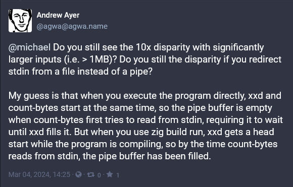
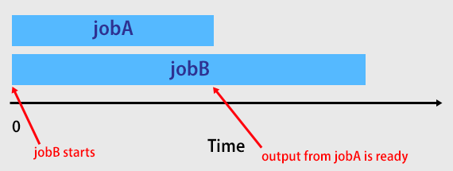

<style>
  .chart-container {
    max-width: 800px;
    max-height: 300px;
    display: flex;
    justify-content: center;
  }
</style>

For the past few months, I've been curious about two technologies: the Zig programming language and Ethereum cryptocurrency. To learn more about both, I've been using Zig to write [a bytecode interpreter for the Ethereum Virtual Machine](https://github.com/mtlynch/eth-zvm).

Zig is a great language for performance optimization, as it gives you fine-grained control over memory and control flow. To motivate myself, I've been benchmarking my Ethereum implementation against the official Go implementation.

<figure>
  <div class="chart-container">
    <canvas id="demo-command"></canvas>
  </div>
  <figcaption><p>At the beginning of this process, my hobby Ethereum Zig implementation underperformed the official Go implementation by about 40%.</p></figcaption>
</figure>

Recently, I made what I thought was a simple refactoring to my benchmarking script, but my app's performance tanked. I identified the relevant change as the difference between these two commands:

```bash
$ echo '60016000526001601ff3' | xxd -r -p | zig build run -Doptimize=ReleaseFast
execution time:  58.808µs
```

```bash
$ echo '60016000526001601ff3' | xxd -r -p | ./zig-out/bin/eth-zvm
execution time:  438.059µs
```

`zig build run` is just a shortcut command for compiling a binary and executing it. It should be equivalent to the following two commands:

```bash
zig build
./zig-out/bin/eth-zvm
```

How could an additional build step cause my program to run almost 10x _faster_?

## Creating a minimal reproduction of the phenomenon

To debug the performance mystery, I tried simplifying my app until it was no longer a bytecode interpreter and was just a program that counted the number of bytes it read from stdin:

```zig
// src/main.zig

const std = @import("std");

pub fn countBytes(reader: anytype) !u32 {
    var count: u32 = 0;
    while (true) {
        _ = reader.readByte() catch |err| switch (err) {
            error.EndOfStream => {
                return count;
            },
            else => {
                return err;
            },
        };
        count += 1;
    }
}

pub fn main() !void {
    var reader = std.io.getStdIn().reader();

    var timer = try std.time.Timer.start();
    const start = timer.lap();
    const count = try countBytes(&reader);
    const end = timer.read();
    const elapsed_micros = @as(f64, @floatFromInt(end - start)) / std.time.ns_per_us;

    const output = std.io.getStdOut().writer();
    try output.print("bytes:           {}\n", .{count});
    try output.print("execution time:  {d:.3}µs\n", .{elapsed_micros});
}
```

With the simplified app, I could still see the performance difference. When I ran the byte counter with `zig build run`, it ran in 13 microseconds:

```bash
$ echo '00010203040506070809' | xxd -r -p | zig build run -Doptimize=ReleaseFast
bytes:           10
execution time:  13.549µs
```

When I ran the compiled binary directly, it took 12x as long to run, completing in 162 microseconds:

```bash
$ echo '00010203040506070809' | xxd -r -p | ./zig-out/bin/count-bytes
bytes:           10
execution time:  162.195µs
```

My test consisted of three commands in a bash pipeline:

1. `echo` prints a sequence of ten hex-encoded bytes (`0x00`, `0x01`, ...).
1. `xxd` converts `echo`'s hex-encoded bytes to binary-encoded bytes.
1. `zig build run` compiles and executes my byte counter program, counting the number of binary-encoded bytes that `xxd` emitted.

The only difference between `zig build run` and `./zig-out/bin/count-bytes` was that the second command runs the already-compiled app, whereas the first one recompiles the app.

Again, I was dumbfounded.

How could does an extra compilation step make the program _faster_? Does a Zig app somehow run quicker when it's fresh out of the oven?

## Asking the Zig community for help

At this point, I was stumped. I had read my source code over and over, and I couldn't understand how compiling and running an application could be faster than running the already-compiled binary.

Zig is still a new language, so there had to be something about Zig I'd misunderstood. Surely, if experienced Zig programmers looked at my code, they'd spot my error instantly.

I [posted my question on Ziggit](https://ziggit.dev/t/zig-build-run-is-10x-faster-than-compiled-binary/3446?u=mtlynch), a discussion forum for Zig. The first few responses said I had a problem with "input buffering" but they didn't have concrete suggestions to fix it or investigate further.

Andrew Kelly, Zig's founder and lead developer made [a surprise appearance in the thread](https://ziggit.dev/t/zig-build-run-is-10x-faster-than-compiled-binary/3446/8?u=mtlynch). He couldn't explain the phenomenon I was seeing, but he pointed out that I was making a different performance mistake:

{{}}

Finally, my friend [Andrew Ayer](https://www.agwa.name) saw my post about this on Mastodon and [solved the mystery](https://m.mtlynch.io/@agwa@agwa.name/112039058255070708):

{{ 1MB)? Do you still the disparity if you redirect stdin from a file instead of a pipe? My guess is that when you execute the program directly, xxd and count-bytes start at the same time, so the pipe buffer is empty when count-bytes first tries to read from stdin, requiring it to wait until xxd fills it. But when you use zig build run, xxd gets a head start while the program is compiling, so by the time count-bytes reads from stdin, the pipe buffer has been filled.">}}

Andrew Ayer got it exactly right, and I'll break it down below.

Sidenote: Andrew Ayer also had the key insight that [solved my last performance mystery](/notes/picoshare-perf/#ram-bloat-is-fine-but-crashes-are-not).

## My mental model of bash pipelines is wrong

I had never thought too carefully about bash pipelines, but Andrew's comment made me realize my mental model was wrong.

Imagine a simple bash pipeline like the following:

```bash
./jobA | ./jobB
```

My mental model was that `jobA` would start and run to completion and then `jobB` would start with `jobA`'s output as its input.

{{}}

It turns out that all commands in a bash pipeline start at the same time.

{{}}

To demonstrate parallel execution in a bash pipeline, I wrote a proof of concept with two simple bash scripts.

`jobA` starts, sleeps for three seconds, prints to stdout, sleeps for two more seconds, then exits:



`jobB` starts, waits for input on stdin, then prints everything it can read from stdin until stdin closes:



If I run `jobA` and `jobB` in a bash pipeline, exactly 5.009 seconds elapse between the `jobB is starting` and `jobB is terminating` messages:

```bash
$ ./jobA | ./jobB
09:11:53.326 jobA is starting
09:11:53.326 jobB is starting
09:11:53.328 jobB is waiting on input
09:11:56.330 jobB read 'result of jobA is...' from input
09:11:58.331 jobA is terminating
09:11:58.331 jobB read '42' from input
09:11:58.333 jobB is done reading input
09:11:58.335 jobB is terminating
```

If I adjust the execution so that `jobA` and `jobB` run in sequence instead of a pipeline, only 0.008 seconds elapse between `jobB`'s `starting` and `terminating` messages:

```bash
$ ./jobA > /tmp/output && ./jobB < /tmp/output
16:52:10.406 jobA is starting
16:52:15.410 jobA is terminating
16:52:15.415 jobB is starting
16:52:15.417 jobB is waiting on input
16:52:15.418 jobB read 'result of jobA is...' from input
16:52:15.420 jobB read '42' from input
16:52:15.421 jobB is done reading input
16:52:15.423 jobB is terminating
```

## Revisiting my byte counter

Once I understood that all commands in a bash pipeline run in parallel, the behavior I was seeing in my byte counter made sense:

```bash
$ echo '00010203040506070809' | xxd -r -p | zig build run -Doptimize=ReleaseFast
bytes:           10
execution time:  13.549µs

$ echo '00010203040506070809' | xxd -r -p | ./zig-out/bin/count-bytes
bytes:           10
execution time:  162.195µs
```

It looks like the time to run the `echo '00010203040506070809' | xxd -r -p` part of the pipeline takes about 150 microseconds. The `zig build run` step must take at least 150 microseconds.

By the time the `count-bytes` application actually begins in the `zig build` version, it doesn't have to wait for the previous jobs to complete. The input is already waiting on stdin.

{{}}

When I skip the `zig build` step and run the compiled binary directly, `count-bytes` starts immediately and the timer begins. The problem is that `count-bytes` has to sit around waiting ~150 microseconds for the `echo` and `xxd` commands to deliver input to stdin.

{{}}

## Fixing my benchmark

Fixing my benchmark was [simple](https://github.com/mtlynch/eth-zvm/pull/27). Instead of running my application as part of a bash pipeline, I split the preparation stage and the execution stage into separate commands:

```bash
# Convert the hex-encoded input to binary encoding.
$ INPUT_FILE_BINARY="$(mktemp)"
$ echo '60016000526001601ff3' | xxd -r -p > "${INPUT_FILE_BINARY}"

# Read the binary-encoded input into the virtual machine.
$ ./zig-out/bin/eth-zvm < "${INPUT_FILE_BINARY}"
execution time:  67.378µs
```

My benchmark dropped from the 438 microseconds I was seeing before down to just 67 microseconds.

<figure>
  <div class="chart-container">
    <canvas id="benchmark-fix"></canvas>
  </div>
  <figcaption><p>Difference in measured performance of my Zig app after I fixed my benchmarking script</p></figcaption>
</figure>

## Applying Andrew Kelly's performance fix

Recall that Andrew Kelly [pointed out](https://ziggit.dev/t/zig-build-run-is-10x-faster-than-compiled-binary/3446/8?u=mtlynch) that I was doing one syscall for every byte I read.

```zig
var reader = std.io.getStdIn().reader();
...
while (true) {
      _ = reader.readByte() { // Slow! One syscall per byte
          ...
      };
      ...
  }
```

So, every time my application called `readByte` in the loop, it had to halt execution, request an input read from the OS and then resume when the OS delivered the single byte.

The fix [was simple](https://github.com/mtlynch/eth-zvm/pull/26). I had to use a buffered reader. Instead of reading a single byte at a time from the OS, I'd use Zig's built-in `std.io.bufferedReader`, which causes my application to read large chunks of data from the OS. That way, I only have to make a fraction of the syscalls.

Here's the entire change:

```diff
diff --git a/src/main.zig b/src/main.zig
index d6e50b2..a46f8fa 100644
--- a/src/main.zig
+++ b/src/main.zig
@@ -7,7 +7,9 @@ pub fn main() !void {
     const allocator = gpa.allocator();
     defer _ = gpa.deinit();

-    var reader = std.io.getStdIn().reader();
+    const in = std.io.getStdIn();
+    var buf = std.io.bufferedReader(in.reader());
+    var reader = buf.reader();

     var evm = vm.VM{};
     evm.init(allocator);
```

I re-ran my example, and it sped up performance by another 11 microseconds, a modest 16% speedup.

```bash
$ zig build -Doptimize=ReleaseFast && ./zig-out/bin/eth-zvm < "${INPUT_FILE_BINARY}"
execution time:  56.602µs
```

<figure>
  <div class="chart-container">
    <canvas id="benchmark-fix-buffered"></canvas>
  </div>
  <figcaption><p>Buffering input reads increased performance by another 16%.</p></figcaption>
</figure>

## Benchmarking a larger input

My Ethereum interpreter currently only supports a small subset of Ethereum's opcodes. The most complex computation my interpreter can do at this point is add numbers together.

For example, here's an Ethereum application that counts to three by pushing `1` to the stack three times and then adding the values together:

```text
PUSH1 1    # Stack now contains [1]
PUSH1 1    # Stack now contains [1, 1]
PUSH1 1    # Stack now contains [1, 1, 1]
ADD        # Stack now contains [2, 1]
ADD        # Stack now contains [3]
```

The largest application I tested in my benchmarks was Ethereum bytecode that counted to 1,000 by adding `1` values together.

After Andrew Kelly's tip helped me [reduce syscalls](https://github.com/mtlynch/eth-zvm/pull/26), my "count to 1,000" application's runtime dropped from 2,024 microseconds to just 58 microseconds, a 35x speedup. I was now beating the official Ethereum implementation by almost a factor of two.

<figure>
  <div class="chart-container">
    <canvas id="count-to-1000-by-1-v2"></canvas>
  </div>
  <figcaption><p>Buffering my input reads allowed my Zig implementation to run about 2x faster than the official Ethereum implementation on the largest Ethereum application in my test set.</p></figcaption>
</figure>

## Cheating my way to maximum performance

I was excited to see my Zig implementation finally outperforming the official Go version, but I wanted to see just how much I could leverage Zig to improve performance.

One common bottleneck in software is memory allocation. The program has to stop and wait for the OS to allocate RAM, which may involve shuffling around data to find enough contiguous space.

Zig has a memory allocator called the fixed buffer allocator. Instead of the memory allocator requesting memory from the OS, you provide the allocator a fixed buffer of bytes, and it uses only those bytes to allocate memory.

I can cheat my benchmarks by compiling a version of my Ethereum interpreter that's limited to 2 KB of memory allocated from the stack:

```diff
diff --git a/src/main.zig b/src/main.zig
index a46f8fa..9e462fe 100644
--- a/src/main.zig
+++ b/src/main.zig
@@ -3,9 +3,9 @@ const stack = @import("stack.zig");
 const vm = @import("vm.zig");

 pub fn main() !void {
-    var gpa = std.heap.GeneralPurposeAllocator(.{}){};
-    const allocator = gpa.allocator();
-    defer _ = gpa.deinit();
+    var buffer: [2000]u8 = undefined;
+    var fba = std.heap.FixedBufferAllocator.init(&buffer);
+    const allocator = fba.allocator();

     const in = std.io.getStdIn();
     var buf = std.io.bufferedReader(in.reader());
```

I call this a "cheat" as I'm optimizing for my specific benchmarks. There are certainly valid Ethereum programs that require more than 2 KB of memory, but I'm just curious how fast I can go with this optimization.

Let's see what performance looks like if I know my max memory requirement at compile time:

```bash
$ ./zig-out/bin/eth-zvm < "${COUNT_TO_1000_INPUT_BYTECODE_FILE}"
execution time:  34.4578µs
```

Cool! With a fixed memory buffer, my Ethereum implementation runs my "count to 1,000" bytecode in 34 microseconds, nearly 3x faster than the official Go implementation.

<figure>
  <div class="chart-container">
    <canvas id="count-to-1000-by-1-v3"></canvas>
  </div>
  <figcaption><p>If I know the maximum memory requirements of my Ethereum interpreter at compile time, I can outperform the official implementation by 3x.</p></figcaption>
</figure>

## Conclusion

My takeaway from this experience is to benchmark performance early and often.

By adding a benchmarking script to my continuous integration and archiving the results, it was easy for me to identify when my measurements changed. Had I relegated benchmarking to a manual, periodic task, it would have been difficult for me to identify exactly what caused the difference in my measurements.

This experience also underscores the importance of understanding your metrics. Before hitting this bug, I hadn't considered that my benchmark included the time waiting for other processes to fill stdin.

## Source code

- [eth-zvm](https://github.com/mtlynch/eth-zvm): My hobby Ethereum Virtual Machine, implemented in Zig

<script src="third-party/chart.umd.js"></script>
<script src="script.js"></script>
