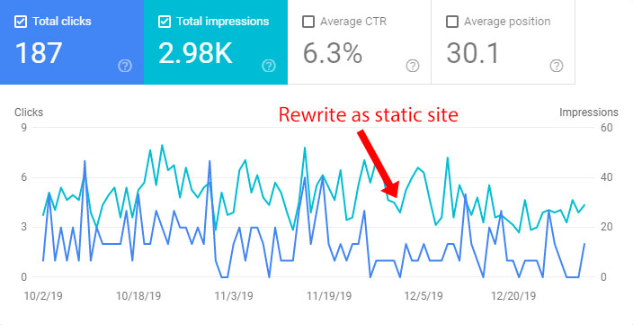
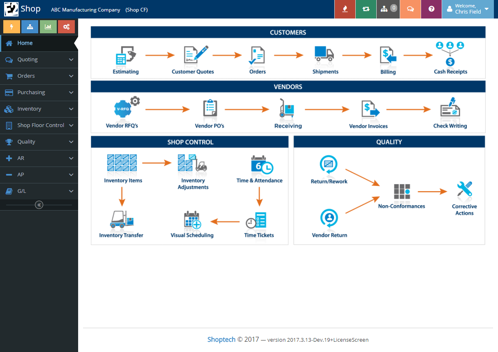
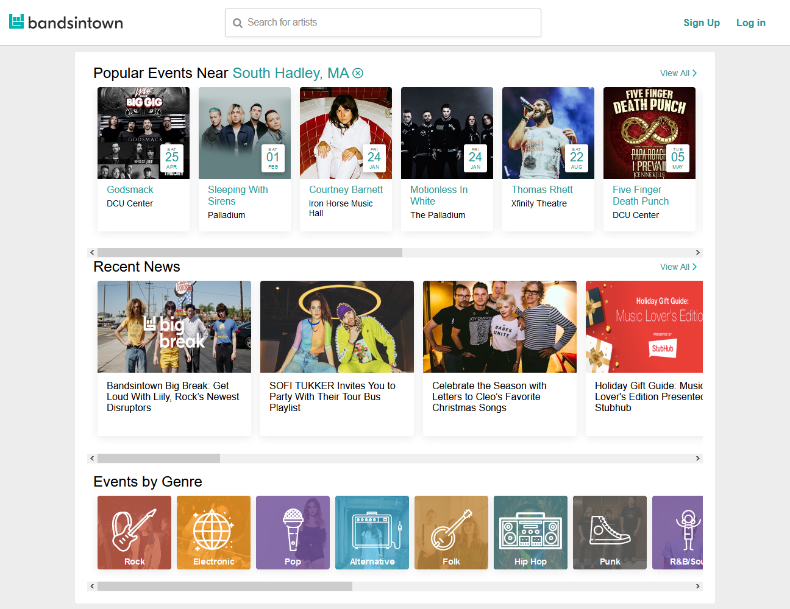
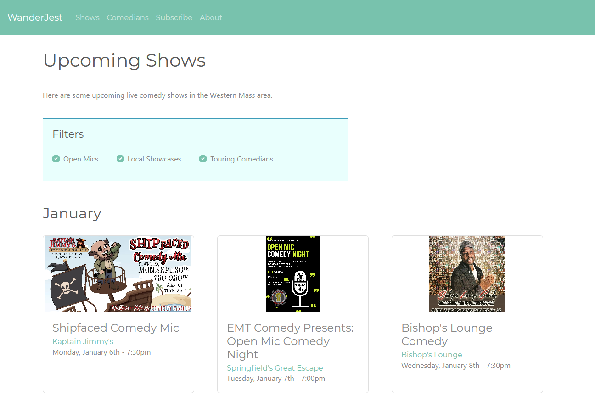

## Highlights

- Zestful had its biggest month ever, with $3,936 in revenue.
- Is It Keto also had its best month ever, at $393 in revenue.
- After lots of research and customer interviews, I gave up on my idea for creating sheet metal software.
- I published my first version of an app for finding live comedy.

## Goal Grades

At the start of each month, I [declare what I'd like to accomplish](/retrospectives/2019/12/#goals-for-next-month). Here's how I did against those goals:

### Conduct five customer interviews

- **Result**: Conducted four customer interviews.
- **Grade**: B+

I researched and visited several sheet metal shops in my area. Of the seven I visited, four agreed to speak with me.

### Publish a new blog post explaining the details of my [Hello World using Vue pre-rendering](https://github.com/mtlynch/hello-world-vue-pre-rendered)

- **Result**: I published "[A Simple Pre-Rendered Web App Using Vue + Nuxt](/simple-vue-pre-rendered/)."
- **Grade**: A

I was pleased with this blog post in that it explained the problem and solution clearly, but it didn't gain much of an audience. I'm holding out hope that this is a "slow-burn" kind of post. It's never going to trend on Hacker News or Reddit, but it's what you'd hope to find if you Google "vue pre-rendering."

### Publish two new Is It Keto articles

- **Result**: Published eight new Is It Keto articles.
- **Grade**: A+

In anticipation of a surge in traffic in January, I offered my writer additional December hours, so we ended up producing many more articles than usual.

## Stats

### [Is It Keto](https://isitketo.org)



| Metric                    | November 2019 | December 2019 | Change                                         |
| ------------------------- | ------------- | ------------- | ---------------------------------------------- |
| Unique Visitors           | 27,981        | 26,891        | -1,090 (-4%)          |
| Total Pageviews           | 69,090        | 68,389        | -701 (-1%)            |
| Domain Rating (Ahrefs)    | 4.3           | 26.0          | +21.7 (+505%)       |
| Domain Authority (Moz)    | 14            | 15            | +1 (+7%)            |
| Ranking Keywords (Moz)    | 1,654         | 2,979         | +1,325 (+80%)       |
| AdSense Earnings          | $151.07       | $235.71       | +$84.64 (+56%)      |
| Amazon Affiliate Earnings | $118.00       | $157.08       | +$39.08 (+33%)      |
| **Total Revenue**         | **$269.07**   | **$392.79**   | **+$123.72 (+46%)** |

This was a record month for Is It Keto, beating out the previous record of [$379.80 in August 2019](/retrospectives/2019/09/#is-it-ketohttpsisitketoorg).

The revenue was a bit of a surprise given that traffic has been waning for the past few months, as nobody wants to think about dieting over the holidays. But the holidays also mean higher advertiser spend and increased customer purchasing on Amazon, so my revenue per mille (RPM) rose substantially to $5.70 per thousand pageviews, also a record high.

### [Zestful](https://zestfuldata.com)



| Metric                   | November 2019 | December 2019 | Change                                            |
| ------------------------ | ------------- | ------------- | ------------------------------------------------- |
| Unique Visitors          | 232           | 207           | -25 (-11%)               |
| Total Pageviews          | 320           | 594           | +274 (+86%)            |
| RapidAPI Earnings        | $65.33        | $52.24        | -$13.09 (-20%)           |
| Enterprise Plan Earnings | $0.00         | $3883.70      | +$3883.70 (+inf%)      |
| **Total Revenue**        | **$65.33**    | **$3935.94**  | **+$3870.61 (+5925%)** |

December was a huge month for Zestful. A fast-moving startup told me that Zestful was exactly what they needed. We hopped on a call that same day, they tested it out using the standard plan, and then purchased an enterprise plan two days later. It was Zestful's biggest sale ever, and it more than doubled my total business revenue for the year. They've been satisfied with the service so far, so I hope they continue working with Zestful on a recurring basis.

Last month, I [got all excited](/retrospectives/2019/12/#rewriting-the-zestful-website-out-of-spite) because I thought that rewriting the Zestful website as a static site would improve its SEO. Sadly, Google Search Console suggests that it had a negligible impact:

{{}}

Still, the enterprise customer approached me only a few days after I rewrote the site, so I can pretend to myself that the rewrite was responsible for ~$3.9k in additional revenue.

## Sheet metal research

At the end of November, I met the owner of a [sheet metal shop](/retrospectives/2019/12/#interviewing-machine-shops) who was interested in talking with me about creating software specifically for sheet metal producers.

{{}}

Software for sheet metal shops ticked a lot of my boxes:

- It's an industry that earns a lot of money, but it's un-sexy and not very tech-connected, so it could be a hidden gem.
- It seems to be more common in my area than in big cities, so I'd have an advantage over more mainstream software companies.
- I had at least one customer who was engaged and interested in teaching me about the space and open to piloting new software.

I spent most of December researching existing solutions and visiting sheet metal shops to request interviews.

## "We don't want an app that matches our use case."

One of my most interesting interviews was with a shop owner who described himself as technically illiterate. He told me that he was currently paying thousands of dollars per year for <a href="https://www.shoptech.com/" rel="nofollow">E2 ShopTech</a>, a general-purpose enterprise planning application for mid-sized machine shops.

{{}}

The owner seemed satisfied with his software but said that he only used 2% of its features. My ears perked right up when I heard that. This is the exact scenario that books like [_Start Small, Stay Small_](/book-reports/start-small-stay-small/) describe. If a business uses bloated software because nobody caters to their specific niche, you can outcompete a larger vendor if you focus on the 2% of features that matter to your customer niche.

The owner had repeatedly said he didn't like dealing with software, so I thought offering a simpler solution would be a slam dunk:

> **Me**: What if I made something that just focused on the 2% that you use, so that there's less complexity?  > **Owner**: Wouldn't be interested.  > **Me**: Really? Why not?  > **Owner**: Because ShopTech already has everything we could ever need built-in. Suppose we get ISO 9001 certified. With ShopTech, we just flip a switch, and we have all the ISO 9001 features we need. If you made something that's only what we use **now**, we'd be stuck.

It made me realize that there's some nuance to the idea that people want software that perfectly matches their use case. The example in _Start Small, Stay Small_ is that if you design accounting software specifically for web designers, your target audience will choose you over general-purpose accounting software like Xero or QuickBooks, even if you're more expensive. But that works because web designers' accounting needs stay relatively static. Even if they drastically change the jobs they take on, they likely don't need to change much about their accounting software.

When software is more core to a business, they're more likely to want room to grow. I do the same thing in my own work. There are niche platforms like [Heroku](https://heroku.com/) and [Netlify](https://www.netlify.com/) that cater to developers with simple use cases, but I build almost everything on Google Cloud Platform. It's often frustratingly complex, but I'm unlikely to find features gaps because it has so many services built-in, even if I currently only use 1% of them.

## "Managed service? No thanks..."

Another recurring theme in interviews was that nobody wanted a managed service. This surprised me because so much of the trend in software in the last 20 years has been toward SaaS, managed services, and monthly payments. Sheet metal shops wanted none of it.

While SaaS businesses often highlight the advantages of low up-front cost and minimal IT maintenance, sheet metal shops didn't value these things. Independence mattered far more than convenience or cost. Multiple shops told me that they didn't want their businesses grinding to a halt because their software vendor went out of business or experienced a network outage. I asked if they minded maintaining their own servers, and I was surprised to hear consistent "no"s.

Given that some of these businesses have been operating for 70+ years, I see why they plan to outlast their software vendors. Still, this sentiment surprised me because it seemed to contradict most of the conventional wisdom about SaaS sales.

## Giving up on sheet metal

I had hoped that the software industry had ignored sheet metal shops so completely that they'd be doing everything on paper or in Excel spreadsheets. And while there is indeed a dearth of software specifically for sheet metal shops, there's plenty of software for machine shops, and sheet metal shops are a type of machine shop:

- <a href="https://jobboss.com/" rel="nofollow">JobBoss</a>: Entry-level, general-purpose machine shop software
- <a href="https://www.shoptech.com/" rel="nofollow">E2 ShopTech</a>: Mid-range, general-purpose machine shop software
- <a href="https://www.paperlessparts.com/" rel="nofollow">Paperless Parts</a>: Specifically for job estimation

The existing competitors weren't dealbreakers because:

1. They [seemed pretty bad](/retrospectives/2019/12/#interviewing-machine-shops).
1. I thought I could outcompete them with a leaner solution that caters specifically to sheet metal.

The next problem was that the customers seemed to have disjoint needs. Shop A said they were in desperate need of software for creating customer quotes, while Shop B said they'd love software for managing inventory, but they didn't care that much about creating quotes. Shop C said they were interested in managing labor capacity, but they weren't interested in quotes or inventory. This made it hard to develop a minimum viable product because there didn't seem to be a simple solution that would satisfy more than one customer at a time.

The worst problem was that nobody was particularly engaged, aside from the shop owner who initially gave me the idea. Among owners who spoke to me, the max level of interest of I received was, "mildly curious." They didn't invest anything into moving forward, and they didn't respond when I followed up on our conversations via email.

At the end of December, I decided to stop pursuing the sheet metal idea and go back to the drawing board.

## The push I needed towards comedy

Before I officially closed the door on the sheet metal app, I attended a [startup event](https://valleyventurementors.org/) where I met Brian and Heather Johnson of [Gozynta](https://www.gozynta.com/). They kindly invited me to their home the following week to offer me mentorship based on their years of experience running a software business.

They were skeptical about the sheet metal app. Heather worried that it would be hard for me to remain passionate about sheet metal since it's so outside of my interests. Brian asked me if I was considering any other ideas.

> Well, there's one I've always wanted to build, but I can't figure out a way for it to make money...

They were intrigued.

Comedy has always been one of my passions. Starting in college and for several years after, I performed comedy. I love seeing shows &mdash; stand-up, improv, sketch &mdash; I love it all.

Finding shows was always a challenge for two reasons:

1. I knew there was a ton of great comedy around me, but there was no unified view of all the shows on a given night.
1. My favorite comedians would come to town, but I'd completely miss them because I had no way of discovering they were coming.

I wished for an app like <a href="https://bandsintown.com" rel="nofollow">Bandsintown</a>, but for comedy.

{{}}

Brian and Heather found this idea exciting. What's more, they saw that it energized _me_. "Look at the way you light up when you talk about that idea!" Heather said. "You're so much more excited about that than the sheet metal idea." Still, I was apprehensive. Most comedians earn very little, so how could a new business in this space earn enough to survive?

Brian pointed out that _someone_ has to be making money in comedy. Maybe it's not local comedians, but there are larger comedians, venues, promoters, etc. What convinced me was the number of different possible revenue streams he saw:

- The app could be like SquareSpace but specialized for comedians who want a simple way to manage their web presence.
- I could sell event data to larger providers who want information about entertainment options in a particular city.
- Venues could pay me a referral fee for tickets sold through my site.
- Venues or performers could pay for a featured position in my listings (similar to sponsored results in Google or Yelp).

These options would make it easy for me to pivot to different strategies if one idea didn't work.

## The WanderJest MVP

After only five days of development, I had a minimum viable product (MVP) for my app, WanderJest:

{{}}

It's currently just a directory of shows and comedians performing in the Western Massachusetts area, but it's enough that people understand the idea and are excited about it.

It's the fastest I've ever produced an MVP, and the speed is due to my experience over the last couple of years:

- After [What Got Done](/tags/what-got-done/), I gained comfort in the [Vue web framework](https://vuejs.org/), so it's easy for me to put together a prototype website quickly.
- After [KetoHub](/tags/ketohub/), I learned not to get hung up on automating the data scraping step of building an aggregator. Instead, I added all the shows to WanderJest manually.
  - There's no database; everything is hardcoded right in the source code (gross!).

Of any business I've created, WanderJest has had the most traction out of the gate. So far, I've reached out to seven people (comedians, promoters, and venue owners), and everyone has agreed to speak with me. I already have one verbal agreement to run ads for a local comedy workshop in exchange for a percentage of any sales I generate.

## Next steps for WanderJest

The Michael from 2018 would have spent the next six months implementing feature ideas that I think are cool and deferred worries about earning money until later. By now, I've realized that generating revenue is extremely difficult, so I need to solve that problem before anything else.

So, I'm following the money. Over the next few weeks, I'm reaching out to people who earn money in the local comedy space, which seems to be venue owners and bookers. WanderJest currently caters exclusively to Western Massachusetts, which has the advantage of being my home turf but the disadvantage that not much money is changing hands for comedy around here. The people I've spoken to so far have suggested expanding to nearby Connecticut, which apparently has a more lucrative comedy scene.

I'm also going to be attending as many local shows as I can. Partly because it's helpful for me to make contacts in the comedy scene, but also because it's fun that I get to go see comedy shows and count it as "work."

## Wrap up

### What got done?

- I created a minimum viable product for WanderJest.
- I sold my biggest enterprise plan ever for Zestful.
- I [ported](https://github.com/mtlynch/mtlynch.io/pull/500) this blog from Jekyll to Hugo
  - It was a lot of [tedious work](https://github.com/mtlynch/migrate-mtlynch-to-hugo), but editing posts is [_so_ much easier](https://twitter.com/deliberatecoder/status/1213966412793991168) now.

### Lessons learned

- Businesses don't always want apps that perfectly match their use cases.
  - If it's a business that could easily grow in different directions, a small, simple feature set becomes a constraint.
- Older businesses seem to value independence more highly and take fewer risks on SaaS providers.
- There's value in a business idea that offers many directions to pivot.

### Goals for next month

- Earn my first dollar of revenue from WanderJest.
- Conduct eight interviews for WanderJest with comedians, bookers, promoters, and venue owners.
- Publish a follow up to ["My First Year as a Solo Developer,"](/solo-developer-year-1/) about year two.

---

_Metal cutting photo by [Russ Ward](https://web.archive.org/web/20230127224200/https://unsplash.com/@rssemfam?utm_source=unsplash&utm_medium=referral&utm_content=creditCopyText) on [Unsplash](https://unsplash.com/s/photos/metal?utm_source=unsplash&utm_medium=referral&utm_content=creditCopyText)._
