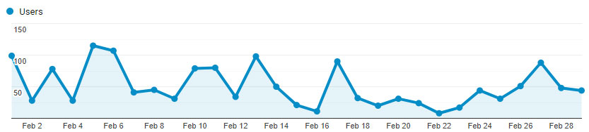
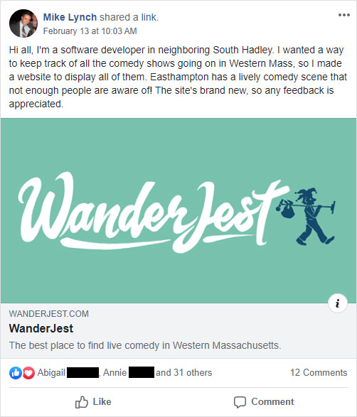
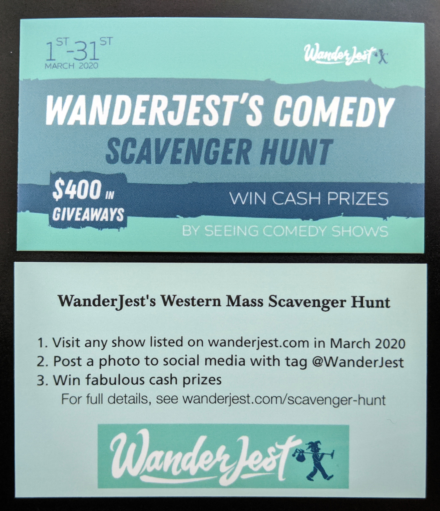
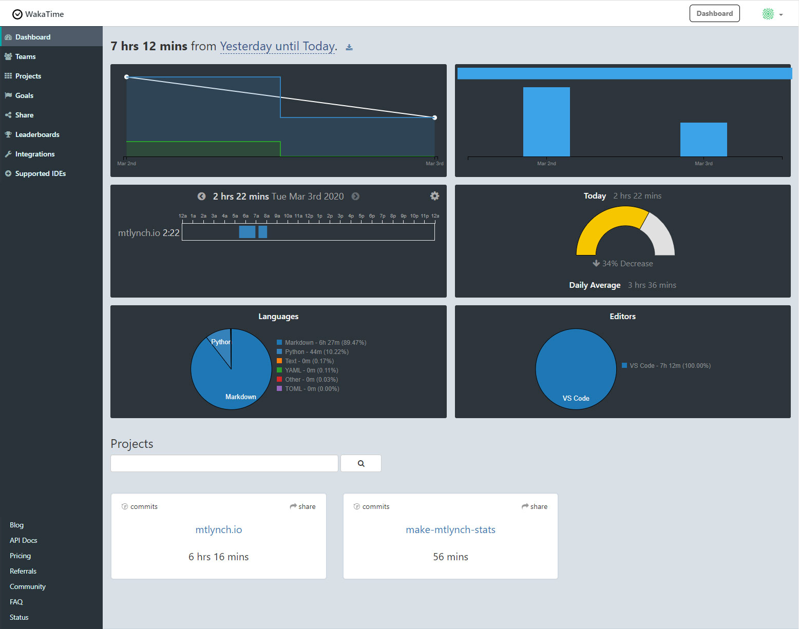

## Highlights

- I'm betting big on a publicity campaign that's at risk of failing spectacularly.
- WanderJest finally earned its first dollar of revenue, but in a way that is definitely unsustainable.
- Poor work habits have left me with the most stress I've felt in a year.

## Goal Grades

At the start of each month, I [declare what I'd like to accomplish](/retrospectives/2020/02/#goals-for-next-month). Here's how I did against those goals:

### Make $1 in revenue

- **Result**: Earned $100 in revenue
- **Grade**: A

I've been pursuing affiliate partnerships for WanderJest, and I had agreements with three different shows to pay me a percentage of any purchases with WanderJest's discount code. Crushingly, zero customers purchased tickets using my code.

I took in $100 in revenue by organizing a comedy scavenger hunt, though this revenue is probably not sustainable (more details [below](#100-in-revenue-but-at-what-cost)).

### Get 20 new user signups

- **Result**: Four new users signed up
- **Grade**: D+

I was expecting more users to create accounts in anticipation of the comedy scavenger hunt, but I only had four signups.

One of the new users is a comedian in New York, and I was excited that he used the new [self-serve workflow](wanderjest-signup.mp4) to create his own [performer profile](https://wanderjest.com/performer/kersi.asare). As a cheat to launch WanderJest quickly, I created profiles on behalf of the performers so that I could defer work on a profile submission UI. I finally added user-managed profiles last week, so it was cool to check the site and see a performer page I didn't create myself.

### Reach 2,000 unique visitors

- **Result**: Attracted 1,344 unique visitors
- **Grade**: C+

Again, I expected the scavenger hunt to drive more visits, but the contest so far hasn't been the draw that I hoped.

## WanderJest stats

{{}}

<!-- hack to add whitespace between graph and table -->

| Metric                  | January 2020 | February 2020 | Change                                          |
| ----------------------- | ------------ | ------------- | ----------------------------------------------- |
| Unique Visitors         | 821          | 1,344         | +523 (+64%)          |
| Total Pageviews         | 2,933        | 4,161         | +1,228 (+42%)        |
| Registered Users        | 0            | 4             | +4 (+inf%)           |
| Affiliate Earnings      | $0.00        | $0.00         | 0                                               |
| Scavenger Hunt Earnings | N/A          | $100.00       | N/A                                             |
| **Total Revenue**       | **$0.00**    | **$100.00**   | **+$100.00 (+inf%)** |

## My brilliant marketing plan

In my [last retrospective](/retrospectives/2020/02/#attracting-audiences), I declared that WanderJest's biggest challenge was bringing its online users to real-life shows:

> Ultimately, the thing that performers, venues, and show organizers care about above all else is **audiences**. Fancy features and promotions mean nothing unless I can demonstrate to show organizers that WanderJest increases their ticket sales.

When I shared WanderJest in local social media groups, people responded positively, but I couldn't tell if that was translating to in-person show attendance. I needed a way to prove to myself and to show organizers that WanderJest brought people to shows.

So, I came up with the Comedy Scavenger Hunt:

{{}}

Fans can win prizes by attending shows and posting photos to social media. Comedians win prizes based on how many photos fans take of them. Show organizers can contribute money to the contest to give their shows special status.

Here's how I expected it to play out:

1. I announce the contest to local news outlets, who are eager to write a story about an ex-Google software engineer who moved to Western Massachusetts and formed a startup that specifically targets local performing arts.
1. Residents see the news story and begin exuberantly sharing the scavenger hunt on social media in anticipation of the March 1st contest kickoff.
1. Comedians see how excited people are to participate in the contest and bang down my door to join in.
1. Die-hard fans compete for the #1 spot in the contest, and in the process, build the habit of checking WanderJest for comedy shows.
1. Because participation happens over social media, the contest markets itself as people share photos from performances and tag WanderJest.
1. After the contest is over, hundreds of locals have created WanderJest accounts to participate, and links from local news articles make WanderJest a top result in Google searches related to comedy in Western Massachusetts.

## My difficult marketing reality

On Thursday, February 20th, I sent out a [press release](https://wanderjest.com/press/scavenger-hunt-press-release-2020-02-20.pdf) to seven local newspapers and TV channels. As soon as the email went out, I began staring at my phone, nervously waiting for the deluge of press interview requests to pour in.

The phone never rang.

Of the seven emails I sent, I received only one reply: a terse, disinterested response from an editor saying that he liked what I was doing but thought it would be hard for me to sustain it.

I sought advice from my friend [Heather Johnson](https://www.gozynta.com) based on her past experience as a local journalist. She suggested that I reach out to reporters individually.

> I would send a specific journalist in each of the publications a direct email and introduce yourself. You need to make a journalist feel like it's their special day. Talk briefly about why you left \[Google\] and what you are doing now and then say you have a press release and you hope they can help you get it to print.
>
> -Heather Johnson of [Gozynta](https://www.gozynta.com/)

I tried that with 10 separate reporters, and my success rate was still small, but significantly better than my first attempt. One local TV reporter responded enthusiastically and recorded a TV interview with me a few days later. The interview never aired, and she hasn't returned my emails. Another reporter offered to include my event in the Arts and Leisure section of the paper's website in the next few weeks, which isn't _super_ useful, but it's better than nothing.

Promoting the contest on social media also turned out to be harder than I expected. Groups that welcomed my initial WanderJest announcement with open arms totally ignored my announcement about the scavenger hunt:


{{}}
{{}}


One of the ways users can earn a chance at the $200 grand prize is by re-sharing WanderJest's contest announcement post, but not a single person has done that, save for a few performers, and they're ineligible for the grand prize.

## $100 in revenue, but at what cost?

My plan for revenue was to have show organizers contribute money to the contest. I expected to lose money overall since I was offering $400 in prize money and expected to collect an optimistic maximum of $250, but I was happy to take that loss as a marketing expense. Unfortunately, with the frosty response I had from fans and press leading up to the contest, I had nothing to convince venues that there was value in contributing, except for my hopes of what _could_ happen.

By February 29th, I was still at $0 in revenue. Thank goodness for [Leap Day](https://www.youtube.com/watch?v=uK0KTH0ezgc), because in the final 24 hours before the deadline, five separate show producers contributed a total of $100 to the contest.

{{}}

I'm trying as hard as I can to ensure that each partner earns a return on their investment, even if it means I lose a lot more money. I had hoped the contest would market itself on social media, but since that's not happening, I ordered business cards and flyers and am hiring someone to distribute them in the area.

| Expense                           | Cost     |
| --------------------------------- | -------- |
| Contest prizes                    | $400     |
| Graphic design                    | $140     |
| Flyer printing (150 color flyers) | $83      |
| Flyer distribution                | $110     |
| Promotional cards                 | $215     |
| Facebook ads                      | $50      |
| **Total**                         | **$998** |

This contest is going to cost about $1k. In other words, each dollar I earned cost me ten. This is not what [Steve Blank](https://steveblank.com/2014/03/04/why-companies-are-not-startups/) would describe as "a repeatable and scalable business model."

I never thought it would be so hard to give people free money! I'm essentially spending an extra $600 to let people know that I want to give away $400.

That said, converting this to a profitable model might not be so hard. If I demonstrate that the contest consistently brings in, say, 5-10 extra people per show, then it should be a no-brainer for organizers to pay $20/show to participate in the future.

It's my first time attempting anything like this, so I'm sort of throwing everything at the wall to see what sticks. I suspect that certain advertising channels will work better than others, people will get especially excited about one or two prize categories, and certain shows will draw more contest participants. After the contest, if it works, I should hopefully be able to spend less because I can focus my investments better.

## Managing stress

Throughout 2019, I maintained [sane habits for social media](/eliminate-distractions/) and work-life balance. Unfortunately, since I started WanderJest, most of them have gone out the window.

It was easier to manage social media when it was an objectively non-essential part of my day, but WanderJest is inextricably linked to social media. Almost everyone announces their shows exclusively on Facebook, and the de facto channel for private messages in the comedy world is Facebook Messenger. I used to observe firm rules about ending work after dinner, but comedy shows happen at night, and when comedians agree to a meeting, the easiest time is before or after shows.

The contest is also stressful, as it's a Big Event with inflexible deadlines, outside vendors I depend on, and partners depending on me to deliver. It's also failing to gain traction, which leads to more worry.

I find it helpful to think about worst-case scenarios, so for this contest, the worst outcome would be a near-zero participation rate. It will be embarrassing to have such a public failure, but the upside will be a clear sign that WanderJest's model needs to change drastically. Show organizers who contributed money might be disappointed, but hopefully they'd recognize how hard I worked in trying to bring them audiences.

Here's my plan for reducing stress going forward:

- When I have WanderJest-related activities at night, think of it as a time-swap rather than a late workday.
  - If I'm going to be at a show for three hours in the evening, stop work three hours before dinner to work on personal tasks.
- Check social media and email more purposefully at scheduled times or for specific time-sensitive reasons.
- Switch to a social media management tool like [Buffer](https://buffer.com) or [HootSuite](https://hootsuite.com/).
  - It'll be better if I can perform some of WanderJest's social media work without having to log in to the suck-you-in social media platforms themselves.

## Legacy projects

Here are some brief updates on projects that I still maintain but are not the primary focus of my development:

### [Is It Keto](https://isitketo.org)



| Metric                    | January 2020 | February 2020 | Change                                       |
| ------------------------- | ------------ | ------------- | -------------------------------------------- |
| Unique Visitors           | 63,465       | 47,698        | -15,767 (-25%)      |
| Total Pageviews           | 160,607      | 123,288       | -37,319 (-23%)      |
| Domain Rating (Ahrefs)    | 26.0         | 26.0          | 0                                            |
| Domain Authority (Moz)    | 14           | 16            | +2 (+14%)         |
| Ranking Keywords (Moz)    | 3,120        | 2,220         | -900 (-29%)         |
| AdSense Earnings          | $423.57      | $286.95       | -$136.62 (-32%)     |
| Amazon Affiliate Earnings | $345.04      | $395.67       | +$50.63 (+15%)    |
| Meal Plan Sales           | $18.10       | $0.00         | -$18.10 (-100%)     |
| **Total Revenue**         | **$786.71**  | **$682.62**   | **-$104.09 (-13%)** |

Numbers are down for Is It Keto, but that's misleading because January was an anomalously profitable month. There's always a big surge of interest in January due to people starting the keto diet for their new year's resolutions, but it fades within weeks.

$682 in revenue is surprisingly strong revenue for Is It Keto. I had expected numbers to drop to their December levels of ~$400, but February's revenue was the site's second-highest in history.

### [Zestful](https://zestfuldata.com)



| Metric            | January 2020 | February 2020 | Change                                      |
| ----------------- | ------------ | ------------- | ------------------------------------------- |
| Unique Visitors   | 1,723        | 877           | -846 (-49%)        |
| Total Pageviews   | 4,078        | 2,578         | -1,500 (-37%)      |
| RapidAPI Earnings | $79.67       | $2.27         | -$77.40 (-97%)     |
| **Total Revenue** | **$79.67**   | **$2.27**     | **-$77.40 (-97%)** |

Zestful had a dead month, but that's also not surprising given that Zestful's revenue is bursty.

I've been in talks with a startup trying to build a competitor to [RapidAPI](https://rapidapi.com), and they've offered to create PyPI and npm packages for Zestful. If that comes together, that could provide a new stream of revenue.

## Interesting discoveries

### WakaTime

After the blog post about [my second anniversary as a solo developer](/solo-developer-year-2/), Alan Hamlett emailed me offering a free premium account for his service, [WakaTime](https://wakatime.com/). It's a plugin that records metrics about the way that you develop software, so it reports how long you spend writing code vs. compiling.

At first, WakaTime didn't sound like something I'd want, but then I realized it could answer a question I've had for a long time: how long do I spend writing this blog? I find writing to be incredibly valuable, but I also need to be mindful of its significant time cost.

Long ago, I experimented with tools like [RescueTime](https://www.rescuetime.com) but promptly stopped when it dawned on me that I was basically installing a spyware tool that sent everything on my screen to an untrusted company. I like WakaTime because the client software is [open source](https://github.com/wakatime), and they treat privacy as a first-class concern. It doesn't record any sensitive information except for filenames in your code editor, and even those you can obfuscate or exclude client-side. I do my coding in dedicated virtual machines for each project, so WakaTime only has access to specific projects where I install the tool.

This is the first post I've written since installing WakaTime, and I can see that it took me 7 hours and 12 minutes to write (including updating [the script I use](https://github.com/mtlynch/make-mtlynch-stats) to spit out my stats tables). That's pretty close to what I expected. I generally dedicate half of the first two days of the month to writing my retrospective post, so that feels like the right amount of time.

{{}}

I'm liking WakaTime more than expected, and I'm even considering it for my non-blog projects.

### DK the Human

[DK](https://www.dkthehuman.com) is an indie developer working on a Chrome extension called [Hide Feed](https://www.hidefeed.com/), which helps you control distractions on social media sites. Every day, he updates his [daily log](https://www.notion.so/ae3a709e9e2145239cec77eef5b37f2a?v=79be77df48454dc393f69902f8aa9e96) to share progress on his business or to think through a problem. If you want a peek into the day-to-day life of a solo developer, his blog is illuminating.

DK kindly made a "Feedback Friday" video for my tool, [What Got Done](https://whatgotdone.com), in which he recorded himself using the website for the first time and narrating his thought process aloud to identify parts of the app that are confusing or need improvement:



The video was tremendously valuable and turned up [13 new bugs](https://github.com/mtlynch/whatgotdone/issues?utf8=%E2%9C%93&q=label%3Adk+), many of which I've since fixed.

### Two good Indie Hackers podcast episodes

In the span of two weeks, the [Indie Hackers podcast](https://www.indiehackers.com/podcast) published two of my favorite episodes in recent memory:

- [Maximizing Fun on the Path to Independence with Cory Zue of Place Card Me](https://www.indiehackers.com/podcast/147-cory-zue-of-place-card-me)
- [Acquiring the Experience to Make It as a Solo Founder with Jen Yip of Lunch Money](https://www.indiehackers.com/podcast/150-jen-yip-of-lunch-money)

These episodes resonated with me because Cory and Jen are both solo developer founders, they both write publicly about their progress ([Cory's blog](http://www.coryzue.com/), [Jen's blog](https://lunchbag.ca)), and they both feel comfortable building their companies with slow, steady growth.

## Wrap up

### What got done?

- Organized and launched my first-ever marketing contest.
  - Wrote my first [press release](https://wanderjest.com/press/scavenger-hunt-press-release-2020-02-20.pdf).
- Added self-serve performer and fan profiles to WanderJest.
- Pitched WanderJest at [Valley Venture Mentors](https://valleyventurementors.org).
  - VVM is an organization that offers mentorship and resources to startups in Western Massachusetts.

### Lessons learned

- When collecting payments from people, use online forms as much as possible.
  - I gave a few people my direct PayPal address, which led to confusion about (or ignoring of) payment deadlines.
  - With online payment forms, there's less room for ambiguity about what the customer is purchasing, and I can adjust pricing after a discount deadline expires without it coming across as personal or confrontational.
- Send press releases to individual reporters, not to the general editor.
  - If you're sending out a press release that the publication might not pick up, send it to an individual reporter with a personalized message about why you chose them.
- It's harder than you'd expect to get people excited about a free cash giveaway contest.

### Goals for next month

- Get 40 new user signups to WanderJest.
- Conduct eight customer interviews.
- Present [my talk at NERD Summit](https://nerdsummit.org/#17).
- Limit work to eight hours a day and check social media only as scheduled.
