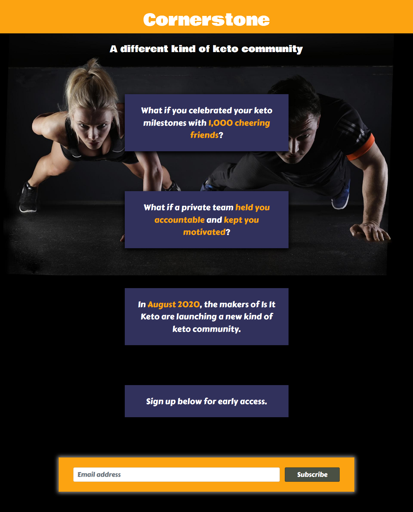
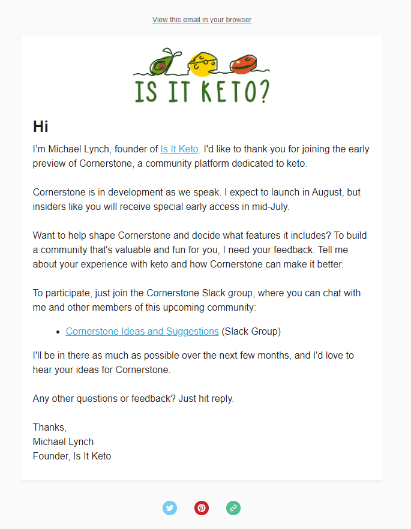
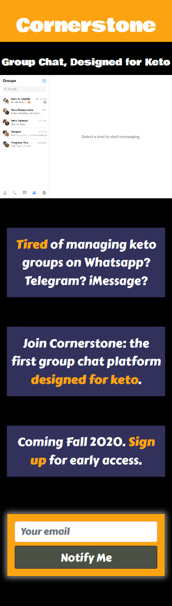
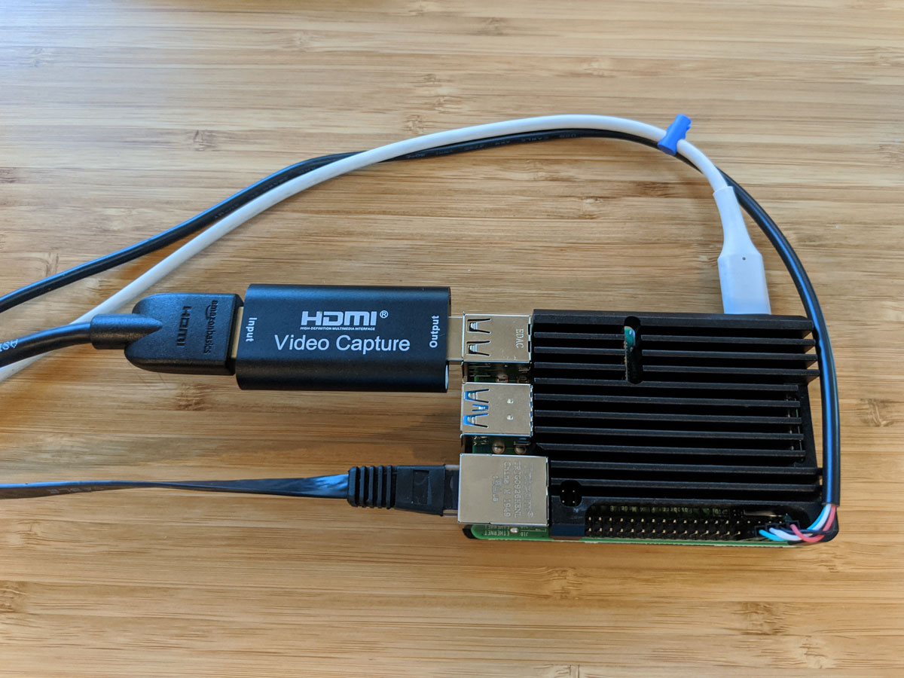

## Highlights

- I sold my first pre-order for [KVM Pi](https://tinypilotkvm.com/?ref=mtlynch.io).
- Finding new ways to monetize [Is It Keto](https://isitketo.org) is proving more difficult than I expected.
- I sold an Enterprise plan for [Zestful](https://zestfuldata.com).

## Goal Grades

At the start of each month, I declare what I'd like to accomplish. Here's how I did against those goals:

### Validate ideas for a sister product to Is It Keto

- **Result**: Tried a few different landing pages, but nothing gained traction
- **Grade**: B-

I forgot how difficult it is to find potential customers and engage them in thoughtful conversations about what kind of products or features would interest them.

I created ads and landing pages to test product ideas, but they led to very few actual conversations.

### Add 30 new articles to Is It Keto

- **Result**: Added 30 new articles to Is It Keto
- **Grade**: A

30 ended up being a good target. It pushed me to keep adding content but wasn't so much that it occupied all my time or forced me to skimp on quality.

I intentionally scaled down my output from [May's goal of 100 new articles](/retrospectives/2020/05/#goals-for-next-month) because I want to see if my auto-generated content strategy works before I go all in. There tends to be a lag of up to three months before Google bubbles my pages to the top of relevant search queries, so I'll have a better idea in August whether the content I added in April is succeeding.

### Create a working Pi-based KVM over IP, controllable through the web browser

- **Result**: Created [KVM Pi](https://tinypilotkvm.com/?ref=mtlynch.io), which works better than I expected
- **Grade**: A

KVM Pi now works and is extremely usable. I thought the first version would be more finicky or brittle, but I've been using it to [manage my server](kvmpi-os-install.mp4) and [run demos](kvmpi-typing-demo.mp4), and it's all pretty smooth.

There are [a few bugs](https://github.com/tiny-pilot/tinypilot/milestone/2) I want to close before I start shipping them next week, but I'm still ahead of schedule. I'm also working on a blog post and YouTube video that I think can generate excitement around the product.

## Stats

### Revenue overview

| Project                                            | May 2020    | June 2020     | Change                                        |
| -------------------------------------------------- | ----------- | ------------- | --------------------------------------------- |
| [Is It Keto](https://isitketo.org)                 | $221.53     | $180.66       | -$40.87 (-18%)       |
| [Zestful](https://zestfuldata.com)                 | $6.48       | $685.26       | +$678.78 (+10475%) |
| [KVM Pi](https://tinypilotkvm.com/?ref=mtlynch.io) | N/A         | $173.94       | N/A                                           |
| **Total**                                          | **$228.01** | **$1,039.86** | +$811.85 (+356%)   |

### [Is It Keto](https://isitketo.org)



| Metric                    | May 2020    | June 2020   | Change                                      |
| ------------------------- | ----------- | ----------- | ------------------------------------------- |
| Unique Visitors           | 50,352      | 57,166      | +6,814 (+14%)    |
| Total Pageviews           | 99,391      | 109,721     | +10,330 (+10%)   |
| Domain Rating (Ahrefs)    | 27.0        | 8.0         | -19.0 (-70%)       |
| AdSense Earnings          | $109.92     | $85.81      | -$24.11 (-22%)     |
| Amazon Affiliate Earnings | $111.61     | $94.85      | -$16.76 (-15%)     |
| **Total Revenue**         | **$221.53** | **$180.66** | **-$40.87 (-18%)** |

My visitors grew by 14%, but it's hard to know if that's due to general trends in keto or from actual improvements in the site. [Rough numbers on Google Trends](https://trends.google.com/trends/explore?date=today%203-m&geo=US&q=keto) suggest that search interest in keto grew by about 5% from May to June, so hopefully I'm growing faster than the baseline.

Sadly, despite gains in readership, my earnings are shriveling up. Amazon slashed their affiliate payout rates [back in April](https://www.cnbc.com/2020/04/14/amazon-slashes-commission-rates-for-affiliate-program.html), and that's been stinging Is It Keto ever since. My alternative affiliate programs haven't paid anything yet (more on that [below](#being-an-affiliate-sucks)). AdSense revenue fell, but that was intentional. I replaced my primary ad slot with [my own ad](isitketo-self-ad.png) as a way to test new product ideas.

Ahrefs must have adjusted their algorithm because they downgraded Is It Keto's domain rating from a 27 all the way down to 8. It doesn't _really_ matter because they're just trying to approximate my ranking in Google's eyes, and I can see that Google hasn't downranked me, but it does make that metric a bit meaningless.

## Validating keto product ideas

One of my goals last month was to do something more substantial with Is It Keto's 50k+ monthly visitors. I have a large stream of readers interested in the keto diet, so it would be great if I could build my own product that caters to them rather than relying on ever-shrinking revenue from ad networks and affiliate partners.

My first idea was something basically like [wip.chat](https://wip.chat). People could post photos and progress updates and encourage each other. I created a landing page that loosely described the idea:

{{}}

Of people who reached the landing page, 4.6% signed up, but only 20-30 users per day clicked the landing page at all. 1,500-2,200 people visit Is It Keto each day, and an average of one person signed up each day, so the page converted less than 0.1% of total visitors.

Upon joining the mailing list, subscribers received an email that looked like this:

{{}}

Nobody replied or joined the Slack. I tried writing direct emails to people, but it's hard to convince people that you, a human, are writing a personalized letter to them when all you know is their email address. Nobody I reached out to replied, and I certainly didn't want to rush into building anything before I could talk to any users.

After reaching out to users on Reddit, one woman told me that their primary keto community is a local [Telegram](https://telegram.org/) chat group. She said that her group of keto friends swap tips about local restaurants and grocery stores and share recipes. That sounded like an interesting idea, so I created a landing page to see if it clicked for other people.

{{}}

That landing page performed even worse, with only a 2% signup rate. I've since removed the links and ads for those landing pages until I have the bandwidth to test a new idea.

## Keto interviews: seemed like a good idea at the time

With my email outreach failing to attract any users to talk to me, I thought of [keto.fm](https://newsletter.keto.fm/), a site I partnered with a few years ago when I was working on [KetoHub](https://ketohub.io). One of their clever growth strategies was ["keto stories."](hhttps://web.archive.org/web/20200805153806/https://newsletter.keto.fm/stories/)

keto.fm would find people who posted progress photos on keto subreddits and invite them to be featured in keto.fm's newsletter. The people who received invitations were flattered enough at the attention to provide a text interview. As a result, keto.fm gained free content, and the interviewees spread the newsletter to their friends.

I thought I could do the same thing for Is It Keto's sister site, but with one tweak: when asking people about their experience with keto, I'd dive deeply into the topics of software tools and online communities. Everyone would win! They'd get the same experience of being featured on a keto site. I'd get content to build up my new site, **and** I'd get valuable customer insight to help inform which features to build.

But it didn't go as planned.

The first problem was that my messages had a terrible response rate. I reached out to 16 redditors and only got interviews with two of them. I tried to make the interview as convenient as possible, so I offered the choice of a scheduled timeslot or "just pop into Slack whenever." But this meant that _I_ had to constantly monitor my Slack channel all the time, which was a big focus-killer.

{{}}

The other issue was that if I spent the entire interview asking about product ideas, they'd sense that the interview was a farse, and I was just exploiting their time for market research. I did still ask them about how online communities influenced their experience with keto and what tools they used, but I only got to talk about it for a few minutes per interview. In an online chat, that's basically four or five sentences of feedback.

Lastly, I have to actually _write_ these interview articles. I estimate that each one will take three or four hours of editing before it reads like a decent interview. I'm going to follow through because they volunteered their time to me, and I promised to write an article about them in return, but I think I offered too much.

> **Jemaine**: Is it a good deal for you?
>
> **Ben**: Quite frankly, this is a terrible deal for me.
>
> **Jemaine**: Do we want to do deals with people who do such terrible deals for themselves?
>
> -_Flight of the Conchords_

## Being an affiliate sucks

In my last retrospective, I had this [fantastic revelation](/retrospectives/2020/06/#doing-more-with-is-it-ketos-audience) that with 50k+ monthly visitors, Is It Keto now has a large enough audience to make direct affiliate partnerships with keto companies. Instead of showing their ads through Google AdSense, I could cut out the middle man and earn much better payouts.

A month later, I've come to realize that being an affiliate is kind of awful. If you depend on one affiliate, they have a ton of power over you, as I saw when the [Amazon Affiliates program](#is-it-ketohttpsisitketoorg) slashed my revenue by 60% overnight. Outside of Amazon, most of the keto merchants are pretty difficult to work with and have limited selections of products &mdash; generally less than 50.

Here's a paraphrased email exchange I had with one of the merchants whose affiliate program I joined:

> **Merchant**: Congratulations! You're in our affiliate program. Here's a link you can share with your audience. You'll receive a 20% commission on any purchases through that link.
>
> **Me**: Great! Could you give me an Is It Keto coupon code? It's much easier to incentivize my readers to visit your site if they get a discount.
>
> **Merchant**: Absolutely! Your readers can use the code `10OFF` to get 10% off their order!
>
> **Me**: So... that looks like it's just a generic coupon code you give to anyone. Will I get credit for sales through that code?
>
> **Merchant**: No, you need to get them to click your custom link **and** use the coupon code.
>
> **Me**: Okay, that's not really how affiliate codes work...
>
> **Merchant**: Oh! If you want us to actually **pay** you when readers use your coupon code, you need to join this other platform we use to manage affiliates. They'll give you a custom coupon code.
>
> **Me**: Okay, great, I've signed up on that platform.
>
> **Merchant**: Oh, we can't access the information you submit to that platform. Can you enter the exact same information into this Typeform?
>
> **Me**: Okay, fine.
>
> **Merchant**: Great! You're now in our affiliate program again! You can find your custom coupon code in your affiliate dashboard.
>
> **Me**: Okay, I just tried testing my coupon code, and it came back as invalid.
>
> **Merchant**: Oh! Coupon codes are not valid for any of our flagship products. This is not documented anywhere and can change at any time without notice. Thanks for sharing this code with your readers!

The silly part is that I depend on this merchant's competence to accurately track sales I bring them. I can see how many people click links from my own site, but anything that happens on their site is opaque to me, so I have to just trust them to count my earnings properly.

I joined affiliate programs for two other merchants. When I asked them for banner ads to include on my site, they sent me raw photos of their products and invited me to design my own ads and copy.

Huh?

I replied as diplomatically as I could to say that I'm not their design department. If they have ads that I can display on my site, I'll happily do that in exchange for sales commission, but I'm not going to design their ads for them.

I'm not sure if I just have unreasonable expectations or if the affiliate programs for the keto industry are kind of amateurish in general. I get the sense that these reps deal mostly with Instagram or YouTube influencers, so they're not old enough to remember what a website is.

## Selling my first hardware device

Okay, I feel like this retrospective has been mostly negative, so now for some good news. I've been working on software to turn a Raspberry Pi into [a server administration device](https://tinypilotkvm.com/?ref=mtlynch.io). At the end of June, I received my first pre-order!

{{}}

It's the first time I've ever sold a pre-order of anything, so it was pretty fun.

{{}}

Here was my process:

1. Wrote a [blog post](https://mtlynch.io/key-mime-pi/) that shared my progress in building KVM Pi (when only the keyboard part worked).
1. Shared the blog post on Raspberry Pi [forums](https://www.raspberrypi.org/forums/viewtopic.php?f=36&t=276860) / [subreddits](https://www.reddit.com/r/RASPBERRY_PI_PROJECTS/comments/h0z8m6/key_mime_pi_i_turned_my_pi_into_a_remote_keyboard/).
   - The post got a decent but not huge reaction, the biggest being [a writeup in Tom's Hardware](https://www.tomshardware.com/news/key-mime-pi-the-raspberry-pi-remote-keyboard), a popular tech blog.
1. Created an "interested buyer" mailing list and linked to it from my blog post (I've since replaced it with a link to my sales page). I got 11 subscribers this way.
1. Shared progress with my subscribers and [sent a Google Forms survey](kvmpi-survey.png) to gauge interest and price preferences
1. Five of my 11 subscribers [responded to the survey](kvmpi-survey-results.png), and 60% (3 people) said they were happy with the $180 price I had in mind.
1. Created a [sales page](https://tinypilotkvm.com/?ref=mtlynch.io) with photos and demo videos.
1. Announced the pre-sale to my subscribers.
   - 30 minutes later, I received my first pre-order.

In retrospect, I wish I had offered a discount to pre-order customers. I suspect that more than one person would have ordered if the incentives were right. I only have five complete kits ready to go out on release day, so the incentive I wanted to showcase was that they'd be first in line. Otherwise, they'll have to wait two weeks for me to order new parts and ship them out. But being first in line might not be as exciting an incentive as I was hoping.

Now that I think about it, I can still make that offer. I'll do that tomorrow. To avoid punishing my first customer for acting early, I can either offer them a rebate down to the discounted price or give them a free upgrade to a higher-end kit.

## Legacy projects

Here are some brief updates on projects that I still maintain but are not the primary focus of my development:

### [Zestful](https://zestfuldata.com)



| Metric                   | May 2020  | June 2020   | Change                                            |
| ------------------------ | --------- | ----------- | ------------------------------------------------- |
| Unique Visitors          | 467       | 369         | -98 (-21%)               |
| Total Pageviews          | 1,258     | 995         | -263 (-21%)              |
| RapidAPI Earnings        | $6.48     | $5.86       | -$0.62 (-10%)            |
| Enterprise Plan Earnings | $0.00     | $679.40     | +$679.40 (+inf%)       |
| **Total Revenue**        | **$6.48** | **$685.26** | **+$678.78 (+10475%)** |

This was a good month for Zestful, as I sold a new Enterprise plan. The customer was a small bootstrapped company, so I offered a significant discount and shorter contract length.

I was nervous because I've found that customers who can't afford the standard rate tend to be more difficult to work with, but things have been smooth so far.

## Wrap up

### What got done?

- Created [a server administration device](https://tinypilotkvm.com/?ref=mtlynch.io) and sold my first unit.
- Tested two ideas for sister products to Is It Keto (both duds).
- Published ["Key Mime Pi: Turn Your Raspberry Pi into a Remote Keyboard"](https://mtlynch.io/key-mime-pi/).

### Lessons learned

- When offering people something in exchange for participating in a customer interview, make sure the offer won't become burdensome if your plans change.
- Allow people to sign up for your mailing list, even if you don't know how you'll use it.
  - I created an Is It Keto mailing list for the first time this month and steadily receive 20 new subscribers per week with zero effort.

### Goals for next month

- Publish a blog post about KVM Pi.
- Sell 10 KVM Pi units.
- Write up the interviews I promised to my keto interviewees.
