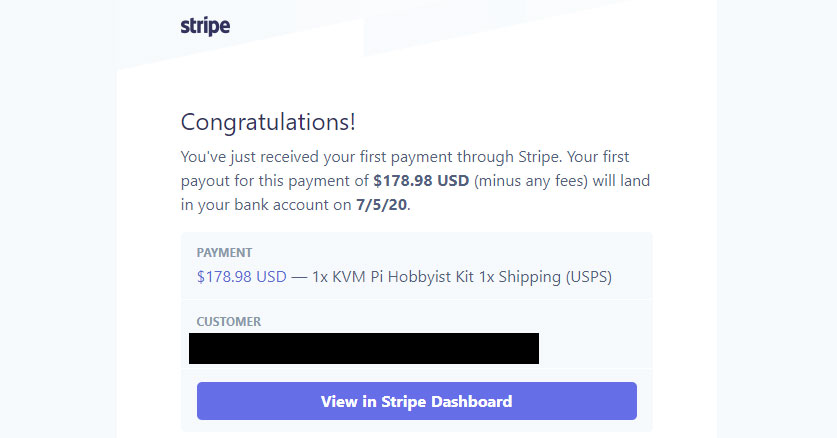

## Highlights

* I sold my first pre-order for [KVM Pi](https://kvmpi.com)
* I sold an Enterprise plan for Zestful

## Goal Grades

At the start of each month, I declare what I'd like to accomplish. Here's how I did against those goals:

### Validate ideas for a sister product to Is It Keto

* **Result**: Tried a few different landing pages, but nothing gained traction
* **Grade**: B-

TODO

### Add 30 new articles to Is It Keto

* **Result**: Added 30 new articles to Is It Keto
* **Grade**: A

TODO

### Create a working Pi-based KVM over IP, controllable through the web browser

* **Result**: Created [KVM Pi](https://kvmpi.com), which works better than I expected
* **Grade**: A

KVM Pi now works and is extremely usable. I thought the first version would be more finicky or brittle, but I've been using it to [manage my server](kvmpi-os-install.mp4) and [run demos](kvmpi-typing-demo.mp4), and it's all pretty smooth.

There are [a few bugs](https://github.com/mtlynch/kvmpi/milestone/2) I want to close before I start shipping them next week. I'm also working on a blog post and YouTube video that I think can generate excitement around it.

## Stats

### Revenue overview

| Project     | May 2020 | June 2020 | Change                                       |
|-------------|----------|-----------|----------------------------------------------|
| [Is It Keto](https://isitketo.org)  | $221.53  | $180.66   | -$40.87 (-18%)      |
| [Zestful](https://zestfuldata.com)     | $6.48    | $685.26   | +$678.78 (+10475%) |
| [KVM Pi](https://kvmpi.com)      | N/A      | $173.94   | N/A |
| **Total**   | **$228.01** | **$1,039.86** | +$811.85 (+356%) |

### [Is It Keto](https://isitketo.org)

| Metric                    | May 2020    | June 2020   | Change                                      |
| ------------------------- | ----------- | ----------- | ------------------------------------------- |
| Unique Visitors           | 50,352      | 57,166      | +6,814 (+14%)    |
| Total Pageviews           | 99,391      | 109,721     | +10,330 (+10%)   |
| Domain Rating (Ahrefs)    | 27.0        | 8.0         | -19.0 (-70%)       |
| AdSense Earnings          | $109.92     | $85.81      | -$24.11 (-22%)     |
| Amazon Affiliate Earnings | $111.61     | $94.85      | -$16.76 (-15%)     |
| **Total Earnings**        | **$221.53** | **$180.66** | **-$40.87 (-18%)** |

My visitors grew by 14%, but it's hard to know if that's due to general trends in keto or from actual improvements in the site. [Rough numbers on Google Trends](https://trends.google.com/trends/explore?date=today%203-m&geo=US&q=keto) suggest that search interest in keto grew by about 5% from May to June, so hopefully I'm growing faster than the baseline.

My earnings are disappointingly shriveling up. Amazon slashed their affiliate payout rates [back in April](https://www.cnbc.com/2020/04/14/amazon-slashes-commission-rates-for-affiliate-program.html), and that's been stinging Is It Keto ever since. I've tried to switch to alternative affiliate programs, but I haven't earned much through them (more on that [below](#being-an-affiliate-sucks)).

AdSense revenue is down, but that was intentional because I replaced my primary ad slot with my own ad for new product ideas.

Ahrefs must have adjusted their algorithm because I dropped from 27 to 8. It doesn't *really* matter because they're just trying to approximate my ranking in Google's eyes, and my Google traffic has increased, but it makes the score a bit meaningless now.

## Validating keto product ideas

One of my goals last month was to do something more substantial with Is It Keto's 50k+ monthly visitors. I have a large stream of readers interested in a particular topic, so it would be great if I could build my own product that caters to them rather than relying on ever-shrinking revenue from ad networks and affiliate partners.

My first idea was something basically like [wip.chat](https://wip.chat). People could post photos

When they signed up for the mailing list, they received an email that looked like this:

It seemed like people were casually interested, but nobody was really gung-ho about the idea. And I certainly didn't want to rush into building anything before I could talk to any users.

## Keto interviews: seemed like a good idea at the time

With my email outreach failing to attract any users to talk to me, I was reminded of a site I partnered with three years ago when I was working on KetoHub. It was a keto newsletter called [keto.fm](https://newsletter.keto.fm/). I found them because their founder, [Dhruv Kar](https://www.wints.org/), was active on [Indie Hackers](https://indiehackers.com), so I sponsored

One of keto.fm's interesting growth strategies was ["keto stories."](https://newsletter.keto.fm/stories/) They'd find people who posted progress photos on keto subreddits, then invite them to be featured in their newsletter. The people who received invitations were flattered enough at the attention to provide a text interview, keto.fm gained free content, and the interviewees probably spread the newsletter to their friends.

I thought I could do the same thing for Is It Keto's sister site, but with one tweak: when asking them about their experience with keto, I'd pay special attention to their experience with software tools and online communities. Everyone would win! They'd get the same experience of being featured on a keto site. I'd get content to build up my new site **and** I'd get valuable customer insight to help inform the direction of the new site.

But it didn't go as planned.

First, my response rate was terrible. I reached out to 16 redditors, and only got interviews with two of them. I tried to be as available as possible so I offered either a scheduled slot or "just pop into Slack whenever you're available." But this meant that *I* had to be constantly monitoring my Slack channel all the time, which was a big focus-killer.

{{}}

The other big problem is that if I spend the entire interview asking about product ideas, they'll feel like I lied to them. So I did still ask them about how online communities influenced their experience with keto and what tools they used, but it only took up five to eight minutes of a 30-minute interview, so I didn't get as much information as I'd have liked.

Lastly, I have to actually *write* these interviews. So for each interview, I have to spend three or four hours editing it into something that reads like a decent interview. They volunteered their time to me, and I promised to write an article about them in return.

## Being an affiliate sucks

In my last retrospective, I had this [fantastic revelation](/retrospectives/2020/06/#doing-more-with-is-it-ketos-audience) that with 50k+ monthly visitors, I now have enough of a readership to make direct affiliate partnerships with keto companies instead of showing their ads indirectly through Google AdSense.

It's crazy that I'm not taking on more affiliate partnerships. Realized that being an affiliate is sort of awful.

Here's a paraphrased email exchange I had with one of the merchants whose affiliate program I joined:

>**Merchant A**: Congratulations! You're in our affiliate program. Here's a link to our homepage that will give you an affiliate fee if users click it. 
>**Me**: Great, could you give me an Is It Keto coupon code? It's much easier to incentivize my readers to visit your site if they get a discount. 
>**Merchant A**: Absolutely! Your readers can use the code `10OFF` to get 10% off their order! 
>**Me**: So... that looks like it's just a generic coupon code you give to anyone. Will I get credit for sales that use that coupon code? 
>**Merchant A**: No, you need to get them to click your custom link **and** use the coupon code. 
>**Me**: Okay, so that's not really how affiliate codes work. Let me know when you can credit me for coupons, and then I'll promote your site. 
>**Merchant A**: Oh! If you want coupon codes, you should actually join this other platform we use to manage affiliates. They'll give you a custom coupon code. 
>**Me**: Okay, great, I've signed up on that platform. 
>**Merchant A**: Oh, we're actually not able to access information you submit to our affiliate program. Can you enter the exact same information into this Typeform? 
>**Me**: Okay, fine. 
>**Merchant A**: Great! You're now in our affiliate program again! You can find your custom coupon code in your affiliate dashboard. 
>**Me**: Okay, I just tried testing my coupon code, and it doesn't work. 
>**Merchant A**: Oh! Coupon codes are not valid for any of our flagship products. This is not documented anywhere and can change at any time without notice. Thanks for sharing this code with your readers!

The most ridiculous part is I depend on this merchant's competence to accurately track sales I bring them. I can track how many people click my links, but anything that happens on their site is opaque to me, so I have to just trust them to count my earnings properly.

I joined affiliate programs for two other merchants. When I asked them for banner ads to include on my site, they sent me raw photos of their products and invited me to design my own ads and copy. Huh? I understand that my job as the affiliate is to drive well-matched customers to their site, but designing ads seems like their responsibility.

I'm not sure if I just have unreasonable expectations or the affiliate programs for the keto industry are kind of amateurish in general. I get the sense that these affiliate reps deal mostly with Instagram or YouTube influencers, so they're not old enough to remember what a website is.

## Selling my first hardware device

Okay, I feel like this retrospective has been mostly negative, so now for some good news: I sold my first KVM Pi!

{{}}

Created a [survey](kvmpi-survey.png)

TODO: KVM Pi photo

## Legacy projects

Here are some brief updates on projects that I still maintain but are not the primary focus of my development:

### [Zestful](https://zestfuldata.com)

| Metric                   | May 2020  | June 2020   | Change                                            |
| ------------------------ | --------- | ----------- | ------------------------------------------------- |
| Unique Visitors          | 467       | 369         | -98 (-21%)               |
| Total Pageviews          | 1,258     | 995         | -263 (-21%)              |
| RapidAPI Earnings        | $6.48     | $5.86       | -$0.62 (-10%)            |
| Enterprise Plan Earnings | $0.00     | $679.40     | +$679.40 (+inf%)       |
| **Total Earnings**       | **$6.48** | **$685.26** | **+$678.78 (+10475%)** |

This was a good month for Zestful, as I sold a new Enterprise plan. The customer was a small bootstrapped company, so I offered a significant discount and shorter contract length.

I was nervous because I've found that customers who can't pay the standard rate tend to be more difficult to work with, but things have been smooth so far.

## Wrap up

### What got done?

* Created [a server administration device](https://kvmpi.com) and sold my first unit.
* Tested two ideas for sister products to Is It Keto (both duds).

### Lessons learned

* When offering people something in exchange for participating in a customer interview, make sure the offer won't become burdensome if your plans change.

### Goals for next month

* Sell 10 KVM Pi units.
* Publish a blog post about KVM Pi.
* Write up the interviews I promised my keto interviewees.