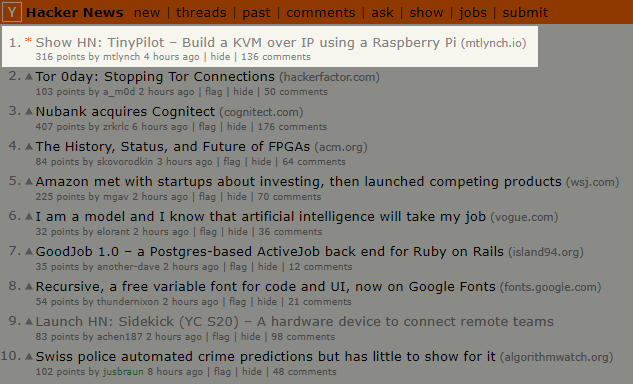
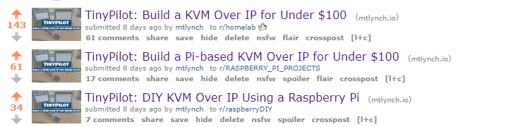
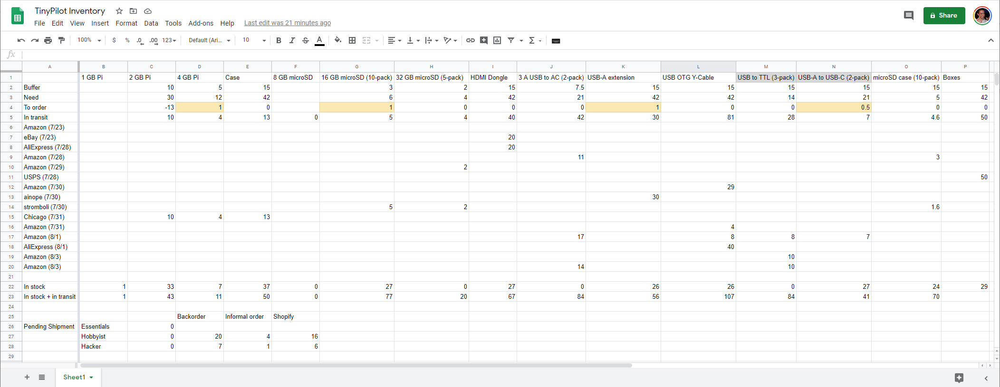

## Highlights

- This is my highest revenue month ever, at $9.8k across all of my projects.
- [Tiny Pilot](https://tinypilotkvm.com/) had the biggest first month of anything I've ever launched, at 52 sales and $8.7k in revenue.
- The sudden surge in customers also made it one of my highest-stress months since [going full-time to work for myself](/why-i-quit-google/).

## Goal Grades

At the start of each month, I declare what I'd like to accomplish. Here's how I did against those goals:

### Publish a blog post about TinyPilot

- **Result**: Published ["TinyPilot: Build a KVM Over IP for Under $100,"](/tinypilot/) which attracted 48k readers in its first week
- **Grade**: A

This post took a long time to write, as it involved lots of screenshots, product photos, and a video demo. I'm happy with the way it turned out. The surge in sales definitely made the extra effort feel justified.

### Sell 10 TinyPilot units

- **Result**: Sold 52 TinyPilot units
- **Grade**: A+

Prior to my blog post, I had only sold two TinyPilot kits. The article led to a burst of orders, far exceeding my goal.

### Write up the interviews I promised to my keto interviewees

- **Result**: Published the interviews to [Keto Cornerstone](https://ketocornerstone.com/)
- **Grade**: A

Keto Cornerstone was a [project idea I had in June](/retrospectives/2020/07/#validating-keto-product-ideas) that I've since abandoned. Still, I had interviewed people with the promise of publishing their stories, so I wanted to honor that commitment. I [put up their interviews](https://ketocornerstone.com/stories) and tried to make the website look decent, but it's safe to say that project is now dead.

## TinyPilot stats

| Metric            | June 2020   | July 2020     | Change                                             |
| ----------------- | ----------- | ------------- | -------------------------------------------------- |
| Unique Visitors   | 51          | 4,930         | +4,879 (+9567%)         |
| Total Pageviews   | 220         | 10,427        | +10,207 (+4640%)        |
| **Total Revenue** | **$173.94** | **$8,741.37** | **+$8,567.43 (+4926%)** |

Obviously, this was a huge launch month for TinyPilot, and sales went far better than I expected.

Revenue is misleading because it's a hardware kit, so my costs per-unit are significant. It's difficult to calculate profits accurately because I'm buying a lot of inventory in advance, so it would be tedious to dissect my receipts to isolate the costs associated with the units I've already sold. Instead, I'll say that my margins are around 40-50%, so the profit for the month was around $4k.

## Aligning my blog with my business (finally)

For the past few years, I've had several minor hit blog posts, attracting 30k-200k readers the week I publish them. They've also been relatively successful on tech social media sites like Reddit, Twitter, and Hacker News.

For most indie developers, reaching #1 on Hacker News would be a massive boon to their business. My problem has always been that my businesses cater to a different market than my blog audience. Nobody says, "I really like Michael's [opinions on code reviews](/human-code-reviews-1/). Now, I'm going to visit [his keto website](https://isitketo.org/) and purchase a lot of food through his affiliate links."

I knew the [TinyPilot blog post](/tinypilot/) would be different before I published it. The audience for that article obviously had a strong overlap with likely customers of my [TinyPilot kits](https://tinypilotkvm.com/). If I could attract interest in the blog post, sales would likely follow.

Fortunately, the blog post got a positive response. It reached the #1 spot on Hacker News and stayed there for most of the day. It attracted 22k readers on its first day and 52k total since then.


{{}}
{{}}


The downside of this response was that I underestimated demand. I only had enough inventory on hand to ship nine kits, so I was sold out midday through my blog post launch.

It's a shame I wasn't able to capitalize better on the surge of interest, but I was nervous about buying thousands of dollars of inventory in the event that my product flopped. Looking back, I should have been more strategic in pre-buying inventory. The HDMI dongles ship the slowest, but they're also one of the cheapest pieces. I could have simply ordered 100 of those along with some of the other low-cost parts. That would have allowed me to manage a surge by rush-ordering the rest and get back in business within 2-3 days.

## Managing inventory is hard

Ever since the blog post, managing inventory has taken up 30% of my time and occupied 80% of my thoughts. I keep obsessively checking delivery status on all of my orders and worrying that my orders will grind to a halt because I run out of one piece of the kit.

As of this writing, I could clear my 22-order backlog right now, but I'm out of [USB to TTL cables](https://smile.amazon.com/gp/product/B07D9R5JFK/). That was a part I never worried about sourcing because it consistently arrived within two days of my order. Now turnaround has ballooned to one week, possibly because I'm competing with my readers for a limited supply.

Here are some other scaling issues I've discovered in managing inventory for physical goods:

- When you have 10-20 orders in transit at once across different merchants, it becomes difficult to track what you need and when a full set will be available.
- Delivery estimates decrease in accuracy and consistency when you order in larger quantities.
- Certain suppliers cap online orders to 10 units and only take larger quantities through purchase orders via email, which add 2-3 business days.
- When you order thousands of dollars in inventory, your credit card maxes out.
- When you order items from Chinese merchants, your credit card gets flagged for fraud.
- You can get stuck on shipping by running out of items that you don't typically think of as "inventory" like cardboard boxes, bubble wrap, or tape.

I've searched for inventory management software to match my use case but come up empty. The simple apps don't understand the concept of raw materials and assume that everything in your inventory is an item you'd sell as-is. The complex options support my use-case, which they call "kitting," but they also assume that I have multiple warehouses, shipping clerks, and purchase orders. They also cost $80-500/month, which feels too steep at this point.

My current solution is a dopey spreadsheet where I track all the parts I need along with what I have in stock and what's in transit. It's an inelegant solution, but it's mostly working in the short term.

{{}}

I'm hoping that once I get through this backlog, inventory won't be so complicated. For each part, I can set a range of units I want to keep in stock and resupply when I fall below the lower threshold. Hopefully, I can pick numbers high enough to absorb spikes in purchases and have enough left to sustain me until a delivery of new parts arrives.

## Managing stress is harder

One of the unexpected side effects of a successful project has been stress.

I generally do a good job of turning off my work brain at dinnertime and pick things up the following morning. The first week after the blog post, I was fretting about TinyPilot constantly. I slept only 3-4 hours per night for four days after the blog post. I wasn't up late doing anything useful, just ruminating on worst-case scenarios.

At the time of the sales rush, only two people had ever used TinyPilot, and one of them was me. I successfully tested it on two of my servers, but what if there were huge classes of hardware that were incompatible for some reason? I had used TinyPilot for real work tasks, but what if there was some common use case where it failed miserably? Was Raspberry Pi even the right hardware for TinyPilot, or should I switch to another platform before spending thousands on inventory?

After a week, all of the paying customers I spoke to said they were up and running with no issues, and they seemed delighted with the product. That relaxed me and eliminated a major class of worry. I then moved on to worrying about inventory and shipping logistics, but I'm feeling more comfortable now that I'm moving toward a sustainable system.

The stress of the project is lower now that things feel under control. My sleep has returned to normal, though I still find it difficult to shut off once I stop working for the day.

## How can I make TinyPilot sustainable?

Currently, customers can build TinyPilot without purchasing anything from me. The DIY nature was, of course, what drew people to my blog post.

People do still order official TinyPilot kits, and I believe there are two reasons:

1. They prefer to receive an all-in-one kit rather than ordering their parts piecemeal.
1. They're essentially donating money to me to show appreciation for the project.

The problem is that neither of these is a particularly strong incentive. The majority of people likely prefer to pay 50% less by ordering their own parts.

The blog post led to a spike in sales, but sales have dwindled since then. There were two orders last week and only one this week. Granted, I've paused marketing and listed the items as backordered, but I suspect that the initial orders were mostly a temporary wave.

The day my blog post went up and drove $4k in sales, my girlfriend jokingly said, "Oh, great! You should do that every day." The problem is obviously that I can't hit the front page of Hacker News every day. I need something I can offer to customers that provides enough value to them that they'll pay, even when TinyPilot isn't a shiny new project.

I'm looking for ways to make what I offer to customers more valuable than what they can build on their own, and I see the following three options:

1. Offer custom enclosures/cases, so it feels more like a self-contained product than a collection of hobbyist parts.
1. Offer custom hardware that's optimized for TinyPilot's functionality.
1. Offer paid software features.

Because I'm a software developer, I'm leaning toward (3).

Last Friday, I put up a teaser for [TinyPilot Pro](https://tinypilotkvm.com/product/tinypilot-pro) and braced myself for a backlash from people who felt betrayed that I'm not staying pure and open source, but there's been no pushback yet.

Several customers have asked for cloud management features, which sound lucrative but also require major adjustments to my lifestyle. The idea is that TinyPilots could phone home to a cloud server, and then customers would be able to access their devices anywhere on the Internet without configuring VPNs or firewall rules. This would be an obvious way to collect recurring revenue because users would likely pay upwards of $50/month for TinyPilot cloud management.

The problem is that an outage of this service would be A Big Deal, so I'd have to stay on-call constantly. I highly value my freedom to disconnect from work, so offering such a service would add significant stress to my life. It's possible that I can partner with a larger company like [remote.it](https://remote.it/) for this service, but that also potentially gives the vendor excessive control over my business.

## Legacy projects

Here are some brief updates on projects that I still maintain but are not the primary focus of my development:

### [Is It Keto](https://isitketo.org)



| Metric                    | June 2020   | July 2020   | Change                                          |
| ------------------------- | ----------- | ----------- | ----------------------------------------------- |
| Unique Visitors           | 46,386      | 48,231      | +1,845 (+4%)         |
| Total Pageviews           | 109,721     | 118,980     | +9,259 (+8%)         |
| Domain Rating (Ahrefs)    | 8.0         | 8.0         | 0                                               |
| AdSense Earnings          | $85.81      | $208.86     | +$123.05 (+143%)     |
| Amazon Affiliate Earnings | $94.85      | $134.45     | +$39.60 (+42%)       |
| Other Affiliate Earnings  | N/A         | $26.60      | N/A                                             |
| **Total Revenue**         | **$180.66** | **$369.91** | **+$189.25 (+105%)** |

Over the past two months, I tried shifting Is It Keto's ads away from AdSense and Amazon and towards [direct affiliate partnerships](/retrospectives/2020/07/#being-an-affiliate-sucks) and [landing pages for my sister products](/retrospectives/2020/07/#validating-keto-product-ideas). Direct deals earned almost zero revenue, and I even caught one company [cheating their affiliates](https://www.reddit.com/r/juststart/comments/hsfaq7/how_to_deal_with_merchant_who_is_defrauding/). I've switched the ads back to 100% boring AdSense and Amazon ads, which is why ad revenue is back up.

The site's metrics are strong enough that I now qualify to apply to the [AdThrive network](https://www.adthrive.com/). According to some reports I've seen, AdThrive beats AdSense's payouts by 2-8x, which would be a gamechanger for Is It Keto.

It's now been two months since I used [programmatic page generation](/retrospectives/2020/05/#venturing-into-auto-generated-pages) to [grow Is It Keto's content by 50%](/retrospectives/2020/06/#add-100-new-articles-to-is-it-keto). It's still unclear if that's working. The new pages account for only 7.6k clicks from Google Search in the last three months out of 122k total, but it's possible that they're still growing and leading to more pageviews once visitors are on the site.

### [Zestful](https://zestfuldata.com)



| Metric                   | June 2020   | July 2020  | Change                                       |
| ------------------------ | ----------- | ---------- | -------------------------------------------- |
| Unique Visitors          | 369         | 440        | +71 (+19%)        |
| Total Pageviews          | 995         | 1,247      | +252 (+25%)       |
| RapidAPI Earnings        | $5.86       | $18.05     | +$12.19 (+208%)   |
| Enterprise Plan Earnings | $679.40     | $0.00      | -$679.40 (-100%)    |
| **Total Revenue**        | **$685.26** | **$18.05** | **-$667.21 (-97%)** |

Zestful had a quiet month. There were no new inbound inquiries. The small customer who signed up for an enterprise plan last month chose not to renew, as expected. Earnings on RapidAPI remained in the sub-$100 range.

### mtlynch.io (this blog)

| Metric                        | June 2020  | July 2020   | Change                                          |
| ----------------------------- | ---------- | ----------- | ----------------------------------------------- |
| Unique Visitors               | 12,518     | 49,957      | +37,439 (+299%)      |
| Total Pageviews               | 25,042     | 79,921      | +54,879 (+219%)      |
| **Amazon Affiliate Earnings** | **$39.02** | **$649.45** | **$610.43 (+1564%)** |

I generally don't track stats for this blog, but I'm including them this month exclusively for a brag I want to make in the following section.

Revenue-wise, July was an outlier month for the blog because many readers purchased equipment to make their own TinyPilots through the [affiliate links in my tutorial](/tinypilot/#parts-list).

### Revenue summary

| Metric     | June 2020     | July 2020     | Change                                            |
| ---------- | ------------- | ------------- | ------------------------------------------------- |
| TinyPilot  | $173.94       | $8,741.37     | +$8,567.43 (+4926%)    |
| Is It Keto | $180.66       | $369.91       | +$189.25 (+105%)       |
| Zestful    | $685.26       | $18.05        | -$667.21 (-97%)          |
| mtlynch.io | $39.02        | $649.45       | $610.43 (+1564%)       |
| **Total**  | **$1,078.88** | **$9,778.78** | **+$8,699.90 (+806%)** |

July was the strongest revenue month I've ever had. In fact, it's $200 higher than [my revenue from all of 2018 and 2019, combined](/solo-developer-year-2/#how-i-made-and-spent-money). It brings me to $13.1k for 2020, and makes my goal of [$20k in revenue by the end of 2020](/solo-developer-year-2/#goals-for-year-three) seem very possible.

## Wrap up

### What got done?

- Launched TinyPilot and sold 52 units.
- Published the blog post ["TinyPilot: Build a KVM Over IP for Under $100,"](/tinypilot/) which led to a spike in TinyPilot sales.
- Set up a sales and shipping workflow on top of Shopify.
- Commissioned a [logo for TinyPilot](https://tinypilotkvm.com/images/og-logo.png).

### Lessons learned

- When ordering inventory, allocate larger buffers for items that have longer delivery turnarounds and/or are cheaper to hold.
- [Don't use Stripe to sell physical items](https://twitter.com/deliberatecoder/status/1288271098262544385).
  - Shopify is superior in every way.
- When ordering raw materials, use at least two suppliers for each item.
  - Split/rotate your orders between them so you're not at the mercy of a single vendor.
- Be skeptical of merchant-supplied delivery dates.
  - There's infinitely more accuracy in the delivery date from USPS/UPS/FedEx once it's in their possession.
  - On Amazon, eBay, and AliExpress, many of the merchants claim to be shipping from the US, but I suspect that they're ordering from China when you order and re-shipping the item to you.

### Goals for next month

- Sell 30 TinyPilot kits.
- Test three new marketing channels, such as search ads or influencer marketing.
- Implement TinyPilot support for mouse integration.
  - I'll finally be able to make an honest initial out of the M in TinyPilot [KVM](https://en.wikipedia.org/wiki/KVM_switch).
